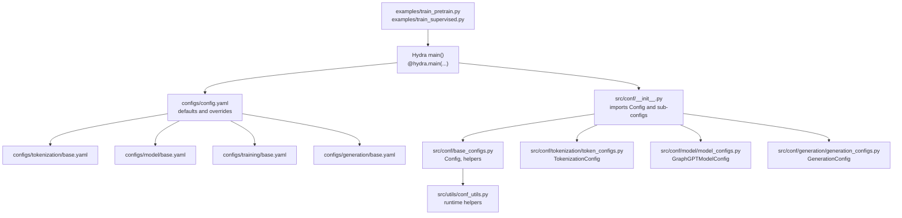
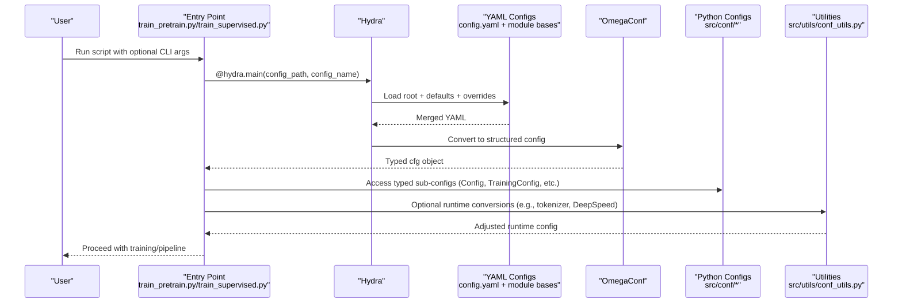
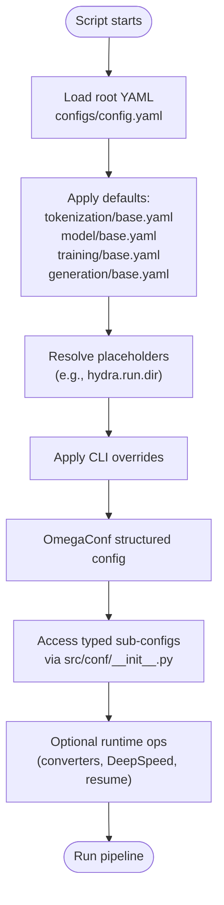
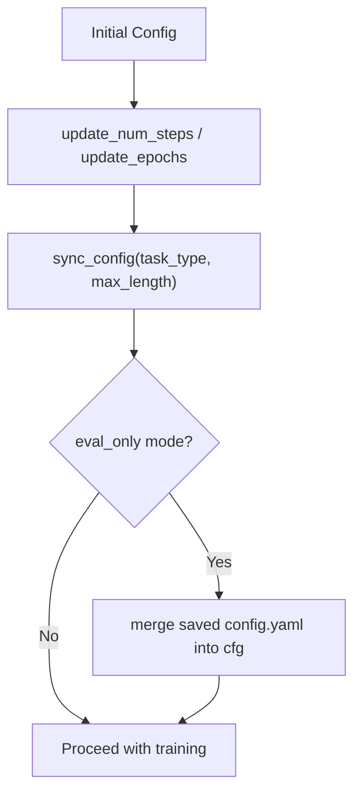
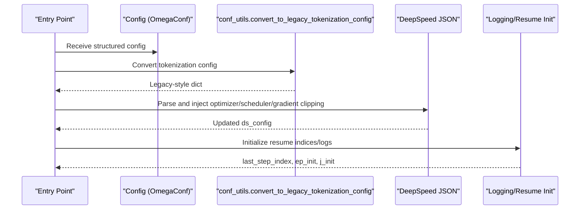
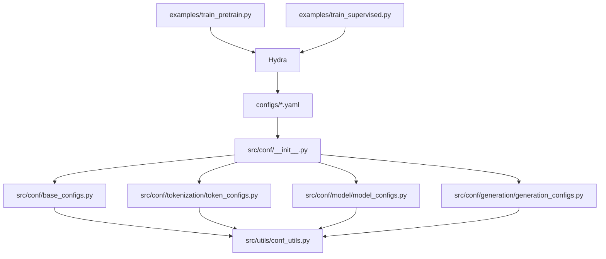
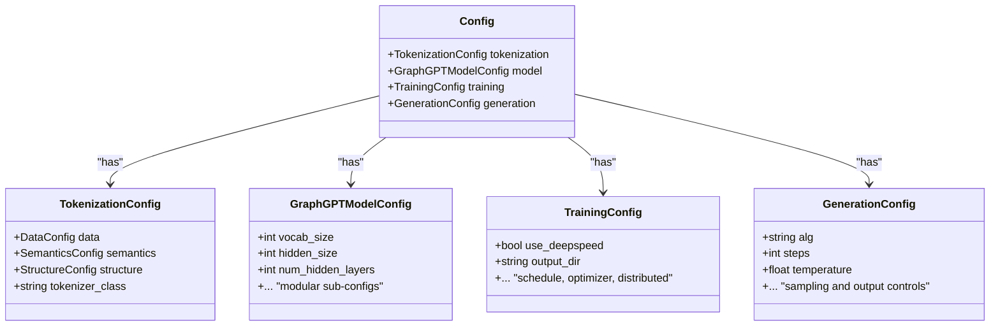

# Configuration Loading Mechanism

<cite>
**Referenced Files in This Document**
- [examples/train_pretrain.py](file://examples/train_pretrain.py)
- [examples/train_supervised.py](file://examples/train_supervised.py)
- [configs/config.yaml](file://configs/config.yaml)
- [configs/README.md](file://configs/README.md)
- [configs/model/base.yaml](file://configs/model/base.yaml)
- [configs/tokenization/base.yaml](file://configs/tokenization/base.yaml)
- [configs/training/base.yaml](file://configs/training/base.yaml)
- [configs/generation/base.yaml](file://configs/generation/base.yaml)
- [src/conf/base_configs.py](file://src/conf/base_configs.py)
- [src/conf/__init__.py](file://src/conf/__init__.py)
- [src/conf/model/model_configs.py](file://src/conf/model/model_configs.py)
- [src/conf/tokenization/token_configs.py](file://src/conf/tokenization/token_configs.py)
- [src/conf/generation/generation_configs.py](file://src/conf/generation/generation_configs.py)
- [src/utils/conf_utils.py](file://src/utils/conf_utils.py)
</cite>

## Table of Contents
1. [Introduction](#introduction)
2. [Project Structure](#project-structure)
3. [Core Components](#core-components)
4. [Architecture Overview](#architecture-overview)
5. [Detailed Component Analysis](#detailed-component-analysis)
6. [Dependency Analysis](#dependency-analysis)
7. [Performance Considerations](#performance-considerations)
8. [Troubleshooting Guide](#troubleshooting-guide)
9. [Conclusion](#conclusion)
10. [Appendices](#appendices)

## Introduction
This document explains the configuration loading and management mechanism in Graph-GPT. It covers how Hydra and OmegaConf integrate with the project’s configuration system, the configuration loading process, parameter resolution and precedence, runtime updates and dynamic parameter modification, environment-specific settings, caching and reloading, best practices for distributed training, debugging/logging, and versioning/migration strategies.

## Project Structure
Graph-GPT organizes configuration into two complementary layers:
- YAML-based layered configuration under configs/, with defaults and overrides controlled via Hydra.
- Python dataclass-based configuration under src/conf/, which mirrors and augments the YAML structure and provides runtime helpers.

**Diagram sources**
- [examples/train_pretrain.py:12-14](file://examples/train_pretrain.py#L12-L14)
- [examples/train_supervised.py:12-14](file://examples/train_supervised.py#L12-L14)
- [configs/config.yaml:1-20](file://configs/config.yaml#L1-L20)
- [configs/tokenization/base.yaml:1-117](file://configs/tokenization/base.yaml#L1-L117)
- [configs/model/base.yaml:1-222](file://configs/model/base.yaml#L1-L222)
- [configs/training/base.yaml:1-78](file://configs/training/base.yaml#L1-L78)
- [configs/generation/base.yaml:1-40](file://configs/generation/base.yaml#L1-L40)
- [src/conf/__init__.py:1-13](file://src/conf/__init__.py#L1-L13)
- [src/conf/base_configs.py:186-204](file://src/conf/base_configs.py#L186-L204)
- [src/conf/tokenization/token_configs.py:115-127](file://src/conf/tokenization/token_configs.py#L115-L127)
- [src/conf/model/model_configs.py:246-326](file://src/conf/model/model_configs.py#L246-L326)
- [src/conf/generation/generation_configs.py:26-97](file://src/conf/generation/generation_configs.py#L26-L97)
- [src/utils/conf_utils.py:1-232](file://src/utils/conf_utils.py#L1-L232)

**Section sources**
- [configs/README.md:1-18](file://configs/README.md#L1-L18)
- [configs/config.yaml:1-20](file://configs/config.yaml#L1-L20)

## Core Components
- Hydra entry points: The training scripts decorate a function with @hydra.main pointing to the YAML config root. This bootstraps configuration loading and CLI override parsing.
- YAML defaults: The root config defines defaults for tokenization, model, training, and generation modules, plus Hydra run/sweep output directories.
- Python dataclasses: src/conf exposes strongly typed configuration classes mirroring the YAML structure. They also provide helper functions for runtime adjustments (e.g., schedule computation, merging saved config, tokenizer conversion).
- Runtime utilities: src/utils/conf_utils.py converts configurations to legacy formats, parses DeepSpeed JSON, and initializes logging/resume states.

Key responsibilities:
- Layered YAML composition and override precedence
- Parameter resolution and dynamic synchronization
- Programmatic manipulation and environment-specific settings
- Logging and resume coordination

**Section sources**
- [examples/train_pretrain.py:12-14](file://examples/train_pretrain.py#L12-L14)
- [examples/train_supervised.py:12-14](file://examples/train_supervised.py#L12-L14)
- [configs/config.yaml:2-8](file://configs/config.yaml#L2-L8)
- [src/conf/base_configs.py:186-204](file://src/conf/base_configs.py#L186-L204)
- [src/utils/conf_utils.py:30-46](file://src/utils/conf_utils.py#L30-L46)

## Architecture Overview
The configuration lifecycle:
1. Hydra loads the root YAML and merges module-level YAMLs according to defaults.
2. Hydra resolves placeholders and applies CLI overrides.
3. The decorated function receives a structured OmegaConf object.
4. Python dataclasses in src/conf provide typed access and runtime helpers.
5. Utilities adjust configurations for runtime needs (DeepSpeed, resume, tokenizer).

**Diagram sources**
- [examples/train_pretrain.py:12-14](file://examples/train_pretrain.py#L12-L14)
- [examples/train_supervised.py:12-14](file://examples/train_supervised.py#L12-L14)
- [configs/config.yaml:1-20](file://configs/config.yaml#L1-L20)
- [src/conf/__init__.py:1-13](file://src/conf/__init__.py#L1-L13)
- [src/utils/conf_utils.py:30-46](file://src/utils/conf_utils.py#L30-L46)

## Detailed Component Analysis

### Hydra/OmegaConf Integration
- Entry points: Both pretraining and supervised training scripts use @hydra.main with config_path="../configs" and config_name="config". This tells Hydra where to find the root YAML and how to merge module-level YAMLs.
- Defaults: The root config lists defaults for tokenization, model, training, and generation, ensuring a consistent baseline across runs.
- Overrides: CLI arguments are parsed and applied after YAML composition. The examples show how to pass overrides to the decorated function.

**Diagram sources**
- [examples/train_pretrain.py:12-14](file://examples/train_pretrain.py#L12-L14)
- [examples/train_supervised.py:12-14](file://examples/train_supervised.py#L12-L14)
- [configs/config.yaml:2-8](file://configs/config.yaml#L2-L8)
- [src/conf/__init__.py:1-13](file://src/conf/__init__.py#L1-L13)

**Section sources**
- [examples/train_pretrain.py:12-14](file://examples/train_pretrain.py#L12-L14)
- [examples/train_supervised.py:12-14](file://examples/train_supervised.py#L12-L14)
- [configs/config.yaml:2-8](file://configs/config.yaml#L2-L8)

### Configuration Loading Process and Precedence
- Precedence order (highest to lowest):
  1) CLI overrides (OmegaConf from_cli)
  2) Root YAML defaults and overrides
  3) Module YAMLs (tokenization/base.yaml, model/base.yaml, training/base.yaml, generation/base.yaml)
  4) Hydra built-in overrides (e.g., hydra/launcher override in root YAML)
- Placeholders: The root YAML uses hydra.run.dir and hydra.sweep.dir placeholders resolved at runtime.
- Environment-specific settings: Use Hydra’s override mechanism to switch datasets, tokenizers, or training schedules without editing YAMLs.

Practical tips:
- Keep environment-specific YAMLs under configs/<env>/ and select them via CLI overrides.
- Use override groups for mutually exclusive settings (e.g., dataset variants).

**Section sources**
- [configs/config.yaml:14-19](file://configs/config.yaml#L14-L19)
- [configs/config.yaml:8](file://configs/config.yaml#L8)

### Parameter Resolution and Dynamic Synchronization
- Resolution: OmegaConf resolves interpolations (e.g., hydra.run.dir) and container references during composition.
- Dynamic synchronization: Helper functions in src/conf/base_configs.py adjust derived parameters at runtime:
  - Schedule updates based on tokens, batch size, and world size
  - Sync task type and lengths between training and model configs
  - Merge saved YAML into current config for evaluation-only mode
  - Initialize tokenizer-related generation IDs from tokenizer

**Diagram sources**
- [src/conf/base_configs.py:54-72](file://src/conf/base_configs.py#L54-L72)
- [src/conf/base_configs.py:240-248](file://src/conf/base_configs.py#L240-L248)
- [src/conf/base_configs.py:250-264](file://src/conf/base_configs.py#L250-L264)

**Section sources**
- [src/conf/base_configs.py:54-72](file://src/conf/base_configs.py#L54-L72)
- [src/conf/base_configs.py:240-248](file://src/conf/base_configs.py#L240-L248)
- [src/conf/base_configs.py:250-264](file://src/conf/base_configs.py#L250-L264)

### Runtime Configuration Updates and Dynamic Parameter Modification
- Programmatic manipulation:
  - Convert to legacy tokenizer config for compatibility with older APIs
  - Parse and inject DeepSpeed JSON parameters into training config
  - Resume training by initializing logging indices from checkpoints
- Environment-specific settings:
  - Switch datasets via CLI overrides (e.g., tokenization.data.dataset/data_path)
  - Toggle training modes (pretrain vs. finetune) via task_type and pretrain_mode

**Diagram sources**
- [src/utils/conf_utils.py:30-46](file://src/utils/conf_utils.py#L30-L46)
- [src/utils/conf_utils.py:49-103](file://src/utils/conf_utils.py#L49-L103)
- [src/utils/conf_utils.py:150-175](file://src/utils/conf_utils.py#L150-L175)

**Section sources**
- [src/utils/conf_utils.py:30-46](file://src/utils/conf_utils.py#L30-L46)
- [src/utils/conf_utils.py:49-103](file://src/utils/conf_utils.py#L49-L103)
- [src/utils/conf_utils.py:150-175](file://src/utils/conf_utils.py#L150-L175)

### Configuration Caching and Reloading
- YAML caching: Hydra caches composed configs per run directory. Placeholders like hydra.run.dir ensure unique output paths per run.
- Reloading saved config: During evaluation-only mode, the system merges a previously saved config.yaml into the current configuration to restore exact settings from training.

Best practices:
- Keep hydra.run.dir interpolation to guarantee isolation across runs.
- Save a config.yaml alongside model checkpoints for reproducible evaluation.

**Section sources**
- [configs/config.yaml:14-19](file://configs/config.yaml#L14-L19)
- [src/conf/base_configs.py:250-264](file://src/conf/base_configs.py#L250-L264)

### Distributed Training Configuration Management
- Distributed settings live under training.distributed (world_size, rank).
- Schedule computation depends on world_size; ensure consistent overrides across nodes.
- DeepSpeed integration: Utilities compute effective batch sizes and inject optimizer/scheduler parameters from JSON into ds_config.

Recommendations:
- Use environment variables to set WORLD_SIZE and override training.distributed.rank accordingly.
- Keep DeepSpeed JSON consistent across nodes; inject only necessary runtime parameters.

**Section sources**
- [configs/training/base.yaml:61-63](file://configs/training/base.yaml#L61-L63)
- [src/utils/conf_utils.py:49-103](file://src/utils/conf_utils.py#L49-L103)

### Debugging, Logging, and Troubleshooting
- Debugging:
  - Print merged configuration to stdout to inspect final values.
  - Use OmegaConf.to_yaml to dump structured configs for verification.
- Logging:
  - Resume indices and logs are initialized from checkpoints to continue training seamlessly.
  - Assertions compare computed indices against logged values to detect inconsistencies.
- Troubleshooting:
  - If scheduler types differ between DeepSpeed and PyTorch schedulers, utilities route schedulers appropriately.
  - For eval-only mode, ensure the saved config exists and is merged correctly.

**Section sources**
- [src/utils/conf_utils.py:150-175](file://src/utils/conf_utils.py#L150-L175)
- [src/utils/conf_utils.py:178-231](file://src/utils/conf_utils.py#L178-L231)

### Configuration Versioning and Migration Strategies
- Versioning:
  - Store experiment metadata in hydra.run.dir to associate outputs with specific config versions.
  - Keep a minimal changelog in configs/README.md to track major changes.
- Migration:
  - When renaming or moving fields, add a migration helper to convert old saved config.yaml into the new schema before merging.
  - Maintain backward-compatible defaults in YAML for gradual rollout.

**Section sources**
- [configs/README.md:1-18](file://configs/README.md#L1-L18)

## Dependency Analysis
The configuration system exhibits clear separation of concerns:
- Entry points depend on Hydra to compose configs.
- YAML defaults define the base structure; Python configs add type safety and runtime helpers.
- Utilities depend on OmegaConf and Python configs to perform runtime transformations.

**Diagram sources**
- [examples/train_pretrain.py:12-14](file://examples/train_pretrain.py#L12-L14)
- [examples/train_supervised.py:12-14](file://examples/train_supervised.py#L12-L14)
- [configs/config.yaml:1-20](file://configs/config.yaml#L1-L20)
- [src/conf/__init__.py:1-13](file://src/conf/__init__.py#L1-L13)
- [src/conf/base_configs.py:186-204](file://src/conf/base_configs.py#L186-L204)
- [src/utils/conf_utils.py:1-232](file://src/utils/conf_utils.py#L1-L232)

**Section sources**
- [src/conf/__init__.py:1-13](file://src/conf/__init__.py#L1-L13)
- [src/conf/base_configs.py:186-204](file://src/conf/base_configs.py#L186-L204)

## Performance Considerations
- Minimize repeated recomputation: Compute schedule parameters once and reuse across workers.
- Avoid excessive YAML nesting: Keep frequently changed parameters at top-level for easier overrides.
- Use hydra.run.dir to prevent IO contention across nodes.

## Troubleshooting Guide
- Symptom: Unexpected batch size or gradient accumulation steps.
  - Action: Verify training.batch_size, optimizer.gradient_accumulation_steps, and WORLD_SIZE; recompute effective batch size using utilities.
- Symptom: Scheduler mismatch between DeepSpeed and PyTorch.
  - Action: Ensure ds_config contains supported scheduler types or route to PyTorch schedulers via utilities.
- Symptom: Resume fails due to missing saved config.
  - Action: Confirm output_dir contains config.yaml or config_final.yaml; ensure eval_only mode is set correctly.

**Section sources**
- [src/utils/conf_utils.py:49-103](file://src/utils/conf_utils.py#L49-L103)
- [src/utils/conf_utils.py:178-231](file://src/utils/conf_utils.py#L178-L231)

## Conclusion
Graph-GPT’s configuration system combines Hydra’s powerful composition with OmegaConf’s flexible resolution and Python dataclasses for strong typing and runtime helpers. By leveraging defaults, overrides, and environment-specific YAMLs, teams can manage complex training setups with clarity and reproducibility. Utilities streamline DeepSpeed integration, resume behavior, and dynamic parameter synchronization, while best practices around caching, versioning, and troubleshooting ensure smooth operations in distributed environments.

## Appendices

### Appendix A: Configuration Classes Overview

**Diagram sources**
- [src/conf/base_configs.py:186-204](file://src/conf/base_configs.py#L186-L204)
- [src/conf/tokenization/token_configs.py:115-127](file://src/conf/tokenization/token_configs.py#L115-L127)
- [src/conf/model/model_configs.py:246-326](file://src/conf/model/model_configs.py#L246-L326)
- [src/conf/generation/generation_configs.py:26-97](file://src/conf/generation/generation_configs.py#L26-L97)
