# Configuration System

<cite>
**Referenced Files in This Document**
- [configs/README.md](file://configs/README.md)
- [configs/config.yaml](file://configs/config.yaml)
- [configs/model/base.yaml](file://configs/model/base.yaml)
- [configs/tokenization/base.yaml](file://configs/tokenization/base.yaml)
- [configs/tokenization/graph_lvl/reddit.yaml](file://configs/tokenization/graph_lvl/reddit.yaml)
- [configs/training/base.yaml](file://configs/training/base.yaml)
- [configs/generation/base.yaml](file://configs/generation/base.yaml)
- [src/conf/base_configs.py](file://src/conf/base_configs.py)
- [src/conf/__init__.py](file://src/conf/__init__.py)
- [src/conf/model/model_configs.py](file://src/conf/model/model_configs.py)
- [src/conf/tokenization/token_configs.py](file://src/conf/tokenization/token_configs.py)
- [src/conf/generation/generation_configs.py](file://src/conf/generation/generation_configs.py)
- [examples/train_pretrain.py](file://examples/train_pretrain.py)
- [src/utils/conf_utils.py](file://src/utils/conf_utils.py)
- [src/utils/loader_utils.py](file://src/utils/loader_utils.py)
- [src/data/collator.py](file://src/data/collator.py)
- [src/data/tokenizer/padding.py](file://src/data/tokenizer/padding.py)
- [src/training/pipeline.py](file://src/training/pipeline.py)
- [src/models/graphgpt/modeling_helpers.py](file://src/models/graphgpt/modeling_helpers.py)
- [tests/test_forward_simple.py](file://tests/test_forward_simple.py)
- [tests/test_model_forward_inputs.py](file://tests/test_model_forward_inputs.py)
- [tests/test_forward_minimal.py](file://tests/test_forward_minimal.py)
- [tests/README_FORWARD_TEST.md](file://tests/README_FORWARD_TEST.md)
- [tests/QUICK_START.md](file://tests/QUICK_START.md)
</cite>

## Update Summary
**Changes Made**
- Enhanced documentation of the `sync_config()` function and its role in parameter synchronization across training modes
- Updated training configuration to reflect the evolution of `max_length` from a primarily finetuning parameter to a general training parameter
- Documented the new `pad_to_multiple_of` parameter and its integration with sequence length constraints
- Added comprehensive coverage of the enhanced parameter synchronization logic in `base_configs.py`
- Updated practical examples to demonstrate the broader application of sequence length constraints across all training modes
- Enhanced test configuration management documentation with OmegaConf integration improvements
- **New** Added documentation for the torch.compile configuration system including TorchCompileConfig dataclass, compilation modes, backend selection, and dynamic shape support
- **New** Documented the integration of torch.compile in the training pipeline and model-level optimizations

## Table of Contents
1. [Introduction](#introduction)
2. [Project Structure](#project-structure)
3. [Core Components](#core-components)
4. [Architecture Overview](#architecture-overview)
5. [Detailed Component Analysis](#detailed-component-analysis)
6. [Enhanced Test Configuration Management](#enhanced-test-configuration-management)
7. [Torch Compile Configuration](#torch-compile-configuration)
8. [Dependency Analysis](#dependency-analysis)
9. [Performance Considerations](#performance-considerations)
10. [Troubleshooting Guide](#troubleshooting-guide)
11. [Conclusion](#conclusion)
12. [Appendices](#appendices)

## Introduction
This document explains the Graph-GPT configuration system built on Hydra and OmegaConf. It covers the hierarchical configuration structure, modular sub-configurations for model, training, tokenization, and generation parameters, base configuration files and their relationships, how YAML integrates with dataclass-based validation, configuration loading and precedence, runtime updates, practical examples for datasets and tasks, validation and error handling, extension patterns for custom datasets and experiments, and best practices for parameter tuning.

**Updated** The configuration system now features enhanced parameter synchronization through the `sync_config()` function, which establishes `max_length` as a fundamental training parameter applicable across all training modes, not just finetuning contexts. This enhancement improves consistency and simplifies configuration management across different task types. Additionally, the system now includes comprehensive torch.compile configuration support for GPU kernel optimization and performance improvements.

## Project Structure
The configuration system is organized into:
- A central configuration orchestrator that aggregates modular sub-configs via defaults.
- Modular YAML sub-configs for tokenization, model, training, and generation.
- Dataclass-backed configuration modules that define typed, validated configuration objects.
- Example scripts that bootstrap the configuration via Hydra.
- Enhanced test infrastructure using OmegaConf for structured configuration management.
- **Updated** Torch compile configuration for GPU kernel optimization and performance improvements.

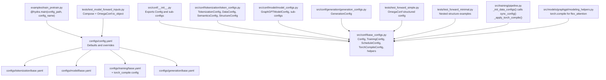

**Diagram sources**
- [configs/config.yaml:1-20](file://configs/config.yaml#L1-L20)
- [configs/tokenization/base.yaml:1-117](file://configs/tokenization/base.yaml#L1-L117)
- [configs/model/base.yaml:1-222](file://configs/model/base.yaml#L1-L222)
- [configs/training/base.yaml:1-118](file://configs/training/base.yaml#L1-L118)
- [configs/generation/base.yaml:1-40](file://configs/generation/base.yaml#L1-L40)
- [src/conf/__init__.py:1-20](file://src/conf/__init__.py#L1-L20)
- [src/conf/base_configs.py:164-184](file://src/conf/base_configs.py#L164-L184)
- [src/conf/base_configs.py:186-204](file://src/conf/base_configs.py#L186-L204)
- [src/conf/tokenization/token_configs.py:115-127](file://src/conf/tokenization/token_configs.py#L115-L127)
- [src/conf/model/model_configs.py:246-326](file://src/conf/model/model_configs.py#L246-L326)
- [src/conf/generation/generation_configs.py:26-97](file://src/conf/generation/generation_configs.py#L26-L97)
- [examples/train_pretrain.py:12-14](file://examples/train_pretrain.py#L12-L14)
- [tests/test_forward_simple.py:46-101](file://tests/test_forward_simple.py#L46-L101)
- [tests/test_model_forward_inputs.py:125-136](file://tests/test_model_forward_inputs.py#L125-L136)
- [tests/test_forward_minimal.py:32-526](file://tests/test_forward_minimal.py#L32-L526)
- [src/training/pipeline.py:147-148](file://src/training/pipeline.py#L147-L148)
- [src/models/graphgpt/modeling_helpers.py:122-125](file://src/models/graphgpt/modeling_helpers.py#L122-L125)

**Section sources**
- [configs/README.md:1-18](file://configs/README.md#L1-L18)
- [configs/config.yaml:1-20](file://configs/config.yaml#L1-L20)
- [src/conf/__init__.py:1-20](file://src/conf/__init__.py#L1-L20)

## Core Components
- Central orchestrator: A single YAML file defines defaults for tokenization, model, training, and generation sub-configs, plus Hydra runtime settings.
- Modular YAML sub-configs: Separate YAML files provide dataset/task-specific overrides layered over base configurations.
- Dataclass-backed configuration: Typed configuration classes define validation and default values, enabling structured, safe configuration objects.
- Example entry point: A script demonstrates how Hydra loads the configuration and passes it to the training pipeline.
- Enhanced test configuration: OmegaConf integration for robust nested structure handling in test scenarios.
- **Updated** Parameter synchronization: The `sync_config()` function establishes `max_length` as a fundamental training parameter applicable across all training modes, not just finetuning contexts.
- **New** Torch compile configuration: Comprehensive configuration for GPU kernel optimization through torch.compile with support for different compilation modes, backends, and dynamic shape handling.

Key relationships:
- The central orchestrator references sub-config names to merge into a unified configuration object.
- The unified configuration object is a dataclass that aggregates sub-configs and exposes helpers for initialization and synchronization.
- The training entry point uses Hydra to instantiate the unified configuration object.
- Test scripts utilize OmegaConf for structured configuration creation and manipulation.
- **Updated** The `sync_config()` function ensures `max_length` cascades from training configuration to model configuration when not explicitly set, and synchronizes task types across components.
- **New** The training pipeline applies torch.compile optimization when enabled, with configurable compilation modes and backend selection.

**Section sources**
- [configs/config.yaml:1-20](file://configs/config.yaml#L1-L20)
- [src/conf/base_configs.py:164-184](file://src/conf/base_configs.py#L164-L184)
- [src/conf/base_configs.py:186-204](file://src/conf/base_configs.py#L186-L204)
- [src/conf/base_configs.py:306-314](file://src/conf/base_configs.py#L306-L314)
- [examples/train_pretrain.py:12-14](file://examples/train_pretrain.py#L12-L14)
- [tests/test_forward_simple.py:46-101](file://tests/test_forward_simple.py#L46-L101)

## Architecture Overview
The configuration architecture follows a layered pattern:
- Base YAML files define sensible defaults for each domain (model, tokenization, training, generation).
- Task/dataset YAML files override base values for specific scenarios.
- Hydra merges defaults and overrides, then instantiates dataclass-backed configuration objects.
- Runtime helpers synchronize and validate configuration across domains.
- Enhanced test infrastructure uses OmegaConf for structured configuration management.
- **Updated** The synchronization logic now establishes `max_length` as a fundamental training parameter that cascades from training configuration to downstream components, ensuring consistent sequence length constraints across all training modes.
- **New** Torch compile configuration provides GPU kernel optimization through configurable compilation modes and backend selection.

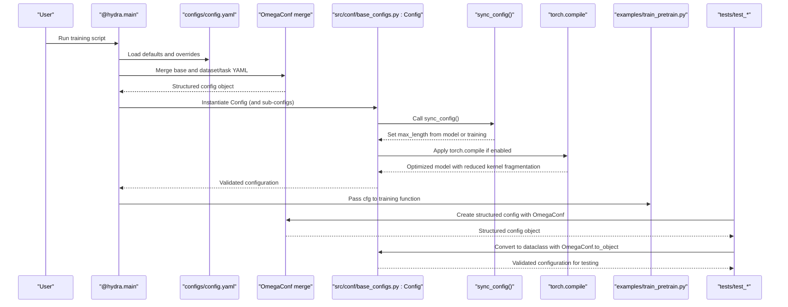

**Diagram sources**
- [examples/train_pretrain.py:12-14](file://examples/train_pretrain.py#L12-L14)
- [configs/config.yaml:1-20](file://configs/config.yaml#L1-L20)
- [src/conf/base_configs.py:164-184](file://src/conf/base_configs.py#L164-L184)
- [src/conf/base_configs.py:186-204](file://src/conf/base_configs.py#L186-L204)
- [src/conf/base_configs.py:306-314](file://src/conf/base_configs.py#L306-L314)
- [src/training/pipeline.py:167-201](file://src/training/pipeline.py#L167-L201)
- [tests/test_forward_simple.py:46-101](file://tests/test_forward_simple.py#L46-L101)
- [tests/test_model_forward_inputs.py:125-136](file://tests/test_model_forward_inputs.py#L125-L136)

## Detailed Component Analysis

### Unified Configuration Dataclass
The unified configuration aggregates sub-configs and provides helpers for initialization and synchronization.

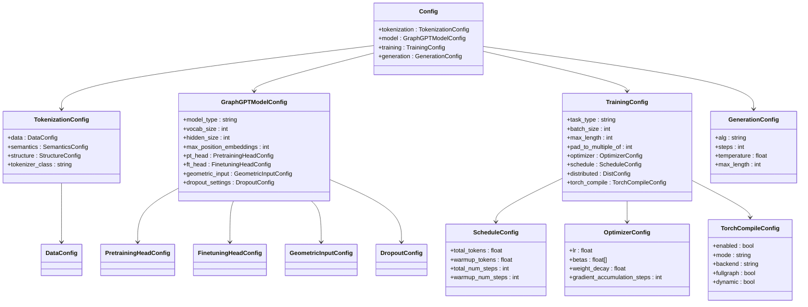

**Diagram sources**
- [src/conf/base_configs.py:164-184](file://src/conf/base_configs.py#L164-L184)
- [src/conf/base_configs.py:186-204](file://src/conf/base_configs.py#L186-L204)
- [src/conf/base_configs.py:132-164](file://src/conf/base_configs.py#L132-L164)
- [src/conf/base_configs.py:35-51](file://src/conf/base_configs.py#L35-L51)
- [src/conf/base_configs.py:76-88](file://src/conf/base_configs.py#L76-L88)
- [src/conf/tokenization/token_configs.py:115-127](file://src/conf/tokenization/token_configs.py#L115-L127)
- [src/conf/model/model_configs.py:246-326](file://src/conf/model/model_configs.py#L246-L326)
- [src/conf/generation/generation_configs.py:26-97](file://src/conf/generation/generation_configs.py#L26-L97)

**Section sources**
- [src/conf/base_configs.py:164-184](file://src/conf/base_configs.py#L164-L184)
- [src/conf/base_configs.py:186-204](file://src/conf/base_configs.py#L186-L204)
- [src/conf/__init__.py:1-20](file://src/conf/__init__.py#L1-L20)

### Tokenization Configuration
Defines dataset selection, semantics, structure, and tokenizer class. Includes nested sub-configs for semantics and structure, and supports ODPS integration.

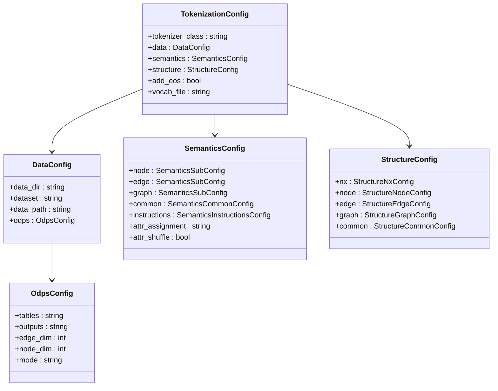

**Diagram sources**
- [src/conf/tokenization/token_configs.py:115-127](file://src/conf/tokenization/token_configs.py#L115-L127)
- [src/conf/tokenization/token_configs.py:19-31](file://src/conf/tokenization/token_configs.py#L19-L31)
- [src/conf/tokenization/token_configs.py:56-65](file://src/conf/tokenization/token_configs.py#L56-L65)
- [src/conf/tokenization/token_configs.py:106-112](file://src/conf/tokenization/token_configs.py#L106-L112)

**Section sources**
- [configs/tokenization/base.yaml:1-117](file://configs/tokenization/base.yaml#L1-L117)
- [src/conf/tokenization/token_configs.py:115-127](file://src/conf/tokenization/token_configs.py#L115-L127)

### Model Configuration
Defines model architecture, GraphGPT-specific parameters, and modular sub-configs for heads and inputs.

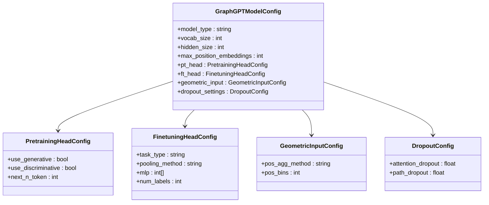

**Diagram sources**
- [src/conf/model/model_configs.py:246-326](file://src/conf/model/model_configs.py#L246-L326)
- [src/conf/model/model_configs.py:58-110](file://src/conf/model/model_configs.py#L58-L110)
- [src/conf/model/model_configs.py:36-45](file://src/conf/model/model_configs.py#L36-L45)
- [src/conf/model/model_configs.py:26-34](file://src/conf/model/model_configs.py#L26-L34)

**Section sources**
- [configs/model/base.yaml:1-222](file://configs/model/base.yaml#L1-L222)
- [src/conf/model/model_configs.py:246-326](file://src/conf/model/model_configs.py#L246-L326)

### Training Configuration
Defines training schedule, optimizer, distributed settings, fine-tuning controls, and **New** torch.compile optimization settings. **Updated** Now recognizes `max_length` as a fundamental training parameter that applies broadly across all training modes, with enhanced synchronization logic.

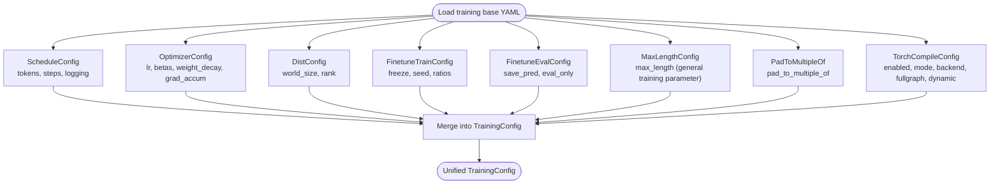

**Diagram sources**
- [configs/training/base.yaml:1-118](file://configs/training/base.yaml#L1-L118)
- [src/conf/base_configs.py:132-164](file://src/conf/base_configs.py#L132-L164)
- [src/conf/base_configs.py:28-51](file://src/conf/base_configs.py#L28-L51)
- [src/conf/base_configs.py:107-130](file://src/conf/base_configs.py#L107-L130)
- [src/conf/base_configs.py:164-184](file://src/conf/base_configs.py#L164-L184)

**Section sources**
- [configs/training/base.yaml:1-118](file://configs/training/base.yaml#L1-L118)
- [src/conf/base_configs.py:164-184](file://src/conf/base_configs.py#L164-L184)
- [src/conf/base_configs.py:132-164](file://src/conf/base_configs.py#L132-L164)

### Generation Configuration
Defines diffusion-based generation parameters and validation.

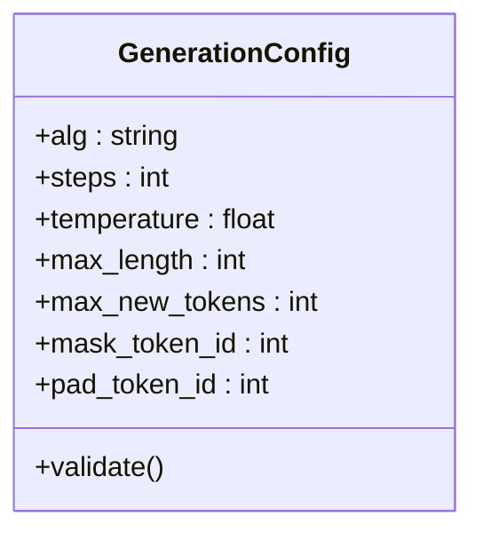

**Diagram sources**
- [src/conf/generation/generation_configs.py:26-97](file://src/conf/generation/generation_configs.py#L26-L97)
- [configs/generation/base.yaml:1-40](file://configs/generation/base.yaml#L1-L40)

**Section sources**
- [src/conf/generation/generation_configs.py:26-97](file://src/conf/generation/generation_configs.py#L26-L97)
- [configs/generation/base.yaml:1-40](file://configs/generation/base.yaml#L1-L40)

### Configuration Loading and Parameter Precedence
- Defaults resolution: The central orchestrator YAML declares defaults for tokenization, model, training, and generation sub-configs.
- Overrides: Dataset/task YAML files override base values.
- Command-line overrides: Values can be changed at runtime via command-line arguments.
- Instantiation: Hydra constructs the unified configuration object from the merged YAML and dataclass definitions.
- **Updated** Synchronization: The `sync_config()` function establishes `max_length` as a fundamental training parameter by cascading from training configuration to model configuration when not explicitly set, and synchronizes task types across components.
- **New** Torch compile application: The training pipeline applies torch.compile optimization when enabled in the configuration, with configurable compilation modes and backend selection.
- Test configuration: OmegaConf integration enables structured configuration creation and manipulation.

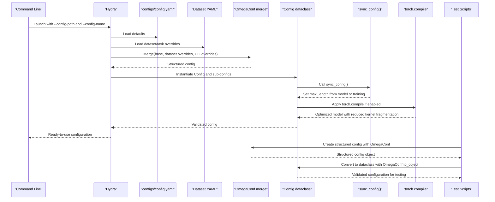

**Diagram sources**
- [configs/config.yaml:1-20](file://configs/config.yaml#L1-L20)
- [examples/train_pretrain.py:12-14](file://examples/train_pretrain.py#L12-L14)
- [src/conf/base_configs.py:164-184](file://src/conf/base_configs.py#L164-L184)
- [src/conf/base_configs.py:186-204](file://src/conf/base_configs.py#L186-L204)
- [src/conf/base_configs.py:306-314](file://src/conf/base_configs.py#L306-L314)
- [src/training/pipeline.py:167-201](file://src/training/pipeline.py#L167-L201)
- [tests/test_forward_simple.py:46-101](file://tests/test_forward_simple.py#L46-L101)
- [tests/test_model_forward_inputs.py:125-136](file://tests/test_model_forward_inputs.py#L125-L136)

**Section sources**
- [configs/config.yaml:1-20](file://configs/config.yaml#L1-L20)
- [examples/train_pretrain.py:12-14](file://examples/train_pretrain.py#L12-L14)
- [src/conf/base_configs.py:164-184](file://src/conf/base_configs.py#L164-L184)
- [src/conf/base_configs.py:306-314](file://src/conf/base_configs.py#L306-L314)
- [src/training/pipeline.py:167-201](file://src/training/pipeline.py#L167-L201)
- [tests/test_forward_simple.py:46-101](file://tests/test_forward_simple.py#L46-L101)
- [tests/test_model_forward_inputs.py:125-136](file://tests/test_model_forward_inputs.py#L125-L136)

### Practical Examples: Modifying Configurations
- Change dataset and tokenizer class for a graph-level task:
  - Override tokenization base with a dataset-specific YAML.
  - Adjust model vocabulary and positional embeddings to match the dataset.
  - **Updated** Set `max_length` in training configuration to control sequence length constraints across all training modes, including pretraining and finetuning.
  - Tune training schedule and optimizer for convergence speed.
  - Example dataset YAML for a Reddit-like graph-level task is available under tokenization graph-level configs.

- Switch to supervised fine-tuning:
  - Set task type to a downstream task.
  - Configure fine-tuning head parameters and evaluation settings.
  - **Updated** The `max_length` parameter now serves as a general training constraint that applies consistently across both pretraining and finetuning modes, automatically synchronized via `sync_config()`.
  - Adjust batch size and gradient accumulation for memory constraints.

- Enable diffusion generation:
  - Select generation algorithm and sampling parameters.
  - Set special token IDs from the tokenizer.
  - **Updated** Generation configuration maintains its own `max_length` parameter for generation-specific sequence length control, independent of training constraints.

- **New** Enable torch.compile optimization:
  - Set `training.torch_compile.enabled: true` to enable GPU kernel optimization.
  - Choose compilation mode: `"reduce-overhead"` (recommended for reducing kernel launch overhead), `"max-autotune"` (best performance but slower compilation), or `"default"` (balanced option).
  - Select backend: `"inductor"` (default, recommended) or other supported backends.
  - Configure `fullgraph` for full graph compilation requirements.
  - Set `dynamic: true` for variable sequence lengths support.

- Enhanced test configuration management:
  - Use OmegaConf structured configuration for complex nested structures.
  - Leverage CLI overrides for runtime parameter modification.
  - Implement robust configuration validation in test scenarios.
  - **Updated** Test scripts now explicitly set `training.max_length` to ensure consistent sequence length constraints across different test modes.

**Section sources**
- [configs/tokenization/graph_lvl/reddit.yaml:1-121](file://configs/tokenization/graph_lvl/reddit.yaml#L1-L121)
- [configs/training/base.yaml:106-118](file://configs/training/base.yaml#L106-L118)
- [configs/generation/base.yaml:1-40](file://configs/generation/base.yaml#L1-L40)
- [tests/test_forward_simple.py:46-101](file://tests/test_forward_simple.py#L46-L101)
- [tests/test_model_forward_inputs.py:164-165](file://tests/test_model_forward_inputs.py#L164-L165)
- [tests/test_model_forward_inputs.py:276-277](file://tests/test_model_forward_inputs.py#L276-L277)

### Configuration Validation and Error Handling
- Dataclass-level validation: Generation configuration validates algorithm choices and parameter bounds.
- Runtime synchronization: Helpers adjust derived parameters and ensure consistency across tokenization, model, and training settings.
- **Updated** The `sync_config()` function establishes `max_length` as a fundamental training parameter by setting it to the model's `max_position_embeddings` when not explicitly configured, ensuring consistent sequence length constraints across all training modes.
- **New** Torch compile validation: The training pipeline checks for torch.compile availability and handles compilation errors gracefully, continuing without optimization if compilation fails.
- Legacy conversion: Utilities translate the unified configuration into legacy-style tokenization configuration for compatibility.
- Test configuration validation: OmegaConf integration ensures structured configuration validation in test scenarios.

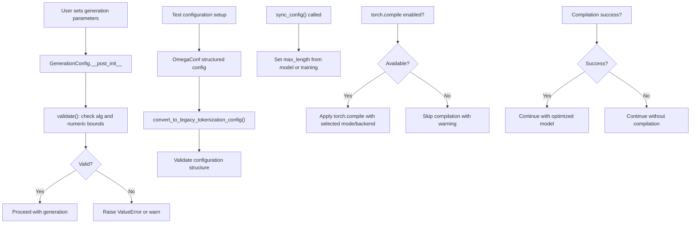

**Diagram sources**
- [src/conf/generation/generation_configs.py:74-97](file://src/conf/generation/generation_configs.py#L74-L97)
- [src/utils/conf_utils.py:30-46](file://src/utils/conf_utils.py#L30-L46)
- [src/conf/base_configs.py:306-314](file://src/conf/base_configs.py#L306-L314)
- [src/training/pipeline.py:167-201](file://src/training/pipeline.py#L167-L201)

**Section sources**
- [src/conf/generation/generation_configs.py:74-97](file://src/conf/generation/generation_configs.py#L74-L97)
- [src/conf/base_configs.py:306-314](file://src/conf/base_configs.py#L306-L314)
- [src/utils/conf_utils.py:30-46](file://src/utils/conf_utils.py#L30-L46)
- [src/training/pipeline.py:167-201](file://src/training/pipeline.py#L167-L201)

### Extending Configurations for Custom Datasets and Experiments
- Add a new dataset YAML under the appropriate tokenization subfolder and reference it from the central orchestrator.
- Introduce new sub-configs in the dataclass modules to capture dataset-specific parameters.
- **Updated** Use the `max_length` parameter in training configuration to establish sequence length constraints that apply consistently across all training modes, with automatic synchronization via `sync_config()`.
- Use command-line overrides to quickly experiment with hyperparameters without editing YAML files.
- Keep validation logic close to the relevant dataclass to surface errors early.
- Leverage OmegaConf integration for enhanced test configuration management.
- **New** Configure torch.compile settings for GPU optimization when needed, choosing appropriate compilation modes and backends based on performance requirements.

**Section sources**
- [configs/README.md:1-18](file://configs/README.md#L1-L18)
- [src/conf/tokenization/token_configs.py:115-127](file://src/conf/tokenization/token_configs.py#L115-L127)
- [src/conf/model/model_configs.py:246-326](file://src/conf/model/model_configs.py#L246-L326)
- [tests/test_forward_simple.py:46-101](file://tests/test_forward_simple.py#L46-L101)
- [configs/training/base.yaml:106-118](file://configs/training/base.yaml#L106-L118)

### Enhanced Parameter Synchronization
**Updated** The `sync_config()` function in `base_configs.py` provides comprehensive parameter synchronization across the configuration system:

#### Core Synchronization Logic
The function performs critical parameter synchronization:
- Sets `model_cfg.ft_head.task_type = train_cfg.task_type` for consistent task handling
- Establishes `train_cfg.max_length = train_cfg.max_length or model_cfg.max_position_embeddings` for universal sequence length control
- Enables discriminative pretraining for specific task types

#### Integration Points
- Called during pipeline initialization in `_init_data_configs()`
- Ensures consistency between training and model configurations
- Provides fallback behavior when `max_length` is not explicitly configured

#### Impact on Training Modes
- **Pretraining**: Automatically inherits sequence length constraints from model configuration
- **Finetuning**: Explicitly controlled via training configuration with fallback to model settings
- **Mixed Tasks**: Consistent sequence length handling across different task types

**Section sources**
- [src/conf/base_configs.py:306-314](file://src/conf/base_configs.py#L306-L314)
- [src/training/pipeline.py:147-148](file://src/training/pipeline.py#L147-L148)

## Enhanced Test Configuration Management

**Updated** The test configuration system has been significantly enhanced with OmegaConf integration for robust nested structure handling.

### OmegaConf Integration in Test Scripts

The test infrastructure now utilizes OmegaConf for structured configuration management:

#### Structured Configuration Creation
Test scripts use OmegaConf to create structured configurations with proper nested dictionary handling:

```python
# Create minimal config using OmegaConf to properly handle nested structures
cfg_dict = {
    'tokenization': {
        'attr_world_identifier': '@',
        'vocab_file': 'dummy_vocab.txt',
        'semantics': {
            'node': {'discrete': None, 'dim': 0, 'continuous': None, 'ignored_val': None, 'embed': None, 'embed_dim': 0},
            'edge': {'discrete': None, 'dim': 0, 'continuous': None, 'ignored_val': None, 'embed': None, 'embed_dim': 0},
            # ... nested structure continues
        }
    },
    'training': {
        'task_type': 'pretrain',
        'batch_size': 2,
        'max_length': 512,  # Now recognized as general training parameter
        'pretrain_mlm': {
            'name': 'mlm',
            'params': {
                'fixed_ratio': 0.15,
                'power': 1,
                'mtp': [3],
                'umr_clip': [0.0, 1.0]
            }
        }
    }
}

# Convert to OmegaConf and then to dataclass
cfg_omega = OmegaConf.create(cfg_dict)
cfg = OmegaConf.merge(OmegaConf.structured(BaseConfig), cfg_omega)
cfg = OmegaConf.to_object(cfg)
```

#### Compose and Conversion Pattern
Advanced test scripts use the compose pattern with OmegaConf conversion:

```python
# Load base config with compose
cfg = compose(
    config_name="config",
    overrides=config_overrides,
)
cfg = OmegaConf.to_object(cfg)
```

#### Nested Structure Access
OmegaConf enables robust access to deeply nested configuration structures:

```python
# Access nested configuration values
print(f"Downstream Pooling Method: {conf.ft_head.pooling_method}")
print(f"3D Position Bins: {conf.molecular_input.pos_bins}")

# CLI overrides for nested structures
cli_overrides = [
    "downstream_task.mlp=[1024, 512]",
    "downstream_task.loss_type=cross_entropy",
    "molecular_input.pos_bins=256",
    "training.max_length=1024",  # Now works as general training parameter
]
conf_updated = OmegaConf.merge(conf, OmegaConf.from_cli(cli_overrides))
```

### Benefits of Enhanced Test Configuration Management

#### Robust Nested Structure Handling
- Proper handling of complex nested dictionaries for tokenization, training parameters, and model settings
- Type-safe configuration access at any nesting level
- Automatic validation of nested configuration structures
- Seamless conversion between OmegaConf containers and dataclass objects

#### Improved Test Reliability
- Structured configuration creation eliminates manual dictionary construction errors
- CLI override support enables flexible parameter experimentation
- Enhanced debugging capabilities through structured configuration inspection
- Consistent configuration validation across test scenarios

#### Advanced Configuration Features
- Support for complex nested structures with proper type inference
- Integration with CLI argument parsing for runtime parameter modification
- Flexible configuration merging with proper precedence handling
- Enhanced error reporting for configuration validation failures

**Section sources**
- [tests/test_forward_simple.py:46-101](file://tests/test_forward_simple.py#L46-L101)
- [tests/test_model_forward_inputs.py:164-165](file://tests/test_model_forward_inputs.py#L164-L165)
- [tests/test_model_forward_inputs.py:276-277](file://tests/test_model_forward_inputs.py#L276-L277)
- [tests/test_forward_minimal.py:32-526](file://tests/test_forward_minimal.py#L32-L526)
- [tests/README_FORWARD_TEST.md:1-211](file://tests/README_FORWARD_TEST.md#L1-L211)
- [tests/QUICK_START.md:1-290](file://tests/QUICK_START.md#L1-L290)

## Torch Compile Configuration

**New** The Graph-GPT configuration system now includes comprehensive torch.compile support for GPU kernel optimization and performance improvements.

### TorchCompileConfig Dataclass
The `TorchCompileConfig` dataclass provides fine-grained control over torch.compile optimization:

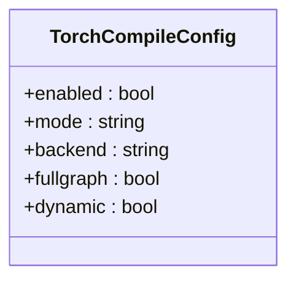

**Diagram sources**
- [src/conf/base_configs.py:164-184](file://src/conf/base_configs.py#L164-L184)

### Configuration Parameters
- `enabled`: Whether to enable torch.compile optimization (default: False)
- `mode`: Compilation mode selection:
  - `"reduce-overhead"`: Best for reducing kernel launch overhead (recommended)
  - `"max-autotune"`: Best performance but slower compilation time
  - `"default"`: Balanced option
- `backend`: Compilation backend selection (default: "inductor")
- `fullgraph`: Whether to require full graph compilation (default: False)
- `dynamic`: Whether to use dynamic shapes (default: True for variable sequence lengths)

### Training Pipeline Integration
The training pipeline applies torch.compile optimization during model initialization:

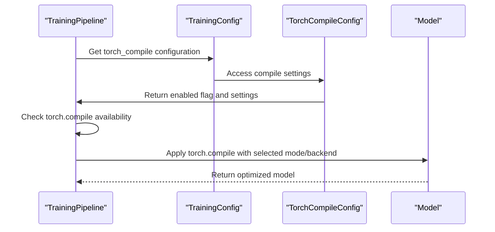

**Diagram sources**
- [src/training/pipeline.py:167-201](file://src/training/pipeline.py#L167-L201)
- [src/conf/base_configs.py:164-184](file://src/conf/base_configs.py#L164-L184)

### Model-Level Optimizations
The system also includes model-level torch.compile optimizations for specific components:

- Flex attention optimization: torch.compile is applied to raw flex_attention functions with `dynamic=False` to avoid symbolic batch-dimension mismatches
- Cache size limits: Dynamo configuration is adjusted to optimize compilation caching

### Configuration Examples
Enable torch.compile in training configuration:

```yaml
training:
  torch_compile:
    enabled: true
    mode: "reduce-overhead"
    backend: "inductor"
    fullgraph: false
    dynamic: true
```

### Performance Considerations
- **Kernel fusion**: Reduces kernel launch overhead and improves GPU utilization
- **Compilation time**: `"max-autotune"` mode provides best performance but requires longer compilation
- **Memory usage**: torch.compile may increase memory usage during compilation phase
- **Compatibility**: Requires PyTorch 2.0+ for torch.compile availability

### Error Handling
The system includes robust error handling for torch.compile:
- Checks for torch.compile availability before attempting compilation
- Gracefully continues without optimization if compilation fails
- Provides informative warnings about compilation errors

**Section sources**
- [src/conf/base_configs.py:164-184](file://src/conf/base_configs.py#L164-L184)
- [src/training/pipeline.py:167-201](file://src/training/pipeline.py#L167-L201)
- [src/models/graphgpt/modeling_helpers.py:122-125](file://src/models/graphgpt/modeling_helpers.py#L122-L125)
- [configs/training/base.yaml:106-118](file://configs/training/base.yaml#L106-L118)

## Dependency Analysis
The configuration system exhibits clear separation of concerns:
- YAML files define structure and defaults.
- Dataclass modules define typed validation and relationships.
- Utilities bridge configuration to runtime components (e.g., tokenizer conversion, DeepSpeed parsing).
- Test infrastructure leverages OmegaConf for enhanced configuration management.
- **Updated** The synchronization logic ensures `max_length` parameter consistency across all training modes through the `sync_config()` function.
- **New** Torch compile configuration integrates with the training pipeline for GPU optimization.

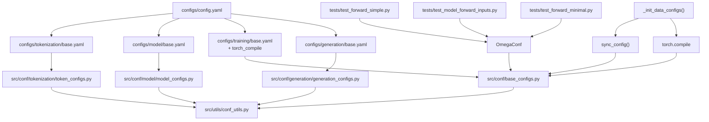

**Diagram sources**
- [configs/tokenization/base.yaml:1-117](file://configs/tokenization/base.yaml#L1-L117)
- [configs/model/base.yaml:1-222](file://configs/model/base.yaml#L1-L222)
- [configs/training/base.yaml:1-118](file://configs/training/base.yaml#L1-L118)
- [configs/generation/base.yaml:1-40](file://configs/generation/base.yaml#L1-L40)
- [src/conf/tokenization/token_configs.py:115-127](file://src/conf/tokenization/token_configs.py#L115-L127)
- [src/conf/model/model_configs.py:246-326](file://src/conf/model/model_configs.py#L246-L326)
- [src/conf/base_configs.py:164-184](file://src/conf/base_configs.py#L164-L184)
- [src/conf/generation/generation_configs.py:26-97](file://src/conf/generation/generation_configs.py#L26-L97)
- [src/utils/conf_utils.py:30-46](file://src/utils/conf_utils.py#L30-L46)
- [configs/config.yaml:1-20](file://configs/config.yaml#L1-L20)
- [tests/test_forward_simple.py:17](file://tests/test_forward_simple.py#L17)
- [tests/test_model_forward_inputs.py:29](file://tests/test_model_forward_inputs.py#L29)
- [src/conf/base_configs.py:306-314](file://src/conf/base_configs.py#L306-L314)
- [src/training/pipeline.py:167-201](file://src/training/pipeline.py#L167-L201)

**Section sources**
- [src/conf/base_configs.py:164-184](file://src/conf/base_configs.py#L164-L184)
- [src/conf/base_configs.py:186-204](file://src/conf/base_configs.py#L186-L204)
- [src/conf/__init__.py:1-20](file://src/conf/__init__.py#L1-L20)
- [tests/test_forward_simple.py:17](file://tests/test_forward_simple.py#L17)
- [tests/test_model_forward_inputs.py:29](file://tests/test_model_forward_inputs.py#L29)

## Performance Considerations
- Prefer smaller base models and reduced positional embeddings for memory-constrained environments.
- **Updated** Set `max_length` appropriately in training configuration to balance memory usage and training effectiveness across all training modes, with automatic fallback to model settings when not explicitly configured.
- Tune batch size and gradient accumulation to balance throughput and stability.
- Use appropriate schedule parameters (total tokens, warmup steps) aligned with dataset size and compute budget.
- Limit unnecessary preprocessing workers and disable expensive features during experimentation.
- **Updated** OmegaConf integration reduces configuration overhead in test scenarios through efficient structured configuration creation and validation.
- **Updated** The `pad_to_multiple_of` parameter ensures optimal memory alignment for attention computations, improving performance in GPU environments.
- **New** Torch compile optimization can significantly improve GPU kernel performance by reducing kernel launch overhead and enabling kernel fusion, but may increase compilation time and memory usage during the initial compilation phase.

## Troubleshooting Guide
- Unknown generation algorithm or invalid numeric bounds: Generation configuration raises warnings or errors during validation.
- Mismatched special token IDs: Ensure tokenizer IDs are set before generation; helpers can populate IDs from the tokenizer.
- Resume training inconsistencies: Logging utilities validate resume indices against saved logs to prevent misalignment.
- **Updated** Sequence length issues: If encountering sequence length problems, verify that `max_length` is properly set in training configuration or will cascade from `max_position_embeddings` via `sync_config()`. Check both training and model configuration for consistency.
- **Updated** Test configuration issues: OmegaConf structured configuration errors can be debugged using OmegaConf.to_yaml() for inspection and proper nested structure validation.
- **Updated** Parameter synchronization problems: If `max_length` appears inconsistent across components, verify that `sync_config()` is being called during pipeline initialization and that there are no conflicting explicit settings.
- **New** Torch compile issues: If torch.compile fails, check PyTorch version compatibility (requires 2.0+), verify backend availability, and review compilation warnings. The system will continue without optimization if compilation fails.
- **New** Performance regression: If torch.compile causes performance issues, disable it or adjust compilation mode/backends. Some models may benefit more from certain compilation settings than others.

**Section sources**
- [src/conf/generation/generation_configs.py:81-97](file://src/conf/generation/generation_configs.py#L81-L97)
- [src/conf/base_configs.py:316-330](file://src/conf/base_configs.py#L316-L330)
- [src/utils/conf_utils.py:150-232](file://src/utils/conf_utils.py#L150-L232)
- [src/conf/base_configs.py:306-314](file://src/conf/base_configs.py#L306-L314)
- [src/training/pipeline.py:167-201](file://src/training/pipeline.py#L167-L201)
- [tests/test_forward_simple.py:46-101](file://tests/test_forward_simple.py#L46-L101)

## Conclusion
Graph-GPT's configuration system combines the flexibility of YAML with the safety and structure of dataclass-based validation. The modular design enables easy dataset and task customization, while Hydra ensures robust merging and instantiation. **Updated** The enhanced test configuration management using OmegaConf provides robust nested structure handling, enabling reliable testing of complex configurations with proper validation and CLI override support. The evolution of `max_length` from a primarily finetuning parameter to a general training parameter reflects the system's maturation and improved consistency across different training modes. The introduction of the `sync_config()` function ensures parameter consistency and simplifies configuration management across all training scenarios. **New** The addition of torch.compile configuration support provides powerful GPU optimization capabilities through configurable compilation modes, backend selection, and dynamic shape support. By following the patterns outlined here—layering base and dataset/task YAMLs, validating with dataclasses, leveraging runtime helpers including the enhanced synchronization logic, utilizing OmegaConf for structured configuration management, and configuring torch.compile optimization—you can efficiently tune and extend configurations for diverse graph learning scenarios.

## Appendices

### Best Practices and Common Pitfalls
- Best practices:
  - Keep base YAML minimal and focused on defaults; override in dataset/task YAMLs.
  - Encapsulate dataset-specific parameters in dedicated YAML files.
  - Use dataclass validation to catch invalid combinations early.
  - Keep command-line overrides concise and documented.
  - Synchronize derived parameters using provided helpers, particularly `sync_config()`.
  - **Updated** Leverage OmegaConf structured configuration for complex nested structures in tests.
  - Use CLI overrides for flexible parameter experimentation in test scenarios.
  - Implement proper configuration validation for nested structures.
  - **Updated** Set `max_length` in training configuration for consistent sequence length control across all training modes, with automatic fallback to model settings.
  - **Updated** Utilize the `pad_to_multiple_of` parameter to optimize memory alignment and performance.
  - **New** Enable torch.compile optimization for GPU performance improvements, starting with `"reduce-overhead"` mode and adjusting based on performance requirements.
  - **New** Monitor compilation time and memory usage when enabling torch.compile, especially with `"max-autotune"` mode.

- Common pitfalls:
  - Forgetting to set special token IDs for generation.
  - Mismatched vocabulary sizes and positional embeddings across tokenization and model.
  - Incorrect schedule parameters causing premature stopping or excessive training.
  - Overly aggressive gradient accumulation leading to instability.
  - **Updated** Assuming `max_length` only applies to finetuning contexts; remember it's now a general training parameter with automatic synchronization.
  - **Updated** Manual dictionary construction errors in test configurations.
  - Improper nested structure handling in complex test scenarios.
  - Missing OmegaConf validation in test configuration setup.
  - **Updated** Conflicting `max_length` settings between training and model configurations.
  - **Updated** Forgetting to call `sync_config()` during pipeline initialization.
  - **New** Ignoring torch.compile compatibility requirements (PyTorch 2.0+).
  - **New** Expecting immediate performance improvements from torch.compile without considering compilation overhead.
  - **New** Using incompatible compilation modes/backends for specific model architectures.

### OmegaConf Configuration Patterns

#### Structured Configuration Creation
```python
# Create structured config from dictionary
cfg_omega = OmegaConf.create(cfg_dict)
cfg = OmegaConf.merge(OmegaConf.structured(BaseConfig), cfg_omega)
cfg = OmegaConf.to_object(cfg)
```

#### CLI Override Integration
```python
# Merge with CLI overrides
cli_overrides = OmegaConf.from_cli(["training.batch_size=32", "model.hidden_size=512", "training.max_length=1024"])
cfg = OmegaConf.merge(cfg, cli_overrides)
```

#### Nested Structure Access
```python
# Access nested values safely
pooling_method = OmegaConf.select(cfg, "model.ft_head.pooling_method")
max_length = OmegaConf.select(cfg, "training.max_length")  # Now works as general parameter
torch_compile_enabled = OmegaConf.select(cfg, "training.torch_compile.enabled")
```

**Section sources**
- [tests/test_forward_simple.py:46-101](file://tests/test_forward_simple.py#L46-L101)
- [tests/test_model_forward_inputs.py:164-165](file://tests/test_model_forward_inputs.py#L164-L165)
- [tests/test_model_forward_inputs.py:276-277](file://tests/test_model_forward_inputs.py#L276-L277)
- [tests/test_forward_minimal.py:32-526](file://tests/test_forward_minimal.py#L32-L526)
