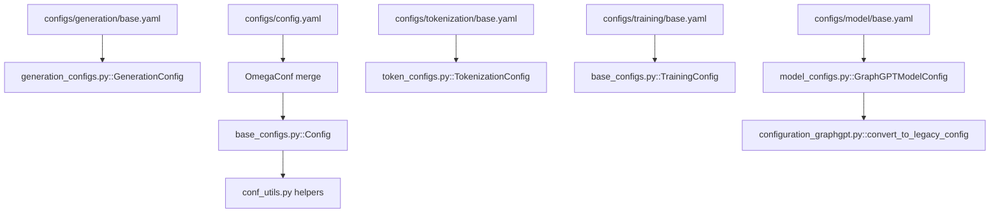
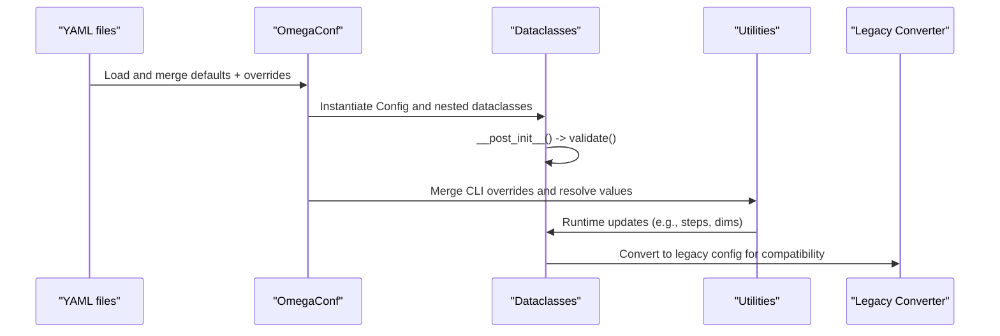
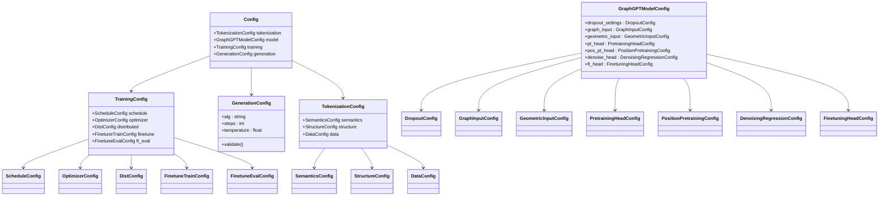
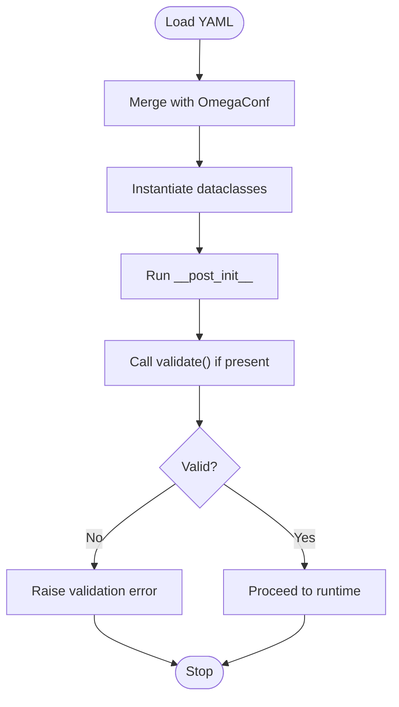
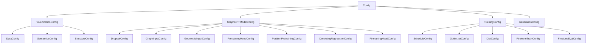

# Dataclass Validation System

<cite>
**Referenced Files in This Document**
- [base_configs.py](file://src/conf/base_configs.py)
- [generation_configs.py](file://src/conf/generation/generation_configs.py)
- [model_configs.py](file://src/conf/model/model_configs.py)
- [token_configs.py](file://src/conf/tokenization/token_configs.py)
- [config.yaml](file://configs/config.yaml)
- [generation/base.yaml](file://configs/generation/base.yaml)
- [model/base.yaml](file://configs/model/base.yaml)
- [tokenization/base.yaml](file://configs/tokenization/base.yaml)
- [training/base.yaml](file://configs/training/base.yaml)
- [conf_utils.py](file://src/utils/conf_utils.py)
- [configuration_graphgpt.py](file://src/models/graphgpt/configuration_graphgpt.py)
</cite>

## Table of Contents
1. [Introduction](#introduction)
2. [Project Structure](#project-structure)
3. [Core Components](#core-components)
4. [Architecture Overview](#architecture-overview)
5. [Detailed Component Analysis](#detailed-component-analysis)
6. [Dependency Analysis](#dependency-analysis)
7. [Performance Considerations](#performance-considerations)
8. [Troubleshooting Guide](#troubleshooting-guide)
9. [Conclusion](#conclusion)

## Introduction
This document explains the dataclass-based configuration validation system used in Graph-GPT. It describes how YAML configuration files are loaded and converted into strongly typed dataclasses at runtime, how validation is enforced, and how defaults are handled. It also covers the inheritance hierarchy among configuration classes, the relationship between YAML keys and dataclass fields, and how to extend the system with new parameters. Finally, it provides guidance on serialization/deserialization and troubleshooting common validation errors.

## Project Structure
The configuration system is organized around:
- YAML configuration files under configs/ that define default values and overrides.
- Python dataclasses under src/conf/ that represent typed configuration structures.
- Utilities under src/utils/ that merge YAML with dataclasses and handle runtime updates.
- A converter under src/models/graphgpt/configuration_graphgpt.py that bridges the new structured configuration to a legacy configuration class for compatibility.

**Diagram sources**
- [config.yaml:1-20](file://configs/config.yaml#L1-L20)
- [generation/base.yaml:1-40](file://configs/generation/base.yaml#L1-L40)
- [model/base.yaml:1-222](file://configs/model/base.yaml#L1-L222)
- [tokenization/base.yaml:1-117](file://configs/tokenization/base.yaml#L1-L117)
- [training/base.yaml:1-78](file://configs/training/base.yaml#L1-L78)
- [generation_configs.py:26-96](file://src/conf/generation/generation_configs.py#L26-L96)
- [model_configs.py:246-326](file://src/conf/model/model_configs.py#L246-L326)
- [token_configs.py:115-127](file://src/conf/tokenization/token_configs.py#L115-L127)
- [base_configs.py:132-164](file://src/conf/base_configs.py#L132-L164)
- [conf_utils.py:30-46](file://src/utils/conf_utils.py#L30-L46)
- [configuration_graphgpt.py:212-345](file://src/models/graphgpt/configuration_graphgpt.py#L212-L345)

**Section sources**
- [config.yaml:1-20](file://configs/config.yaml#L1-L20)
- [generation/base.yaml:1-40](file://configs/generation/base.yaml#L1-L40)
- [model/base.yaml:1-222](file://configs/model/base.yaml#L1-L222)
- [tokenization/base.yaml:1-117](file://configs/tokenization/base.yaml#L1-L117)
- [training/base.yaml:1-78](file://configs/training/base.yaml#L1-L78)

## Core Components
- Base configuration aggregator: Config groups tokenization, model, training, and generation configurations.
- TrainingConfig: Central training orchestration, schedules, optimizer, and distributed settings.
- GenerationConfig: Generation-time parameters for diffusion and sampling.
- TokenizationConfig: Tokenizer metadata, semantics, structure, and data sources.
- Model configuration: Modular sub-configurations for dropout, graph input, geometric input, pretraining heads, and finetuning heads.
- Utilities: Helpers to convert configurations to legacy formats and to merge OmegaConf with dataclasses.

Key behaviors:
- Defaults are defined as dataclass field defaults.
- Nested dataclasses compose higher-level configurations.
- Validation occurs via dataclass post-init hooks and explicit validate() methods.
- YAML keys map to nested dataclass fields using dot notation.

**Section sources**
- [base_configs.py:187-204](file://src/conf/base_configs.py#L187-L204)
- [base_configs.py:132-164](file://src/conf/base_configs.py#L132-L164)
- [generation_configs.py:26-96](file://src/conf/generation/generation_configs.py#L26-L96)
- [token_configs.py:115-127](file://src/conf/tokenization/token_configs.py#L115-L127)
- [model_configs.py:246-326](file://src/conf/model/model_configs.py#L246-L326)

## Architecture Overview
The runtime configuration pipeline:
1. YAML files are loaded and merged via OmegaConf.
2. The merged configuration is mapped into typed dataclasses.
3. Dataclass post-init triggers validation.
4. Utility functions merge CLI overrides and perform runtime adjustments.
5. Legacy configuration conversion supports downstream components.

**Diagram sources**
- [generation_configs.py:74-96](file://src/conf/generation/generation_configs.py#L74-L96)
- [base_configs.py:250-264](file://src/conf/base_configs.py#L250-L264)
- [conf_utils.py:30-46](file://src/utils/conf_utils.py#L30-L46)
- [configuration_graphgpt.py:212-345](file://src/models/graphgpt/configuration_graphgpt.py#L212-L345)

## Detailed Component Analysis

### Base Configuration Aggregator (Config)
- Purpose: Top-level container aggregating tokenization, model, training, and generation configurations.
- Defaults: Each nested field uses a factory to instantiate default sub-configurations.
- Runtime helpers: Functions to synchronize and update configuration based on other parameters (e.g., embedding dimensions, stacked features).

**Diagram sources**
- [base_configs.py:187-204](file://src/conf/base_configs.py#L187-L204)
- [base_configs.py:132-164](file://src/conf/base_configs.py#L132-L164)
- [generation_configs.py:26-96](file://src/conf/generation/generation_configs.py#L26-L96)
- [token_configs.py:115-127](file://src/conf/tokenization/token_configs.py#L115-L127)
- [model_configs.py:246-326](file://src/conf/model/model_configs.py#L246-L326)

**Section sources**
- [base_configs.py:187-204](file://src/conf/base_configs.py#L187-L204)

### Training Configuration (TrainingConfig)
- Responsibilities: Orchestrates training lifecycle, schedule computation, optimizer settings, distributed training, and fine-tuning controls.
- Composed fields: ScheduleConfig, OptimizerConfig, DistConfig, FinetuneTrainConfig, FinetuneEvalConfig.
- Helper functions: Update steps/epochs from tokens and batch sizes; compute derived values; print statistics.

Validation and defaults:
- Defaults for numeric and list fields are provided at the dataclass level.
- Derived fields (e.g., total_num_steps) are computed by helper functions after YAML loading.

**Section sources**
- [base_configs.py:132-164](file://src/conf/base_configs.py#L132-L164)
- [base_configs.py:54-76](file://src/conf/base_configs.py#L54-L76)
- [training/base.yaml:24-78](file://configs/training/base.yaml#L24-L78)

### Generation Configuration (GenerationConfig)
- Purpose: Encapsulates generation parameters for masked diffusion and sampling.
- Validation: Enforced in __post_init__ via validate(), including checks for algorithm selection, temperature, and step count.

Example validations:
- Algorithm must be one of predefined options.
- Temperature must be non-negative.
- Steps must be positive.

**Section sources**
- [generation_configs.py:74-96](file://src/conf/generation/generation_configs.py#L74-L96)
- [generation/base.yaml:6-10](file://configs/generation/base.yaml#L6-L10)

### Tokenization Configuration (TokenizationConfig)
- Purpose: Defines tokenizer metadata, semantics, structure, and data sources.
- Nested sub-configurations: DataConfig, SemanticsConfig, StructureConfig, OdpsConfig.
- Defaults: Strings, lists, and booleans are defaulted at the dataclass level; nested sub-configs are composed via factories.

Relationship to YAML:
- Keys under tokenization map to nested fields (e.g., data.dataset, semantics.node.dim).

**Section sources**
- [token_configs.py:115-127](file://src/conf/tokenization/token_configs.py#L115-L127)
- [tokenization/base.yaml:5-27](file://configs/tokenization/base.yaml#L5-L27)
- [tokenization/base.yaml:29-82](file://configs/tokenization/base.yaml#L29-L82)
- [tokenization/base.yaml:83-117](file://configs/tokenization/base.yaml#L83-L117)

### Model Configuration (GraphGPTModelConfig)
- Purpose: Modular configuration for GraphGPT model internals and heads.
- Sub-configurations: DropoutConfig, GraphInputConfig, GeometricInputConfig, PretrainingHeadConfig, PositionPretrainingConfig, DenoisingRegressionConfig, FinetuningHeadConfig.
- Defaults: Numeric, string, and list fields are defaulted; sub-configurations are composed via factories.

Integration with YAML:
- Keys under model map to nested fields (e.g., pt_head.use_generative, pos_pt_head.smtp_power).

**Section sources**
- [model_configs.py:246-326](file://src/conf/model/model_configs.py#L246-L326)
- [model/base.yaml:74-192](file://configs/model/base.yaml#L74-L192)

### YAML-to-Dataclass Mapping and Validation Flow
- YAML files define defaults and can be overridden via CLI or environment.
- OmegaConf merges YAML with overrides and instantiates dataclasses.
- Dataclass post-init triggers validation routines.
- Utilities resolve and merge additional runtime values.

**Diagram sources**
- [generation_configs.py:74-96](file://src/conf/generation/generation_configs.py#L74-L96)
- [base_configs.py:250-264](file://src/conf/base_configs.py#L250-L264)

**Section sources**
- [config.yaml:1-20](file://configs/config.yaml#L1-L20)
- [generation/base.yaml:1-40](file://configs/generation/base.yaml#L1-L40)
- [model/base.yaml:1-222](file://configs/model/base.yaml#L1-L222)
- [tokenization/base.yaml:1-117](file://configs/tokenization/base.yaml#L1-L117)
- [training/base.yaml:1-78](file://configs/training/base.yaml#L1-L78)

### Extending the Validation System
To add a new configuration parameter:
1. Add a field to the appropriate dataclass with a sensible default.
2. If validation is required, implement or reuse a validate() method or rely on __post_init__.
3. Add a corresponding key in the relevant YAML file under the correct namespace.
4. If the parameter affects derived values, add a helper function to compute/update dependent fields.
5. If downstream components require a legacy format, update the conversion function accordingly.

Examples of extension points:
- New training parameter: Add to TrainingConfig and update helper functions if needed.
- New generation parameter: Add to GenerationConfig and include validation in validate().
- New model parameter: Add to GraphGPTModelConfig or a sub-config and reflect in YAML.

**Section sources**
- [base_configs.py:132-164](file://src/conf/base_configs.py#L132-L164)
- [generation_configs.py:74-96](file://src/conf/generation/generation_configs.py#L74-L96)
- [model_configs.py:246-326](file://src/conf/model/model_configs.py#L246-L326)
- [configuration_graphgpt.py:212-345](file://src/models/graphgpt/configuration_graphgpt.py#L212-L345)

### Serialization, Deserialization, and Runtime Updates
- Serialization: Use OmegaConf utilities to export dataclass-backed configuration to YAML or other formats.
- Deserialization: Load YAML and instantiate dataclasses; OmegaConf resolves types and defaults automatically.
- Runtime updates: Utilities merge CLI overrides and adjust derived fields (e.g., steps, dims). Legacy conversion supports downstream components.

**Section sources**
- [conf_utils.py:30-46](file://src/utils/conf_utils.py#L30-L46)
- [configuration_graphgpt.py:212-345](file://src/models/graphgpt/configuration_graphgpt.py#L212-L345)

## Dependency Analysis
The configuration system exhibits clear hierarchical dependencies:
- Config depends on TokenizationConfig, GraphGPTModelConfig, TrainingConfig, and GenerationConfig.
- TrainingConfig composes ScheduleConfig, OptimizerConfig, DistConfig, FinetuneTrainConfig, and FinetuneEvalConfig.
- TokenizationConfig composes DataConfig, SemanticsConfig, StructureConfig, and nested sub-configs.
- Model configuration composes multiple specialized sub-configurations.

**Diagram sources**
- [base_configs.py:187-204](file://src/conf/base_configs.py#L187-L204)
- [base_configs.py:132-164](file://src/conf/base_configs.py#L132-L164)
- [token_configs.py:115-127](file://src/conf/tokenization/token_configs.py#L115-L127)
- [model_configs.py:246-326](file://src/conf/model/model_configs.py#L246-L326)

**Section sources**
- [base_configs.py:187-204](file://src/conf/base_configs.py#L187-L204)
- [base_configs.py:132-164](file://src/conf/base_configs.py#L132-L164)
- [token_configs.py:115-127](file://src/conf/tokenization/token_configs.py#L115-L127)
- [model_configs.py:246-326](file://src/conf/model/model_configs.py#L246-L326)

## Performance Considerations
- Keep validation logic lightweight; avoid heavy computations in __post_init__.
- Prefer default factories for mutable defaults to prevent shared-state bugs.
- Use OmegaConf’s lazy resolution to defer expensive operations until needed.
- Minimize nested recomputation by caching derived values in helper functions.

## Troubleshooting Guide
Common validation errors and resolutions:
- Unknown algorithm in generation configuration:
  - Symptom: Warning about unknown algorithm; potential ValueError if strict validation is enforced.
  - Resolution: Set alg to one of the supported options.
  - Section sources
    - [generation_configs.py:86-90](file://src/conf/generation/generation_configs.py#L86-L90)
- Negative temperature or non-positive steps:
  - Symptom: ValueError indicating invalid temperature or steps.
  - Resolution: Ensure temperature >= 0 and steps > 0.
  - Section sources
    - [generation_configs.py:93-96](file://src/conf/generation/generation_configs.py#L93-L96)
- Missing or incompatible YAML keys:
  - Symptom: Missing keys cause defaults to be used; incorrect types cause merge failures.
  - Resolution: Ensure YAML keys match dataclass field names and types; use nested dot notation for sub-configurations.
  - Section sources
    - [config.yaml:1-20](file://configs/config.yaml#L1-L20)
    - [generation/base.yaml:1-40](file://configs/generation/base.yaml#L1-L40)
    - [model/base.yaml:1-222](file://configs/model/base.yaml#L1-L222)
    - [tokenization/base.yaml:1-117](file://configs/tokenization/base.yaml#L1-L117)
    - [training/base.yaml:1-78](file://configs/training/base.yaml#L1-L78)
- Derived fields not updating:
  - Symptom: total_num_steps or warmup_num_steps not reflecting changes.
  - Resolution: Call the appropriate helper functions after YAML loading and before training starts.
  - Section sources
    - [base_configs.py:54-76](file://src/conf/base_configs.py#L54-L76)
    - [base_configs.py:166-175](file://src/conf/base_configs.py#L166-L175)

## Conclusion
Graph-GPT’s configuration system leverages typed dataclasses and OmegaConf to provide a robust, extensible, and validated configuration pipeline. YAML files define defaults and overrides, which are merged into strongly typed dataclasses. Validation is enforced at instantiation time, and utilities support runtime updates and legacy conversions. By following the extension guidelines and troubleshooting tips, developers can safely introduce new parameters and maintain system reliability.
