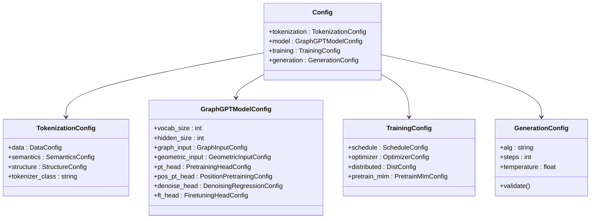
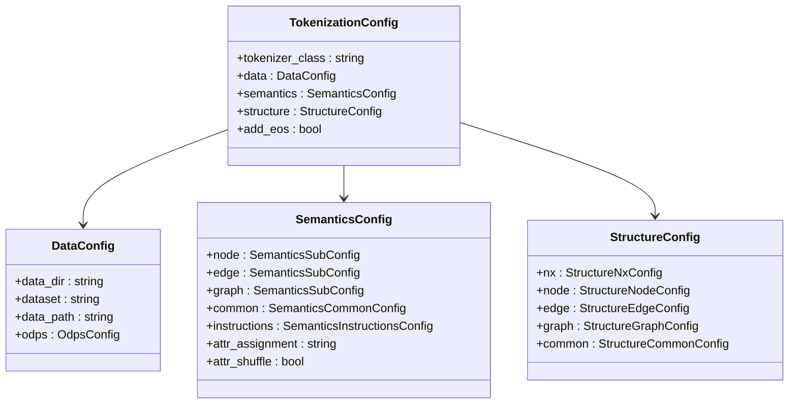
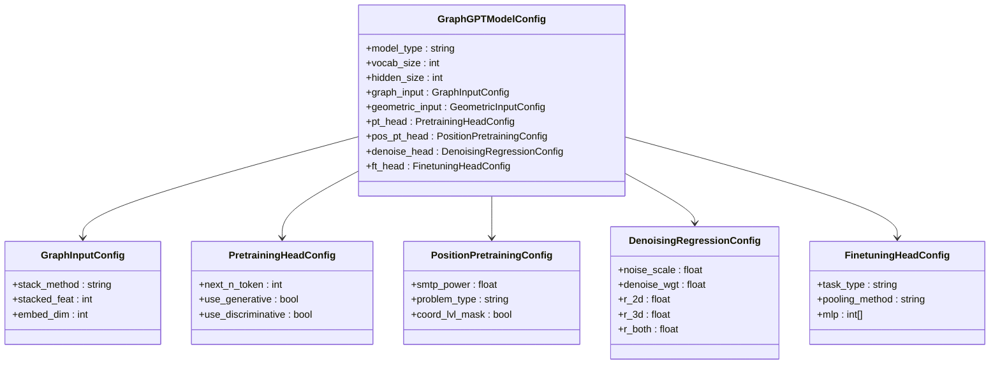
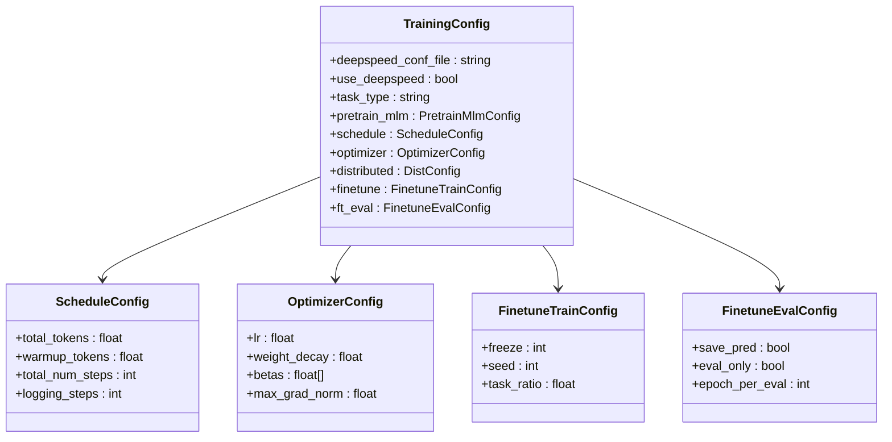
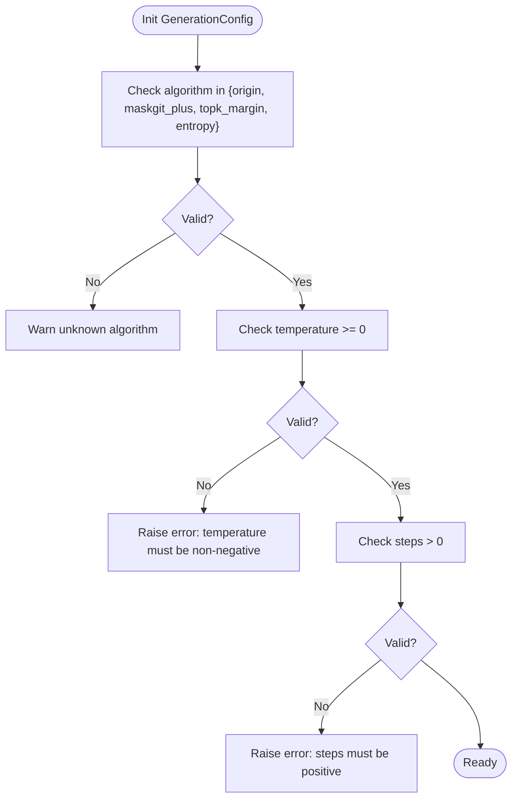
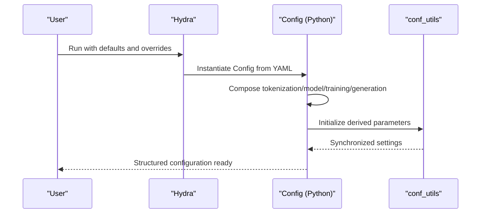
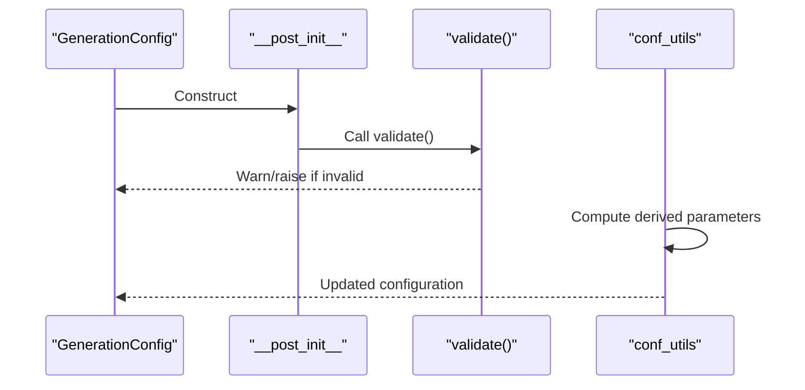
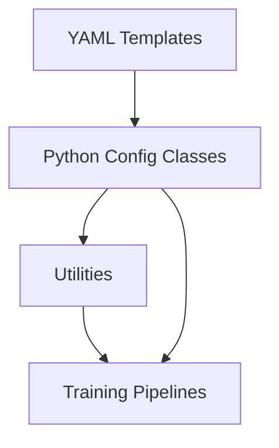

# Modular Configuration Architecture

<cite>
**Referenced Files in This Document**
- [configs/README.md](file://configs/README.md)
- [configs/config.yaml](file://configs/config.yaml)
- [configs/model/base.yaml](file://configs/model/base.yaml)
- [configs/training/base.yaml](file://configs/training/base.yaml)
- [configs/tokenization/base.yaml](file://configs/tokenization/base.yaml)
- [configs/tokenization/graph_lvl/reddit.yaml](file://configs/tokenization/graph_lvl/reddit.yaml)
- [src/conf/base_configs.py](file://src/conf/base_configs.py)
- [src/conf/__init__.py](file://src/conf/__init__.py)
- [src/conf/model/model_configs.py](file://src/conf/model/model_configs.py)
- [src/conf/tokenization/token_configs.py](file://src/conf/tokenization/token_configs.py)
- [src/conf/generation/generation_configs.py](file://src/conf/generation/generation_configs.py)
- [src/utils/conf_utils.py](file://src/utils/conf_utils.py)
- [examples/train_pretrain.py](file://examples/train_pretrain.py)
- [examples/train_supervised.py](file://examples/train_supervised.py)
</cite>

## Table of Contents
1. [Introduction](#introduction)
2. [Project Structure](#project-structure)
3. [Core Components](#core-components)
4. [Architecture Overview](#architecture-overview)
5. [Detailed Component Analysis](#detailed-component-analysis)
6. [Dependency Analysis](#dependency-analysis)
7. [Performance Considerations](#performance-considerations)
8. [Troubleshooting Guide](#troubleshooting-guide)
9. [Conclusion](#conclusion)
10. [Appendices](#appendices)

## Introduction
This document explains the modular configuration architecture in Graph-GPT with a focus on separation of concerns across configuration domains: model, training, tokenization, and generation. It details how base configurations are composed and inherited, how configuration composition works across domains, and how parameter scoping is enforced. It also covers validation and error propagation, best practices for organizing complex hierarchies, and reuse/modularity principles. Examples demonstrate how to create custom configuration combinations for new experiments.

## Project Structure
The configuration system is organized around a central default configuration that pulls in domain-specific base configurations and allows overrides via command line. Domain-specific YAML files define base templates and dataset/task-specific overrides. Python modules define strongly typed configuration dataclasses that Hydra instantiates from YAML.

```mermaid
graph TB
A["configs/config.yaml"] --> B["configs/tokenization/base.yaml"]
A --> C["configs/model/base.yaml"]
A --> D["configs/training/base.yaml"]
A --> E["configs/generation/base.yaml"]
F["configs/tokenization/graph_lvl/reddit.yaml"] --> B
G["src/conf/base_configs.py"] --> H["src/conf/__init__.py"]
I["src/conf/model/model_configs.py"] --> H
J["src/conf/tokenization/token_configs.py"] --> H
K["src/conf/generation/generation_configs.py"] --> H
L["src/utils/conf_utils.py"] --> H
M["examples/train_pretrain.py"] --> N["Hydra runtime"]
O["examples/train_supervised.py"] --> N
```

**Diagram sources**
- [configs/config.yaml:1-20](file://configs/config.yaml#L1-L20)
- [configs/tokenization/base.yaml:1-117](file://configs/tokenization/base.yaml#L1-L117)
- [configs/model/base.yaml:1-222](file://configs/model/base.yaml#L1-L222)
- [configs/training/base.yaml:1-78](file://configs/training/base.yaml#L1-L78)
- [src/conf/base_configs.py:186-193](file://src/conf/base_configs.py#L186-L193)
- [src/conf/__init__.py:1-13](file://src/conf/__init__.py#L1-L13)
- [src/conf/model/model_configs.py:246-326](file://src/conf/model/model_configs.py#L246-L326)
- [src/conf/tokenization/token_configs.py:115-127](file://src/conf/tokenization/token_configs.py#L115-L127)
- [src/conf/generation/generation_configs.py:26-73](file://src/conf/generation/generation_configs.py#L26-L73)
- [src/utils/conf_utils.py:49-103](file://src/utils/conf_utils.py#L49-L103)
- [examples/train_pretrain.py:12-14](file://examples/train_pretrain.py#L12-L14)
- [examples/train_supervised.py:12-14](file://examples/train_supervised.py#L12-L14)

**Section sources**
- [configs/README.md:1-18](file://configs/README.md#L1-L18)
- [configs/config.yaml:1-20](file://configs/config.yaml#L1-L20)

## Core Components
- Central configuration composition:
  - The default configuration pulls in tokenization, model, training, and generation base configurations and sets Hydra runtime directories.
- Domain configurations:
  - Tokenization: dataset metadata, semantics, structure, and tokenizer class.
  - Model: architecture parameters, sub-configurations for dropout, graph input, geometric input, pretraining/denoising heads, and tokenizer special tokens.
  - Training: scheduling, optimizer, distributed settings, pretrain/finetune modes, and evaluation settings.
  - Generation: diffusion-based generation parameters and validation logic.
- Python configuration classes:
  - Strongly typed dataclasses compose domain configurations and provide helpers for initialization, synchronization, and updates.

**Section sources**
- [configs/config.yaml:1-20](file://configs/config.yaml#L1-L20)
- [configs/tokenization/base.yaml:1-117](file://configs/tokenization/base.yaml#L1-L117)
- [configs/model/base.yaml:1-222](file://configs/model/base.yaml#L1-L222)
- [configs/training/base.yaml:1-78](file://configs/training/base.yaml#L1-L78)
- [src/conf/base_configs.py:186-193](file://src/conf/base_configs.py#L186-L193)
- [src/conf/model/model_configs.py:246-326](file://src/conf/model/model_configs.py#L246-L326)
- [src/conf/tokenization/token_configs.py:115-127](file://src/conf/tokenization/token_configs.py#L115-L127)
- [src/conf/generation/generation_configs.py:26-73](file://src/conf/generation/generation_configs.py#L26-L73)

## Architecture Overview
The configuration architecture follows a layered composition pattern:
- A top-level Config aggregates domain configurations.
- Each domain defines a base YAML template and optional task-specific overrides.
- Hydra merges defaults and overrides to produce a structured configuration object.
- Utilities initialize derived parameters and synchronize related settings.

**Diagram sources**
- [src/conf/base_configs.py:186-193](file://src/conf/base_configs.py#L186-L193)
- [src/conf/tokenization/token_configs.py:115-127](file://src/conf/tokenization/token_configs.py#L115-L127)
- [src/conf/model/model_configs.py:246-326](file://src/conf/model/model_configs.py#L246-L326)
- [src/conf/generation/generation_configs.py:26-73](file://src/conf/generation/generation_configs.py#L26-L73)

## Detailed Component Analysis

### Tokenization Configuration
- Purpose: Encapsulates dataset selection, semantics, structure, and tokenizer class.
- Composition:
  - DataConfig: dataset identifiers and optional ODPS configuration.
  - SemanticsConfig: per-level (node/edge/graph) attribute specification and common tokens.
  - StructureConfig: structural tokens and scopes for nodes, edges, and graphs.
- Scoping: Parameters are scoped under tokenization to avoid collisions with model or training namespaces.

**Diagram sources**
- [src/conf/tokenization/token_configs.py:115-127](file://src/conf/tokenization/token_configs.py#L115-L127)
- [src/conf/tokenization/token_configs.py:20-31](file://src/conf/tokenization/token_configs.py#L20-L31)
- [src/conf/tokenization/token_configs.py:57-63](file://src/conf/tokenization/token_configs.py#L57-L63)
- [src/conf/tokenization/token_configs.py:106-112](file://src/conf/tokenization/token_configs.py#L106-L112)

**Section sources**
- [configs/tokenization/base.yaml:1-117](file://configs/tokenization/base.yaml#L1-L117)
- [src/conf/tokenization/token_configs.py:115-127](file://src/conf/tokenization/token_configs.py#L115-L127)

### Model Configuration
- Purpose: Defines model architecture and specialized heads for pretraining, denoising, and finetuning.
- Composition:
  - Core architecture parameters (e.g., vocab size, hidden size).
  - Sub-configurations for dropout, graph input stacking, geometric inputs, and heads.
- Scoping: All model parameters are under the model namespace to prevent overlap with other domains.

**Diagram sources**
- [src/conf/model/model_configs.py:246-326](file://src/conf/model/model_configs.py#L246-L326)
- [src/conf/model/model_configs.py:37-45](file://src/conf/model/model_configs.py#L37-L45)
- [src/conf/model/model_configs.py:59-77](file://src/conf/model/model_configs.py#L59-L77)
- [src/conf/model/model_configs.py:112-172](file://src/conf/model/model_configs.py#L112-L172)
- [src/conf/model/model_configs.py:174-237](file://src/conf/model/model_configs.py#L174-L237)
- [src/conf/model/model_configs.py:79-110](file://src/conf/model/model_configs.py#L79-L110)

**Section sources**
- [configs/model/base.yaml:1-222](file://configs/model/base.yaml#L1-L222)
- [src/conf/model/model_configs.py:246-326](file://src/conf/model/model_configs.py#L246-L326)

### Training Configuration
- Purpose: Controls training dynamics, scheduling, optimizer, distributed settings, and pretrain/finetune modes.
- Composition:
  - ScheduleConfig: total tokens, warmup tokens, steps, logging cadence.
  - OptimizerConfig: learning rate, weight decay, gradient clipping, EMA.
  - DistributedConfig: world size and rank.
  - PretrainMlmConfig: masking and generation parameters for pretraining.
- Scoping: All training parameters live under training to avoid conflicts.

**Diagram sources**
- [src/conf/base_configs.py:132-164](file://src/conf/base_configs.py#L132-L164)
- [src/conf/base_configs.py:35-51](file://src/conf/base_configs.py#L35-L51)
- [src/conf/base_configs.py:76-88](file://src/conf/base_configs.py#L76-L88)
- [src/conf/base_configs.py:107-130](file://src/conf/base_configs.py#L107-L130)
- [src/conf/base_configs.py:119-129](file://src/conf/base_configs.py#L119-L129)

**Section sources**
- [configs/training/base.yaml:1-78](file://configs/training/base.yaml#L1-L78)
- [src/conf/base_configs.py:132-164](file://src/conf/base_configs.py#L132-L164)

### Generation Configuration
- Purpose: Defines masked diffusion generation parameters and validates critical constraints.
- Validation: Ensures algorithm choices and numeric bounds are sane.

**Diagram sources**
- [src/conf/generation/generation_configs.py:74-96](file://src/conf/generation/generation_configs.py#L74-L96)

**Section sources**
- [src/conf/generation/generation_configs.py:26-73](file://src/conf/generation/generation_configs.py#L26-L73)

### Configuration Composition and Parameter Scoping
- Composition:
  - The default configuration imports tokenization, model, training, and generation base configurations.
  - Domain YAMLs define hierarchical structures; task-specific YAMLs override base values.
- Scoping:
  - Each domain’s parameters are namespaced under tokenization, model, training, and generation respectively.
  - Python classes mirror this scoping with nested dataclasses.

**Diagram sources**
- [configs/config.yaml:1-20](file://configs/config.yaml#L1-L20)
- [src/conf/base_configs.py:186-193](file://src/conf/base_configs.py#L186-L193)
- [src/utils/conf_utils.py:49-103](file://src/utils/conf_utils.py#L49-L103)

**Section sources**
- [configs/config.yaml:1-20](file://configs/config.yaml#L1-L20)
- [src/conf/base_configs.py:186-193](file://src/conf/base_configs.py#L186-L193)

### Inheritance Patterns and Base Extensions
- Base templates:
  - Each domain provides a base YAML defining sensible defaults.
  - Task-specific YAMLs inherit from base and override only necessary keys.
- Example:
  - A graph-level task can extend the tokenization base by overriding dataset and structure parameters.

**Section sources**
- [configs/tokenization/base.yaml:1-117](file://configs/tokenization/base.yaml#L1-L117)
- [configs/tokenization/graph_lvl/reddit.yaml:1-121](file://configs/tokenization/graph_lvl/reddit.yaml#L1-L121)

### Creating Custom Configuration Combinations
- Steps:
  - Start from the default configuration.
  - Choose a tokenization base and add a task-specific override (e.g., a graph-level dataset).
  - Select a model base appropriate for the task.
  - Adjust training and generation parameters as needed.
  - Override via command line or additional YAML fragments.
- Example paths:
  - Default composition: [configs/config.yaml:1-20](file://configs/config.yaml#L1-L20)
  - Tokenization extension: [configs/tokenization/graph_lvl/reddit.yaml:1-121](file://configs/tokenization/graph_lvl/reddit.yaml#L1-L121)
  - Model customization: [configs/model/base.yaml:1-222](file://configs/model/base.yaml#L1-L222)
  - Training tuning: [configs/training/base.yaml:1-78](file://configs/training/base.yaml#L1-L78)

**Section sources**
- [configs/config.yaml:1-20](file://configs/config.yaml#L1-L20)
- [configs/tokenization/graph_lvl/reddit.yaml:1-121](file://configs/tokenization/graph_lvl/reddit.yaml#L1-L121)
- [configs/model/base.yaml:1-222](file://configs/model/base.yaml#L1-L222)
- [configs/training/base.yaml:1-78](file://configs/training/base.yaml#L1-L78)

### Configuration Validation Pipeline and Error Propagation
- Generation validation:
  - Validates algorithm choice and enforces numeric constraints (non-negative temperature, positive steps).
- Derived parameter updates:
  - Utilities compute derived quantities (e.g., steps, schedules) and synchronize related settings across domains.

**Diagram sources**
- [src/conf/generation/generation_configs.py:74-96](file://src/conf/generation/generation_configs.py#L74-L96)
- [src/utils/conf_utils.py:49-103](file://src/utils/conf_utils.py#L49-L103)

**Section sources**
- [src/conf/generation/generation_configs.py:74-96](file://src/conf/generation/generation_configs.py#L74-L96)
- [src/utils/conf_utils.py:49-103](file://src/utils/conf_utils.py#L49-L103)

### Best Practices for Complex Hierarchies
- Keep domain boundaries strict (tokenization, model, training, generation).
- Prefer small, incremental overrides in task-specific YAMLs.
- Use Python helpers to compute derived parameters and maintain consistency.
- Validate early and fail fast (generation validation is a good example).
- Document intended parameter ranges and constraints in YAML comments or docstrings.

[No sources needed since this section provides general guidance]

## Dependency Analysis
The configuration system exhibits clear separation of concerns with minimal coupling:
- Python configuration classes depend on domain-specific YAMLs.
- Utilities depend on configuration classes to compute derived values.
- Training entry points depend on the composed configuration.

**Diagram sources**
- [src/conf/base_configs.py:186-193](file://src/conf/base_configs.py#L186-L193)
- [src/utils/conf_utils.py:49-103](file://src/utils/conf_utils.py#L49-L103)
- [examples/train_pretrain.py:12-14](file://examples/train_pretrain.py#L12-L14)
- [examples/train_supervised.py:12-14](file://examples/train_supervised.py#L12-L14)

**Section sources**
- [src/conf/base_configs.py:186-193](file://src/conf/base_configs.py#L186-L193)
- [src/utils/conf_utils.py:49-103](file://src/utils/conf_utils.py#L49-L103)
- [examples/train_pretrain.py:12-14](file://examples/train_pretrain.py#L12-L14)
- [examples/train_supervised.py:12-14](file://examples/train_supervised.py#L12-L14)

## Performance Considerations
- Derived parameter computation:
  - Use utilities to compute steps and warmup counts to avoid manual errors and ensure reproducibility.
- Logging and saving cadence:
  - Tune logging and saving steps to balance diagnostics and I/O overhead.
- Distributed training:
  - Ensure distributed settings align with model and data configuration to avoid bottlenecks.

[No sources needed since this section provides general guidance]

## Troubleshooting Guide
- Unknown generation algorithm:
  - Symptom: Warning about unknown algorithm.
  - Action: Set a supported algorithm in generation configuration.
- Invalid generation parameters:
  - Symptom: Errors for negative temperature or non-positive steps.
  - Action: Correct the generation configuration values.
- Derived parameter mismatches:
  - Symptom: Unexpected steps or epochs.
  - Action: Verify schedule and batch-size settings; rely on derived parameter helpers.

**Section sources**
- [src/conf/generation/generation_configs.py:74-96](file://src/conf/generation/generation_configs.py#L74-L96)
- [src/utils/conf_utils.py:54-60](file://src/utils/conf_utils.py#L54-L60)

## Conclusion
Graph-GPT’s configuration architecture cleanly separates concerns across tokenization, model, training, and generation domains. Base templates and task-specific overrides enable flexible composition, while Python dataclasses enforce type safety and provide helpers for derived parameter computation. Validation ensures correctness, and clear scoping prevents parameter collisions. Following the outlined best practices supports maintainability and extensibility for complex experiments.

## Appendices
- Example entry points:
  - Pretraining launcher: [examples/train_pretrain.py:12-14](file://examples/train_pretrain.py#L12-L14)
  - Supervised launcher: [examples/train_supervised.py:12-14](file://examples/train_supervised.py#L12-L14)
