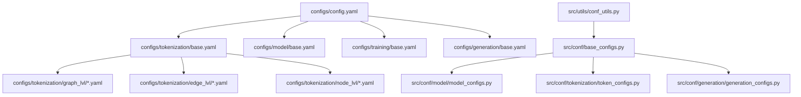
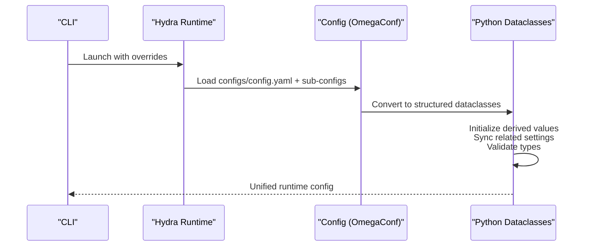
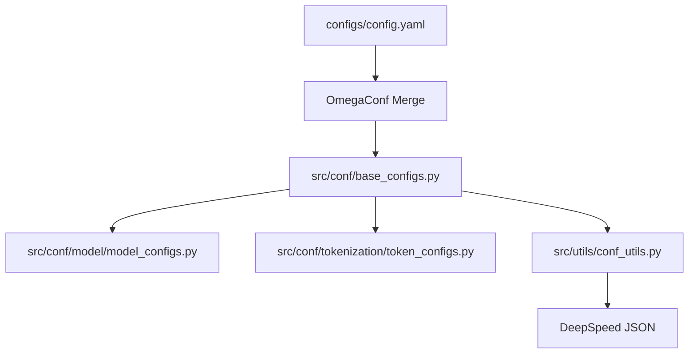
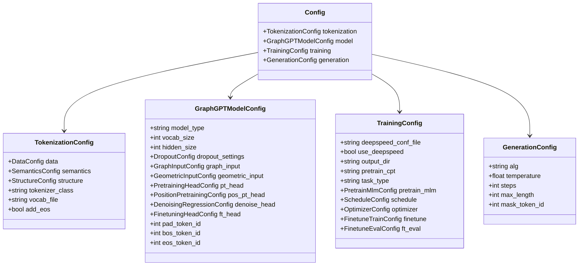

# YAML Configuration Files

<cite>
**Referenced Files in This Document**
- [config.yaml](file://configs/config.yaml)
- [README.md](file://configs/README.md)
- [base.yaml](file://configs/model/base.yaml)
- [base.yaml](file://configs/tokenization/base.yaml)
- [base.yaml](file://configs/training/base.yaml)
- [base.yaml](file://configs/generation/base.yaml)
- [pcqm4m-v2.yaml](file://configs/tokenization/graph_lvl/pcqm4m-v2.yaml)
- [ogbl_ppa.yaml](file://configs/tokenization/edge_lvl/ogbl_ppa.yaml)
- [base_configs.py](file://src/conf/base_configs.py)
- [model_configs.py](file://src/conf/model/model_configs.py)
- [token_configs.py](file://src/conf/tokenization/token_configs.py)
- [conf_utils.py](file://src/utils/conf_utils.py)
- [pcqm4m_v2_pretrain.sh](file://examples/graph_lvl/pcqm4m_v2_pretrain.sh)
- [proteins_pretrain.sh](file://examples/node_lvl/proteins_pretrain.sh)
</cite>

## Table of Contents
1. [Introduction](#introduction)
2. [Project Structure](#project-structure)
3. [Core Components](#core-components)
4. [Architecture Overview](#architecture-overview)
5. [Detailed Component Analysis](#detailed-component-analysis)
6. [Dependency Analysis](#dependency-analysis)
7. [Performance Considerations](#performance-considerations)
8. [Troubleshooting Guide](#troubleshooting-guide)
9. [Conclusion](#conclusion)
10. [Appendices](#appendices)

## Introduction
This document explains the YAML configuration system used by Graph-GPT. It focuses on how the main config.yaml imports modular sub-configurations for tokenization, model, training, and generation, and how nested structures and parameter inheritance work. It also provides practical examples for modifying parameters across experiments, guidance for adding new parameters while maintaining backward compatibility, and common pitfalls with debugging techniques.

## Project Structure
The configuration system is organized around a central config.yaml that imports modular base configurations for tokenization, model, training, and generation. Each module defines a base.yaml with default parameters and dataset-specific overrides. The Python configuration utilities define strongly typed dataclasses that validate and merge YAML settings into a unified runtime configuration.

**Diagram sources**
- [config.yaml](file://configs/config.yaml)
- [base.yaml](file://configs/tokenization/base.yaml)
- [base.yaml](file://configs/model/base.yaml)
- [base.yaml](file://configs/training/base.yaml)
- [base.yaml](file://configs/generation/base.yaml)
- [pcqm4m-v2.yaml](file://configs/tokenization/graph_lvl/pcqm4m-v2.yaml)
- [ogbl_ppa.yaml](file://configs/tokenization/edge_lvl/ogbl_ppa.yaml)
- [base_configs.py](file://src/conf/base_configs.py)
- [model_configs.py](file://src/conf/model/model_configs.py)
- [token_configs.py](file://src/conf/tokenization/token_configs.py)
- [conf_utils.py](file://src/utils/conf_utils.py)

**Section sources**
- [config.yaml](file://configs/config.yaml)
- [README.md](file://configs/README.md)

## Core Components
- Central configuration: config.yaml imports tokenization, model, training, and generation base configurations and sets project-wide defaults and Hydra run directory templates.
- Tokenization configuration: Defines tokenizer class, dataset metadata, semantic attributes, structure tokens, and vocabulary settings.
- Model configuration: Defines GraphGPT architecture parameters, dropout settings, graph input stacking, geometric inputs, pretraining and downstream heads, and tokenizer-related IDs.
- Training configuration: Defines DeepSpeed integration, scheduling, optimizer hyperparameters, batching, data loading, and evaluation settings.
- Generation configuration: Defines diffusion algorithms, sampling parameters, length control, and special token IDs for generation.

Typical values and defaults are defined in each base.yaml. They can be overridden via command-line arguments or dataset-specific YAML files.

**Section sources**
- [config.yaml](file://configs/config.yaml)
- [base.yaml](file://configs/tokenization/base.yaml)
- [base.yaml](file://configs/model/base.yaml)
- [base.yaml](file://configs/training/base.yaml)
- [base.yaml](file://configs/generation/base.yaml)

## Architecture Overview
The configuration architecture follows a layered pattern:
- defaults in config.yaml merge base configurations for tokenization, model, training, and generation.
- Dataset-specific tokenization YAMLs override base settings for a given dataset.
- Python dataclasses validate and normalize configuration, compute derived values, and synchronize related settings across modules.

**Diagram sources**
- [config.yaml](file://configs/config.yaml)
- [base_configs.py](file://src/conf/base_configs.py)
- [model_configs.py](file://src/conf/model/model_configs.py)
- [token_configs.py](file://src/conf/tokenization/token_configs.py)
- [conf_utils.py](file://src/utils/conf_utils.py)

## Detailed Component Analysis

### config.yaml: Main Defaults and Imports
- Uses defaults to merge tokenization, model, training, and generation base configurations.
- Sets project_name and Hydra run/sweep output directories with timestamp placeholders.
- The override for hydra/launcher ensures basic launcher behavior.

Practical usage:
- To switch datasets, specify tokenization=<dir>/<file_without_extension>.
- To override parameters, append --key=value pairs to the command.

**Section sources**
- [config.yaml](file://configs/config.yaml)

### Tokenization Configuration
Purpose:
- Configure tokenizer class, dataset location and identifiers, semantic attribute encodings, structure tokens, and vocabulary settings.

Key parameters:
- data: data_dir, dataset, data_path, ensemble_datasets, sampling, return_valid_test, odps.
- semantics: node/edge/graph attribute encodings and embedding dimensions; reserved tokens and number tokens.
- structure: tokens for nodes, edges, graphs, and common tokens; scope and cyclic settings.
- tokenizer_class, vocab_file, add_eos, label_tokens_to_pad.

Typical values:
- For graph-level tasks, use graph_lvl/<dataset>.yaml.
- For edge-level tasks, use edge_lvl/<dataset>.yaml.

Example overrides:
- Change data_dir and dataset for a new dataset.
- Adjust semantics.node.dim and semantics.edge.dim to match dataset features.
- Modify structure tokens if your dataset requires custom tokens.

**Section sources**
- [base.yaml](file://configs/tokenization/base.yaml)
- [pcqm4m-v2.yaml](file://configs/tokenization/graph_lvl/pcqm4m-v2.yaml)
- [ogbl_ppa.yaml](file://configs/tokenization/edge_lvl/ogbl_ppa.yaml)

### Model Configuration
Purpose:
- Define GraphGPT architecture, attention settings, positional embeddings, dropout, and specialized heads for pretraining and fine-tuning.

Key parameters:
- Core architecture: model_type, vocab_size, hidden_size, intermediate_size, num_hidden_layers, num_attention_heads, head_dim, attention_bias, mlp_bias, hidden_act, max_position_embeddings, initializer_range, rms_norm_eps, tie_word_embeddings, rope_theta, rope_scaling, use_cache, attn_implementation.
- Graph-specific: causal_attention, rope_range, dropout_settings, graph_input (stacked_feat, stack_method, stacked_feat_agg_method, embed_dim), geometric_input (pos_agg_method, pos_bins).
- Heads: pt_head (next_n_token, use_generative, use_discriminative, focal_gamma, smtp_inside), pos_pt_head (smtp_power, problem_type, smtp_3d_power, smtp_3d_noise_scale, coord_lvl_mask, num_bins, num_bins_line, num_bins_cube, apply_denoise, label_smoothing, pos_agg_method, use_pos_proj, loss_agg, pos_range, smtp_2d_rate, smtp_2d_replace_rate, sep_2d3d_inputs, global_2d_mask, use_discriminative), denoise_head (noise_scale, denoise_wgt, denoise_schedule_pow, bi_causal, r_2d, r_3d, r_both, add_pos_type, inputs_transform, num_bins_line, num_bins_cube, pos_range, use_pos_proj, smtp_3d, smtp_wgt, smtp_3d_scheduler_power, smtp_denoise, smtp_vocab, smtp_2d_rate, smtp_2d_scheduler_power), ft_head (task_type, task_ratio, problem_type, pooling_method, mlp, dropout, loss_type, metric_type, num_neg, num_labels).
- Tokenizer IDs: pad_token_id, bos_token_id, eos_token_id, cls_token_id.
- Parallelism plans: pretraining_tp, base_model_tp_plan, base_model_pp_plan.

Typical values:
- For small experiments, reduce hidden_size and num_hidden_layers.
- For molecular tasks, adjust geometric_input.pos_bins and denoise_head.smtp_* parameters.

**Section sources**
- [base.yaml](file://configs/model/base.yaml)
- [model_configs.py](file://src/conf/model/model_configs.py)

### Training Configuration
Purpose:
- Configure DeepSpeed integration, scheduling, optimizer, batching, data loading, and evaluation settings.

Key parameters:
- deepspeed_conf_file, use_deepspeed, output_dir, pretrain_cpt, pretrain_mode, gpu_name.
- task_type, pretrain_mlm (name, params.fixed_ratio, params.power, params.mtp, params.umr_clip, dlm_wgt, num_gen_samples), task_conversion.
- schedule (epochs, warmup_epochs, total_tokens, warmup_tokens, total_num_steps, warmup_num_steps, logging_steps, samples_per_saving, steps_per_saving, samples_per_eval).
- optimizer (lr, min_lr, betas, weight_decay, eps, max_grad_norm, gradient_accumulation_steps, use_ema, ema_decay).
- tot_samples, batch_size, batch_size_eval, max_length, pad_to_multiple_of, pack_tokens, num_workers, num_workers_eval, valid_percent, do_valid, do_test, do_generation, do_infer, pt_eval_only, focal_gamma.
- distributed (world_size, rank).
- finetune (freeze, seed, use_aux, aux_ratio, task_ratio).
- ft_eval (save_pred, save_hidden_states, infer_only, eval_only, epoch_per_eval, k_samplers, true_valid).

Typical values:
- Increase batch_size and gradient_accumulation_steps for larger models.
- Tune total_tokens and warmup_tokens for long-horizon pretraining.

**Section sources**
- [base.yaml](file://configs/training/base.yaml)
- [base_configs.py](file://src/conf/base_configs.py)
- [conf_utils.py](file://src/utils/conf_utils.py)

### Generation Configuration
Purpose:
- Configure diffusion algorithms, sampling parameters, length control, and special token IDs for generation.

Key parameters:
- alg, alg_temp, steps, eps, parallel_gen.
- temperature, top_p, top_k.
- max_length, max_new_tokens.
- num_return_sequences, return_dict_in_generate, output_history.
- mask_token_id, pad_token_id, bos_token_id, eos_token_id.

Typical values:
- For fast decoding, set temperature to 0 and choose top-p or top-k.
- For exploration, increase temperature and steps.

**Section sources**
- [base.yaml](file://configs/generation/base.yaml)

### YAML Syntax, Nested Structures, and Parameter Inheritance
- Nested structures: Each module’s YAML defines a top-level key (e.g., tokenization:, model:, training:, generation:) containing nested dictionaries and lists.
- Parameter inheritance: config.yaml’s defaults merge base configurations; dataset-specific YAMLs override base settings; command-line overrides take precedence.
- Strong typing: Python dataclasses validate types and defaults, preventing invalid combinations at runtime.

Practical examples:
- Override model hidden_size and num_hidden_layers for a smaller model.
- Switch tokenization to a dataset-specific YAML for a new dataset.
- Adjust training schedule by overriding schedule.total_tokens and schedule.warmup_tokens.

**Section sources**
- [config.yaml](file://configs/config.yaml)
- [base.yaml](file://configs/tokenization/base.yaml)
- [base.yaml](file://configs/model/base.yaml)
- [base.yaml](file://configs/training/base.yaml)
- [base.yaml](file://configs/generation/base.yaml)
- [base_configs.py](file://src/conf/base_configs.py)

### Adding New Configuration Parameters and Backward Compatibility
Guidance:
- Add new fields to the appropriate Python dataclass (e.g., model_configs.py, token_configs.py, base_configs.py).
- Provide a default value to preserve backward compatibility.
- Keep YAML keys aligned with the dataclass structure.
- If introducing a breaking change, document it and provide migration notes.

Validation:
- Python dataclasses enforce presence and types of required fields.
- Derived initialization functions (e.g., init_stacked_feat, init_embed_dim, sync_config) compute dependent values and ensure consistency.

**Section sources**
- [base_configs.py](file://src/conf/base_configs.py)
- [model_configs.py](file://src/conf/model/model_configs.py)
- [token_configs.py](file://src/conf/tokenization/token_configs.py)

### Practical Examples of Modifying YAML Parameters
Examples from scripts demonstrate how to override parameters for different experimental setups:

- Graph-level PCQM4Mv2 pretraining:
  - Overrides include tokenization.data.data_dir, tokenization.data.dataset, training.task_type, training.batch_size, model.dropout_settings.*, generation.*, and more.
  - Demonstrates switching tokenization config via tokenization=<dir>/<file_without_extension>.

- Node-level Proteins pretraining:
  - Overrides include dataset-specific tokenization_config, model architecture parameters, training schedule, optimizer, and dropout settings.

These examples show how to:
- Select dataset-specific tokenization YAMLs.
- Override nested keys (e.g., model.graph_input.stack_method).
- Pass overrides via command line to Hydra.

**Section sources**
- [pcqm4m_v2_pretrain.sh](file://examples/graph_lvl/pcqm4m_v2_pretrain.sh)
- [proteins_pretrain.sh](file://examples/node_lvl/proteins_pretrain.sh)

## Dependency Analysis
The configuration system depends on:
- OmegaConf for YAML parsing and merging.
- Python dataclasses for validation and normalization.
- Utilities for DeepSpeed configuration parsing and derived value computation.

**Diagram sources**
- [config.yaml](file://configs/config.yaml)
- [base_configs.py](file://src/conf/base_configs.py)
- [model_configs.py](file://src/conf/model/model_configs.py)
- [token_configs.py](file://src/conf/tokenization/token_configs.py)
- [conf_utils.py](file://src/utils/conf_utils.py)

**Section sources**
- [config.yaml](file://configs/config.yaml)
- [base_configs.py](file://src/conf/base_configs.py)
- [conf_utils.py](file://src/utils/conf_utils.py)

## Performance Considerations
- Use DeepSpeed configuration files to scale batch sizes and enable ZeRO optimizations.
- Tune gradient_accumulation_steps to fit memory constraints.
- Adjust pack_tokens and pad_to_multiple_of to improve throughput.
- Reduce max_position_embeddings for smaller contexts to save memory.
- Use appropriate schedule.total_tokens and warmup_tokens for long-horizon pretraining.

[No sources needed since this section provides general guidance]

## Troubleshooting Guide
Common YAML configuration errors and debugging techniques:
- Invalid key names: Ensure keys match the module structure (e.g., tokenization.*, model.*, training.*, generation.*).
- Type mismatches: OmegaConf merges values; if a string is expected but a list is provided, validation will fail. Check Python dataclass types.
- Missing required fields: If a field is marked as required in the dataclass, omitting it will cause an error during structured instantiation.
- Conflicting overrides: Command-line overrides take precedence; verify the final merged configuration with debug prints or by printing the resolved YAML.
- DeepSpeed configuration: Ensure deepspeed_conf_file points to a valid JSON and that optimizer/scheduler parameters align with the training configuration.

Debugging tips:
- Print the resolved configuration after merging YAML and CLI overrides.
- Use OmegaConf.to_yaml to inspect nested structures.
- Temporarily disable DeepSpeed to isolate configuration issues.
- Verify derived values computed by initialization functions (e.g., stacked_feat, embed_dim).

**Section sources**
- [base_configs.py](file://src/conf/base_configs.py)
- [conf_utils.py](file://src/utils/conf_utils.py)

## Conclusion
Graph-GPT’s YAML configuration system provides a modular, strongly typed, and extensible way to define and override experiment settings. By organizing parameters into tokenization, model, training, and generation modules, and by leveraging Python dataclasses for validation and derived computations, the system supports rapid experimentation while maintaining reliability and backward compatibility.

[No sources needed since this section summarizes without analyzing specific files]

## Appendices

### Appendix A: Configuration Class Relationships

**Diagram sources**
- [base_configs.py](file://src/conf/base_configs.py)
- [model_configs.py](file://src/conf/model/model_configs.py)
- [token_configs.py](file://src/conf/tokenization/token_configs.py)
