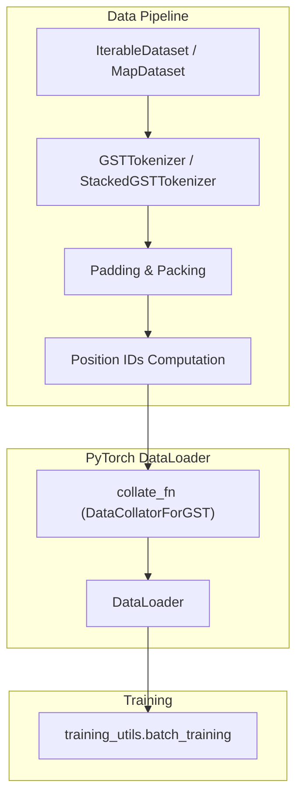
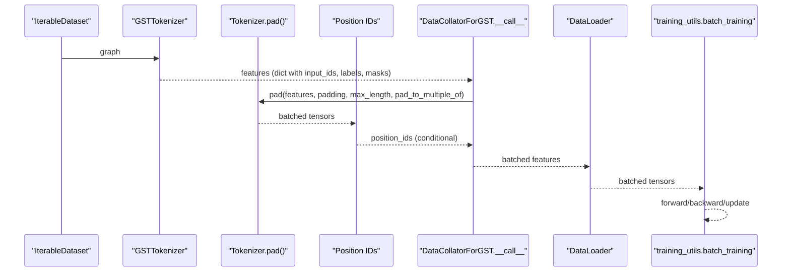
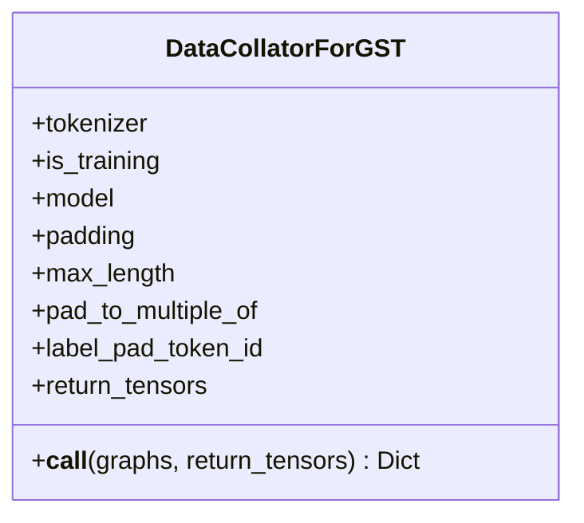
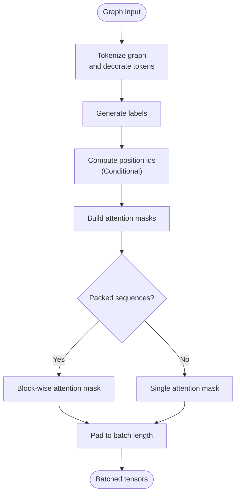
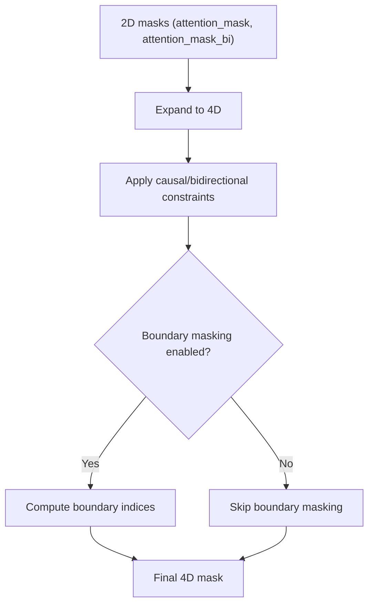
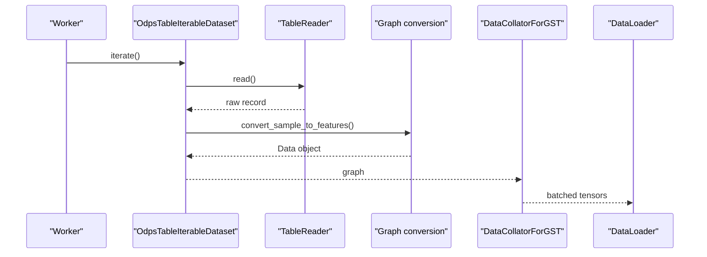
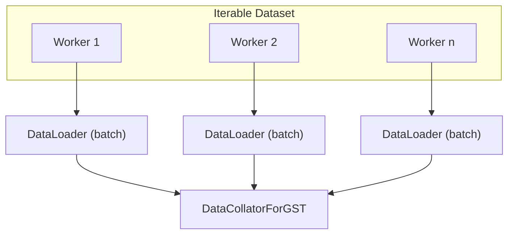
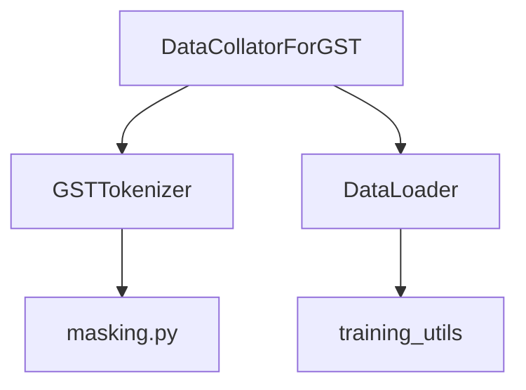

# Collation & Batch Processing

<cite>
**Referenced Files in This Document**
- [collator.py](file://src/data/collator.py)
- [core.py](file://src/data/tokenizer/core.py)
- [masking.py](file://src/data/tokenizer/masking.py)
- [base_configs.py](file://src/conf/base_configs.py)
- [training_utils.py](file://src/utils/training_utils.py)
- [pretrain_mode.py](file://src/training/pretrain_mode.py)
- [train_pretrain.py](file://examples/train_pretrain.py)
- [modeling_common.py](file://src/models/graphgpt/modeling_common.py)
- [utils_graphgpt.py](file://src/models/graphgpt/utils_graphgpt.py)
</cite>

## Update Summary
**Changes Made**
- Removed documentation of dynamic attribute masking ratio calculation system from DataCollatorForGST
- Updated collator section to reflect simplified collation process without dynamic masking
- Revised position_ids computation section to reflect simplified logic without cyclic encoding system
- Updated architecture diagrams to show streamlined collation flow
- Enhanced troubleshooting guide with position_ids-related debugging guidance

## Table of Contents
1. [Introduction](#introduction)
2. [Project Structure](#project-structure)
3. [Core Components](#core-components)
4. [Architecture Overview](#architecture-overview)
5. [Detailed Component Analysis](#detailed-component-analysis)
6. [Dependency Analysis](#dependency-analysis)
7. [Performance Considerations](#performance-considerations)
8. [Troubleshooting Guide](#troubleshooting-guide)
9. [Conclusion](#conclusion)
10. [Appendices](#appendices)

## Introduction
This document explains the collation and batch processing system in Graph-GPT. It focuses on how individual graph samples are transformed into model-ready batches, including tokenization, sequence padding, attention mask generation, and integration with PyTorch DataLoader and distributed training. It also covers memory optimization techniques, custom collation strategies for different graph tasks, and performance profiling approaches.

**Updated** The collation process now uses a simplified approach without dynamic attribute masking ratio calculation. The complex system that calculated attr_mask_ratio based on training progress has been eliminated, making the pipeline more straightforward and maintainable.

## Project Structure
The collation pipeline spans several modules:
- Tokenization and packing of graph samples into token sequences
- Collation to batched tensors with padding and attention masks
- DataLoader integration and distributed sampling
- Example training scripts and configurations

**Diagram sources**
- [collator.py](file://src/data/collator.py)
- [core.py](file://src/data/tokenizer/core.py)
- [training_utils.py](file://src/utils/training_utils.py)

**Section sources**
- [collator.py](file://src/data/collator.py)
- [core.py](file://src/data/tokenizer/core.py)
- [training_utils.py](file://src/utils/training_utils.py)

## Core Components
- DataCollatorForGST: Applies tokenization and padding to a batch of graph samples, returning a dictionary of tensors ready for the model.
- GSTTokenizer: Converts a graph into a tokenized sequence, generates labels and attention masks, and supports task-specific augmentation.
- Position IDs computation: Simplified system that conditionally generates position_ids without complex cyclic encoding.
- DataLoader integration: Handles sharding, worker initialization, and collation for both Map-style and Iterable datasets.
- Distributed training: Manages sampler distribution across ranks and worker splits for Iterable datasets.

**Section sources**
- [collator.py](file://src/data/collator.py)
- [core.py](file://src/data/tokenizer/core.py)
- [training_utils.py](file://src/utils/training_utils.py)

## Architecture Overview
The collation pipeline transforms raw graphs into tokenized sequences, pads them to a uniform length, and constructs attention masks. The resulting batch is fed into the model via DataLoader with a custom collate function.

**Diagram sources**
- [collator.py](file://src/data/collator.py)
- [core.py](file://src/data/tokenizer/core.py)
- [training_utils.py](file://src/utils/training_utils.py)

## Detailed Component Analysis

### DataCollatorForGST
- Purpose: Tokenize a batch of graphs and pad to a common length, returning tensors for model consumption.
- Key behaviors:
  - Delegates tokenization to the tokenizer and adds an index field.
  - Calls tokenizer.pad to handle padding and attention mask creation.
  - **Updated** No longer implements dynamic attribute masking ratio calculation system.
- Inputs: List of graphs (or tuples of index and graph).
- Output: Dictionary containing tensors such as input_ids, labels, attention_mask, position_ids, and others depending on the task.

**Diagram sources**
- [collator.py](file://src/data/collator.py)

**Section sources**
- [collator.py](file://src/data/collator.py)

### GSTTokenizer and Tokenization
- Purpose: Convert a graph into a tokenized sequence, generate labels, and construct attention masks.
- Key behaviors:
  - Tokenizes nodes/edges/graphs into tokens and decorates with structure and semantics.
  - Generates labels for various tasks (MLM, denoising, classification).
  - Builds position ids and attention masks; supports packed sequences for multi-graph training.
  - **Updated** No longer uses complex dynamic masking ratio calculation system.
- Padding:
  - Determines batch sequence length based on the longest sequence in the batch and configured multiples.
  - Pads input_ids, labels, position_ids, attention_mask, and optional embeddings.
  - Supports left/right padding sides and boundary masking for packed sequences.

**Updated** Position IDs computation is now simplified and handled conditionally. The tokenizer no longer uses complex cyclic encoding systems. Instead, it conditionally generates position_ids based on task requirements and packed sequence handling.

**Diagram sources**
- [core.py](file://src/data/tokenizer/core.py)
- [masking.py](file://src/data/tokenizer/masking.py)

**Section sources**
- [core.py](file://src/data/tokenizer/core.py)
- [masking.py](file://src/data/tokenizer/masking.py)

### Attention Mask Utilities
- Purpose: Construct 4D attention masks for causal/bidirectional and boundary-aware masking.
- Key functions:
  - _prepare_4d_causal_bi_attention_mask: Builds a 4D mask combining causal and bidirectional constraints.
  - _prepare_4d_attention_mask: Expands 2D masks to 4D for transformer layers.
  - _prepare_4d_bi_causal_attention_mask: Alternative causal/bidirectional mask construction.
  - get_masked_boundary_idx: Computes indices to mask boundaries in packed sequences.

**Diagram sources**
- [training_utils.py](file://src/utils/training_utils.py)

**Section sources**
- [training_utils.py](file://src/utils/training_utils.py)

### Dataset Iterables and Streaming
- ShaDowKHopSeqIterDataset: Streams localized subgraphs around randomly selected nodes, yielding ego-k-hop sampled subgraphs.
- GraphsIterableDataset: Infinite iterator of random graphs generated via Erdős–Rényi graphs.
- OdpsTableIterableDataset: Reads graph data from an ODPS table, slicing rows per worker and supporting permutation of node indices.
- Worker initialization: DataLoader worker_init_fn_seed seeds Python and NumPy RNGs per worker.

**Diagram sources**
- [pretrain_mode.py](file://src/training/pretrain_mode.py)
- [training_utils.py](file://src/utils/training_utils.py)

**Section sources**
- [pretrain_mode.py](file://src/training/pretrain_mode.py)
- [training_utils.py](file://src/utils/training_utils.py)

### DataLoader Integration and Distributed Training
- DataLoader configuration:
  - Uses collate_fn (DataCollatorForGST) to batch and pad samples.
  - worker_init_fn_seed initializes per-worker RNG seeds.
  - Prefetch factor and pin_memory settings tuned for throughput.
- Distributed sampling:
  - For IterableDatasets, steps_per_epoch considers world_size and num_workers.
  - For MapDatasets, samplers are distributed across ranks.
- ODPS table dataset:
  - Skips previously processed samples per GPU to resume training.
  - Initializes a new DataLoader per epoch with adjusted sampler and collator.

**Diagram sources**
- [training_utils.py](file://src/utils/training_utils.py)
- [pretrain_mode.py](file://src/training/pretrain_mode.py)

**Section sources**
- [training_utils.py](file://src/utils/training_utils.py)
- [pretrain_mode.py](file://src/training/pretrain_mode.py)

### Memory Optimization Techniques
- Dynamic batching:
  - Batch sequence length computed as the smallest multiple of pad_to_multiple_of greater than or equal to the max sequence length in the batch, bounded by max_position_embeddings.
- Gradient accumulation:
  - Training utilities enforce gradient_accumulation_steps == 1 for non-Distributed mode; DeepSpeed handles accumulation internally.
- Embedding inputs:
  - Optional raw embeddings are included in the batch when present; they are padded consistently with input_ids.
- Prefetch and pinning:
  - Prefetch factor and pin_memory improve CPU-to-GPU transfer latency.

**Section sources**
- [core.py](file://src/data/tokenizer/core.py)
- [training_utils.py](file://src/utils/training_utils.py)
- [training_utils.py](file://src/utils/training_utils.py)

### Custom Collation Strategies for Different Graph Tasks
- Pretraining (MLM):
  - **Updated** Uses fixed masking ratio configuration instead of dynamic scheduling; boundary masking disabled for packed sequences.
- Contrastive Learning (CL):
  - Extends sequences with a summary token to avoid repeated EOS usage.
- Node-level tasks:
  - Attaches target node identity and optional edge attributes to input_ids; labels derived accordingly.
- Edge-level tasks:
  - Attaches source and destination node identities and optional edge attributes.
- Graph-level tasks:
  - Extends inputs with graph-level targets and optional binary classification labels.

Examples of task-specific preparation functions:
- prepare_inputs_for_pretrain_mlm
- prepare_inputs_for_node_lvl_task
- prepare_inputs_for_edge_lvl_task
- prepare_inputs_for_graph_lvl_task

**Updated** Position IDs handling is now simplified across all task types. The system conditionally computes position_ids only when needed, eliminating the complex cyclic encoding system that was previously used for certain graph traversal patterns.

**Section sources**
- [core.py](file://src/data/tokenizer/core.py)
- [base_configs.py](file://src/conf/base_configs.py)

### Relationship Between Collation and Tokenization
- Tokenization produces token sequences and labels; collation ensures they are padded and shaped for the model.
- Attention masks are constructed from attention_mask and attention_mask_bi; boundary masking is optional and computed post-padding.
- Position ids are generated during tokenization and extended when task-specific tokens are appended.

**Updated** The position_ids computation has been simplified to use a straightforward sequential approach rather than complex cyclic encoding. This makes the system more robust and easier to debug while maintaining compatibility with RoPE-based positional encodings.

**Section sources**
- [core.py](file://src/data/tokenizer/core.py)
- [training_utils.py](file://src/utils/training_utils.py)

## Dependency Analysis
- DataCollatorForGST depends on GSTTokenizer for tokenization.
- GSTTokenizer depends on masking strategies for task-specific input preparation.
- DataLoader integration depends on training_utils for sampler distribution and worker initialization.
- Training integration depends on training_utils for moving tensors to device and performing forward/backward/update.

**Diagram sources**
- [collator.py](file://src/data/collator.py)
- [core.py](file://src/data/tokenizer/core.py)
- [masking.py](file://src/data/tokenizer/masking.py)
- [training_utils.py](file://src/utils/training_utils.py)

**Section sources**
- [collator.py](file://src/data/collator.py)
- [core.py](file://src/data/tokenizer/core.py)
- [masking.py](file://src/data/tokenizer/masking.py)
- [training_utils.py](file://src/utils/training_utils.py)

## Performance Considerations
- Sequence length management:
  - pad_to_multiple_of reduces overhead by aligning to hardware-friendly sizes.
  - max_length caps memory usage; long sequences increase compute cost quadratically in attention.
- Prefetch and pin memory:
  - prefetch_factor and pin_memory reduce CPU-to-GPU transfer stalls.
- Worker initialization:
  - worker_init_fn_seed ensures reproducible randomness across workers.
- Attention mask computation:
  - Boundary masking is optional and computationally expensive; disable for packed sequences if not needed.
- Gradient accumulation:
  - Enforced to 1 in non-Distributed mode; use DeepSpeed for larger effective batch sizes.

**Updated** Position IDs computation is now more efficient due to the simplified logic. The elimination of complex cyclic encoding reduces computational overhead while maintaining positional awareness for RoPE-based models.

## Troubleshooting Guide
- Shape mismatches:
  - Ensure input_ids and labels have the same length; attention_mask length equals input_ids length.
  - For packed sequences, attention_mask is a block-diagonal matrix; verify block sizes match segment lengths.
- Padding side and boundary masking:
  - Left padding may shift positions; confirm padding_side alignment with model expectations.
  - When mask_boundary is enabled, verify boundary_mask_idx correctness for packed sequences.
- Iterable dataset worker splits:
  - Confirm worker_init_fn_seed is set; ensure sliced ranges are correct for ODPS datasets.
- Gradient accumulation:
  - Non-Distributed mode enforces gradient_accumulation_steps == 1; adjust training configuration accordingly.
- Position IDs issues:
  - Verify position_ids are properly generated for packed sequences when using RoPE-based models.
  - Check that position_ids reset correctly for each document in packed sequences.
  - Ensure position_ids length matches input_ids length after padding.

**Updated** Added troubleshooting guidance for position_ids computation issues. The simplified system should resolve most position-related problems, but these checks help identify edge cases in packed sequence handling.

**Section sources**
- [core.py](file://src/data/tokenizer/core.py)
- [training_utils.py](file://src/utils/training_utils.py)

## Conclusion
The Graph-GPT collation and batch processing system integrates tokenization, padding, and attention mask generation into a robust pipeline suitable for diverse graph tasks. It supports streaming datasets, distributed training, and memory-efficient batching strategies. By leveraging task-specific input preparation and attention mask utilities, it enables scalable pretraining and fine-tuning across node, edge, and graph-level objectives.

**Updated** The recent simplification of the collation process has made the system more robust and maintainable while preserving all essential functionality for RoPE-based positional encoding and packed sequence handling.

## Appendices

### Example Training Entry Point
- The training entry point demonstrates launching the pretraining pipeline with Hydra configuration.

**Section sources**
- [train_pretrain.py](file://examples/train_pretrain.py)

### Position IDs Computation Details
The position_ids computation follows a simplified approach:

1. **Conditional Generation**: Position IDs are generated only when needed for RoPE-based models
2. **Sequential Reset**: For packed sequences, position_ids reset to sequential values for each document
3. **RoPE Compatibility**: Position IDs are compatible with rotary positional encodings
4. **Memory Efficient**: Eliminates complex cyclic encoding calculations

**Section sources**
- [core.py](file://src/data/tokenizer/core.py)
- [modeling_common.py](file://src/models/graphgpt/modeling_common.py)
- [utils_graphgpt.py](file://src/models/graphgpt/utils_graphgpt.py)
