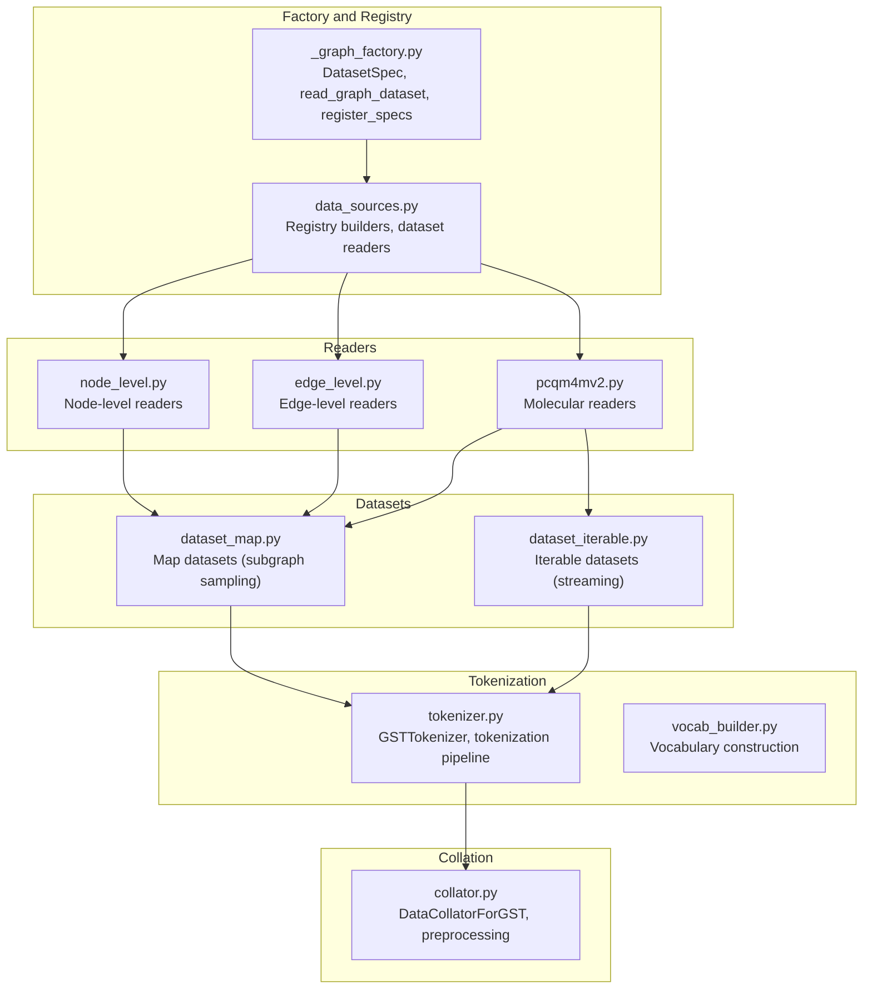
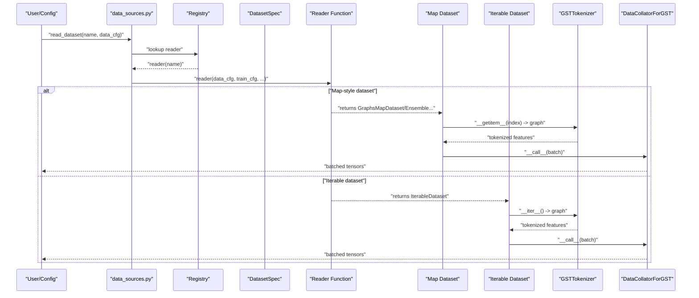
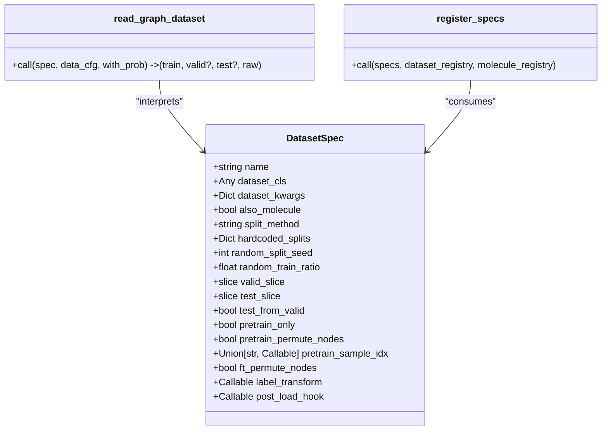
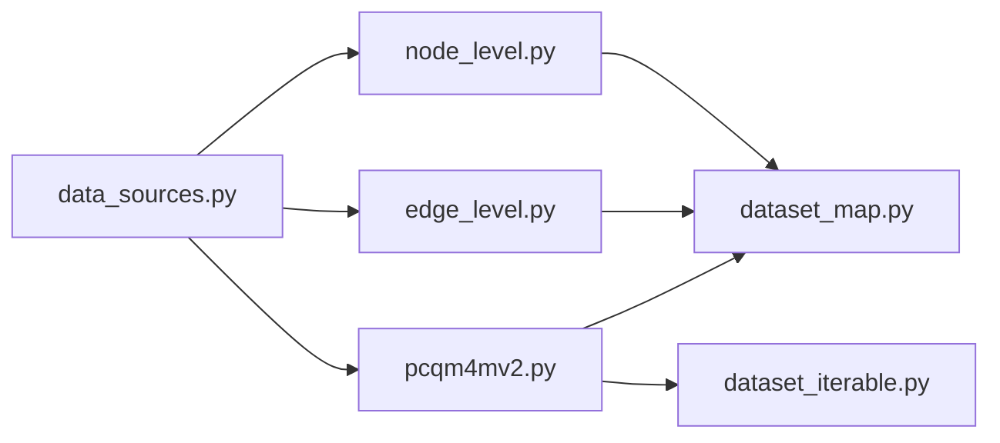
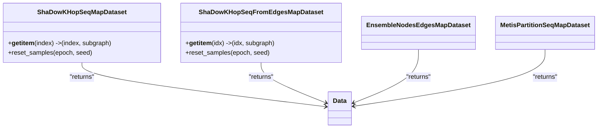
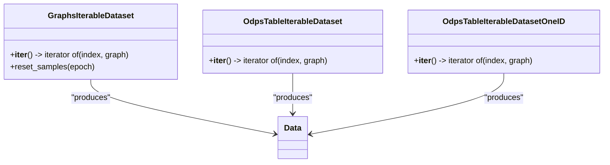
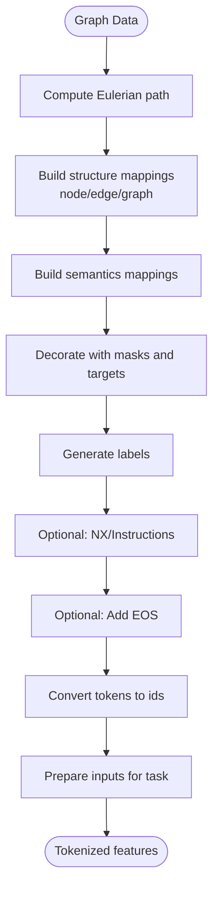
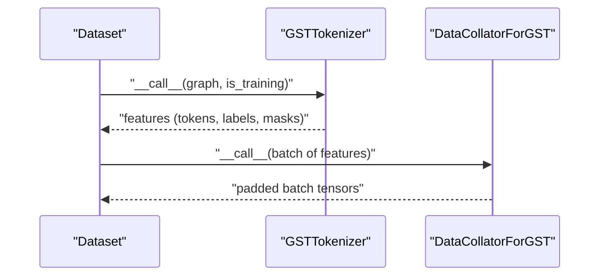
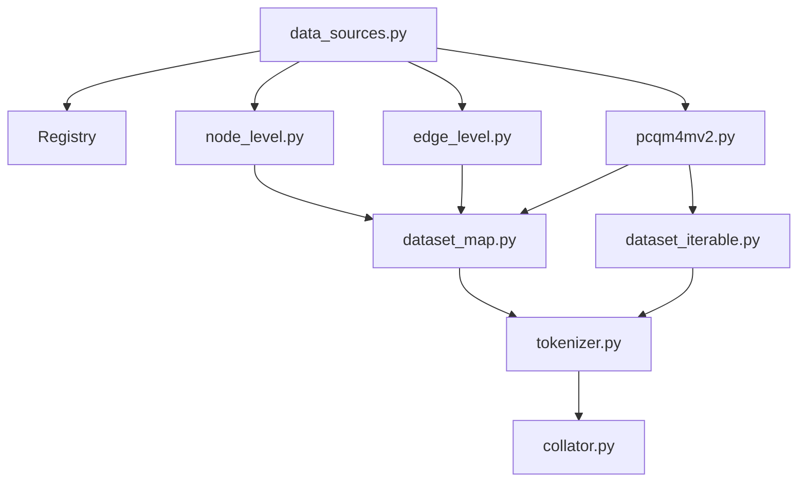

# Data Pipeline

<cite>
**Referenced Files in This Document**
- [src/data/_graph_factory.py](file://src/data/_graph_factory.py)
- [src/data/data_sources.py](file://src/data/data_sources.py)
- [src/data/dataset_map.py](file://src/data/dataset_map.py)
- [src/data/dataset_iterable.py](file://src/data/dataset_iterable.py)
- [src/data/collator.py](file://src/data/collator.py)
- [src/data/tokenizer.py](file://src/data/tokenizer.py)
- [src/data/vocab_builder.py](file://src/data/vocab_builder.py)
- [src/data/_readers/edge_level.py](file://src/data/_readers/edge_level.py)
- [src/data/_readers/node_level.py](file://src/data/_readers/node_level.py)
- [src/data/_readers/pcqm4mv2.py](file://src/data/_readers/pcqm4mv2.py)
- [configs/tokenization/base.yaml](file://configs/tokenization/base.yaml)
- [src/utils/dataset_utils.py](file://src/utils/dataset_utils.py)
- [src/training/pipeline.py](file://src/training/pipeline.py)
- [src/training/pretrain_mode.py](file://src/training/pretrain_mode.py)
- [src/utils/loader_utils.py](file://src/utils/loader_utils.py)
</cite>

## Table of Contents
1. [Introduction](#introduction)
2. [Project Structure](#project-structure)
3. [Core Components](#core-components)
4. [Architecture Overview](#architecture-overview)
5. [Detailed Component Analysis](#detailed-component-analysis)
6. [Dependency Analysis](#dependency-analysis)
7. [Performance Considerations](#performance-considerations)
8. [Troubleshooting Guide](#troubleshooting-guide)
9. [Conclusion](#conclusion)
10. [Appendices](#appendices)

## Introduction
This document explains the Graph-GPT data pipeline with a focus on the generic dataset factory and data processing workflows. It covers the factory pattern with DatasetSpec registry, dataset creation mechanisms, and reader abstraction. It documents the data flow from raw graph data through tokenization to model-ready batches, including collation, sequence building, and batch preparation. Practical examples show how to add new datasets via the registry pattern, and it clarifies the relationships between different reader types (edge-level, node-level, molecular) and their specific processing requirements. Guidance is provided for data validation, preprocessing steps, memory optimization strategies, performance considerations, parallel processing, debugging, and throughput optimization.

## Project Structure
The data pipeline spans several modules:
- Factory and registry: DatasetSpec-driven readers and registration
- Readers: Node-level, edge-level, and molecular datasets
- Datasets: Map-style and iterable datasets for sampling and streaming
- Tokenization: Graph-structured tokenization and vocabulary
- Collation: Dynamic batching and padding
- Training orchestration: Pipeline and loaders

**Diagram sources**
- [src/data/_graph_factory.py:1-160](file://src/data/_graph_factory.py#L1-L160)
- [src/data/data_sources.py:1-413](file://src/data/data_sources.py#L1-L413)
- [src/data/dataset_map.py:1-800](file://src/data/dataset_map.py#L1-L800)
- [src/data/dataset_iterable.py:1-449](file://src/data/dataset_iterable.py#L1-L449)
- [src/data/tokenizer.py:1-800](file://src/data/tokenizer.py#L1-L800)
- [src/data/collator.py:1-134](file://src/data/collator.py#L1-L134)
- [src/data/vocab_builder.py:1-219](file://src/data/vocab_builder.py#L1-L219)
- [src/data/_readers/node_level.py:1-369](file://src/data/_readers/node_level.py#L1-L369)
- [src/data/_readers/edge_level.py:1-381](file://src/data/_readers/edge_level.py#L1-L381)
- [src/data/_readers/pcqm4mv2.py:1-200](file://src/data/_readers/pcqm4mv2.py#L1-L200)

**Section sources**
- [src/data/_graph_factory.py:1-160](file://src/data/_graph_factory.py#L1-L160)
- [src/data/data_sources.py:1-413](file://src/data/data_sources.py#L1-L413)

## Core Components
- Generic dataset factory and registry
  - DatasetSpec declarative records define dataset constructors, splits, pretrain/finetune modes, and hooks.
  - read_graph_dataset interprets a spec and returns train/validation/test datasets plus the raw dataset.
  - register_specs registers DatasetSpec instances into dataset and molecule registries.
- Reader abstraction
  - Node-level, edge-level, and molecular readers are registered under the dataset registry and return map or iterable datasets.
- Map and iterable datasets
  - Map datasets sample subgraphs (node/edge ego-k-hop, METIS partitions) and expose them as indexed items.
  - Iterable datasets stream graphs (synthetic, ODPS tables) for large-scale training.
- Tokenization and vocabulary
  - GSTTokenizer transforms graphs into token sequences, applies masks and decorations, and prepares inputs for tasks.
  - Vocabulary builder constructs structure and semantics vocabularies and caches them.
- Collation and batching
  - DataCollatorForGST tokenizes and pads sequences, supports dynamic padding and attention masks, and integrates with training loops.

**Section sources**
- [src/data/_graph_factory.py:1-160](file://src/data/_graph_factory.py#L1-L160)
- [src/data/data_sources.py:1-413](file://src/data/data_sources.py#L1-L413)
- [src/data/dataset_map.py:1-800](file://src/data/dataset_map.py#L1-L800)
- [src/data/dataset_iterable.py:1-449](file://src/data/dataset_iterable.py#L1-L449)
- [src/data/tokenizer.py:1-800](file://src/data/tokenizer.py#L1-L800)
- [src/data/vocab_builder.py:1-219](file://src/data/vocab_builder.py#L1-L219)
- [src/data/collator.py:1-134](file://src/data/collator.py#L1-L134)

## Architecture Overview
The pipeline orchestrates dataset selection, preprocessing, tokenization, and batching for training or evaluation.

**Diagram sources**
- [src/data/data_sources.py:1-413](file://src/data/data_sources.py#L1-L413)
- [src/data/_graph_factory.py:50-101](file://src/data/_graph_factory.py#L50-L101)
- [src/data/dataset_map.py:132-268](file://src/data/dataset_map.py#L132-L268)
- [src/data/dataset_iterable.py:134-190](file://src/data/dataset_iterable.py#L134-L190)
- [src/data/tokenizer.py:585-612](file://src/data/tokenizer.py#L585-L612)
- [src/data/collator.py:70-111](file://src/data/collator.py#L70-L111)

## Detailed Component Analysis

### Generic Dataset Factory and Registry
- DatasetSpec encapsulates dataset metadata, split strategy, pretrain/finetune flags, hooks, and constructor arguments.
- read_graph_dataset constructs the dataset, applies label transforms and post-load hooks, resolves splits, and returns map datasets with optional probability weighting.
- register_specs binds DatasetSpec instances to registry keys and optionally to a molecule registry.

**Diagram sources**
- [src/data/_graph_factory.py:19-160](file://src/data/_graph_factory.py#L19-L160)

**Section sources**
- [src/data/_graph_factory.py:1-160](file://src/data/_graph_factory.py#L1-L160)

### Reader Abstraction and Registration
- Node-level readers: ogbn-products, ogbn-arxiv, ogbn-papers100M, ogbn-proteins; use node ego-k-hop sampling and ensemble datasets.
- Edge-level readers: ogbl-ppa, ogbl-citation2, ogbl-wikikg2, ogbl-ddi; use edge ego-k-hop sampling and negative sampling strategies.
- Molecular readers: PCQM4Mv2 and related; support extra features and 3D coordinates; integrate with map datasets and optional ODPS streaming.

**Diagram sources**
- [src/data/data_sources.py:270-290](file://src/data/data_sources.py#L270-L290)
- [src/data/_readers/node_level.py:1-369](file://src/data/_readers/node_level.py#L1-L369)
- [src/data/_readers/edge_level.py:1-381](file://src/data/_readers/edge_level.py#L1-L381)
- [src/data/_readers/pcqm4mv2.py:1-200](file://src/data/_readers/pcqm4mv2.py#L1-L200)
- [src/data/dataset_map.py:1-800](file://src/data/dataset_map.py#L1-L800)
- [src/data/dataset_iterable.py:1-449](file://src/data/dataset_iterable.py#L1-L449)

**Section sources**
- [src/data/data_sources.py:270-290](file://src/data/data_sources.py#L270-L290)
- [src/data/_readers/node_level.py:1-369](file://src/data/_readers/node_level.py#L1-L369)
- [src/data/_readers/edge_level.py:1-381](file://src/data/_readers/edge_level.py#L1-L381)
- [src/data/_readers/pcqm4mv2.py:1-200](file://src/data/_readers/pcqm4mv2.py#L1-L200)

### Map Datasets: Subgraph Sampling and Task Masking
- ShaDowKHopSeqMapDataset: Localized subgraph sampling around a seed node; supports pretrain/finetune masking and optional task-specific masking function.
- ShaDowKHopSeqFromEdgesMapDataset: Link prediction sampling around two nodes; supports negative sampling strategies and edge attributes.
- EnsembleNodesEdgesMapDataset and MetisPartitionSeqMapDataset: Alternative samplers for node/edge tasks and large graphs.

**Diagram sources**
- [src/data/dataset_map.py:132-268](file://src/data/dataset_map.py#L132-L268)
- [src/data/dataset_map.py:271-553](file://src/data/dataset_map.py#L271-L553)
- [src/data/dataset_map.py:33-130](file://src/data/dataset_map.py#L33-L130)

**Section sources**
- [src/data/dataset_map.py:1-800](file://src/data/dataset_map.py#L1-L800)

### Iterable Datasets: Streaming and Parallelism
- GraphsIterableDataset: Generates synthetic graphs with configurable node counts and edge probabilities.
- OdpsTableIterableDataset and OdpsTableIterableDatasetOneID: Stream graphs from ODPS tables; support slicing, permutation, and worker-aware iteration.

**Diagram sources**
- [src/data/dataset_iterable.py:134-190](file://src/data/dataset_iterable.py#L134-L190)
- [src/data/dataset_iterable.py:295-387](file://src/data/dataset_iterable.py#L295-L387)
- [src/data/dataset_iterable.py:192-293](file://src/data/dataset_iterable.py#L192-L293)

**Section sources**
- [src/data/dataset_iterable.py:1-449](file://src/data/dataset_iterable.py#L1-L449)

### Tokenization Pipeline: From Graphs to Tokens
- GSTTokenizer builds Eulerian sequences from graphs, decorates nodes/edges/graphs with structure and semantics, applies masks, and converts tokens to ids.
- It supports packing multiple graphs into a single sequence, dynamic padding, attention masks, and task-specific input preparation.

**Diagram sources**
- [src/data/tokenizer.py:428-612](file://src/data/tokenizer.py#L428-L612)

**Section sources**
- [src/data/tokenizer.py:1-800](file://src/data/tokenizer.py#L1-L800)

### Collation and Batch Preparation
- DataCollatorForGST tokenizes and pads features, supports dynamic padding, attention masks, and boundary masking.
- DataCollatorForTokenizationPreprocessing performs lightweight tokenization without padding for specialized use cases.

**Diagram sources**
- [src/data/collator.py:70-111](file://src/data/collator.py#L70-L111)
- [src/data/tokenizer.py:585-612](file://src/data/tokenizer.py#L585-L612)

**Section sources**
- [src/data/collator.py:1-134](file://src/data/collator.py#L1-L134)

### Practical Example: Adding a New Dataset via Registry Pattern
Steps to add a new dataset:
1. Define a reader function that loads the dataset, applies preprocessing, and returns map or iterable datasets.
2. Register the reader under a dataset name using the registry decorator.
3. Optionally, register the dataset in the molecule registry if applicable.
4. Configure DatasetSpec with split strategy, pretrain/finetune flags, and hooks.
5. Use read_dataset to fetch the dataset and integrate with training.

Example references:
- Reader registration for node-level datasets: [src/data/_readers/node_level.py:363-369](file://src/data/_readers/node_level.py#L363-L369)
- Reader registration for edge-level datasets: [src/data/_readers/edge_level.py:375-381](file://src/data/_readers/edge_level.py#L375-L381)
- DatasetSpec registration: [src/data/data_sources.py:267-268](file://src/data/data_sources.py#L267-L268)

**Section sources**
- [src/data/_readers/node_level.py:363-369](file://src/data/_readers/node_level.py#L363-L369)
- [src/data/_readers/edge_level.py:375-381](file://src/data/_readers/edge_level.py#L375-L381)
- [src/data/data_sources.py:267-268](file://src/data/data_sources.py#L267-L268)

### Relationship Between Reader Types and Processing Requirements
- Node-level readers: Focus on node-centric tasks; use node ego-k-hop sampling; handle class labels and optional masking of node features.
- Edge-level readers: Focus on link prediction; use edge ego-k-hop sampling; implement negative sampling and edge attribute handling.
- Molecular readers: Handle molecular graphs with atom/bond features; support extra features and 3D coordinates; integrate with map datasets and optional ODPS streaming.

**Section sources**
- [src/data/_readers/node_level.py:1-369](file://src/data/_readers/node_level.py#L1-L369)
- [src/data/_readers/edge_level.py:1-381](file://src/data/_readers/edge_level.py#L1-L381)
- [src/data/_readers/pcqm4mv2.py:1-200](file://src/data/_readers/pcqm4mv2.py#L1-L200)

### Data Validation, Preprocessing, and Memory Optimization
- Validation
  - Node count limits enforced during tokenization to fit structure scope.
  - Edge duplication and self-loops handled by preprocessing utilities.
- Preprocessing
  - Node/edge attributes normalized and encoded; global/local node id encoding applied.
  - Undirected graphs constructed; isolated nodes addressed for edge-level tasks.
- Memory optimization
  - Map datasets sample subgraphs to limit memory footprint.
  - Iterable datasets stream data to avoid loading entire datasets.
  - VOCAB caching reduces repeated computation.

**Section sources**
- [src/data/tokenizer.py:432-434](file://src/data/tokenizer.py#L432-L434)
- [src/data/_readers/node_level.py:40-44](file://src/data/_readers/node_level.py#L40-L44)
- [src/data/_readers/edge_level.py:107-132](file://src/data/_readers/edge_level.py#L107-L132)
- [src/data/vocab_builder.py:188-206](file://src/data/vocab_builder.py#L188-L206)

### Data Loading Performance and Parallel Processing
- DataLoader configuration supports configurable workers, pinning, prefetching, and drop-last behavior.
- Iterable datasets leverage worker slicing and deterministic shuffling across epochs.
- ODPS streaming datasets support per-worker slicing and optional skipping samples for resuming.

**Section sources**
- [src/training/pretrain_mode.py:377-388](file://src/training/pretrain_mode.py#L377-L388)
- [src/utils/loader_utils.py:445-479](file://src/utils/loader_utils.py#L445-L479)
- [src/data/dataset_iterable.py:333-383](file://src/data/dataset_iterable.py#L333-L383)

## Dependency Analysis
The following diagram shows key dependencies among components:

**Diagram sources**
- [src/data/data_sources.py:1-413](file://src/data/data_sources.py#L1-L413)
- [src/data/dataset_map.py:1-800](file://src/data/dataset_map.py#L1-L800)
- [src/data/dataset_iterable.py:1-449](file://src/data/dataset_iterable.py#L1-L449)
- [src/data/tokenizer.py:1-800](file://src/data/tokenizer.py#L1-L800)
- [src/data/collator.py:1-134](file://src/data/collator.py#L1-L134)
- [src/data/_readers/node_level.py:1-369](file://src/data/_readers/node_level.py#L1-L369)
- [src/data/_readers/edge_level.py:1-381](file://src/data/_readers/edge_level.py#L1-L381)
- [src/data/_readers/pcqm4mv2.py:1-200](file://src/data/_readers/pcqm4mv2.py#L1-L200)

**Section sources**
- [src/data/data_sources.py:1-413](file://src/data/data_sources.py#L1-L413)

## Performance Considerations
- Use map datasets for controlled subgraph sampling to reduce memory pressure.
- Prefer iterable datasets for large-scale training to stream data efficiently.
- Tune DataLoader num_workers, pin_memory, and prefetch_factor to balance throughput and memory.
- Enable VOCAB caching to avoid rebuilding vocab across runs.
- For edge-level tasks, configure negative sampling strategies appropriate to the dataset scale.
- Monitor attention mask sizes and pad_to_multiple_of to align with model constraints.

[No sources needed since this section provides general guidance]

## Troubleshooting Guide
Common issues and remedies:
- Exceeding node_scope during tokenization
  - Symptom: Assertion failure for node count exceeding structure scope.
  - Fix: Reduce graph size or adjust structure scope configuration.
  - Reference: [src/data/tokenizer.py:432-434](file://src/data/tokenizer.py#L432-L434)
- Isolated nodes in edge-level datasets
  - Symptom: Zero-edge subgraphs when computing edge attributes.
  - Fix: Enable allow_zero_edges and handle empty edge cases.
  - Reference: [src/data/_readers/edge_level.py:125-132](file://src/data/_readers/edge_level.py#L125-L132)
- ODPS streaming errors
  - Symptom: OutOfRangeException when reading table slices.
  - Fix: Verify table ranges and worker slicing; ensure proper start/end positions.
  - Reference: [src/data/dataset_iterable.py:378-380](file://src/data/dataset_iterable.py#L378-L380)
- VOCAB not found or outdated
  - Symptom: Missing vocab file or inconsistent tokenization.
  - Fix: Build vocab with caching disabled or wait for worker 0 to finish.
  - Reference: [src/data/vocab_builder.py:188-206](file://src/data/vocab_builder.py#L188-L206)
- DataLoader OOM or low throughput
  - Symptom: GPU underutilization or memory errors.
  - Fix: Adjust batch_size, num_workers, pin_memory, and prefetch_factor; consider drop_last.
  - References: [src/training/pretrain_mode.py:377-388](file://src/training/pretrain_mode.py#L377-L388), [src/utils/loader_utils.py:445-479](file://src/utils/loader_utils.py#L445-L479)

**Section sources**
- [src/data/tokenizer.py:432-434](file://src/data/tokenizer.py#L432-L434)
- [src/data/_readers/edge_level.py:125-132](file://src/data/_readers/edge_level.py#L125-L132)
- [src/data/dataset_iterable.py:378-380](file://src/data/dataset_iterable.py#L378-L380)
- [src/data/vocab_builder.py:188-206](file://src/data/vocab_builder.py#L188-L206)
- [src/training/pretrain_mode.py:377-388](file://src/training/pretrain_mode.py#L377-L388)
- [src/utils/loader_utils.py:445-479](file://src/utils/loader_utils.py#L445-L479)

## Conclusion
The Graph-GPT data pipeline leverages a robust factory and registry pattern to unify dataset creation across node-level, edge-level, and molecular domains. Map and iterable datasets provide flexible sampling and streaming strategies, while GSTTokenizer and the collator transform raw graphs into model-ready batches. With careful validation, preprocessing, and performance tuning, the pipeline scales effectively for large graphs and diverse tasks.

[No sources needed since this section summarizes without analyzing specific files]

## Appendices

### Configuration Overview
- Tokenization configuration defines tokenizer class, data paths, semantics/structure vocabularies, and task types.
- Training configuration controls batching, workers, scheduling, and evaluation settings.

**Section sources**
- [configs/tokenization/base.yaml:1-117](file://configs/tokenization/base.yaml#L1-L117)
- [src/conf/base_configs.py:1-200](file://src/conf/base_configs.py#L1-L200)

### Training Orchestration
- TrainingPipeline coordinates shared setup and delegates mode-specific behavior.
- Pretrain mode sets up collator and DataLoader; manages epoch resets and statistics.

**Section sources**
- [src/training/pipeline.py:1-200](file://src/training/pipeline.py#L1-L200)
- [src/training/pretrain_mode.py:308-450](file://src/training/pretrain_mode.py#L308-L450)
