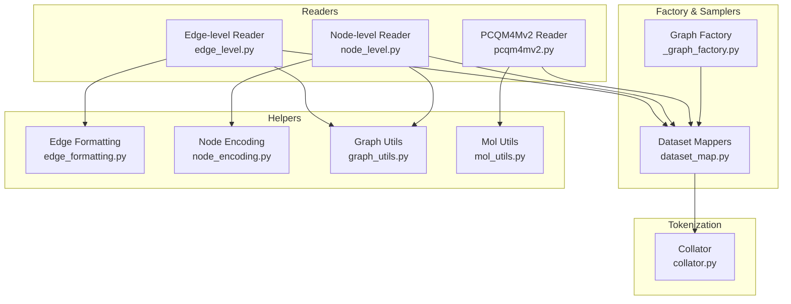
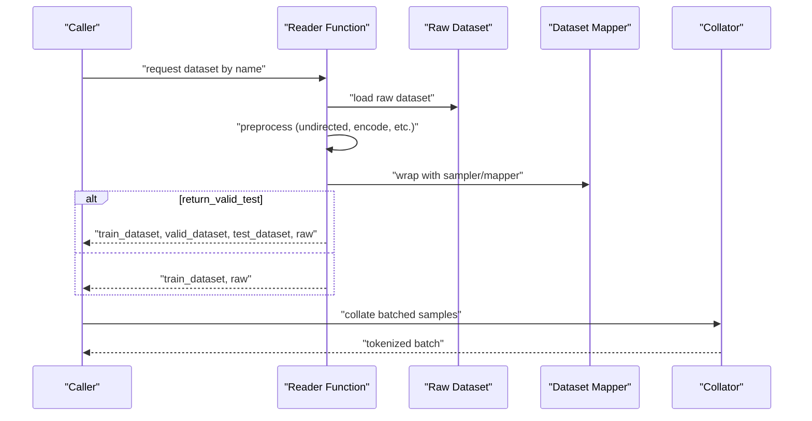
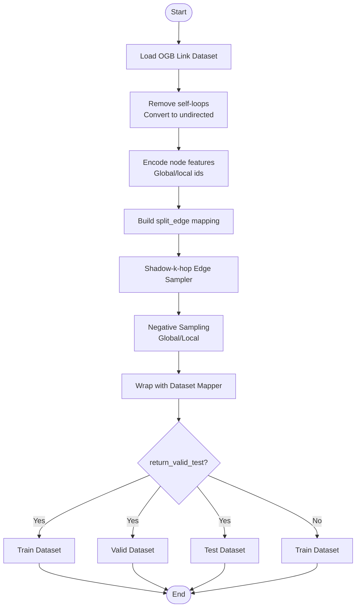
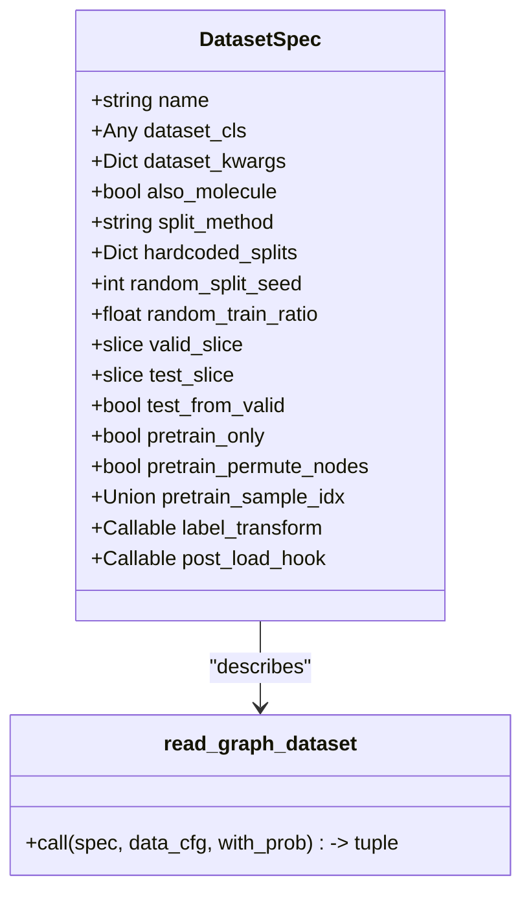
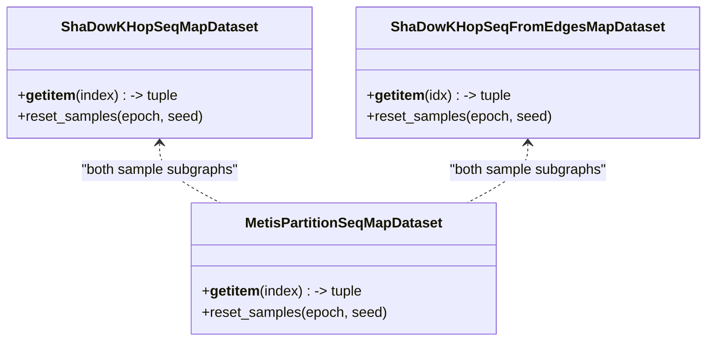
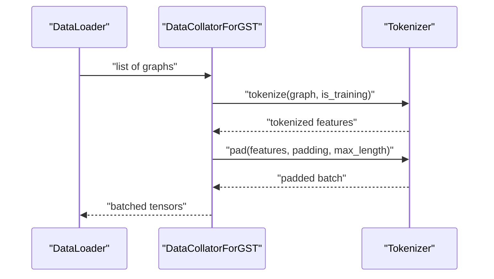
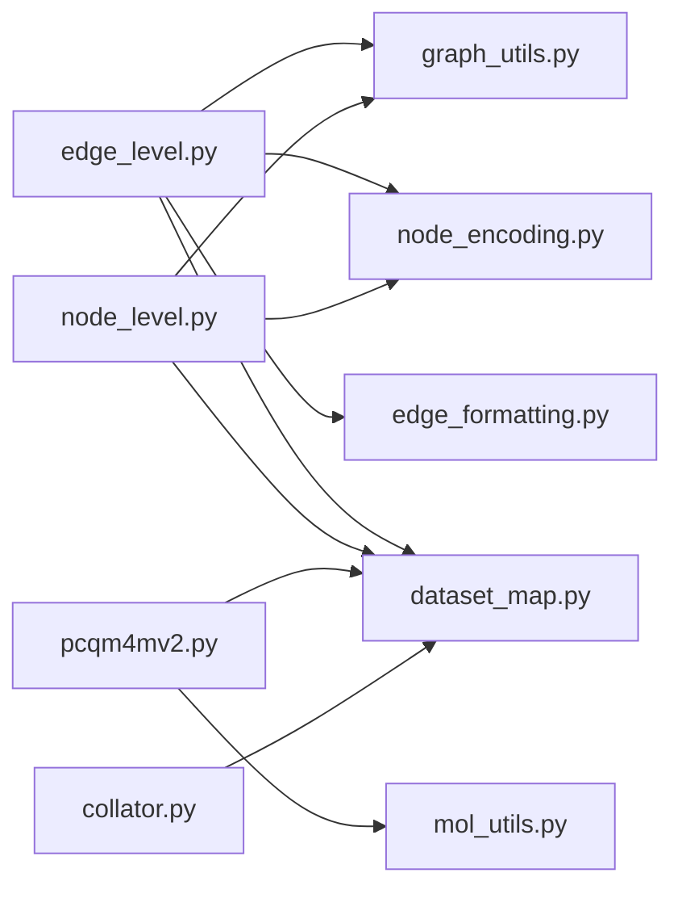

# Data Readers

<cite>
**Referenced Files in This Document**
- [edge_level.py](file://src/data/_readers/edge_level.py)
- [node_level.py](file://src/data/_readers/node_level.py)
- [pcqm4mv2.py](file://src/data/_readers/pcqm4mv2.py)
- [_graph_factory.py](file://src/data/_graph_factory.py)
- [dataset_map.py](file://src/data/dataset_map.py)
- [collator.py](file://src/data/collator.py)
- [edge_formatting.py](file://src/data/_helpers/edge_formatting.py)
- [node_encoding.py](file://src/data/_helpers/node_encoding.py)
- [graph_utils.py](file://src/data/_helpers/graph_utils.py)
- [mol_utils.py](file://src/utils/mol_utils.py)
- [ogbl_ppa.yaml](file://configs/tokenization/edge_lvl/ogbl_ppa.yaml)
- [pcqm4m-v2.yaml](file://configs/tokenization/graph_lvl/pcqm4m-v2.yaml)
- [ppa_pretrain.sh](file://examples/edge_lvl/ppa_pretrain.sh)
- [pcqm4m_v2_pretrain.sh](file://examples/graph_lvl/pcqm4m_v2_pretrain.sh)
</cite>

## Table of Contents
1. [Introduction](#introduction)
2. [Project Structure](#project-structure)
3. [Core Components](#core-components)
4. [Architecture Overview](#architecture-overview)
5. [Detailed Component Analysis](#detailed-component-analysis)
6. [Dependency Analysis](#dependency-analysis)
7. [Performance Considerations](#performance-considerations)
8. [Troubleshooting Guide](#troubleshooting-guide)
9. [Conclusion](#conclusion)
10. [Appendices](#appendices)

## Introduction
This document explains the Graph-GPT data readers that support three major graph learning tasks:
- Edge-level: link prediction and edge classification
- Node-level: node classification and node regression
- Graph/molecular-level: molecular property prediction (PCQM4Mv2)

It covers the abstract reader interface, concrete reader implementations, shared datasets and samplers, preprocessing and transformation pipelines, and practical configuration and usage patterns. It also highlights performance and memory optimization strategies tailored to each reader type.

## Project Structure
The data pipeline is organized around specialized readers for each task family, a generic graph dataset factory, and reusable helpers for graph transformations and node encodings. Tokenization and batching are handled by a collator that integrates with the tokenizers.

**Diagram sources**
- [edge_level.py:1-381](file://src/data/_readers/edge_level.py#L1-L381)
- [node_level.py:1-369](file://src/data/_readers/node_level.py#L1-L369)
- [pcqm4mv2.py:1-488](file://src/data/_readers/pcqm4mv2.py#L1-L488)
- [_graph_factory.py:1-160](file://src/data/_graph_factory.py#L1-L160)
- [dataset_map.py:1-800](file://src/data/dataset_map.py#L1-L800)
- [edge_formatting.py:1-83](file://src/data/_helpers/edge_formatting.py#L1-L83)
- [node_encoding.py:1-85](file://src/data/_helpers/node_encoding.py#L1-L85)
- [graph_utils.py:1-87](file://src/data/_helpers/graph_utils.py#L1-L87)
- [mol_utils.py:1-200](file://src/utils/mol_utils.py#L1-L200)
- [collator.py:1-134](file://src/data/collator.py#L1-L134)

**Section sources**
- [edge_level.py:1-381](file://src/data/_readers/edge_level.py#L1-L381)
- [node_level.py:1-369](file://src/data/_readers/node_level.py#L1-L369)
- [pcqm4mv2.py:1-488](file://src/data/_readers/pcqm4mv2.py#L1-L488)
- [_graph_factory.py:1-160](file://src/data/_graph_factory.py#L1-L160)
- [dataset_map.py:1-800](file://src/data/dataset_map.py#L1-L800)
- [collator.py:1-134](file://src/data/collator.py#L1-L134)

## Core Components
- Edge-level readers: link prediction and edge classification for OGB datasets (e.g., ogbl-ppa, ogbl-citation2, ogbl-wikikg2, ogbl-ddi). They construct subgraphs around edge pairs using shadow-k-hop sampling and negative sampling strategies.
- Node-level readers: node classification/regression for OGB node property datasets (e.g., ogbn-products, ogbn-arxiv, ogbn-papers100M, ogbn-proteins). They sample local neighborhoods centered at seed nodes and apply masking strategies for supervised tasks.
- PCQM4Mv2 reader: molecular property prediction for the OGB PCQM4Mv2 dataset. It handles SMILES-based molecular graphs, optional 3D coordinates, and special molecule filtering for robust pretraining/finetuning splits.
- Shared samplers and factories: dataset mapping classes (e.g., shadow-k-hop for nodes/edges, metis partitioning) and a generic graph dataset factory that standardizes split logic and pretraining/finetuning modes.
- Collation and tokenization: a collator that applies tokenizer padding and dynamic masking ratios during training.

**Section sources**
- [edge_level.py:27-381](file://src/data/_readers/edge_level.py#L27-L381)
- [node_level.py:27-369](file://src/data/_readers/node_level.py#L27-L369)
- [pcqm4mv2.py:18-234](file://src/data/_readers/pcqm4mv2.py#L18-L234)
- [_graph_factory.py:50-101](file://src/data/_graph_factory.py#L50-L101)
- [dataset_map.py:132-554](file://src/data/dataset_map.py#L132-L554)
- [collator.py:22-112](file://src/data/collator.py#L22-L112)

## Architecture Overview
The readers follow a consistent pattern:
- Load raw dataset via OGB or custom dataset classes
- Apply preprocessing (e.g., undirected conversion, self-cycle removal, node/edge feature encoding)
- Build a dataset mapper (e.g., shadow-k-hop node sampler, shadow-k-hop edge sampler, or graph-level mapper)
- Optionally split into train/valid/test and return both mapped datasets plus the raw dataset object
- Collate batches with tokenization and optional dynamic masking

**Diagram sources**
- [edge_level.py:27-91](file://src/data/_readers/edge_level.py#L27-L91)
- [node_level.py:27-114](file://src/data/_readers/node_level.py#L27-L114)
- [pcqm4mv2.py:18-233](file://src/data/_readers/pcqm4mv2.py#L18-L233)
- [_graph_factory.py:50-101](file://src/data/_graph_factory.py#L50-L101)
- [dataset_map.py:132-554](file://src/data/dataset_map.py#L132-L554)
- [collator.py:70-112](file://src/data/collator.py#L70-L112)

## Detailed Component Analysis

### Edge-level Readers
Edge-level readers implement link prediction and edge classification tasks. They:
- Load OGB link property datasets
- Remove self-loops and convert to undirected when needed
- Encode node features globally/locally for node identity
- Construct edge-centric subgraphs using shadow-k-hop sampling
- Generate negative edges via global or local strategies
- Support configurable negative ratio, sampling percentages, and edge attributes

Key implementation patterns:
- Undirected conversion and self-loop removal
- Node identity encoding for global/local ids
- Shadow-k-hop edge sampler with configurable depth/neighbors and negative sampling
- Dataset splitting and optional fixed-size sampling for validation/test

**Diagram sources**
- [edge_level.py:27-381](file://src/data/_readers/edge_level.py#L27-L381)
- [graph_utils.py:33-87](file://src/data/_helpers/graph_utils.py#L33-L87)
- [node_encoding.py:5-70](file://src/data/_helpers/node_encoding.py#L5-L70)
- [dataset_map.py:271-554](file://src/data/dataset_map.py#L271-L554)
- [edge_formatting.py:25-83](file://src/data/_helpers/edge_formatting.py#L25-L83)

Examples of readers:
- ogbl-ppa: constructs node features from one-hot and builds shadow-k-hop edge datasets
- ogbl-citation2: encodes node year with dividend-based encoding and handles isolated nodes
- ogbl-wikikg2: encodes relation types and reconstructs missing relation types after deduplication
- ogbl-ddi: uses a node/edge ensemble mapper

Common preprocessing:
- Undirected edge construction
- Self-loop removal
- Node feature encoding for identity and locality
- Edge attribute reformatting for link prediction tasks

Usage patterns:
- Configure sampling depth/neighbors, negative ratio, and percent of positives
- Enable return_valid_test to split datasets
- Adjust allow_zero_edges for graphs with isolated nodes

**Section sources**
- [edge_level.py:27-381](file://src/data/_readers/edge_level.py#L27-L381)
- [graph_utils.py:33-87](file://src/data/_helpers/graph_utils.py#L33-L87)
- [node_encoding.py:5-70](file://src/data/_helpers/node_encoding.py#L5-L70)
- [edge_formatting.py:25-83](file://src/data/_helpers/edge_formatting.py#L25-L83)
- [dataset_map.py:271-554](file://src/data/dataset_map.py#L271-L554)

### Node-level Readers
Node-level readers implement node classification and regression tasks:
- Load OGB node property datasets
- Ensure undirectedness and remove self-loops
- Encode node features for identity and temporal information (where applicable)
- Sample local neighborhoods using shadow-k-hop node sampler
- Support random test sampling and masking strategies for supervised tasks

Key implementation patterns:
- Undirected conversion and self-loop removal
- Node identity encoding (enumeration, one-hot, or dividend-based)
- Shadow-k-hop node sampler with configurable depth and neighbors
- Optional masking of node labels/features for supervised fine-tuning

Examples of readers:
- ogbn-products: encodes node counts via dividend-based scheme
- ogbn-arxiv: encodes publication year with dividend-based encoding
- ogbn-papers100M: applies a pre-transform to clip years and encode
- ogbn-proteins: encodes species and applies a masking strategy for node labels

Masking strategies:
- Proteins reader demonstrates a masking function that zeroes out non-species features for the target node’s species, preserving identity tokens

**Section sources**
- [node_level.py:27-369](file://src/data/_readers/node_level.py#L27-L369)
- [graph_utils.py:33-87](file://src/data/_helpers/graph_utils.py#L33-L87)
- [node_encoding.py:5-85](file://src/data/_helpers/node_encoding.py#L5-L85)
- [dataset_map.py:132-269](file://src/data/dataset_map.py#L132-L269)

### PCQM4Mv2 Reader (Molecular Property Prediction)
The PCQM4Mv2 reader supports molecular property prediction tasks:
- Loads the OGB PCQM4Mv2 dataset
- Handles optional 3D coordinates and position discretization
- Applies special molecule filtering (e.g., disconnected molecules, zero-edge molecules)
- Supports adding external datasets (e.g., CEPDB, ZINC) and shifting distributions
- Splits into train/valid/test with configurable strategies (including using valid/test-dev/test-challenge splits)

Key implementation patterns:
- Special molecule detection and removal
- Train/valid/test augmentation strategies (e.g., adding valid samples to train)
- Large-molecule selection for test sets
- Optional duplication of indices to increase effective dataset size
- Position percentile boundaries for 3D discretization

SMILES and molecular graph construction:
- The reader relies on OGB’s PyG dataset classes to construct molecular graphs from SMILES
- Optional 3D coordinates and rotation/discretization utilities are available for geometry-aware tasks

**Section sources**
- [pcqm4mv2.py:18-234](file://src/data/_readers/pcqm4mv2.py#L18-L234)
- [pcqm4mv2.py:240-488](file://src/data/_readers/pcqm4mv2.py#L240-L488)
- [mol_utils.py:79-200](file://src/utils/mol_utils.py#L79-L200)

### Abstract Reader Interface and Factory
The generic graph dataset factory provides a uniform interface for graph-level readers:
- Accepts a DatasetSpec describing dataset class, split method, and hooks
- Loads dataset, applies label transforms and post-load hooks
- Builds train/valid/test datasets via a graph mapper or returns a pretraining-only dataset

**Diagram sources**
- [_graph_factory.py:19-48](file://src/data/_graph_factory.py#L19-L48)
- [_graph_factory.py:50-101](file://src/data/_graph_factory.py#L50-L101)

**Section sources**
- [_graph_factory.py:19-160](file://src/data/_graph_factory.py#L19-L160)

### Samplers and Dataset Mappers
Shared dataset mappers implement common sampling strategies:
- Shadow-k-hop node sampler: samples ego-networks around seed nodes with configurable depth and neighbors
- Shadow-k-hop edge sampler: samples subgraphs around edge pairs, generates negative edges, and supports global/local negative sampling
- Metis partitioning sampler: partitions large graphs into clusters for efficient pretraining

**Diagram sources**
- [dataset_map.py:132-554](file://src/data/dataset_map.py#L132-L554)

**Section sources**
- [dataset_map.py:132-554](file://src/data/dataset_map.py#L132-L554)

### Tokenization and Collation Pipeline
The collator integrates tokenization and dynamic masking:
- Applies tokenizer to each graph sample
- Pads sequences and supports mask boundary options
- Dynamically adjusts masking ratio during training based on global steps

**Diagram sources**
- [collator.py:70-112](file://src/data/collator.py#L70-L112)

**Section sources**
- [collator.py:22-134](file://src/data/collator.py#L22-L134)

## Dependency Analysis
The readers depend on:
- OGB datasets for raw graph data
- PyTorch Geometric for graph data structures and utilities
- Internal helpers for graph transformations and node encodings
- Dataset mappers for sampling strategies
- Collator for batching and tokenization

**Diagram sources**
- [edge_level.py:14-24](file://src/data/_readers/edge_level.py#L14-L24)
- [node_level.py:17-24](file://src/data/_readers/node_level.py#L17-L24)
- [pcqm4mv2.py:9-15](file://src/data/_readers/pcqm4mv2.py#L9-L15)
- [graph_utils.py:1-87](file://src/data/_helpers/graph_utils.py#L1-L87)
- [node_encoding.py:1-85](file://src/data/_helpers/node_encoding.py#L1-L85)
- [edge_formatting.py:1-83](file://src/data/_helpers/edge_formatting.py#L1-L83)
- [mol_utils.py:1-200](file://src/utils/mol_utils.py#L1-L200)
- [dataset_map.py:1-800](file://src/data/dataset_map.py#L1-L800)
- [collator.py:15-20](file://src/data/collator.py#L15-L20)

**Section sources**
- [edge_level.py:14-24](file://src/data/_readers/edge_level.py#L14-L24)
- [node_level.py:17-24](file://src/data/_readers/node_level.py#L17-L24)
- [pcqm4mv2.py:9-15](file://src/data/_readers/pcqm4mv2.py#L9-L15)
- [graph_utils.py:1-87](file://src/data/_helpers/graph_utils.py#L1-L87)
- [node_encoding.py:1-85](file://src/data/_helpers/node_encoding.py#L1-L85)
- [edge_formatting.py:1-83](file://src/data/_helpers/edge_formatting.py#L1-L83)
- [mol_utils.py:1-200](file://src/utils/mol_utils.py#L1-L200)
- [dataset_map.py:1-800](file://src/data/dataset_map.py#L1-L800)
- [collator.py:15-20](file://src/data/collator.py#L15-L20)

## Performance Considerations
Edge-level readers:
- Negative sampling can be expensive; prefer global sampling for large-scale link prediction
- Allow zero edges handling for graphs with isolated nodes to avoid empty subgraphs
- Use dividend-based node encoding to reduce vocabulary size for large graphs

Node-level readers:
- Shadow-k-hop sampling with replace=True can speed up sampling at the cost of less diverse neighborhoods
- Random test sampling reduces evaluation overhead for large datasets
- Masking strategies should be tuned to prevent overfitting on supervised tasks

PCQM4Mv2 reader:
- Filtering special molecules (disconnected, zero-edge) improves training stability
- Using only training indices for pretraining avoids leakage from test splits
- 3D coordinate discretization with percentile boundaries reduces memory footprint

Memory optimization:
- Use Metis partitioning for very large graphs to reduce peak memory during sampling
- Limit subgraph sizes and adjust sampling depth/neighbors to fit GPU memory
- Disable heavy post-processing hooks when not needed

[No sources needed since this section provides general guidance]

## Troubleshooting Guide
Common issues and resolutions:
- Isolated nodes causing zero-edge subgraphs: enable allow_zero_edges and handle empty edge cases gracefully
- Undirected conversion losing relation types: reconstruct missing relation types after deduplication
- Large node vocabularies: switch to dividend-based encoding to compress global/local ids
- Excessive negative sampling overhead: reduce neg_ratio or use local negative sampling
- Memory spikes with large graphs: reduce subgraph size, limit neighbors, or use Metis partitioning

**Section sources**
- [edge_level.py:125-132](file://src/data/_readers/edge_level.py#L125-L132)
- [edge_level.py:225-227](file://src/data/_readers/edge_level.py#L225-L227)
- [node_encoding.py:45-70](file://src/data/_helpers/node_encoding.py#L45-L70)
- [dataset_map.py:271-554](file://src/data/dataset_map.py#L271-L554)

## Conclusion
Graph-GPT’s data readers provide a unified, modular framework for edge-level, node-level, and molecular graph tasks. By leveraging shared samplers, preprocessing helpers, and a generic factory, the system achieves flexibility and scalability across diverse datasets. Proper configuration of sampling strategies, masking, and preprocessing ensures robust performance and memory efficiency.

[No sources needed since this section summarizes without analyzing specific files]

## Appendices

### Reader Configuration Examples
- Edge-level (ogbl-ppa): configure sampling depth/neighbors, negative ratio, and percent of positives
- Graph-level (PCQM4Mv2): configure task type, node/edge semantic dimensions, and 3D discretization

**Section sources**
- [ogbl_ppa.yaml:11-22](file://configs/tokenization/edge_lvl/ogbl_ppa.yaml#L11-L22)
- [pcqm4m-v2.yaml:14-25](file://configs/tokenization/graph_lvl/pcqm4m-v2.yaml#L14-L25)

### Example Scripts
- Edge-level pretraining script for ogbl-ppa
- Graph-level pretraining script for PCQM4Mv2

**Section sources**
- [ppa_pretrain.sh:1-287](file://examples/edge_lvl/ppa_pretrain.sh#L1-L287)
- [pcqm4m_v2_pretrain.sh:1-311](file://examples/graph_lvl/pcqm4m_v2_pretrain.sh#L1-L311)
