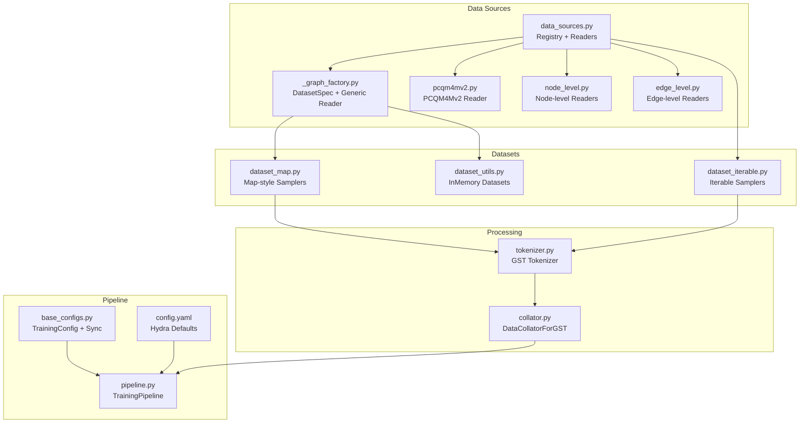
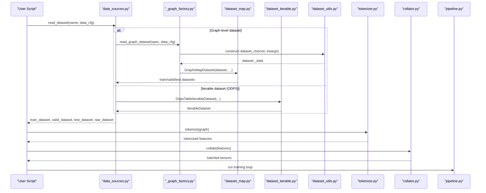
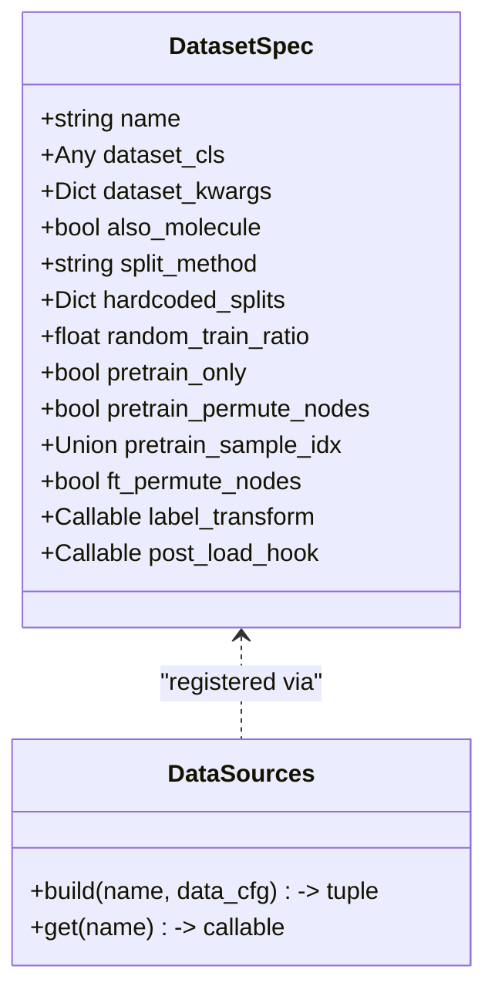
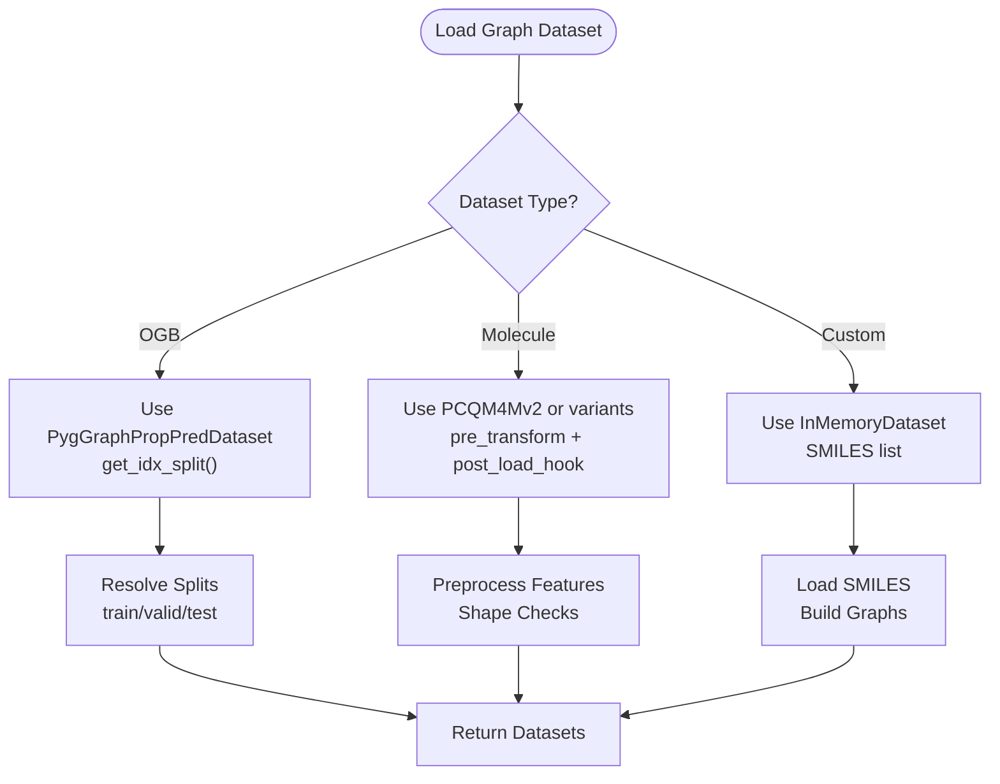
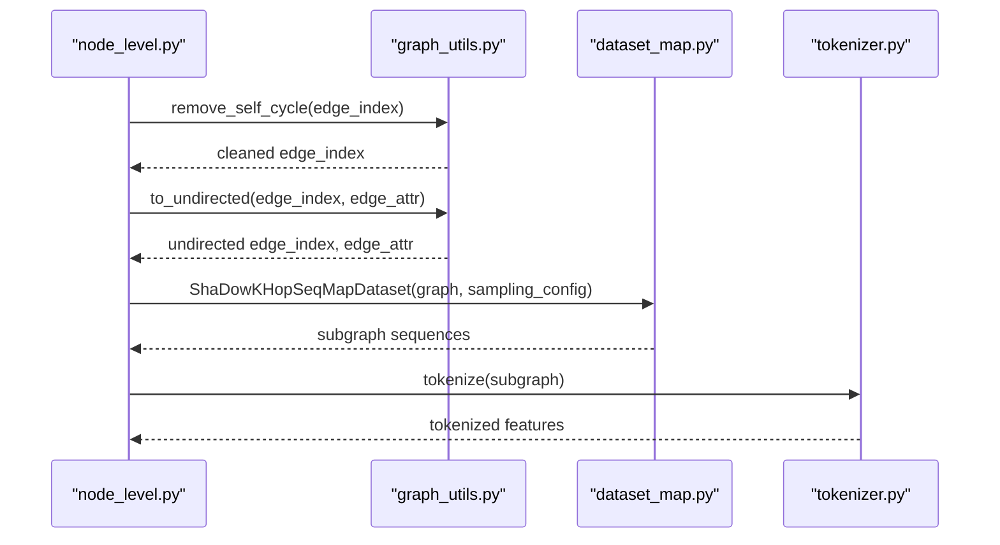
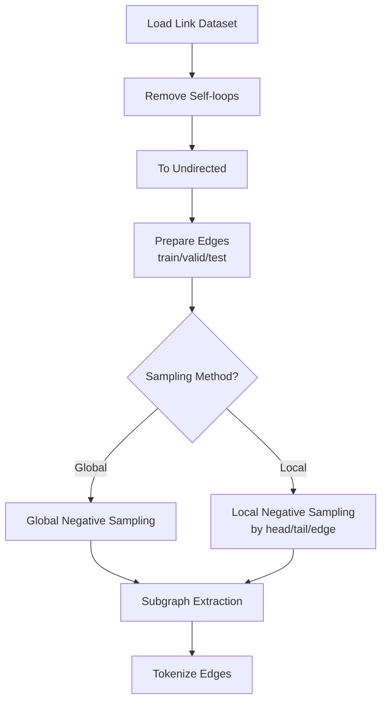
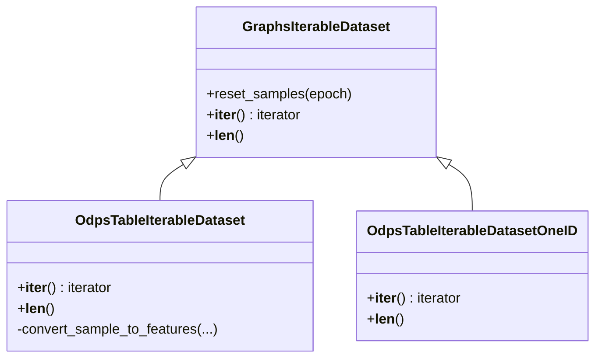
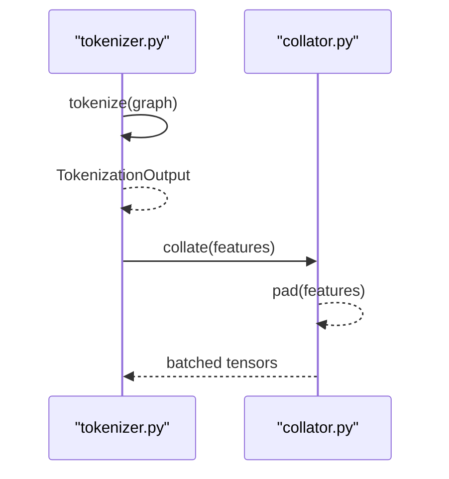
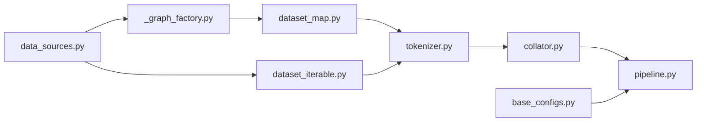

# Data Sources & Validation

<cite>
**Referenced Files in This Document**
- [data_sources.py](file://src/data/data_sources.py)
- [dataset_iterable.py](file://src/data/dataset_iterable.py)
- [_graph_factory.py](file://src/data/_graph_factory.py)
- [dataset_map.py](file://src/data/dataset_map.py)
- [collator.py](file://src/data/collator.py)
- [pcqm4mv2.py](file://src/data/_readers/pcqm4mv2.py)
- [node_level.py](file://src/data/_readers/node_level.py)
- [edge_level.py](file://src/data/_readers/edge_level.py)
- [graph_utils.py](file://src/data/_helpers/graph_utils.py)
- [dataset_utils.py](file://src/utils/dataset_utils.py)
- [tokenizer.py](file://src/data/tokenizer.py)
- [pipeline.py](file://src/training/pipeline.py)
- [base_configs.py](file://src/conf/base_configs.py)
- [metrics_utils.py](file://src/utils/metrics_utils.py)
- [inspection_utils.py](file://src/utils/inspection_utils.py)
- [config.yaml](file://configs/config.yaml)
</cite>

## Table of Contents
1. [Introduction](#introduction)
2. [Project Structure](#project-structure)
3. [Core Components](#core-components)
4. [Architecture Overview](#architecture-overview)
5. [Detailed Component Analysis](#detailed-component-analysis)
6. [Dependency Analysis](#dependency-analysis)
7. [Performance Considerations](#performance-considerations)
8. [Troubleshooting Guide](#troubleshooting-guide)
9. [Conclusion](#conclusion)
10. [Appendices](#appendices)

## Introduction
This document explains the data sources and validation mechanisms in Graph-GPT. It covers the data source abstraction, integration of diverse providers (including OGB, internal molecule datasets, and Alibaba ODPS), validation strategies (integrity checks, shape validation, consistency verification), data loading and error handling patterns, caching and persistence strategies for large datasets, and the relationship between data sources and the broader training pipeline. It also provides practical guidance for implementing custom data sources and validation rules, along with debugging techniques and versioning/reproducibility considerations.

## Project Structure
The data pipeline spans several modules:
- Data source registry and readers: central registry for graph, node, and edge datasets; specialized readers for OGB and internal datasets; ODPS streaming readers.
- Dataset abstractions: map-style and iterable datasets for subgraph sampling and streaming.
- Tokenization and batching: conversion of graphs to token sequences and dynamic padding.
- Training pipeline orchestration: configuration synchronization, distributed setup, and model initialization.

**Diagram sources**
- [data_sources.py:1-413](file://src/data/data_sources.py#L1-L413)
- [_graph_factory.py:1-160](file://src/data/_graph_factory.py#L1-L160)
- [pcqm4mv2.py:1-488](file://src/data/_readers/pcqm4mv2.py#L1-L488)
- [node_level.py:1-369](file://src/data/_readers/node_level.py#L1-L369)
- [edge_level.py:1-381](file://src/data/_readers/edge_level.py#L1-L381)
- [dataset_map.py:1-800](file://src/data/dataset_map.py#L1-L800)
- [dataset_iterable.py:1-449](file://src/data/dataset_iterable.py#L1-L449)
- [dataset_utils.py:1-800](file://src/utils/dataset_utils.py#L1-L800)
- [tokenizer.py:1-800](file://src/data/tokenizer.py#L1-L800)
- [collator.py:1-134](file://src/data/collator.py#L1-L134)
- [base_configs.py:1-302](file://src/conf/base_configs.py#L1-L302)
- [pipeline.py:1-258](file://src/training/pipeline.py#L1-L258)
- [config.yaml:1-20](file://configs/config.yaml#L1-L20)

**Section sources**
- [data_sources.py:1-413](file://src/data/data_sources.py#L1-L413)
- [base_configs.py:1-302](file://src/conf/base_configs.py#L1-L302)
- [pipeline.py:1-258](file://src/training/pipeline.py#L1-L258)
- [config.yaml:1-20](file://configs/config.yaml#L1-L20)

## Core Components
- Data source registry and readers: centralized registry for graph-level datasets via DatasetSpec; readers for OGB, internal molecules, and ODPS tables. Readers return train/validation/test splits or raw datasets depending on configuration.
- Dataset abstractions: map-style samplers for subgraph extraction and edge/link sampling; iterable samplers for streaming large graphs and ODPS tables.
- Tokenization and batching: GST tokenizer transforms graphs into token sequences; DataCollatorForGST dynamically pads and prepares model inputs.
- Training pipeline: configuration synchronization, distributed setup, and model initialization; propagates dataset metadata (e.g., value bounds) to the model.

Key responsibilities:
- data_sources.py: registry, split selection, and reader composition for graph/node/edge datasets.
- _graph_factory.py: declarative DatasetSpec and generic reader that enforces consistent split/index handling.
- dataset_map.py: subgraph samplers and edge/link samplers with configurable sampling strategies.
- dataset_iterable.py: streaming datasets for large graphs and ODPS tables with slicing and permutation controls.
- tokenizer.py: tokenization pipeline, packing, and input preparation.
- collator.py: dynamic padding and collation for training batches.
- dataset_utils.py: InMemoryDataset subclasses for molecule datasets and preprocessing logic.
- pipeline.py + base_configs.py: training orchestration and config synchronization.

**Section sources**
- [data_sources.py:1-413](file://src/data/data_sources.py#L1-L413)
- [_graph_factory.py:1-160](file://src/data/_graph_factory.py#L1-L160)
- [dataset_map.py:1-800](file://src/data/dataset_map.py#L1-L800)
- [dataset_iterable.py:1-449](file://src/data/dataset_iterable.py#L1-L449)
- [tokenizer.py:1-800](file://src/data/tokenizer.py#L1-L800)
- [collator.py:1-134](file://src/data/collator.py#L1-L134)
- [dataset_utils.py:1-800](file://src/utils/dataset_utils.py#L1-L800)
- [base_configs.py:1-302](file://src/conf/base_configs.py#L1-L302)
- [pipeline.py:1-258](file://src/training/pipeline.py#L1-L258)

## Architecture Overview
The data pipeline integrates heterogeneous data sources into a unified tokenization and training framework. The registry decouples dataset selection from processing, enabling modular addition of new datasets. Map-style and iterable datasets provide flexible sampling strategies for different tasks (node, edge, graph). Tokenization and collation standardize inputs for the model, while the training pipeline manages distributed execution and configuration.

**Diagram sources**
- [data_sources.py:1-413](file://src/data/data_sources.py#L1-L413)
- [_graph_factory.py:50-101](file://src/data/_graph_factory.py#L50-L101)
- [dataset_map.py:132-268](file://src/data/dataset_map.py#L132-L268)
- [dataset_iterable.py:295-386](file://src/data/dataset_iterable.py#L295-L386)
- [dataset_utils.py:329-606](file://src/utils/dataset_utils.py#L329-L606)
- [tokenizer.py:585-612](file://src/data/tokenizer.py#L585-L612)
- [collator.py:70-111](file://src/data/collator.py#L70-L111)
- [pipeline.py:60-96](file://src/training/pipeline.py#L60-L96)

## Detailed Component Analysis

### Data Source Abstraction and Registry
- Central registry: a registration mechanism maps dataset names to reader functions, enabling uniform invocation across graph/node/edge domains.
- DatasetSpec: declarative specification of dataset constructors, split strategies, pre/post-processing hooks, and pretraining vs fine-tuning behaviors.
- Generic reader: a single function interprets DatasetSpec and returns consistent train/valid/test splits or raw datasets.

Validation and integrity:
- Split resolution supports multiple strategies: OGB’s get_idx_split, hardcoded slices, and random splits with seeds.
- Post-load hooks and label transforms ensure consistent shapes and types across datasets.

**Diagram sources**
- [_graph_factory.py:19-48](file://src/data/_graph_factory.py#L19-L48)
- [_graph_factory.py:50-101](file://src/data/_graph_factory.py#L50-L101)
- [data_sources.py:26-28](file://src/data/data_sources.py#L26-L28)

**Section sources**
- [_graph_factory.py:1-160](file://src/data/_graph_factory.py#L1-L160)
- [data_sources.py:1-413](file://src/data/data_sources.py#L1-L413)

### Graph-Level Readers (OGB, Molecules, Custom)
- OGB graph-level datasets: leverage PygGraphPropPredDataset and TUDataset with standardized splits and transformations.
- Molecule datasets: PCQM4Mv2 and related variants with preprocessing, optional 3D coordinates, and special handling for test-dev/test-challenge sets.
- Custom molecule datasets: support for custom SMILES lists and deduplication strategies.

Validation and consistency:
- Shape checks in preprocessing ensure edge_index, edge_attr, and node features align.
- Special molecule handling removes disconnected graphs and nodes with zero edges to maintain consistency.

**Diagram sources**
- [pcqm4mv2.py:18-233](file://src/data/_readers/pcqm4mv2.py#L18-L233)
- [dataset_utils.py:329-606](file://src/utils/dataset_utils.py#L329-L606)
- [data_sources.py:193-267](file://src/data/data_sources.py#L193-L267)

**Section sources**
- [pcqm4mv2.py:1-488](file://src/data/_readers/pcqm4mv2.py#L1-L488)
- [dataset_utils.py:1-800](file://src/utils/dataset_utils.py#L1-L800)
- [data_sources.py:193-267](file://src/data/data_sources.py#L193-L267)

### Node-Level Readers (Products, ArXiv, Proteins, etc.)
- Node-level datasets: convert raw graphs to subgraph sequences using shadow-k-hop sampling.
- Preprocessing ensures undirected graphs, removes self-loops, and encodes node identities.

Validation and integrity:
- Undirected conversion and self-loop removal are enforced before tokenization.
- Node identity encoding prevents leakage of raw node IDs into semantic tokens.

**Diagram sources**
- [node_level.py:27-114](file://src/data/_readers/node_level.py#L27-L114)
- [graph_utils.py:78-87](file://src/data/_helpers/graph_utils.py#L78-L87)
- [dataset_map.py:132-268](file://src/data/dataset_map.py#L132-L268)
- [tokenizer.py:425-535](file://src/data/tokenizer.py#L425-L535)

**Section sources**
- [node_level.py:1-369](file://src/data/_readers/node_level.py#L1-L369)
- [graph_utils.py:1-87](file://src/data/_helpers/graph_utils.py#L1-L87)
- [dataset_map.py:132-268](file://src/data/dataset_map.py#L132-L268)
- [tokenizer.py:1-800](file://src/data/tokenizer.py#L1-L800)

### Edge-Level Readers (PPA, Citation2, WikiKG2, DDI)
- Edge-level datasets: link prediction tasks with positive/negative edge sampling strategies.
- Preprocessing includes undirected conversion, edge attribute augmentation, and fixed sampling for valid/test.

Validation and integrity:
- Edge duplication removal and reltype preservation are handled carefully to maintain vocabulary consistency.
- Sampling strategies ensure balanced positive/negative ratios and optional weighting.

**Diagram sources**
- [edge_level.py:27-313](file://src/data/_readers/edge_level.py#L27-L313)
- [dataset_map.py:271-553](file://src/data/dataset_map.py#L271-L553)
- [tokenizer.py:585-612](file://src/data/tokenizer.py#L585-L612)

**Section sources**
- [edge_level.py:1-381](file://src/data/_readers/edge_level.py#L1-L381)
- [dataset_map.py:271-553](file://src/data/dataset_map.py#L271-L553)
- [tokenizer.py:1-800](file://src/data/tokenizer.py#L1-L800)

### Iterable Datasets and ODPS Integration
- Iterable datasets: support streaming large graphs and ODPS tables with slicing, permutation, and worker-aware sharding.
- ODPS readers: handle base64-encoded binary data, decode tensors, and apply optional node permutation.

Validation and integrity:
- Slice range computation ensures balanced distribution across workers.
- Exception handling for out-of-range reads during streaming.

**Diagram sources**
- [dataset_iterable.py:134-190](file://src/data/dataset_iterable.py#L134-L190)
- [dataset_iterable.py:295-386](file://src/data/dataset_iterable.py#L295-L386)
- [dataset_iterable.py:192-292](file://src/data/dataset_iterable.py#L192-L292)

**Section sources**
- [dataset_iterable.py:1-449](file://src/data/dataset_iterable.py#L1-L449)

### Tokenization and Collation
- GST tokenizer: transforms graphs into token sequences, applies masking, instruction tuning, and structure-aware decorations; supports packing multiple sequences.
- DataCollatorForGST: dynamic padding, attention mask construction, and boundary masking; adjusts attribute masking ratio during training.

Validation and integrity:
- Sequence length computation respects pad-to-multiple-of and max-length constraints.
- Boundary masking leverages attention utilities to mark sequence boundaries.

**Diagram sources**
- [tokenizer.py:585-612](file://src/data/tokenizer.py#L585-L612)
- [collator.py:70-111](file://src/data/collator.py#L70-L111)

**Section sources**
- [tokenizer.py:1-800](file://src/data/tokenizer.py#L1-L800)
- [collator.py:1-134](file://src/data/collator.py#L1-L134)

### Data Loading Mechanisms and Error Handling Patterns
- Map-style datasets: provide __len__ and __getitem__ with optional sampling and permutation.
- Iterable datasets: provide infinite iterators with worker-aware sharding and slicing.
- ODPS readers: handle OutOfRange exceptions and gracefully terminate iteration.

Best practices:
- Use deterministic shuffling with seeds for reproducible splits.
- Validate shapes and types during preprocessing to catch inconsistencies early.
- Apply worker-aware slicing to avoid data duplication across processes.

**Section sources**
- [dataset_map.py:132-268](file://src/data/dataset_map.py#L132-L268)
- [dataset_iterable.py:333-383](file://src/data/dataset_iterable.py#L333-L383)
- [pcqm4mv2.py:538-544](file://src/data/_readers/pcqm4mv2.py#L538-L544)

### Caching Strategies and Data Persistence
- InMemoryDataset subclasses persist processed files to disk for reuse across runs.
- Molecule datasets cache processed geometric data and intermediate artifacts (e.g., 3D coordinates).
- ODPS readers stream data without persistent caching; slicing ensures efficient distribution.

Recommendations:
- Use processed_file_names to standardize cache locations.
- Implement lazy generation of derived features (e.g., 3D positions) with synchronization across ranks.
- Store dataset-level metadata (e.g., value bounds) alongside cached data for reproducibility.

**Section sources**
- [dataset_utils.py:329-606](file://src/utils/dataset_utils.py#L329-L606)
- [pcqm4mv2.py:538-544](file://src/data/_readers/pcqm4mv2.py#L538-L544)

### Relationship Between Data Sources and Pipeline Components
- Configuration synchronization: base_configs updates stacked feature dimensions and embedding sizes based on tokenization config.
- Pipeline orchestration: TrainingPipeline initializes data configs, prepares tokenizer and datasets, and propagates dataset metadata (e.g., dict_bounds) to the model.

**Section sources**
- [base_configs.py:145-147](file://src/conf/base_configs.py#L145-L147)
- [pipeline.py:149-165](file://src/training/pipeline.py#L149-L165)

## Dependency Analysis
The data pipeline exhibits low coupling and high cohesion:
- Registry decouples dataset selection from processing logic.
- DatasetSpec encapsulates dataset differences, promoting reuse.
- Map-style and iterable datasets are interchangeable consumers of the same tokenization interface.
- Tokenization and collation are independent of dataset types, enabling modular extension.

**Diagram sources**
- [data_sources.py:1-413](file://src/data/data_sources.py#L1-L413)
- [_graph_factory.py:1-160](file://src/data/_graph_factory.py#L1-L160)
- [dataset_map.py:1-800](file://src/data/dataset_map.py#L1-L800)
- [dataset_iterable.py:1-449](file://src/data/dataset_iterable.py#L1-L449)
- [tokenizer.py:1-800](file://src/data/tokenizer.py#L1-L800)
- [collator.py:1-134](file://src/data/collator.py#L1-L134)
- [pipeline.py:1-258](file://src/training/pipeline.py#L1-L258)
- [base_configs.py:1-302](file://src/conf/base_configs.py#L1-L302)

**Section sources**
- [data_sources.py:1-413](file://src/data/data_sources.py#L1-L413)
- [_graph_factory.py:1-160](file://src/data/_graph_factory.py#L1-L160)
- [dataset_map.py:1-800](file://src/data/dataset_map.py#L1-L800)
- [dataset_iterable.py:1-449](file://src/data/dataset_iterable.py#L1-L449)
- [tokenizer.py:1-800](file://src/data/tokenizer.py#L1-L800)
- [collator.py:1-134](file://src/data/collator.py#L1-L134)
- [pipeline.py:1-258](file://src/training/pipeline.py#L1-L258)
- [base_configs.py:1-302](file://src/conf/base_configs.py#L1-L302)

## Performance Considerations
- Subgraph sampling: Shadow-k-hop sampling reduces memory footprint by generating localized subgraphs.
- Iterable datasets: worker-aware slicing and deterministic shuffling improve throughput and reduce data transfer overhead.
- Tokenization packing: packing multiple sequences reduces padding overhead and improves GPU utilization.
- Distributed training: slicing and permutation are coordinated across ranks to avoid duplication and ensure coverage.

[No sources needed since this section provides general guidance]

## Troubleshooting Guide
Common issues and resolutions:
- Shape mismatches: verify edge_index and edge_attr shapes; use preprocessing utilities to enforce consistency.
- Undirected graphs: ensure self-loops are removed and edges are made undirected before tokenization.
- ODPS streaming errors: handle OutOfRange exceptions and confirm slice ranges are computed correctly.
- Tokenization anomalies: use inspection utilities to debug tokenization outputs and packed sequences.
- Metric computation: ensure logits and labels shapes match expectations; use built-in metrics for robust aggregation.

**Section sources**
- [graph_utils.py:33-57](file://src/data/_helpers/graph_utils.py#L33-L57)
- [dataset_iterable.py:378-381](file://src/data/dataset_iterable.py#L378-L381)
- [inspection_utils.py:73-143](file://src/utils/inspection_utils.py#L73-L143)
- [metrics_utils.py:16-89](file://src/utils/metrics_utils.py#L16-L89)

## Conclusion
Graph-GPT’s data pipeline provides a robust, extensible framework for integrating diverse data sources. The registry and DatasetSpec abstraction enable consistent handling of graph/node/edge datasets. Map-style and iterable datasets offer flexible sampling strategies, while tokenization and collation standardize inputs. Validation strategies ensure data integrity, and caching/persistence facilitate reproducibility. The training pipeline orchestrates configuration synchronization and distributed execution, supporting scalable experimentation.

[No sources needed since this section summarizes without analyzing specific files]

## Appendices

### Implementing Custom Data Sources
Steps:
- Define a DatasetSpec with dataset_cls, dataset_kwargs, split_method, and optional hooks.
- Register the reader via the registry and tie it to the spec.
- Implement preprocessing/post-processing hooks to ensure consistent shapes and types.
- Integrate with map-style or iterable datasets depending on workload characteristics.

Example references:
- [DatasetSpec definition:19-48](file://src/data/_graph_factory.py#L19-L48)
- [Registry usage:26-28](file://src/data/data_sources.py#L26-L28)
- [Post-load hook pattern:170-186](file://src/data/data_sources.py#L170-L186)

**Section sources**
- [_graph_factory.py:19-48](file://src/data/_graph_factory.py#L19-L48)
- [data_sources.py:26-28](file://src/data/data_sources.py#L26-L28)
- [data_sources.py:170-186](file://src/data/data_sources.py#L170-L186)

### Data Quality Assurance and Debugging Techniques
- Use inspection utilities to print tokenization results and packed sequences.
- Validate shapes and types during preprocessing.
- Employ metrics utilities for robust evaluation across distributed settings.

**Section sources**
- [inspection_utils.py:73-143](file://src/utils/inspection_utils.py#L73-L143)
- [metrics_utils.py:143-190](file://src/utils/metrics_utils.py#L143-L190)

### Versioning and Reproducibility
- Standardize processed file names for InMemoryDataset subclasses.
- Propagate dataset-level metadata (e.g., value bounds) to the model for consistent normalization.
- Use deterministic seeds for random splits and shuffling.

**Section sources**
- [dataset_utils.py:329-606](file://src/utils/dataset_utils.py#L329-L606)
- [pipeline.py:159-162](file://src/training/pipeline.py#L159-L162)
