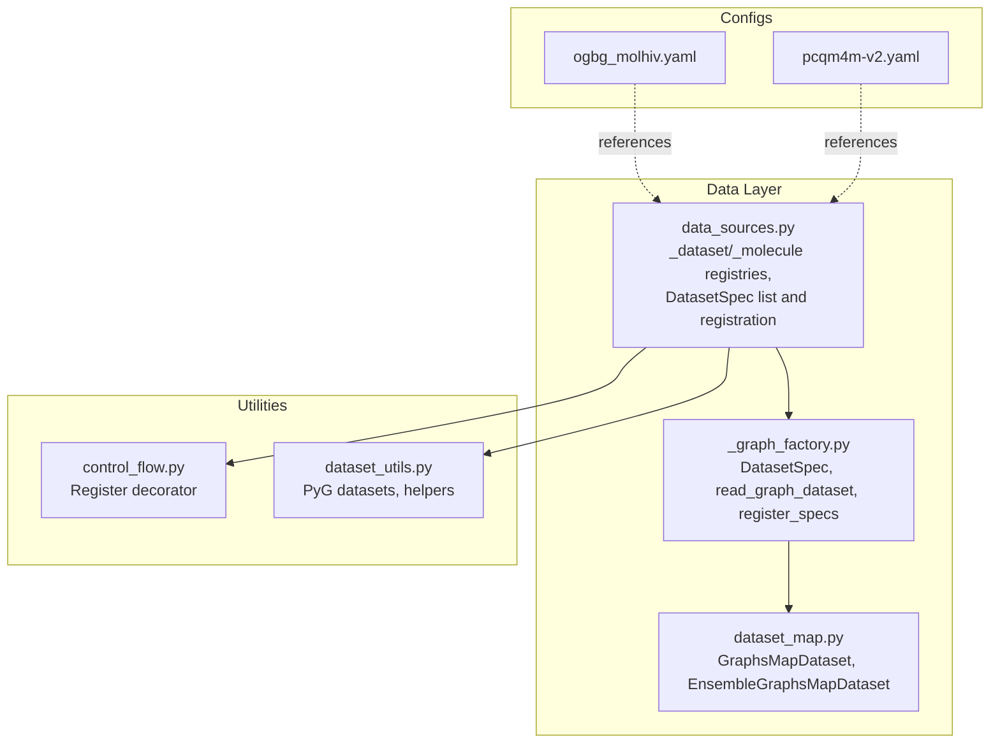
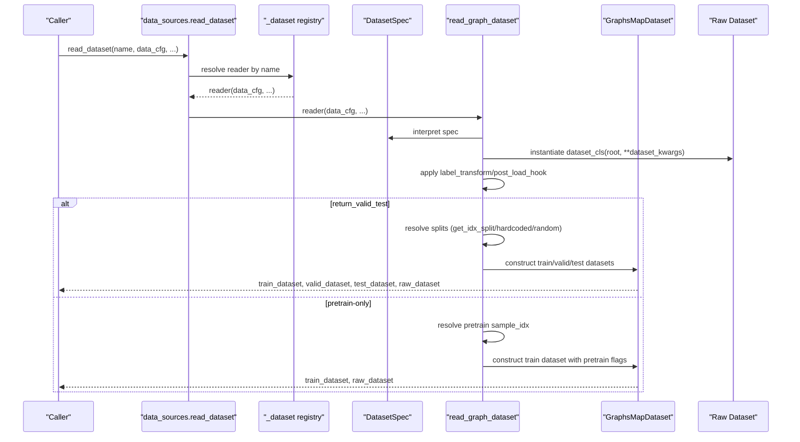
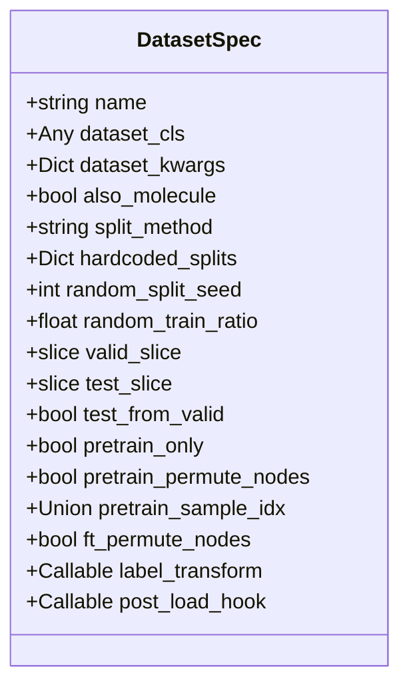
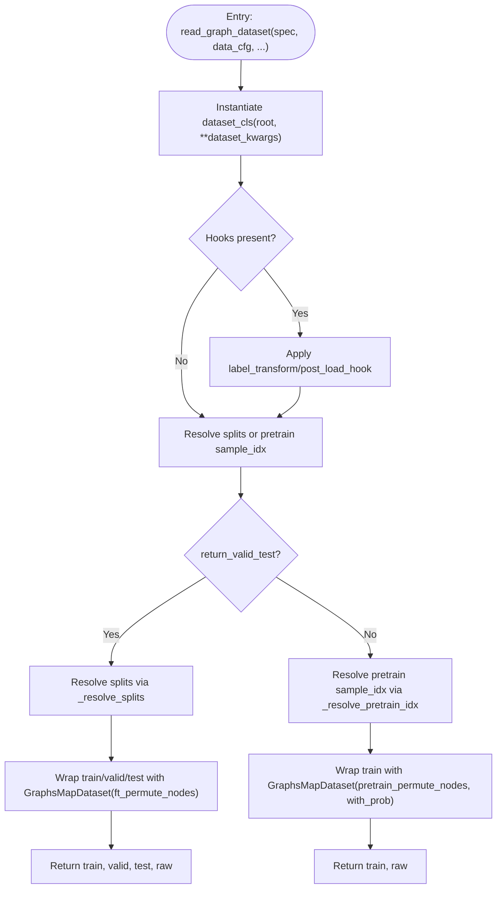
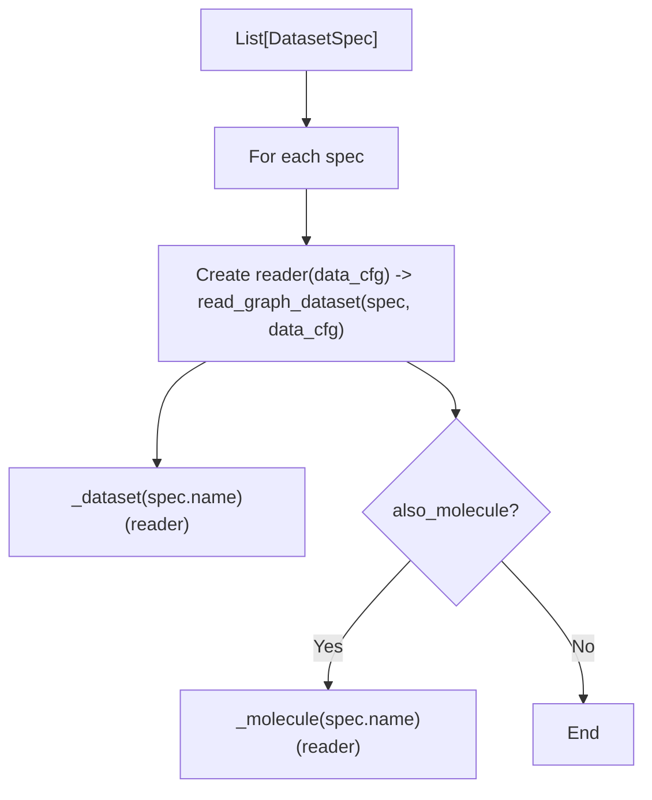
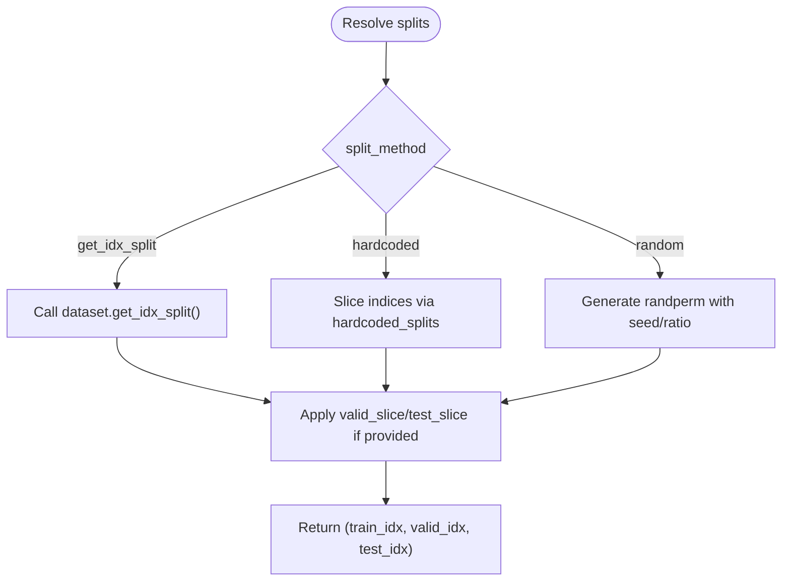
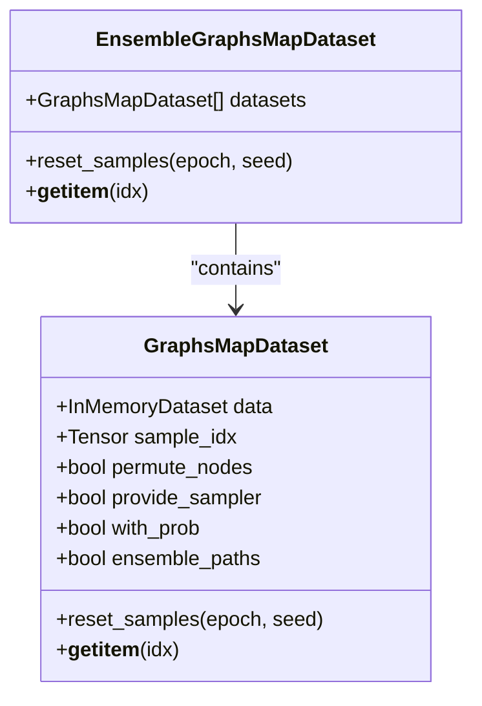
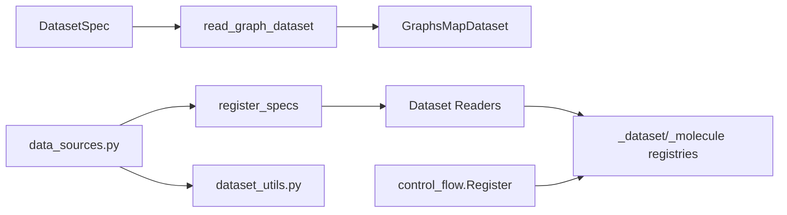
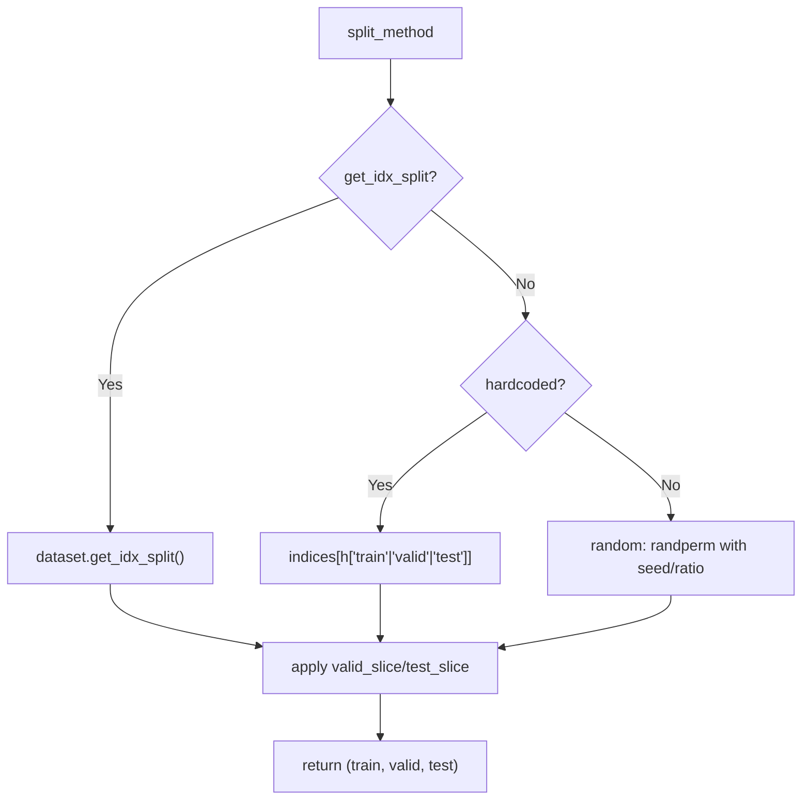
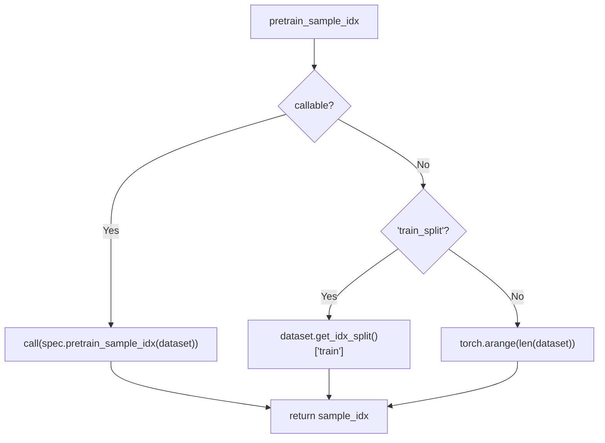

# Dataset Factory & Registry

<cite>
**Referenced Files in This Document**
- [src/data/_graph_factory.py](file://src/data/_graph_factory.py)
- [src/data/data_sources.py](file://src/data/data_sources.py)
- [src/data/dataset_map.py](file://src/data/dataset_map.py)
- [src/utils/control_flow.py](file://src/utils/control_flow.py)
- [src/utils/dataset_utils.py](file://src/utils/dataset_utils.py)
- [configs/tokenization/graph_lvl/ogbg_molhiv.yaml](file://configs/tokenization/graph_lvl/ogbg_molhiv.yaml)
- [configs/tokenization/graph_lvl/pcqm4m-v2.yaml](file://configs/tokenization/graph_lvl/pcqm4m-v2.yaml)
</cite>

## Table of Contents
1. [Introduction](#introduction)
2. [Project Structure](#project-structure)
3. [Core Components](#core-components)
4. [Architecture Overview](#architecture-overview)
5. [Detailed Component Analysis](#detailed-component-analysis)
6. [Dependency Analysis](#dependency-analysis)
7. [Performance Considerations](#performance-considerations)
8. [Troubleshooting Guide](#troubleshooting-guide)
9. [Conclusion](#conclusion)
10. [Appendices](#appendices)

## Introduction
This document explains the dataset factory and registry system in Graph-GPT. It focuses on how DatasetSpec declaratively describes datasets, how the factory pattern reads and instantiates them, how registries register readers, and how GraphsMapDataset handles sampling and permutation strategies. It also covers split configuration options, pretraining and fine-tuning flags, and practical examples for creating custom DatasetSpec instances.

## Project Structure
The dataset factory and registry live primarily in the data package:
- Factory and spec: src/data/_graph_factory.py
- Registry and dataset readers: src/data/data_sources.py
- Sampling and mapping datasets: src/data/dataset_map.py
- Control-flow registry decorator: src/utils/control_flow.py
- Example molecule datasets and utilities: src/utils/dataset_utils.py
- Tokenization configs for graph-level datasets: configs/tokenization/graph_lvl/*.yaml

**Diagram sources**
- [src/data/_graph_factory.py:1-160](file://src/data/_graph_factory.py#L1-L160)
- [src/data/data_sources.py:1-413](file://src/data/data_sources.py#L1-L413)
- [src/data/dataset_map.py:1172-1479](file://src/data/dataset_map.py#L1172-L1479)
- [src/utils/control_flow.py:9-33](file://src/utils/control_flow.py#L9-L33)
- [src/utils/dataset_utils.py:1-800](file://src/utils/dataset_utils.py#L1-L800)
- [configs/tokenization/graph_lvl/ogbg_molhiv.yaml:1-116](file://configs/tokenization/graph_lvl/ogbg_molhiv.yaml#L1-L116)
- [configs/tokenization/graph_lvl/pcqm4m-v2.yaml:1-114](file://configs/tokenization/graph_lvl/pcqm4m-v2.yaml#L1-L114)

**Section sources**
- [src/data/_graph_factory.py:1-160](file://src/data/_graph_factory.py#L1-L160)
- [src/data/data_sources.py:1-413](file://src/data/data_sources.py#L1-L413)
- [src/data/dataset_map.py:1172-1479](file://src/data/dataset_map.py#L1172-L1479)
- [src/utils/control_flow.py:9-33](file://src/utils/control_flow.py#L9-L33)
- [src/utils/dataset_utils.py:1-800](file://src/utils/dataset_utils.py#L1-L800)
- [configs/tokenization/graph_lvl/ogbg_molhiv.yaml:1-116](file://configs/tokenization/graph_lvl/ogbg_molhiv.yaml#L1-L116)
- [configs/tokenization/graph_lvl/pcqm4m-v2.yaml:1-114](file://configs/tokenization/graph_lvl/pcqm4m-v2.yaml#L1-L114)

## Core Components
- DatasetSpec: Declarative dataclass describing a dataset’s constructor, split strategy, pretrain/fine-tune flags, and hooks.
- read_graph_dataset: Factory function interpreting a DatasetSpec and returning train/validation/test datasets plus the raw dataset.
- register_specs: Registers DatasetSpec readers into dataset and molecule registries.
- GraphsMapDataset: Wraps an InMemoryDataset to support sampling, permutation, and optional probability weighting for pretraining.
- EnsembleGraphsMapDataset: Combines multiple GraphsMapDatasets into one for ensemble training.
- Registries: Two control-flow registries (_dataset and _molecule) that map dataset names to reader functions.

Key responsibilities:
- Declarative configuration via DatasetSpec
- Centralized dataset loading and splitting logic
- Consistent dataset mapping and sampling for training modes
- Optional molecule registry for cross-domain datasets

**Section sources**
- [src/data/_graph_factory.py:19-48](file://src/data/_graph_factory.py#L19-L48)
- [src/data/_graph_factory.py:50-101](file://src/data/_graph_factory.py#L50-L101)
- [src/data/_graph_factory.py:150-160](file://src/data/_graph_factory.py#L150-L160)
- [src/data/dataset_map.py:1172-1479](file://src/data/dataset_map.py#L1172-L1479)
- [src/data/data_sources.py:26-31](file://src/data/data_sources.py#L26-L31)
- [src/data/data_sources.py:193-267](file://src/data/data_sources.py#L193-L267)

## Architecture Overview
The system uses a factory-and-registry pattern:
- DatasetSpec instances describe datasets declaratively.
- register_specs binds each spec to a reader function and registers it under the dataset name in both _dataset and _molecule registries (when applicable).
- read_dataset(name, data_cfg, ...) resolves the registered reader and invokes read_graph_dataset(spec, data_cfg, ...).
- read_graph_dataset constructs the dataset, applies transforms/hooks, resolves splits, and returns mapped datasets.

**Diagram sources**
- [src/data/data_sources.py:26-28](file://src/data/data_sources.py#L26-L28)
- [src/data/_graph_factory.py:50-101](file://src/data/_graph_factory.py#L50-L101)
- [src/data/_graph_factory.py:104-137](file://src/data/_graph_factory.py#L104-L137)
- [src/data/_graph_factory.py:140-147](file://src/data/_graph_factory.py#L140-L147)
- [src/data/dataset_map.py:1172-1479](file://src/data/dataset_map.py#L1172-L1479)

## Detailed Component Analysis

### DatasetSpec Dataclass
DatasetSpec encapsulates everything needed to define a dataset:
- Identity and construction: name, dataset_cls, dataset_kwargs
- Dual registration: also_molecule toggles whether the dataset is also registered under the molecule registry
- Split configuration: split_method, hardcoded_splits, random split parameters, valid/test slices, and test_from_valid
- Pretrain configuration: pretrain_only, pretrain_permute_nodes, pretrain_sample_idx
- Fine-tune configuration: ft_permute_nodes
- Hooks: label_transform and post_load_hook

**Diagram sources**
- [src/data/_graph_factory.py:19-48](file://src/data/_graph_factory.py#L19-L48)

**Section sources**
- [src/data/_graph_factory.py:19-48](file://src/data/_graph_factory.py#L19-L48)

### Factory Pattern: read_graph_dataset
read_graph_dataset interprets a DatasetSpec:
- Loads dataset via dataset_cls(root=data_dir, **dataset_kwargs)
- Applies label_transform and post_load_hook if provided
- If return_valid_test is True:
  - Resolves train/valid/test indices via _resolve_splits
  - Wraps datasets with GraphsMapDataset using ft_permute_nodes and provide_sampler=True
- Else (pretrain):
  - Resolves pretrain sample indices via _resolve_pretrain_idx
  - Wraps dataset with GraphsMapDataset using pretrain_permute_nodes and with_prob (for pretraining weighting)

**Diagram sources**
- [src/data/_graph_factory.py:50-101](file://src/data/_graph_factory.py#L50-L101)
- [src/data/_graph_factory.py:104-147](file://src/data/_graph_factory.py#L104-L147)
- [src/data/dataset_map.py:1172-1479](file://src/data/dataset_map.py#L1172-L1479)

**Section sources**
- [src/data/_graph_factory.py:50-101](file://src/data/_graph_factory.py#L50-L101)
- [src/data/_graph_factory.py:104-147](file://src/data/_graph_factory.py#L104-L147)

### Registry Mechanism
Two registries are used:
- _dataset: maps dataset names to reader functions
- _molecule: maps molecule names to reader functions

Registration flow:
- register_specs(specs, dataset_registry, molecule_registry) iterates DatasetSpec instances
- For each spec, it creates a reader function that calls read_graph_dataset(spec, data_cfg, ...)
- Registers the reader under spec.name in both registries if also_molecule is True

**Diagram sources**
- [src/data/_graph_factory.py:150-160](file://src/data/_graph_factory.py#L150-L160)
- [src/data/data_sources.py:26-31](file://src/data/data_sources.py#L26-L31)
- [src/data/data_sources.py](file://src/data/data_sources.py#L267)

**Section sources**
- [src/data/_graph_factory.py:150-160](file://src/data/_graph_factory.py#L150-L160)
- [src/data/data_sources.py:26-31](file://src/data/data_sources.py#L26-L31)
- [src/data/data_sources.py](file://src/data/data_sources.py#L267)

### Split Configuration Options
Three split methods are supported:
- get_idx_split: Uses dataset.get_idx_split() to obtain train/valid/test indices. Supports test_from_valid to reuse valid indices for test.
- hardcoded: Uses hardcoded_slices to slice indices directly.
- random: Generates random permutations with optional seed and train ratio; valid/test slices can be applied afterward.

**Diagram sources**
- [src/data/_graph_factory.py:104-137](file://src/data/_graph_factory.py#L104-L137)

**Section sources**
- [src/data/_graph_factory.py:104-137](file://src/data/_graph_factory.py#L104-L137)

### Pretraining and Fine-Tuning Flags
Pretraining:
- pretrain_only: Enforces no validation/test sets
- pretrain_permute_nodes: Enables node permutation during pretraining
- pretrain_sample_idx: Controls which indices are used for pretraining; supports "all", "train_split", or a callable

Fine-tuning:
- ft_permute_nodes: Enables node permutation during fine-tuning

These flags are passed to GraphsMapDataset to control permutation and sampling behavior.

**Section sources**
- [src/data/_graph_factory.py:28-47](file://src/data/_graph_factory.py#L28-L47)
- [src/data/_graph_factory.py:140-147](file://src/data/_graph_factory.py#L140-L147)
- [src/data/dataset_map.py:1172-1479](file://src/data/dataset_map.py#L1172-L1479)

### Relationship with GraphsMapDataset
GraphsMapDataset wraps an InMemoryDataset and:
- Supports sampling via sample_idx
- Optionally permutes node indices (permute_nodes) for augmentation
- Provides an iterable sampler when provide_sampler=True
- Supports probability weighting for pretraining via with_prob
- Integrates with various sampling strategies via the map-dataset registry

EnsembleGraphsMapDataset combines multiple GraphsMapDatasets into one for ensemble training.

**Diagram sources**
- [src/data/dataset_map.py:1172-1479](file://src/data/dataset_map.py#L1172-L1479)

**Section sources**
- [src/data/dataset_map.py:1172-1479](file://src/data/dataset_map.py#L1172-L1479)

### Practical Examples: Creating Custom DatasetSpec Instances
To add a new dataset:
1. Define a DatasetSpec with:
   - name
   - dataset_cls and dataset_kwargs
   - split_method and related parameters (optional)
   - pretrain_only, pretrain_permute_nodes, pretrain_sample_idx (optional)
   - ft_permute_nodes (optional)
   - label_transform and/or post_load_hook (optional)
   - also_molecule (optional)
2. Append it to the list of specs
3. Call register_specs([...], _dataset, _molecule) to register it

Examples from the codebase:
- Triangles dataset with hardcoded splits and node permutation
- Reddit Threads with random splits
- OGBG-MolHIV and OGBG-MolPCBA with molecule registry enabled
- CEPDB and ZINC with pretrain_only and post-load hooks
- Custom molecule dataset with a callable pretrain_sample_idx

**Section sources**
- [src/data/data_sources.py:193-267](file://src/data/data_sources.py#L193-L267)

### Tokenization Configurations and Dataset Names
Tokenization YAML files reference dataset names used by the registry:
- ogbg_molhiv.yaml references dataset: "ogbg-molhiv"
- pcqm4m-v2.yaml references dataset: "molecule" and sets task_type for pretraining

These configs drive which dataset reader is invoked during training.

**Section sources**
- [configs/tokenization/graph_lvl/ogbg_molhiv.yaml:1-116](file://configs/tokenization/graph_lvl/ogbg_molhiv.yaml#L1-L116)
- [configs/tokenization/graph_lvl/pcqm4m-v2.yaml:1-114](file://configs/tokenization/graph_lvl/pcqm4m-v2.yaml#L1-L114)

## Dependency Analysis
- DatasetSpec depends on torch and typing constructs; it references dataset_cls and dataset_kwargs to construct the dataset.
- read_graph_dataset depends on GraphsMapDataset and DatasetSpec to produce mapped datasets.
- register_specs depends on the control_flow.Register decorator to bind readers to names.
- data_sources.py composes DatasetSpec instances and registers them into both _dataset and _molecule registries.
- GraphsMapDataset depends on torch_geometric and torch-sparse for sampling and subgraph extraction.

**Diagram sources**
- [src/data/_graph_factory.py:19-160](file://src/data/_graph_factory.py#L19-L160)
- [src/data/data_sources.py:193-267](file://src/data/data_sources.py#L193-L267)
- [src/data/dataset_map.py:1172-1479](file://src/data/dataset_map.py#L1172-L1479)
- [src/utils/control_flow.py:9-33](file://src/utils/control_flow.py#L9-L33)
- [src/utils/dataset_utils.py:1-800](file://src/utils/dataset_utils.py#L1-L800)

**Section sources**
- [src/data/_graph_factory.py:19-160](file://src/data/_graph_factory.py#L19-L160)
- [src/data/data_sources.py:193-267](file://src/data/data_sources.py#L193-L267)
- [src/data/dataset_map.py:1172-1479](file://src/data/dataset_map.py#L1172-L1479)
- [src/utils/control_flow.py:9-33](file://src/utils/control_flow.py#L9-L33)
- [src/utils/dataset_utils.py:1-800](file://src/utils/dataset_utils.py#L1-L800)

## Performance Considerations
- Node permutation (permute_nodes) introduces randomness and can improve generalization but adds overhead; enable only when beneficial.
- Using with_prob in GraphsMapDataset for pretraining can weight samples by path counts; ensure it aligns with training objectives.
- provide_sampler=True enables efficient shuffling of indices; ensure DataLoader pin_memory and num_workers are configured appropriately.
- For large datasets, prefer dataset.get_idx_split() or pre-defined slices to avoid expensive random permutations.

[No sources needed since this section provides general guidance]

## Troubleshooting Guide
Common issues and resolutions:
- Unknown split_method: Ensure split_method is one of "get_idx_split", "hardcoded", or "random".
- Pretrain-only datasets with return_valid_test: pretrain_only enforces no validation/test; set return_valid_test=False.
- Missing dataset.get_idx_split(): Some datasets require custom split logic; use hardcoded or random splits instead.
- Hook errors: Verify label_transform and post_load_hook signatures accept a single dataset argument and modify it in-place.
- Registration conflicts: Duplicate dataset names will raise a KeyError; ensure unique names.

**Section sources**
- [src/data/_graph_factory.py:104-137](file://src/data/_graph_factory.py#L104-L137)
- [src/data/_graph_factory.py:55-57](file://src/data/_graph_factory.py#L55-L57)
- [src/utils/control_flow.py:24-32](file://src/utils/control_flow.py#L24-L32)

## Conclusion
The dataset factory and registry system in Graph-GPT provides a clean, declarative way to configure datasets. DatasetSpec centralizes dataset metadata and behavior, read_graph_dataset interprets these specs, and registries enable flexible dataset selection. GraphsMapDataset offers robust sampling and permutation strategies tailored for pretraining and fine-tuning. By leveraging these components, developers can quickly add new datasets and integrate them seamlessly into the training pipeline.

## Appendices

### Appendix A: Split Resolution Logic

**Diagram sources**
- [src/data/_graph_factory.py:104-137](file://src/data/_graph_factory.py#L104-L137)

### Appendix B: Pretrain Sample Index Resolution

**Diagram sources**
- [src/data/_graph_factory.py:140-147](file://src/data/_graph_factory.py#L140-L147)
