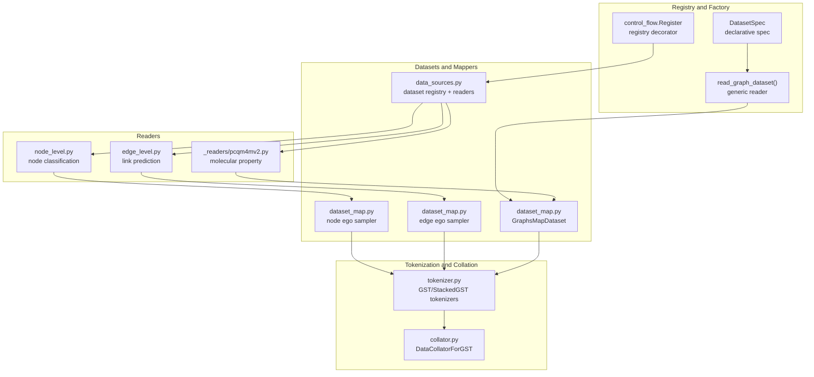
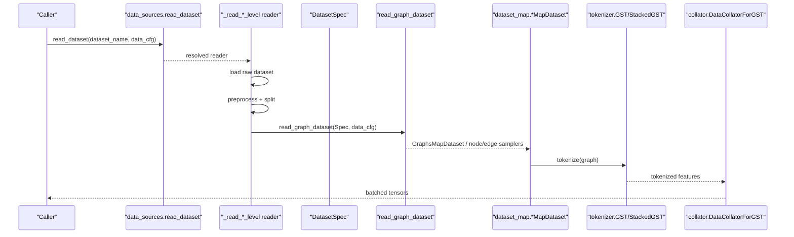
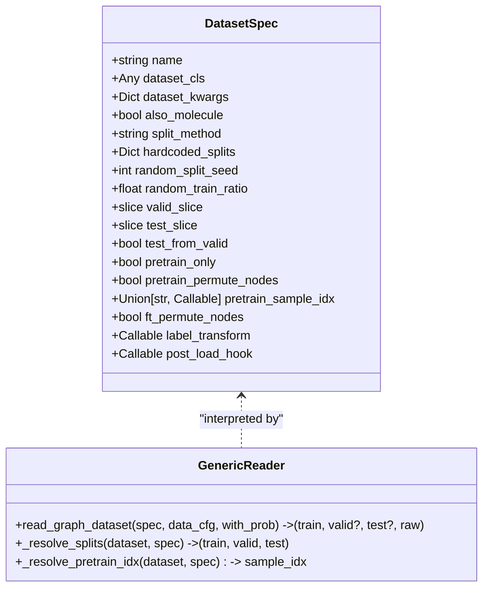
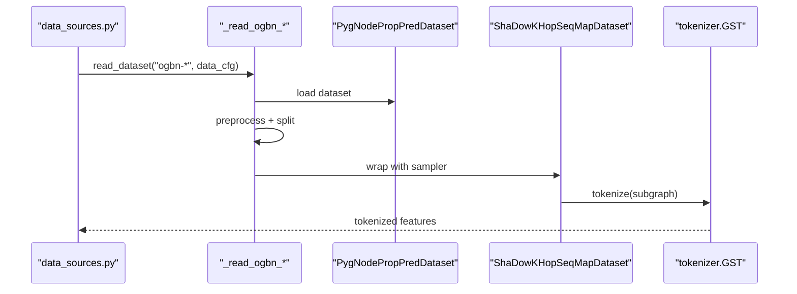
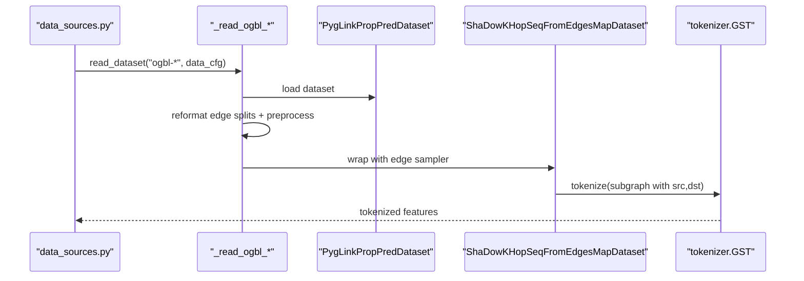
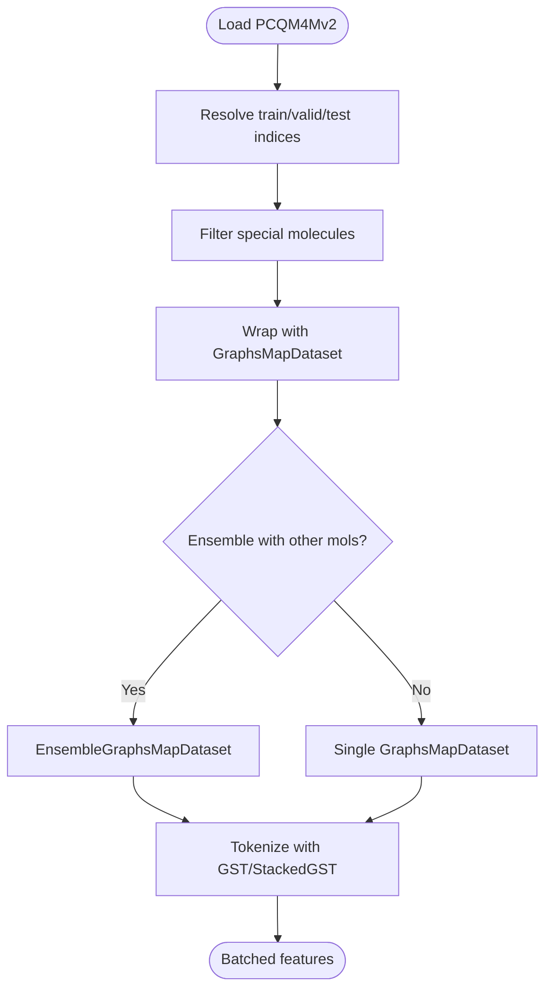
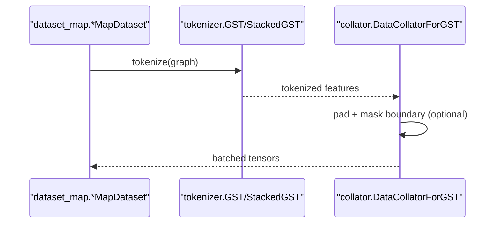
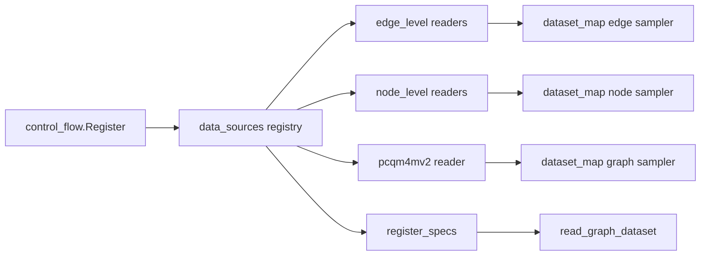

# Dataset Integration

<cite>
**Referenced Files in This Document**
- [src/data/__init__.py](file://src/data/__init__.py)
- [src/data/_graph_factory.py](file://src/data/_graph_factory.py)
- [src/data/data_sources.py](file://src/data/data_sources.py)
- [_readers/edge_level.py](file://src/data/_readers/edge_level.py)
- [_readers/node_level.py](file://src/data/_readers/node_level.py)
- [_readers/pcqm4mv2.py](file://src/data/_readers/pcqm4mv2.py)
- [src/data/dataset_map.py](file://src/data/dataset_map.py)
- [src/data/collator.py](file://src/data/collator.py)
- [src/data/tokenizer.py](file://src/data/tokenizer.py)
- [src/utils/control_flow.py](file://src/utils/control_flow.py)
- [configs/tokenization/base.yaml](file://configs/tokenization/base.yaml)
- [configs/tokenization/edge_lvl/ogbl_ppa.yaml](file://configs/tokenization/edge_lvl/ogbl_ppa.yaml)
- [configs/tokenization/graph_lvl/ogbg_molhiv.yaml](file://configs/tokenization/graph_lvl/ogbg_molhiv.yaml)
- [src/utils/dataset_utils.py](file://src/utils/dataset_utils.py)
- [src/conf/base_configs.py](file://src/conf/base_configs.py)
</cite>

## Table of Contents
1. [Introduction](#introduction)
2. [Project Structure](#project-structure)
3. [Core Components](#core-components)
4. [Architecture Overview](#architecture-overview)
5. [Detailed Component Analysis](#detailed-component-analysis)
6. [Dependency Analysis](#dependency-analysis)
7. [Performance Considerations](#performance-considerations)
8. [Troubleshooting Guide](#troubleshooting-guide)
9. [Conclusion](#conclusion)
10. [Appendices](#appendices)

## Introduction
This document explains how Graph-GPT integrates datasets using a registry-driven factory pattern and dataset-specific readers. It covers:
- The DatasetSpec registration system and generic graph dataset creation
- Reader abstractions for edge-level link prediction, node-level classification, and molecular property prediction
- How datasets are validated, preprocessed, and transformed
- The relationship between dataset readers and tokenization pipelines
- Practical examples for adding new datasets and implementing custom readers
- Optimization strategies and performance considerations

## Project Structure
At a high level, dataset integration spans:
- Registry utilities for decoupled dataset selection
- A generic graph dataset factory powered by DatasetSpec
- Reader modules for different task families (node, edge, graph/molecular)
- Tokenization and batching pipelines that consume datasets

**Diagram sources**
- [src/utils/control_flow.py:1-33](file://src/utils/control_flow.py#L1-L33)
- [src/data/_graph_factory.py:19-160](file://src/data/_graph_factory.py#L19-L160)
- [src/data/data_sources.py:26-289](file://src/data/data_sources.py#L26-L289)
- [src/data/_readers/edge_level.py:27-381](file://src/data/_readers/edge_level.py#L27-L381)
- [src/data/_readers/node_level.py:27-369](file://src/data/_readers/node_level.py#L27-L369)
- [src/data/_readers/pcqm4mv2.py:18-488](file://src/data/_readers/pcqm4mv2.py#L18-L488)
- [src/data/dataset_map.py:132-554](file://src/data/dataset_map.py#L132-L554)
- [src/data/tokenizer.py:30-1403](file://src/data/tokenizer.py#L30-L1403)
- [src/data/collator.py:22-134](file://src/data/collator.py#L22-L134)

**Section sources**
- [src/data/__init__.py:1-21](file://src/data/__init__.py#L1-L21)
- [src/data/data_sources.py:26-289](file://src/data/data_sources.py#L26-L289)
- [src/data/_graph_factory.py:19-160](file://src/data/_graph_factory.py#L19-L160)

## Core Components
- Registry and factory
  - A Register-based decorator pattern decouples dataset selection from callers.
  - DatasetSpec describes dataset constructors, splits, transforms, and pre/post hooks.
  - read_graph_dataset interprets DatasetSpec and returns train/valid/test datasets consistently.

- Reader abstraction
  - Readers encapsulate dataset loading, preprocessing, and split logic for specific tasks.
  - Readers for node-level, edge-level, and molecular tasks are registered separately.

- Tokenization pipeline
  - Tokenizers convert graphs to token sequences and prepare inputs for downstream models.
  - Collators assemble tokenized batches and handle padding and attention masks.

**Section sources**
- [src/utils/control_flow.py:9-33](file://src/utils/control_flow.py#L9-L33)
- [src/data/_graph_factory.py:19-160](file://src/data/_graph_factory.py#L19-L160)
- [src/data/data_sources.py:26-289](file://src/data/data_sources.py#L26-L289)
- [src/data/tokenizer.py:30-1403](file://src/data/tokenizer.py#L30-L1403)
- [src/data/collator.py:22-134](file://src/data/collator.py#L22-L134)

## Architecture Overview
The dataset integration architecture follows a registry-driven factory pattern:
- A dataset name resolves to a reader via the registry.
- Readers construct datasets, apply transformations, and split indices.
- Samplers wrap datasets into map-style datasets for training modes (pretrain vs fine-tune).
- Tokenizers transform subgraphs into token sequences; collators batch them.

**Diagram sources**
- [src/data/data_sources.py:26-289](file://src/data/data_sources.py#L26-L289)
- [src/data/_graph_factory.py:50-101](file://src/data/_graph_factory.py#L50-L101)
- [src/data/dataset_map.py:132-554](file://src/data/dataset_map.py#L132-L554)
- [src/data/tokenizer.py:585-612](file://src/data/tokenizer.py#L585-L612)
- [src/data/collator.py:70-111](file://src/data/collator.py#L70-L111)

## Detailed Component Analysis

### Registry-driven factory and DatasetSpec
- DatasetSpec holds constructor class, kwargs, split policy, pretrain/fine-tune flags, and hooks.
- read_graph_dataset constructs the dataset, applies label_transform/post_load_hook, resolves splits, and returns map-style datasets.
- register_specs registers DatasetSpec instances into both the general dataset registry and the molecule registry.

**Diagram sources**
- [src/data/_graph_factory.py:19-160](file://src/data/_graph_factory.py#L19-L160)

**Section sources**
- [src/data/_graph_factory.py:19-160](file://src/data/_graph_factory.py#L19-L160)
- [src/data/data_sources.py:267-268](file://src/data/data_sources.py#L267-L268)

### Node-level classification readers
- Readers for node property prediction tasks (e.g., ogbn-products, ogbn-arxiv, ogbn-papers100M, ogbn-proteins).
- They load PygNodePropPredDataset, apply preprocessing (e.g., undirected edges, node encodings), and split indices.
- Use ShaDowKHopSeqMapDataset for local neighborhood sampling in node tasks.

**Diagram sources**
- [src/data/_readers/node_level.py:27-369](file://src/data/_readers/node_level.py#L27-L369)
- [src/data/dataset_map.py:132-269](file://src/data/dataset_map.py#L132-L269)
- [src/data/tokenizer.py:425-612](file://src/data/tokenizer.py#L425-L612)

**Section sources**
- [src/data/_readers/node_level.py:27-369](file://src/data/_readers/node_level.py#L27-L369)
- [src/data/dataset_map.py:132-269](file://src/data/dataset_map.py#L132-L269)

### Edge-level link prediction readers
- Readers for link prediction tasks (e.g., ogbl-ppa, ogbl-citation2, ogbl-wikikg2, ogbl-ddi).
- They load PygLinkPropPredDataset, reformat edge splits, remove self-loops, and optionally make graphs undirected.
- Use ShaDowKHopSeqFromEdgesMapDataset to sample subgraphs around link targets and generate negative edges.

**Diagram sources**
- [src/data/_readers/edge_level.py:27-381](file://src/data/_readers/edge_level.py#L27-L381)
- [src/data/dataset_map.py:271-554](file://src/data/dataset_map.py#L271-L554)
- [src/data/tokenizer.py:425-612](file://src/data/tokenizer.py#L425-L612)

**Section sources**
- [src/data/_readers/edge_level.py:27-381](file://src/data/_readers/edge_level.py#L27-L381)
- [src/data/dataset_map.py:271-554](file://src/data/dataset_map.py#L271-L554)

### Molecular property prediction readers
- Reader for PCQM4Mv2 and related molecular datasets.
- Handles splitting, optional augmentation (e.g., 3D positions), and special molecule filtering.
- Uses GraphsMapDataset for graph-level sampling and optional ensembles with other molecular datasets.

**Diagram sources**
- [src/data/_readers/pcqm4mv2.py:18-234](file://src/data/_readers/pcqm4mv2.py#L18-L234)
- [src/data/dataset_map.py:132-269](file://src/data/dataset_map.py#L132-L269)
- [src/data/tokenizer.py:585-612](file://src/data/tokenizer.py#L585-L612)

**Section sources**
- [src/data/_readers/pcqm4mv2.py:18-234](file://src/data/_readers/pcqm4mv2.py#L18-L234)
- [src/data/dataset_map.py:132-269](file://src/data/dataset_map.py#L132-L269)

### Tokenization pipeline and collation
- Tokenizers convert graphs to token sequences and prepare inputs for tasks (node, edge, graph).
- Collators pad sequences, assemble attention masks, and support dynamic masking ratios during pretraining.

**Diagram sources**
- [src/data/tokenizer.py:585-612](file://src/data/tokenizer.py#L585-L612)
- [src/data/collator.py:70-111](file://src/data/collator.py#L70-L111)

**Section sources**
- [src/data/tokenizer.py:30-1403](file://src/data/tokenizer.py#L30-L1403)
- [src/data/collator.py:22-134](file://src/data/collator.py#L22-L134)

## Dependency Analysis
- Registry pattern
  - control_flow.Register provides a decorator to register dataset readers by name.
  - data_sources maintains two registries: one for general datasets and one for molecules.

- DatasetSpec-driven graph datasets
  - register_specs binds DatasetSpec instances to readers and molecule registry entries.

- Reader-to-sampler coupling
  - Node-level tasks use ShaDowKHopSeqMapDataset.
  - Edge-level tasks use ShaDowKHopSeqFromEdgesMapDataset.
  - Graph-level tasks use GraphsMapDataset.

**Diagram sources**
- [src/utils/control_flow.py:9-33](file://src/utils/control_flow.py#L9-L33)
- [src/data/data_sources.py:26-289](file://src/data/data_sources.py#L26-L289)
- [src/data/_graph_factory.py:150-160](file://src/data/_graph_factory.py#L150-L160)
- [src/data/dataset_map.py:132-554](file://src/data/dataset_map.py#L132-L554)

**Section sources**
- [src/utils/control_flow.py:9-33](file://src/utils/control_flow.py#L9-L33)
- [src/data/data_sources.py:26-289](file://src/data/data_sources.py#L26-L289)
- [src/data/_graph_factory.py:150-160](file://src/data/_graph_factory.py#L150-L160)

## Performance Considerations
- Sampling strategies
  - ShaDowKHopSeqMapDataset and ShaDowKHopSeqFromEdgesMapDataset support configurable depth/neighbors and replacement to balance coverage and speed.
  - Negative edge sampling supports global/local strategies; adjust neg_ratio and method to control data skew.

- Pretraining indexing
  - pretrain_sample_idx can be "all", "train_split", or a callable, enabling efficient pretraining on subsets.

- Large graphs and partitioning
  - Metis-based partitioning (MetisPartitionSeqMapDataset) reduces memory pressure for very large graphs.

- Tokenization overhead
  - StackedGSTTokenizer stacks attributes to nodes or edges to reduce sequence length; choose stack_method based on model capacity.

- Data loading
  - Using provide_sampler and appropriate num_workers helps keep the pipeline fed during training.

[No sources needed since this section provides general guidance]

## Troubleshooting Guide
- Split method errors
  - Unknown split_method raises an error; ensure spec.split_method is one of "get_idx_split", "hardcoded", or "random".

- Pretrain-only datasets
  - pretrain_only datasets must not request valid/test; the factory asserts this.

- Edge-level sampling edge cases
  - When graphs have isolated nodes, allow_zero_edges can prevent empty subgraphs; the edge sampler logs warnings accordingly.

- Molecule filtering
  - Special molecules (e.g., disconnected, single-node) can be filtered out; indices are cached to disk for reuse.

- Tokenization limits
  - num_nodes must not exceed node_scope; otherwise, tokenization fails early.

**Section sources**
- [src/data/_graph_factory.py:104-137](file://src/data/_graph_factory.py#L104-L137)
- [src/data/_graph_factory.py:55-57](file://src/data/_graph_factory.py#L55-L57)
- [src/data/_readers/edge_level.py:125-133](file://src/data/_readers/edge_level.py#L125-L133)
- [src/data/_readers/pcqm4mv2.py:390-402](file://src/data/_readers/pcqm4mv2.py#L390-L402)
- [src/data/tokenizer.py:432-434](file://src/data/tokenizer.py#L432-L434)

## Conclusion
Graph-GPT’s dataset integration leverages a clean registry-driven factory pattern:
- DatasetSpecs declare dataset characteristics and behavior.
- Dedicated readers encapsulate task-specific loading, preprocessing, and splitting.
- Samplers and tokenizers bridge datasets to training pipelines.
This design enables straightforward addition of new datasets and robust customization for diverse graph ML tasks.

[No sources needed since this section summarizes without analyzing specific files]

## Appendices

### Adding a new dataset via the registry pattern
Steps:
1. Define a reader function that loads the dataset, applies preprocessing, and returns train/valid/test map datasets.
2. Register the reader under a unique dataset name using the registry decorator.
3. If the dataset is molecular, also register it in the molecule registry.
4. Optionally define a DatasetSpec and register it via register_specs to leverage the generic factory.

Example references:
- Reader registration for node-level datasets: [src/data/_readers/node_level.py:363-369](file://src/data/_readers/node_level.py#L363-L369)
- Reader registration for edge-level datasets: [src/data/_readers/edge_level.py:375-381](file://src/data/_readers/edge_level.py#L375-L381)
- PCQM4Mv2 registration: [src/data/_readers/pcqm4mv2.py:484-488](file://src/data/_readers/pcqm4mv2.py#L484-L488)
- Generic factory and spec registration: [src/data/_graph_factory.py:150-160](file://src/data/_graph_factory.py#L150-L160)

**Section sources**
- [src/data/_readers/node_level.py:363-369](file://src/data/_readers/node_level.py#L363-L369)
- [src/data/_readers/edge_level.py:375-381](file://src/data/_readers/edge_level.py#L375-L381)
- [src/data/_readers/pcqm4mv2.py:484-488](file://src/data/_readers/pcqm4mv2.py#L484-L488)
- [src/data/_graph_factory.py:150-160](file://src/data/_graph_factory.py#L150-L160)

### Implementing custom dataset readers
Guidelines:
- For node-level tasks, use ShaDowKHopSeqMapDataset with sample_idx from dataset splits.
- For edge-level tasks, use ShaDowKHopSeqFromEdgesMapDataset with split_edge dictionaries and negative sampling parameters.
- For graph-level tasks, use GraphsMapDataset with permute_nodes and provide_sampler as needed.
- Apply label_transform and post_load_hook via DatasetSpec for consistent behavior across runs.

References:
- Node-level reader pattern: [src/data/_readers/node_level.py:58-114](file://src/data/_readers/node_level.py#L58-L114)
- Edge-level reader pattern: [src/data/_readers/edge_level.py:46-91](file://src/data/_readers/edge_level.py#L46-L91)
- Graph-level reader pattern: [src/data/_readers/pcqm4mv2.py:111-197](file://src/data/_readers/pcqm4mv2.py#L111-L197)
- Samplers: [src/data/dataset_map.py:132-554](file://src/data/dataset_map.py#L132-L554)

**Section sources**
- [src/data/_readers/node_level.py:58-114](file://src/data/_readers/node_level.py#L58-L114)
- [src/data/_readers/edge_level.py:46-91](file://src/data/_readers/edge_level.py#L46-L91)
- [src/data/_readers/pcqm4mv2.py:111-197](file://src/data/_readers/pcqm4mv2.py#L111-L197)
- [src/data/dataset_map.py:132-554](file://src/data/dataset_map.py#L132-L554)

### Dataset validation and preprocessing requirements
- Node-level
  - Ensure graphs are undirected after preprocessing; the node reader validates this.
  - Encode node identities and years appropriately for tasks like arXiv/products.

- Edge-level
  - Remove self-loops and make edges undirected when needed.
  - Reformat edge splits to train/valid/test dictionaries with proper edge attributes.

- Molecular
  - Filter disconnected or minimal molecules if necessary.
  - Optionally augment with 3D coordinates; ensure consistent shapes for embeddings.

References:
- Node-level validation and encoding: [src/data/_readers/node_level.py:40-54](file://src/data/_readers/node_level.py#L40-L54)
- Edge-level preprocessing: [src/data/_readers/edge_level.py:107-119](file://src/data/_readers/edge_level.py#L107-L119)
- Molecular filtering helpers: [src/data/_readers/pcqm4mv2.py:405-481](file://src/data/_readers/pcqm4mv2.py#L405-L481)

**Section sources**
- [src/data/_readers/node_level.py:40-54](file://src/data/_readers/node_level.py#L40-L54)
- [src/data/_readers/edge_level.py:107-119](file://src/data/_readers/edge_level.py#L107-L119)
- [src/data/_readers/pcqm4mv2.py:405-481](file://src/data/_readers/pcqm4mv2.py#L405-L481)

### Relationship between dataset readers and tokenization pipelines
- Readers produce map-style datasets that yield subgraphs.
- Tokenizers convert subgraphs into token sequences and prepare inputs.
- Collators assemble tokenized outputs into batches with attention masks and labels.

References:
- Tokenization call flow: [src/data/tokenizer.py:585-612](file://src/data/tokenizer.py#L585-L612)
- Collation: [src/data/collator.py:70-111](file://src/data/collator.py#L70-L111)

**Section sources**
- [src/data/tokenizer.py:585-612](file://src/data/tokenizer.py#L585-L612)
- [src/data/collator.py:70-111](file://src/data/collator.py#L70-L111)

### Configuration examples
- Base tokenization configuration: [configs/tokenization/base.yaml:1-117](file://configs/tokenization/base.yaml#L1-L117)
- Edge-level dataset configuration: [configs/tokenization/edge_lvl/ogbl_ppa.yaml:1-123](file://configs/tokenization/edge_lvl/ogbl_ppa.yaml#L1-L123)
- Graph/molecular dataset configuration: [configs/tokenization/graph_lvl/ogbg_molhiv.yaml:1-116](file://configs/tokenization/graph_lvl/ogbg_molhiv.yaml#L1-L116)

**Section sources**
- [configs/tokenization/base.yaml:1-117](file://configs/tokenization/base.yaml#L1-L117)
- [configs/tokenization/edge_lvl/ogbl_ppa.yaml:1-123](file://configs/tokenization/edge_lvl/ogbl_ppa.yaml#L1-L123)
- [configs/tokenization/graph_lvl/ogbg_molhiv.yaml:1-116](file://configs/tokenization/graph_lvl/ogbg_molhiv.yaml#L1-L116)
