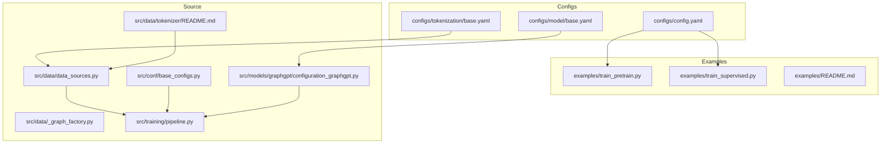
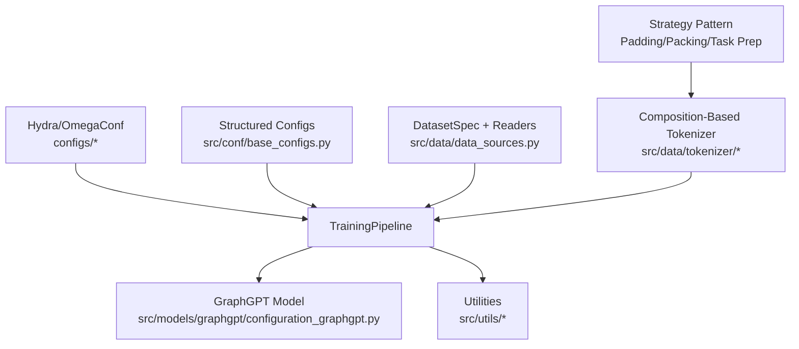
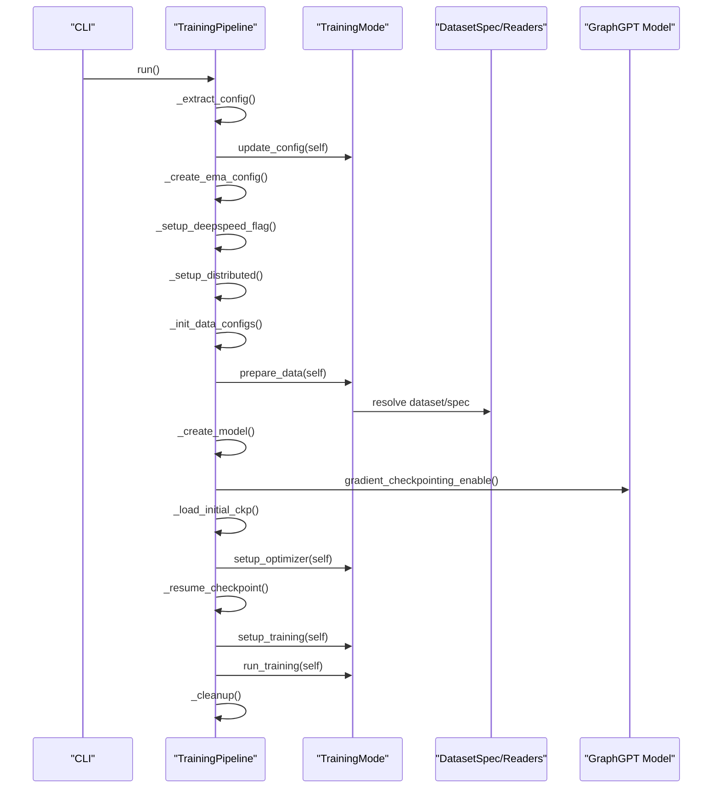
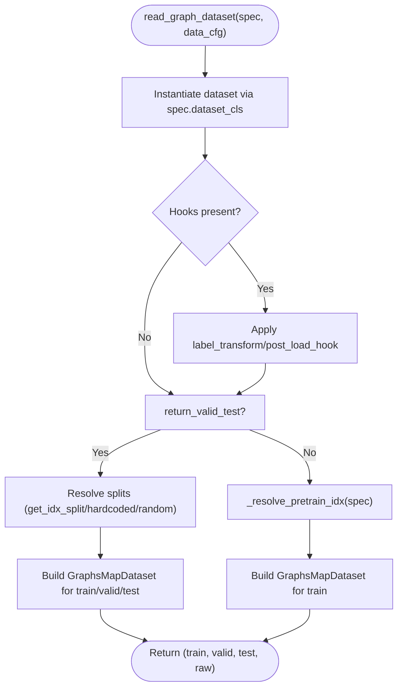
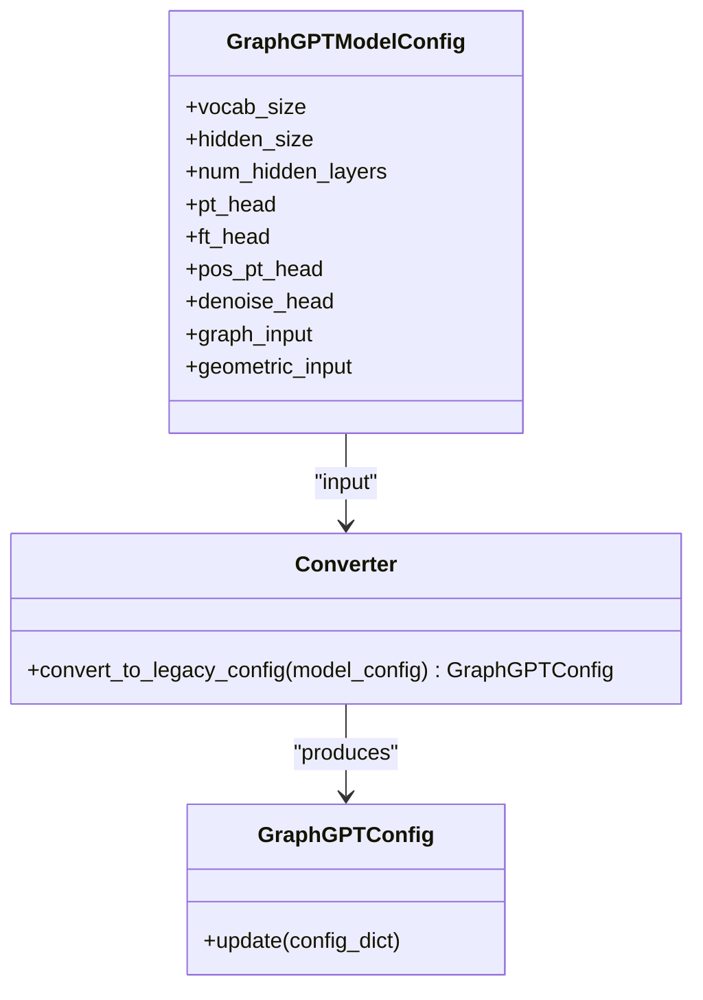
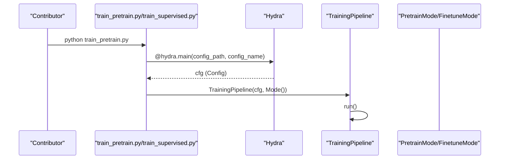
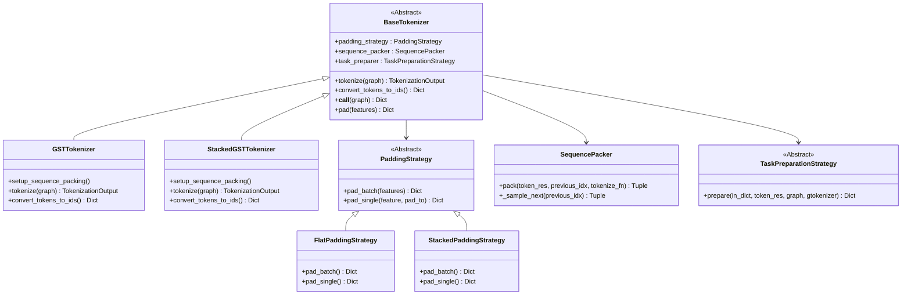
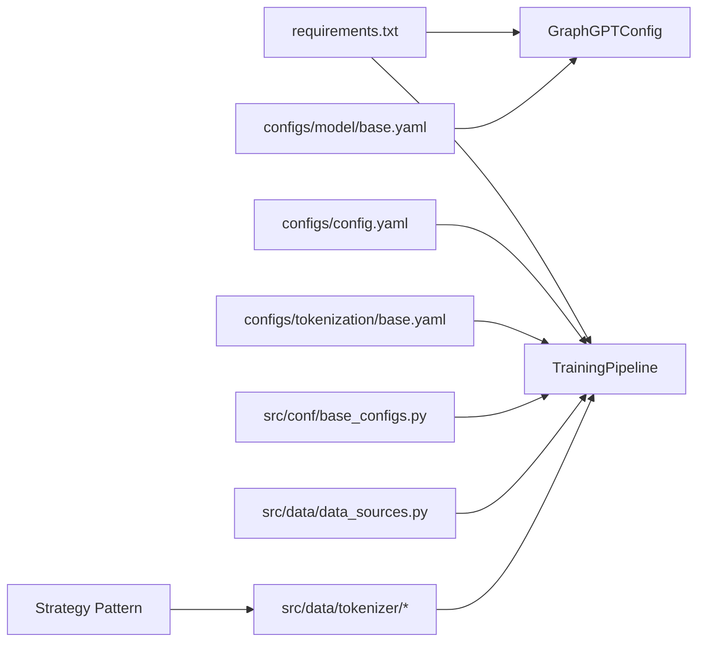

# Development Guidelines

<cite>
**Referenced Files in This Document**
- [.pre-commit-config.yaml](file://.pre-commit-config.yaml)
- [README.md](file://README.md)
- [requirements.txt](file://requirements.txt)
- [configs/README.md](file://configs/README.md)
- [configs/config.yaml](file://configs/config.yaml)
- [configs/model/base.yaml](file://configs/model/base.yaml)
- [configs/tokenization/base.yaml](file://configs/tokenization/base.yaml)
- [src/conf/base_configs.py](file://src/conf/base_configs.py)
- [src/data/_graph_factory.py](file://src/data/_graph_factory.py)
- [src/data/data_sources.py](file://src/data/data_sources.py)
- [src/training/pipeline.py](file://src/training/pipeline.py)
- [src/models/graphgpt/configuration_graphgpt.py](file://src/models/graphgpt/configuration_graphgpt.py)
- [examples/train_pretrain.py](file://examples/train_pretrain.py)
- [examples/train_supervised.py](file://examples/train_supervised.py)
- [examples/README.md](file://examples/README.md)
- [src/data/tokenizer/README.md](file://src/data/tokenizer/README.md)
- [src/data/tokenizer/base.py](file://src/data/tokenizer/base.py)
- [src/data/tokenizer/core.py](file://src/data/tokenizer/core.py)
- [src/data/tokenizer/strategies/padding.py](file://src/data/tokenizer/strategies/padding.py)
- [src/data/tokenizer/strategies/packing.py](file://src/data/tokenizer/strategies/packing.py)
- [src/data/tokenizer/strategies/task_prep/base.py](file://src/data/tokenizer/strategies/task_prep/base.py)
- [src/data/tokenizer/types.py](file://src/data/tokenizer/types.py)
- [src/data/tokenizer/__init__.py](file://src/data/tokenizer/__init__.py)
- [tests/test_refactoring_syntax.py](file://tests/test_refactoring_syntax.py)
- [tests/test_tokenizer_smoke.py](file://tests/test_tokenizer_smoke.py)
</cite>

## Update Summary
**Changes Made**
- Enhanced tokenizer architecture section to reflect the major refactoring to modular design principles
- Updated coding conventions to include strategy pattern implementation guidelines
- Added comprehensive documentation for the new composition-based tokenizer architecture
- Expanded testing and quality assurance section with tokenizer-specific testing strategies
- Updated templates and extension playbooks to include strategy pattern examples
- Added migration guide for transitioning from legacy monolithic tokenizer to modular design

## Table of Contents
1. [Introduction](#introduction)
2. [Project Structure](#project-structure)
3. [Core Components](#core-components)
4. [Architecture Overview](#architecture-overview)
5. [Detailed Component Analysis](#detailed-component-analysis)
6. [Dependency Analysis](#dependency-analysis)
7. [Performance Considerations](#performance-considerations)
8. [Troubleshooting Guide](#troubleshooting-guide)
9. [Version Control and Contribution Workflow](#version-control-and-contribution-workflow)
10. [Testing and Quality Assurance](#testing-and-quality-assurance)
11. [Documentation Maintenance](#documentation-maintenance)
12. [Templates and Extension Playbooks](#templates-and-extension-playbooks)
13. [Conclusion](#conclusion)

## Introduction
This document establishes development guidelines for Graph-GPT, focusing on code quality, contribution workflows, and best practices. It explains pre-commit configuration, formatting requirements, quality assurance processes, coding conventions, architectural patterns, and design principles. The project has undergone a major tokenizer refactoring in v0.8.0, introducing modular design principles with composition-based architecture that eliminates redundant parameters and enhances maintainability. It provides guidance for adding new features, extending functionality, maintaining backward compatibility, and templates for integrating new datasets, model extensions, and utilities. Testing strategies, debugging approaches, and performance profiling techniques are included, along with version control practices, pull request workflows, and documentation maintenance procedures.

## Project Structure
The repository is organized around a modular Python package layout with clear separation of concerns:
- configs/: Hydra/OmegaConf YAML configurations for tokenization, model, training, and generation
- examples/: thin entry scripts and example shell scripts for pre-training and fine-tuning
- src/: core source code organized by domain:
  - conf/: structured dataclass-based configuration
  - data/: dataset readers, factories, helpers, and tokenization utilities
  - models/graphgpt/: model configuration and modeling modules
  - training/: unified training pipeline and mode strategies
  - utils/: shared utilities for training, metrics, logging, and data handling
- top-level files for environment, pre-commit, and documentation



**Diagram sources**
- [configs/config.yaml:1-20](file://configs/config.yaml#L1-L20)
- [configs/model/base.yaml:1-222](file://configs/model/base.yaml#L1-L222)
- [configs/tokenization/base.yaml:1-117](file://configs/tokenization/base.yaml#L1-L117)
- [examples/train_pretrain.py:1-19](file://examples/train_pretrain.py#L1-L19)
- [examples/train_supervised.py:1-19](file://examples/train_supervised.py#L1-L19)
- [examples/README.md:1-30](file://examples/README.md#L1-L30)
- [src/conf/base_configs.py:1-302](file://src/conf/base_configs.py#L1-L302)
- [src/data/data_sources.py:1-413](file://src/data/data_sources.py#L1-L413)
- [src/data/_graph_factory.py:1-160](file://src/data/_graph_factory.py#L1-L160)
- [src/training/pipeline.py:1-258](file://src/training/pipeline.py#L1-L258)
- [src/models/graphgpt/configuration_graphgpt.py:1-346](file://src/models/graphgpt/configuration_graphgpt.py#L1-L346)
- [src/data/tokenizer/README.md:1-307](file://src/data/tokenizer/README.md#L1-L307)

**Section sources**
- [README.md:248-286](file://README.md#L248-L286)
- [configs/README.md:1-18](file://configs/README.md#L1-L18)

## Core Components
- Unified Training Pipeline: Orchestrates shared setup and delegates mode-specific behavior via a strategy interface. See [TrainingPipeline:15-258](file://src/training/pipeline.py#L15-L258).
- Configuration System: Hydra/OmegaConf YAML plus structured dataclass configs for model, tokenization, training, and generation. See [configs/config.yaml:1-20](file://configs/config.yaml#L1-L20), [configs/model/base.yaml:1-222](file://configs/model/base.yaml#L1-L222), [configs/tokenization/base.yaml:1-117](file://configs/tokenization/base.yaml#L1-L117), and [src/conf/base_configs.py:187-302](file://src/conf/base_configs.py#L187-L302).
- Dataset Factory and Readers: Registry-driven DatasetSpec-based factory returning train/valid/test splits or raw datasets. See [src/data/_graph_factory.py:1-160](file://src/data/_graph_factory.py#L1-L160) and [src/data/data_sources.py:193-267](file://src/data/data_sources.py#L193-L267).
- Model Configuration Bridge: Legacy GraphGPTConfig constructed from structured model configs for backward compatibility. See [src/models/graphgpt/configuration_graphgpt.py:212-346](file://src/models/graphgpt/configuration_graphgpt.py#L212-L346).
- Entry Scripts: Thin wrappers using Hydra to construct Config and launch training. See [examples/train_pretrain.py:1-19](file://examples/train_pretrain.py#L1-L19) and [examples/train_supervised.py:1-19](file://examples/train_supervised.py#L1-L19).
- **Tokenizer Module**: Refactored to use composition-based architecture with strategy pattern for enhanced modularity and maintainability. See [src/data/tokenizer/README.md:1-307](file://src/data/tokenizer/README.md#L1-L307).

**Section sources**
- [src/training/pipeline.py:15-258](file://src/training/pipeline.py#L15-L258)
- [src/conf/base_configs.py:187-302](file://src/conf/base_configs.py#L187-L302)
- [src/data/_graph_factory.py:19-160](file://src/data/_graph_factory.py#L19-L160)
- [src/data/data_sources.py:193-267](file://src/data/data_sources.py#L193-L267)
- [src/models/graphgpt/configuration_graphgpt.py:212-346](file://src/models/graphgpt/configuration_graphgpt.py#L212-L346)
- [examples/train_pretrain.py:12-14](file://examples/train_pretrain.py#L12-L14)
- [examples/train_supervised.py:12-14](file://examples/train_supervised.py#L12-L14)
- [src/data/tokenizer/README.md:1-307](file://src/data/tokenizer/README.md#L1-L307)

## Architecture Overview
The system follows a layered architecture with enhanced modularity:
- Configuration Layer: YAML and dataclass configs define model/tokenization/training/generation parameters.
- Data Layer: Registry-driven dataset readers and a generic factory abstract dataset differences.
- Training Layer: Unified pipeline with mode strategies for pre-training and fine-tuning.
- Model Layer: Transformer-based GraphGPT with configurable heads and pre-training objectives.
- **Tokenizer Layer**: Composition-based architecture using strategy pattern for padding, packing, and task preparation.
- Utilities Layer: Shared helpers for metrics, logging, and data processing.



**Diagram sources**
- [configs/config.yaml:1-20](file://configs/config.yaml#L1-L20)
- [src/conf/base_configs.py:187-302](file://src/conf/base_configs.py#L187-L302)
- [src/data/data_sources.py:1-413](file://src/data/data_sources.py#L1-L413)
- [src/training/pipeline.py:15-258](file://src/training/pipeline.py#L15-L258)
- [src/models/graphgpt/configuration_graphgpt.py:1-346](file://src/models/graphgpt/configuration_graphgpt.py#L1-L346)
- [src/data/tokenizer/README.md:1-307](file://src/data/tokenizer/README.md#L1-L307)

## Detailed Component Analysis

### Training Pipeline and Mode Strategies
The pipeline encapsulates shared setup and delegates mode-specific behavior. It handles distributed setup, model creation, optimizer setup, checkpoint loading/resuming, and cleanup.



**Diagram sources**
- [src/training/pipeline.py:60-96](file://src/training/pipeline.py#L60-L96)
- [src/training/pipeline.py:149-177](file://src/training/pipeline.py#L149-L177)
- [src/training/pipeline.py:179-202](file://src/training/pipeline.py#L179-L202)
- [src/training/pipeline.py:218-227](file://src/training/pipeline.py#L218-L227)

**Section sources**
- [src/training/pipeline.py:15-258](file://src/training/pipeline.py#L15-L258)

### Dataset Factory and Reader Registry
The factory pattern uses DatasetSpec to declare dataset characteristics and behavior, enabling a single read_graph_dataset function to return consistent dataset tuples.



**Diagram sources**
- [src/data/_graph_factory.py:50-101](file://src/data/_graph_factory.py#L50-L101)
- [src/data/_graph_factory.py:104-147](file://src/data/_graph_factory.py#L104-L147)

**Section sources**
- [src/data/_graph_factory.py:19-160](file://src/data/_graph_factory.py#L19-L160)
- [src/data/data_sources.py:193-267](file://src/data/data_sources.py#L193-L267)

### Model Configuration Bridge
Legacy GraphGPTConfig is constructed from structured model configs to preserve backward compatibility while enabling modular configuration.



**Diagram sources**
- [src/models/graphgpt/configuration_graphgpt.py:212-346](file://src/models/graphgpt/configuration_graphgpt.py#L212-L346)

**Section sources**
- [src/models/graphgpt/configuration_graphgpt.py:6-346](file://src/models/graphgpt/configuration_graphgpt.py#L6-L346)

### Entry Scripts and Hydration
Entry scripts use Hydra to load the default config and launch the appropriate training mode.



**Diagram sources**
- [examples/train_pretrain.py:12-14](file://examples/train_pretrain.py#L12-L14)
- [examples/train_supervised.py:12-14](file://examples/train_supervised.py#L12-L14)
- [src/training/pipeline.py:60-96](file://src/training/pipeline.py#L60-L96)

**Section sources**
- [examples/train_pretrain.py:1-19](file://examples/train_pretrain.py#L1-L19)
- [examples/train_supervised.py:1-19](file://examples/train_supervised.py#L1-L19)

### Tokenizer Module Architecture
**Updated** The tokenizer module has been completely refactored to use a composition-based architecture with strategy pattern, eliminating the monolithic design and improving maintainability.

The new architecture follows the strategy pattern with clear separation of concerns:



**Diagram sources**
- [src/data/tokenizer/base.py:13-187](file://src/data/tokenizer/base.py#L13-L187)
- [src/data/tokenizer/core.py:13-563](file://src/data/tokenizer/core.py#L13-L563)
- [src/data/tokenizer/strategies/padding.py:9-248](file://src/data/tokenizer/strategies/padding.py#L9-L248)
- [src/data/tokenizer/strategies/packing.py:12-144](file://src/data/tokenizer/strategies/packing.py#L12-L144)
- [src/data/tokenizer/strategies/task_prep/base.py:11-83](file://src/data/tokenizer/strategies/task_prep/base.py#L11-L83)

The tokenizer module now consists of several key components:

1. **BaseTokenizer**: Abstract base class using composition pattern
2. **GSTTokenizer**: 1D token sequences for pre-training and node/edge tasks
3. **StackedGSTTokenizer**: 2D stacked sequences for graph-level tasks
4. **Padding Strategies**: Separate strategies for different sequence types
5. **SequencePacker**: Handles sequence packing for efficient training
6. **Task Preparation Strategies**: Task-specific input preparation

**Section sources**
- [src/data/tokenizer/README.md:1-307](file://src/data/tokenizer/README.md#L1-L307)
- [src/data/tokenizer/base.py:13-187](file://src/data/tokenizer/base.py#L13-L187)
- [src/data/tokenizer/core.py:13-563](file://src/data/tokenizer/core.py#L13-L563)
- [src/data/tokenizer/strategies/padding.py:9-248](file://src/data/tokenizer/strategies/padding.py#L9-L248)
- [src/data/tokenizer/strategies/packing.py:12-144](file://src/data/tokenizer/strategies/packing.py#L12-L144)
- [src/data/tokenizer/strategies/task_prep/base.py:11-83](file://src/data/tokenizer/strategies/task_prep/base.py#L11-L83)

## Dependency Analysis
- Configuration Dependencies: configs/config.yaml aggregates tokenization, model, training, and generation configs. Model and tokenization base YAMLs define parameters consumed by the training pipeline and model configuration bridge.
- Runtime Dependencies: requirements.txt pins core libraries including deepspeed, transformers, torch_geometric, ogb, networkx, sentencepiece, and others.
- Internal Coupling: TrainingPipeline depends on mode strategies, dataset readers, and configuration utilities. Model configuration bridge depends on structured model configs.
- **Tokenizer Dependencies**: The refactored tokenizer module maintains loose coupling through strategy pattern, with lazy loading to prevent circular imports.



**Diagram sources**
- [requirements.txt:1-28](file://requirements.txt#L1-L28)
- [configs/config.yaml:1-20](file://configs/config.yaml#L1-L20)
- [configs/model/base.yaml:1-222](file://configs/model/base.yaml#L1-L222)
- [configs/tokenization/base.yaml:1-117](file://configs/tokenization/base.yaml#L1-L117)
- [src/conf/base_configs.py:187-302](file://src/conf/base_configs.py#L187-L302)
- [src/training/pipeline.py:15-258](file://src/training/pipeline.py#L15-L258)
- [src/models/graphgpt/configuration_graphgpt.py:212-346](file://src/models/graphgpt/configuration_graphgpt.py#L212-L346)
- [src/data/data_sources.py:1-413](file://src/data/data_sources.py#L1-L413)
- [src/data/tokenizer/README.md:1-307](file://src/data/tokenizer/README.md#L1-L307)

**Section sources**
- [requirements.txt:1-28](file://requirements.txt#L1-L28)
- [configs/config.yaml:1-20](file://configs/config.yaml#L1-L20)

## Performance Considerations
- Gradient checkpointing and cache disabling are applied during model creation to reduce memory usage. See [TrainingPipeline._create_model:149-165](file://src/training/pipeline.py#L149-L165).
- Distributed training and DeepSpeed integration are handled centrally to optimize throughput and memory footprint. See [TrainingPipeline._setup_distributed:137-142](file://src/training/pipeline.py#L137-L142) and [TrainingPipeline._setup_deepspeed_flag:119-128](file://src/training/pipeline.py#L119-L128).
- Attention implementation selection influences performance; see [configs/model/base.yaml:40-40](file://configs/model/base.yaml#L40-L40).
- Tokenization stacking and embedding dimensions are initialized to align with model capacity; see [src/conf/base_configs.py:206-238](file://src/conf/base_configs.py#L206-L238).
- **Tokenizer Performance**: The new composition-based architecture reduces memory overhead through lazy loading and eliminates redundant parameter passing between components.

## Troubleshooting Guide
- Pre-commit failures: Ensure pre-commit hooks are installed and run against staged files. See [README.md:288-311](file://README.md#L288-L311).
- DeepSpeed version mismatch: The project notes potential worker version inconsistencies; keep versions aligned across environments. See [requirements.txt:7-7](file://requirements.txt#L7-L7).
- Training resume vs. pretrain checkpoint: The pipeline prioritizes resuming from existing logs in the output directory; confirm pretrain_cpt and output_dir behavior. See [TrainingPipeline._setup_deepspeed_flag:119-136](file://src/training/pipeline.py#L119-L136) and [TrainingPipeline._resume_checkpoint:179-202](file://src/training/pipeline.py#L179-L202).
- Dataset split issues: Verify split methods and slices in DatasetSpec; see [src/data/_graph_factory.py:104-147](file://src/data/_graph_factory.py#L104-L147).
- Evaluation-only mode: Configuration merging and eval-only flags are handled in configuration utilities; see [src/conf/base_configs.py:250-264](file://src/conf/base_configs.py#L250-L264).
- **Tokenizer Migration Issues**: For legacy code, ensure proper import paths and use the new setup_sequence_packing() method instead of direct attribute assignment. See [src/data/tokenizer/README.md:241-278](file://src/data/tokenizer/README.md#L241-L278).

**Section sources**
- [README.md:288-311](file://README.md#L288-L311)
- [requirements.txt:7-7](file://requirements.txt#L7-L7)
- [src/training/pipeline.py:119-136](file://src/training/pipeline.py#L119-L136)
- [src/training/pipeline.py:179-202](file://src/training/pipeline.py#L179-L202)
- [src/data/_graph_factory.py:104-147](file://src/data/_graph_factory.py#L104-L147)
- [src/conf/base_configs.py:250-264](file://src/conf/base_configs.py#L250-L264)
- [src/data/tokenizer/README.md:241-278](file://src/data/tokenizer/README.md#L241-L278)

## Version Control and Contribution Workflow
- Branching and PRs: Use feature branches and open pull requests targeting develop/main. Keep commits focused and include rationale in the PR description.
- Code Review: Expect feedback on adherence to conventions, test coverage, and performance implications.
- Pre-commit: Enforce formatting and linting before committing. See [README.md:288-311](file://README.md#L288-L311) and [.pre-commit-config.yaml:1-12](file://.pre-commit-config.yaml#L1-L12).
- Release Notes: Update CHANGELOG.md entries for new releases and major refactorings. See [README.md:36-53](file://README.md#L36-L53).
- **Tokenizer Changes**: For v0.8.0, ensure backward compatibility is maintained through the legacy shim while encouraging adoption of new modular API.

**Section sources**
- [README.md:288-311](file://README.md#L288-L311)
- [.pre-commit-config.yaml:1-12](file://.pre-commit-config.yaml#L1-L12)

## Testing and Quality Assurance
- Test Procedure: The examples README outlines a test flow for validating new versions across datasets with mini architectures, followed by longer runs to reproduce best results. See [examples/README.md:7-18](file://examples/README.md#L7-L18).
- Coverage: Ensure new features include unit or integration tests in src/utils or dedicated test suites as applicable.
- Formatting: Black is configured via pre-commit; ensure code is formatted before submission. See [.pre-commit-config.yaml:8-12](file://.pre-commit-config.yaml#L8-L12).
- **Tokenizer Testing**: The project includes comprehensive tests for the refactored tokenizer architecture:
  - Syntax validation for all refactored files: [tests/test_refactoring_syntax.py:1-45](file://tests/test_refactoring_syntax.py#L1-L45)
  - Smoke tests for public API surface: [tests/test_tokenizer_smoke.py:1-231](file://tests/test_tokenizer_smoke.py#L1-L231)
  - Tests cover import resolution, class instantiation, and utility function accessibility.

**Section sources**
- [examples/README.md:7-18](file://examples/README.md#L7-L18)
- [.pre-commit-config.yaml:8-12](file://.pre-commit-config.yaml#L8-L12)
- [tests/test_refactoring_syntax.py:1-45](file://tests/test_refactoring_syntax.py#L1-L45)
- [tests/test_tokenizer_smoke.py:1-231](file://tests/test_tokenizer_smoke.py#L1-L231)

## Documentation Maintenance
- README updates: Keep installation, run, and project structure sections synchronized with code changes. See [README.md:203-286](file://README.md#L203-L286).
- Config documentation: Maintain configs/README.md to reflect new YAML files and structure. See [configs/README.md:1-18](file://configs/README.md#L1-L18).
- Inline docstrings: Add docstrings for new public APIs and clarify complex logic in data readers and training modes.
- **Tokenizer Documentation**: The comprehensive README.md for the tokenizer module provides detailed usage examples, migration guides, and architecture explanations. See [src/data/tokenizer/README.md:1-307](file://src/data/tokenizer/README.md#L1-L307).

**Section sources**
- [README.md:203-286](file://README.md#L203-L286)
- [configs/README.md:1-18](file://configs/README.md#L1-L18)
- [src/data/tokenizer/README.md:1-307](file://src/data/tokenizer/README.md#L1-L307)

## Templates and Extension Playbooks

### Template: Adding a New Graph-Level Dataset
- Define a DatasetSpec with dataset_cls, dataset_kwargs, split configuration, and hooks. Reference [src/data/_graph_factory.py:19-48](file://src/data/_graph_factory.py#L19-L48).
- Register the spec via register_specs to bind it to the dataset registry. Reference [src/data/_graph_factory.py:150-160](file://src/data/_graph_factory.py#L150-L160).
- Implement dataset-specific label transforms or post-load hooks if needed. Reference [src/data/data_sources.py:170-191](file://src/data/data_sources.py#L170-L191).
- Add a minimal YAML under configs/tokenization/graph_lvl/ if the dataset needs dataset-specific tokenization parameters. Reference [configs/tokenization/base.yaml:1-117](file://configs/tokenization/base.yaml#L1-L117).

**Section sources**
- [src/data/_graph_factory.py:19-48](file://src/data/_graph_factory.py#L19-L48)
- [src/data/_graph_factory.py:150-160](file://src/data/_graph_factory.py#L150-L160)
- [src/data/data_sources.py:170-191](file://src/data/data_sources.py#L170-L191)
- [configs/tokenization/base.yaml:1-117](file://configs/tokenization/base.yaml#L1-L117)

### Template: Extending Model Heads or Pretraining Tasks
- Update structured model config (configs/model/base.yaml) with new head parameters. Reference [configs/model/base.yaml:74-168](file://configs/model/base.yaml#L74-L168).
- Extend the model configuration bridge to map new parameters to legacy GraphGPTConfig. Reference [src/models/graphgpt/configuration_graphgpt.py:212-346](file://src/models/graphgpt/configuration_graphgpt.py#L212-L346).
- Implement or wire the corresponding forward logic in modeling modules and ensure backward compatibility via legacy imports. Reference [src/models/graphgpt/configuration_graphgpt.py:212-346](file://src/models/graphgpt/configuration_graphgpt.py#L212-L346).

**Section sources**
- [configs/model/base.yaml:74-168](file://configs/model/base.yaml#L74-L168)
- [src/models/graphgpt/configuration_graphgpt.py:212-346](file://src/models/graphgpt/configuration_graphgpt.py#L212-L346)

### Template: Adding a New Utility Module
- Place the module under src/utils/ and expose it via src/utils/__init__.py if it should be public.
- Add type hints and docstrings; follow existing patterns in src/utils/*.py.
- Integrate with configuration where applicable (e.g., adding fields to configs or dataclass configs). Reference [src/conf/base_configs.py:187-302](file://src/conf/base_configs.py#L187-L302).

**Section sources**
- [src/conf/base_configs.py:187-302](file://src/conf/base_configs.py#L187-L302)

### Template: Creating Custom Tokenizer Strategies
**Updated** For v0.8.0, use the strategy pattern to extend tokenizer functionality:

1. **Create a Custom Padding Strategy**:
```python
from src.data.tokenizer.strategies.padding import PaddingStrategy

class CustomPaddingStrategy(PaddingStrategy):
    def pad_batch(self, features, *, max_length=128, **kwargs):
        # Custom padding logic
        return super().pad_batch(features, max_length=max_length, **kwargs)

    def pad_single(self, feature, pad_to):
        # Custom single feature padding
        return super().pad_single(feature, pad_to)
```

2. **Create a Custom Task Preparation Strategy**:
```python
from src.data.tokenizer.strategies.task_prep.base import TaskPreparationStrategy

class CustomTaskStrategy(TaskPreparationStrategy):
    def prepare(self, in_dict, token_res, graph, gtokenizer):
        # Custom task-specific preparation
        return in_dict
```

3. **Use Custom Strategies**:
```python
from src.data.tokenizer import BaseTokenizer
from src.data.tokenizer.strategies import SequencePacker

tokenizer = BaseTokenizer(
    config,
    padding_strategy=CustomPaddingStrategy(),
    task_preparer=CustomTaskStrategy(),
    sequence_packer=SequencePacker(mpe=512, dataset=train_dataset)
)
```

**Section sources**
- [src/data/tokenizer/strategies/padding.py:9-248](file://src/data/tokenizer/strategies/padding.py#L9-L248)
- [src/data/tokenizer/strategies/task_prep/base.py:11-83](file://src/data/tokenizer/strategies/task_prep/base.py#L11-L83)
- [src/data/tokenizer/README.md:46-63](file://src/data/tokenizer/README.md#L46-L63)

## Coding Conventions and Best Practices
- Formatting: Use Black via pre-commit hooks. See [.pre-commit-config.yaml:8-12](file://.pre-commit-config.yaml#L8-L12).
- Configuration: Prefer structured dataclass configs and YAML for modularity; keep legacy bridges for backward compatibility. See [src/conf/base_configs.py:187-302](file://src/conf/base_configs.py#L187-L302) and [src/models/graphgpt/configuration_graphgpt.py:212-346](file://src/models/graphgpt/configuration_graphgpt.py#L212-L346).
- Data Abstraction: Encapsulate dataset differences with DatasetSpec and a single factory function. See [src/data/_graph_factory.py:50-101](file://src/data/_graph_factory.py#L50-L101).
- Training Orchestration: Centralize shared setup in TrainingPipeline and delegate specifics to mode strategies. See [src/training/pipeline.py:60-96](file://src/training/pipeline.py#L60-L96).
- Backward Compatibility: Preserve legacy imports and conversion utilities for older APIs. See [src/models/graphgpt/configuration_graphgpt.py:212-346](file://src/models/graphgpt/configuration_graphgpt.py#L212-L346).
- **Tokenizer Architecture**: Use composition over inheritance; leverage strategy pattern for extensible functionality. See [src/data/tokenizer/base.py:13-21](file://src/data/tokenizer/base.py#L13-L21) and [src/data/tokenizer/README.md:7-26](file://src/data/tokenizer/README.md#L7-L26).

**Section sources**
- [.pre-commit-config.yaml:8-12](file://.pre-commit-config.yaml#L8-L12)
- [src/conf/base_configs.py:187-302](file://src/conf/base_configs.py#L187-L302)
- [src/data/_graph_factory.py:50-101](file://src/data/_graph_factory.py#L50-L101)
- [src/training/pipeline.py:60-96](file://src/training/pipeline.py#L60-L96)
- [src/models/graphgpt/configuration_graphgpt.py:212-346](file://src/models/graphgpt/configuration_graphgpt.py#L212-L346)
- [src/data/tokenizer/base.py:13-21](file://src/data/tokenizer/base.py#L13-L21)
- [src/data/tokenizer/README.md:7-26](file://src/data/tokenizer/README.md#L7-L26)

## Development Workflow and Pre-commit Configuration

### Pre-commit Setup and Configuration
The project enforces code quality through a comprehensive pre-commit configuration that ensures consistent formatting and validation across all contributions.

**Pre-commit Configuration Details:**
- **YAML Validation**: The `check-yaml` hook validates all YAML files for syntax correctness before commits
- **End-of-file Fixer**: Automatically adds newline characters at the end of files to prevent merge conflicts
- **Trailing Whitespace Removal**: Eliminates trailing whitespace that can cause formatting inconsistencies
- **Black Code Formatter**: Enforces consistent Python code formatting with automatic style enforcement

**Installation Process:**
1. Install pre-commit globally: `pip install pre-commit`
2. Navigate to the repository root directory
3. Install the pre-commit hooks: `pre-commit install`
4. Verify installation: `pre-commit run --all-files`

**Hook Management:**
- Update hooks to latest versions: `pre-commit autoupdate`
- Run all hooks on existing files: `pre-commit run --all-files`
- Skip pre-commit checks for specific commits: `git commit -n`

**Section sources**
- [.pre-commit-config.yaml:1-12](file://.pre-commit-config.yaml#L1-L12)
- [README.md:289-312](file://README.md#L289-L312)

### Code Formatting Standards
The project uses Black as the primary code formatter with the following configuration:

**Black Configuration:**
- Consistent 88-character line length
- Automatic indentation with 4 spaces
- Standardized quote preferences
- Uniform blank line spacing
- Automatic import sorting

**Formatting Requirements:**
- All Python files must pass Black formatting before commit
- No manual formatting exceptions are permitted
- Code should be formatted consistently across all modules
- Docstrings and comments should follow Black's formatting rules

**Section sources**
- [.pre-commit-config.yaml:8-12](file://.pre-commit-config.yaml#L8-L12)

### Quality Assurance Processes
The pre-commit hooks provide multiple layers of quality assurance:

**Validation Layers:**
1. **Syntax Validation**: YAML files are checked for structural correctness
2. **Consistency Checks**: End-of-file and whitespace normalization
3. **Style Enforcement**: Automated code formatting compliance
4. **Integration Testing**: Hooks run automatically on every commit

**Quality Metrics:**
- Zero tolerance for failing pre-commit hooks
- Automatic detection of formatting issues
- Prevention of inconsistent code styles
- Early identification of configuration errors

**Section sources**
- [.pre-commit-config.yaml:1-12](file://.pre-commit-config.yaml#L1-L12)

### Tokenizer-Specific Quality Assurance
**Updated** The v0.8.0 refactoring introduces comprehensive testing for the new architecture:

- **Syntax Validation**: All refactored tokenizer files are validated for Python syntax correctness
- **Import Resolution**: Tests ensure backward compatibility through legacy shim
- **Strategy Pattern Compliance**: Tests verify proper implementation of strategy interfaces
- **Migration Testing**: Examples demonstrate proper migration from legacy monolithic tokenizer

**Section sources**
- [tests/test_refactoring_syntax.py:1-45](file://tests/test_refactoring_syntax.py#L1-L45)
- [tests/test_tokenizer_smoke.py:1-231](file://tests/test_tokenizer_smoke.py#L1-L231)
- [src/data/tokenizer/README.md:241-278](file://src/data/tokenizer/README.md#L241-L278)

## Conclusion
These guidelines establish a consistent development process for Graph-GPT, emphasizing modular configuration, registry-driven data abstraction, unified training orchestration, and backward compatibility. The major tokenizer refactoring in v0.8.0 introduces a composition-based architecture with strategy pattern that eliminates redundant parameters and enhances maintainability. The pre-commit configuration ensures code quality through automated formatting and validation. Contributors should adhere to formatting standards, maintain documentation, and follow the provided templates when extending datasets, models, or utilities. The outlined testing and troubleshooting practices ensure reliable releases and smooth collaboration. The standardized development workflow practices, including pre-commit setup and code formatting, provide a foundation for consistent code quality across all contributions. The new modular tokenizer architecture facilitates easier testing, extension, and maintenance while preserving backward compatibility through comprehensive migration guides and legacy shims.
