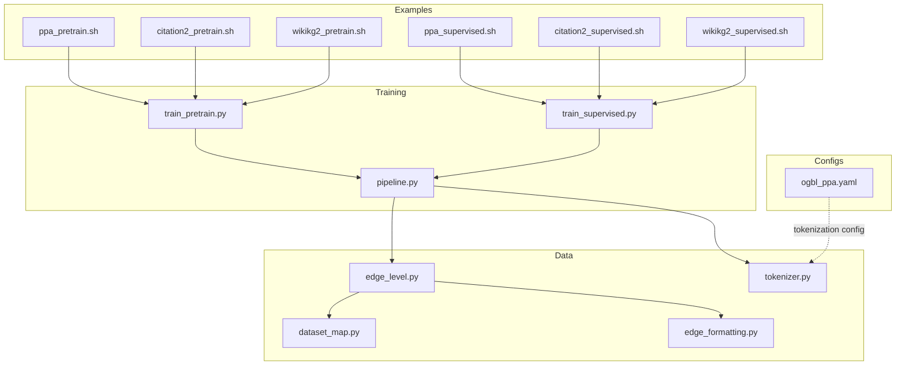
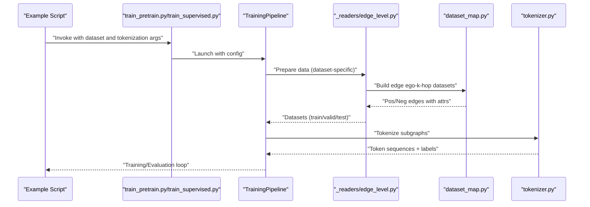
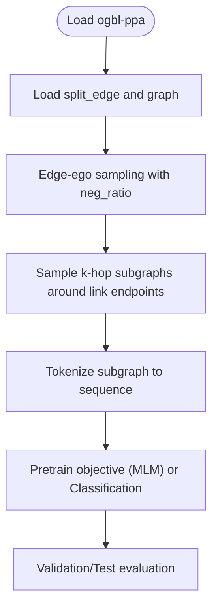
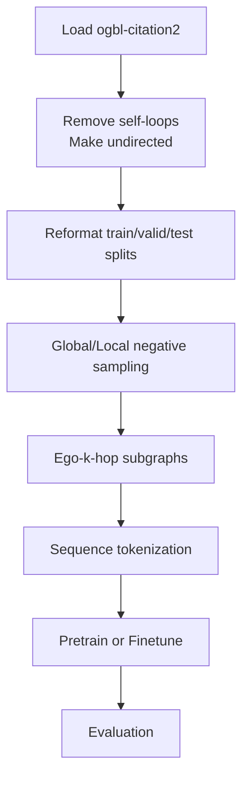
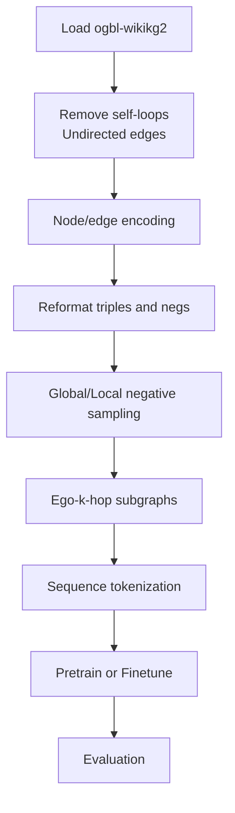
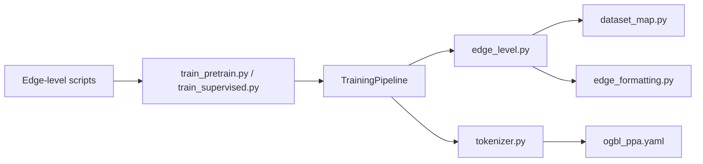

# Edge-Level Examples

<cite>
**Referenced Files in This Document**
- [ppa_pretrain.sh](file://examples/edge_lvl/ppa_pretrain.sh)
- [ppa_supervised.sh](file://examples/edge_lvl/ppa_supervised.sh)
- [citation2_pretrain.sh](file://examples/edge_lvl/citation2_pretrain.sh)
- [citation2_supervised.sh](file://examples/edge_lvl/citation2_supervised.sh)
- [wikikg2_pretrain.sh](file://examples/edge_lvl/wikikg2_pretrain.sh)
- [wikikg2_supervised.sh](file://examples/edge_lvl/wikikg2_supervised.sh)
- [ogbl_ppa.yaml](file://configs/tokenization/edge_lvl/ogbl_ppa.yaml)
- [edge_level.py](file://src/data/_readers/edge_level.py)
- [edge_formatting.py](file://src/data/_helpers/edge_formatting.py)
- [dataset_map.py](file://src/data/dataset_map.py)
- [tokenizer.py](file://src/data/tokenizer.py)
- [pipeline.py](file://src/training/pipeline.py)
- [train_pretrain.py](file://examples/train_pretrain.py)
- [train_supervised.py](file://examples/train_supervised.py)
</cite>

## Table of Contents
1. [Introduction](#introduction)
2. [Project Structure](#project-structure)
3. [Core Components](#core-components)
4. [Architecture Overview](#architecture-overview)
5. [Detailed Component Analysis](#detailed-component-analysis)
6. [Dependency Analysis](#dependency-analysis)
7. [Performance Considerations](#performance-considerations)
8. [Troubleshooting Guide](#troubleshooting-guide)
9. [Conclusion](#conclusion)
10. [Appendices](#appendices)

## Introduction
This document explains edge-level task examples for protein-protein interaction (PPA), Citation-CNN link prediction, and WikiKG2 knowledge graph completion. It focuses on the unique aspects of edge-centric graph learning, including edge-centric tokenization strategies, negative sampling approaches, and evaluation protocols. It also documents script configurations for each dataset, parameter tuning for link prediction tasks, performance optimization techniques, and guidance for implementing custom edge-level tasks, including data format requirements and evaluation metric calculations.

## Project Structure
The repository organizes edge-level examples under examples/edge_lvl with dataset-specific scripts and YAML tokenization configs under configs/tokenization/edge_lvl. The training pipeline is unified via examples/train_pretrain.py and examples/train_supervised.py, which delegate to a shared TrainingPipeline and dataset readers for edge-level tasks.

**Diagram sources**
- [ppa_pretrain.sh:1-287](file://examples/edge_lvl/ppa_pretrain.sh#L1-L287)
- [ppa_supervised.sh:1-306](file://examples/edge_lvl/ppa_supervised.sh#L1-L306)
- [citation2_pretrain.sh:1-201](file://examples/edge_lvl/citation2_pretrain.sh#L1-L201)
- [citation2_supervised.sh:1-230](file://examples/edge_lvl/citation2_supervised.sh#L1-L230)
- [wikikg2_pretrain.sh:1-198](file://examples/edge_lvl/wikikg2_pretrain.sh#L1-L198)
- [wikikg2_supervised.sh:1-229](file://examples/edge_lvl/wikikg2_supervised.sh#L1-L229)
- [ogbl_ppa.yaml:1-123](file://configs/tokenization/edge_lvl/ogbl_ppa.yaml#L1-L123)
- [train_pretrain.py:1-19](file://examples/train_pretrain.py#L1-L19)
- [train_supervised.py:1-19](file://examples/train_supervised.py#L1-L19)
- [pipeline.py:1-258](file://src/training/pipeline.py#L1-L258)
- [edge_level.py:1-381](file://src/data/_readers/edge_level.py#L1-L381)
- [dataset_map.py:1-800](file://src/data/dataset_map.py#L1-L800)
- [edge_formatting.py:1-83](file://src/data/_helpers/edge_formatting.py#L1-L83)
- [tokenizer.py:1-800](file://src/data/tokenizer.py#L1-L800)

**Section sources**
- [ppa_pretrain.sh:1-287](file://examples/edge_lvl/ppa_pretrain.sh#L1-L287)
- [ppa_supervised.sh:1-306](file://examples/edge_lvl/ppa_supervised.sh#L1-L306)
- [citation2_pretrain.sh:1-201](file://examples/edge_lvl/citation2_pretrain.sh#L1-L201)
- [citation2_supervised.sh:1-230](file://examples/edge_lvl/citation2_supervised.sh#L1-L230)
- [wikikg2_pretrain.sh:1-198](file://examples/edge_lvl/wikikg2_pretrain.sh#L1-L198)
- [wikikg2_supervised.sh:1-229](file://examples/edge_lvl/wikikg2_supervised.sh#L1-L229)
- [ogbl_ppa.yaml:1-123](file://configs/tokenization/edge_lvl/ogbl_ppa.yaml#L1-L123)
- [train_pretrain.py:1-19](file://examples/train_pretrain.py#L1-L19)
- [train_supervised.py:1-19](file://examples/train_supervised.py#L1-L19)
- [pipeline.py:1-258](file://src/training/pipeline.py#L1-L258)

## Core Components
- Edge-level tokenization and preprocessing:
  - Tokenizer supports edge-centric representation with structure tokens for nodes, edges, and graph summaries, and semantic tokens for attributes. It builds Eulerian sequences from subgraphs and decorates them with structure and semantics, producing input_ids, labels, and attention masks.
- Negative sampling strategies:
  - Global vs local negative sampling for link prediction. Global sampling draws negatives uniformly from the graph; local sampling fixes either head/relation or tail/relation or edge type to sample the remaining component.
- Dataset readers and mapping:
  - Readers for PPA, Citation2, and WikiKG2 handle dataset-specific preprocessing, normalization, and reformatted splits. They integrate with dataset mapping classes that sample ego-k-hop subgraphs around link endpoints for edge-level tasks.
- Training pipeline:
  - Unified pipeline orchestrates configuration extraction, distributed setup, data preparation, model creation, optimizer setup, checkpoint loading/resume, and training loop execution.

Key implementation references:
- Tokenization and structure/semantic mapping: [tokenizer.py:30-620](file://src/data/tokenizer.py#L30-L620)
- Negative sampling helpers: [dataset_map.py:600-800](file://src/data/dataset_map.py#L600-L800)
- Dataset readers: [edge_level.py:27-381](file://src/data/_readers/edge_level.py#L27-L381)
- Dataset mapping for edges: [dataset_map.py:271-554](file://src/data/dataset_map.py#L271-L554)
- Pipeline orchestration: [pipeline.py:60-96](file://src/training/pipeline.py#L60-L96)

**Section sources**
- [tokenizer.py:30-620](file://src/data/tokenizer.py#L30-L620)
- [dataset_map.py:600-800](file://src/data/dataset_map.py#L600-L800)
- [edge_level.py:27-381](file://src/data/_readers/edge_level.py#L27-L381)
- [dataset_map.py:271-554](file://src/data/dataset_map.py#L271-L554)
- [pipeline.py:60-96](file://src/training/pipeline.py#L60-L96)

## Architecture Overview
The edge-level training architecture integrates dataset-specific readers, negative sampling, tokenization, and a unified training pipeline.

**Diagram sources**
- [train_pretrain.py:1-19](file://examples/train_pretrain.py#L1-L19)
- [train_supervised.py:1-19](file://examples/train_supervised.py#L1-L19)
- [pipeline.py:60-96](file://src/training/pipeline.py#L60-L96)
- [edge_level.py:27-381](file://src/data/_readers/edge_level.py#L27-L381)
- [dataset_map.py:271-554](file://src/data/dataset_map.py#L271-L554)
- [tokenizer.py:425-612](file://src/data/tokenizer.py#L425-L612)

## Detailed Component Analysis

### Protein-Protein Interaction (PPA)
- Dataset characteristics:
  - OGB link prediction dataset with protein-protein interactions. The reader loads the raw dataset, constructs a graph, and prepares train/validation/test splits for link prediction.
- Tokenization and sampling:
  - Uses edge_ego sampling with configurable depth/neighbors and negative ratio. The YAML config sets global sampling for pretraining and controls percent of positives used.
- Training scripts:
  - Pretraining script configures model size, schedule, and optimization for masked language modeling objective.
  - Supervised script configures classification objective and evaluation cadence.

**Diagram sources**
- [edge_level.py:27-92](file://src/data/_readers/edge_level.py#L27-L92)
- [dataset_map.py:271-554](file://src/data/dataset_map.py#L271-L554)
- [tokenizer.py:425-612](file://src/data/tokenizer.py#L425-L612)

**Section sources**
- [edge_level.py:27-92](file://src/data/_readers/edge_level.py#L27-L92)
- [ogbl_ppa.yaml:11-22](file://configs/tokenization/edge_lvl/ogbl_ppa.yaml#L11-L22)
- [ppa_pretrain.sh:1-100](file://examples/edge_lvl/ppa_pretrain.sh#L1-L100)
- [ppa_supervised.sh:1-100](file://examples/edge_lvl/ppa_supervised.sh#L1-L100)

### Citation-CNN Link Prediction
- Dataset characteristics:
  - OGB citation link prediction with year-encoded node features and undirected edges. The reader removes self-loops, makes edges undirected, and reformats train/validation/test splits.
- Tokenization and sampling:
  - Supports global/local sampling modes for negative edges. The reader reformats targets and negative candidates for evaluation.
- Training scripts:
  - Pretraining script demonstrates bf16 settings and gated stacking features.
  - Supervised script configures warmup, optimizer, and evaluation settings.

**Diagram sources**
- [edge_level.py:94-208](file://src/data/_readers/edge_level.py#L94-L208)
- [edge_formatting.py:33-51](file://src/data/_helpers/edge_formatting.py#L33-L51)
- [dataset_map.py:600-744](file://src/data/dataset_map.py#L600-L744)
- [tokenizer.py:425-612](file://src/data/tokenizer.py#L425-L612)

**Section sources**
- [edge_level.py:94-208](file://src/data/_readers/edge_level.py#L94-L208)
- [edge_formatting.py:33-51](file://src/data/_helpers/edge_formatting.py#L33-L51)
- [citation2_pretrain.sh:1-120](file://examples/edge_lvl/citation2_pretrain.sh#L1-L120)
- [citation2_supervised.sh:1-120](file://examples/edge_lvl/citation2_supervised.sh#L1-L120)

### WikiKG2 Knowledge Graph Completion
- Dataset characteristics:
  - OGB Wikidata-based knowledge graph with relations. The reader removes self-loops, makes edges undirected, and handles relation types.
- Tokenization and sampling:
  - Supports global/local negative sampling strategies. The reader reformats triples and negative candidates for evaluation.
- Training scripts:
  - Pretraining script demonstrates gelu activation and gated stacking.
  - Supervised script configures task ratios and evaluation settings.

**Diagram sources**
- [edge_level.py:210-314](file://src/data/_readers/edge_level.py#L210-L314)
- [edge_formatting.py:54-83](file://src/data/_helpers/edge_formatting.py#L54-L83)
- [dataset_map.py:600-793](file://src/data/dataset_map.py#L600-L793)
- [tokenizer.py:425-612](file://src/data/tokenizer.py#L425-L612)

**Section sources**
- [edge_level.py:210-314](file://src/data/_readers/edge_level.py#L210-L314)
- [edge_formatting.py:54-83](file://src/data/_helpers/edge_formatting.py#L54-L83)
- [wikikg2_pretrain.sh:1-120](file://examples/edge_lvl/wikikg2_pretrain.sh#L1-L120)
- [wikikg2_supervised.sh:1-120](file://examples/edge_lvl/wikikg2_supervised.sh#L1-L120)

## Dependency Analysis
The edge-level training pipeline depends on:
- Example scripts to supply dataset and tokenization configuration.
- Unified training pipeline to manage distributed training, checkpointing, and logging.
- Dataset readers to fetch and preprocess data.
- Dataset mapping to sample subgraphs and negatives.
- Tokenizer to convert subgraphs into token sequences.

**Diagram sources**
- [ppa_pretrain.sh:234-283](file://examples/edge_lvl/ppa_pretrain.sh#L234-L283)
- [ppa_supervised.sh:247-302](file://examples/edge_lvl/ppa_supervised.sh#L247-L302)
- [citation2_pretrain.sh:156-197](file://examples/edge_lvl/citation2_pretrain.sh#L156-L197)
- [citation2_supervised.sh:175-226](file://examples/edge_lvl/citation2_supervised.sh#L175-L226)
- [wikikg2_pretrain.sh:153-194](file://examples/edge_lvl/wikikg2_pretrain.sh#L153-L194)
- [wikikg2_supervised.sh:174-225](file://examples/edge_lvl/wikikg2_supervised.sh#L174-L225)
- [train_pretrain.py:1-19](file://examples/train_pretrain.py#L1-L19)
- [train_supervised.py:1-19](file://examples/train_supervised.py#L1-L19)
- [pipeline.py:60-96](file://src/training/pipeline.py#L60-L96)
- [edge_level.py:27-381](file://src/data/_readers/edge_level.py#L27-L381)
- [dataset_map.py:271-554](file://src/data/dataset_map.py#L271-L554)
- [edge_formatting.py:1-83](file://src/data/_helpers/edge_formatting.py#L1-L83)
- [tokenizer.py:30-620](file://src/data/tokenizer.py#L30-L620)
- [ogbl_ppa.yaml:1-123](file://configs/tokenization/edge_lvl/ogbl_ppa.yaml#L1-L123)

**Section sources**
- [pipeline.py:60-96](file://src/training/pipeline.py#L60-L96)
- [edge_level.py:27-381](file://src/data/_readers/edge_level.py#L27-L381)
- [dataset_map.py:271-554](file://src/data/dataset_map.py#L271-L554)
- [tokenizer.py:30-620](file://src/data/tokenizer.py#L30-L620)

## Performance Considerations
- Distributed training:
  - Scripts support DeepSpeed and native DDP. Use appropriate ds_config files and adjust world size and ranks.
- Batch sizing and packing:
  - Increase effective batch size by packing token sequences when applicable; ensure attention masks and positional encodings remain valid.
- Mixed precision:
  - Use bf16 where supported to reduce memory footprint and improve throughput.
- Negative sampling:
  - Prefer global sampling for large graphs to avoid bias; switch to local sampling for relational tasks to respect head/tail/edge constraints.
- Evaluation cadence:
  - Tune epoch_per_eval and k_samplers to balance accuracy and speed during supervised finetuning.

[No sources needed since this section provides general guidance]

## Troubleshooting Guide
- Isolated nodes and zero edges:
  - Some datasets may have isolated nodes. The Citation2/WikiKG2 readers detect and set allow_zero_edges to handle subgraphs with no connecting edges.
- Validation/test indexing:
  - Fixed sampling indices are used for reproducible evaluation subsets; ensure true_valid settings match desired subset sizes.
- Checkpoint resume:
  - The pipeline checks for existing logs and resumes from checkpoints when pretrain_cpt equals output_dir and resume is allowed.

**Section sources**
- [edge_level.py:126-133](file://src/data/_readers/edge_level.py#L126-L133)
- [edge_level.py:160-163](file://src/data/_readers/edge_level.py#L160-L163)
- [edge_level.py:272-276](file://src/data/_readers/edge_level.py#L272-L276)
- [pipeline.py:179-202](file://src/training/pipeline.py#L179-L202)

## Conclusion
Edge-level examples demonstrate robust tokenization, negative sampling, and evaluation protocols tailored for link prediction and knowledge graph completion. The unified training pipeline and dataset readers enable efficient pretraining and supervised finetuning across PPA, Citation-CNN, and WikiKG2. Proper configuration of sampling strategies, model sizes, and evaluation schedules yields strong performance on these tasks.

[No sources needed since this section summarizes without analyzing specific files]

## Appendices

### Edge-Centric Tokenization Strategies
- Structure tokens:
  - Node, edge, and graph-level tokens encode topological and summarization semantics.
- Semantic tokens:
  - Discrete and continuous node/edge attributes are encoded with world identifiers and column indices.
- Positional encoding:
  - Cyclic or cumulative position IDs depending on configuration.

**Section sources**
- [tokenizer.py:90-140](file://src/data/tokenizer.py#L90-L140)
- [tokenizer.py:639-685](file://src/data/tokenizer.py#L639-L685)

### Negative Sampling Approaches
- Global sampling:
  - Uniformly sample negative edges from the graph using negative_sampling.
- Local sampling:
  - Fix head/relation or tail/relation or edge type and sample the remaining component(s).
- Relation-aware negatives:
  - WikiKG2 supports relation-type aware negative attributes.

**Section sources**
- [dataset_map.py:600-625](file://src/data/dataset_map.py#L600-L625)
- [dataset_map.py:627-744](file://src/data/dataset_map.py#L627-L744)
- [dataset_map.py:746-793](file://src/data/dataset_map.py#L746-L793)

### Evaluation Protocols
- Metrics:
  - Single-label classification for binary link prediction tasks.
- Evaluation settings:
  - Supervised scripts configure eval_only, save_pred, and true_valid to control evaluation scope and output.

**Section sources**
- [ppa_supervised.sh:70-77](file://examples/edge_lvl/ppa_supervised.sh#L70-L77)
- [citation2_supervised.sh:60-67](file://examples/edge_lvl/citation2_supervised.sh#L60-L67)
- [wikikg2_supervised.sh:59-66](file://examples/edge_lvl/wikikg2_supervised.sh#L59-L66)

### Implementing Custom Edge-Level Tasks
- Data format requirements:
  - Provide dataset-specific reader and mapping logic. Ensure split_edge structure and edge attributes are prepared for positive/negative sampling.
- Tokenization configuration:
  - Configure tokenizer_class, data_dir, dataset, and sampling parameters in YAML or script args.
- Evaluation metrics:
  - Define problem_type and num_labels for classification tasks; adjust task_ratio and loss_type accordingly.

**Section sources**
- [edge_level.py:375-381](file://src/data/_readers/edge_level.py#L375-L381)
- [ogbl_ppa.yaml:1-123](file://configs/tokenization/edge_lvl/ogbl_ppa.yaml#L1-L123)
- [ppa_supervised.sh:70-77](file://examples/edge_lvl/ppa_supervised.sh#L70-L77)
