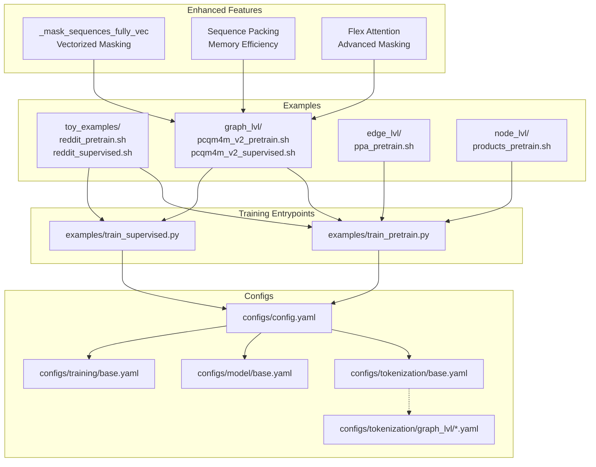
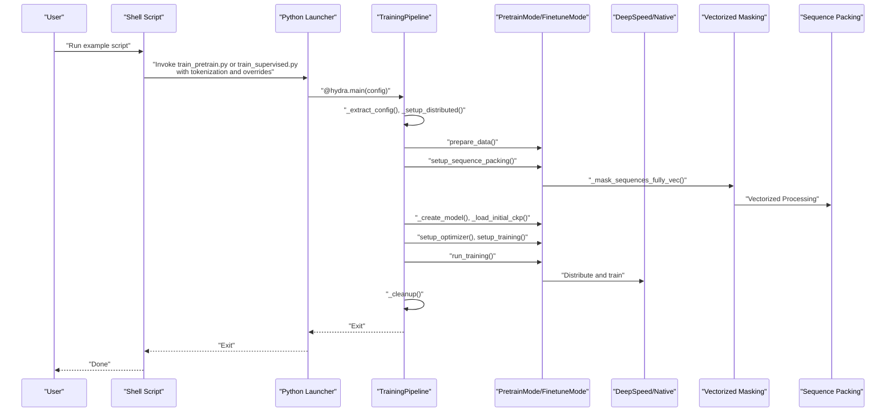
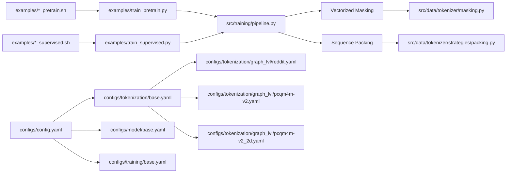

# Example Scripts

<cite>
**Referenced Files in This Document**
- [examples/README.md](file://examples/README.md)
- [examples/train_pretrain.py](file://examples/train_pretrain.py)
- [examples/train_supervised.py](file://examples/train_supervised.py)
- [examples/toy_examples/reddit_pretrain.sh](file://examples/toy_examples/reddit_pretrain.sh)
- [examples/toy_examples/reddit_supervised.sh](file://examples/toy_examples/reddit_supervised.sh)
- [examples/graph_lvl/pcqm4m_v2_pretrain.sh](file://examples/graph_lvl/pcqm4m_v2_pretrain.sh)
- [examples/graph_lvl/pcqm4m_v2_supervised.sh](file://examples/graph_lvl/pcqm4m_v2_supervised.sh)
- [examples/edge_lvl/ppa_pretrain.sh](file://examples/edge_lvl/ppa_pretrain.sh)
- [examples/node_lvl/products_pretrain.sh](file://examples/node_lvl/products_pretrain.sh)
- [configs/config.yaml](file://configs/config.yaml)
- [configs/tokenization/base.yaml](file://configs/tokenization/base.yaml)
- [configs/tokenization/graph_lvl/reddit.yaml](file://configs/tokenization/graph_lvl/reddit.yaml)
- [configs/tokenization/graph_lvl/pcqm4m-v2.yaml](file://configs/tokenization/graph_lvl/pcqm4m-v2.yaml)
- [configs/tokenization/graph_lvl/pcqm4m-v2_2d.yaml](file://configs/tokenization/graph_lvl/pcqm4m-v2_2d.yaml)
- [configs/model/base.yaml](file://configs/model/base.yaml)
- [configs/training/base.yaml](file://configs/training/base.yaml)
- [src/training/pipeline.py](file://src/training/pipeline.py)
- [src/utils/flex_attn_utils.py](file://src/utils/flex_attn_utils.py)
- [src/models/graphgpt/modeling_helpers.py](file://src/models/graphgpt/modeling_helpers.py)
- [src/utils/misc_utils.py](file://src/utils/misc_utils.py)
- [src/training/pretrain_mode.py](file://src/training/pretrain_mode.py)
- [src/data/tokenizer/masking.py](file://src/data/tokenizer/masking.py)
- [src/data/tokenizer/strategies/task_prep/pretrain.py](file://src/data/tokenizer/strategies/task_prep/pretrain.py)
- [src/data/tokenizer/strategies/packing.py](file://src/data/tokenizer/strategies/packing.py)
- [src/data/tokenizer/core.py](file://src/data/tokenizer/core.py)
</cite>

## Update Summary
**Changes Made**
- Updated PCQM4M-v2 pretraining script documentation to reflect enhanced vectorized masking capabilities with fully vectorized sequence processing
- Added detailed explanation of the new `_mask_sequences_fully_vec` function and its numpy-based implementation
- Documented the integration of sequence packing with vectorized masking for improved memory efficiency
- Enhanced documentation of packed token sequence processing with automatic batch size adjustment
- Added comprehensive coverage of the new vectorized masking algorithms and their performance benefits

## Table of Contents
1. [Introduction](#introduction)
2. [Project Structure](#project-structure)
3. [Core Components](#core-components)
4. [Architecture Overview](#architecture-overview)
5. [Detailed Component Analysis](#detailed-component-analysis)
6. [Dependency Analysis](#dependency-analysis)
7. [Performance Considerations](#performance-considerations)
8. [Troubleshooting Guide](#troubleshooting-guide)
9. [Conclusion](#conclusion)
10. [Appendices](#appendices)

## Introduction
This document explains the example scripts for Graph-GPT across pre-training and fine-tuning modes, covering graph-level, edge-level, and node-level tasks. It provides a quick-start walkthrough using the Reddit toy example, details for PCQM4M-v2 molecular property prediction, and guidance for PPA protein-protein interaction and other benchmarks. It also documents parameter meanings, configuration modifications, execution workflows, adaptation to custom datasets, and best practices for large-scale runs and monitoring.

**Updated** Recent enhancements include vectorized masking capabilities for improved performance and packed token sequence processing for memory efficiency in large-scale molecular property prediction tasks.

## Project Structure
The example scripts are organized by task level and dataset:
- Toy examples: Reddit threads for quick start (graph-level)
- Graph-level examples: PCQM4M-v2 molecular property prediction with enhanced vectorized masking
- Edge-level examples: PPA protein-protein interaction
- Node-level examples: OGBN Products
- Core training entry points: unified Python scripts that accept Hydra-style configuration overrides
- Configuration hierarchy: tokenization, model, training, generation, and base defaults

**Diagram sources**
- [examples/toy_examples/reddit_pretrain.sh:1-257](file://examples/toy_examples/reddit_pretrain.sh#L1-L257)
- [examples/toy_examples/reddit_supervised.sh:1-300](file://examples/toy_examples/reddit_supervised.sh#L1-L300)
- [examples/graph_lvl/pcqm4m_v2_pretrain.sh:1-321](file://examples/graph_lvl/pcqm4m_v2_pretrain.sh#L1-L321)
- [examples/graph_lvl/pcqm4m_v2_supervised.sh:1-300](file://examples/graph_lvl/pcqm4m_v2_supervised.sh#L1-L300)
- [examples/edge_lvl/ppa_pretrain.sh:1-287](file://examples/edge_lvl/ppa_pretrain.sh#L1-L287)
- [examples/node_lvl/products_pretrain.sh:1-201](file://examples/node_lvl/products_pretrain.sh#L1-L201)
- [examples/train_pretrain.py:1-19](file://examples/train_pretrain.py#L1-L19)
- [examples/train_supervised.py:1-19](file://examples/train_supervised.py#L1-L19)
- [configs/config.yaml:1-20](file://configs/config.yaml#L1-L20)
- [configs/tokenization/base.yaml:1-117](file://configs/tokenization/base.yaml#L1-L117)
- [configs/tokenization/graph_lvl/reddit.yaml:1-121](file://configs/tokenization/graph_lvl/reddit.yaml#L1-L121)
- [configs/tokenization/graph_lvl/pcqm4m-v2.yaml:1-114](file://configs/tokenization/graph_lvl/pcqm4m-v2.yaml#L1-L114)
- [configs/tokenization/graph_lvl/pcqm4m-v2_2d.yaml:1-114](file://configs/tokenization/graph_lvl/pcqm4m-v2_2d.yaml#L1-L114)
- [configs/model/base.yaml:1-222](file://configs/model/base.yaml#L1-L222)
- [configs/training/base.yaml:1-76](file://configs/training/base.yaml#L1-L76)

**Section sources**
- [examples/README.md:1-29](file://examples/README.md#L1-L29)
- [examples/train_pretrain.py:1-19](file://examples/train_pretrain.py#L1-L19)
- [examples/train_supervised.py:1-19](file://examples/train_supervised.py#L1-L19)
- [configs/config.yaml:1-20](file://configs/config.yaml#L1-L20)

## Core Components
- Unified training entry points:
  - Pre-training launcher: [examples/train_pretrain.py:1-19](file://examples/train_pretrain.py#L1-L19)
  - Supervised/fine-tuning launcher: [examples/train_supervised.py:1-19](file://examples/train_supervised.py#L1-L19)
- Training pipeline orchestration:
  - [src/training/pipeline.py:60-96](file://src/training/pipeline.py#L60-L96) defines the shared lifecycle: extract config → setup distributed → prepare data/tokenizer → create model → load checkpoint → setup optimizer/scheduler → training loop → cleanup
- Configuration system:
  - Defaults and groups: [configs/config.yaml:2-8](file://configs/config.yaml#L2-L8)
  - Tokenization base: [configs/tokenization/base.yaml:1-117](file://configs/tokenization/base.yaml#L1-L117)
  - Model base: [configs/model/base.yaml:1-222](file://configs/model/base.yaml#L1-L222)
  - Training base: [configs/training/base.yaml:1-76](file://configs/training/base.yaml#L1-L76)
  - Dataset-specific tokenization configs:
    - Reddit graph-level: [configs/tokenization/graph_lvl/reddit.yaml:1-121](file://configs/tokenization/graph_lvl/reddit.yaml#L1-L121)
    - PCQM4M-v2 graph-level: [configs/tokenization/graph_lvl/pcqm4m-v2.yaml:1-114](file://configs/tokenization/graph_lvl/pcqm4m-v2.yaml#L1-L114)
    - PCQM4M-v2 2D graph-level: [configs/tokenization/graph_lvl/pcqm4m-v2_2d.yaml:1-114](file://configs/tokenization/graph_lvl/pcqm4m-v2_2d.yaml#L1-L114)

Key runtime parameters exposed by example scripts:
- Data and tokenizer: dataset selection, tokenizer class, tokenization config path
- Model: architecture family and sizing, stacking method, activation, positional embeddings, dropout, layer scale initialization, attention implementation
- Training: scheduling (tokens/epochs), optimizer hyperparameters, gradient clipping, EMA, logging/save frequency
- Fine-tuning specifics: task type, problem type, number of labels, loss/metric types, evaluation settings

**Section sources**
- [src/training/pipeline.py:60-96](file://src/training/pipeline.py#L60-L96)
- [configs/config.yaml:2-8](file://configs/config.yaml#L2-L8)
- [configs/tokenization/base.yaml:1-117](file://configs/tokenization/base.yaml#L1-L117)
- [configs/model/base.yaml:1-222](file://configs/model/base.yaml#L1-L222)
- [configs/training/base.yaml:1-76](file://configs/training/base.yaml#L1-L76)
- [configs/tokenization/graph_lvl/reddit.yaml:1-121](file://configs/tokenization/graph_lvl/reddit.yaml#L1-L121)
- [configs/tokenization/graph_lvl/pcqm4m-v2.yaml:1-114](file://configs/tokenization/graph_lvl/pcqm4m-v2.yaml#L1-L114)
- [configs/tokenization/graph_lvl/pcqm4m-v2_2d.yaml:1-114](file://configs/tokenization/graph_lvl/pcqm4m-v2_2d.yaml#L1-L114)

## Architecture Overview
The example scripts are thin wrappers around the unified training pipeline. They set up environment variables, model sizes, and task-specific parameters, then invoke the Python entry points with Hydra configuration overrides. The pipeline handles distributed setup, model creation, checkpoint loading/resuming, optimizer/scheduler setup, and the training loop.

**Diagram sources**
- [examples/train_pretrain.py:12-18](file://examples/train_pretrain.py#L12-L18)
- [examples/train_supervised.py:12-18](file://examples/train_supervised.py#L12-L18)
- [src/training/pipeline.py:60-96](file://src/training/pipeline.py#L60-L96)
- [src/training/pretrain_mode.py:165-198](file://src/training/pretrain_mode.py#L165-L198)
- [src/data/tokenizer/strategies/task_prep/pretrain.py:16-62](file://src/data/tokenizer/strategies/task_prep/pretrain.py#L16-L62)

## Detailed Component Analysis

### Reddit Toy Example (Quick Start)
Purpose: Minimal working example for graph-level pre-training and supervised fine-tuning on Reddit threads.

- Pre-training:
  - Script: [examples/toy_examples/reddit_pretrain.sh:1-257](file://examples/toy_examples/reddit_pretrain.sh#L1-L257)
  - Tokenization config: [configs/tokenization/graph_lvl/reddit.yaml:1-121](file://configs/tokenization/graph_lvl/reddit.yaml#L1-L121)
  - Execution: DeepSpeed via the pre-training launcher
  - Key parameters:
    - Data: dataset source, tokenizer class, vocabulary and structure tokens
    - Model: tiny/tiny6/mini/small sizing, stacking method, activation, positional embeddings
    - Training: total tokens, warmup tokens, logging/save intervals, dropout, EMA, optimizer settings
    - Generation: optional inference settings
- Supervised fine-tuning:
  - Script: [examples/toy_examples/reddit_supervised.sh:1-300](file://examples/toy_examples/reddit_supervised.sh#L1-L300)
  - Tokenization config: [configs/tokenization/graph_lvl/reddit.yaml:1-121](file://configs/tokenization/graph_lvl/reddit.yaml#L1-L121)
  - Execution: DeepSpeed or native DDP depending on configuration
  - Key parameters:
    - Data: dataset name, tokenizer class
    - Model: architecture sizing, stacking method, activation, causal attention toggle, positional embeddings
    - Training: epochs, warmup epochs, batch sizes, optimizer settings, EMA, evaluation settings
    - Task head: problem type, number of labels, loss/metric types

Execution workflow:
- Adjust model size and dataset in the script header
- Choose DeepSpeed or native DDP by toggling the DeepSpeed config path
- Run the script; it builds a command-line override string and invokes the launcher

Common parameter combinations:
- Tiny/tiny6 for quick experiments
- Short stacking with sum aggregation for speed
- Low learning rates for stability in early stages

Performance expectations:
- Fast iteration cycles suitable for experimentation
- Expect rapid convergence on downstream metrics for the Reddit task

Adapting to custom datasets:
- Replace dataset source/name and tokenizer class
- Point tokenization config to a dataset-specific YAML under tokenization/graph_lvl
- Tune batch size, learning rate, and schedule according to data size and hardware

**Section sources**
- [examples/toy_examples/reddit_pretrain.sh:1-257](file://examples/toy_examples/reddit_pretrain.sh#L1-L257)
- [examples/toy_examples/reddit_supervised.sh:1-300](file://examples/toy_examples/reddit_supervised.sh#L1-L300)
- [configs/tokenization/graph_lvl/reddit.yaml:1-121](file://configs/tokenization/graph_lvl/reddit.yaml#L1-L121)

### PCQM4M-v2 Molecular Property Prediction
Purpose: Graph-level pre-training and supervised fine-tuning for molecular property regression with enhanced vectorized masking capabilities.

**Updated** Recent changes include switching attention implementation from SDPA to flex_attention, adjusting validation settings by setting valid_percent to 0, adding proper arithmetic expansion syntax for bash calculations, and enhancing sequence length configuration with improved parameter naming. The most significant enhancement is the introduction of fully vectorized masking capabilities for improved performance.

- Pre-training:
  - Script: [examples/graph_lvl/pcqm4m_v2_pretrain.sh:1-321](file://examples/graph_lvl/pcqm4m_v2_pretrain.sh#L1-L321)
  - Tokenization config: [configs/tokenization/graph_lvl/pcqm4m-v2_2d.yaml:1-114](file://configs/tokenization/graph_lvl/pcqm4m-v2_2d.yaml#L1-L114)
  - Execution: DeepSpeed or CPU fallback
  - Key parameters:
    - Data: dataset source, tokenizer class, tokenization config path
    - Model: base-sized architecture, stacking method, positional embeddings, attention implementation
    - Training: total tokens, warmup tokens, saving/logging intervals, dropout, optimizer settings, EMA
    - Generation: optional inference settings
- Supervised fine-tuning:
  - Script: [examples/graph_lvl/pcqm4m_v2_supervised.sh:1-300](file://examples/graph_lvl/pcqm4m_v2_supervised.sh#L1-L300)
  - Tokenization config: [configs/tokenization/graph_lvl/pcqm4m-v2.yaml:1-114](file://configs/tokenization/graph_lvl/pcqm4m-v2.yaml#L1-L114)
  - Execution: DeepSpeed
  - Key parameters:
    - Data: dataset name, tokenizer class
    - Model: base-sized architecture, stacking method, activation, causal attention toggle, positional embeddings
    - Training: epochs, warmup epochs, batch sizes, optimizer settings, EMA, evaluation settings
    - Task head: regression problem type, single label, L1 loss

**Enhanced Vectorized Masking Capabilities:**
The PCQM4M-v2 pretraining script now features fully vectorized masking with the `_mask_sequences_fully_vec` function, which eliminates Python loops entirely and processes multiple sequences simultaneously using NumPy operations.

Key vectorized masking features:
- **Fully vectorized processing**: No Python loops - all operations performed using NumPy arrays
- **Batch processing**: Processes multiple sequences in parallel with vectorized mask ratio generation
- **Per-token precision**: Individual mask ratios computed per token position for variable-length sequences
- **Memory efficiency**: Optimized memory usage through vectorized operations
- **Performance improvement**: Significant speedup over traditional loop-based masking approaches

**Enhanced Sequence Length Configuration:**
The PCQM4M-v2 pretraining script now demonstrates the practical implications of the `max_length` parameter, showing how it's calculated as the product of `batch_size` and `token_per_sample`. This replaces the previous `max_position_embeddings` calculation and provides clearer guidance on sequence length configuration for packed token training.

Key sequence length configuration details:
- **max_length calculation**: `max_length=$((batch_size * token_per_sample))` when `pack_tokens` is enabled
- **Batch size adjustment**: When `pack_tokens` > 0, batch_size is automatically forced to 1 for variable-length packed sequences
- **Parameter distinction**: `max_length` controls packed sequence length, while `max_position_embeddings` controls sequence length for non-packed training
- **Practical implications**: This approach ensures optimal memory utilization and prevents sequence truncation in packed training scenarios

**Vectorized Masking Implementation Details:**
The new vectorized masking system includes several key components:

1. **_mask_sequences_fully_vec**: Main function that performs fully vectorized masking without Python loops
2. **_get_mask_ratio_batch**: Vectorized generation of mask ratios for multiple sequences
3. **_mask_input_ids_unified**: Unified vectorized masking for both 1D and 2D inputs
4. **Numpy-based operations**: All masking operations performed using NumPy arrays for optimal performance

**Attention Implementation Details:**
The script now uses flex_attention as the attention backend, which provides several advantages:
- Better support for packed sequences and variable-length tokens
- Improved memory efficiency for complex molecular graphs
- Enhanced flexibility in attention masking patterns
- Optimized performance on modern GPUs with proper compilation

**Sequence Packing Integration:**
The vectorized masking works seamlessly with sequence packing for memory-efficient training:
- Automatic batch size adjustment to 1 when pack_tokens > 0
- Dynamic sequence length calculation based on token_per_sample
- Optimized memory utilization through packed token processing

Validation Settings:
The validation percentage is set to 0, which disables validation during pre-training. This is appropriate for large-scale molecular property prediction where validation overhead would be significant.

Arithmetic Expansion Improvements:
The script now uses proper bash arithmetic expansion syntax (`$((...))`) for calculations, improving reliability and avoiding potential issues with shell interpretation.

Execution workflow:
- Select base-sized model for a balance of speed and capacity
- Configure DeepSpeed for multi-GPU training
- For supervised fine-tuning, optionally initialize from a pre-trained checkpoint

Common parameter combinations:
- Base model with gated stacking for improved expressiveness
- EMA enabled for better generalization
- L1 loss for regression targets

Performance expectations:
- Strong performance on molecular property benchmarks with sufficient pre-training tokens
- Fine-tuning converges within a few epochs for typical datasets

Adapting to custom datasets:
- Replace dataset source/name and tokenizer class
- Point tokenization config to a dataset-specific YAML under tokenization/graph_lvl
- Align schedule and batch size with dataset scale and hardware

**Section sources**
- [examples/graph_lvl/pcqm4m_v2_pretrain.sh:1-321](file://examples/graph_lvl/pcqm4m_v2_pretrain.sh#L1-L321)
- [examples/graph_lvl/pcqm4m_v2_supervised.sh:1-300](file://examples/graph_lvl/pcqm4m_v2_supervised.sh#L1-L300)
- [configs/tokenization/graph_lvl/pcqm4m-v2.yaml:1-114](file://configs/tokenization/graph_lvl/pcqm4m-v2.yaml#L1-L114)
- [configs/tokenization/graph_lvl/pcqm4m-v2_2d.yaml:1-114](file://configs/tokenization/graph_lvl/pcqm4m-v2_2d.yaml#L1-L114)
- [src/utils/flex_attn_utils.py:1-289](file://src/utils/flex_attn_utils.py#L1-L289)
- [src/models/graphgpt/modeling_helpers.py:59-173](file://src/models/graphgpt/modeling_helpers.py#L59-L173)
- [src/utils/misc_utils.py:349-378](file://src/utils/misc_utils.py#L349-L378)
- [src/training/pretrain_mode.py:170-198](file://src/training/pretrain_mode.py#L170-L198)
- [src/data/tokenizer/masking.py:51-149](file://src/data/tokenizer/masking.py#L51-L149)
- [src/data/tokenizer/strategies/task_prep/pretrain.py:16-62](file://src/data/tokenizer/strategies/task_prep/pretrain.py#L16-L62)

### PPA Protein-Protein Interaction (Edge-Level)
Purpose: Edge-level pre-training on protein-protein interaction edges.

- Pre-training:
  - Script: [examples/edge_lvl/ppa_pretrain.sh:1-287](file://examples/edge_lvl/ppa_pretrain.sh#L1-L287)
  - Tokenization config: [configs/tokenization/edge_lvl/ogbl_ppa.yaml](file://configs/tokenization/edge_lvl/ogbl_ppa.yaml)
  - Execution: DeepSpeed
  - Key parameters:
    - Data: dataset source, tokenizer class, tokenization config path
    - Model: mini-sized architecture, stacking method, positional embeddings
    - Training: total tokens, warmup tokens, saving/logging intervals, dropout, optimizer settings, EMA
    - Generation: optional inference settings

Execution workflow:
- Use mini-sized model for memory efficiency on large graphs
- Configure DeepSpeed for multi-GPU training
- Monitor validation split carefully due to sparse supervision

Common parameter combinations:
- Mini model with sum stacking for speed
- EMA disabled or enabled depending on stability needs

Performance expectations:
- Convergence slower than graph-level tasks due to sparsity
- Benefit from pre-training on related tasks

Adapting to custom datasets:
- Replace dataset source and tokenizer class
- Point tokenization config to a dataset-specific YAML under tokenization/edge_lvl
- Adjust schedule and batch size for dataset scale

**Section sources**
- [examples/edge_lvl/ppa_pretrain.sh:1-287](file://examples/edge_lvl/ppa_pretrain.sh#L1-L287)

### OGBN Products (Node-Level)
Purpose: Node-level pre-training on OGBN Products node classification.

- Pre-training:
  - Script: [examples/node_lvl/products_pretrain.sh:1-201](file://examples/node_lvl/products_pretrain.sh#L1-L201)
  - Tokenization config: [examples/node_lvl/ogbn_products_tokenization_config.json](file://examples/node_lvl/ogbn_products_tokenization_config.json)
  - Execution: DeepSpeed
  - Key parameters:
    - Data: dataset name, tokenizer class, tokenization config path, sampling configuration
    - Model: mini-sized architecture, stacking method, activation, positional embeddings
    - Training: total tokens, warmup tokens, saving/logging intervals, dropout, optimizer settings, EMA
    - Generation: optional inference settings

Execution workflow:
- Use node-level tokenization configuration JSON
- Configure DeepSpeed for multi-GPU training
- Tune batch size and packing based on memory constraints

Common parameter combinations:
- Mini model with short stacking for speed
- Linear/uniform masking ratios for stable training

Performance expectations:
- Benefits from pre-training on large-scale node classification tasks
- Requires careful schedule tuning for large graphs

Adapting to custom datasets:
- Replace dataset name and tokenizer class
- Provide a dataset-specific tokenization configuration JSON
- Adjust schedule and batch size for dataset scale

**Section sources**
- [examples/node_lvl/products_pretrain.sh:1-201](file://examples/node_lvl/products_pretrain.sh#L1-L201)

### Parameter Reference and Configuration Modifications
- Data and tokenizer:
  - dataset_source/dataset_name: dataset identifier
  - tokenizer_class: tokenizer implementation
  - token_cfg_dir/token_cfg_file or tokenization_config: path to tokenization YAML/JSON
- Model:
  - model_name: architecture family and sizing (tiny, mini, small, medium, base, base24, base48, large, large48, xlarge, xlarge48, xxlarge)
  - stack_method: short|long|prolonged
  - stacked_feat_agg_method: sum|gated
  - hidden_act: activation function
  - max_position_embeddings: sequence length for non-packed training
  - dropout settings: attention_dropout, path_dropout, embed_dropout, mlp_dropout
  - layer_scale_init_value: layer scaling initialization
  - attn_implementation: attention backend (sdpa|flex_attention)
- Training:
  - total_tokens/warmup_tokens: pre-training schedule
  - epochs/warmup_epochs: supervised schedule
  - batch_size/batch_size_eval: training and evaluation batch sizes
  - optimizer: lr, weight_decay, eps, betas, max_grad_norm, use_ema, ema_decay
  - schedule: logging_steps, samples_per_saving
  - valid_percent/do_generation/do_infer: evaluation and generation toggles
  - pack_tokens: token packing ratio for packed sequence training
  - max_length: maximum sequence length (calculated as batch_size × token_per_sample for packed training)
- Fine-tuning:
  - task_level: graph|edge|node
  - problem_type: single_label_classification|multi_label_classification|regression
  - num_labels: number of classes or 1 for regression
  - loss_type: loss function choice
  - ft_eval: save_pred, save_hidden_states, epoch_per_eval, k_samplers, true_valid

**Enhanced Parameter Naming and Sequence Length Configuration:**
The PCQM4M-v2 pretraining script demonstrates improved parameter naming conventions:
- `max_length` parameter now explicitly shows its calculation as `batch_size × token_per_sample` for packed training
- Clear distinction between `max_length` (packed sequence length) and `max_position_embeddings` (non-packed sequence length)
- Automatic batch size adjustment when `pack_tokens` > 0 to ensure optimal memory utilization

**Vectorized Masking Configuration:**
The new vectorized masking system introduces several configuration parameters:
- `pack_tokens`: enables sequence packing for memory efficiency
- `token_per_sample`: determines tokens per sequence for packed training
- `max_length`: calculated as `batch_size × token_per_sample` for packed sequences
- Vectorized masking functions: `_mask_sequences_fully_vec`, `_get_mask_ratio_batch`, `_mask_input_ids_unified`

Configuration modification tips:
- Use model_name aliases to quickly switch sizes; the scripts compute hidden_size and num_hidden_layers accordingly
- For supervised tasks, align task_level with tokenization task_type and dataset semantics
- For generation tasks, enable do_generation and select a generation algorithm
- Attention implementation can be switched between SDPA and flex_attention based on requirements
- For packed token training, configure `pack_tokens` > 0 and let the script automatically calculate `max_length`
- Vectorized masking is automatically enabled when using the enhanced PCQM4M-v2 configuration

**Section sources**
- [examples/toy_examples/reddit_pretrain.sh:1-257](file://examples/toy_examples/reddit_pretrain.sh#L1-L257)
- [examples/toy_examples/reddit_supervised.sh:1-300](file://examples/toy_examples/reddit_supervised.sh#L1-L300)
- [examples/graph_lvl/pcqm4m_v2_pretrain.sh:1-321](file://examples/graph_lvl/pcqm4m_v2_pretrain.sh#L1-L321)
- [examples/graph_lvl/pcqm4m_v2_supervised.sh:1-300](file://examples/graph_lvl/pcqm4m_v2_supervised.sh#L1-L300)
- [examples/edge_lvl/ppa_pretrain.sh:1-287](file://examples/edge_lvl/ppa_pretrain.sh#L1-L287)
- [examples/node_lvl/products_pretrain.sh:1-201](file://examples/node_lvl/products_pretrain.sh#L1-L201)
- [configs/tokenization/graph_lvl/reddit.yaml:1-121](file://configs/tokenization/graph_lvl/reddit.yaml#L1-L121)
- [configs/tokenization/graph_lvl/pcqm4m-v2.yaml:1-114](file://configs/tokenization/graph_lvl/pcqm4m-v2.yaml#L1-L114)
- [configs/tokenization/graph_lvl/pcqm4m-v2_2d.yaml:1-114](file://configs/tokenization/graph_lvl/pcqm4m-v2_2d.yaml#L1-L114)
- [configs/model/base.yaml:1-222](file://configs/model/base.yaml#L1-L222)
- [configs/training/base.yaml:1-76](file://configs/training/base.yaml#L1-L76)

### Execution Workflows
- Pre-training:
  - Select dataset-specific tokenization YAML/JSON
  - Configure model size and schedule
  - Invoke the pre-training launcher with overrides
- Supervised fine-tuning:
  - Prepare dataset-specific tokenization YAML/JSON
  - Optionally initialize from a pre-trained checkpoint
  - Configure task head and evaluation settings
  - Invoke the supervised launcher with overrides

**Enhanced Workflow for Packed Token Training:**
For datasets requiring packed token sequences:
1. Set `pack_tokens` > 0 in the script configuration
2. Configure `batch_size` appropriately (script will force to 1 for packed training)
3. Set `token_per_sample` based on expected tokens per graph
4. The script automatically calculates `max_length = batch_size × token_per_sample`
5. Monitor memory usage and adjust `token_per_sample` accordingly

**Vectorized Masking Workflow:**
The enhanced vectorized masking system follows this workflow:
1. Generate mask ratios for all sequences in a batch using `_get_mask_ratio_batch`
2. Create per-token mask ratio arrays using numpy broadcasting
3. Apply unified vectorized masking with `_mask_input_ids_unified`
4. Process multiple sequences simultaneously without Python loops
5. Return masked inputs and labels for training

Best practices:
- Start with smaller model sizes (tiny/mini) for exploration
- Use DeepSpeed for multi-GPU runs; native DDP for single-GPU testing
- Monitor logs and checkpoints; adjust logging/save frequencies as needed
- For large-scale runs, tune batch size, gradient accumulation, and schedule to fit memory
- Pay attention to attention implementation choice based on computational requirements
- Use packed token training for memory efficiency when dealing with variable-length sequences
- Leverage vectorized masking for improved performance on large datasets

**Section sources**
- [examples/train_pretrain.py:12-18](file://examples/train_pretrain.py#L12-L18)
- [examples/train_supervised.py:12-18](file://examples/train_supervised.py#L12-L18)
- [src/training/pipeline.py:60-96](file://src/training/pipeline.py#L60-L96)
- [src/data/tokenizer/strategies/task_prep/pretrain.py:16-62](file://src/data/tokenizer/strategies/task_prep/pretrain.py#L16-L62)

## Dependency Analysis
The example scripts depend on the unified training pipeline and configuration system. The pipeline orchestrates distributed setup, model creation, and training loops, while the configuration system merges defaults and dataset-specific settings.

**Diagram sources**
- [examples/train_pretrain.py:12-18](file://examples/train_pretrain.py#L12-L18)
- [examples/train_supervised.py:12-18](file://examples/train_supervised.py#L12-L18)
- [src/training/pipeline.py:60-96](file://src/training/pipeline.py#L60-L96)
- [configs/config.yaml:2-8](file://configs/config.yaml#L2-L8)
- [configs/tokenization/base.yaml:1-117](file://configs/tokenization/base.yaml#L1-L117)
- [configs/tokenization/graph_lvl/reddit.yaml:1-121](file://configs/tokenization/graph_lvl/reddit.yaml#L1-L121)
- [configs/tokenization/graph_lvl/pcqm4m-v2.yaml:1-114](file://configs/tokenization/graph_lvl/pcqm4m-v2.yaml#L1-L114)
- [configs/tokenization/graph_lvl/pcqm4m-v2_2d.yaml:1-114](file://configs/tokenization/graph_lvl/pcqm4m-v2_2d.yaml#L1-L114)
- [configs/model/base.yaml:1-222](file://configs/model/base.yaml#L1-L222)
- [configs/training/base.yaml:1-76](file://configs/training/base.yaml#L1-L76)
- [src/data/tokenizer/masking.py:51-149](file://src/data/tokenizer/masking.py#L51-L149)
- [src/data/tokenizer/strategies/packing.py:1-88](file://src/data/tokenizer/strategies/packing.py#L1-L88)

**Section sources**
- [src/training/pipeline.py:60-96](file://src/training/pipeline.py#L60-L96)
- [configs/config.yaml:2-8](file://configs/config.yaml#L2-L8)

## Performance Considerations
- Model sizing: Use smaller models (tiny/mini) for quick iterations; scale up to base or larger for production runs
- Batch size and schedule: Increase effective batch size via gradient accumulation when memory is constrained
- Distributed training: Enable DeepSpeed for multi-GPU runs; ensure proper world size and rank configuration
- Logging and saving: Adjust logging_steps and samples_per_saving to balance disk IO and monitoring cadence
- Early stopping and evaluation: Use validation splits and evaluation intervals appropriate for dataset size
- Memory optimization: Disable caching and enable gradient checkpointing as configured in the pipeline
- Attention implementation: Choose flex_attention for complex graphs with variable-length sequences; use SDPA for simpler cases
- **Enhanced Sequence Length Management**: For packed token training, use `max_length = batch_size × token_per_sample` to optimize memory utilization and prevent sequence truncation
- **Vectorized Masking Performance**: Leverage fully vectorized masking for significant performance improvements on large datasets
- **Memory Efficiency**: Sequence packing reduces padding overhead and improves GPU utilization for variable-length sequences

**Updated** Attention implementation considerations:
- flex_attention provides better support for packed sequences and complex masking patterns
- SDPA offers better performance for simple, uniform sequences
- flex_attention requires proper compilation and may have compilation overhead
- Both implementations are supported through the unified configuration interface

**Enhanced Sequence Length Configuration:**
- **Packed Training**: Use `max_length = batch_size × token_per_sample` for optimal memory utilization
- **Non-Packed Training**: Use `max_position_embeddings` for fixed sequence lengths
- **Automatic Adjustment**: The PCQM4M-v2 script automatically adjusts batch_size to 1 when `pack_tokens` > 0
- **Memory Efficiency**: Packed training reduces padding overhead and improves GPU utilization

**Vectorized Masking Performance Benefits:**
- **Elimination of Python loops**: All operations performed using NumPy arrays
- **Parallel processing**: Multiple sequences processed simultaneously
- **Memory optimization**: Reduced memory overhead through vectorized operations
- **Speed improvement**: Significant performance gains over traditional loop-based approaches
- **Scalability**: Better performance scaling with larger batch sizes

[No sources needed since this section provides general guidance]

## Troubleshooting Guide
Common issues and resolutions:
- DeepSpeed rank mismatch: Remove injected local rank arguments before launching; the launcher filters them out
- Resume vs. pretrain checkpoint: If a log file exists in the output directory, the pipeline resumes from that directory instead of loading a pretrain checkpoint
- Single GPU vs. multi-GPU: Toggle the DeepSpeed config path to switch between native DDP and DeepSpeed
- Validation split too small: For sparse tasks, reduce valid_percent or rely on saved checkpoints for evaluation
- OOM errors: Reduce batch size, increase gradient accumulation, or lower max_position_embeddings/max_length
- Attention implementation issues: Ensure proper compilation for flex_attention; fall back to SDPA if compilation fails
- **Sequence Length Issues**: For packed training, ensure `max_length = batch_size × token_per_sample` is correctly calculated; verify `pack_tokens` > 0 triggers automatic batch size adjustment
- **Vectorized Masking Issues**: Ensure NumPy is properly installed and compatible with the system; check for memory allocation errors during vectorized operations
- **Sequence Packing Problems**: Verify that `pack_tokens` > 0 and `token_per_sample` are properly configured; monitor memory usage during packed training

Monitoring training progress:
- Inspect log.csv in the output directory for metrics and losses
- Use DeepSpeed checkpoint directories for resuming interrupted runs
- Track samples processed against total_tokens/epochs to estimate completion
- **Packed Training Monitoring**: Monitor memory usage and adjust `token_per_sample` if experiencing OOM errors
- **Vectorized Masking Monitoring**: Watch for performance improvements and memory usage patterns during training

**Section sources**
- [src/training/pipeline.py:129-136](file://src/training/pipeline.py#L129-L136)
- [examples/toy_examples/reddit_supervised.sh:96-99](file://examples/toy_examples/reddit_supervised.sh#L96-L99)
- [examples/graph_lvl/pcqm4m_v2_pretrain.sh:114-119](file://examples/graph_lvl/pcqm4m_v2_pretrain.sh#L114-L119)
- [examples/graph_lvl/pcqm4m_v2_pretrain.sh:302-307](file://examples/graph_lvl/pcqm4m_v2_pretrain.sh#L302-L307)

## Conclusion
The example scripts provide a structured way to run Graph-GPT across pre-training and fine-tuning for graph-level, edge-level, and node-level tasks. By leveraging the unified training pipeline and configuration system, users can quickly adapt experiments to new datasets, tune model sizes and schedules, and scale to multi-GPU environments. Start with the Reddit toy example, then move to PCQM4M-v2 or other benchmarks, adjusting parameters and configurations as needed for your hardware and data characteristics.

Recent improvements to the PCQM4M-v2 pre-training script enhance attention implementation flexibility and validation settings, making it more suitable for large-scale molecular property prediction tasks. The enhanced sequence length configuration with improved parameter naming provides clearer guidance on configuring maximum sequence lengths for both packed and non-packed training scenarios.

**Updated** The most significant enhancement is the introduction of fully vectorized masking capabilities, which eliminate Python loops entirely and process multiple sequences simultaneously using NumPy operations. This provides substantial performance improvements for large-scale molecular property prediction tasks while maintaining memory efficiency through sequence packing.

[No sources needed since this section summarizes without analyzing specific files]

## Appendices

### Quick Reference: Parameter Categories
- Data and tokenizer
  - dataset_source/dataset_name, tokenizer_class, token_cfg_dir/token_cfg_file, tokenization_config
- Model
  - model_name, stack_method, stacked_feat_agg_method, hidden_act, max_position_embeddings, dropout settings, layer_scale_init_value, attn_implementation
- Training
  - total_tokens, warmup_tokens, epochs, warmup_epochs, batch_size, batch_size_eval, optimizer settings, schedule, valid_percent, do_generation, do_infer, pack_tokens, max_length
- Fine-tuning
  - task_level, problem_type, num_labels, loss_type, ft_eval settings

### Attention Implementation Comparison
- SDPA (Scaled Dot-Product Attention):
  - Standard PyTorch implementation
  - Good performance for uniform sequences
  - Limited support for complex masking patterns
  - Lower compilation overhead
- Flex Attention:
  - Advanced attention with flexible masking
  - Excellent for packed sequences and variable-length tokens
  - Better memory efficiency for complex graphs
  - Requires proper compilation and may have compilation overhead
  - Supports advanced masking patterns like causal, full, and noise attention modes

### Enhanced Sequence Length Configuration Guide
- **Non-Packed Training**: Use `max_position_embeddings` to set fixed sequence length
- **Packed Training**: Use `max_length = batch_size × token_per_sample` for optimal memory utilization
- **Automatic Configuration**: When `pack_tokens` > 0, the script forces `batch_size = 1` and calculates `max_length` automatically
- **Memory Optimization**: Packed training reduces padding overhead and improves GPU utilization for variable-length sequences

### Vectorized Masking System Overview
- **Fully Vectorized Processing**: Eliminates Python loops through NumPy operations
- **Batch Processing**: Handles multiple sequences simultaneously with vectorized operations
- **Per-Token Precision**: Individual mask ratios computed per token position
- **Memory Efficiency**: Optimized memory usage through vectorized operations
- **Performance Improvement**: Significant speedup over traditional loop-based approaches

### Vectorized Masking Functions
- **_mask_sequences_fully_vec**: Main function performing fully vectorized masking
- **_get_mask_ratio_batch**: Vectorized generation of mask ratios for multiple sequences
- **_mask_input_ids_unified**: Unified vectorized masking for 1D and 2D inputs
- **NumPy Integration**: All operations performed using NumPy arrays for optimal performance

**Section sources**
- [src/utils/flex_attn_utils.py:1-289](file://src/utils/flex_attn_utils.py#L1-L289)
- [src/models/graphgpt/modeling_helpers.py:59-173](file://src/models/graphgpt/modeling_helpers.py#L59-L173)
- [examples/graph_lvl/pcqm4m_v2_pretrain.sh:114-119](file://examples/graph_lvl/pcqm4m_v2_pretrain.sh#L114-L119)
- [src/utils/misc_utils.py:349-378](file://src/utils/misc_utils.py#L349-L378)
- [src/training/pretrain_mode.py:170-198](file://src/training/pretrain_mode.py#L170-L198)
- [src/data/tokenizer/masking.py:51-149](file://src/data/tokenizer/masking.py#L51-L149)
- [src/data/tokenizer/strategies/task_prep/pretrain.py:16-62](file://src/data/tokenizer/strategies/task_prep/pretrain.py#L16-L62)
