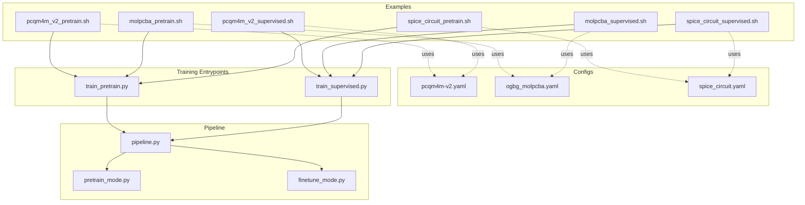
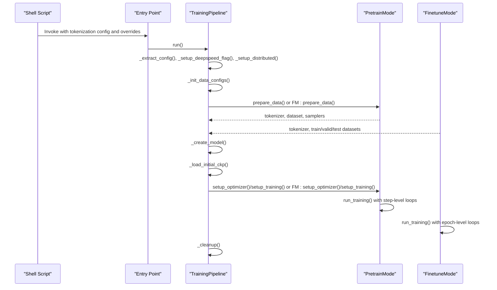
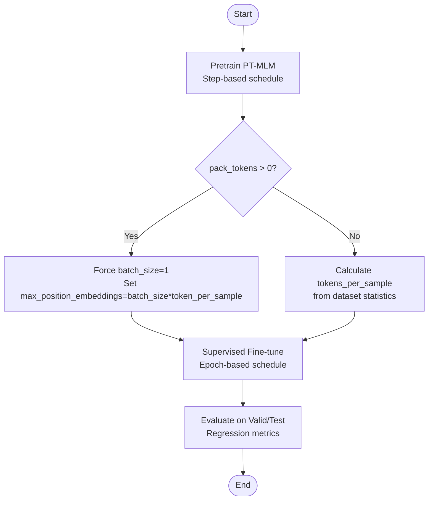
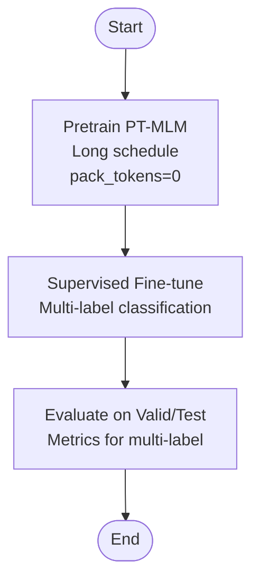
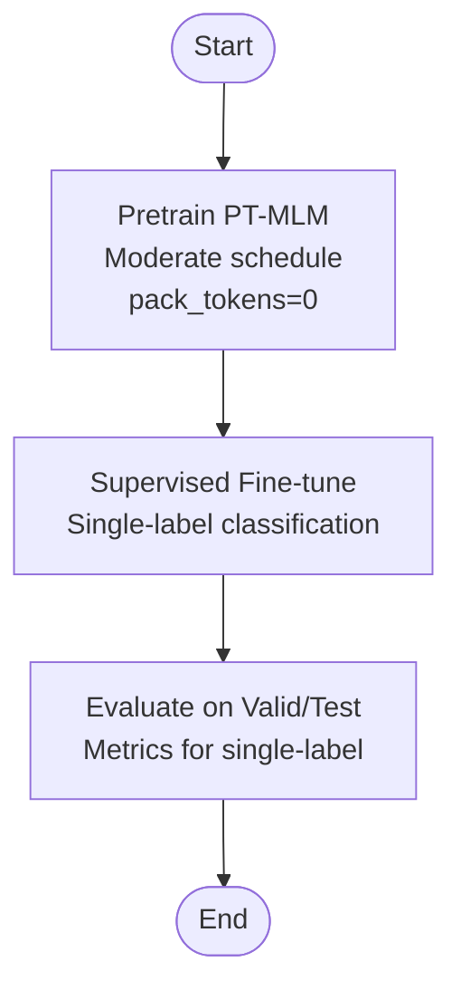
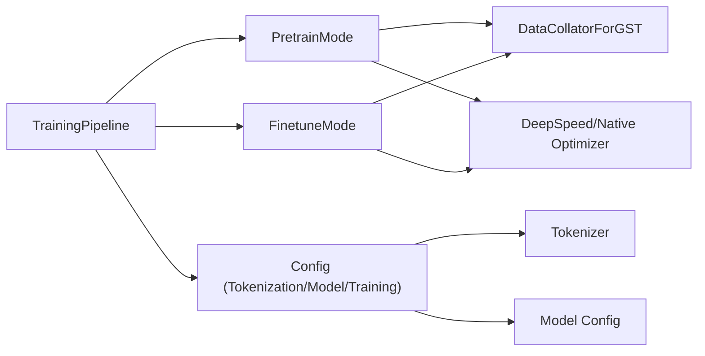

# Graph-Level Examples

<cite>
**Referenced Files in This Document**
- [pcqm4m_v2_pretrain.sh](file://examples/graph_lvl/pcqm4m_v2_pretrain.sh)
- [pcqm4m_v2_supervised.sh](file://examples/graph_lvl/pcqm4m_v2_supervised.sh)
- [molpcba_pretrain.sh](file://examples/graph_lvl/molpcba_pretrain.sh)
- [molpcba_supervised.sh](file://examples/graph_lvl/molpcba_supervised.sh)
- [spice_circuit_pretrain.sh](file://examples/graph_lvl/spice_circuit_pretrain.sh)
- [spice_circuit_supervised.sh](file://examples/graph_lvl/spice_circuit_supervised.sh)
- [pcqm4m-v2.yaml](file://configs/tokenization/graph_lvl/pcqm4m-v2.yaml)
- [ogbg_molpcba.yaml](file://configs/tokenization/graph_lvl/ogbg_molpcba.yaml)
- [spice_circuit.yaml](file://configs/tokenization/graph_lvl/spice_circuit.yaml)
- [train_pretrain.py](file://examples/train_pretrain.py)
- [train_supervised.py](file://examples/train_supervised.py)
- [pipeline.py](file://src/training/pipeline.py)
- [pretrain_mode.py](file://src/training/pretrain_mode.py)
- [finetune_mode.py](file://src/training/finetune_mode.py)
- [base_configs.py](file://src/conf/base_configs.py)
- [misc_utils.py](file://src/utils/misc_utils.py)
</cite>

## Update Summary
**Changes Made**
- Added documentation for the new `token_per_sample` parameter and its role in controlling maximum tokens per sample in packed sequences
- Updated pre-training configuration section to explain the relationship between `token_per_sample`, `batch_size`, and `max_position_embeddings`
- Added guidance for when and why to use `token_per_sample` parameter
- Updated troubleshooting section to include information about batch size constraints when using packed sequences

## Table of Contents
1. [Introduction](#introduction)
2. [Project Structure](#project-structure)
3. [Core Components](#core-components)
4. [Architecture Overview](#architecture-overview)
5. [Detailed Component Analysis](#detailed-component-analysis)
6. [Dependency Analysis](#dependency-analysis)
7. [Performance Considerations](#performance-considerations)
8. [Troubleshooting Guide](#troubleshooting-guide)
9. [Conclusion](#conclusion)
10. [Appendices](#appendices)

## Introduction
This document explains the graph-level task examples included in the repository, covering:
- PCQM4M-v2 molecular property prediction (regression)
- MoleculePCBA bioactivity prediction (multi-label classification)
- SPICE circuit analysis (single-label classification)

It details differences between pre-training and fine-tuning configurations, dataset-specific parameters, molecular feature handling, evaluation metrics, script structure, parameter optimization strategies, and computational requirements. Guidance is also provided for adapting these examples to other graph-level datasets, including data preprocessing and performance tuning, with attention to challenges specific to molecular graph learning and circuit analysis tasks.

**Updated** Added documentation for the new `token_per_sample` parameter that controls maximum number of tokens per sample in packed sequences and the associated batch size constraints.

## Project Structure
The graph-level examples are organized under examples/graph_lvl with paired pre-training and supervised scripts for each dataset. Tokenization configuration files define dataset semantics, vocabulary, and structure parameters. The training entry points delegate to a unified pipeline that switches behavior via mode strategies for pre-training versus fine-tuning.

**Diagram sources**
- [pcqm4m_v2_pretrain.sh:1-322](file://examples/graph_lvl/pcqm4m_v2_pretrain.sh#L1-L322)
- [pcqm4m_v2_supervised.sh:1-300](file://examples/graph_lvl/pcqm4m_v2_supervised.sh#L1-L300)
- [molpcba_pretrain.sh:1-286](file://examples/graph_lvl/molpcba_pretrain.sh#L1-L286)
- [molpcba_supervised.sh:1-300](file://examples/graph_lvl/molpcba_supervised.sh#L1-L300)
- [spice_circuit_pretrain.sh:1-286](file://examples/graph_lvl/spice_circuit_pretrain.sh#L1-L286)
- [spice_circuit_supervised.sh:1-300](file://examples/graph_lvl/spice_circuit_supervised.sh#L1-L300)
- [pcqm4m-v2.yaml:1-114](file://configs/tokenization/graph_lvl/pcqm4m-v2.yaml#L1-L114)
- [ogbg_molpcba.yaml:1-116](file://configs/tokenization/graph_lvl/ogbg_molpcba.yaml#L1-L116)
- [spice_circuit.yaml:1-116](file://configs/tokenization/graph_lvl/spice_circuit.yaml#L1-L116)
- [train_pretrain.py:1-19](file://examples/train_pretrain.py#L1-L19)
- [train_supervised.py:1-19](file://examples/train_supervised.py#L1-L19)
- [pipeline.py:1-258](file://src/training/pipeline.py#L1-L258)
- [pretrain_mode.py:1-501](file://src/training/pretrain_mode.py#L1-L501)
- [finetune_mode.py:1-459](file://src/training/finetune_mode.py#L1-L459)

**Section sources**
- [pcqm4m_v2_pretrain.sh:1-322](file://examples/graph_lvl/pcqm4m_v2_pretrain.sh#L1-L322)
- [pcqm4m_v2_supervised.sh:1-300](file://examples/graph_lvl/pcqm4m_v2_supervised.sh#L1-L300)
- [molpcba_pretrain.sh:1-286](file://examples/graph_lvl/molpcba_pretrain.sh#L1-L286)
- [molpcba_supervised.sh:1-300](file://examples/graph_lvl/molpcba_supervised.sh#L1-L300)
- [spice_circuit_pretrain.sh:1-286](file://examples/graph_lvl/spice_circuit_pretrain.sh#L1-L286)
- [spice_circuit_supervised.sh:1-300](file://examples/graph_lvl/spice_circuit_supervised.sh#L1-L300)
- [pcqm4m-v2.yaml:1-114](file://configs/tokenization/graph_lvl/pcqm4m-v2.yaml#L1-L114)
- [ogbg_molpcba.yaml:1-116](file://configs/tokenization/graph_lvl/ogbg_molpcba.yaml#L1-L116)
- [spice_circuit.yaml:1-116](file://configs/tokenization/graph_lvl/spice_circuit.yaml#L1-L116)
- [train_pretrain.py:1-19](file://examples/train_pretrain.py#L1-L19)
- [train_supervised.py:1-19](file://examples/train_supervised.py#L1-L19)
- [pipeline.py:1-258](file://src/training/pipeline.py#L1-L258)
- [pretrain_mode.py:1-501](file://src/training/pretrain_mode.py#L1-L501)
- [finetune_mode.py:1-459](file://src/training/finetune_mode.py#L1-L459)

## Core Components
- Unified training pipeline orchestrating shared setup and delegating to mode-specific strategies.
- PretrainMode for step-level training, token packing, and generation evaluation.
- FinetuneMode for epoch-level training, explicit train/valid/test splits, and evaluation/inference.
- Tokenization configs defining dataset semantics, vocabulary, and structure tokens for molecules and circuits.
- Script families per dataset encapsulating dataset selection, tokenizer config, model sizing, scheduling, and optimization.

Key differences between pre-training and fine-tuning:
- Pre-training focuses on masked-language/modeling objectives with step-based schedules and optional generation evaluation.
- Fine-tuning focuses on explicit task heads (regression/classification) with epoch-based schedules and evaluation cadence.

**Updated** Added explanation of token packing mechanism and the `token_per_sample` parameter that controls maximum tokens per sample when packing is enabled.

Key differences between pre-training and fine-tuning:
- Pre-training focuses on masked-language/modeling objectives with step-based schedules and optional generation evaluation.
- Fine-tuning focuses on explicit task heads (regression/classification) with epoch-based schedules and evaluation cadence.

**Section sources**
- [pipeline.py:60-96](file://src/training/pipeline.py#L60-L96)
- [pretrain_mode.py:48-76](file://src/training/pretrain_mode.py#L48-L76)
- [finetune_mode.py:43-71](file://src/training/finetune_mode.py#L43-L71)
- [base_configs.py:132-164](file://src/conf/base_configs.py#L132-L164)

## Architecture Overview
The training pipeline initializes configuration, sets up distributed environments, prepares data and tokenizer, constructs the model, loads checkpoints if applicable, configures optimizers/schedulers, and executes the chosen mode's training loop.

**Diagram sources**
- [train_pretrain.py:12-18](file://examples/train_pretrain.py#L12-L18)
- [train_supervised.py:12-18](file://examples/train_supervised.py#L12-L18)
- [pipeline.py:60-96](file://src/training/pipeline.py#L60-L96)
- [pretrain_mode.py:97-227](file://src/training/pretrain_mode.py#L97-L227)
- [finetune_mode.py:116-200](file://src/training/finetune_mode.py#L116-L200)

## Detailed Component Analysis

### PCQM4M-v2 Molecular Property Prediction
- Dataset and tokenizer: OGB dataset with a 2D molecular representation configuration.
- Pre-training:
  - Objective: masked-language modeling with optional discriminative contrastive learning.
  - Scheduling: total tokens and warmup tokens drive step count; token packing and sampling per saving configured.
  - Evaluation: optional generation evaluation and inference modes.
  - **Updated** Token packing: When `pack_tokens` is enabled, the script automatically sets `batch_size=1` and calculates `max_position_embeddings=batch_size*token_per_sample` to ensure compatibility with variable-length packed sequences.
- Supervised fine-tuning:
  - Task: graph regression with L1 loss.
  - Scheduling: epochs-based with warmup epochs; evaluation cadence and validation size configurable.
  - Optimization: Adam-style optimizer with EMA enabled by default.

**Diagram sources**
- [pcqm4m_v2_pretrain.sh:111-118](file://examples/graph_lvl/pcqm4m_v2_pretrain.sh#L111-L118)
- [pcqm4m_v2_pretrain.sh:29-31](file://examples/graph_lvl/pcqm4m_v2_pretrain.sh#L29-L31)
- [pcqm4m_v2_supervised.sh:27-77](file://examples/graph_lvl/pcqm4m_v2_supervised.sh#L27-L77)
- [pcqm4m-v2.yaml:14-25](file://configs/tokenization/graph_lvl/pcqm4m-v2.yaml#L14-L25)

**Section sources**
- [pcqm4m_v2_pretrain.sh:1-322](file://examples/graph_lvl/pcqm4m_v2_pretrain.sh#L1-L322)
- [pcqm4m_v2_supervised.sh:1-300](file://examples/graph_lvl/pcqm4m_v2_supervised.sh#L1-L300)
- [pcqm4m-v2.yaml:1-114](file://configs/tokenization/graph_lvl/pcqm4m-v2.yaml#L1-L114)

### MoleculePCBA Bioactivity Prediction
- Dataset and tokenizer: OGB dataset with molecular semantics and structure tokens.
- Pre-training:
  - Objective: masked-language modeling with configurable weighting and focal gamma.
  - Scheduling: long pre-training budget with substantial total tokens.
  - Evaluation: optional generation and inference modes.
  - **Updated** Token packing: This dataset currently uses `pack_tokens=0` in the pre-training script, meaning no token packing is enabled and normal token estimation is used.
- Supervised fine-tuning:
  - Task: multi-label classification with 128 labels.
  - Scheduling: epochs-based with warmup epochs; evaluation cadence and validation size configurable.
  - Optimization: Adam-style optimizer with EMA enabled by default.

**Diagram sources**
- [molpcba_pretrain.sh:24-66](file://examples/graph_lvl/molpcba_pretrain.sh#L24-L66)
- [molpcba_supervised.sh:27-77](file://examples/graph_lvl/molpcba_supervised.sh#L27-L77)
- [ogbg_molpcba.yaml:28-51](file://configs/tokenization/graph_lvl/ogbg_molpcba.yaml#L28-L51)

**Section sources**
- [molpcba_pretrain.sh:1-286](file://examples/graph_lvl/molpcba_pretrain.sh#L1-L286)
- [molpcba_supervised.sh:1-300](file://examples/graph_lvl/molpcba_supervised.sh#L1-L300)
- [ogbg_molpcba.yaml:1-116](file://configs/tokenization/graph_lvl/ogbg_molpcba.yaml#L1-L116)

### SPICE Circuit Analysis
- Dataset and tokenizer: Custom dataset with circuit semantics and structure tokens.
- Pre-training:
  - Objective: masked-language modeling with configurable generation settings.
  - Scheduling: moderate pre-training budget; token packing and sampling per saving configured.
  - Evaluation: optional generation and inference modes.
  - **Updated** Token packing: This dataset currently uses `pack_tokens=0` in the pre-training script, meaning no token packing is enabled and normal token estimation is used.
- Supervised fine-tuning:
  - Task: single-label classification with 14 classes.
  - Scheduling: epochs-based with warmup epochs; evaluation cadence and validation size configurable.
  - Optimization: Adam-style optimizer with EMA disabled by default.

**Diagram sources**
- [spice_circuit_pretrain.sh:24-66](file://examples/graph_lvl/spice_circuit_pretrain.sh#L24-L66)
- [spice_circuit_supervised.sh:27-77](file://examples/graph_lvl/spice_circuit_supervised.sh#L27-L77)
- [spice_circuit.yaml:28-51](file://configs/tokenization/graph_lvl/spice_circuit.yaml#L28-L51)

**Section sources**
- [spice_circuit_pretrain.sh:1-286](file://examples/graph_lvl/spice_circuit_pretrain.sh#L1-L286)
- [spice_circuit_supervised.sh:1-300](file://examples/graph_lvl/spice_circuit_supervised.sh#L1-L300)
- [spice_circuit.yaml:1-116](file://configs/tokenization/graph_lvl/spice_circuit.yaml#L1-L116)

### Tokenization and Data Semantics
- Tokenization configs define:
  - Semantic attributes for nodes and edges.
  - Structure tokens (BOS/EOS/new-node, edge tokens, graph summary).
  - Vocabulary and reserved tokens.
  - Task conversion hooks for pre-training objectives.
- Differences across datasets:
  - PCQM4M-v2: molecular semantics with node and edge dimensions suitable for regression.
  - MoleculePCBA: molecular semantics with multi-label classification targets.
  - SPICE: circuit semantics with fewer node dimensions and single-label classification.

**Section sources**
- [pcqm4m-v2.yaml:26-114](file://configs/tokenization/graph_lvl/pcqm4m-v2.yaml#L26-L114)
- [ogbg_molpcba.yaml:28-116](file://configs/tokenization/graph_lvl/ogbg_molpcba.yaml#L28-L116)
- [spice_circuit.yaml:28-116](file://configs/tokenization/graph_lvl/spice_circuit.yaml#L28-L116)

### Pre-Training vs Fine-Tuning Configuration Differences
- Pre-training:
  - Step-based schedule driven by total tokens and warmup tokens.
  - Optional token packing and generation evaluation.
  - Discriminative contrastive learning option.
  - **Updated** Token packing mechanism: When `pack_tokens > 0`, the system uses a fixed `tokens_per_sample` equal to `max_position_embeddings` and forces `batch_size=1` for compatibility with variable-length packed sequences.
- Fine-tuning:
  - Epoch-based schedule with warmup epochs.
  - Explicit train/valid/test loaders and evaluation cadence.
  - Task-specific head configuration (regression or multi/single-label classification).

**Section sources**
- [pretrain_mode.py:50-76](file://src/training/pretrain_mode.py#L50-L76)
- [finetune_mode.py:43-71](file://src/training/finetune_mode.py#L43-L71)
- [base_configs.py:54-73](file://src/conf/base_configs.py#L54-L73)
- [base_configs.py:166-176](file://src/conf/base_configs.py#L166-L176)

## Dependency Analysis
The training pipeline coordinates shared setup and delegates to mode-specific strategies. The mode classes depend on data utilities, collators, and model factories. Tokenization configs feed into model configuration initialization and tokenizer construction.

**Diagram sources**
- [pipeline.py:15-96](file://src/training/pipeline.py#L15-L96)
- [pretrain_mode.py:24-45](file://src/training/pretrain_mode.py#L24-L45)
- [finetune_mode.py:12-38](file://src/training/finetune_mode.py#L12-L38)
- [base_configs.py:186-204](file://src/conf/base_configs.py#L186-L204)

**Section sources**
- [pipeline.py:1-258](file://src/training/pipeline.py#L1-L258)
- [pretrain_mode.py:1-501](file://src/training/pretrain_mode.py#L1-L501)
- [finetune_mode.py:1-459](file://src/training/finetune_mode.py#L1-L459)
- [base_configs.py:1-302](file://src/conf/base_configs.py#L1-L302)

## Performance Considerations
- Pre-training:
  - Use DeepSpeed for large-scale step-based training; configure steps per saving and logging frequency to balance throughput and checkpoint overhead.
  - Token packing can reduce padding overhead but requires careful estimation of tokens per sample.
  - Adjust batch size and world size to meet target total tokens efficiently.
  - **Updated** Token packing considerations: When using token packing (`pack_tokens > 0`), the system automatically sets `batch_size=1` and uses `tokens_per_sample=max_position_embeddings`. This ensures compatibility with variable-length packed sequences but limits throughput.
- Fine-tuning:
  - Epoch-based training benefits from warmup epochs proportional to total epochs.
  - Validation size and evaluation cadence should balance accuracy monitoring with training time.
  - EMA can improve generalization at a modest memory cost.
- Hardware:
  - Multi-GPU with DeepSpeed is recommended for pre-training; CPU testing modes are available for quick checks.
  - Ensure sufficient memory for model sizes and batch configurations; gradient checkpointing is enabled in model creation.

**Section sources**
- [pcqm4m_v2_pretrain.sh:111-118](file://examples/graph_lvl/pcqm4m_v2_pretrain.sh#L111-L118)
- [pretrain_mode.py:169-197](file://src/training/pretrain_mode.py#L169-L197)
- [misc_utils.py:349-378](file://src/utils/misc_utils.py#L349-L378)

## Troubleshooting Guide
- Resuming training:
  - The pipeline checks for an existing log file and prefers resuming from the current output directory rather than loading a pretrain checkpoint path.
- Checkpoint loading:
  - When resuming, DeepSpeed and native DDP have distinct loading paths; ensure the correct checkpoint format is present.
- Distributed training:
  - Verify DeepSpeed configuration file path and environment variables; ensure ranks and world size match hardware setup.
- Evaluation-only or inference-only modes:
  - Pre-training supports evaluation-only and inference-only modes; fine-tuning supports evaluation-only and inference-only modes with epoch-based iteration.
- **Updated** Token packing issues:
  - When `pack_tokens > 0`, the system automatically forces `batch_size=1` and calculates `max_position_embeddings=batch_size*token_per_sample`.
  - If you encounter unexpected batch size behavior, check the `pack_tokens` parameter in your script.
  - The `token_per_sample` parameter controls the maximum number of tokens allowed per sample in packed sequences.

**Section sources**
- [pipeline.py:129-136](file://src/training/pipeline.py#L129-L136)
- [pipeline.py:181-202](file://src/training/pipeline.py#L181-L202)
- [pretrain_mode.py:240-265](file://src/training/pretrain_mode.py#L240-L265)
- [finetune_mode.py:351-358](file://src/training/finetune_mode.py#L351-L358)
- [pcqm4m_v2_pretrain.sh:111-118](file://examples/graph_lvl/pcqm4m_v2_pretrain.sh#L111-L118)

## Conclusion
The repository provides robust, reusable examples for graph-level tasks across molecular and circuit domains. Pre-training establishes strong generative representations with step-based schedules, while fine-tuning adapts models to specific tasks with epoch-based schedules and explicit evaluation. Tokenization configs capture dataset-specific semantics and structure, enabling consistent model configuration across datasets. The unified pipeline and mode strategies simplify adaptation to new graph-level datasets with minimal code changes.

**Updated** The addition of the `token_per_sample` parameter enhances the flexibility of token packing by allowing users to control the maximum number of tokens per sample in packed sequences, with automatic batch size adjustment for compatibility.

## Appendices

### Adapting to Other Graph-Level Datasets
- Data preprocessing:
  - Define a new tokenization YAML under configs/tokenization/graph_lvl with dataset semantics, node/edge dimensions, and structure tokens.
  - Ensure vocabulary and reserved tokens align with the dataset's attribute ranges.
- Script structure:
  - Create paired pretrain and supervised shell scripts mirroring the dataset-specific examples.
  - Set dataset source/name, tokenizer class, and tokenization config path.
  - Tune scheduling, batch size, and optimizer hyperparameters per dataset scale and task type.
- Performance tuning:
  - For pre-training, adjust total tokens and warmup tokens to reach desired compute budgets; consider token packing and steps per saving.
  - For fine-tuning, adjust epochs and warmup epochs; monitor validation metrics and tune learning rate and weight decay accordingly.
- Challenges:
  - Molecular graphs: handle diverse atom/bond types and varying sizes; consider multi-label classification targets and regression scaling.
  - Circuit graphs: leverage structural tokens and fewer node attributes; ensure class imbalance is addressed in single-label classification.
- **Updated** Token packing considerations:
  - Use `pack_tokens > 0` to enable token packing for variable-length sequences.
  - Set `token_per_sample` appropriately based on expected sequence lengths in your dataset.
  - Be aware that token packing forces `batch_size=1` for compatibility with variable-length packed sequences.

### Understanding the `token_per_sample` Parameter
- Purpose: Controls the maximum number of tokens allowed per sample when using token packing.
- Behavior: When `pack_tokens > 0`, the system:
  - Forces `batch_size=1` for compatibility with variable-length packed sequences
  - Sets `max_position_embeddings=batch_size*token_per_sample`
  - Uses a fixed `tokens_per_sample=max_position_embeddings` instead of estimating from data
- Usage guidelines:
  - Set `token_per_sample` based on your dataset's typical sequence lengths
  - For datasets with highly variable graph sizes, choose a value that accommodates most samples
  - Monitor memory usage as larger `token_per_sample` values increase memory requirements

**Section sources**
- [pcqm4m_v2_pretrain.sh:29-31](file://examples/graph_lvl/pcqm4m_v2_pretrain.sh#L29-L31)
- [pcqm4m_v2_pretrain.sh:111-118](file://examples/graph_lvl/pcqm4m_v2_pretrain.sh#L111-L118)
- [pretrain_mode.py:169-197](file://src/training/pretrain_mode.py#L169-L197)
- [misc_utils.py:349-378](file://src/utils/misc_utils.py#L349-L378)
