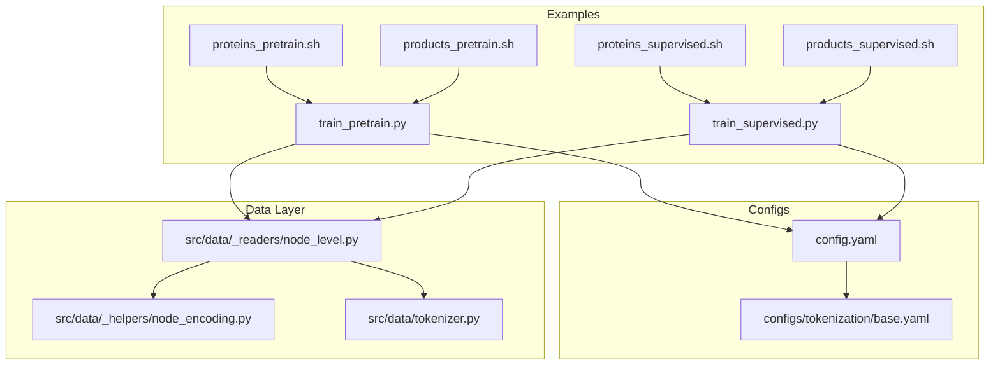
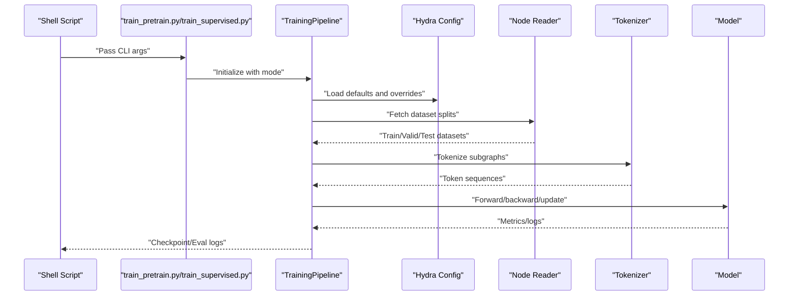
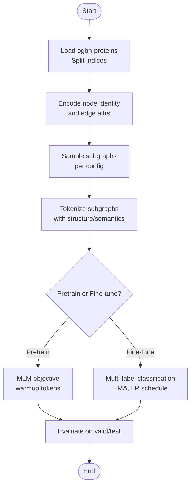
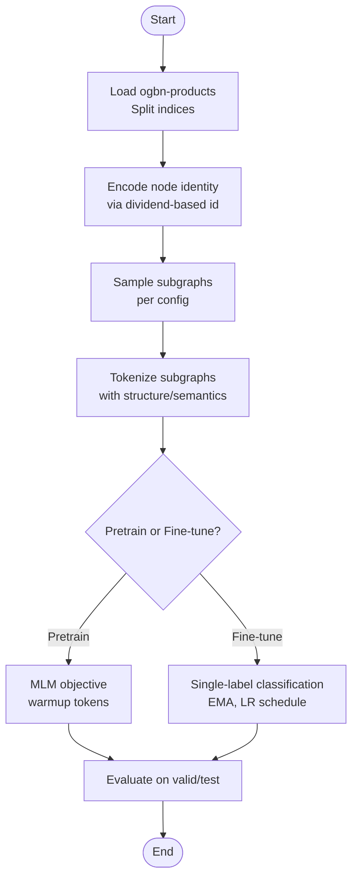
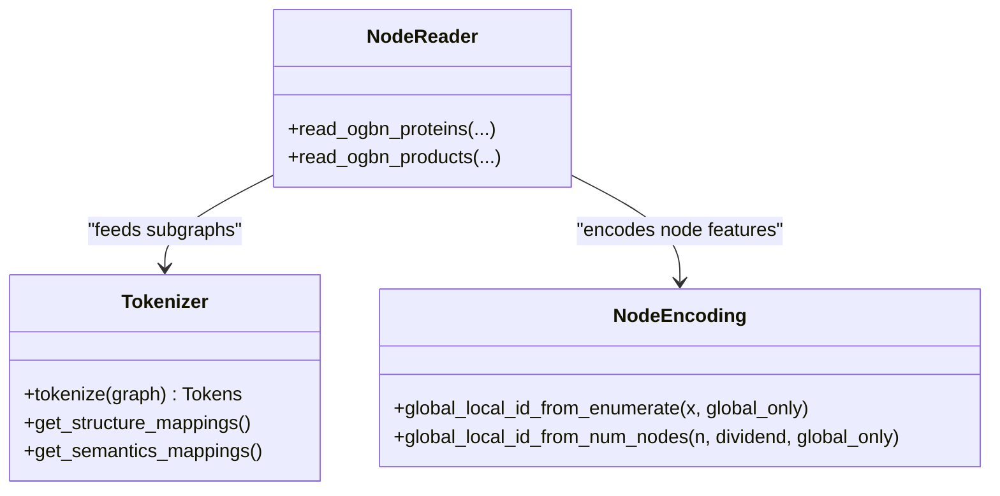
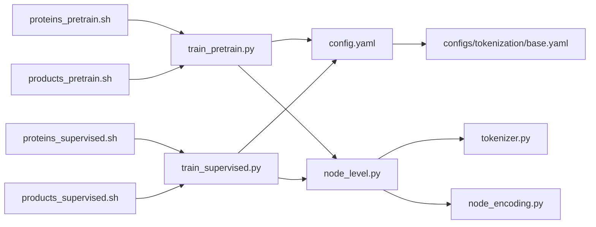

# Node-Level Examples

<cite>
**Referenced Files in This Document**
- [proteins_pretrain.sh](file://examples/node_lvl/proteins_pretrain.sh)
- [proteins_supervised.sh](file://examples/node_lvl/proteins_supervised.sh)
- [products_pretrain.sh](file://examples/node_lvl/products_pretrain.sh)
- [products_supervised.sh](file://examples/node_lvl/products_supervised.sh)
- [train_pretrain.py](file://examples/train_pretrain.py)
- [train_supervised.py](file://examples/train_supervised.py)
- [node_level.py](file://src/data/_readers/node_level.py)
- [node_encoding.py](file://src/data/_helpers/node_encoding.py)
- [tokenizer.py](file://src/data/tokenizer.py)
- [base.yaml](file://configs/tokenization/base.yaml)
- [config.yaml](file://configs/config.yaml)
</cite>

## Table of Contents
1. [Introduction](#introduction)
2. [Project Structure](#project-structure)
3. [Core Components](#core-components)
4. [Architecture Overview](#architecture-overview)
5. [Detailed Component Analysis](#detailed-component-analysis)
6. [Dependency Analysis](#dependency-analysis)
7. [Performance Considerations](#performance-considerations)
8. [Troubleshooting Guide](#troubleshooting-guide)
9. [Conclusion](#conclusion)
10. [Appendices](#appendices)

## Introduction
This document explains node-level task examples for protein function prediction and product recommendation within a graph-aware tokenization and sequence modeling framework. It covers:
- The node-centric approach to graph learning: node feature encoding, neighborhood aggregation strategies, and multi-class classification setup
- Script configurations for each node-level dataset
- Parameter optimization for node classification/regression tasks
- Evaluation methodologies
- Guidance for adapting these examples to other node-level problems, including feature engineering and class imbalance handling
- Challenges specific to node-level prediction and performance measurement strategies

## Project Structure
The repository organizes node-level examples under examples/node_lvl with dedicated pretraining and supervised scripts for each dataset. The training entry points delegate to a unified pipeline that selects pretraining or fine-tuning modes. Dataset readers and tokenization utilities implement node-centric data loading and feature encoding.

**Diagram sources**
- [proteins_pretrain.sh:1-198](file://examples/node_lvl/proteins_pretrain.sh#L1-L198)
- [proteins_supervised.sh:1-229](file://examples/node_lvl/proteins_supervised.sh#L1-L229)
- [products_pretrain.sh:1-201](file://examples/node_lvl/products_pretrain.sh#L1-L201)
- [products_supervised.sh:1-229](file://examples/node_lvl/products_supervised.sh#L1-L229)
- [train_pretrain.py:1-19](file://examples/train_pretrain.py#L1-L19)
- [train_supervised.py:1-19](file://examples/train_supervised.py#L1-L19)
- [config.yaml:1-20](file://configs/config.yaml#L1-L20)
- [base.yaml:1-117](file://configs/tokenization/base.yaml#L1-L117)
- [node_level.py:1-369](file://src/data/_readers/node_level.py#L1-L369)
- [node_encoding.py:1-85](file://src/data/_helpers/node_encoding.py#L1-L85)
- [tokenizer.py:994-1020](file://src/data/tokenizer.py#L994-L1020)

**Section sources**
- [proteins_pretrain.sh:1-198](file://examples/node_lvl/proteins_pretrain.sh#L1-L198)
- [proteins_supervised.sh:1-229](file://examples/node_lvl/proteins_supervised.sh#L1-L229)
- [products_pretrain.sh:1-201](file://examples/node_lvl/products_pretrain.sh#L1-L201)
- [products_supervised.sh:1-229](file://examples/node_lvl/products_supervised.sh#L1-L229)
- [train_pretrain.py:1-19](file://examples/train_pretrain.py#L1-L19)
- [train_supervised.py:1-19](file://examples/train_supervised.py#L1-L19)
- [config.yaml:1-20](file://configs/config.yaml#L1-L20)
- [base.yaml:1-117](file://configs/tokenization/base.yaml#L1-L117)
- [node_level.py:1-369](file://src/data/_readers/node_level.py#L1-L369)
- [node_encoding.py:1-85](file://src/data/_helpers/node_encoding.py#L1-L85)
- [tokenizer.py:994-1020](file://src/data/tokenizer.py#L994-L1020)

## Core Components
- Node-level dataset readers: Implement dataset-specific preprocessing, sampling, and split handling for node property prediction tasks.
- Node feature encoding helpers: Provide mechanisms to encode node identity and categorical attributes into numeric representations suitable for tokenization.
- Tokenizer: Converts subgraphs into token sequences using structure and semantics mappings, enabling downstream sequence modeling.
- Training entry points: Unified scripts that select pretraining or supervised fine-tuning modes and pass arguments to the training pipeline.

Key responsibilities:
- Proteins dataset reader constructs node identity features and edge attributes, and supports two sampling datasets for pretraining and supervised tasks.
- Products dataset reader prepares node features and applies optional validation/test subsampling.
- Tokenization integrates structure (neighborhood scope), semantics (node/edge attributes), and embeddings to produce token streams.
- Scripts configure model sizes, optimization schedules, and evaluation cadence for node-level tasks.

**Section sources**
- [node_level.py:27-114](file://src/data/_readers/node_level.py#L27-L114)
- [node_level.py:276-360](file://src/data/_readers/node_level.py#L276-L360)
- [node_encoding.py:5-85](file://src/data/_helpers/node_encoding.py#L5-L85)
- [tokenizer.py:994-1020](file://src/data/tokenizer.py#L994-L1020)
- [proteins_pretrain.sh:1-198](file://examples/node_lvl/proteins_pretrain.sh#L1-L198)
- [proteins_supervised.sh:1-229](file://examples/node_lvl/proteins_supervised.sh#L1-L229)
- [products_pretrain.sh:1-201](file://examples/node_lvl/products_pretrain.sh#L1-L201)
- [products_supervised.sh:1-229](file://examples/node_lvl/products_supervised.sh#L1-L229)

## Architecture Overview
The node-level pipeline follows a consistent flow: scripts assemble arguments, the training pipeline loads configs, the data reader fetches and preprocesses graphs, the tokenizer converts subgraphs to tokens, and the model performs either pretraining or supervised node-level classification/regression.

**Diagram sources**
- [train_pretrain.py:1-19](file://examples/train_pretrain.py#L1-L19)
- [train_supervised.py:1-19](file://examples/train_supervised.py#L1-L19)
- [config.yaml:1-20](file://configs/config.yaml#L1-L20)
- [node_level.py:27-114](file://src/data/_readers/node_level.py#L27-L114)
- [tokenizer.py:994-1020](file://src/data/tokenizer.py#L994-L1020)

## Detailed Component Analysis

### Proteins Function Prediction (Node-level Multi-label Classification)
- Dataset: ogbn-proteins with multi-label targets.
- Node feature encoding:
  - Node identity encoded via global/local id derived from species enumeration.
  - Edge attributes normalized and cast to integer ids.
- Sampling:
  - Pretraining uses a short-stack sampling configuration.
  - Supervised uses a long-stack configuration with pretrained checkpoint initialization.
- Model configuration:
  - Hidden size and depth vary by model_name; stacked feature aggregation method configured.
- Optimization:
  - Pretraining: masked language modeling objective with warmup tokens and EMA disabled.
  - Supervised: cosine decay schedule, EMA enabled, and configurable dropout rates.
- Evaluation:
  - Supervised script supports saving predictions and true validation flagging.

**Diagram sources**
- [node_level.py:276-360](file://src/data/_readers/node_level.py#L276-L360)
- [proteins_pretrain.sh:1-198](file://examples/node_lvl/proteins_pretrain.sh#L1-L198)
- [proteins_supervised.sh:1-229](file://examples/node_lvl/proteins_supervised.sh#L1-L229)

**Section sources**
- [node_level.py:276-360](file://src/data/_readers/node_level.py#L276-L360)
- [proteins_pretrain.sh:1-198](file://examples/node_lvl/proteins_pretrain.sh#L1-L198)
- [proteins_supervised.sh:1-229](file://examples/node_lvl/proteins_supervised.sh#L1-L229)

### Products Recommendation (Node-level Single-label Classification)
- Dataset: ogbn-products with single-label targets.
- Node feature encoding:
  - Node identity encoded using global/local id derived from node count with a dividend strategy.
- Sampling:
  - Pretraining and supervised use distinct sampling configurations optimized for this dataset.
- Model configuration:
  - Hidden size and depth controlled by model_name; gated vs sum stacked feature aggregation.
- Optimization:
  - Supervised uses a cosine decay schedule, EMA enabled, and dropout rates tailored for stability.
- Evaluation:
  - Supervised script supports saving predictions and true validation selection.

**Diagram sources**
- [node_level.py:27-114](file://src/data/_readers/node_level.py#L27-L114)
- [products_pretrain.sh:1-201](file://examples/node_lvl/products_pretrain.sh#L1-L201)
- [products_supervised.sh:1-229](file://examples/node_lvl/products_supervised.sh#L1-L229)

**Section sources**
- [node_level.py:27-114](file://src/data/_readers/node_level.py#L27-L114)
- [products_pretrain.sh:1-201](file://examples/node_lvl/products_pretrain.sh#L1-L201)
- [products_supervised.sh:1-229](file://examples/node_lvl/products_supervised.sh#L1-L229)

### Tokenization and Neighborhood Aggregation
- Tokenization converts subgraphs into token sequences using:
  - Structure mappings for nodes and edges (scope, cyclic, directional tokens).
  - Semantics mappings for node/edge attributes (discrete, continuous).
- Neighborhood aggregation strategies:
  - Short-stack vs long-stack sampling controls the breadth/depth of neighborhood contexts.
  - Stacked feature aggregation methods include gated and sum variants.

**Diagram sources**
- [tokenizer.py:994-1020](file://src/data/tokenizer.py#L994-L1020)
- [node_encoding.py:24-85](file://src/data/_helpers/node_encoding.py#L24-L85)
- [node_level.py:27-114](file://src/data/_readers/node_level.py#L27-L114)

**Section sources**
- [tokenizer.py:994-1020](file://src/data/tokenizer.py#L994-L1020)
- [node_encoding.py:1-85](file://src/data/_helpers/node_encoding.py#L1-L85)
- [node_level.py:1-369](file://src/data/_readers/node_level.py#L1-L369)

## Dependency Analysis
- Shell scripts depend on training entry points and dataset-specific tokenization configs.
- Training entry points depend on Hydra configs and the training pipeline.
- Data readers depend on OGB node property datasets and dataset mapping utilities.
- Tokenizer depends on structure/semantics configuration and graph-to-path conversion.

**Diagram sources**
- [proteins_pretrain.sh:1-198](file://examples/node_lvl/proteins_pretrain.sh#L1-L198)
- [proteins_supervised.sh:1-229](file://examples/node_lvl/proteins_supervised.sh#L1-L229)
- [products_pretrain.sh:1-201](file://examples/node_lvl/products_pretrain.sh#L1-L201)
- [products_supervised.sh:1-229](file://examples/node_lvl/products_supervised.sh#L1-L229)
- [train_pretrain.py:1-19](file://examples/train_pretrain.py#L1-L19)
- [train_supervised.py:1-19](file://examples/train_supervised.py#L1-L19)
- [config.yaml:1-20](file://configs/config.yaml#L1-L20)
- [base.yaml:1-117](file://configs/tokenization/base.yaml#L1-L117)
- [node_level.py:1-369](file://src/data/_readers/node_level.py#L1-L369)
- [tokenizer.py:994-1020](file://src/data/tokenizer.py#L994-L1020)
- [node_encoding.py:1-85](file://src/data/_helpers/node_encoding.py#L1-L85)

**Section sources**
- [proteins_pretrain.sh:1-198](file://examples/node_lvl/proteins_pretrain.sh#L1-L198)
- [proteins_supervised.sh:1-229](file://examples/node_lvl/proteins_supervised.sh#L1-L229)
- [products_pretrain.sh:1-201](file://examples/node_lvl/products_pretrain.sh#L1-L201)
- [products_supervised.sh:1-229](file://examples/node_lvl/products_supervised.sh#L1-L229)
- [train_pretrain.py:1-19](file://examples/train_pretrain.py#L1-L19)
- [train_supervised.py:1-19](file://examples/train_supervised.py#L1-L19)
- [config.yaml:1-20](file://configs/config.yaml#L1-L20)
- [base.yaml:1-117](file://configs/tokenization/base.yaml#L1-L117)
- [node_level.py:1-369](file://src/data/_readers/node_level.py#L1-L369)
- [tokenizer.py:994-1020](file://src/data/tokenizer.py#L994-L1020)
- [node_encoding.py:1-85](file://src/data/_helpers/node_encoding.py#L1-L85)

## Performance Considerations
- Batch sizing and worker counts are tuned per dataset and model scale to balance throughput and memory footprint.
- Warmup tokens and total tokens control pretraining schedule and effective learning rate ramp-up.
- Dropout and EMA settings influence generalization and convergence stability.
- Sampling configurations trade off neighborhood breadth/depth against compute costs.
- Position embedding limits constrain sequence lengths processed in a single forward pass.

[No sources needed since this section provides general guidance]

## Troubleshooting Guide
Common issues and remedies:
- Undirected graph assumption: Ensure edges are made undirected and self-cycles removed before tokenization.
- Node identity overflow: Verify global/local id encoding aligns with dataset cardinality and dividend strategy.
- Class imbalance in node classification: Consider label-aware sampling or loss weighting in supervised scripts.
- Evaluation mismatch: Confirm true validation flag and test subsampling logic match intended evaluation protocol.

**Section sources**
- [node_level.py:40-44](file://src/data/_readers/node_level.py#L40-L44)
- [node_encoding.py:45-70](file://src/data/_helpers/node_encoding.py#L45-L70)
- [proteins_supervised.sh:78-90](file://examples/node_lvl/proteins_supervised.sh#L78-L90)
- [products_supervised.sh:68-75](file://examples/node_lvl/products_supervised.sh#L68-L75)

## Conclusion
These node-level examples demonstrate a robust, tokenization-first approach to graph learning. By carefully encoding node identities, aggregating neighborhood contexts via configurable sampling, and structuring multi-class classification objectives, the framework supports both pretraining and supervised fine-tuning for node-level tasks. The provided scripts and configurations serve as templates for adapting to other node-level problems with minimal changes to feature engineering and evaluation protocols.

[No sources needed since this section summarizes without analyzing specific files]

## Appendices

### A. Node Feature Encoding Reference
- Global/local id from enumeration: Encodes categorical node labels into compact integer pairs for identity coding.
- Global/local id from number of nodes: Splits absolute node indices using a dividend for scalable identity representation.
- Mask concatenation of node labels: Optionally augments features with label masks for pretraining/fine-tuning scenarios.

**Section sources**
- [node_encoding.py:24-85](file://src/data/_helpers/node_encoding.py#L24-L85)

### B. Tokenization Configuration Reference
- Structure: Controls node/edge scope, cyclic behavior, and directional tokens.
- Semantics: Defines discrete/continuous attribute mappings and reserved tokens.
- Vocabulary and EOS handling: Centralized tokenization parameters shared across node-level datasets.

**Section sources**
- [base.yaml:29-117](file://configs/tokenization/base.yaml#L29-L117)

### C. Example Script Parameters Summary
- Proteins:
  - Pretraining: short-stack sampling, gated stacked feature aggregation, MLM objective.
  - Supervised: long-stack sampling, EMA-enabled, multi-label classification with 112 labels.
- Products:
  - Pretraining: long-stack sampling, sum stacked feature aggregation, MLM objective.
  - Supervised: single-label classification with 47 labels, EMA-enabled.

**Section sources**
- [proteins_pretrain.sh:1-198](file://examples/node_lvl/proteins_pretrain.sh#L1-L198)
- [proteins_supervised.sh:1-229](file://examples/node_lvl/proteins_supervised.sh#L1-L229)
- [products_pretrain.sh:1-201](file://examples/node_lvl/products_pretrain.sh#L1-L201)
- [products_supervised.sh:1-229](file://examples/node_lvl/products_supervised.sh#L1-L229)
