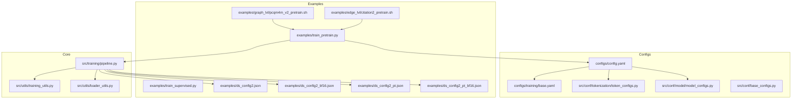
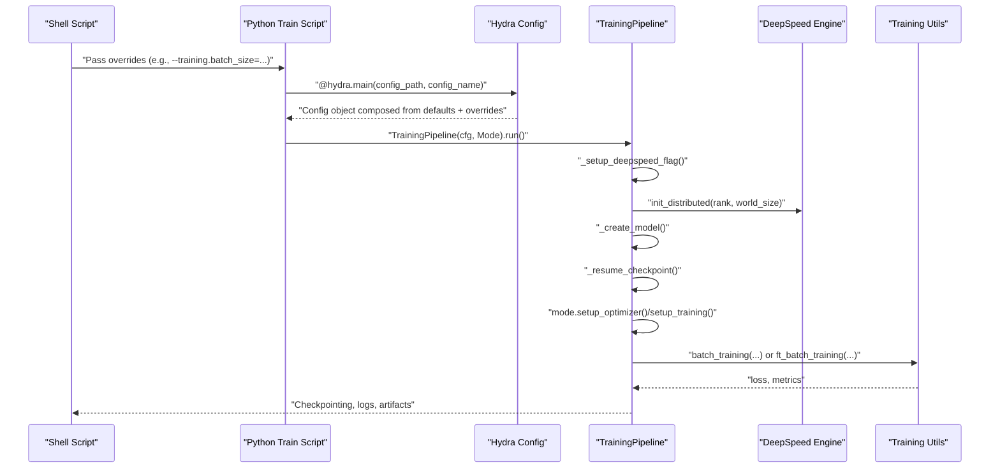
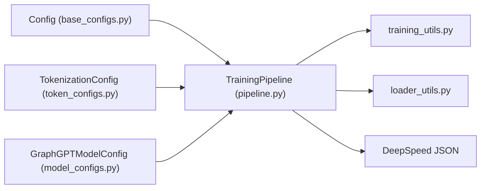

# Script Customization and Best Practices

<cite>
**Referenced Files in This Document**
- [configs/config.yaml](file://configs/config.yaml)
- [configs/README.md](file://configs/README.md)
- [configs/training/base.yaml](file://configs/training/base.yaml)
- [src/conf/base_configs.py](file://src/conf/base_configs.py)
- [src/conf/model/model_configs.py](file://src/conf/model/model_configs.py)
- [src/conf/tokenization/token_configs.py](file://src/conf/tokenization/token_configs.py)
- [src/training/pipeline.py](file://src/training/pipeline.py)
- [src/utils/training_utils.py](file://src/utils/training_utils.py)
- [src/utils/loader_utils.py](file://src/utils/loader_utils.py)
- [examples/train_pretrain.py](file://examples/train_pretrain.py)
- [examples/train_supervised.py](file://examples/train_supervised.py)
- [examples/ds_config2.json](file://examples/ds_config2.json)
- [examples/ds_config2_bf16.json](file://examples/ds_config2_bf16.json)
- [examples/ds_config2_pt.json](file://examples/ds_config2_pt.json)
- [examples/ds_config2_pt_bf16.json](file://examples/ds_config2_pt_bf16.json)
- [examples/edge_lvl/citation2_pretrain.sh](file://examples/edge_lvl/citation2_pretrain.sh)
- [examples/graph_lvl/pcqm4m_v2_pretrain.sh](file://examples/graph_lvl/pcqm4m_v2_pretrain.sh)
</cite>

## Table of Contents
1. [Introduction](#introduction)
2. [Project Structure](#project-structure)
3. [Core Components](#core-components)
4. [Architecture Overview](#architecture-overview)
5. [Detailed Component Analysis](#detailed-component-analysis)
6. [Dependency Analysis](#dependency-analysis)
7. [Performance Considerations](#performance-considerations)
8. [Troubleshooting Guide](#troubleshooting-guide)
9. [Conclusion](#conclusion)
10. [Appendices](#appendices)

## Introduction
This document provides practical guidance for customizing training scripts, adapting configurations for custom datasets, and optimizing performance across diverse hardware environments. It explains how to connect script parameters with configuration files, integrate DeepSpeed, manage mixed precision, and tune distributed training. It also covers debugging, monitoring, reproducibility, checkpoint management, and resource allocation strategies for large-scale experiments.

## Project Structure
The repository organizes configuration via Hydra defaults and modular configuration classes, while training scripts orchestrate the pipeline with optional DeepSpeed integration. Example shell scripts demonstrate how to pass command-line overrides to the Python training entry points.

**Diagram sources**
- [configs/config.yaml:1-20](file://configs/config.yaml#L1-L20)
- [configs/training/base.yaml:1-78](file://configs/training/base.yaml#L1-L78)
- [src/conf/tokenization/token_configs.py:115-127](file://src/conf/tokenization/token_configs.py#L115-L127)
- [src/conf/model/model_configs.py:246-326](file://src/conf/model/model_configs.py#L246-L326)
- [src/conf/base_configs.py:186-204](file://src/conf/base_configs.py#L186-L204)
- [examples/edge_lvl/citation2_pretrain.sh:197-201](file://examples/edge_lvl/citation2_pretrain.sh#L197-L201)
- [examples/graph_lvl/pcqm4m_v2_pretrain.sh:302-311](file://examples/graph_lvl/pcqm4m_v2_pretrain.sh#L302-L311)
- [examples/train_pretrain.py:12-18](file://examples/train_pretrain.py#L12-L18)
- [examples/train_supervised.py:12-18](file://examples/train_supervised.py#L12-L18)
- [examples/ds_config2.json:1-43](file://examples/ds_config2.json#L1-L43)
- [examples/ds_config2_bf16.json:1-38](file://examples/ds_config2_bf16.json#L1-L38)
- [examples/ds_config2_pt.json:1-48](file://examples/ds_config2_pt.json#L1-L48)
- [examples/ds_config2_pt_bf16.json:1-43](file://examples/ds_config2_pt_bf16.json#L1-L43)
- [src/training/pipeline.py:15-96](file://src/training/pipeline.py#L15-L96)
- [src/utils/training_utils.py:7-206](file://src/utils/training_utils.py#L7-L206)
- [src/utils/loader_utils.py:161-221](file://src/utils/loader_utils.py#L161-L221)

**Section sources**
- [configs/README.md:1-18](file://configs/README.md#L1-L18)
- [configs/config.yaml:1-20](file://configs/config.yaml#L1-L20)

## Core Components
- Configuration system
  - Hydra defaults compose tokenization, model, training, generation, and base configs.
  - Training config centralizes DeepSpeed integration, scheduling, optimizer, and distributed settings.
  - Model and tokenization configs define architecture and data handling parameters.
- Training pipeline
  - Orchestrates setup, data preparation, model creation, optimizer setup, checkpointing, and training loop.
  - Supports both DeepSpeed and native AMP modes.
- Utilities
  - Training utilities implement forward/backward/update logic for both pretraining and finetuning.
  - Loader utilities handle samplers, data loaders, and checkpoint restoration.

Key configuration relationships:
- Script parameters passed via shell scripts override Hydra defaults and are applied to the unified Config object.
- DeepSpeed configuration is referenced by training config and toggles distributed initialization and checkpoint loading.
- Mixed precision is controlled by DeepSpeed JSON settings or native AMP within training utilities.

**Section sources**
- [configs/training/base.yaml:1-78](file://configs/training/base.yaml#L1-L78)
- [src/conf/base_configs.py:186-204](file://src/conf/base_configs.py#L186-L204)
- [src/conf/model/model_configs.py:246-326](file://src/conf/model/model_configs.py#L246-L326)
- [src/conf/tokenization/token_configs.py:115-127](file://src/conf/tokenization/token_configs.py#L115-L127)
- [src/training/pipeline.py:15-96](file://src/training/pipeline.py#L15-L96)
- [src/utils/training_utils.py:7-206](file://src/utils/training_utils.py#L7-L206)
- [src/utils/loader_utils.py:161-221](file://src/utils/loader_utils.py#L161-L221)

## Architecture Overview
The training workflow integrates shell-driven overrides, Hydra configuration composition, and a unified pipeline with optional DeepSpeed integration.

**Diagram sources**
- [examples/edge_lvl/citation2_pretrain.sh:197-201](file://examples/edge_lvl/citation2_pretrain.sh#L197-L201)
- [examples/graph_lvl/pcqm4m_v2_pretrain.sh:302-311](file://examples/graph_lvl/pcqm4m_v2_pretrain.sh#L302-L311)
- [examples/train_pretrain.py:12-18](file://examples/train_pretrain.py#L12-L18)
- [src/training/pipeline.py:119-203](file://src/training/pipeline.py#L119-L203)
- [src/utils/training_utils.py:7-206](file://src/utils/training_utils.py#L7-L206)

## Detailed Component Analysis

### Configuration Composition and Overrides
- Hydra defaults compose tokenization, model, training, generation, and base configs.
- Shell scripts pass overrides to the Python entry points, which are applied to the unified Config object.
- Training config controls DeepSpeed toggle, scheduling, optimizer, and distributed settings.

Best practices:
- Keep dataset-specific tokenization in dedicated YAML files and reference them via tokenization defaults.
- Use shell scripts to group related overrides for reproducibility and readability.
- Prefer numeric suffixes in output directories to track hyperparameters.

**Section sources**
- [configs/config.yaml:1-20](file://configs/config.yaml#L1-L20)
- [configs/README.md:1-18](file://configs/README.md#L1-L18)
- [examples/edge_lvl/citation2_pretrain.sh:156-191](file://examples/edge_lvl/citation2_pretrain.sh#L156-L191)
- [examples/graph_lvl/pcqm4m_v2_pretrain.sh:253-295](file://examples/graph_lvl/pcqm4m_v2_pretrain.sh#L253-L295)

### DeepSpeed Integration and Mixed Precision
- DeepSpeed configuration is referenced by training config and enables ZeRO, activation checkpointing, and optimizer/scheduler settings.
- Two execution modes are supported:
  - Native AMP via autocast and GradScaler when DeepSpeed is disabled.
  - DeepSpeed engine for distributed training with ZeRO and optimizer integration.

Guidance:
- Use DeepSpeed JSON files to control micro-batch size, precision (fp16/bf16), optimizer, scheduler, and ZeRO stage.
- For bf16, ensure hardware support and adjust learning rate accordingly.
- Enable activation checkpointing to reduce memory footprint for large models.

**Section sources**
- [configs/training/base.yaml:3-4](file://configs/training/base.yaml#L3-L4)
- [examples/ds_config2.json:1-43](file://examples/ds_config2.json#L1-L43)
- [examples/ds_config2_bf16.json:1-38](file://examples/ds_config2_bf16.json#L1-L38)
- [examples/ds_config2_pt.json:1-48](file://examples/ds_config2_pt.json#L1-L48)
- [examples/ds_config2_pt_bf16.json:1-43](file://examples/ds_config2_pt_bf16.json#L1-L43)
- [src/training/pipeline.py:149-165](file://src/training/pipeline.py#L149-L165)
- [src/utils/training_utils.py:46-87](file://src/utils/training_utils.py#L46-L87)

### Training Pipeline Orchestration
- The pipeline sets up distributed environment, initializes data configs, prepares tokenizer/model, loads checkpoints, and runs training.
- Checkpoint loading differs between DeepSpeed and native DDP modes.

Optimization tips:
- Use gradient checkpointing and disable caching to save memory.
- Ensure world_size and rank are configured for the target cluster.
- Save model config and final configuration for reproducibility.

**Section sources**
- [src/training/pipeline.py:60-96](file://src/training/pipeline.py#L60-L96)
- [src/training/pipeline.py:179-203](file://src/training/pipeline.py#L179-L203)
- [src/training/pipeline.py:204-227](file://src/training/pipeline.py#L204-L227)

### Batch Training Logic (AMP vs DeepSpeed)
- When DeepSpeed is enabled, the pipeline calls model.forward and model.backward/model.step.
- When disabled, the pipeline uses autocast and GradScaler for mixed precision with explicit gradient clipping and optimizer step.

Recommendations:
- Keep gradient accumulation steps at 1 for AMP to align with PyTorch autocast guidelines.
- Tune max_grad_norm to stabilize training in AMP mode.

**Section sources**
- [src/utils/training_utils.py:7-206](file://src/utils/training_utils.py#L7-L206)

### Data Loading and Sampling
- Samplers and data loaders are constructed with deterministic shuffling and distributed partitioning.
- Support for IterableDataset and ODPS table datasets is included.

Tips:
- For ODPS or large datasets, prefer IterableDataset and adjust prefetch_factor and drop_last appropriately.
- Use distributed samplers to ensure unique subsets per rank.

**Section sources**
- [src/utils/loader_utils.py:55-90](file://src/utils/loader_utils.py#L55-L90)
- [src/utils/loader_utils.py:401-410](file://src/utils/loader_utils.py#L401-L410)
- [src/utils/loader_utils.py:556-607](file://src/utils/loader_utils.py#L556-L607)
- [src/utils/loader_utils.py:609-644](file://src/utils/loader_utils.py#L609-L644)

### Checkpoint Management and Resumption
- The pipeline attempts to resume from the latest checkpoint if present in the output directory.
- DeepSpeed uses its own API to reconstruct state from zero checkpoints.

Guidelines:
- Place checkpoints in the output directory and ensure permissions for multi-GPU runs.
- For DeepSpeed, keep checkpoint directories intact; the loader extracts fp32 weights when needed.

**Section sources**
- [src/training/pipeline.py:179-203](file://src/training/pipeline.py#L179-L203)
- [src/utils/loader_utils.py:161-221](file://src/utils/loader_utils.py#L161-L221)

### Script Parameter Mapping and Execution
- Shell scripts define environment variables and pass overrides to the Python training entry points.
- The launcher filters DeepSpeed-provided arguments and supports space-separated overrides.

Workflow:
- Prepare dataset-specific tokenization YAML and pass it via tokenization defaults.
- Run with deepspeed for distributed training or python for CPU/local runs.

**Section sources**
- [examples/edge_lvl/citation2_pretrain.sh:156-191](file://examples/edge_lvl/citation2_pretrain.sh#L156-L191)
- [examples/edge_lvl/citation2_pretrain.sh:197-201](file://examples/edge_lvl/citation2_pretrain.sh#L197-L201)
- [examples/graph_lvl/pcqm4m_v2_pretrain.sh:253-295](file://examples/graph_lvl/pcqm4m_v2_pretrain.sh#L253-L295)
- [examples/graph_lvl/pcqm4m_v2_pretrain.sh:302-311](file://examples/graph_lvl/pcqm4m_v2_pretrain.sh#L302-L311)
- [src/training/pipeline.py:229-257](file://src/training/pipeline.py#L229-L257)

## Dependency Analysis
The following diagram shows how the training pipeline depends on configuration classes and utilities.

**Diagram sources**
- [src/conf/base_configs.py:186-204](file://src/conf/base_configs.py#L186-L204)
- [src/conf/tokenization/token_configs.py:115-127](file://src/conf/tokenization/token_configs.py#L115-L127)
- [src/conf/model/model_configs.py:246-326](file://src/conf/model/model_configs.py#L246-L326)
- [src/training/pipeline.py:15-96](file://src/training/pipeline.py#L15-L96)
- [src/utils/training_utils.py:7-206](file://src/utils/training_utils.py#L7-L206)
- [src/utils/loader_utils.py:161-221](file://src/utils/loader_utils.py#L161-L221)

**Section sources**
- [src/conf/base_configs.py:186-204](file://src/conf/base_configs.py#L186-L204)
- [src/training/pipeline.py:15-96](file://src/training/pipeline.py#L15-L96)

## Performance Considerations
- Mixed precision
  - Use bf16 when available for improved stability; adjust learning rates accordingly.
  - For fp16, tune loss scaling parameters in DeepSpeed JSON to prevent overflow.
- Memory optimization
  - Enable activation checkpointing and disable model cache.
  - Reduce micro-batch size or increase gradient accumulation steps if OOM occurs.
- Distributed training
  - Ensure NCCL backend and correct world_size/rank.
  - Use ZeRO stage 2+ for parameter sharding; overlap communication where supported.
- Data pipeline
  - Increase num_workers and prefetch_factor for CPU-bound stages.
  - Use IterableDataset for streaming large datasets.
- Scheduling
  - Compute total_num_steps and warmup_num_steps from total_tokens and batch effective size.
  - Log frequently and save checkpoints at meaningful intervals.

[No sources needed since this section provides general guidance]

## Troubleshooting Guide
Common issues and resolutions:
- DeepSpeed initialization failures
  - Verify NCCL environment and network configuration.
  - Confirm world_size and rank match the launched process count.
- Checkpoint loading errors
  - For DeepSpeed, ensure checkpoint directories are intact; the loader extracts fp32 weights automatically.
  - For native DDP, confirm model keys match the saved state dict.
- Gradient overflow in AMP
  - Reduce learning rate or adjust loss scaling parameters.
  - Ensure gradient clipping is enabled and max_grad_norm is set appropriately.
- OOM on large models
  - Lower micro-batch size or enable activation checkpointing.
  - Use bf16 if supported; otherwise, reduce model size or sequence length.
- Data pipeline stalls
  - Increase num_workers and adjust worker_init_fn for determinism.
  - For IterableDataset, verify iterator lifecycle and epoch resets.

**Section sources**
- [src/training/pipeline.py:149-165](file://src/training/pipeline.py#L149-L165)
- [src/utils/loader_utils.py:161-221](file://src/utils/loader_utils.py#L161-L221)
- [src/utils/training_utils.py:46-87](file://src/utils/training_utils.py#L46-L87)

## Conclusion
By composing configurations via Hydra, integrating DeepSpeed for distributed training, and leveraging AMP utilities, this codebase supports flexible customization for diverse datasets and hardware. Following the best practices outlined here will improve reproducibility, performance, and reliability for large-scale experiments.

[No sources needed since this section summarizes without analyzing specific files]

## Appendices

### A. Adapting Scripts for Custom Datasets
- Create a tokenization YAML under the appropriate level (edge/graph/node) and reference it in the shell script.
- Pass overrides for tokenizer_class, data paths, and task_type to the Python entry point.
- Adjust batch_size, num_workers, and max_length according to dataset characteristics.

**Section sources**
- [configs/README.md:3-17](file://configs/README.md#L3-L17)
- [examples/edge_lvl/citation2_pretrain.sh:156-191](file://examples/edge_lvl/citation2_pretrain.sh#L156-L191)
- [examples/graph_lvl/pcqm4m_v2_pretrain.sh:253-295](file://examples/graph_lvl/pcqm4m_v2_pretrain.sh#L253-L295)

### B. Modifying Training Parameters Across Hardware
- For smaller GPUs, reduce batch_size and enable activation checkpointing.
- For bf16-capable accelerators, switch to bf16 DeepSpeed JSON and adjust lr.
- For multi-node clusters, set world_size and rank and ensure NCCL is configured.

**Section sources**
- [examples/ds_config2_bf16.json:1-38](file://examples/ds_config2_bf16.json#L1-L38)
- [examples/ds_config2_pt_bf16.json:1-43](file://examples/ds_config2_pt_bf16.json#L1-L43)
- [src/training/pipeline.py:137-141](file://src/training/pipeline.py#L137-L141)

### C. Monitoring Progress and Debugging Runs
- Use logging steps and saving intervals to monitor progress.
- Inspect loss, main_loss, and aux_loss outputs from training utilities.
- For debugging, temporarily run on CPU with a small dataset and minimal batch size.

**Section sources**
- [configs/training/base.yaml:31-34](file://configs/training/base.yaml#L31-L34)
- [src/utils/training_utils.py:87-96](file://src/utils/training_utils.py#L87-L96)

### D. Experiment Reproducibility and Checkpoint Management
- Save model config and final configuration after training.
- Store checkpoints in the output directory; DeepSpeed checkpoints are handled by the pipeline.
- Use structured output directory naming to encode hyperparameters for easy tracking.

**Section sources**
- [src/training/pipeline.py:204-227](file://src/training/pipeline.py#L204-L227)
- [src/utils/loader_utils.py:161-221](file://src/utils/loader_utils.py#L161-L221)
