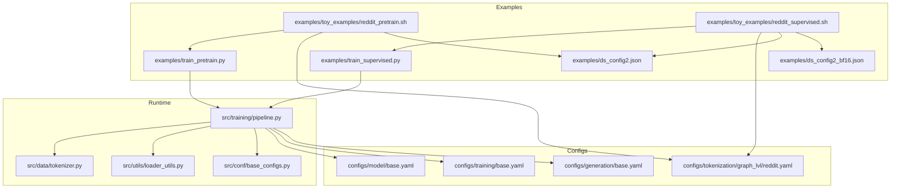
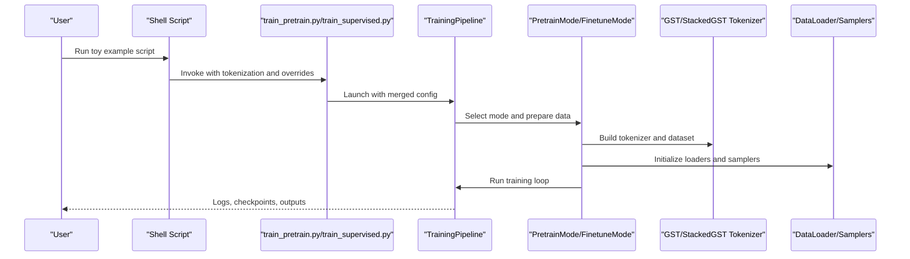
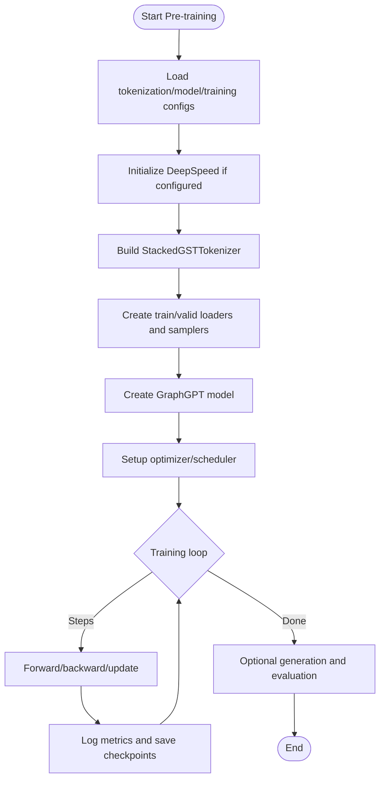
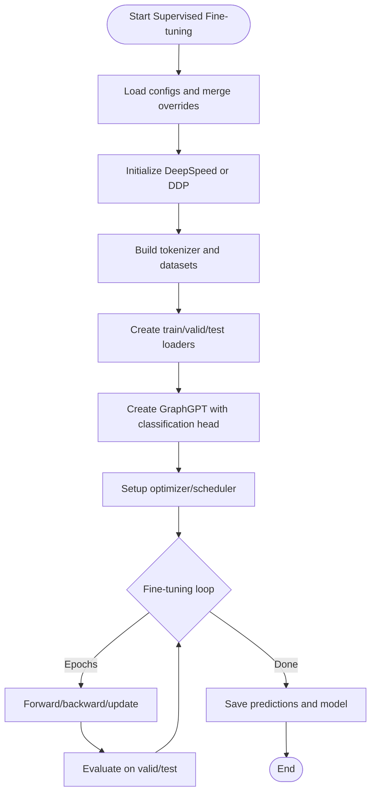
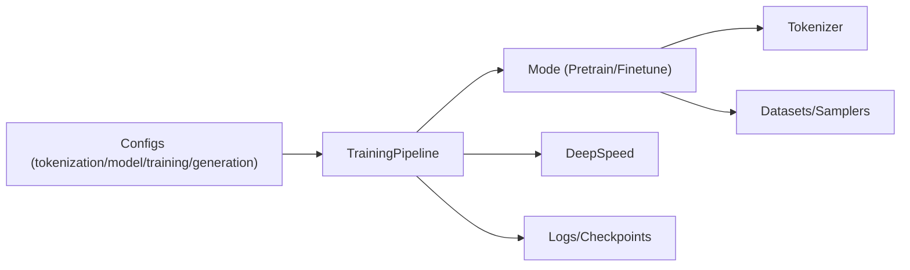

# Toy Examples

<cite>
**Referenced Files in This Document**
- [reddit_pretrain.sh](file://examples/toy_examples/reddit_pretrain.sh)
- [reddit_supervised.sh](file://examples/toy_examples/reddit_supervised.sh)
- [reddit.yaml](file://configs/tokenization/graph_lvl/reddit.yaml)
- [base.yaml (model)](file://configs/model/base.yaml)
- [base.yaml (training)](file://configs/training/base.yaml)
- [base.yaml (generation)](file://configs/generation/base.yaml)
- [ds_config2.json](file://examples/ds_config2.json)
- [ds_config2_bf16.json](file://examples/ds_config2_bf16.json)
- [train_pretrain.py](file://examples/train_pretrain.py)
- [train_supervised.py](file://examples/train_supervised.py)
- [pipeline.py](file://src/training/pipeline.py)
- [model_configs.py](file://src/conf/model/model_configs.py)
- [configuration_graphgpt.py](file://src/models/graphgpt/configuration_graphgpt.py)
- [tokenizer.py](file://src/data/tokenizer.py)
- [loader_utils.py](file://src/utils/loader_utils.py)
- [base_configs.py](file://src/conf/base_configs.py)
</cite>

## Table of Contents
1. [Introduction](#introduction)
2. [Project Structure](#project-structure)
3. [Core Components](#core-components)
4. [Architecture Overview](#architecture-overview)
5. [Detailed Component Analysis](#detailed-component-analysis)
6. [Dependency Analysis](#dependency-analysis)
7. [Performance Considerations](#performance-considerations)
8. [Troubleshooting Guide](#troubleshooting-guide)
9. [Conclusion](#conclusion)
10. [Appendices](#appendices)

## Introduction
This section provides a quick-start guide for running Graph-GPT toy examples on the Reddit Threads dataset. It focuses on two workflows:
- Pre-training with masked language modeling (MLM) on graph sequences
- Supervised fine-tuning for a downstream graph classification task

It also documents the script structure, configuration parameters, training schedules, and evaluation settings optimized for small-scale experimentation. Guidance is included for adapting parameters to different hardware and common troubleshooting tips for local development.

## Project Structure
The toy examples are organized under the examples/toy_examples directory with dedicated shell scripts for pre-training and supervised fine-tuning. Configuration files define tokenization, model architecture, training schedules, and generation settings. The training entry points are thin wrappers around a unified training pipeline.

**Diagram sources**
- [reddit_pretrain.sh:1-257](file://examples/toy_examples/reddit_pretrain.sh#L1-L257)
- [reddit_supervised.sh:1-300](file://examples/toy_examples/reddit_supervised.sh#L1-L300)
- [ds_config2.json:1-43](file://examples/ds_config2.json#L1-L43)
- [ds_config2_bf16.json:1-38](file://examples/ds_config2_bf16.json#L1-L38)
- [train_pretrain.py:1-19](file://examples/train_pretrain.py#L1-L19)
- [train_supervised.py:1-19](file://examples/train_supervised.py#L1-L19)
- [reddit.yaml:1-121](file://configs/tokenization/graph_lvl/reddit.yaml#L1-L121)
- [base.yaml (model):1-222](file://configs/model/base.yaml#L1-L222)
- [base.yaml (training):1-78](file://configs/training/base.yaml#L1-L78)
- [base.yaml (generation):1-40](file://configs/generation/base.yaml#L1-L40)
- [pipeline.py:1-258](file://src/training/pipeline.py#L1-L258)
- [tokenizer.py:1-800](file://src/data/tokenizer.py#L1-L800)
- [loader_utils.py:1-752](file://src/utils/loader_utils.py#L1-L752)
- [base_configs.py:1-302](file://src/conf/base_configs.py#L1-L302)

**Section sources**
- [reddit_pretrain.sh:1-257](file://examples/toy_examples/reddit_pretrain.sh#L1-L257)
- [reddit_supervised.sh:1-300](file://examples/toy_examples/reddit_supervised.sh#L1-L300)
- [train_pretrain.py:1-19](file://examples/train_pretrain.py#L1-L19)
- [train_supervised.py:1-19](file://examples/train_supervised.py#L1-L19)

## Core Components
- Tokenization configuration for Reddit Threads:
  - Tokenizer class: StackedGSTTokenizer
  - Dataset source: TUDataset/reddit_threads
  - Structure and semantics tokens are defined for graph-level tokenization
- Model configuration:
  - GraphGPT architecture with modular sub-configs for dropout, graph input stacking, pretraining heads, and finetuning heads
- Training configuration:
  - Pre-training schedule in tokens, optimizer settings, and DeepSpeed integration
  - Supervised training schedule in epochs, optimizer settings, and evaluation hooks
- Generation configuration:
  - Diffusion-based generation settings for pre-training evaluation

Key parameter sets for small-scale experimentation:
- Pre-training (toy):
  - Batch size: 128 per worker
  - Total tokens: 1e8
  - Warmup tokens: 1e7
  - Model: tiny/tiny6 (hidden_size and num_hidden_layers vary)
  - Dropout: disabled by default in toy scripts
- Supervised (toy):
  - Batch size: 256
  - Epochs: 16
  - Warmup epochs: ~30%
  - Model: tiny (adjustable via model_name)
  - Optimizer: Adam-like with configurable weight decay and eps

**Section sources**
- [reddit.yaml:1-121](file://configs/tokenization/graph_lvl/reddit.yaml#L1-L121)
- [base.yaml (model):1-222](file://configs/model/base.yaml#L1-L222)
- [base.yaml (training):1-78](file://configs/training/base.yaml#L1-L78)
- [base.yaml (generation):1-40](file://configs/generation/base.yaml#L1-L40)
- [reddit_pretrain.sh:26-68](file://examples/toy_examples/reddit_pretrain.sh#L26-L68)
- [reddit_supervised.sh:27-77](file://examples/toy_examples/reddit_supervised.sh#L27-L77)

## Architecture Overview
The unified training pipeline orchestrates shared setup and delegates mode-specific behavior to pre-training or fine-tuning modes. Scripts pass command-line overrides to the Hydra-configured training entry points, which construct the pipeline and run the appropriate mode.

**Diagram sources**
- [train_pretrain.py:1-19](file://examples/train_pretrain.py#L1-L19)
- [train_supervised.py:1-19](file://examples/train_supervised.py#L1-L19)
- [pipeline.py:60-96](file://src/training/pipeline.py#L60-L96)
- [tokenizer.py:585-612](file://src/data/tokenizer.py#L585-L612)
- [loader_utils.py:556-644](file://src/utils/loader_utils.py#L556-L644)

## Detailed Component Analysis

### Pre-training Workflow (Reddit Threads)
- Purpose: Train GraphGPT with masked language modeling on graph Eulerian sequences generated from Reddit Threads graphs.
- Data and Tokenization:
  - Tokenizer class: StackedGSTTokenizer
  - Dataset: TUDataset/reddit_threads
  - Structure tokens include node, edge, and graph summary tokens; semantics tokens are reserved for attributes
- Model:
  - GraphGPT with configurable hidden_size and num_hidden_layers via model_name (tiny/tiny6/mini/small/etc.)
  - Dropout settings are configurable and disabled by default in toy scripts
- Training:
  - Schedule: total_tokens and warmup_tokens drive step counts
  - Optimizer: configurable learning rate, weight decay, eps, max_grad_norm
  - DeepSpeed: enabled via ds_config2.json with fp16/bf16 variants
- Evaluation:
  - Generation enabled with configurable algorithm and parallelism

**Diagram sources**
- [reddit_pretrain.sh:1-257](file://examples/toy_examples/reddit_pretrain.sh#L1-L257)
- [base.yaml (training):24-61](file://configs/training/base.yaml#L24-L61)
- [ds_config2.json:1-43](file://examples/ds_config2.json#L1-L43)
- [tokenizer.py:585-612](file://src/data/tokenizer.py#L585-L612)
- [loader_utils.py:556-607](file://src/utils/loader_utils.py#L556-L607)

**Section sources**
- [reddit_pretrain.sh:1-257](file://examples/toy_examples/reddit_pretrain.sh#L1-L257)
- [base.yaml (training):1-78](file://configs/training/base.yaml#L1-L78)
- [ds_config2.json:1-43](file://examples/ds_config2.json#L1-L43)
- [tokenizer.py:585-612](file://src/data/tokenizer.py#L585-L612)
- [loader_utils.py:556-607](file://src/utils/loader_utils.py#L556-L607)

### Supervised Fine-tuning Workflow (Reddit Threads)
- Purpose: Fine-tune GraphGPT for a graph classification task on Reddit Threads.
- Data and Tokenization:
  - Same tokenizer and dataset as pre-training
- Model:
  - GraphGPT with a classification head configured via ft_head settings
- Training:
  - Schedule: epochs and warmup_epochs; batch sizes for train and eval
  - Optimizer: configurable betas, weight decay, eps, max_grad_norm
  - DeepSpeed: optional via ds_config2.json or native DDP via empty ds path
- Evaluation:
  - Save predictions and optionally hidden states for downstream analysis

**Diagram sources**
- [reddit_supervised.sh:1-300](file://examples/toy_examples/reddit_supervised.sh#L1-L300)
- [base.yaml (training):64-78](file://configs/training/base.yaml#L64-L78)
- [base.yaml (model):169-192](file://configs/model/base.yaml#L169-L192)
- [tokenizer.py:585-612](file://src/data/tokenizer.py#L585-L612)
- [loader_utils.py:610-644](file://src/utils/loader_utils.py#L610-L644)

**Section sources**
- [reddit_supervised.sh:1-300](file://examples/toy_examples/reddit_supervised.sh#L1-L300)
- [base.yaml (training):1-78](file://configs/training/base.yaml#L1-L78)
- [base.yaml (model):169-192](file://configs/model/base.yaml#L169-L192)
- [loader_utils.py:610-644](file://src/utils/loader_utils.py#L610-L644)

### Script Structure and Parameter Explanations
- Tokenization:
  - tokenizer_class: StackedGSTTokenizer
  - data_dir and dataset: TUDataset/reddit_threads
  - structure and semantics token definitions for graph-level tokenization
- Model:
  - model_type: graphgpt
  - model_name: selects hidden_size and num_hidden_layers presets
  - stack_method and stacked_feat_agg_method: graph input stacking strategy
  - dropout_settings: attention_dropout, path_dropout, embed_dropout, mlp_dropout
  - layer_scale_init_value: optional layer scaling initialization
- Training:
  - Pre-training: total_tokens, warmup_tokens, logging_steps, samples_per_saving
  - Supervised: epochs, warmup_epochs, batch_size, batch_size_eval, eval intervals
  - Optimizer: lr, weight_decay, eps, max_grad_norm, betas (supervised), EMA options
  - DeepSpeed: deepspeed_conf_file path and stage 2 configuration
- Generation:
  - alg: maskgit_plus or others
  - steps, temperature, parallel_gen

**Section sources**
- [reddit.yaml:1-121](file://configs/tokenization/graph_lvl/reddit.yaml#L1-L121)
- [reddit_pretrain.sh:3-68](file://examples/toy_examples/reddit_pretrain.sh#L3-L68)
- [reddit_supervised.sh:3-77](file://examples/toy_examples/reddit_supervised.sh#L3-L77)
- [base.yaml (generation):1-40](file://configs/generation/base.yaml#L1-L40)

### Execution Instructions
- Prerequisites:
  - Install dependencies and ensure CUDA/NCCL availability if using DeepSpeed
  - Prepare data directory with TUDataset/reddit_threads
- Pre-training:
  - Run the pre-training script to train on Reddit Threads with MLM
  - Adjust model_name to tiny/tiny6 for smaller memory footprint
  - Optionally switch to bf16 DeepSpeed config for mixed precision
- Supervised fine-tuning:
  - Run the supervised script after pre-training or directly with a checkpoint
  - Configure task_type and classification head parameters for the downstream task
- Outputs:
  - Model checkpoints and logs saved under the configured output_dir

**Section sources**
- [reddit_pretrain.sh:253-257](file://examples/toy_examples/reddit_pretrain.sh#L253-L257)
- [reddit_supervised.sh:296-300](file://examples/toy_examples/reddit_supervised.sh#L296-L300)

### Expected Performance Characteristics
- Pre-training:
  - Training speed scales with batch size and model size; smaller model_name presets (tiny/tiny6) reduce memory usage
  - Total tokens and warmup tokens determine convergence and learning rate schedule
- Supervised:
  - Accuracy improves with sufficient epochs; warmup_epochs help stabilize early training
  - Larger batch sizes can improve throughput but require proportionally more memory

[No sources needed since this section provides general guidance]

## Dependency Analysis
The training pipeline composes configurations, initializes tokenizers and datasets, builds the model, and runs the chosen training mode. DeepSpeed integration is controlled by the training configuration and script overrides.

**Diagram sources**
- [base_configs.py:187-193](file://src/conf/base_configs.py#L187-L193)
- [pipeline.py:15-96](file://src/training/pipeline.py#L15-L96)
- [tokenizer.py:585-612](file://src/data/tokenizer.py#L585-L612)
- [loader_utils.py:556-644](file://src/utils/loader_utils.py#L556-L644)

**Section sources**
- [base_configs.py:187-193](file://src/conf/base_configs.py#L187-L193)
- [pipeline.py:15-96](file://src/training/pipeline.py#L15-L96)

## Performance Considerations
- Reduce model size:
  - Use tiny/tiny6 presets to fit limited GPU memory
- Adjust batch size:
  - Increase micro-batch size per GPU in DeepSpeed config for larger effective batch
- Mixed precision:
  - Prefer bf16 or fp16 DeepSpeed configs for faster training
- Data loading:
  - Tune num_workers and batch_size_eval to balance throughput and memory
- Logging and saving:
  - samples_per_saving and logging_steps control checkpoint frequency and overhead

[No sources needed since this section provides general guidance]

## Troubleshooting Guide
Common issues and resolutions:
- Out-of-memory errors:
  - Reduce batch_size or use smaller model_name presets
  - Switch to bf16 DeepSpeed config for memory savings
- Missing data:
  - Ensure TUDataset/reddit_threads is present in the expected data_dir
- DeepSpeed initialization failures:
  - Verify NCCL environment and GPU visibility
  - Confirm deepspeed_conf_file path and stage configuration
- Tokenization errors:
  - Check tokenizer class and structure/semantics token definitions in tokenization config
- Distributed training issues:
  - Ensure WORLD_SIZE and RANK are set appropriately for multi-GPU runs

**Section sources**
- [reddit_pretrain.sh:57-58](file://examples/toy_examples/reddit_pretrain.sh#L57-L58)
- [ds_config2.json:1-43](file://examples/ds_config2.json#L1-L43)
- [ds_config2_bf16.json:1-38](file://examples/ds_config2_bf16.json#L1-L38)
- [reddit.yaml:1-121](file://configs/tokenization/graph_lvl/reddit.yaml#L1-L121)
- [loader_utils.py:134-159](file://src/utils/loader_utils.py#L134-L159)

## Conclusion
The Reddit Threads toy examples provide a streamlined path to experiment with Graph-GPT’s pre-training and supervised fine-tuning on graph-structured data. By adjusting model_name, batch sizes, and DeepSpeed configurations, you can tailor the workflows to your hardware and quickly iterate on experiments. Use the provided scripts and configuration files as starting points, and adapt parameters for your specific needs.

[No sources needed since this section summarizes without analyzing specific files]

## Appendices

### Appendix A: Parameter Quick Reference
- Tokenization:
  - tokenizer_class: StackedGSTTokenizer
  - data_dir: ../data/TUDataset
  - dataset: reddit_threads
- Model:
  - model_type: graphgpt
  - model_name: tiny/tiny6/mini/small/medium/base/base24/base48/large/large48/xlarge/xlarge48/xxlarge
  - stack_method: short/long
  - stacked_feat_agg_method: sum/gated
  - dropout_settings: attention_dropout, path_dropout, embed_dropout, mlp_dropout
- Pre-training:
  - total_tokens, warmup_tokens, logging_steps, samples_per_saving
  - optimizer: lr, weight_decay, eps, max_grad_norm
  - DeepSpeed: deepspeed_conf_file
- Supervised:
  - epochs, warmup_epochs, batch_size, batch_size_eval
  - optimizer: betas, weight_decay, eps, max_grad_norm
  - DeepSpeed: empty for DDP, path for ZeRO stage 2

**Section sources**
- [reddit.yaml:1-121](file://configs/tokenization/graph_lvl/reddit.yaml#L1-L121)
- [base.yaml (model):1-222](file://configs/model/base.yaml#L1-L222)
- [base.yaml (training):1-78](file://configs/training/base.yaml#L1-L78)
- [reddit_pretrain.sh:26-68](file://examples/toy_examples/reddit_pretrain.sh#L26-L68)
- [reddit_supervised.sh:27-77](file://examples/toy_examples/reddit_supervised.sh#L27-L77)
