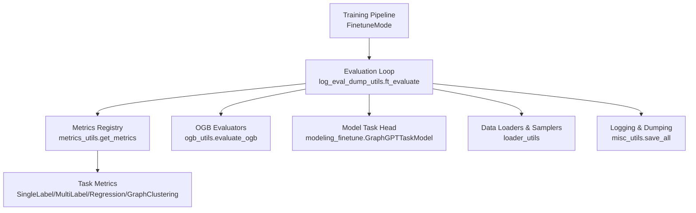
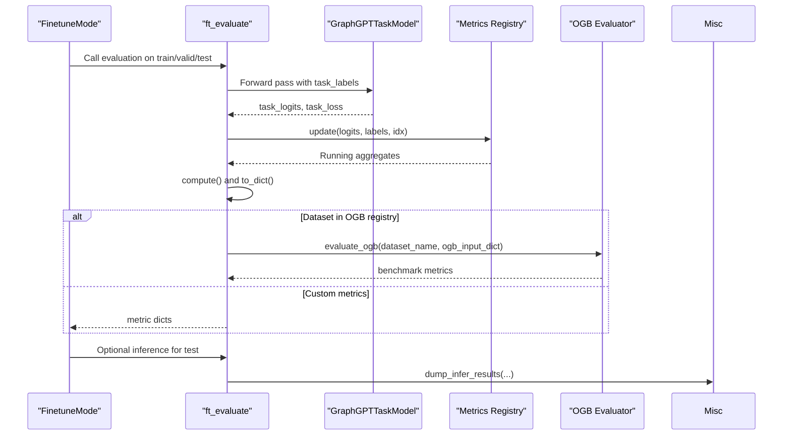
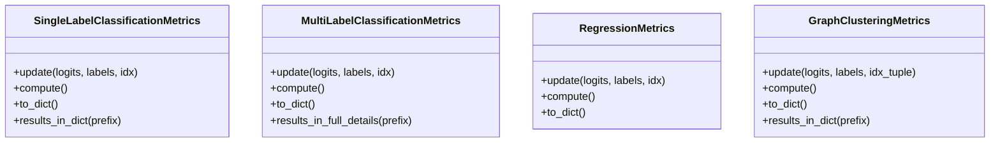
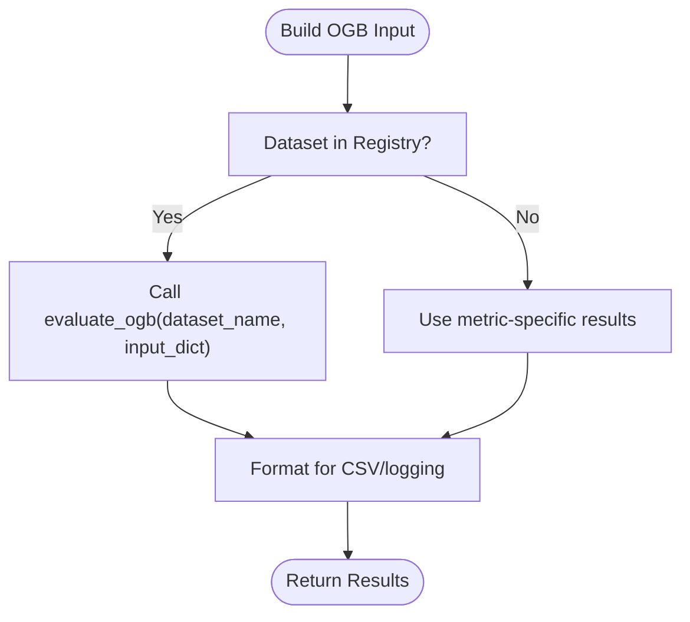
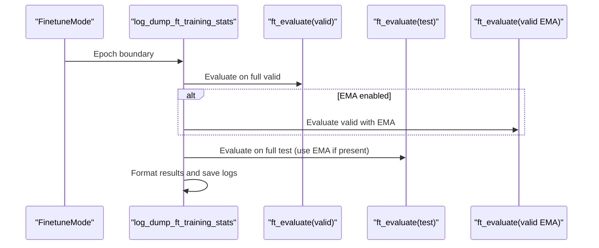
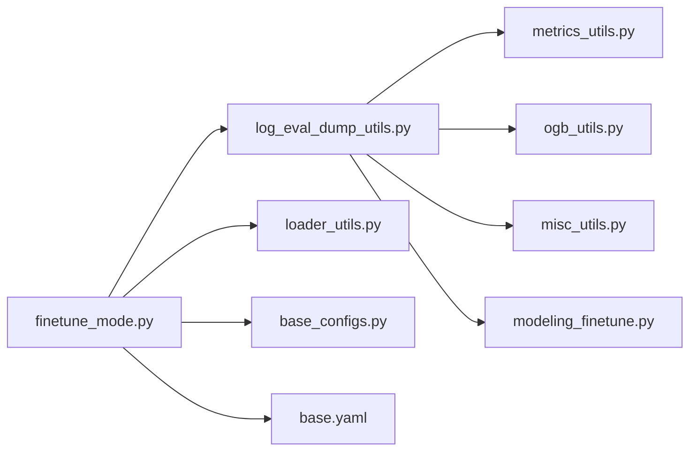

# Fine-tune Evaluation & Metrics

<cite>
**Referenced Files in This Document**
- [metrics_utils.py](file://src/utils/metrics_utils.py)
- [log_eval_dump_utils.py](file://src/utils/log_eval_dump_utils.py)
- [ogb_utils.py](file://src/utils/ogb_utils.py)
- [finetune_mode.py](file://src/training/finetune_mode.py)
- [modeling_finetune.py](file://src/models/graphgpt/modeling_finetune.py)
- [loader_utils.py](file://src/utils/loader_utils.py)
- [misc_utils.py](file://src/utils/misc_utils.py)
- [base.yaml](file://configs/training/base.yaml)
- [base_configs.py](file://src/conf/base_configs.py)
- [train_supervised.py](file://examples/train_supervised.py)
- [ogbg_molhiv.yaml](file://configs/tokenization/graph_lvl/ogbg_molhiv.yaml)
</cite>

## Table of Contents
1. [Introduction](#introduction)
2. [Project Structure](#project-structure)
3. [Core Components](#core-components)
4. [Architecture Overview](#architecture-overview)
5. [Detailed Component Analysis](#detailed-component-analysis)
6. [Dependency Analysis](#dependency-analysis)
7. [Performance Considerations](#performance-considerations)
8. [Troubleshooting Guide](#troubleshooting-guide)
9. [Conclusion](#conclusion)
10. [Appendices](#appendices)

## Introduction
This document explains the fine-tune evaluation and metrics computation pipeline in the project. It covers evaluation workflows for classification, regression, and OGB benchmark tasks; validation and test evaluation; prediction dumping; and result analysis. It also documents metric calculation methods, performance scoring, comparison against baselines, integration with external evaluation frameworks, and best practices for result interpretation and reporting.

## Project Structure
The evaluation and metrics system spans several modules:
- Training orchestration and evaluation scheduling
- Model task head and loss computation
- Metric computation and aggregation
- OGB benchmark evaluators
- Data loading and sampler utilities
- Logging, dumping, and distributed gathering

**Diagram sources**
- [finetune_mode.py:333-350](file://src/training/finetune_mode.py#L333-L350)
- [log_eval_dump_utils.py:78-163](file://src/utils/log_eval_dump_utils.py#L78-L163)
- [metrics_utils.py:11-14](file://src/utils/metrics_utils.py#L11-L14)
- [ogb_utils.py:8-10](file://src/utils/ogb_utils.py#L8-L10)
- [modeling_finetune.py:64-326](file://src/models/graphgpt/modeling_finetune.py#L64-L326)
- [loader_utils.py:40-53](file://src/utils/loader_utils.py#L40-L53)
- [misc_utils.py:124-176](file://src/utils/misc_utils.py#L124-L176)

**Section sources**
- [finetune_mode.py:333-350](file://src/training/finetune_mode.py#L333-L350)
- [log_eval_dump_utils.py:78-163](file://src/utils/log_eval_dump_utils.py#L78-L163)
- [metrics_utils.py:11-14](file://src/utils/metrics_utils.py#L11-L14)
- [ogb_utils.py:8-10](file://src/utils/ogb_utils.py#L8-L10)
- [modeling_finetune.py:64-326](file://src/models/graphgpt/modeling_finetune.py#L64-L326)
- [loader_utils.py:40-53](file://src/utils/loader_utils.py#L40-L53)
- [misc_utils.py:124-176](file://src/utils/misc_utils.py#L124-L176)

## Core Components
- Task metrics registry and implementations:
  - Single-label classification with AUROC and accuracy
  - Multi-label classification with per-task AUROC and macro AUROC
  - Regression with MSE and MAE
  - Graph clustering with accuracy, recall, precision, and F1-like EMA score
- OGB benchmark evaluators for node/link/graph tasks
- Evaluation loop orchestrating forward passes, metric updates, distributed gathering, and OGB evaluation
- Logging and prediction dumping utilities

**Section sources**
- [metrics_utils.py:16-348](file://src/utils/metrics_utils.py#L16-L348)
- [ogb_utils.py:13-214](file://src/utils/ogb_utils.py#L13-L214)
- [log_eval_dump_utils.py:78-163](file://src/utils/log_eval_dump_utils.py#L78-L163)

## Architecture Overview
End-to-end evaluation flow for supervised fine-tuning:

**Diagram sources**
- [finetune_mode.py:683-733](file://src/training/finetune_mode.py#L683-L733)
- [log_eval_dump_utils.py:78-163](file://src/utils/log_eval_dump_utils.py#L78-L163)
- [modeling_finetune.py:236-326](file://src/models/graphgpt/modeling_finetune.py#L236-L326)
- [ogb_utils.py:13-214](file://src/utils/ogb_utils.py#L13-L214)
- [misc_utils.py:124-176](file://src/utils/misc_utils.py#L124-L176)

## Detailed Component Analysis

### Task Types and Metrics
- Single-label classification:
  - Uses AUROC and accuracy; supports binary and multi-class
  - Aggregates predictions, labels, and indices; exposes structured results
- Multi-label classification:
  - Per-task AUROC vector and macro AUROC mean
  - Aggregates logits and labels per task dimension
- Regression:
  - MSE and MAE for single-output regression
  - Aggregates flattened predictions and targets
- Graph clustering:
  - Node-level clustering accuracy on valid-labeled nodes
  - Per-graph recall and precision; computes EMA F1-like score

**Diagram sources**
- [metrics_utils.py:16-348](file://src/utils/metrics_utils.py#L16-L348)

**Section sources**
- [metrics_utils.py:16-348](file://src/utils/metrics_utils.py#L16-L348)

### OGB Benchmark Integration
- Registry-driven evaluators for node/link/graph tasks
- Handles reshaping and reformatting of predictions for OGB APIs
- Supports ROC-AUC averaging, hit ranking, and MRR computations

**Diagram sources**
- [ogb_utils.py:13-214](file://src/utils/ogb_utils.py#L13-L214)
- [log_eval_dump_utils.py:153-162](file://src/utils/log_eval_dump_utils.py#L153-L162)

**Section sources**
- [ogb_utils.py:13-214](file://src/utils/ogb_utils.py#L13-L214)
- [log_eval_dump_utils.py:153-162](file://src/utils/log_eval_dump_utils.py#L153-L162)

### Validation and Test Evaluation Workflow
- Partial training set evaluation for quick feedback
- Full validation and test evaluation with optional EMA model
- Distributed tensor gathering and NaN checks
- CSV-ready result formatting and logging

**Diagram sources**
- [finetune_mode.py:683-733](file://src/training/finetune_mode.py#L683-L733)
- [log_eval_dump_utils.py:648-800](file://src/utils/log_eval_dump_utils.py#L648-L800)

**Section sources**
- [finetune_mode.py:683-733](file://src/training/finetune_mode.py#L683-L733)
- [log_eval_dump_utils.py:648-800](file://src/utils/log_eval_dump_utils.py#L648-L800)

### Prediction Dumping and Result Analysis
- Saves predictions and labels for train/valid/test when configured
- Supports dumping logits and hidden states for downstream analysis
- Provides CSV-formatted summaries for benchmark metrics

**Section sources**
- [log_eval_dump_utils.py:783-799](file://src/utils/log_eval_dump_utils.py#L783-L799)
- [misc_utils.py:124-176](file://src/utils/misc_utils.py#L124-L176)

### Metric Calculation Methods and Scoring
- AUROC/Accuracy for classification
- Macro AUROC for multi-label
- MSE/MAE for regression
- Recall/Precision/Accuracy/F1-like EMA for clustering
- Comparison logic selects best model based on target metric directionality

**Section sources**
- [metrics_utils.py:192-209](file://src/utils/metrics_utils.py#L192-L209)
- [metrics_utils.py:16-348](file://src/utils/metrics_utils.py#L16-L348)

### Integration with External Evaluation Frameworks
- OGB node/link/graph evaluators invoked via registry
- Custom metric fallback when dataset is not registered
- CSV formatting helpers for standardized reporting

**Section sources**
- [ogb_utils.py:13-214](file://src/utils/ogb_utils.py#L13-L214)
- [log_eval_dump_utils.py:153-162](file://src/utils/log_eval_dump_utils.py#L153-L162)

### Examples: Evaluating Fine-tuned Models
- Supervised training entrypoint initializes the pipeline and runs evaluation loops
- Example configuration demonstrates graph-level task setup for OGB datasets

**Section sources**
- [train_supervised.py:12-19](file://examples/train_supervised.py#L12-L19)
- [ogbg_molhiv.yaml:1-116](file://configs/tokenization/graph_lvl/ogbg_molhiv.yaml#L1-L116)

## Dependency Analysis
Key dependencies among evaluation components:

**Diagram sources**
- [finetune_mode.py:333-350](file://src/training/finetune_mode.py#L333-L350)
- [log_eval_dump_utils.py:78-163](file://src/utils/log_eval_dump_utils.py#L78-L163)
- [metrics_utils.py:11-14](file://src/utils/metrics_utils.py#L11-L14)
- [ogb_utils.py:8-10](file://src/utils/ogb_utils.py#L8-L10)
- [misc_utils.py:124-176](file://src/utils/misc_utils.py#L124-L176)
- [modeling_finetune.py:64-326](file://src/models/graphgpt/modeling_finetune.py#L64-L326)
- [loader_utils.py:40-53](file://src/utils/loader_utils.py#L40-L53)
- [base_configs.py:118-129](file://src/conf/base_configs.py#L118-L129)
- [base.yaml:70-78](file://configs/training/base.yaml#L70-L78)

**Section sources**
- [finetune_mode.py:333-350](file://src/training/finetune_mode.py#L333-L350)
- [log_eval_dump_utils.py:78-163](file://src/utils/log_eval_dump_utils.py#L78-L163)
- [metrics_utils.py:11-14](file://src/utils/metrics_utils.py#L11-L14)
- [ogb_utils.py:8-10](file://src/utils/ogb_utils.py#L8-L10)
- [misc_utils.py:124-176](file://src/utils/misc_utils.py#L124-L176)
- [modeling_finetune.py:64-326](file://src/models/graphgpt/modeling_finetune.py#L64-L326)
- [loader_utils.py:40-53](file://src/utils/loader_utils.py#L40-L53)
- [base_configs.py:118-129](file://src/conf/base_configs.py#L118-L129)
- [base.yaml:70-78](file://configs/training/base.yaml#L70-L78)

## Performance Considerations
- Distributed evaluation: tensor gathering across GPUs with NaN checks
- Batched evaluation with reduced workers for memory efficiency
- Early stopping and best-model selection based on configurable metrics
- Logging frequency and CSV output for reproducible reporting

[No sources needed since this section provides general guidance]

## Troubleshooting Guide
- NaN handling in distributed gathering: monitor counts and shapes during tensor collection
- OGB evaluator exceptions: ensure sufficient positive/negative samples for AUROC; handle missing labels
- Metric directionality: ensure the comparison logic aligns with intended optimization (minimizing loss vs. maximizing AUROC/accuracy)
- Checkpoint loading: confirm correct EMA usage and model state loading paths

**Section sources**
- [log_eval_dump_utils.py:146-151](file://src/utils/log_eval_dump_utils.py#L146-L151)
- [ogb_utils.py:24-27](file://src/utils/ogb_utils.py#L24-L27)
- [metrics_utils.py:192-209](file://src/utils/metrics_utils.py#L192-L209)
- [misc_utils.py:161-200](file://src/utils/misc_utils.py#L161-L200)

## Conclusion
The evaluation pipeline integrates task-specific metrics, OGB benchmarks, and robust logging/dumping utilities. It supports distributed evaluation, prediction dumping, and best-practice result reporting. By leveraging the registry pattern for OGB evaluators and the metrics classes, the system remains extensible for new tasks and datasets.

[No sources needed since this section summarizes without analyzing specific files]

## Appendices

### Best Practices and Reporting Standards
- Always specify metric directionality for best-model selection
- Prefer macro averages for multi-label tasks; report per-task metrics when needed
- Use CSV exports for standardized reporting across experiments
- Enable EMA evaluation on validation/test when available
- Monitor NaNs and tensor shapes during distributed gathering

[No sources needed since this section provides general guidance]
