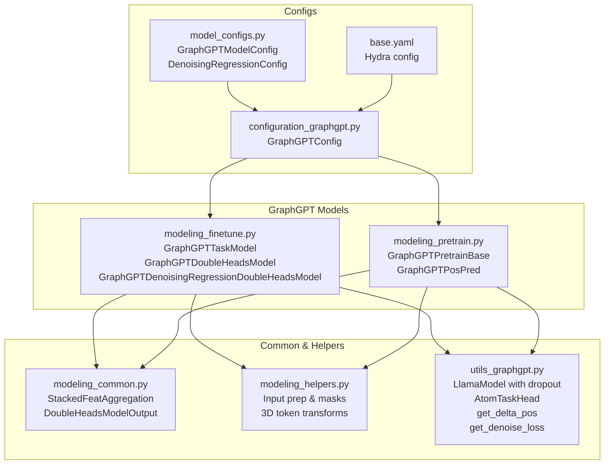
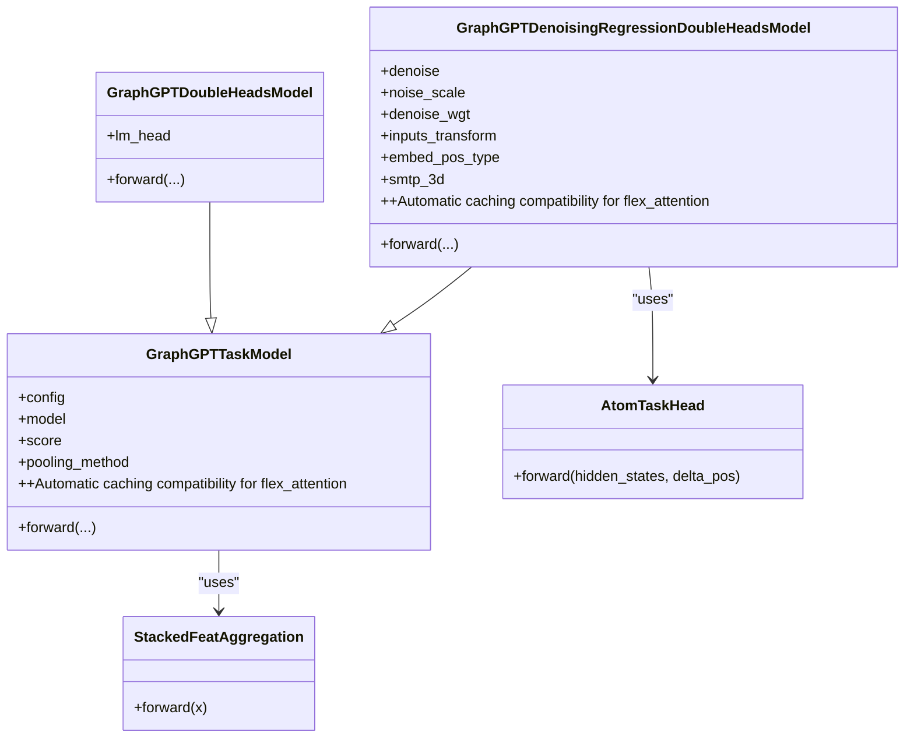
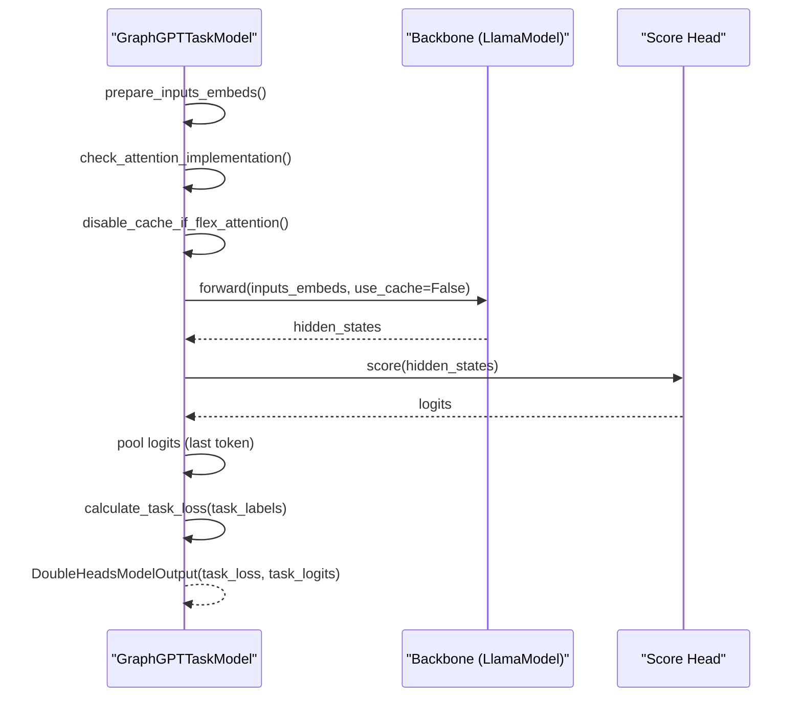
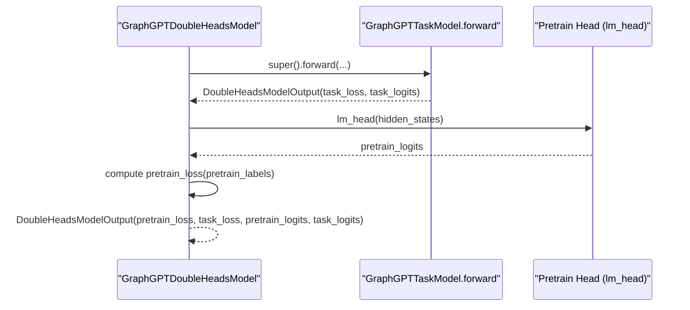
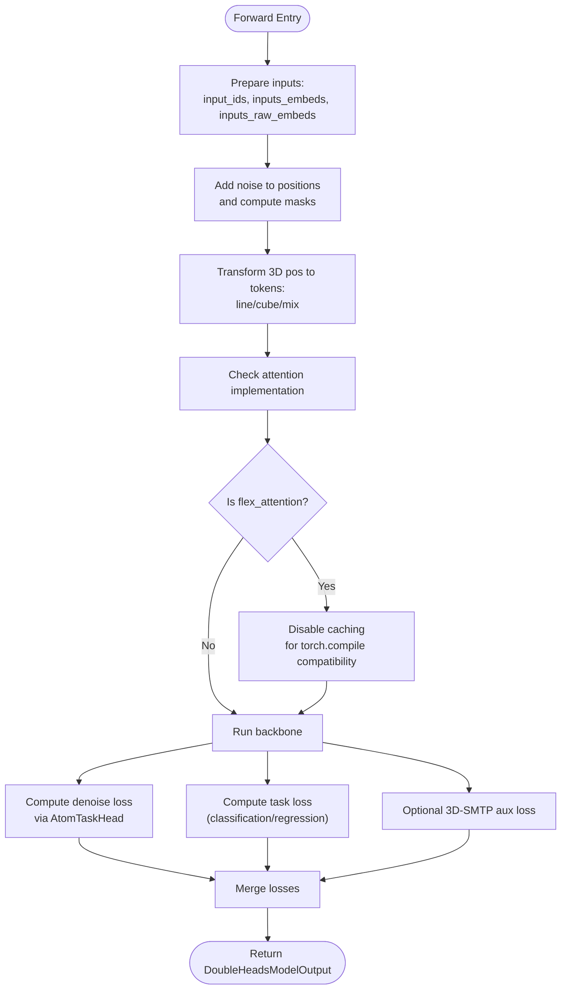
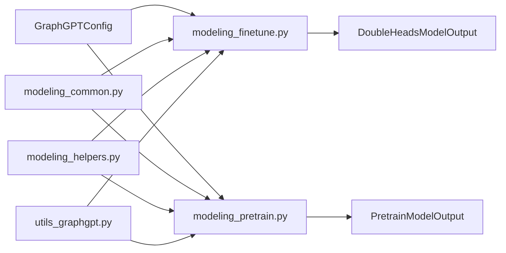

# Fine-tune Model Architecture

<cite>
**Referenced Files in This Document**
- [modeling_finetune.py](file://src/models/graphgpt/modeling_finetune.py)
- [modeling_pretrain.py](file://src/models/graphgpt/modeling_pretrain.py)
- [configuration_graphgpt.py](file://src/models/graphgpt/configuration_graphgpt.py)
- [modeling_common.py](file://src/models/graphgpt/modeling_common.py)
- [modeling_helpers.py](file://src/models/graphgpt/modeling_helpers.py)
- [utils_graphgpt.py](file://src/models/graphgpt/utils_graphgpt.py)
- [model_configs.py](file://src/conf/model/model_configs.py)
- [base.yaml](file://configs/model/base.yaml)
- [train_supervised.py](file://examples/train_supervised.py)
</cite>

## Update Summary
**Changes Made**
- Updated GraphGPTTaskModel forward method documentation to include explicit caching disablement for flex_attention implementations
- Added performance considerations section covering torch.compile compatibility with flex_attention
- Updated troubleshooting guide to address flex_attention caching issues
- Enhanced architectural diagrams to show caching behavior differences

## Table of Contents
1. [Introduction](#introduction)
2. [Project Structure](#project-structure)
3. [Core Components](#core-components)
4. [Architecture Overview](#architecture-overview)
5. [Detailed Component Analysis](#detailed-component-analysis)
6. [Dependency Analysis](#dependency-analysis)
7. [Performance Considerations](#performance-considerations)
8. [Troubleshooting Guide](#troubleshooting-guide)
9. [Conclusion](#conclusion)
10. [Appendices](#appendices)

## Introduction
This document explains the fine-tune model architecture implemented in the GraphGPT codebase, focusing on the dual-head design for supervised tasks and denoising regression. It covers:
- GraphGPTTaskModel: a task-specific head for classification/regression with automatic caching compatibility for flex_attention.
- GraphGPTDoubleHeadsModel: adds a pre-training (language modeling) head alongside the task head.
- GraphGPTDenoisingRegressionDoubleHeadsModel: adds a denoising head for 3D coordinates and optional auxiliary 3D-SMTP classification.

It documents initialization, parameter handling, adapter-like layer adaptations, and configuration parameters that govern the dual-head structure, denoising components, and positional encoding strategies. **Updated** to include explicit caching disablement for flex_attention implementations to prevent symbolic batch-dimension mismatches during torch.compile.

## Project Structure
The fine-tune models live under the GraphGPT module, with shared components for initialization, helpers, and utilities. Configuration is split into a legacy-style config class and a modern modular config.

**Diagram sources**
- [modeling_finetune.py:1-948](file://src/models/graphgpt/modeling_finetune.py#L1-L948)
- [modeling_pretrain.py:1-717](file://src/models/graphgpt/modeling_pretrain.py#L1-L717)
- [modeling_common.py:1-204](file://src/models/graphgpt/modeling_common.py#L1-L204)
- [modeling_helpers.py:1-1011](file://src/models/graphgpt/modeling_helpers.py#L1-L1011)
- [utils_graphgpt.py:1-582](file://src/models/graphgpt/utils_graphgpt.py#L1-L582)
- [configuration_graphgpt.py:1-346](file://src/models/graphgpt/configuration_graphgpt.py#L1-L346)
- [model_configs.py:1-353](file://src/conf/model/model_configs.py#L1-L353)
- [base.yaml:1-222](file://configs/model/base.yaml#L1-L222)

**Section sources**
- [modeling_finetune.py:1-948](file://src/models/graphgpt/modeling_finetune.py#L1-L948)
- [modeling_pretrain.py:1-717](file://src/models/graphgpt/modeling_pretrain.py#L1-L717)
- [configuration_graphgpt.py:1-346](file://src/models/graphgpt/configuration_graphgpt.py#L1-L346)
- [modeling_common.py:1-204](file://src/models/graphgpt/modeling_common.py#L1-L204)
- [modeling_helpers.py:1-1011](file://src/models/graphgpt/modeling_helpers.py#L1-L1011)
- [utils_graphgpt.py:1-582](file://src/models/graphgpt/utils_graphgpt.py#L1-L582)
- [model_configs.py:1-353](file://src/conf/model/model_configs.py#L1-L353)
- [base.yaml:1-222](file://configs/model/base.yaml#L1-L222)

## Core Components
- GraphGPTTaskModel: Implements a task head for classification or regression on top of a Llama backbone. Supports optional MLP head and pooling strategies. **Updated** with automatic caching compatibility for flex_attention during torch.compile.
- GraphGPTDoubleHeadsModel: Extends the task model with a pre-training head (auxiliary LM head) for multi-task training.
- GraphGPTDenoisingRegressionDoubleHeadsModel: Adds a denoising head for 3D coordinates and optional auxiliary 3D-SMTP classification. Includes positional tokenization strategies and scheduling.

Key initialization steps:
- Backbone selection with dropout support.
- Stacked feature aggregation for graph tokens.
- Task head initialization (linear or MLP).
- Denoising head initialization with attention-based force prediction.

**Section sources**
- [modeling_finetune.py:64-326](file://src/models/graphgpt/modeling_finetune.py#L64-L326)
- [modeling_finetune.py:329-423](file://src/models/graphgpt/modeling_finetune.py#L329-L423)
- [modeling_finetune.py:426-948](file://src/models/graphgpt/modeling_finetune.py#L426-L948)
- [modeling_common.py:160-204](file://src/models/graphgpt/modeling_common.py#L160-L204)

## Architecture Overview
The fine-tune architecture composes a shared Llama backbone with task-specific heads. The dual-head models share the same backbone while branching into:
- Task head: sequence-level classification/regression.
- Optional pre-training head: language modeling.
- Optional denoising head: 3D coordinate prediction with attention-weighted aggregation.

**Updated** to include automatic caching compatibility for flex_attention implementations during torch.compile.

**Diagram sources**
- [modeling_finetune.py:64-948](file://src/models/graphgpt/modeling_finetune.py#L64-L948)
- [modeling_common.py:105-143](file://src/models/graphgpt/modeling_common.py#L105-L143)
- [utils_graphgpt.py:271-338](file://src/models/graphgpt/utils_graphgpt.py#L271-L338)

## Detailed Component Analysis

### GraphGPTTaskModel
- Purpose: Provides a task head for sequence-level classification or regression on top of the Llama backbone.
- Initialization highlights:
  - Backbone selection via init_backbone with dropout-aware LlamaModel.
  - Optional embedding dropout and raw-embedding projection.
  - Stacked feature aggregation for graph tokens.
  - Task head: linear or MLP depending on config.mlp.
  - Pooling method fixed to "last" for sequence-level logits.
- **Updated** Forward flow with automatic caching compatibility:
  - Prepare inputs (token embeddings, stacked features, optional raw embeddings).
  - Run backbone to obtain hidden states.
  - **Automatic caching compatibility**: When attention implementation is set to 'flex_attention', caching is automatically disabled to prevent symbolic batch-dimension mismatches during torch.compile.
  - Compute task logits and pooled logits for evaluation.
  - Compute task loss based on problem type and loss type.

**Diagram sources**
- [modeling_finetune.py:236-326](file://src/models/graphgpt/modeling_finetune.py#L236-L326)
- [modeling_helpers.py:89-114](file://src/models/graphgpt/modeling_helpers.py#L89-L114)
- [modeling_common.py:160-169](file://src/models/graphgpt/modeling_common.py#L160-L169)

**Section sources**
- [modeling_finetune.py:64-106](file://src/models/graphgpt/modeling_finetune.py#L64-L106)
- [modeling_finetune.py:236-326](file://src/models/graphgpt/modeling_finetune.py#L236-L326)
- [modeling_common.py:160-169](file://src/models/graphgpt/modeling_common.py#L160-L169)

### GraphGPTDoubleHeadsModel
- Purpose: Extends GraphGPTTaskModel with a pre-training head (auxiliary LM head) to enable multi-task training.
- Key additions:
  - lm_head for pre-training logits.
  - Forward computes both task_loss and pretrain_loss.
  - **Updated** Automatic caching compatibility inherited from parent class.
- Integration:
  - Inherits task head logic from GraphGPTTaskModel.
  - Computes auxiliary loss when pretrain_labels are provided.

**Diagram sources**
- [modeling_finetune.py:329-423](file://src/models/graphgpt/modeling_finetune.py#L329-L423)

**Section sources**
- [modeling_finetune.py:329-423](file://src/models/graphgpt/modeling_finetune.py#L329-L423)

### GraphGPTDenoisingRegressionDoubleHeadsModel
- Purpose: Adds a denoising head for 3D coordinates and optional auxiliary 3D-SMTP classification.
- Denoising head:
  - AtomTaskHead: attention-based force prediction using pairwise delta_pos.
  - Loss: cosine distance between predicted and noisy displacements.
- Positional tokenization:
  - Line token, cube token, or mixed tokenization for 3D positions.
  - Optional positional type embedding and raw position projection.
- Scheduling and ratios:
  - Mask ratios derived from r_2d, r_3d, r_both.
  - Optional polynomial schedule for 3D-SMTP masking.
- Bi-causal option:
  - Alternative regression target for molecular energy using binary labels.
- **Updated** Forward flow with automatic caching compatibility:
  - Process 3D positions and noise masks.
  - Transform 3D positions to tokens (line/cube/mix).
  - **Automatic caching compatibility**: When attention implementation is set to 'flex_attention', caching is automatically disabled to prevent symbolic batch-dimension mismatches during torch.compile.
  - Compute denoise loss via AtomTaskHead.
  - Compute task loss and optional SMTP auxiliary loss.

**Diagram sources**
- [modeling_finetune.py:678-948](file://src/models/graphgpt/modeling_finetune.py#L678-L948)
- [utils_graphgpt.py:271-338](file://src/models/graphgpt/utils_graphgpt.py#L271-L338)
- [modeling_helpers.py:526-636](file://src/models/graphgpt/modeling_helpers.py#L526-L636)

**Section sources**
- [modeling_finetune.py:426-520](file://src/models/graphgpt/modeling_finetune.py#L426-L520)
- [modeling_finetune.py:678-948](file://src/models/graphgpt/modeling_finetune.py#L678-L948)
- [utils_graphgpt.py:271-338](file://src/models/graphgpt/utils_graphgpt.py#L271-L338)
- [modeling_helpers.py:526-636](file://src/models/graphgpt/modeling_helpers.py#L526-L636)

## Dependency Analysis
- Model initialization depends on:
  - GraphGPTConfig for backbone and head parameters.
  - Modeling helpers for input preparation, masking, and positional tokenization.
  - Utilities for dropout-enabled LlamaModel and denoising loss computation.
- Coupling:
  - GraphGPTTaskModel depends on modeling_common for backbone and stacking.
  - GraphGPTDenoisingRegressionDoubleHeadsModel depends on utils_graphgpt for AtomTaskHead and delta_pos computation.
  - All models depend on modeling_helpers for attention masks and positional transforms.

**Diagram sources**
- [configuration_graphgpt.py:1-346](file://src/models/graphgpt/configuration_graphgpt.py#L1-L346)
- [modeling_finetune.py:1-948](file://src/models/graphgpt/modeling_finetune.py#L1-L948)
- [modeling_pretrain.py:1-717](file://src/models/graphgpt/modeling_pretrain.py#L1-L717)
- [modeling_common.py:1-204](file://src/models/graphgpt/modeling_common.py#L1-L204)
- [modeling_helpers.py:1-1011](file://src/models/graphgpt/modeling_helpers.py#L1-L1011)
- [utils_graphgpt.py:1-582](file://src/models/graphgpt/utils_graphgpt.py#L1-L582)

**Section sources**
- [modeling_finetune.py:1-948](file://src/models/graphgpt/modeling_finetune.py#L1-L948)
- [modeling_pretrain.py:1-717](file://src/models/graphgpt/modeling_pretrain.py#L1-L717)
- [modeling_common.py:1-204](file://src/models/graphgpt/modeling_common.py#L1-L204)
- [modeling_helpers.py:1-1011](file://src/models/graphgpt/modeling_helpers.py#L1-L1011)
- [utils_graphgpt.py:1-582](file://src/models/graphgpt/utils_graphgpt.py#L1-L582)

## Performance Considerations
- **Updated** Torch.compile compatibility: The models now automatically disable caching when using flex_attention implementations to prevent symbolic batch-dimension mismatches during torch.compile. This ensures stable compilation and inference with dynamic attention patterns.
- Dropout-enabled backbone: The LlamaModel is replaced with a dropout-aware variant when any of the dropout settings are active, enabling stochastic depth and regularization.
- Attention scheduling: 3D-SMTP masking can be scheduled with a polynomial power to reduce computational cost during early epochs.
- Position tokenization trade-offs: Line tokenization aggregates per-coordinate embeddings; cube tokenization uses a 3D histogram; mixed tokenization combines both. Choose based on memory and accuracy needs.
- Auxiliary losses: SMTP auxiliary loss adds compute; tune smtp_wgt and scheduler power to balance training stability.

**Section sources**
- [modeling_finetune.py:275-279](file://src/models/graphgpt/modeling_finetune.py#L275-L279)
- [modeling_finetune.py:852-856](file://src/models/graphgpt/modeling_finetune.py#L852-L856)
- [modeling_pretrain.py:205-209](file://src/models/graphgpt/modeling_pretrain.py#L205-L209)

## Troubleshooting Guide
- **Updated** Flex_attention caching issues: When using flex_attention with torch.compile, caching is automatically disabled to prevent symbolic batch-dimension mismatches. This prevents flex_decoding assertion failures where Bq == Bkv conditions fail.
- Pooling assertion failures: The task model asserts pooling_method equals "last"; ensure configuration aligns with this requirement.
- Attention mask issues: Non-causal attention requires proper mask expansion; ensure attention_mask shapes are handled by helper functions.
- Position tokenization mismatches: Verify num_bins_line/num_bins_cube and pos_agg_method match the chosen inputs_transform.
- Denoising loss NaNs: Ensure noise_mask and noise are correctly computed and that tgt_count avoids division by zero.

**Section sources**
- [modeling_finetune.py:275-279](file://src/models/graphgpt/modeling_finetune.py#L275-L279)
- [modeling_finetune.py:852-856](file://src/models/graphgpt/modeling_finetune.py#L852-L856)
- [modeling_pretrain.py:205-209](file://src/models/graphgpt/modeling_pretrain.py#L205-L209)
- [modeling_finetune.py:288-289](file://src/models/graphgpt/modeling_finetune.py#L288-L289)
- [modeling_helpers.py:38-64](file://src/models/graphgpt/modeling_helpers.py#L38-L64)
- [modeling_helpers.py:526-636](file://src/models/graphgpt/modeling_helpers.py#L526-L636)
- [utils_graphgpt.py:249-268](file://src/models/graphgpt/utils_graphgpt.py#L249-L268)

## Conclusion
The GraphGPT fine-tune models provide a flexible dual-head framework with enhanced compatibility:
- GraphGPTTaskModel offers a robust task head for classification/regression with automatic caching compatibility for flex_attention during torch.compile.
- GraphGPTDoubleHeadsModel enables multi-task training with a pre-training head.
- GraphGPTDenoisingRegressionDoubleHeadsModel integrates 3D denoising and optional auxiliary 3D-SMTP classification with configurable positional tokenization and scheduling.

Initialization, configuration, and helper utilities ensure consistent behavior across tasks and efficient training with modern attention implementations.

## Appendices

### Model Configuration Parameters
- Core Llama/Transformer parameters: hidden_size, num_hidden_layers, num_attention_heads, etc.
- GraphGPT-specific:
  - Stacked feature aggregation: stacked_feat, stacked_feat_agg_method, embed_dim.
  - Pooling and task head: pooling_method, mlp, dropout, loss_type, num_labels.
  - Denoising head: noise_scale, denoise_wgt, denoise_schedule_pow, bi_causal, r_2d, r_3d, r_both, add_pos_type, inputs_transform, num_bins_line, num_bins_cube, dn_pos_range, dn_use_pos_proj, smtp_3d, smtp_wgt, smtp_3d_scheduler_power, smtp_denoise, smtp_vocab, dn_smtp_2d_rate, smtp_2d_scheduler_power.

**Section sources**
- [configuration_graphgpt.py:26-200](file://src/models/graphgpt/configuration_graphgpt.py#L26-L200)
- [model_configs.py:174-236](file://src/conf/model/model_configs.py#L174-L236)
- [base.yaml:128-168](file://configs/model/base.yaml#L128-L168)

### Embedding Dimensions and Output Heads
- Embedding dropout and raw embedding projection:
  - Optional raw_embed_dropout and embed_proj when embed_dim > 0.
- Task head:
  - Linear or MLP head projecting to num_labels.
- Denoising head:
  - AtomTaskHead predicts per-node forces using attention-weighted delta_pos.
- Optional auxiliary heads:
  - Pre-training LM head (lm_head).
  - SMTP classification head (smtp_head) when smtp_3d is enabled.

**Section sources**
- [modeling_finetune.py:76-99](file://src/models/graphgpt/modeling_finetune.py#L76-L99)
- [modeling_finetune.py:437-519](file://src/models/graphgpt/modeling_finetune.py#L437-L519)
- [utils_graphgpt.py:271-338](file://src/models/graphgpt/utils_graphgpt.py#L271-L338)

### Layer Adaptation Strategies
- Dropout-enabled LlamaModel: Uses LlamaDecoderLayer with path dropout and layer-scale initialization when dropout settings are active.
- Stacked feature aggregation: Gated or sum-based aggregation controlled by stacked_feat_agg_method.
- Adapter-like raw embedding projection: Optional layernorm, dropout, and linear projection when embed_dim > 0.

**Section sources**
- [utils_graphgpt.py:69-105](file://src/models/graphgpt/utils_graphgpt.py#L69-L105)
- [modeling_common.py:105-143](file://src/models/graphgpt/modeling_common.py#L105-L143)
- [modeling_common.py:172-184](file://src/models/graphgpt/modeling_common.py#L172-L184)

### Model Instantiation and Configuration Examples
- Example training entrypoint uses Hydra to load configuration and launch the fine-tune pipeline.
- Configuration files define modular sub-configurations for dropout, graph input, geometric input, pretraining, position pretraining, denoising, and fine-tuning heads.

**Section sources**
- [train_supervised.py:12-19](file://examples/train_supervised.py#L12-L19)
- [base.yaml:1-222](file://configs/model/base.yaml#L1-L222)
- [model_configs.py:246-353](file://src/conf/model/model_configs.py#L246-L353)
