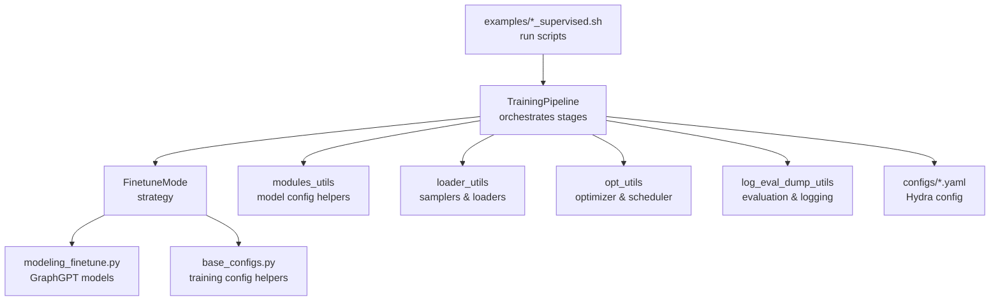
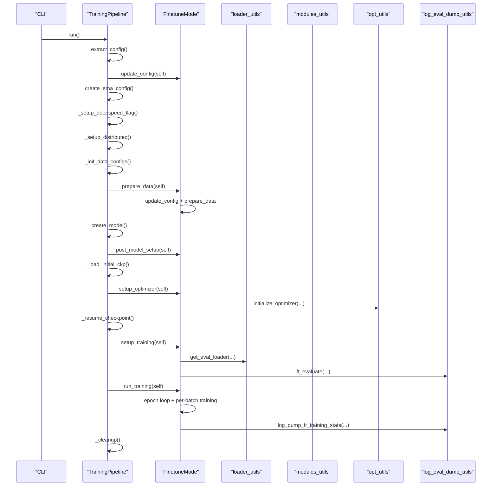
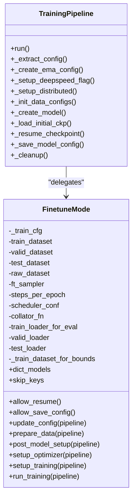
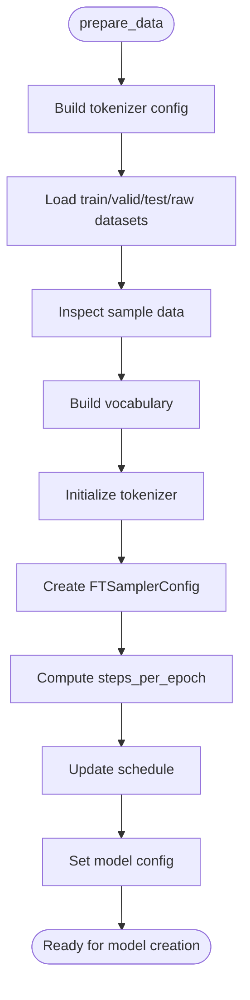
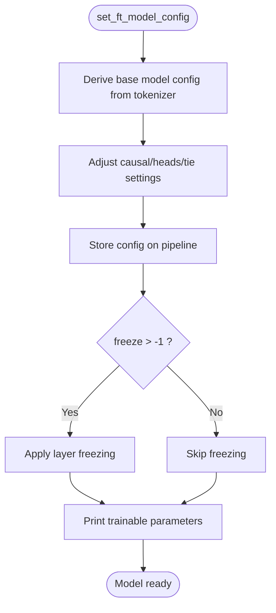
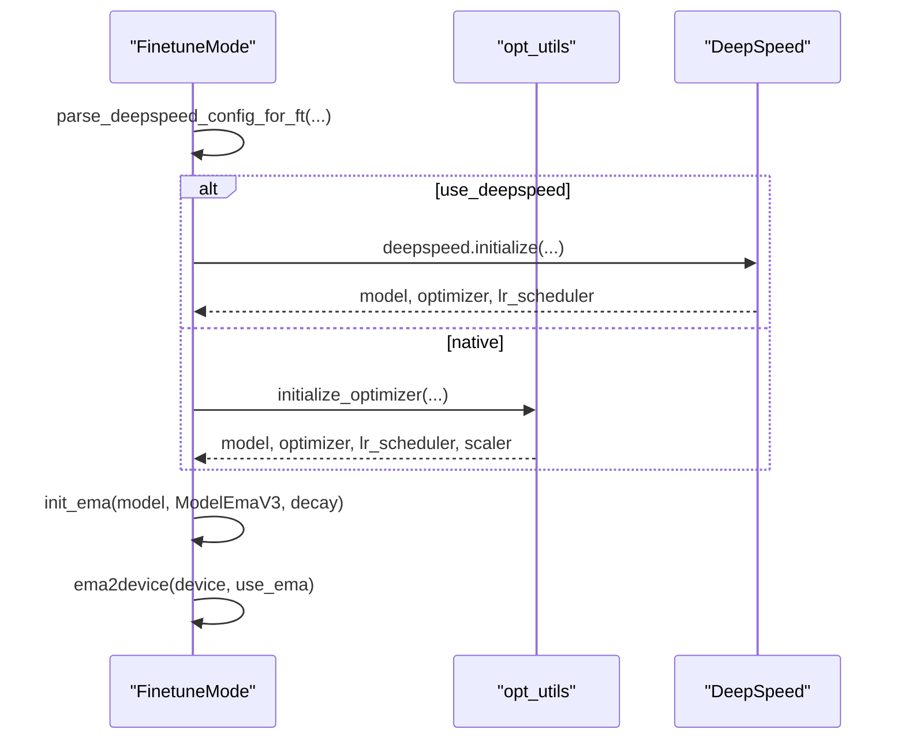
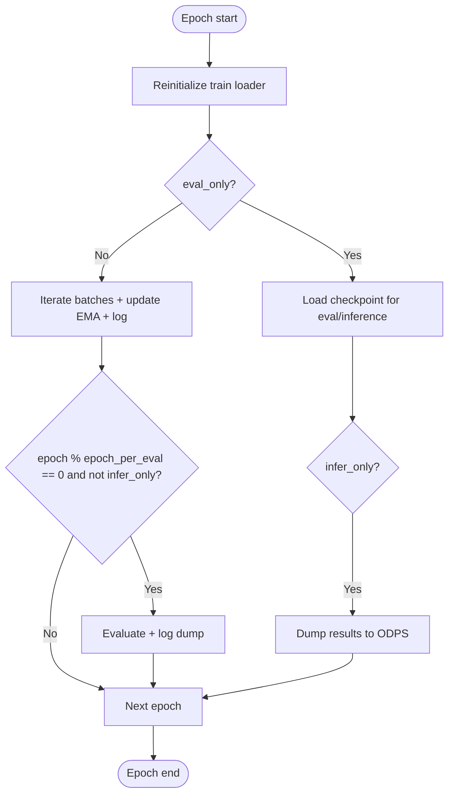
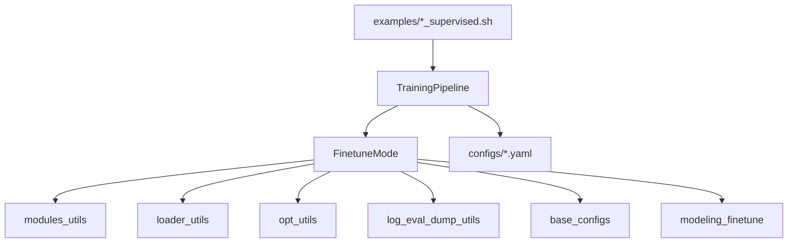

# Fine-tune Pipeline Setup

<cite>
**Referenced Files in This Document**
- [finetune_mode.py](file://src/training/finetune_mode.py)
- [pipeline.py](file://src/training/pipeline.py)
- [modeling_finetune.py](file://src/models/graphgpt/modeling_finetune.py)
- [modules_utils.py](file://src/utils/modules_utils.py)
- [loader_utils.py](file://src/utils/loader_utils.py)
- [opt_utils.py](file://src/utils/opt_utils.py)
- [log_eval_dump_utils.py](file://src/utils/log_eval_dump_utils.py)
- [base_configs.py](file://src/conf/base_configs.py)
- [train_supervised.py](file://examples/train_supervised.py)
- [config.yaml](file://configs/config.yaml)
- [base.yaml](file://configs/training/base.yaml)
- [pcqm4m_v2_supervised.sh](file://examples/graph_lvl/pcqm4m_v2_supervised.sh)
- [proteins_supervised.sh](file://examples/node_lvl/proteins_supervised.sh)
</cite>

## Table of Contents
1. [Introduction](#introduction)
2. [Project Structure](#project-structure)
3. [Core Components](#core-components)
4. [Architecture Overview](#architecture-overview)
5. [Detailed Component Analysis](#detailed-component-analysis)
6. [Dependency Analysis](#dependency-analysis)
7. [Performance Considerations](#performance-considerations)
8. [Troubleshooting Guide](#troubleshooting-guide)
9. [Conclusion](#conclusion)
10. [Appendices](#appendices)

## Introduction
This document explains the fine-tune pipeline setup for supervised learning in the GraphGPT system. It covers how the FinetuneMode strategy orchestrates data preparation, model configuration, optimizer initialization, epoch-level training, evaluation-only and inference-only workflows, pipeline configuration updates, sampler setup, and distributed training considerations. Practical examples demonstrate configuring runs for different datasets and tasks, and guidance is provided for optimizing performance and resolving common setup issues.

## Project Structure
The fine-tune pipeline is implemented as a strategy pattern within a unified TrainingPipeline. The key modules involved are:
- TrainingPipeline: orchestrates shared setup and delegates mode-specific behavior
- FinetuneMode: implements supervised fine-tuning strategy
- Model classes: GraphGPTTaskModel and GraphGPTDenoisingRegressionDoubleHeadsModel
- Utilities: data samplers, optimizer setup, evaluation/logging, configuration helpers

**Diagram sources**
- [pipeline.py:15-96](file://src/training/pipeline.py#L15-L96)
- [finetune_mode.py:43-111](file://src/training/finetune_mode.py#L43-L111)
- [modeling_finetune.py:64-106](file://src/models/graphgpt/modeling_finetune.py#L64-L106)
- [modules_utils.py:84-92](file://src/utils/modules_utils.py#L84-L92)
- [loader_utils.py:40-53](file://src/utils/loader_utils.py#L40-L53)
- [opt_utils.py:7-37](file://src/utils/opt_utils.py#L7-L37)
- [log_eval_dump_utils.py:77-107](file://src/utils/log_eval_dump_utils.py#L77-L107)
- [base_configs.py:106-192](file://src/conf/base_configs.py#L106-L192)
- [config.yaml:1-20](file://configs/config.yaml#L1-L20)
- [base.yaml:1-78](file://configs/training/base.yaml#L1-L78)
- [train_supervised.py:12-14](file://examples/train_supervised.py#L12-L14)

**Section sources**
- [pipeline.py:15-96](file://src/training/pipeline.py#L15-L96)
- [finetune_mode.py:43-111](file://src/training/finetune_mode.py#L43-L111)
- [config.yaml:1-20](file://configs/config.yaml#L1-L20)
- [base.yaml:1-78](file://configs/training/base.yaml#L1-L78)

## Core Components
- FinetuneMode: Implements supervised fine-tuning with epoch-level training, evaluation-only and inference-only modes, and optional denoising heads for 3D molecular tasks.
- TrainingPipeline: Provides shared lifecycle hooks (config extraction, distributed setup, model creation, checkpointing, cleanup) and delegates mode-specific steps to FinetuneMode.
- Model classes: Task-specific heads for classification/regression and optional auxiliary denoising heads for 3D coordinates.
- Utilities: Samplers for train/validation/test splits, optimizer/scheduler setup, evaluation metrics, and configuration updates.

Key responsibilities:
- Data preparation: tokenizer construction, vocabulary building, dataset loading, sampler setup, and model config propagation.
- Model configuration: mapping tokenizer vocab to model config and adjusting attention/causal settings per task.
- Optimizer initialization: DeepSpeed or native DDP with scheduler and EMA support.
- Training loop: epoch-level iteration, per-batch training, logging, periodic evaluation, and optional inference dump.

**Section sources**
- [finetune_mode.py:43-111](file://src/training/finetune_mode.py#L43-L111)
- [pipeline.py:15-96](file://src/training/pipeline.py#L15-L96)
- [modeling_finetune.py:64-106](file://src/models/graphgpt/modeling_finetune.py#L64-L106)
- [modules_utils.py:84-92](file://src/utils/modules_utils.py#L84-L92)
- [loader_utils.py:40-53](file://src/utils/loader_utils.py#L40-L53)
- [opt_utils.py:7-37](file://src/utils/opt_utils.py#L7-L37)
- [log_eval_dump_utils.py:77-107](file://src/utils/log_eval_dump_utils.py#L77-L107)

## Architecture Overview
The fine-tune pipeline follows a staged flow: shared setup, mode-specific data/model setup, optimizer creation, training preparation, and epoch-level training with evaluation.

**Diagram sources**
- [pipeline.py:60-96](file://src/training/pipeline.py#L60-L96)
- [finetune_mode.py:86-111](file://src/training/finetune_mode.py#L86-L111)
- [finetune_mode.py:116-200](file://src/training/finetune_mode.py#L116-L200)
- [finetune_mode.py:218-258](file://src/training/finetune_mode.py#L218-L258)
- [finetune_mode.py:263-359](file://src/training/finetune_mode.py#L263-L359)
- [finetune_mode.py:363-459](file://src/training/finetune_mode.py#L363-L459)
- [loader_utils.py:300-307](file://src/utils/loader_utils.py#L300-L307)
- [opt_utils.py:7-37](file://src/utils/opt_utils.py#L7-L37)
- [log_eval_dump_utils.py:77-107](file://src/utils/log_eval_dump_utils.py#L77-L107)

## Detailed Component Analysis

### FinetuneMode: Supervised Fine-tuning Strategy
FinetuneMode encapsulates the supervised fine-tuning lifecycle:
- Configuration updates: merges saved YAML, sets fine-tune flags, and adjusts task ratios for denoising models.
- Data preparation: builds tokenizer config, loads train/valid/test/raw datasets, inspects data, builds vocabulary, initializes tokenizer, sets up FTSamplerConfig, computes steps per epoch, and updates schedule.
- Post-model setup: optionally freezes backbone layers and prints trainable parameters.
- Optimizer setup: creates optimizer/scheduler via DeepSpeed or native path, initializes EMA.
- Training preparation: initializes logging, collator, evaluation loaders, and performs initial validation if not eval-only.
- Epoch-level training: iterates epochs, reinitializes train loader per epoch, runs batches, updates EMA, logs, evaluates periodically, and dumps predictions in infer-only mode.

**Diagram sources**
- [finetune_mode.py:43-111](file://src/training/finetune_mode.py#L43-L111)
- [finetune_mode.py:86-459](file://src/training/finetune_mode.py#L86-L459)
- [pipeline.py:15-96](file://src/training/pipeline.py#L15-L96)

**Section sources**
- [finetune_mode.py:43-111](file://src/training/finetune_mode.py#L43-L111)
- [finetune_mode.py:86-111](file://src/training/finetune_mode.py#L86-L111)
- [finetune_mode.py:116-200](file://src/training/finetune_mode.py#L116-L200)
- [finetune_mode.py:218-258](file://src/training/finetune_mode.py#L218-L258)
- [finetune_mode.py:263-359](file://src/training/finetune_mode.py#L263-L359)
- [finetune_mode.py:363-459](file://src/training/finetune_mode.py#L363-L459)

### Data Preparation and Sampler Setup
- Tokenizer configuration is built from the tokenization config, with optional removal of unused semantic embeddings.
- Datasets are loaded with true validation support and inspected for correctness.
- Vocabulary is built from the raw dataset and printed.
- A tokenizer instance is created with model-specific semantics (loss type, number of labels).
- FTSamplerConfig holds train/valid/test samplers and supports expanding validation/test samples for ensemble evaluation in eval-only mode.
- Steps per epoch is computed and schedule updated based on samples per GPU.
- Model configuration is finalized and stored on the pipeline.

**Diagram sources**
- [finetune_mode.py:116-200](file://src/training/finetune_mode.py#L116-L200)
- [loader_utils.py:40-53](file://src/utils/loader_utils.py#L40-L53)
- [loader_utils.py:176-200](file://src/utils/loader_utils.py#L176-L200)

**Section sources**
- [finetune_mode.py:116-200](file://src/training/finetune_mode.py#L116-L200)
- [loader_utils.py:40-53](file://src/utils/loader_utils.py#L40-L53)
- [loader_utils.py:176-200](file://src/utils/loader_utils.py#L176-L200)

### Model Configuration and Layer Freezing
- Model config is derived from the tokenizer and training/task settings, including attention type and tie-word embeddings.
- For denoising models, task ratio is adjusted to balance supervised and denoising objectives.
- Optional backbone freezing can be applied to reduce training cost.
- Trainable parameter counting is performed after freezing.

**Diagram sources**
- [modules_utils.py:84-92](file://src/utils/modules_utils.py#L84-L92)
- [finetune_mode.py:204-213](file://src/training/finetune_mode.py#L204-L213)

**Section sources**
- [modules_utils.py:84-92](file://src/utils/modules_utils.py#L84-L92)
- [finetune_mode.py:204-213](file://src/training/finetune_mode.py#L204-L213)

### Optimizer Initialization and Scheduler
- For DeepSpeed: parses fine-tune configuration, initializes DeepSpeed engine, optimizer, and LR scheduler, and stores stats.
- For native path: wraps model with DDP, creates AdamW optimizer, constructs OneCycle-style scheduler, and GradScaler.
- EMA is initialized and moved to the appropriate device.

**Diagram sources**
- [finetune_mode.py:218-258](file://src/training/finetune_mode.py#L218-L258)
- [opt_utils.py:7-37](file://src/utils/opt_utils.py#L7-L37)

**Section sources**
- [finetune_mode.py:218-258](file://src/training/finetune_mode.py#L218-L258)
- [opt_utils.py:7-37](file://src/utils/opt_utils.py#L7-L37)

### Epoch-Level Training Strategy
- Training loops over epochs starting from an initial epoch determined by resume or pre-training checkpoint.
- Per-epoch, the training loader is reinitialized with shuffled samplers and dataset resets when supported.
- Batches are processed through the training utility, updating EMA and logging at configured intervals.
- Periodic evaluation is performed at epoch boundaries (unless infer-only), and predictions can be dumped to ODPS tables in infer-only mode.

**Diagram sources**
- [finetune_mode.py:363-459](file://src/training/finetune_mode.py#L363-L459)
- [loader_utils.py:610-644](file://src/utils/loader_utils.py#L610-L644)

**Section sources**
- [finetune_mode.py:363-459](file://src/training/finetune_mode.py#L363-L459)
- [loader_utils.py:610-644](file://src/utils/loader_utils.py#L610-L644)

### Evaluation-only and Inference-only Workflows
- Evaluation-only mode skips training, performs a single validation pass before training, and adjusts epoch counters accordingly.
- Inference-only mode loads checkpoints per epoch and writes predictions to ODPS tables.

Practical toggles:
- eval_only: disables training and saves best checkpoint based on validation results.
- infer_only: enables dumping predictions to external storage.

**Section sources**
- [finetune_mode.py:351-358](file://src/training/finetune_mode.py#L351-L358)
- [finetune_mode.py:433-444](file://src/training/finetune_mode.py#L433-L444)

### Distributed Training Considerations
- Distributed environment is set up with rank/world_size and NCCL backend when using DeepSpeed.
- Samplers are distributed across ranks deterministically; validation/test samplers can be expanded for ensemble evaluation in eval-only mode.
- Steps per epoch and schedule are recomputed per GPU to reflect world size and batch composition.

**Section sources**
- [pipeline.py:137-141](file://src/training/pipeline.py#L137-L141)
- [finetune_mode.py:175-187](file://src/training/finetune_mode.py#L175-L187)
- [loader_utils.py:70-90](file://src/utils/loader_utils.py#L70-L90)
- [loader_utils.py:275-293](file://src/utils/loader_utils.py#L275-L293)

### Practical Examples: Setting Up Runs
- Node-level task (Proteins): adjust model size, dropout, attention settings, task type, problem type, and number of labels; use DeepSpeed or DDP; set eval_only/infer_only flags as needed.
- Graph-level task (PCQM4Mv2): configure model type (graphgpt vs graphgpt-denoise), attention/causal settings, loss type, and evaluation/inference flags; set pretrain checkpoint path if resuming.

Example scripts demonstrate command-line overrides for tokenization, model, training, and generation settings.

**Section sources**
- [proteins_supervised.sh:1-229](file://examples/node_lvl/proteins_supervised.sh#L1-L229)
- [pcqm4m_v2_supervised.sh:1-300](file://examples/graph_lvl/pcqm4m_v2_supervised.sh#L1-L300)

## Dependency Analysis
The fine-tune pipeline integrates several subsystems with clear boundaries:
- TrainingPipeline depends on FinetuneMode for strategy-specific behavior.
- FinetuneMode depends on data utilities for samplers/loaders, model utilities for configuration, optimizer utilities for training setup, and evaluation/logging utilities for metrics and dumps.
- Model classes depend on shared helpers for input transformations and loss computation.

**Diagram sources**
- [pipeline.py:15-96](file://src/training/pipeline.py#L15-L96)
- [finetune_mode.py:43-111](file://src/training/finetune_mode.py#L43-L111)
- [modeling_finetune.py:64-106](file://src/models/graphgpt/modeling_finetune.py#L64-L106)
- [modules_utils.py:84-92](file://src/utils/modules_utils.py#L84-L92)
- [loader_utils.py:40-53](file://src/utils/loader_utils.py#L40-L53)
- [opt_utils.py:7-37](file://src/utils/opt_utils.py#L7-L37)
- [log_eval_dump_utils.py:77-107](file://src/utils/log_eval_dump_utils.py#L77-L107)
- [base_configs.py:106-192](file://src/conf/base_configs.py#L106-L192)
- [config.yaml:1-20](file://configs/config.yaml#L1-L20)
- [base.yaml:1-78](file://configs/training/base.yaml#L1-L78)
- [train_supervised.py:12-14](file://examples/train_supervised.py#L12-L14)

**Section sources**
- [pipeline.py:15-96](file://src/training/pipeline.py#L15-L96)
- [finetune_mode.py:43-111](file://src/training/finetune_mode.py#L43-L111)

## Performance Considerations
- Use DeepSpeed for large-scale distributed training to reduce memory footprint and accelerate training.
- Tune batch size and gradient accumulation to fit GPU memory while maintaining effective batch dynamics.
- Enable EMA to stabilize training and improve generalization; monitor best checkpoint selection.
- Control logging frequency and evaluation cadence to balance overhead and progress monitoring.
- For inference-heavy workloads, leverage eval_only/infer_only modes to minimize compute and storage costs.

[No sources needed since this section provides general guidance]

## Troubleshooting Guide
Common setup issues and resolutions:
- Missing or incompatible tokenizer configuration: ensure tokenizer_class and semantics match dataset schema; remove unused embed keys when not provided.
- Out-of-memory errors: reduce batch_size, increase gradient_accumulation_steps, or switch to DeepSpeed ZeRO.
- Incorrect steps per epoch: verify world_size and per-GPU samples; steps are recomputed based on samples_per_gpu.
- Resuming from checkpoint conflicts: when log.csv exists, resume from output_dir instead of pretrain_cpt; ensure eval_only/infer_only flags align with intended mode.
- Evaluation-only mode anomalies: confirm epoch_start adjustments and that validation is executed before training begins.

**Section sources**
- [finetune_mode.py:86-111](file://src/training/finetune_mode.py#L86-L111)
- [finetune_mode.py:175-187](file://src/training/finetune_mode.py#L175-L187)
- [pipeline.py:129-136](file://src/training/pipeline.py#L129-L136)
- [pipeline.py:179-202](file://src/training/pipeline.py#L179-L202)

## Conclusion
The fine-tune pipeline provides a robust, configurable framework for supervised learning on graph-structured data. By leveraging FinetuneMode’s strategy pattern, TrainingPipeline’s shared lifecycle, and modular utilities, practitioners can efficiently set up runs across diverse datasets and tasks. Proper configuration of data preparation, model settings, optimizer, and distributed parameters ensures reliable training, evaluation, and inference outcomes.

[No sources needed since this section summarizes without analyzing specific files]

## Appendices

### Configuration Reference Highlights
- Training base configuration includes schedule, optimizer, distributed settings, and fine-tune flags.
- Hydra config composes tokenization, model, training, and generation groups.

**Section sources**
- [base.yaml:1-78](file://configs/training/base.yaml#L1-L78)
- [config.yaml:1-20](file://configs/config.yaml#L1-L20)

### Example Launch Scripts
- Node-level and graph-level supervised scripts demonstrate how to override tokenization, model, and training parameters via command-line arguments.

**Section sources**
- [proteins_supervised.sh:1-229](file://examples/node_lvl/proteins_supervised.sh#L1-L229)
- [pcqm4m_v2_supervised.sh:1-300](file://examples/graph_lvl/pcqm4m_v2_supervised.sh#L1-L300)
