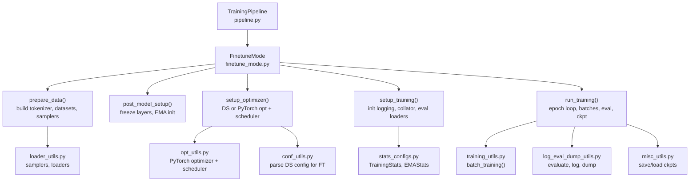
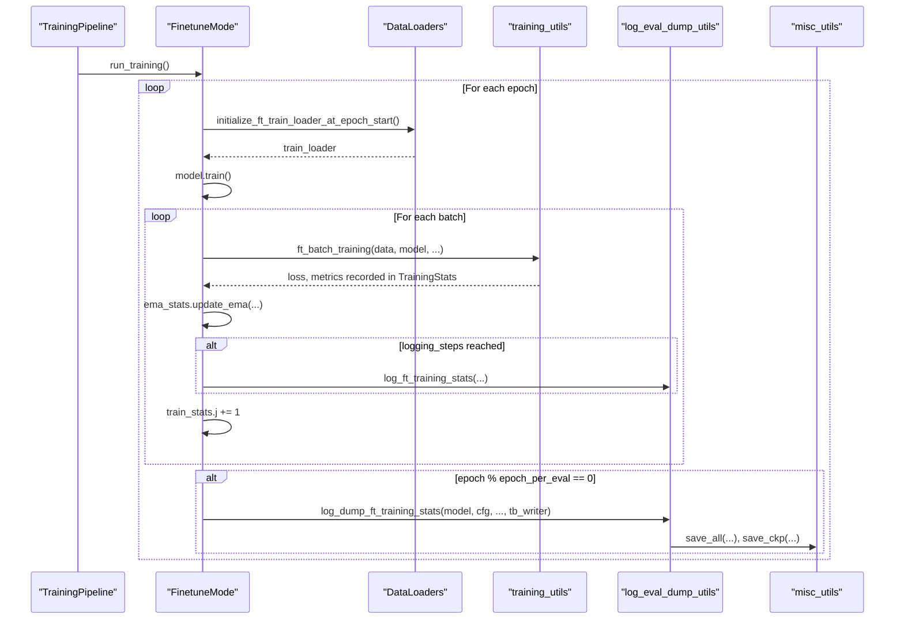
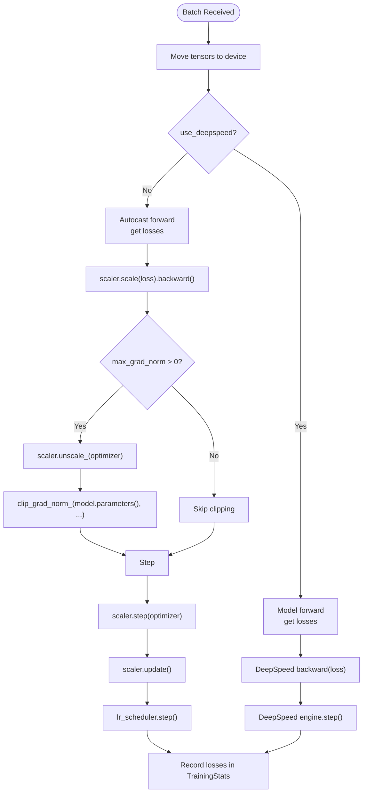
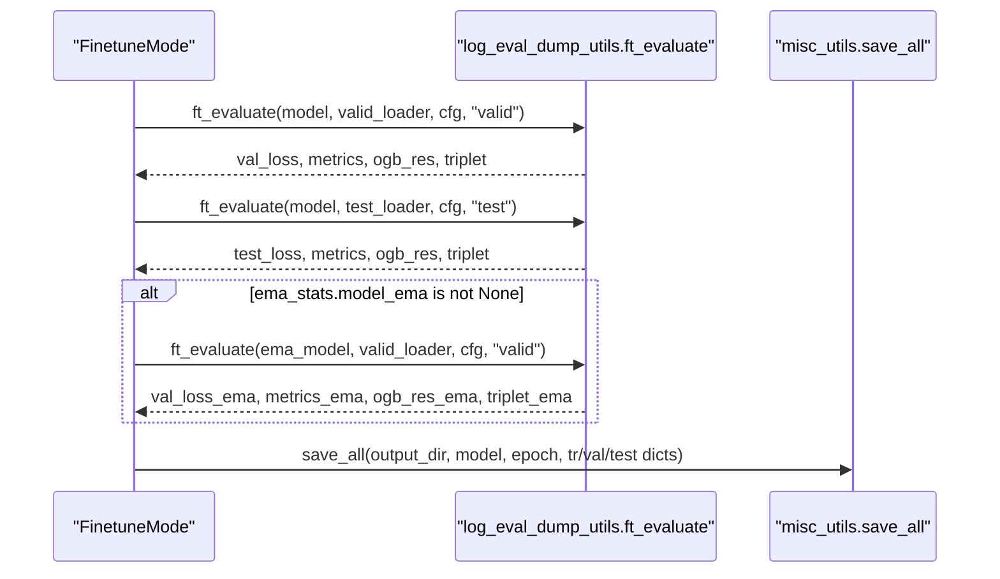
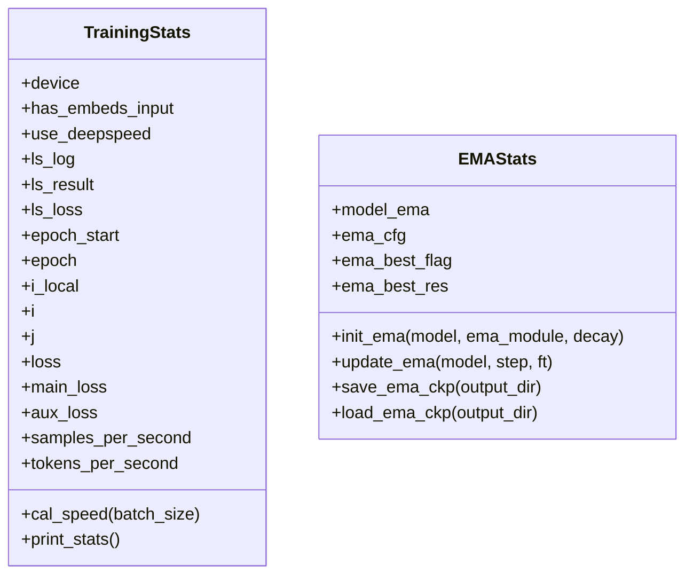
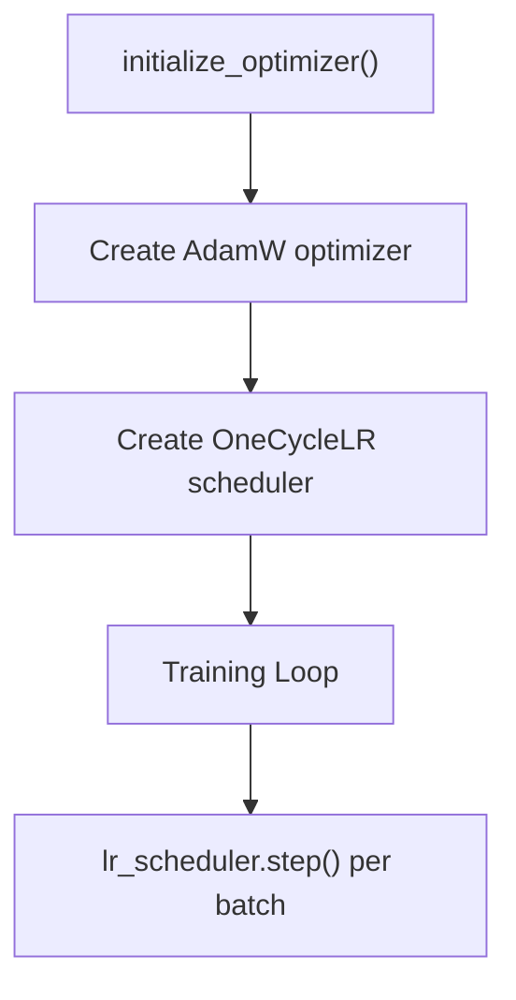
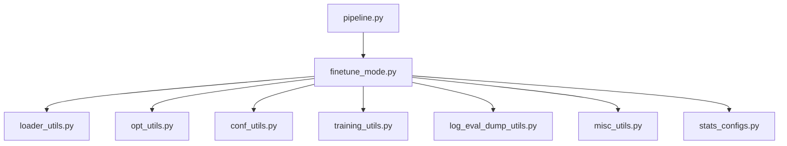

# Fine-tune Training Loop

<cite>
**Referenced Files in This Document**
- [finetune_mode.py](file://src/training/finetune_mode.py)
- [pipeline.py](file://src/training/pipeline.py)
- [training_utils.py](file://src/utils/training_utils.py)
- [log_eval_dump_utils.py](file://src/utils/log_eval_dump_utils.py)
- [loader_utils.py](file://src/utils/loader_utils.py)
- [stats_configs.py](file://src/conf/stats_configs.py)
- [opt_utils.py](file://src/utils/opt_utils.py)
- [conf_utils.py](file://src/utils/conf_utils.py)
- [misc_utils.py](file://src/utils/misc_utils.py)
- [base.yaml](file://configs/training/base.yaml)
- [ds_config2.json](file://examples/ds_config2.json)
- [train_supervised.py](file://examples/train_supervised.py)
</cite>

## Table of Contents
1. [Introduction](#introduction)
2. [Project Structure](#project-structure)
3. [Core Components](#core-components)
4. [Architecture Overview](#architecture-overview)
5. [Detailed Component Analysis](#detailed-component-analysis)
6. [Dependency Analysis](#dependency-analysis)
7. [Performance Considerations](#performance-considerations)
8. [Troubleshooting Guide](#troubleshooting-guide)
9. [Conclusion](#conclusion)
10. [Appendices](#appendices)

## Introduction
This document explains the supervised fine-tune training loop implemented in the repository. It covers epoch-based training, batch processing, evaluation, logging, checkpointing, learning rate scheduling, optimizer updates, gradient handling, and integration with DeepSpeed for distributed training and memory optimization. It also provides guidance for resuming interrupted runs, monitoring convergence, and debugging training issues.

## Project Structure
The fine-tune training pipeline is orchestrated by a unified pipeline that delegates mode-specific behavior to a training mode strategy. The key modules involved are:
- Training orchestration and lifecycle management
- Data preparation, samplers, and loaders
- Model creation and initialization
- Optimizer and scheduler setup
- Batch training and gradient handling
- Evaluation, logging, and checkpointing
- Configuration parsing for DeepSpeed and logging initialization

**Diagram sources**
- [pipeline.py:60-96](file://src/training/pipeline.py#L60-L96)
- [finetune_mode.py:116-459](file://src/training/finetune_mode.py#L116-L459)
- [loader_utils.py:445-479](file://src/utils/loader_utils.py#L445-L479)
- [opt_utils.py:7-38](file://src/utils/opt_utils.py#L7-L38)
- [conf_utils.py:106-135](file://src/utils/conf_utils.py#L106-L135)
- [training_utils.py:98-206](file://src/utils/training_utils.py#L98-L206)
- [log_eval_dump_utils.py:648-800](file://src/utils/log_eval_dump_utils.py#L648-L800)
- [misc_utils.py:69-122](file://src/utils/misc_utils.py#L69-L122)
- [stats_configs.py:29-158](file://src/conf/stats_configs.py#L29-L158)

**Section sources**
- [pipeline.py:60-96](file://src/training/pipeline.py#L60-L96)
- [finetune_mode.py:116-459](file://src/training/finetune_mode.py#L116-L459)

## Core Components
- TrainingPipeline: Orchestrates shared setup and delegates to FinetuneMode for mode-specific behavior.
- FinetuneMode: Implements supervised fine-tuning specifics including data preparation, model setup, optimizer/scheduler, training loop, and evaluation.
- DataLoader and Samplers: Deterministic shuffling, distributed sampling, and evaluation subsets.
- Optimizer and Scheduler: PyTorch AdamW with OneCycle-style scheduling; optional DeepSpeed integration.
- Batch Training Utilities: Autocast, gradient scaling, clipping, and optimizer step handling.
- Logging and Evaluation: Per-batch loss logging, epoch-wise evaluation, and CSV/TensorBoard outputs.
- Checkpoint Management: Unified save/load for PyTorch and DeepSpeed, including optimizer and scheduler states.

**Section sources**
- [pipeline.py:15-96](file://src/training/pipeline.py#L15-L96)
- [finetune_mode.py:43-459](file://src/training/finetune_mode.py#L43-L459)
- [loader_utils.py:223-305](file://src/utils/loader_utils.py#L223-L305)
- [opt_utils.py:7-38](file://src/utils/opt_utils.py#L7-L38)
- [training_utils.py:7-206](file://src/utils/training_utils.py#L7-L206)
- [log_eval_dump_utils.py:543-800](file://src/utils/log_eval_dump_utils.py#L543-L800)
- [misc_utils.py:69-122](file://src/utils/misc_utils.py#L69-L122)
- [stats_configs.py:29-158](file://src/conf/stats_configs.py#L29-L158)

## Architecture Overview
The training loop follows an epoch-based strategy:
- Epoch-level evaluation on train/valid/test splits
- Per-batch training with gradient accumulation disabled by default
- Periodic evaluation and checkpointing
- Optional EMA model tracking and testing with EMA weights

**Diagram sources**
- [finetune_mode.py:363-459](file://src/training/finetune_mode.py#L363-L459)
- [loader_utils.py:610-644](file://src/utils/loader_utils.py#L610-L644)
- [training_utils.py:98-206](file://src/utils/training_utils.py#L98-L206)
- [log_eval_dump_utils.py:648-800](file://src/utils/log_eval_dump_utils.py#L648-L800)
- [misc_utils.py:69-122](file://src/utils/misc_utils.py#L69-L122)

## Detailed Component Analysis

### Epoch-based Training Strategy
- Epoch initialization and loop control are managed by the training mode. At the start of each epoch, the training loader is re-initialized with shuffled indices and distributed sampling.
- After each epoch, evaluation is performed on partial training data and full validation/test sets. EMA models are optionally used for validation/test evaluation.

**Section sources**
- [finetune_mode.py:380-459](file://src/training/finetune_mode.py#L380-L459)
- [loader_utils.py:610-644](file://src/utils/loader_utils.py#L610-L644)

### Batch Processing Workflow
- Data is moved to device and passed through the model. In supervised fine-tuning, the model computes task_loss and optionally pretrain_loss when auxiliary supervision is enabled.
- Gradient handling:
  - With DeepSpeed: gradients computed via engine backward, followed by engine step.
  - Without DeepSpeed: autocast forward, scaled backward, optional gradient norm clipping, optimizer step, scaler update, and scheduler step.

**Diagram sources**
- [training_utils.py:98-206](file://src/utils/training_utils.py#L98-L206)

**Section sources**
- [training_utils.py:7-206](file://src/utils/training_utils.py#L7-L206)

### Evaluation Procedures
- Evaluation is performed on train (partial), valid, and test sets. Metrics are computed and gathered across distributed workers when applicable.
- EMA models are supported for validation/test evaluation, and best EMA results are tracked.

**Diagram sources**
- [log_eval_dump_utils.py:77-163](file://src/utils/log_eval_dump_utils.py#L77-L163)
- [log_eval_dump_utils.py:648-800](file://src/utils/log_eval_dump_utils.py#L648-L800)

**Section sources**
- [log_eval_dump_utils.py:77-163](file://src/utils/log_eval_dump_utils.py#L77-L163)
- [log_eval_dump_utils.py:648-800](file://src/utils/log_eval_dump_utils.py#L648-L800)

### Training Statistics Tracking, Logging, and Checkpointing
- TrainingStats tracks epoch, local/global step counters, loss values, speed metrics, and dictionaries for predictions.
- Per-batch logging writes to CSV and optionally TensorBoard.
- Epoch-end logging saves checkpoints, evaluates, and dumps predictions.

**Diagram sources**
- [stats_configs.py:29-158](file://src/conf/stats_configs.py#L29-L158)

**Section sources**
- [stats_configs.py:29-158](file://src/conf/stats_configs.py#L29-L158)
- [log_eval_dump_utils.py:543-642](file://src/utils/log_eval_dump_utils.py#L543-L642)
- [misc_utils.py:124-176](file://src/utils/misc_utils.py#L124-L176)

### Learning Rate Scheduling and Optimizer Updates
- Optimizer: AdamW with configurable betas, epsilon, weight decay.
- Scheduler: OneCycle-style scheduler configured via training schedule parameters.
- DeepSpeed integration: Optimizer and scheduler parameters are parsed from DS config; if DS scheduler is unsupported, a Python scheduler is created and used alongside DS engine.

**Diagram sources**
- [opt_utils.py:7-38](file://src/utils/opt_utils.py#L7-L38)
- [conf_utils.py:106-135](file://src/utils/conf_utils.py#L106-L135)

**Section sources**
- [opt_utils.py:7-38](file://src/utils/opt_utils.py#L7-L38)
- [conf_utils.py:106-135](file://src/utils/conf_utils.py#L106-L135)

### Gradient Handling
- Autocast forward pass for FP16 precision.
- Scaled backward pass with optional gradient norm clipping.
- Scaler update after optimizer step.
- DeepSpeed path uses engine.backward and engine.step.

**Section sources**
- [training_utils.py:98-206](file://src/utils/training_utils.py#L98-L206)

### Data Preparation, Samplers, and Loaders
- Tokenizer and vocabulary built from dataset and configuration.
- FTSamplerConfig defines train/valid/test samplers and counts; evaluation samplers are subsets.
- Distributed sampling ensures each rank sees distinct indices; evaluation sets can be enlarged for ensemble behavior.
- Train loaders are re-initialized per epoch with shuffled indices.

**Section sources**
- [finetune_mode.py:116-199](file://src/training/finetune_mode.py#L116-L199)
- [loader_utils.py:41-53](file://src/utils/loader_utils.py#L41-L53)
- [loader_utils.py:223-305](file://src/utils/loader_utils.py#L223-L305)
- [loader_utils.py:610-644](file://src/utils/loader_utils.py#L610-L644)

### Integration with DeepSpeed
- DeepSpeed flag is derived from configuration; DS config is parsed and adapted for training.
- Engine initialization with model, optimizer, scheduler, and DS config.
- Checkpointing uses DS APIs; optimizer states and scaler states are saved/restored accordingly.
- Activation checkpointing and ZeRO optimizations are configured via DS JSON.

**Section sources**
- [pipeline.py:119-157](file://src/training/pipeline.py#L119-L157)
- [finetune_mode.py:229-251](file://src/training/finetune_mode.py#L229-L251)
- [conf_utils.py:49-103](file://src/utils/conf_utils.py#L49-L103)
- [ds_config2.json:1-43](file://examples/ds_config2.json#L1-L43)

### Training Configuration Examples
- Training schedule, optimizer, and fine-tune settings are defined in the training configuration YAML.
- Example DeepSpeed configurations demonstrate FP16, optimizer, scheduler, ZeRO stage, activation checkpointing, and profiler settings.

**Section sources**
- [base.yaml:24-78](file://configs/training/base.yaml#L24-L78)
- [ds_config2.json:1-43](file://examples/ds_config2.json#L1-L43)

### Performance Monitoring and Convergence Tracking
- Speed metrics (samples/sec, tokens/sec) are computed per epoch.
- Loss and metrics are logged to CSV and optionally TensorBoard.
- Epoch-end evaluation provides train/valid/test metrics and OGB scores; best EMA tracking is maintained.

**Section sources**
- [stats_configs.py:69-92](file://src/conf/stats_configs.py#L69-L92)
- [log_eval_dump_utils.py:543-642](file://src/utils/log_eval_dump_utils.py#L543-L642)
- [log_eval_dump_utils.py:648-800](file://src/utils/log_eval_dump_utils.py#L648-L800)

### Resumption Strategies and Training Interruptions
- Resume from latest checkpoint when output_dir equals pretrain_cpt and eval_only is not forced.
- DeepSpeed resume uses engine.load_checkpoint; PyTorch resume loads model, optimizer, and scheduler states.
- Logging initialization supports resuming from existing logs to maintain global step continuity.

**Section sources**
- [pipeline.py:179-202](file://src/training/pipeline.py#L179-L202)
- [misc_utils.py:69-122](file://src/utils/misc_utils.py#L69-L122)
- [conf_utils.py:178-231](file://src/utils/conf_utils.py#L178-L231)

### Debugging Training Issues
- Inspect tokenization results and first data points during data preparation.
- Monitor loss and metrics in CSV logs; compare with TensorBoard for trends.
- Verify distributed ranks and world size; ensure sampler counts align with world_size.
- Confirm DeepSpeed configuration compatibility and zero optimizer stages.

**Section sources**
- [finetune_mode.py:146-153](file://src/training/finetune_mode.py#L146-L153)
- [loader_utils.py:223-305](file://src/utils/loader_utils.py#L223-L305)

## Dependency Analysis
The training loop exhibits clear separation of concerns:
- Pipeline coordinates lifecycle and delegates to mode-specific implementations.
- Mode encapsulates fine-tune specifics including data, model, optimizer, and training loop.
- Utilities handle data loading, evaluation, logging, and checkpointing.
- Configuration utilities adapt DS settings and initialize logging.

**Diagram sources**
- [pipeline.py:15-96](file://src/training/pipeline.py#L15-L96)
- [finetune_mode.py:43-459](file://src/training/finetune_mode.py#L43-L459)
- [loader_utils.py:1-752](file://src/utils/loader_utils.py#L1-L752)
- [opt_utils.py:1-38](file://src/utils/opt_utils.py#L1-L38)
- [conf_utils.py:1-200](file://src/utils/conf_utils.py#L1-L200)
- [training_utils.py:1-206](file://src/utils/training_utils.py#L1-L206)
- [log_eval_dump_utils.py:1-929](file://src/utils/log_eval_dump_utils.py#L1-L929)
- [misc_utils.py:1-540](file://src/utils/misc_utils.py#L1-L540)
- [stats_configs.py:1-158](file://src/conf/stats_configs.py#L1-L158)

**Section sources**
- [pipeline.py:15-96](file://src/training/pipeline.py#L15-L96)
- [finetune_mode.py:43-459](file://src/training/finetune_mode.py#L43-L459)

## Performance Considerations
- Use DeepSpeed with appropriate ZeRO stage and activation checkpointing to reduce memory footprint.
- Enable FP16 training and gradient scaling to improve throughput.
- Keep gradient accumulation steps at 1 for simplicity; adjust micro-batch sizes to fit GPU memory.
- Tune num_workers and pin_memory for data loaders to minimize I/O bottlenecks.
- Use EMA for improved validation/test performance when available.

## Troubleshooting Guide
- Checkpoints not loading: Verify DS vs PyTorch checkpoint formats and use corresponding load APIs.
- OOM errors: Reduce batch size, enable gradient checkpointing, or switch to higher ZeRO stage.
- Slow training: Profile with DS flops profiler, inspect data pipeline, and ensure efficient collation.
- Distributed issues: Confirm NCCL backend initialization and world_size/rank alignment.

**Section sources**
- [pipeline.py:119-157](file://src/training/pipeline.py#L119-L157)
- [misc_utils.py:69-122](file://src/utils/misc_utils.py#L69-L122)
- [ds_config2.json:1-43](file://examples/ds_config2.json#L1-L43)

## Conclusion
The fine-tune training loop integrates robust data handling, distributed training via DeepSpeed, and comprehensive logging and checkpointing. Its epoch-based evaluation and EMA support facilitate reliable convergence tracking and high-quality model selection. Proper configuration of schedulers, optimizers, and DS settings is essential for performance and stability.

## Appendices

### Example Entry Point
- The supervised training entry point constructs the pipeline with the fine-tune mode and launches the training loop.

**Section sources**
- [train_supervised.py:12-19](file://examples/train_supervised.py#L12-L19)
