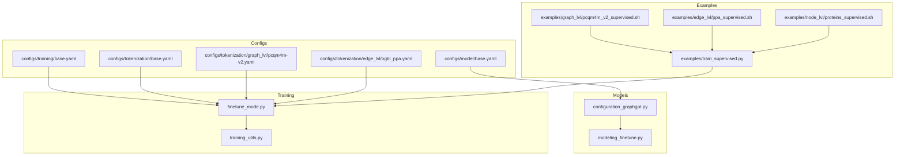
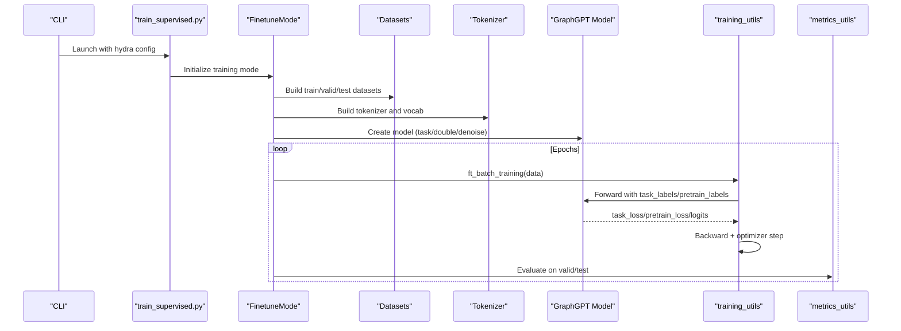
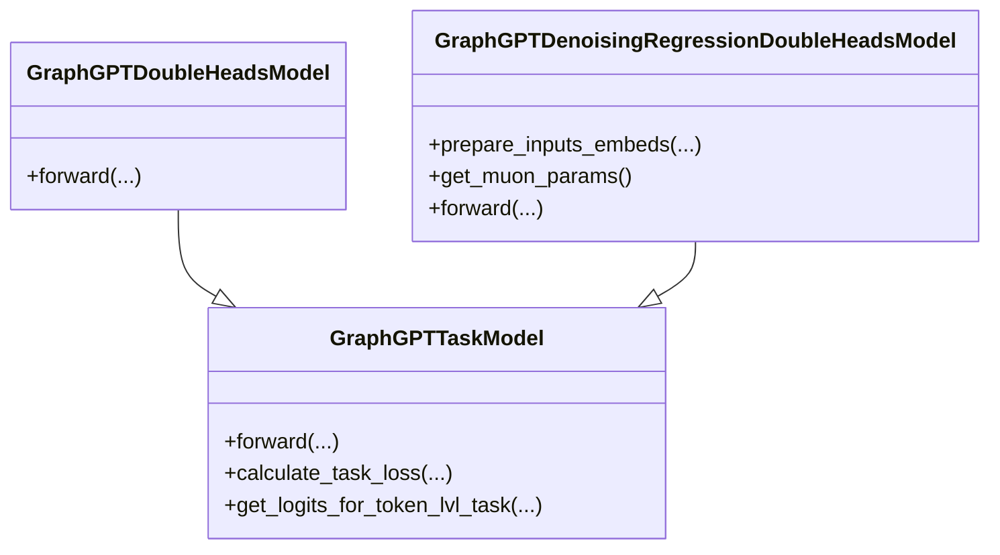
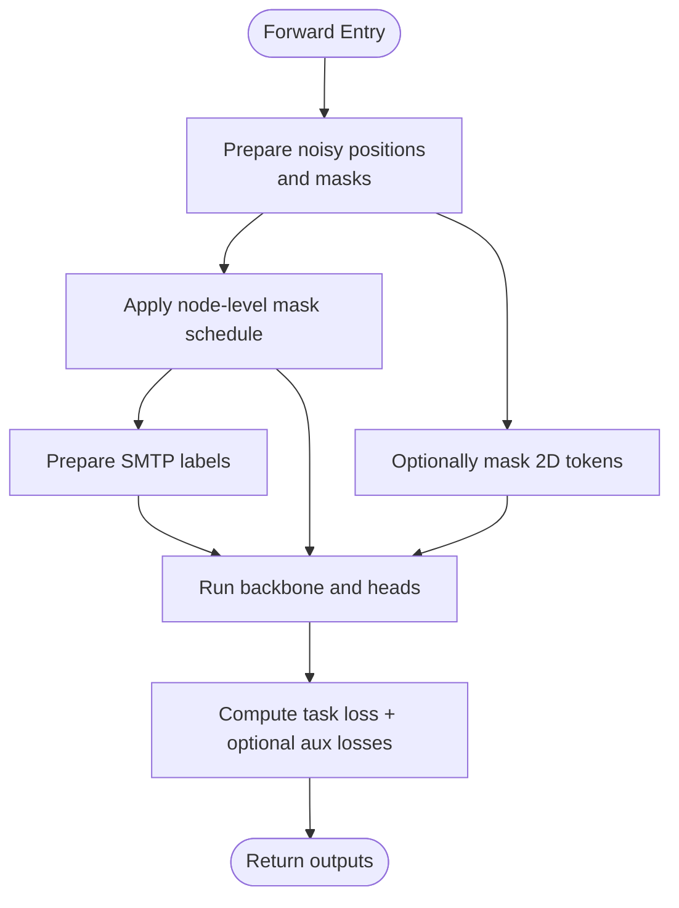
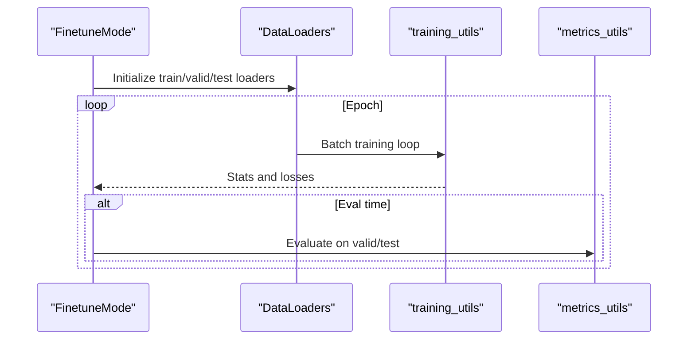
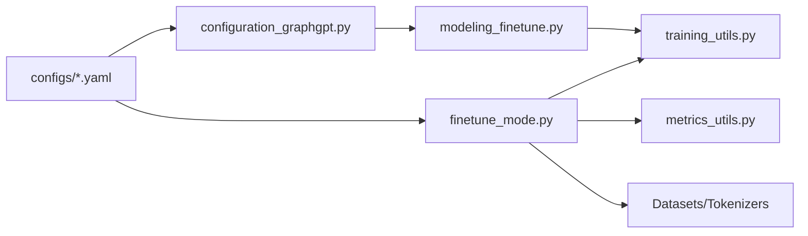

# Fine-tuning System

<cite>
**Referenced Files in This Document**
- [modeling_finetune.py](file://src/models/graphgpt/modeling_finetune.py)
- [finetune_mode.py](file://src/training/finetune_mode.py)
- [configuration_graphgpt.py](file://src/models/graphgpt/configuration_graphgpt.py)
- [base.yaml (model)](file://configs/model/base.yaml)
- [base.yaml (training)](file://configs/training/base.yaml)
- [base.yaml (tokenization)](file://configs/tokenization/base.yaml)
- [pcqm4m-v2.yaml (tokenization)](file://configs/tokenization/graph_lvl/pcqm4m-v2.yaml)
- [ogbl_ppa.yaml (tokenization)](file://configs/tokenization/edge_lvl/ogbl_ppa.yaml)
- [metrics_utils.py](file://src/utils/metrics_utils.py)
- [training_utils.py](file://src/utils/training_utils.py)
- [train_supervised.py](file://examples/train_supervised.py)
- [pcqm4m_v2_supervised.sh](file://examples/graph_lvl/pcqm4m_v2_supervised.sh)
- [ppa_supervised.sh](file://examples/edge_lvl/ppa_supervised.sh)
- [proteins_supervised.sh](file://examples/node_lvl/proteins_supervised.sh)
</cite>

## Table of Contents
1. [Introduction](#introduction)
2. [Project Structure](#project-structure)
3. [Core Components](#core-components)
4. [Architecture Overview](#architecture-overview)
5. [Detailed Component Analysis](#detailed-component-analysis)
6. [Dependency Analysis](#dependency-analysis)
7. [Performance Considerations](#performance-considerations)
8. [Troubleshooting Guide](#troubleshooting-guide)
9. [Conclusion](#conclusion)
10. [Appendices](#appendices)

## Introduction
This document explains the fine-tuning system for Graph-GPT with a focus on task-specific adaptation and downstream prediction. It covers model architectures with task-specific heads, optional denoising regression components, the epoch-level training strategy, learning rate scheduling, evaluation metrics, and practical examples for configuring runs across graph-level, edge-level, and node-level tasks. It also clarifies how pre-trained representations are leveraged, optimization techniques to prevent overfitting, and guidance for transfer learning and multi-task fine-tuning.

## Project Structure
The fine-tuning system is organized around:
- Model definitions and task heads in the GraphGPT module
- Training orchestration in the training module
- Configuration via YAML files for model, training, and tokenization
- Example scripts and shell wrappers for quick setup

**Diagram sources**
- [base.yaml (model):1-222](file://configs/model/base.yaml#L1-L222)
- [base.yaml (training):1-78](file://configs/training/base.yaml#L1-L78)
- [base.yaml (tokenization):1-117](file://configs/tokenization/base.yaml#L1-L117)
- [pcqm4m-v2.yaml (tokenization):1-114](file://configs/tokenization/graph_lvl/pcqm4m-v2.yaml#L1-L114)
- [ogbl_ppa.yaml (tokenization):1-123](file://configs/tokenization/edge_lvl/ogbl_ppa.yaml#L1-L123)
- [configuration_graphgpt.py:1-346](file://src/models/graphgpt/configuration_graphgpt.py#L1-L346)
- [modeling_finetune.py:1-904](file://src/models/graphgpt/modeling_finetune.py#L1-L904)
- [finetune_mode.py:1-459](file://src/training/finetune_mode.py#L1-L459)
- [training_utils.py:1-206](file://src/utils/training_utils.py#L1-L206)
- [train_supervised.py:1-19](file://examples/train_supervised.py#L1-L19)
- [pcqm4m_v2_supervised.sh:1-300](file://examples/graph_lvl/pcqm4m_v2_supervised.sh#L1-L300)
- [ppa_supervised.sh:1-306](file://examples/edge_lvl/ppa_supervised.sh#L1-L306)
- [proteins_supervised.sh:1-229](file://examples/node_lvl/proteins_supervised.sh#L1-L229)

**Section sources**
- [base.yaml (model):1-222](file://configs/model/base.yaml#L1-L222)
- [base.yaml (training):1-78](file://configs/training/base.yaml#L1-L78)
- [base.yaml (tokenization):1-117](file://configs/tokenization/base.yaml#L1-L117)
- [configuration_graphgpt.py:1-346](file://src/models/graphgpt/configuration_graphgpt.py#L1-L346)
- [modeling_finetune.py:1-904](file://src/models/graphgpt/modeling_finetune.py#L1-L904)
- [finetune_mode.py:1-459](file://src/training/finetune_mode.py#L1-L459)
- [training_utils.py:1-206](file://src/utils/training_utils.py#L1-L206)
- [train_supervised.py:1-19](file://examples/train_supervised.py#L1-L19)
- [pcqm4m_v2_supervised.sh:1-300](file://examples/graph_lvl/pcqm4m_v2_supervised.sh#L1-L300)
- [ppa_supervised.sh:1-306](file://examples/edge_lvl/ppa_supervised.sh#L1-L306)
- [proteins_supervised.sh:1-229](file://examples/node_lvl/proteins_supervised.sh#L1-L229)

## Core Components
- Task-adaptive heads:
  - Single-head classification/regression model for downstream tasks
  - Double-headed model supporting both pre-training and task heads
  - Denoising regression double-headed model with coordinate denoising and optional 3D/2D synthetic masking (SMTP)
- Epoch-level training loop with evaluation cadence
- Metrics registry supporting single/multi-label classification and regression
- Configuration-driven model/head selection and hyperparameters

Key implementation references:
- Task model classes and forward logic: [modeling_finetune.py:64-326](file://src/models/graphgpt/modeling_finetune.py#L64-L326)
- Denoising regression double-headed model: [modeling_finetune.py:426-800](file://src/models/graphgpt/modeling_finetune.py#L426-L800)
- Training mode orchestration: [finetune_mode.py:43-459](file://src/training/finetune_mode.py#L43-L459)
- Metrics for evaluation: [metrics_utils.py:16-200](file://src/utils/metrics_utils.py#L16-L200)
- Training step logic: [training_utils.py:98-206](file://src/utils/training_utils.py#L98-L206)

**Section sources**
- [modeling_finetune.py:64-326](file://src/models/graphgpt/modeling_finetune.py#L64-L326)
- [modeling_finetune.py:426-800](file://src/models/graphgpt/modeling_finetune.py#L426-L800)
- [finetune_mode.py:43-459](file://src/training/finetune_mode.py#L43-L459)
- [metrics_utils.py:16-200](file://src/utils/metrics_utils.py#L16-L200)
- [training_utils.py:98-206](file://src/utils/training_utils.py#L98-L206)

## Architecture Overview
The fine-tuning pipeline integrates configuration, data/tokenization, model construction, and training/evaluation loops.

**Diagram sources**
- [train_supervised.py:1-19](file://examples/train_supervised.py#L1-L19)
- [finetune_mode.py:116-459](file://src/training/finetune_mode.py#L116-L459)
- [training_utils.py:98-206](file://src/utils/training_utils.py#L98-L206)
- [metrics_utils.py:16-200](file://src/utils/metrics_utils.py#L16-L200)

## Detailed Component Analysis

### Model Architectures and Task Heads
- GraphGPTTaskModel
  - Adds a classification/regression head atop the LLaMA backbone
  - Supports configurable pooling and MLP head
  - Computes task loss based on problem type and loss type
- GraphGPTDoubleHeadsModel
  - Extends task model with an auxiliary pre-training head
  - Enables joint training with pre-training labels
- GraphGPTDenoisingRegressionDoubleHeadsModel
  - Adds a denoising head for 3D coordinate regression
  - Optional 3D/2D synthetic masking (SMTP) with configurable ratios and schedules
  - Optional embedding of position type tokens and positional projections

**Diagram sources**
- [modeling_finetune.py:64-326](file://src/models/graphgpt/modeling_finetune.py#L64-L326)
- [modeling_finetune.py:329-424](file://src/models/graphgpt/modeling_finetune.py#L329-L424)
- [modeling_finetune.py:426-800](file://src/models/graphgpt/modeling_finetune.py#L426-L800)

**Section sources**
- [modeling_finetune.py:64-326](file://src/models/graphgpt/modeling_finetune.py#L64-L326)
- [modeling_finetune.py:329-424](file://src/models/graphgpt/modeling_finetune.py#L329-L424)
- [modeling_finetune.py:426-800](file://src/models/graphgpt/modeling_finetune.py#L426-L800)

### Denoising Regression Pipeline
The denoising head augments inputs with noisy 3D positions and optionally masks positions according to schedules. It supports:
- Position noise injection and masking
- 3D-SMTP and 2D-SMTP masking with polynomial schedules
- Optional position-type embedding and positional projections
- Auxiliary SMTP loss computation

**Diagram sources**
- [modeling_finetune.py:678-800](file://src/models/graphgpt/modeling_finetune.py#L678-L800)

**Section sources**
- [modeling_finetune.py:426-800](file://src/models/graphgpt/modeling_finetune.py#L426-L800)

### Epoch-Level Training Strategy and Evaluation
- Epoch-level training with per-epoch evaluation cadence
- Separate loaders for training/validation/testing
- Optional inference dump to ODPS writers
- EMA model support for evaluation

**Diagram sources**
- [finetune_mode.py:363-459](file://src/training/finetune_mode.py#L363-L459)
- [training_utils.py:98-206](file://src/utils/training_utils.py#L98-L206)

**Section sources**
- [finetune_mode.py:363-459](file://src/training/finetune_mode.py#L363-L459)
- [training_utils.py:98-206](file://src/utils/training_utils.py#L98-L206)

### Learning Rate Scheduling and Optimization
- Optimizer configuration supports AdamW-like parameters
- Gradient accumulation and clipping
- Automatic mixed precision training
- Optional EMA decay for evaluation

References:
- Optimizer and scheduler setup: [finetune_mode.py:218-257](file://src/training/finetune_mode.py#L218-L257)
- Training step with AMP and clipping: [training_utils.py:135-206](file://src/utils/training_utils.py#L135-L206)
- Global training configuration: [base.yaml (training):35-45](file://configs/training/base.yaml#L35-L45)

**Section sources**
- [finetune_mode.py:218-257](file://src/training/finetune_mode.py#L218-L257)
- [training_utils.py:135-206](file://src/utils/training_utils.py#L135-L206)
- [base.yaml (training):35-45](file://configs/training/base.yaml#L35-L45)

### Evaluation Metrics
- Single/multi-label classification with AUROC and accuracy
- Regression with MSE/MAE
- Torchmetrics and torcheval registries

References:
- Metrics registry and classes: [metrics_utils.py:16-200](file://src/utils/metrics_utils.py#L16-L200)

**Section sources**
- [metrics_utils.py:16-200](file://src/utils/metrics_utils.py#L16-L200)

### Practical Examples: Configuring Fine-tuning Runs
- Graph-level (PCQM4Mv2)
  - Task: regression
  - Loss: L1
  - Script: [pcqm4m_v2_supervised.sh:70-77](file://examples/graph_lvl/pcqm4m_v2_supervised.sh#L70-L77)
  - Tokenization: [pcqm4m-v2.yaml:1-114](file://configs/tokenization/graph_lvl/pcqm4m-v2.yaml#L1-L114)
- Edge-level (ogbl-ppa)
  - Task: binary classification
  - Script: [ppa_supervised.sh:72-76](file://examples/edge_lvl/ppa_supervised.sh#L72-L76)
  - Tokenization: [ogbl_ppa.yaml:1-123](file://configs/tokenization/edge_lvl/ogbl_ppa.yaml#L1-L123)
- Node-level (ogbn-proteins)
  - Task: multi-label classification
  - Script: [proteins_supervised.sh:62-66](file://examples/node_lvl/proteins_supervised.sh#L62-L66)

**Section sources**
- [pcqm4m_v2_supervised.sh:70-77](file://examples/graph_lvl/pcqm4m_v2_supervised.sh#L70-L77)
- [pcqm4m-v2.yaml (tokenization):1-114](file://configs/tokenization/graph_lvl/pcqm4m-v2.yaml#L1-L114)
- [ppa_supervised.sh:72-76](file://examples/edge_lvl/ppa_supervised.sh#L72-L76)
- [ogbl_ppa.yaml (tokenization):1-123](file://configs/tokenization/edge_lvl/ogbl_ppa.yaml#L1-L123)
- [proteins_supervised.sh:62-66](file://examples/node_lvl/proteins_supervised.sh#L62-L66)

### Relationship Between Pre-trained Representations and Task Adaptation
- Model configuration merges structured model config into legacy GraphGPTConfig
- Legacy config propagates dropout, stacking, pooling, and head settings
- Denoising head inherits denoise and SMTP settings from model config

References:
- Legacy conversion: [configuration_graphgpt.py:212-345](file://src/models/graphgpt/configuration_graphgpt.py#L212-L345)
- Denoising head settings: [base.yaml (model):128-168](file://configs/model/base.yaml#L128-L168)

**Section sources**
- [configuration_graphgpt.py:212-345](file://src/models/graphgpt/configuration_graphgpt.py#L212-L345)
- [base.yaml (model):128-168](file://configs/model/base.yaml#L128-L168)

### Transfer Learning and Multi-task Fine-tuning Approaches
- Transfer learning
  - Load pre-trained checkpoint via training config
  - Freeze backbone layers if desired
  - Adjust head configuration for target task
- Multi-task fine-tuning
  - Use double-headed model to jointly optimize pre-training and task losses
  - Control auxiliary task ratio and weighting

References:
- Pretrained checkpoint loading and freezing: [finetune_mode.py:109-111](file://src/training/finetune_mode.py#L109-L111), [finetune_mode.py:208-210](file://src/training/finetune_mode.py#L208-L210)
- Double-headed model and auxiliary loss: [modeling_finetune.py:329-424](file://src/models/graphgpt/modeling_finetune.py#L329-L424)

**Section sources**
- [finetune_mode.py:109-111](file://src/training/finetune_mode.py#L109-L111)
- [finetune_mode.py:208-210](file://src/training/finetune_mode.py#L208-L210)
- [modeling_finetune.py:329-424](file://src/models/graphgpt/modeling_finetune.py#L329-L424)

## Dependency Analysis
- Model configuration drives model creation and head selection
- Training mode orchestrates data loading, model setup, optimizer/scheduler, and evaluation
- Utilities encapsulate training steps and metrics computation

**Diagram sources**
- [base.yaml (model):1-222](file://configs/model/base.yaml#L1-L222)
- [base.yaml (training):1-78](file://configs/training/base.yaml#L1-L78)
- [base.yaml (tokenization):1-117](file://configs/tokenization/base.yaml#L1-L117)
- [configuration_graphgpt.py:1-346](file://src/models/graphgpt/configuration_graphgpt.py#L1-L346)
- [modeling_finetune.py:1-904](file://src/models/graphgpt/modeling_finetune.py#L1-L904)
- [finetune_mode.py:1-459](file://src/training/finetune_mode.py#L1-L459)
- [training_utils.py:1-206](file://src/utils/training_utils.py#L1-L206)
- [metrics_utils.py:1-200](file://src/utils/metrics_utils.py#L1-L200)

**Section sources**
- [base.yaml (model):1-222](file://configs/model/base.yaml#L1-L222)
- [base.yaml (training):1-78](file://configs/training/base.yaml#L1-L78)
- [base.yaml (tokenization):1-117](file://configs/tokenization/base.yaml#L1-L117)
- [configuration_graphgpt.py:1-346](file://src/models/graphgpt/configuration_graphgpt.py#L1-L346)
- [modeling_finetune.py:1-904](file://src/models/graphgpt/modeling_finetune.py#L1-L904)
- [finetune_mode.py:1-459](file://src/training/finetune_mode.py#L1-L459)
- [training_utils.py:1-206](file://src/utils/training_utils.py#L1-L206)
- [metrics_utils.py:1-200](file://src/utils/metrics_utils.py#L1-L200)

## Performance Considerations
- Mixed precision training reduces memory footprint and accelerates training
- Gradient clipping prevents exploding gradients
- EMA evaluation can stabilize metrics and improve generalization estimates
- Proper masking schedules and SMTP ratios balance auxiliary and main task signals

[No sources needed since this section provides general guidance]

## Troubleshooting Guide
Common issues and resolutions:
- Shape mismatches in labels or logits
  - Verify problem_type and num_labels align with dataset
  - Ensure task_labels are cast appropriately for multi-label tasks
- Poor convergence or overfitting
  - Reduce learning rate or increase weight decay
  - Enable EMA and monitor EMA metrics
  - Consider freezing earlier layers for strong transfer
- OOM during evaluation
  - Decrease batch_size_eval
  - Use smaller max_length or pad_to_multiple_of
- Incorrect masking behavior
  - Confirm denoise and SMTP ratios and schedule powers
  - Validate tokenization config for task_type and semantics

**Section sources**
- [training_utils.py:98-206](file://src/utils/training_utils.py#L98-L206)
- [metrics_utils.py:16-200](file://src/utils/metrics_utils.py#L16-L200)
- [base.yaml (training):46-58](file://configs/training/base.yaml#L46-L58)
- [base.yaml (model):128-168](file://configs/model/base.yaml#L128-L168)

## Conclusion
Graph-GPT’s fine-tuning system provides flexible, configuration-driven task adaptation with optional denoising regression and auxiliary losses. The epoch-level training loop, robust metrics, and example configurations enable efficient transfer learning across graph-level, edge-level, and node-level tasks. By tuning head configurations, masking schedules, and optimization settings, practitioners can achieve strong downstream performance while monitoring overfitting and leveraging pre-trained representations effectively.

[No sources needed since this section summarizes without analyzing specific files]

## Appendices

### Appendix A: Configuration Keys for Fine-tuning
- Model-level keys (selected)
  - ft_head.problem_type, ft_head.loss_type, ft_head.num_labels, ft_head.mlp, ft_head.dropout
  - denoise_head.noise_scale, denoise_head.denoise_wgt, denoise_head.smtp_3d, denoise_head.smtp_wgt
- Training-level keys (selected)
  - optimizer.lr, optimizer.weight_decay, optimizer.betas, optimizer.eps
  - schedule.epochs, schedule.warmup_epochs, optimizer.max_grad_norm
  - ft_eval.epoch_per_eval, ft_eval.save_pred, ft_eval.eval_only

**Section sources**
- [base.yaml (model):169-192](file://configs/model/base.yaml#L169-L192)
- [base.yaml (model):128-168](file://configs/model/base.yaml#L128-L168)
- [base.yaml (training):24-45](file://configs/training/base.yaml#L24-L45)
- [base.yaml (training):70-78](file://configs/training/base.yaml#L70-L78)
