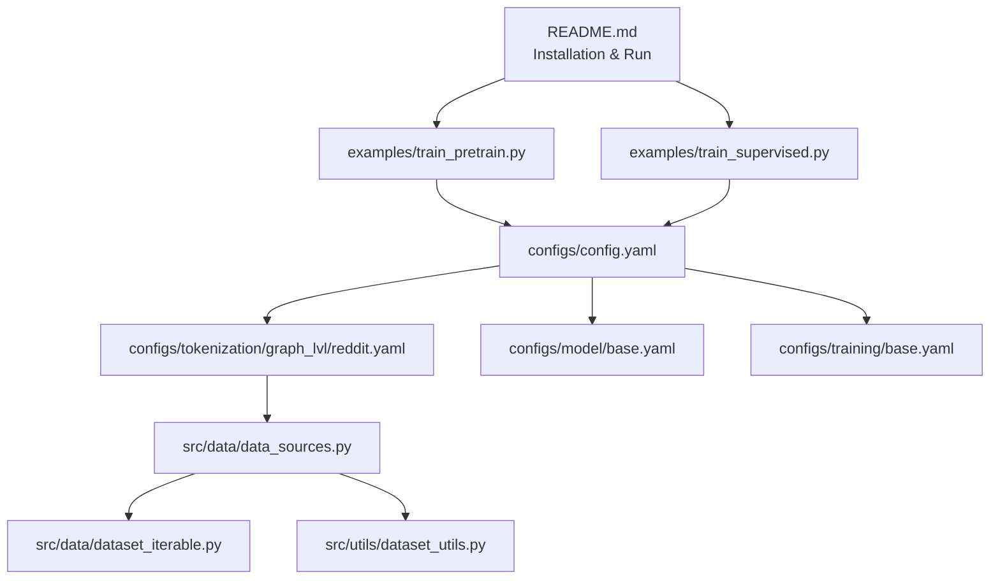
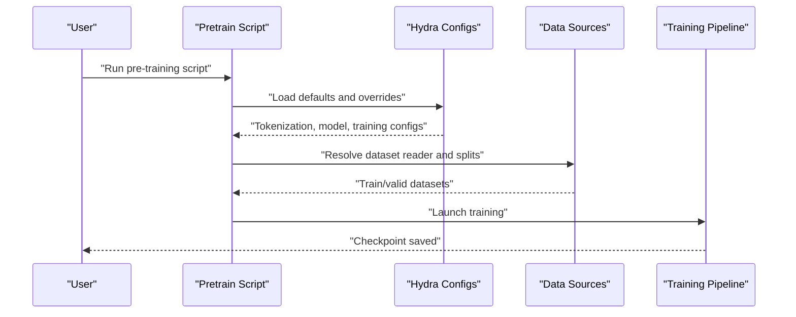
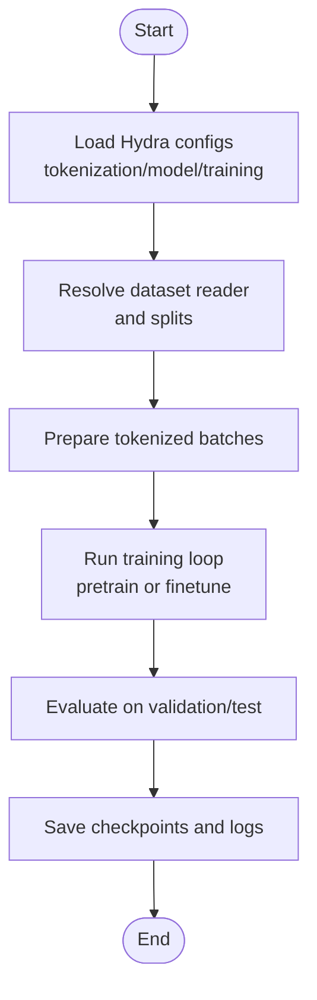
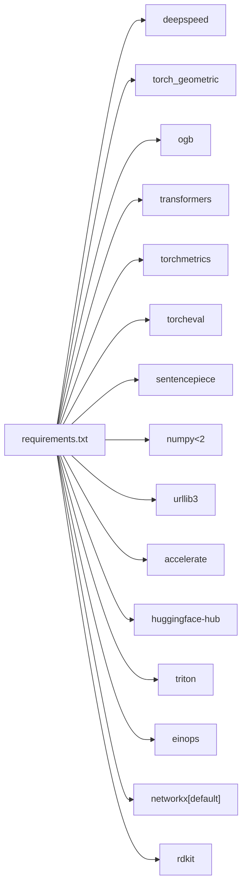

# Getting Started

<cite>
**Referenced Files in This Document**
- [README.md](file://README.md)
- [requirements.txt](file://requirements.txt)
- [examples/toy_examples/reddit_pretrain.sh](file://examples/toy_examples/reddit_pretrain.sh)
- [examples/toy_examples/reddit_supervised.sh](file://examples/toy_examples/reddit_supervised.sh)
- [configs/config.yaml](file://configs/config.yaml)
- [configs/tokenization/graph_lvl/reddit.yaml](file://configs/tokenization/graph_lvl/reddit.yaml)
- [configs/model/base.yaml](file://configs/model/base.yaml)
- [configs/training/base.yaml](file://configs/training/base.yaml)
- [examples/train_pretrain.py](file://examples/train_pretrain.py)
- [examples/train_supervised.py](file://examples/train_supervised.py)
- [src/data/data_sources.py](file://src/data/data_sources.py)
- [src/data/dataset_iterable.py](file://src/data/dataset_iterable.py)
- [src/utils/dataset_utils.py](file://src/utils/dataset_utils.py)
</cite>

## Table of Contents
1. [Introduction](#introduction)
2. [Project Structure](#project-structure)
3. [Core Components](#core-components)
4. [Architecture Overview](#architecture-overview)
5. [Detailed Component Analysis](#detailed-component-analysis)
6. [Dependency Analysis](#dependency-analysis)
7. [Performance Considerations](#performance-considerations)
8. [Troubleshooting Guide](#troubleshooting-guide)
9. [Conclusion](#conclusion)
10. [Appendices](#appendices)

## Introduction
This guide helps you quickly install Graph-GPT, validate your environment with a toy example using the Reddit dataset, and run both pre-training and supervised fine-tuning. It covers Python and PyTorch version compatibility, CUDA requirements, installation via Anaconda and pip, resolving torch-scatter and torch-sparse, and the end-to-end workflow from data preparation to evaluation. It also provides troubleshooting advice for common installation issues.

## Project Structure
At a high level, the repository is organized into:
- configs/: Hydra/OmegaConf YAML configuration groups for tokenization, model, training, and generation
- examples/: thin entry scripts for pre-training and fine-tuning, plus runnable toy examples
- src/: core libraries for data loading, tokenization, model definitions, training orchestration, and utilities
- requirements.txt: pinned Python dependencies

**Diagram sources**
- [README.md:203-246](file://README.md#L203-L246)
- [examples/train_pretrain.py:12-14](file://examples/train_pretrain.py#L12-L14)
- [examples/train_supervised.py:12-14](file://examples/train_supervised.py#L12-L14)
- [configs/config.yaml:1-20](file://configs/config.yaml#L1-L20)
- [configs/tokenization/graph_lvl/reddit.yaml:1-121](file://configs/tokenization/graph_lvl/reddit.yaml#L1-L121)
- [configs/model/base.yaml:1-222](file://configs/model/base.yaml#L1-L222)
- [configs/training/base.yaml:1-78](file://configs/training/base.yaml#L1-L78)
- [src/data/data_sources.py:1-200](file://src/data/data_sources.py#L1-L200)
- [src/data/dataset_iterable.py:37-74](file://src/data/dataset_iterable.py#L37-L74)
- [src/utils/dataset_utils.py:1-200](file://src/utils/dataset_utils.py#L1-L200)

**Section sources**
- [README.md:248-286](file://README.md#L248-L286)

## Core Components
- Installation and environment
  - Python and PyTorch versions, CUDA versions, and recommended packages are documented in the repository’s installation section.
  - Dependencies are managed via requirements.txt and include deepspeed, torch_geometric, ogb, transformers, and others.
- Toy examples
  - Pre-training and supervised fine-tuning scripts for the Reddit dataset are provided under examples/toy_examples/.
- Configuration system
  - Hydra/OmegaConf merges defaults for tokenization, model, training, and generation.
  - Tokenization config for Reddit defines dataset source, tokenizer class, and vocabulary tokens.
  - Model and training base configs define architecture, heads, scheduling, and optimizer settings.

**Section sources**
- [README.md:203-246](file://README.md#L203-L246)
- [requirements.txt:1-27](file://requirements.txt#L1-L27)
- [examples/toy_examples/reddit_pretrain.sh:1-257](file://examples/toy_examples/reddit_pretrain.sh#L1-L257)
- [examples/toy_examples/reddit_supervised.sh:1-300](file://examples/toy_examples/reddit_supervised.sh#L1-L300)
- [configs/config.yaml:1-20](file://configs/config.yaml#L1-L20)
- [configs/tokenization/graph_lvl/reddit.yaml:1-121](file://configs/tokenization/graph_lvl/reddit.yaml#L1-L121)
- [configs/model/base.yaml:1-222](file://configs/model/base.yaml#L1-L222)
- [configs/training/base.yaml:1-78](file://configs/training/base.yaml#L1-L78)

## Architecture Overview
The end-to-end workflow for the Reddit toy example:
- Pre-training: run the pre-training script with tokenization and training overrides
- Supervised fine-tuning: run the supervised script with task-specific overrides
- Data loading: dataset readers resolve the dataset source and split indices; iterable datasets and clustering utilities support large graphs

**Diagram sources**
- [examples/train_pretrain.py:12-14](file://examples/train_pretrain.py#L12-L14)
- [configs/config.yaml:1-20](file://configs/config.yaml#L1-L20)
- [configs/tokenization/graph_lvl/reddit.yaml:1-121](file://configs/tokenization/graph_lvl/reddit.yaml#L1-L121)
- [src/data/data_sources.py:1-200](file://src/data/data_sources.py#L1-L200)

## Detailed Component Analysis

### Installation Requirements and Environment Setup
- Python and PyTorch
  - The repository documents tested versions for different releases. Use the Anaconda channel and pinned versions for reproducibility.
- CUDA
  - CUDA versions are documented alongside tested PyTorch versions.
- Dependencies
  - Install pinned dependencies from requirements.txt after creating and activating the conda environment.
  - Resolve torch-scatter and torch-sparse using the provided wheel index matching your PyTorch and CUDA versions.
- Additional system packages
  - Some environments require additional system packages (e.g., bc) for preprocessing.

Step-by-step installation using Anaconda and pip:
- Create and activate a conda environment with the recommended Python and PyTorch versions and CUDA toolkit.
- Install dependencies from requirements.txt.
- Install torch-scatter and torch-sparse from the appropriate wheel index.
- Optionally install additional system packages as needed.

Validation:
- Run the Reddit toy example scripts for pre-training and supervised fine-tuning to validate installation.

**Section sources**
- [README.md:203-222](file://README.md#L203-L222)
- [requirements.txt:1-27](file://requirements.txt#L1-L27)
- [examples/toy_examples/reddit_pretrain.sh:253](file://examples/toy_examples/reddit_pretrain.sh#L253)
- [examples/toy_examples/reddit_supervised.sh:296](file://examples/toy_examples/reddit_supervised.sh#L296)

### Running Toy Examples with Reddit Dataset
- Pre-training
  - Modify dataset and model parameters in the pre-training script as needed, then execute the script to pre-train on the Reddit dataset.
- Supervised fine-tuning
  - Modify task-specific parameters in the supervised script, then execute to fine-tune on the Reddit dataset.

These scripts demonstrate the minimal configuration needed to run end-to-end training and evaluation.

**Section sources**
- [README.md:236-246](file://README.md#L236-L246)
- [examples/toy_examples/reddit_pretrain.sh:1-257](file://examples/toy_examples/reddit_pretrain.sh#L1-L257)
- [examples/toy_examples/reddit_supervised.sh:1-300](file://examples/toy_examples/reddit_supervised.sh#L1-L300)

### Basic Workflow: From Data Preparation to Evaluation
- Data preparation
  - The configuration specifies the dataset source and tokenizer class. Data sources resolve dataset readers and optionally split indices for train/validation/test.
- Model configuration
  - The model base config defines architecture, heads, and dropout settings. Tokenization config controls how structure and semantics are represented.
- Training configuration
  - The training base config sets scheduling, optimizer, and evaluation settings. Overrides are passed via command-line arguments in the example scripts.
- Execution
  - The training entry scripts initialize the pipeline with the chosen mode (pretrain or finetune) and run the configured workflow.

**Diagram sources**
- [configs/config.yaml:1-20](file://configs/config.yaml#L1-L20)
- [configs/tokenization/graph_lvl/reddit.yaml:1-121](file://configs/tokenization/graph_lvl/reddit.yaml#L1-L121)
- [configs/model/base.yaml:1-222](file://configs/model/base.yaml#L1-L222)
- [configs/training/base.yaml:1-78](file://configs/training/base.yaml#L1-L78)
- [examples/train_pretrain.py:12-14](file://examples/train_pretrain.py#L12-L14)
- [examples/train_supervised.py:12-14](file://examples/train_supervised.py#L12-L14)

**Section sources**
- [configs/config.yaml:1-20](file://configs/config.yaml#L1-L20)
- [configs/tokenization/graph_lvl/reddit.yaml:1-121](file://configs/tokenization/graph_lvl/reddit.yaml#L1-L121)
- [configs/model/base.yaml:1-222](file://configs/model/base.yaml#L1-L222)
- [configs/training/base.yaml:1-78](file://configs/training/base.yaml#L1-L78)
- [examples/train_pretrain.py:12-14](file://examples/train_pretrain.py#L12-L14)
- [examples/train_supervised.py:12-14](file://examples/train_supervised.py#L12-L14)

### Prerequisite Knowledge
- Python programming
- PyTorch fundamentals (tensors, autograd, modules, optimizers)
- Graph theory basics (nodes, edges, paths, graph representations)
- Transformer architecture understanding (attention, positional encodings, pre/post-training objectives)

[No sources needed since this section provides general guidance]

## Dependency Analysis
The runtime dependencies are declared in requirements.txt and include deepspeed, torch_geometric, ogb, transformers, and others. The data pipeline relies on PyG and optional sparse utilities; certain components require torch-sparse or pyg-lib.

**Diagram sources**
- [requirements.txt:1-27](file://requirements.txt#L1-L27)

**Section sources**
- [requirements.txt:1-27](file://requirements.txt#L1-L27)
- [src/data/dataset_iterable.py:37-74](file://src/data/dataset_iterable.py#L37-L74)
- [src/utils/dataset_utils.py:1248-1282](file://src/utils/dataset_utils.py#L1248-L1282)

## Performance Considerations
- Use DeepSpeed for efficient large-scale training as demonstrated by the example scripts.
- Adjust batch size, gradient accumulation, and optimizer settings according to your hardware capacity.
- For graph-level tasks, consider dataset-specific preprocessing and caching strategies to reduce I/O overhead.

[No sources needed since this section provides general guidance]

## Troubleshooting Guide
Common installation issues and resolutions:
- Missing torch-sparse or pyg-lib
  - Certain data utilities require torch-sparse or pyg-lib. If unavailable, the code raises an ImportError indicating the missing dependency. Install the compatible wheel for torch-sparse and/or ensure pyg-lib is available.
- CUDA and PyTorch mismatch
  - Ensure your CUDA toolkit version matches the PyTorch version pinned in the environment creation step. Use the wheel index for torch-scatter and torch-sparse that corresponds to your PyTorch and CUDA versions.
- System packages
  - Some scripts or preprocessing steps may require additional system packages (e.g., bc). Install them as indicated in the installation instructions.

**Section sources**
- [src/data/dataset_iterable.py:37-74](file://src/data/dataset_iterable.py#L37-L74)
- [src/utils/dataset_utils.py:1248-1282](file://src/utils/dataset_utils.py#L1248-L1282)
- [README.md:203-222](file://README.md#L203-L222)

## Conclusion
You now have a complete path to install Graph-GPT, validate your environment with the Reddit toy examples, and run both pre-training and supervised fine-tuning. Use the provided scripts and configuration files as templates to adapt to your datasets and hardware. Refer to the troubleshooting section if you encounter environment-related issues.

## Appendices
- Quick commands
  - Create environment, install dependencies, and run toy examples as described in the repository’s installation and run sections.

**Section sources**
- [README.md:203-246](file://README.md#L203-L246)
