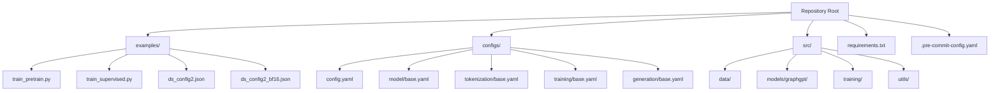
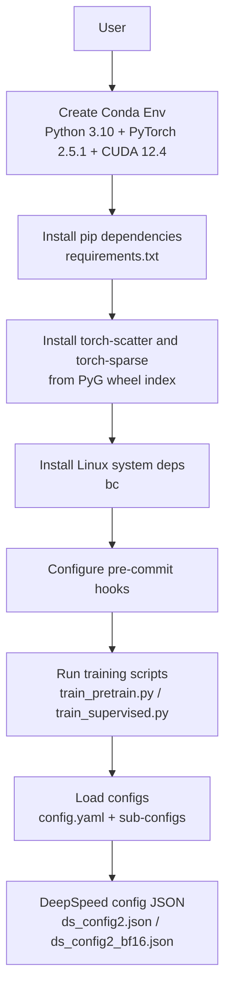
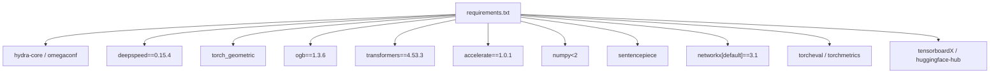
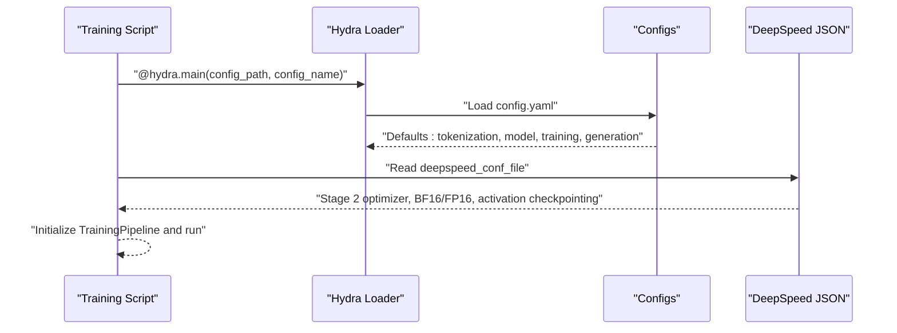

# Installation & Setup

<cite>
**Referenced Files in This Document**
- [README.md](file://README.md)
- [requirements.txt](file://requirements.txt)
- [.pre-commit-config.yaml](file://.pre-commit-config.yaml)
- [examples/train_pretrain.py](file://examples/train_pretrain.py)
- [examples/train_supervised.py](file://examples/train_supervised.py)
- [examples/ds_config2.json](file://examples/ds_config2.json)
- [examples/ds_config2_bf16.json](file://examples/ds_config2_bf16.json)
- [configs/config.yaml](file://configs/config.yaml)
- [configs/model/base.yaml](file://configs/model/base.yaml)
- [configs/tokenization/base.yaml](file://configs/tokenization/base.yaml)
- [configs/training/base.yaml](file://configs/training/base.yaml)
- [configs/generation/base.yaml](file://configs/generation/base.yaml)
</cite>

## Table of Contents
1. [Introduction](#introduction)
2. [Project Structure](#project-structure)
3. [Core Components](#core-components)
4. [Architecture Overview](#architecture-overview)
5. [Detailed Component Analysis](#detailed-component-analysis)
6. [Dependency Analysis](#dependency-analysis)
7. [Performance Considerations](#performance-considerations)
8. [Troubleshooting Guide](#troubleshooting-guide)
9. [Conclusion](#conclusion)
10. [Appendices](#appendices)

## Introduction
This guide provides a complete, step-by-step installation and setup procedure for Graph-GPT. It covers system requirements, environment creation with Anaconda, dependency installation via pip, platform-specific notes for Linux, GPU requirements, pre-commit configuration for code quality, environment activation and verification, validation steps, and troubleshooting common issues. Guidance is also included for different deployment scenarios (CPU vs GPU) and version compatibility matrices derived from the repository.

## Project Structure
The repository is organized around:
- examples/: runnable training scripts and configuration JSONs for DeepSpeed
- configs/: structured YAML configurations for tokenization, model, training, and generation
- src/: core Python modules for data, models, training, and utilities
- requirements.txt: pinned and compatible Python dependencies
- README.md: installation instructions, environment notes, and developer workflow

**Diagram sources**
- [README.md:248-286](file://README.md#L248-L286)
- [examples/train_pretrain.py:1-19](file://examples/train_pretrain.py#L1-L19)
- [examples/train_supervised.py:1-19](file://examples/train_supervised.py#L1-L19)
- [examples/ds_config2.json:1-43](file://examples/ds_config2.json#L1-L43)
- [examples/ds_config2_bf16.json:1-38](file://examples/ds_config2_bf16.json#L1-L38)
- [configs/config.yaml:1-20](file://configs/config.yaml#L1-L20)
- [configs/model/base.yaml:1-222](file://configs/model/base.yaml#L1-L222)
- [configs/tokenization/base.yaml:1-117](file://configs/tokenization/base.yaml#L1-L117)
- [configs/training/base.yaml:1-78](file://configs/training/base.yaml#L1-L78)
- [configs/generation/base.yaml:1-40](file://configs/generation/base.yaml#L1-L40)

**Section sources**
- [README.md:248-286](file://README.md#L248-L286)

## Core Components
- Environment and Python: The repository supports Python 3.8 and 3.10, with version-specific notes for PyTorch and CUDA compatibility.
- PyTorch and CUDA: PyTorch 2.5.1 is used in recent testing; CUDA 12.4 is recommended for GPU acceleration.
- Dependencies: Core packages include DeepSpeed, torch_geometric, ogb, transformers, accelerate, numpy<2, sentencepiece, and others.
- Platform: Linux is supported; additional system utilities (e.g., bc) are required for certain workflows.
- GPU: NVIDIA GPUs are required for accelerated training; CPU-only mode is supported for limited tasks.

**Section sources**
- [README.md:203-222](file://README.md#L203-L222)
- [requirements.txt:1-27](file://requirements.txt#L1-L27)

## Architecture Overview
The installation pipeline integrates environment setup, dependency installation, optional GPU extensions, and developer tooling. The training entry points load configurations from the configs directory and orchestrate pre-training or fine-tuning.

**Diagram sources**
- [README.md:203-222](file://README.md#L203-L222)
- [requirements.txt:1-27](file://requirements.txt#L1-L27)
- [.pre-commit-config.yaml:1-12](file://.pre-commit-config.yaml#L1-L12)
- [examples/train_pretrain.py:1-19](file://examples/train_pretrain.py#L1-L19)
- [examples/train_supervised.py:1-19](file://examples/train_supervised.py#L1-L19)
- [examples/ds_config2.json:1-43](file://examples/ds_config2.json#L1-L43)
- [examples/ds_config2_bf16.json:1-38](file://examples/ds_config2_bf16.json#L1-L38)
- [configs/config.yaml:1-20](file://configs/config.yaml#L1-L20)

## Detailed Component Analysis

### System Requirements and Compatibility Matrix
- Python versions:
  - Version <= 0.5.0: tested with Python 3.8 and PyTorch 1.13.1 on CUDA 11.7/11.8/12.1
  - Version >= 0.6.0: tested with Python 3.10 and PyTorch 2.5.1 on CUDA 12.4
- PyTorch and CUDA:
  - Recommended: PyTorch 2.5.1 with CUDA 12.4 for GPU acceleration
  - CPU-only mode is supported for limited tasks
- Hardware:
  - GPU: NVIDIA GPUs recommended; CPU-only supported for small-scale runs
- Operating system:
  - Linux is supported; additional system utilities may be required

**Section sources**
- [README.md:211-214](file://README.md#L211-L214)

### Environment Creation with Anaconda
Steps:
- Create a conda environment with Python 3.10 and PyTorch 2.5.1 plus CUDA toolkit
- Activate the environment
- Install pip dependencies from requirements.txt
- Install torch-scatter and torch-sparse from the PyG wheel index
- Install Linux system dependencies (e.g., bc)

Notes:
- The commands are provided in the repository’s README under the Installation section.

**Section sources**
- [README.md:215-222](file://README.md#L215-L222)

### Dependency Management with pip
- Install pinned dependencies from requirements.txt after activating the conda environment
- Pay special attention to:
  - DeepSpeed version pinning
  - numpy<2 constraint
  - Transformers and accelerate versions
  - torch_geometric and OGB versions
- Optional: Install FlashAttention-related constraints as noted in comments

Validation:
- After installation, verify that imports succeed in Python for core modules used by training scripts.

**Section sources**
- [requirements.txt:1-27](file://requirements.txt#L1-L27)
- [examples/train_pretrain.py:1-19](file://examples/train_pretrain.py#L1-L19)
- [examples/train_supervised.py:1-19](file://examples/train_supervised.py#L1-L19)

### Platform-Specific Notes for Linux
- Install system utilities as required by certain workflows
- Ensure CUDA drivers match the installed toolkit version
- Confirm GPU visibility using standard CUDA diagnostics

**Section sources**
- [README.md:221](file://README.md#L221)

### GPU Requirements and CPU Fallback
- GPU acceleration is recommended for efficient training
- CPU-only mode is supported for small-scale runs and limited tasks
- Scripts include environment toggles to switch between CPU and GPU modes

**Section sources**
- [README.md:302-307](file://README.md#L302-L307)
- [examples/graph_lvl/pcqm4m_v2_pretrain.sh:86-101](file://examples/graph_lvl/pcqm4m_v2_pretrain.sh#L86-L101)

### Pre-commit Configuration for Code Quality
- Configure pre-commit hooks to enforce formatting and linting
- Typical hooks include YAML checks, end-of-file fixer, trailing whitespace removal, and Black formatting
- Install hooks into Git to run automatically on commits

**Section sources**
- [README.md:288-311](file://README.md#L288-L311)
- [.pre-commit-config.yaml:1-12](file://.pre-commit-config.yaml#L1-L12)

### Environment Activation and Verification
- Activate the conda environment before installing dependencies
- Verify environment:
  - Confirm Python version and PyTorch availability
  - Test imports of core training modules
  - Validate DeepSpeed and torch_geometric installations
  - Optionally run a minimal training script in CPU-only mode

**Section sources**
- [README.md:217](file://README.md#L217)
- [examples/train_pretrain.py:1-19](file://examples/train_pretrain.py#L1-L19)
- [examples/train_supervised.py:1-19](file://examples/train_supervised.py#L1-L19)

### Validation Steps
- Import and initialize the training pipeline from examples
- Load configuration groups from configs to ensure YAML parsing succeeds
- Run a short pre-training or fine-tuning job in CPU-only mode to validate end-to-end setup
- Confirm DeepSpeed configuration loading when using GPU

**Section sources**
- [examples/train_pretrain.py:12-18](file://examples/train_pretrain.py#L12-L18)
- [examples/train_supervised.py:12-18](file://examples/train_supervised.py#L12-L18)
- [configs/config.yaml:1-20](file://configs/config.yaml#L1-L20)

### Deployment Scenarios and Configuration
- CPU-only deployment:
  - Use CPU mode in scripts
  - Reduce batch sizes and model sizes accordingly
- GPU deployment:
  - Use DeepSpeed with appropriate configuration JSONs
  - Choose bf16 or fp16 configurations depending on hardware capability

**Section sources**
- [examples/graph_lvl/pcqm4m_v2_pretrain.sh:302-307](file://examples/graph_lvl/pcqm4m_v2_pretrain.sh#L302-L307)
- [examples/ds_config2.json:1-43](file://examples/ds_config2.json#L1-L43)
- [examples/ds_config2_bf16.json:1-38](file://examples/ds_config2_bf16.json#L1-L38)

## Dependency Analysis
The runtime depends on a curated set of Python packages. The following diagram shows key dependencies and their roles:

**Diagram sources**
- [requirements.txt:4-27](file://requirements.txt#L4-L27)

**Section sources**
- [requirements.txt:1-27](file://requirements.txt#L1-L27)

## Performance Considerations
- Use bf16 or fp16 configurations when available to reduce memory footprint
- Adjust micro-batch sizes in DeepSpeed JSON according to GPU memory
- Prefer CPU-only mode for quick validation and debugging
- Keep DeepSpeed versions synchronized across workers to avoid initialization issues

[No sources needed since this section provides general guidance]

## Troubleshooting Guide
Common issues and resolutions:
- DeepSpeed version mismatch across workers:
  - Ensure identical DeepSpeed versions across all nodes/workers
- CUDA and driver mismatch:
  - Verify CUDA toolkit and driver versions align with PyTorch’s expectation
- Missing system utilities:
  - Install required Linux packages (e.g., bc) as indicated in the installation steps
- torch-scatter and torch-sparse installation:
  - Use the PyG wheel index URL provided in the installation instructions
- Pre-commit hook failures:
  - Install hooks and run pre-commit autoupdate to keep hooks current

**Section sources**
- [requirements.txt:2](file://requirements.txt#L2-L3)
- [README.md:215-222](file://README.md#L215-L222)
- [README.md:288-311](file://README.md#L288-L311)

## Conclusion
By following the environment setup, dependency installation, and validation steps outlined above, you can deploy Graph-GPT on both CPU and GPU platforms. Adhering to the compatibility matrix and using the provided configuration files ensures a smooth installation and reliable training pipeline.

[No sources needed since this section summarizes without analyzing specific files]

## Appendices

### Installation Command Reference
- Environment creation and activation
- Pip install from requirements.txt
- Optional GPU extension installs
- System dependency installs
- Pre-commit setup

**Section sources**
- [README.md:215-222](file://README.md#L215-L222)
- [.pre-commit-config.yaml:1-12](file://.pre-commit-config.yaml#L1-L12)

### Configuration Loading Flow

**Diagram sources**
- [examples/train_pretrain.py:12-18](file://examples/train_pretrain.py#L12-L18)
- [configs/config.yaml:2-8](file://configs/config.yaml#L2-L8)
- [examples/ds_config2.json:24-27](file://examples/ds_config2.json#L24-L27)
- [examples/ds_config2_bf16.json:19-22](file://examples/ds_config2_bf16.json#L19-L22)
