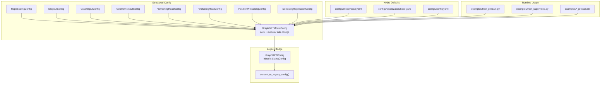
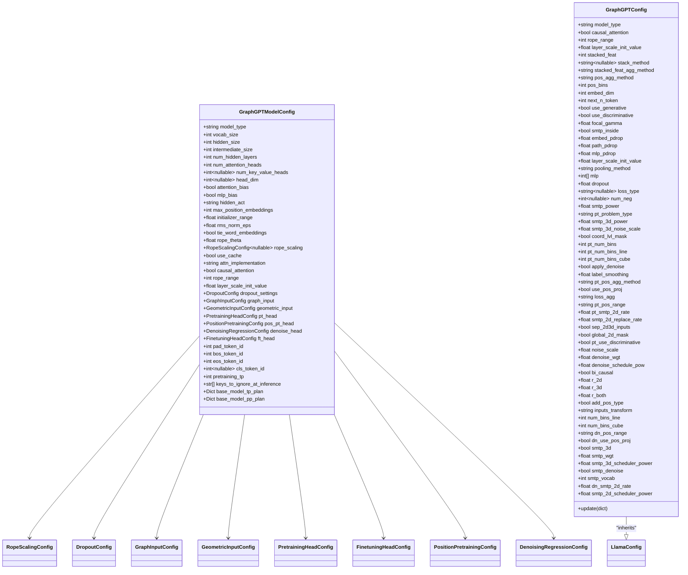
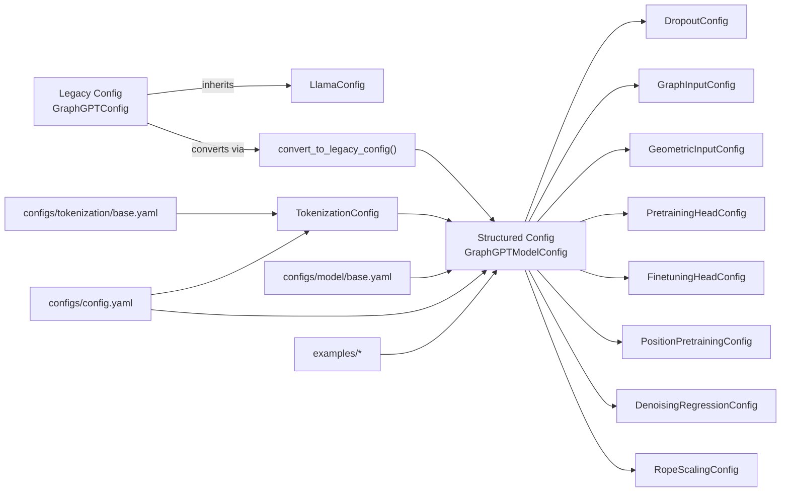

# Configuration System

<cite>
**Referenced Files in This Document**
- [configuration_graphgpt.py](file://src/models/graphgpt/configuration_graphgpt.py)
- [model_configs.py](file://src/conf/model/model_configs.py)
- [base_configs.py](file://src/conf/base_configs.py)
- [token_configs.py](file://src/conf/tokenization/token_configs.py)
- [base.yaml](file://configs/model/base.yaml)
- [base.yaml](file://configs/tokenization/base.yaml)
- [config.yaml](file://configs/config.yaml)
- [train_pretrain.py](file://examples/train_pretrain.py)
- [train_supervised.py](file://examples/train_supervised.py)
- [reddit_pretrain.sh](file://examples/toy_examples/reddit_pretrain.sh)
- [proteins_pretrain.sh](file://examples/node_lvl/proteins_pretrain.sh)
</cite>

## Table of Contents
1. [Introduction](#introduction)
2. [Project Structure](#project-structure)
3. [Core Components](#core-components)
4. [Architecture Overview](#architecture-overview)
5. [Detailed Component Analysis](#detailed-component-analysis)
6. [Dependency Analysis](#dependency-analysis)
7. [Performance Considerations](#performance-considerations)
8. [Troubleshooting Guide](#troubleshooting-guide)
9. [Conclusion](#conclusion)
10. [Appendices](#appendices)

## Introduction
This document explains the GraphGPT configuration system with a focus on the GraphGPTConfig class and the structured configuration approach. It details how GraphGPTConfig inherits from LlamaConfig and extends it with graph-specific parameters for pre-training tasks, geometric inputs, and head configurations. It documents all configuration categories, parameter validation, default values, and the conversion mechanism from the structured GraphGPTModelConfig to the legacy GraphGPTConfig. Practical examples, parameter interdependencies, best practices for different model sizes and tasks, and extensibility mechanisms are included.

## Project Structure
The configuration system is organized around:
- Structured dataclasses for modular configuration (GraphGPTModelConfig and sub-configs)
- Legacy flat configuration bridged via GraphGPTConfig
- YAML-based defaults orchestrated by Hydra/OmegaConf
- Tokenization configuration for graph semantics and structure
- Example scripts demonstrating configuration usage across tasks and model sizes

**Diagram sources**
- [model_configs.py:246-326](file://src/conf/model/model_configs.py#L246-L326)
- [configuration_graphgpt.py:6-210](file://src/models/graphgpt/configuration_graphgpt.py#L6-L210)
- [configuration_graphgpt.py:212-345](file://src/models/graphgpt/configuration_graphgpt.py#L212-L345)
- [base.yaml:1-222](file://configs/model/base.yaml#L1-L222)
- [base.yaml:1-117](file://configs/tokenization/base.yaml#L1-L117)
- [config.yaml:1-20](file://configs/config.yaml#L1-L20)
- [train_pretrain.py:12-14](file://examples/train_pretrain.py#L12-L14)
- [train_supervised.py:12-14](file://examples/train_supervised.py#L12-L14)
- [reddit_pretrain.sh:229-244](file://examples/toy_examples/reddit_pretrain.sh#L229-L244)
- [proteins_pretrain.sh:172-187](file://examples/node_lvl/proteins_pretrain.sh#L172-L187)

**Section sources**
- [model_configs.py:246-326](file://src/conf/model/model_configs.py#L246-L326)
- [configuration_graphgpt.py:6-210](file://src/models/graphgpt/configuration_graphgpt.py#L6-L210)
- [configuration_graphgpt.py:212-345](file://src/models/graphgpt/configuration_graphgpt.py#L212-L345)
- [base.yaml:1-222](file://configs/model/base.yaml#L1-L222)
- [base.yaml:1-117](file://configs/tokenization/base.yaml#L1-L117)
- [config.yaml:1-20](file://configs/config.yaml#L1-L20)
- [train_pretrain.py:12-14](file://examples/train_pretrain.py#L12-L14)
- [train_supervised.py:12-14](file://examples/train_supervised.py#L12-L14)
- [reddit_pretrain.sh:229-244](file://examples/toy_examples/reddit_pretrain.sh#L229-L244)
- [proteins_pretrain.sh:172-187](file://examples/node_lvl/proteins_pretrain.sh#L172-L187)

## Core Components
- GraphGPTModelConfig: Modular, structured configuration with core Llama/Transformer parameters, dropout settings, graph input, geometric input, pretraining head, position pretraining head, denoising regression head, and downstream fine-tuning head. It also includes tokenizer-related tokens and tensor-parallel plans.
- GraphGPTConfig: Legacy flat configuration inheriting from LlamaConfig, adding graph-specific parameters and a conversion utility to bridge to GraphGPTModelConfig.
- TokenizationConfig: Defines tokenizer class, data sources, semantics (node/edge/graph attributes), structure tokens, and related metadata.
- Hydra defaults: YAML files under configs define default values for model and tokenization, consumed by the structured dataclasses.

Key responsibilities:
- GraphGPTModelConfig centralizes modular configuration for easy overrides and composability.
- GraphGPTConfig ensures compatibility with Transformers’ LlamaConfig-based APIs and provides a conversion bridge.
- TokenizationConfig aligns tokenizer semantics with model inputs and graph structure.

**Section sources**
- [model_configs.py:246-326](file://src/conf/model/model_configs.py#L246-L326)
- [configuration_graphgpt.py:6-210](file://src/models/graphgpt/configuration_graphgpt.py#L6-L210)
- [token_configs.py:115-127](file://src/conf/tokenization/token_configs.py#L115-L127)
- [base.yaml:1-222](file://configs/model/base.yaml#L1-L222)
- [base.yaml:1-117](file://configs/tokenization/base.yaml#L1-L117)

## Architecture Overview
The configuration architecture supports:
- Structured composition via dataclasses for modularity and clarity
- Flat legacy compatibility via GraphGPTConfig
- YAML orchestration via Hydra/OmegaConf defaults
- Runtime integration through training entry points and shell scripts

**Diagram sources**
- [model_configs.py:10-353](file://src/conf/model/model_configs.py#L10-L353)
- [configuration_graphgpt.py:6-210](file://src/models/graphgpt/configuration_graphgpt.py#L6-L210)

**Section sources**
- [model_configs.py:246-326](file://src/conf/model/model_configs.py#L246-L326)
- [configuration_graphgpt.py:6-210](file://src/models/graphgpt/configuration_graphgpt.py#L6-L210)

## Detailed Component Analysis

### GraphGPTConfig: Legacy Flat Configuration
GraphGPTConfig inherits from LlamaConfig and adds graph-specific parameters. It initializes core transformer parameters and graph-specific settings, then delegates to LlamaConfig.__init__ with validated values. It also provides an update method for runtime updates.

Key aspects:
- Inherits core Llama/Transformer parameters from LlamaConfig
- Adds graph-specific parameters for input stacking, geometric inputs, pre-training heads, and denoising regression
- Validates certain parameters (e.g., pooling_method assertion)
- Provides a conversion utility to legacy configuration

Practical usage:
- Used when interfacing with Transformers-based components expecting LlamaConfig
- Bridges structured configuration to legacy APIs

**Section sources**
- [configuration_graphgpt.py:6-210](file://src/models/graphgpt/configuration_graphgpt.py#L6-L210)

### Structured GraphGPTModelConfig: Modular Configuration
GraphGPTModelConfig consolidates all configuration into a single, modular dataclass with sub-configs for:
- Core Llama/Transformer parameters
- Dropout settings
- Graph input feature stacking
- Geometric input handling
- Pretraining head parameters
- Position pretraining head parameters
- Denoising regression head parameters
- Finetuning head parameters
- Tokenizer-related tokens and tensor-parallel plans

Defaults and categories:
- Core architecture defaults mirror Llama-like defaults
- Dropout settings default to zero unless overridden
- Graph input stacking defaults to minimal stacking
- Geometric input defaults for position aggregation and binning
- Pretraining head defaults for generative and discriminative modes
- Position pretraining head defaults for SMTP objectives and masking strategies
- Denoising regression defaults for noise schedules and positional transforms
- Finetuning head defaults for pooling, MLP, and loss configuration

Validation and constraints:
- Pooling method constrained to specific values
- Many parameters validated via downstream usage and scripts

Extensibility:
- New sub-configs can be added to GraphGPTModelConfig
- YAML defaults can be extended to support new categories

**Section sources**
- [model_configs.py:246-326](file://src/conf/model/model_configs.py#L246-L326)

### Conversion Mechanism: From Structured to Legacy
The convert_to_legacy_config function maps a structured GraphGPTModelConfig instance to a legacy GraphGPTConfig instance. It extracts values from sub-configs and handles nested structures like rope_scaling, then removes None values before instantiation.

Conversion highlights:
- Core Llama/Transformer parameters mapped from GraphGPTModelConfig
- Tokenizer-related tokens mapped from GraphGPTModelConfig
- Dropout settings mapped from dropout_settings
- Graph input parameters mapped from graph_input
- Geometric input parameters mapped from geometric_input
- Pretraining head parameters mapped from pt_head
- Finetuning head parameters mapped from ft_head
- Position pretraining head parameters mapped from pos_pt_head
- Denoising regression head parameters mapped from denoise_head
- Rope scaling mapped as a nested dictionary

Validation and safety:
- None values filtered out to prevent validation errors
- Ensures compatibility with legacy APIs

**Section sources**
- [configuration_graphgpt.py:212-345](file://src/models/graphgpt/configuration_graphgpt.py#L212-L345)

### Tokenization Configuration
TokenizationConfig defines:
- Tokenizer class selection
- Data source configuration
- Semantics for node/edge/graph attributes
- Structure tokens and reserved tokens
- ODPS integration for distributed data

Integration with model configuration:
- Determines stacked_feat and embed_dim initialization
- Influences downstream pooling and task types

**Section sources**
- [token_configs.py:115-127](file://src/conf/tokenization/token_configs.py#L115-L127)
- [base_configs.py:206-238](file://src/conf/base_configs.py#L206-L238)

### YAML Defaults and Orchestration
The YAML files under configs define default values for model and tokenization parameters. They are loaded by Hydra/OmegaConf and merged with structured dataclasses.

Model defaults:
- Core architecture parameters
- Dropout settings
- Graph input stacking
- Geometric input parameters
- Pretraining and downstream head parameters
- Tokenizer tokens and tensor-parallel plans

Tokenization defaults:
- Tokenizer class and vocabulary
- Semantics and structure tokens
- Data source paths

Orchestration:
- configs/config.yaml sets defaults for tokenization, model, training, and generation
- Examples demonstrate overriding defaults via command-line or shell variables

**Section sources**
- [base.yaml:1-222](file://configs/model/base.yaml#L1-L222)
- [base.yaml:1-117](file://configs/tokenization/base.yaml#L1-L117)
- [config.yaml:1-20](file://configs/config.yaml#L1-L20)
- [reddit_pretrain.sh:229-244](file://examples/toy_examples/reddit_pretrain.sh#L229-L244)
- [proteins_pretrain.sh:172-187](file://examples/node_lvl/proteins_pretrain.sh#L172-L187)

### Runtime Integration and Usage Patterns
Training entry points and scripts demonstrate how configuration is used:
- TrainingPipeline consumes the unified Config (tokenization + model + training + generation)
- Shell scripts override defaults for model size, dropout, and task type
- Hydra/OmegaConf merges YAML defaults with CLI overrides

Best practices:
- Prefer structured configuration for maintainability
- Use YAML defaults for shared settings across runs
- Override selectively via CLI or shell variables for experiments

**Section sources**
- [train_pretrain.py:12-14](file://examples/train_pretrain.py#L12-L14)
- [train_supervised.py:12-14](file://examples/train_supervised.py#L12-L14)
- [reddit_pretrain.sh:229-244](file://examples/toy_examples/reddit_pretrain.sh#L229-L244)
- [proteins_pretrain.sh:172-187](file://examples/node_lvl/proteins_pretrain.sh#L172-L187)

## Dependency Analysis
The configuration system exhibits clear separation of concerns:
- Structured configuration (GraphGPTModelConfig) depends on sub-config dataclasses
- Legacy configuration (GraphGPTConfig) depends on LlamaConfig and bridges to structured configuration
- Tokenization configuration influences structured configuration initialization
- YAML defaults feed into structured configuration via Hydra/OmegaConf
- Runtime scripts depend on unified configuration for training and inference

**Diagram sources**
- [model_configs.py:246-326](file://src/conf/model/model_configs.py#L246-L326)
- [configuration_graphgpt.py:6-210](file://src/models/graphgpt/configuration_graphgpt.py#L6-L210)
- [configuration_graphgpt.py:212-345](file://src/models/graphgpt/configuration_graphgpt.py#L212-L345)
- [token_configs.py:115-127](file://src/conf/tokenization/token_configs.py#L115-L127)
- [base.yaml:1-222](file://configs/model/base.yaml#L1-L222)
- [base.yaml:1-117](file://configs/tokenization/base.yaml#L1-L117)
- [config.yaml:1-20](file://configs/config.yaml#L1-L20)
- [train_pretrain.py:12-14](file://examples/train_pretrain.py#L12-L14)
- [train_supervised.py:12-14](file://examples/train_supervised.py#L12-L14)

**Section sources**
- [model_configs.py:246-326](file://src/conf/model/model_configs.py#L246-L326)
- [configuration_graphgpt.py:6-210](file://src/models/graphgpt/configuration_graphgpt.py#L6-L210)
- [configuration_graphgpt.py:212-345](file://src/models/graphgpt/configuration_graphgpt.py#L212-L345)
- [token_configs.py:115-127](file://src/conf/tokenization/token_configs.py#L115-L127)
- [base.yaml:1-222](file://configs/model/base.yaml#L1-L222)
- [base.yaml:1-117](file://configs/tokenization/base.yaml#L1-L117)
- [config.yaml:1-20](file://configs/config.yaml#L1-L20)
- [train_pretrain.py:12-14](file://examples/train_pretrain.py#L12-L14)
- [train_supervised.py:12-14](file://examples/train_supervised.py#L12-L14)

## Performance Considerations
- Model size and depth: Choose model_name presets (tiny, mini, small, medium, base, etc.) to balance compute and accuracy. Larger models require more memory and compute.
- Dropout and regularization: Adjust attention_dropout, path_dropout, embed_dropout, and mlp_dropout to control overfitting and training stability.
- Position embeddings and RoPE: Configure rope_theta and rope_scaling for long-context scenarios; ensure attn_implementation matches hardware capabilities.
- Heads and tasks: Enable/disable discriminative and generative pretraining heads based on dataset and task; tune SMTP rates and denoising schedules accordingly.
- Tokenization and packing: Control pack_tokens and max_position_embeddings to manage sequence lengths and memory usage.

[No sources needed since this section provides general guidance]

## Troubleshooting Guide
Common issues and resolutions:
- Parameter validation failures: Ensure pooling_method is one of the supported values; verify that task_type and problem_type combinations are valid for downstream tasks.
- Incompatible shapes or missing tokens: Confirm tokenizer_class and semantics configuration match the dataset; initialize stacked_feat and embed_dim via helper functions.
- Legacy configuration conversion errors: Remove None values before instantiating GraphGPTConfig; ensure all required parameters are present.
- YAML merge conflicts: Use explicit overrides in shell scripts or CLI to avoid ambiguous merges; prefer structured overrides for clarity.

**Section sources**
- [configuration_graphgpt.py:135-140](file://src/models/graphgpt/configuration_graphgpt.py#L135-L140)
- [base_configs.py:206-238](file://src/conf/base_configs.py#L206-L238)
- [configuration_graphgpt.py:339-345](file://src/models/graphgpt/configuration_graphgpt.py#L339-L345)

## Conclusion
The GraphGPT configuration system combines a modern, modular, structured approach with a legacy-compatible bridge. GraphGPTModelConfig organizes core and graph-specific parameters into cohesive sub-configurations, while GraphGPTConfig maintains compatibility with LlamaConfig-based tooling. YAML defaults and runtime scripts enable flexible, reproducible experimentation across tasks and model sizes. The conversion utility ensures seamless migration from structured to legacy configurations when needed.

[No sources needed since this section summarizes without analyzing specific files]

## Appendices

### Configuration Categories and Defaults
- Core Llama/Transformer parameters: vocab_size, hidden_size, intermediate_size, num_hidden_layers, num_attention_heads, num_key_value_heads, head_dim, attention_bias, mlp_bias, hidden_act, max_position_embeddings, initializer_range, rms_norm_eps, tie_word_embeddings, rope_theta, rope_scaling, use_cache, attn_implementation
- Graph-specific parameters: causal_attention, rope_range, layer_scale_init_value
- Dropout settings: embed_dropout, path_dropout, mlp_dropout, attention_dropout
- Graph input: stacked_feat, stack_method, stacked_feat_agg_method, embed_dim
- Geometric input: pos_agg_method, pos_bins
- Pretraining head: next_n_token, use_generative, use_discriminative, focal_gamma, smtp_inside
- Finetuning head: task_type, task_ratio, problem_type, pooling_method, mlp, dropout, loss_type, metric_type, num_neg, num_labels
- Position pretraining head: smtp_power, problem_type, smtp_3d_power, smtp_3d_noise_scale, coord_lvl_mask, num_bins, num_bins_line, num_bins_cube, apply_denoise, label_smoothing, pos_agg_method, use_pos_proj, loss_agg, pos_range, smtp_2d_rate, smtp_2d_replace_rate, sep_2d3d_inputs, global_2d_mask, use_discriminative
- Denoising regression head: noise_scale, denoise_wgt, denoise_schedule_pow, bi_causal, r_2d, r_3d, r_both, add_pos_type, inputs_transform, num_bins_line, num_bins_cube, pos_range, use_pos_proj, smtp_3d, smtp_wgt, smtp_3d_scheduler_power, smtp_denoise, smtp_vocab, smtp_2d_rate, smtp_2d_scheduler_power

**Section sources**
- [model_configs.py:246-326](file://src/conf/model/model_configs.py#L246-L326)
- [base.yaml:1-222](file://configs/model/base.yaml#L1-L222)

### Parameter Validation and Interdependencies
- Pooling method constrained to specific values
- Task type and problem type combinations validated by downstream usage
- Tokenizer class and semantics influence stacked_feat and embed_dim initialization
- SMTP rates and denoising schedules interact with masking strategies

**Section sources**
- [configuration_graphgpt.py:135-140](file://src/models/graphgpt/configuration_graphgpt.py#L135-L140)
- [base_configs.py:206-238](file://src/conf/base_configs.py#L206-L238)

### Practical Examples and Best Practices
- Tiny/Mini/Simple experiments: Use tiny or mini presets; adjust dropout and stacking methods for stability
- Large-scale molecular tasks: Configure geometric input parameters and SMTP settings aligned with 3D coordinates
- Node-level tasks: Tune attention_dropout and path_dropout; select appropriate pooling_method
- Graph-level tasks: Enable discriminative pretraining where beneficial; adjust task_ratio and loss_type

**Section sources**
- [reddit_pretrain.sh:108-190](file://examples/toy_examples/reddit_pretrain.sh#L108-L190)
- [proteins_pretrain.sh:72-128](file://examples/node_lvl/proteins_pretrain.sh#L72-L128)
