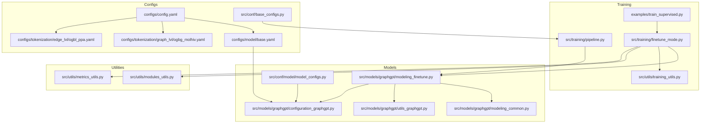
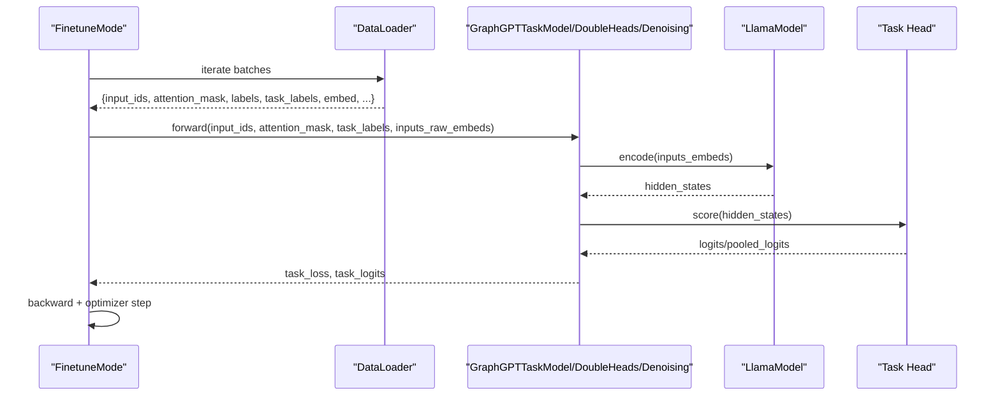
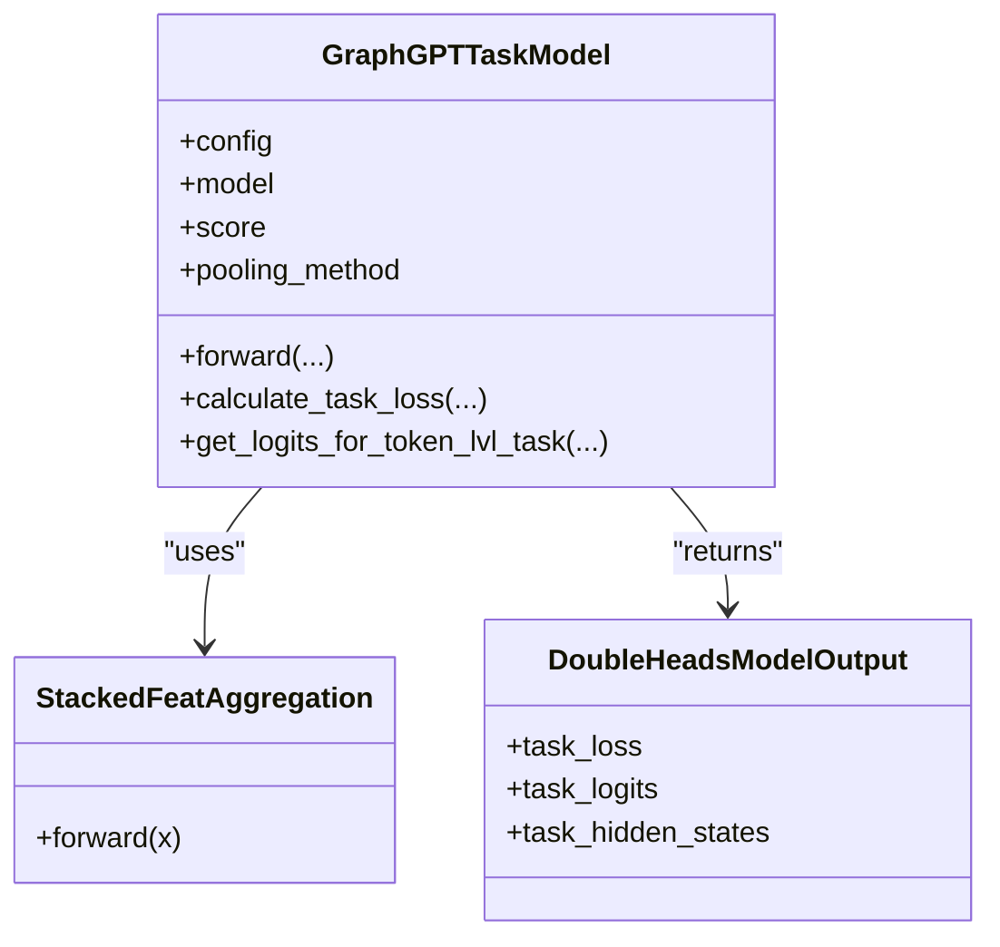
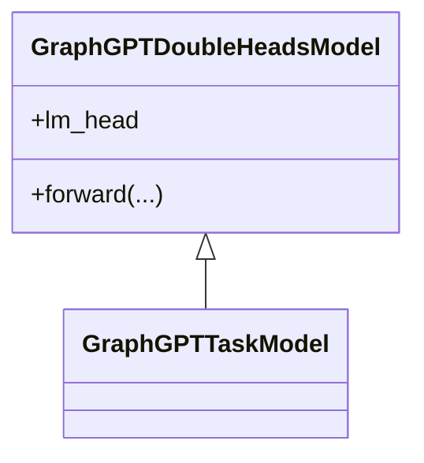
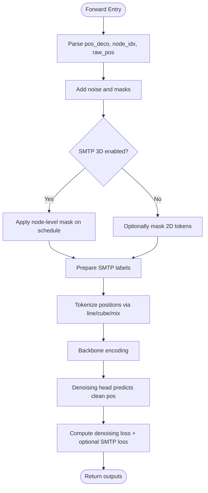
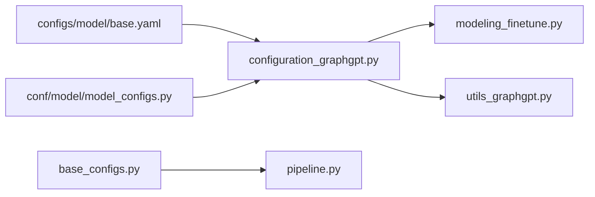
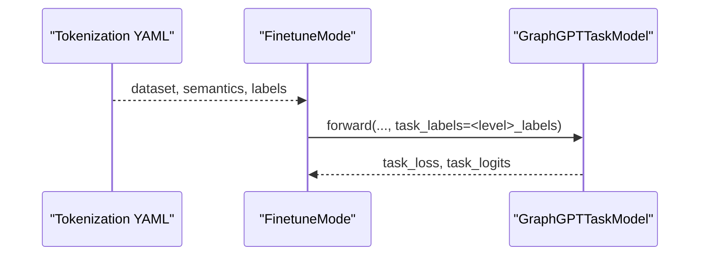
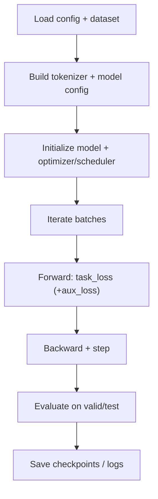
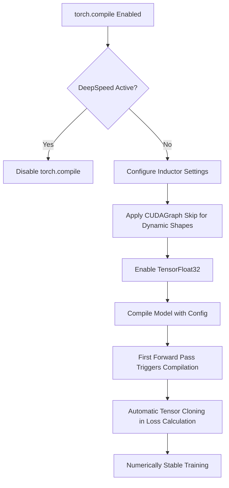
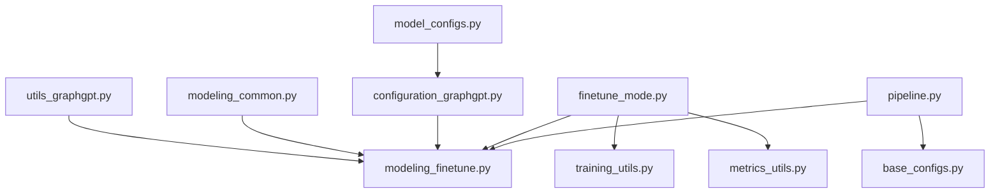

# Fine-tuning Models

<cite>
**Referenced Files in This Document**
- [modeling_finetune.py](file://src/models/graphgpt/modeling_finetune.py)
- [configuration_graphgpt.py](file://src/models/graphgpt/configuration_graphgpt.py)
- [modeling_common.py](file://src/models/graphgpt/modeling_common.py)
- [utils_graphgpt.py](file://src/models/graphgpt/utils_graphgpt.py)
- [finetune_mode.py](file://src/training/finetune_mode.py)
- [modules_utils.py](file://src/utils/modules_utils.py)
- [model_configs.py](file://src/conf/model/model_configs.py)
- [base.yaml](file://configs/model/base.yaml)
- [config.yaml](file://configs/config.yaml)
- [train_supervised.py](file://examples/train_supervised.py)
- [training_utils.py](file://src/utils/training_utils.py)
- [metrics_utils.py](file://src/utils/metrics_utils.py)
- [ogbg_molhiv.yaml](file://configs/tokenization/graph_lvl/ogbg_molhiv.yaml)
- [ogbl_ppa.yaml](file://configs/tokenization/edge_lvl/ogbl_ppa.yaml)
- [pipeline.py](file://src/training/pipeline.py)
- [base_configs.py](file://src/conf/base_configs.py)
</cite>

## Update Summary
**Changes Made**
- Added documentation for torch.compile compatibility improvements
- Updated performance considerations section with numerical stability enhancements
- Enhanced troubleshooting guide with torch.compile specific guidance
- Added new section on torch.compile configuration and best practices

## Table of Contents
1. [Introduction](#introduction)
2. [Project Structure](#project-structure)
3. [Core Components](#core-components)
4. [Architecture Overview](#architecture-overview)
5. [Detailed Component Analysis](#detailed-component-analysis)
6. [Dependency Analysis](#dependency-analysis)
7. [Performance Considerations](#performance-considerations)
8. [Troubleshooting Guide](#troubleshooting-guide)
9. [Conclusion](#conclusion)
10. [Appendices](#appendices)

## Introduction
This document explains the GraphGPT fine-tuning model implementations with a focus on task-specific heads and downstream adaptation. It covers the GraphGPTTaskModel architecture, auxiliary head integration, and multi-level task support across graph, edge, and node scopes. It documents the supervised fine-tuning pipeline, including classification and regression heads, auxiliary task combinations, configuration parameters, pooling methods, and output transformations. It also clarifies the relationship between pre-trained weights and task-specific adaptations, along with best practices for learning rate scheduling and evaluation metrics.

**Updated** Enhanced with recent improvements in torch.compile compatibility and numerical stability during training with dynamic shapes.

## Project Structure
The fine-tuning implementation centers around three primary areas:
- Model definitions and heads: GraphGPTTaskModel, GraphGPTDoubleHeadsModel, and GraphGPTDenoisingRegressionDoubleHeadsModel
- Training orchestration: FinetuneMode and training utilities
- Configuration and tokenization: YAML configs and structured model configs

**Diagram sources**
- [config.yaml:1-20](file://configs/config.yaml#L1-L20)
- [base.yaml:1-222](file://configs/model/base.yaml#L1-L222)
- [ogbg_molhiv.yaml:1-116](file://configs/tokenization/graph_lvl/ogbg_molhiv.yaml#L1-L116)
- [ogbl_ppa.yaml:1-123](file://configs/tokenization/edge_lvl/ogbl_ppa.yaml#L1-L123)
- [base_configs.py:165-186](file://src/conf/base_configs.py#L165-L186)
- [finetune_mode.py:1-459](file://src/training/finetune_mode.py#L1-L459)
- [training_utils.py:1-200](file://src/utils/training_utils.py#L1-L200)
- [train_supervised.py:1-19](file://examples/train_supervised.py#L1-L19)
- [modeling_finetune.py:1-904](file://src/models/graphgpt/modeling_finetune.py#L1-L904)
- [modeling_common.py:1-200](file://src/models/graphgpt/modeling_common.py#L1-L200)
- [utils_graphgpt.py:1-582](file://src/models/graphgpt/utils_graphgpt.py#L1-L582)
- [configuration_graphgpt.py:1-346](file://src/models/graphgpt/configuration_graphgpt.py#L1-L346)
- [model_configs.py:1-353](file://src/conf/model/model_configs.py#L1-L353)
- [modules_utils.py:1-93](file://src/utils/modules_utils.py#L1-L93)
- [metrics_utils.py:1-349](file://src/utils/metrics_utils.py#L1-L349)
- [pipeline.py:167-228](file://src/training/pipeline.py#L167-L228)

**Section sources**
- [config.yaml:1-20](file://configs/config.yaml#L1-L20)
- [base.yaml:1-222](file://configs/model/base.yaml#L1-L222)
- [finetune_mode.py:1-459](file://src/training/finetune_mode.py#L1-L459)
- [modeling_finetune.py:1-904](file://src/models/graphgpt/modeling_finetune.py#L1-L904)
- [pipeline.py:167-228](file://src/training/pipeline.py#L167-L228)

## Core Components
- GraphGPTTaskModel: A sequence classification/regression head built atop a Llama backbone. Supports configurable pooling, MLP heads, and multiple loss strategies.
- GraphGPTDoubleHeadsModel: Extends GraphGPTTaskModel with an auxiliary pre-training head (e.g., masked language modeling) for multi-task training.
- GraphGPTDenoisingRegressionDoubleHeadsModel: Adds a denoising regression head for 3D coordinates and optional auxiliary 3D-SMTP loss, with position tokenization and scheduling.
- Shared components: StackedFeatAggregation, DoubleHeadsModelOutput, and dropout-enabled Llama variants.

Key capabilities:
- Problem types: regression, single-label classification, multi-label classification
- Losses: MSE/L1, CE, BCEWithLogits, AUC loss, token-level CE variants
- Pooling: last, sum, mean (last is enforced for task heads)
- Auxiliary heads: pre-training (optional), denoising regression, 3D-SMTP
- **Enhanced**: Automatic tensor cloning for torch.compile compatibility to prevent CUDAGraph tensor overwrites

**Section sources**
- [modeling_finetune.py:64-327](file://src/models/graphgpt/modeling_finetune.py#L64-L327)
- [modeling_finetune.py:329-424](file://src/models/graphgpt/modeling_finetune.py#L329-L424)
- [modeling_finetune.py:426-904](file://src/models/graphgpt/modeling_finetune.py#L426-L904)
- [modeling_common.py:54-100](file://src/models/graphgpt/modeling_common.py#L54-L100)
- [modeling_common.py:105-143](file://src/models/graphgpt/modeling_common.py#L105-L143)
- [utils_graphgpt.py:69-194](file://src/models/graphgpt/utils_graphgpt.py#L69-L194)

## Architecture Overview
The fine-tuning architecture integrates tokenized graph sequences with a Llama backbone and task-specific heads. Inputs can include stacked node/edge attributes and optional raw 3D coordinates. The task head computes per-sequence logits via pooling, while auxiliary heads optionally compute pre-training or denoising losses.

**Diagram sources**
- [finetune_mode.py:363-459](file://src/training/finetune_mode.py#L363-L459)
- [training_utils.py:98-200](file://src/utils/training_utils.py#L98-L200)
- [modeling_finetune.py:236-327](file://src/models/graphgpt/modeling_finetune.py#L236-L327)

## Detailed Component Analysis

### GraphGPTTaskModel
- Backbone: LlamaModel with optional dropout modules
- Inputs: input_ids, attention_mask, optional inputs_raw_embeds (stacked node/edge attributes)
- Task head: Linear or MLP head projecting to num_labels
- Pooling: enforced to "last" for sequence-level pooling
- Loss computation: automatic problem_type detection and appropriate loss selection
- Token-level special tasks: optional token CE variants with intra-class logits
- **Enhanced**: Automatic tensor cloning in loss calculation to prevent CUDAGraph tensor overwrites during torch.compile execution

**Diagram sources**
- [modeling_finetune.py:64-327](file://src/models/graphgpt/modeling_finetune.py#L64-L327)
- [modeling_common.py:105-143](file://src/models/graphgpt/modeling_common.py#L105-L143)
- [modeling_common.py:54-100](file://src/models/graphgpt/modeling_common.py#L54-L100)

**Section sources**
- [modeling_finetune.py:64-327](file://src/models/graphgpt/modeling_finetune.py#L64-L327)

### GraphGPTDoubleHeadsModel
- Inherits task head from GraphGPTTaskModel
- Adds auxiliary pre-training head (lm_head) when enabled
- Forward returns both task_loss and pretrain_loss for multi-task training

**Diagram sources**
- [modeling_finetune.py:329-424](file://src/models/graphgpt/modeling_finetune.py#L329-L424)

**Section sources**
- [modeling_finetune.py:329-424](file://src/models/graphgpt/modeling_finetune.py#L329-L424)

### GraphGPTDenoisingRegressionDoubleHeadsModel
- Denoising head: predicts 3D coordinates from noisy inputs
- Position tokenization: line, cube, or mixed tokenization with configurable bins and aggregation
- Optional 3D-SMTP auxiliary loss with scheduling
- Optional 2D-SMTP masking and scheduling
- Bi-causal mode and energy-bin weighting for molecular tasks

**Diagram sources**
- [modeling_finetune.py:678-904](file://src/models/graphgpt/modeling_finetune.py#L678-L904)

**Section sources**
- [modeling_finetune.py:426-904](file://src/models/graphgpt/modeling_finetune.py#L426-L904)

### Configuration Parameters and Downstream Adaptation
- Model-level parameters: hidden_size, num_hidden_layers, num_attention_heads, dropout settings, causal_attention, rope settings
- Graph input stacking: stacked_feat, stack_method, stacked_feat_agg_method, embed_dim
- Finetuning head: pooling_method, mlp, dropout, loss_type, num_labels, problem_type
- Position pretraining/denoising: smtp_* parameters, denoise_* parameters, inputs_transform, pos_bins
- Tokenizer integration: vocab_size, bos/eos/pad/cls token ids
- **Enhanced**: torch.compile configuration with automatic tensor cloning for numerical stability

**Diagram sources**
- [base.yaml:1-222](file://configs/model/base.yaml#L1-L222)
- [model_configs.py:1-353](file://src/conf/model/model_configs.py#L1-L353)
- [configuration_graphgpt.py:1-346](file://src/models/graphgpt/configuration_graphgpt.py#L1-L346)
- [modeling_finetune.py:1-904](file://src/models/graphgpt/modeling_finetune.py#L1-L904)
- [utils_graphgpt.py:1-582](file://src/models/graphgpt/utils_graphgpt.py#L1-L582)
- [base_configs.py:165-186](file://src/conf/base_configs.py#L165-L186)
- [pipeline.py:167-228](file://src/training/pipeline.py#L167-L228)

**Section sources**
- [base.yaml:1-222](file://configs/model/base.yaml#L1-L222)
- [model_configs.py:78-109](file://src/conf/model/model_configs.py#L78-L109)
- [configuration_graphgpt.py:26-206](file://src/models/graphgpt/configuration_graphgpt.py#L26-L206)
- [base_configs.py:165-186](file://src/conf/base_configs.py#L165-L186)

### Multi-level Task Support (Graph, Edge, Node)
- Tokenization configs define task scope and label fields per level (graph, edge, node)
- FinetuneMode selects task-specific labels (e.g., graph_labels, edge_labels, node_labels) and passes them to the model
- The model's forward expects task_labels and optional cls_idx for token-level CE variants

**Diagram sources**
- [ogbg_molhiv.yaml:1-116](file://configs/tokenization/graph_lvl/ogbg_molhiv.yaml#L1-L116)
- [ogbl_ppa.yaml:1-123](file://configs/tokenization/edge_lvl/ogbl_ppa.yaml#L1-L123)
- [finetune_mode.py:116-198](file://src/training/finetune_mode.py#L116-L198)
- [training_utils.py:98-200](file://src/utils/training_utils.py#L98-L200)

**Section sources**
- [ogbg_molhiv.yaml:1-116](file://configs/tokenization/graph_lvl/ogbg_molhiv.yaml#L1-L116)
- [ogbl_ppa.yaml:1-123](file://configs/tokenization/edge_lvl/ogbl_ppa.yaml#L1-L123)
- [finetune_mode.py:116-198](file://src/training/finetune_mode.py#L116-L198)
- [training_utils.py:98-200](file://src/utils/training_utils.py#L98-L200)

### Fine-tuning Pipeline, Loss Computation, and Evaluation
- Pipeline: FinetuneMode prepares data loaders, builds tokenizer, sets model config, initializes optimizer/scheduler, and runs training loops
- Batch training: training_utils.ft_batch_training handles AMP, gradient clipping, optimizer step, and multi-task loss combination
- Loss computation: GraphGPTTaskModel.calculate_task_loss selects appropriate loss based on problem_type and includes automatic tensor cloning for torch.compile compatibility
- Evaluation: metrics_utils provides AUROC, accuracy, MSE, MAE depending on problem_type

**Diagram sources**
- [finetune_mode.py:116-459](file://src/training/finetune_mode.py#L116-L459)
- [training_utils.py:98-200](file://src/utils/training_utils.py#L98-L200)
- [metrics_utils.py:16-200](file://src/utils/metrics_utils.py#L16-L200)

**Section sources**
- [finetune_mode.py:116-459](file://src/training/finetune_mode.py#L116-L459)
- [training_utils.py:98-200](file://src/utils/training_utils.py#L98-L200)
- [metrics_utils.py:16-200](file://src/utils/metrics_utils.py#L16-L200)

### torch.compile Compatibility and Numerical Stability
**New Section** The fine-tuning models now include enhanced compatibility with torch.compile for improved performance and numerical stability.

- **Automatic Tensor Cloning**: The `calculate_task_loss` method automatically clones task_loss tensors to prevent CUDAGraph tensor overwrites during graph execution
- **Dynamic Shape Support**: Enhanced support for dynamic shapes in sequence packing scenarios
- **Inductor Configuration**: Automatic configuration of PyTorch Inductor settings for optimal compilation behavior
- **DeepSpeed Compatibility**: Built-in compatibility checks and graceful fallback when DeepSpeed is enabled

**Diagram sources**
- [pipeline.py:170-228](file://src/training/pipeline.py#L170-L228)
- [modeling_finetune.py:232-237](file://src/models/graphgpt/modeling_finetune.py#L232-L237)

**Section sources**
- [pipeline.py:170-228](file://src/training/pipeline.py#L170-L228)
- [modeling_finetune.py:232-237](file://src/models/graphgpt/modeling_finetune.py#L232-L237)

## Dependency Analysis
- Model dependencies: GraphGPTTaskModel depends on modeling_common (StackedFeatAggregation, DoubleHeadsModelOutput) and utils_graphgpt (dropout-enabled Llama layers)
- Training dependencies: FinetuneMode orchestrates data preparation, model creation, optimizer initialization, and training loop
- Configuration dependencies: Structured model_configs.py feeds into configuration_graphgpt.py, which is consumed by modeling_finetune.py
- **Enhanced**: torch.compile configuration integrated into pipeline for automatic optimization

**Diagram sources**
- [utils_graphgpt.py:1-582](file://src/models/graphgpt/utils_graphgpt.py#L1-L582)
- [modeling_finetune.py:1-904](file://src/models/graphgpt/modeling_finetune.py#L1-L904)
- [modeling_common.py:1-200](file://src/models/graphgpt/modeling_common.py#L1-L200)
- [configuration_graphgpt.py:1-346](file://src/models/graphgpt/configuration_graphgpt.py#L1-L346)
- [model_configs.py:1-353](file://src/conf/model/model_configs.py#L1-L353)
- [finetune_mode.py:1-459](file://src/training/finetune_mode.py#L1-L459)
- [training_utils.py:1-200](file://src/utils/training_utils.py#L1-L200)
- [metrics_utils.py:1-349](file://src/utils/metrics_utils.py#L1-L349)
- [pipeline.py:167-228](file://src/training/pipeline.py#L167-L228)
- [base_configs.py:165-186](file://src/conf/base_configs.py#L165-L186)

**Section sources**
- [modeling_finetune.py:1-904](file://src/models/graphgpt/modeling_finetune.py#L1-L904)
- [finetune_mode.py:1-459](file://src/training/finetune_mode.py#L1-L459)
- [pipeline.py:167-228](file://src/training/pipeline.py#L167-L228)

## Performance Considerations
- Use autocast with AMP for reduced memory and improved throughput during training
- Gradient clipping to stabilize training when using AMP
- Layer freezing to reduce trainable parameters and accelerate fine-tuning
- Efficient pooling (last) and optional MLP heads to balance capacity and speed
- Optional dropout and path-drop in the backbone for regularization
- **Enhanced**: Automatic tensor cloning prevents numerical instability during torch.compile execution
- **Enhanced**: Dynamic shape support reduces kernel fragmentation and improves compilation efficiency
- **Enhanced**: Automatic inductor configuration optimizes compilation for different training modes

## Troubleshooting Guide
Common issues and remedies:
- Shape mismatches in stacked features: ensure stacked_feat matches the input tensor dimensions and stacked_feat_agg_method is configured correctly
- Attention mask issues: when causal_attention is disabled, attention_mask is updated accordingly; verify masks align with input_ids lengths
- Loss computation errors: confirm problem_type and loss_type are compatible; for multi-label classification, ensure labels are properly shaped for BCEWithLogitsLoss
- Evaluation metric mismatches: ensure num_labels and problem_type match the model configuration and task labels
- **Enhanced**: torch.compile compatibility issues: check for automatic tensor cloning warnings and ensure proper inductor configuration
- **Enhanced**: Dynamic shape problems: verify that sequence packing is properly configured for torch.compile compatibility
- **Enhanced**: DeepSpeed conflicts: torch.compile is automatically disabled when DeepSpeed is enabled unless explicitly configured otherwise

**Section sources**
- [modeling_common.py:105-143](file://src/models/graphgpt/modeling_common.py#L105-L143)
- [modeling_finetune.py:167-234](file://src/models/graphgpt/modeling_finetune.py#L167-L234)
- [metrics_utils.py:16-200](file://src/utils/metrics_utils.py#L16-L200)
- [pipeline.py:170-228](file://src/training/pipeline.py#L170-L228)

## Conclusion
GraphGPT provides flexible fine-tuning through task-specific heads and auxiliary objectives. The modular design allows seamless adaptation across graph, edge, and node levels, with robust configuration and training utilities. Recent enhancements in torch.compile compatibility and numerical stability make the system more reliable for production training scenarios with dynamic shapes and complex graph structures.

## Appendices

### A. Example Workflows

- Model initialization and forward pass for classification:
  - Initialize model with configuration and tokenizer
  - Prepare inputs: input_ids, attention_mask, task_labels
  - Call forward to obtain task_loss and task_logits

- Forward pass for regression:
  - Same as classification, but with regression-specific loss selection

- Multi-task training with auxiliary head:
  - Enable auxiliary head in configuration
  - Pass pretrain_labels alongside task_labels
  - Combine losses in the training loop

- Denoising regression with 3D-SMTP:
  - Configure denoise_head and smtp_3d parameters
  - Provide noisy 3D coordinates and position type tokens
  - Train with denoising loss and optional SMTP auxiliary loss

**Section sources**
- [finetune_mode.py:116-459](file://src/training/finetune_mode.py#L116-L459)
- [training_utils.py:98-200](file://src/utils/training_utils.py#L98-L200)
- [modeling_finetune.py:236-327](file://src/models/graphgpt/modeling_finetune.py#L236-L327)
- [modeling_finetune.py:426-904](file://src/models/graphgpt/modeling_finetune.py#L426-L904)

### B. Configuration Reference

- Model-level parameters:
  - hidden_size, num_hidden_layers, num_attention_heads, dropout_settings, causal_attention, rope_scaling
- Graph input stacking:
  - stacked_feat, stack_method, stacked_feat_agg_method, embed_dim
- Finetuning head:
  - pooling_method, mlp, dropout, loss_type, num_labels, problem_type
- Position pretraining/denoising:
  - smtp_*, denoise_*, inputs_transform, pos_bins
- **Enhanced**: torch.compile configuration:
  - enabled, mode, backend, fullgraph, dynamic, disable_on_deepspeed

**Section sources**
- [base.yaml:1-222](file://configs/model/base.yaml#L1-L222)
- [model_configs.py:37-109](file://src/conf/model/model_configs.py#L37-L109)
- [configuration_graphgpt.py:26-206](file://src/models/graphgpt/configuration_graphgpt.py#L26-L206)
- [base_configs.py:165-186](file://src/conf/base_configs.py#L165-L186)

### C. Tokenization and Task Types

- Graph-level tasks: use graph semantics and labels
- Edge-level tasks: use edge semantics and labels
- Node-level tasks: use node semantics and labels

**Section sources**
- [ogbg_molhiv.yaml:1-116](file://configs/tokenization/graph_lvl/ogbg_molhiv.yaml#L1-L116)
- [ogbl_ppa.yaml:1-123](file://configs/tokenization/edge_lvl/ogbl_ppa.yaml#L1-L123)

### D. torch.compile Configuration Guide

**New Section** Configuration parameters for enabling and optimizing torch.compile:

- **enabled**: Enable or disable torch.compile (default: False)
- **mode**: Compilation mode - 'default', 'reduce-overhead', 'max-autotune'
  - 'default': Balanced option, works with dynamic shapes (recommended)
  - 'reduce-overhead': Uses CUDAGraphs, NOT recommended for dynamic shapes
  - 'max-autotune': Best performance but slower compilation
- **backend**: Compilation backend - 'inductor' (default), 'cudagraphs', etc.
- **fullgraph**: Whether to require full graph compilation (default: False)
- **dynamic**: Whether to use dynamic shapes (default: True for variable seq lengths)
- **disable_on_deepspeed**: Disable torch.compile when using DeepSpeed (default: True)

**Section sources**
- [base_configs.py:165-186](file://src/conf/base_configs.py#L165-L186)
- [pipeline.py:170-228](file://src/training/pipeline.py#L170-L228)
