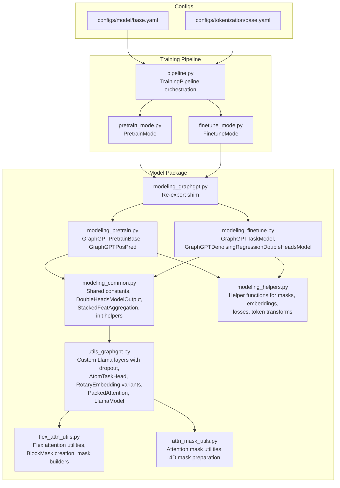
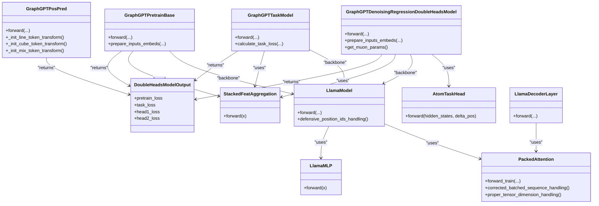
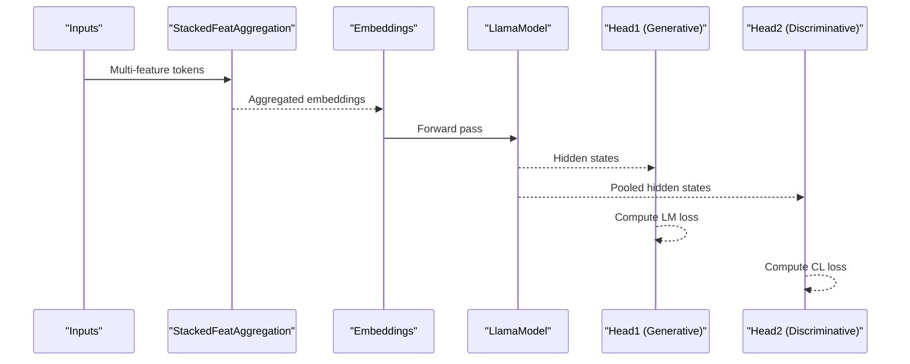
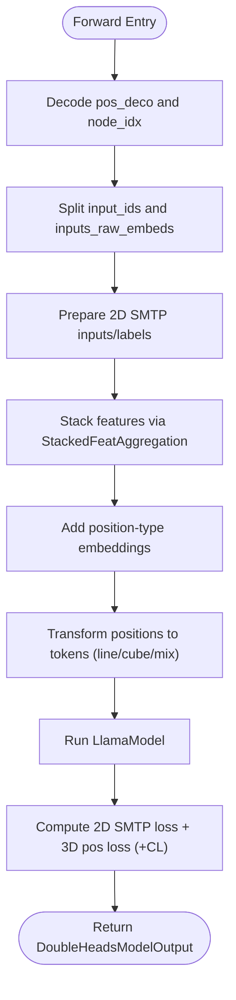
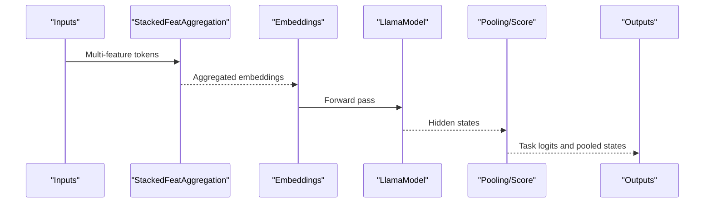
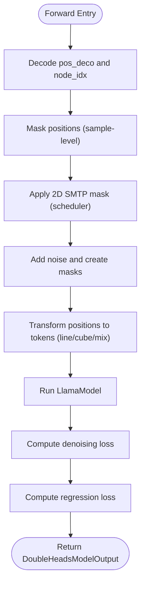
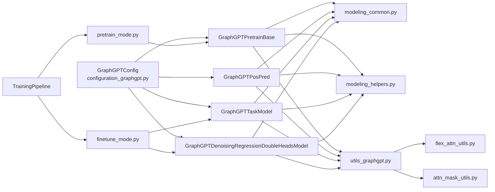
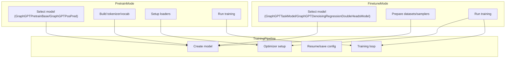

# Model Architecture

<cite>
**Referenced Files in This Document**
- [modeling_graphgpt.py](file://src/models/graphgpt/modeling_graphgpt.py)
- [configuration_graphgpt.py](file://src/models/graphgpt/configuration_graphgpt.py)
- [modeling_pretrain.py](file://src/models/graphgpt/modeling_pretrain.py)
- [modeling_finetune.py](file://src/models/graphgpt/modeling_finetune.py)
- [modeling_common.py](file://src/models/graphgpt/modeling_common.py)
- [modeling_helpers.py](file://src/models/graphgpt/modeling_helpers.py)
- [utils_graphgpt.py](file://src/models/graphgpt/utils_graphgpt.py)
- [flex_attn_utils.py](file://src/utils/flex_attn_utils.py)
- [attn_mask_utils.py](file://src/utils/attn_mask_utils.py)
- [base.yaml](file://configs/model/base.yaml)
- [base.yaml](file://configs/tokenization/base.yaml)
- [pretrain_mode.py](file://src/training/pretrain_mode.py)
- [finetune_mode.py](file://src/training/finetune_mode.py)
- [pipeline.py](file://src/training/pipeline.py)
- [training_utils.py](file://src/utils/training_utils.py)
</cite>

## Update Summary
**Changes Made**
- Updated PackedAttention implementation documentation to reflect corrected batched sequence handling and proper tensor dimension handling in attention output reshaping
- Enhanced packed attention system documentation with comprehensive SDPA and flex_attention implementations
- Added dynamic cache disabling mechanism for flex_attention compatibility
- Integrated gradient checkpointing for memory optimization in packed sequences
- Updated performance considerations to reflect computational efficiency improvements
- Added new section on packed attention architecture and memory optimization strategies
- **Updated** Enhanced defensive programming logic for position_ids=None handling in SPDA path within LlamaModel class, improving model robustness during inference

## Table of Contents
1. [Introduction](#introduction)
2. [Project Structure](#project-structure)
3. [Core Components](#core-components)
4. [Architecture Overview](#architecture-overview)
5. [Detailed Component Analysis](#detailed-component-analysis)
6. [Packed Attention System](#packed-attention-system)
7. [Dependency Analysis](#dependency-analysis)
8. [Performance Considerations](#performance-considerations)
9. [Troubleshooting Guide](#troubleshooting-guide)
10. [Conclusion](#conclusion)
11. [Appendices](#appendices)

## Introduction
This document describes the Graph-GPT model framework's dual-head architecture and modular design. It focuses on the pre-training and fine-tuning components, including GraphGPTPretrainBase, GraphGPTPosPred, GraphGPTTaskModel, and GraphGPTDenoisingRegressionDoubleHeadsModel. The document explains how the transformer backbone is adapted for graph data, how attention masking and positional encoding are handled, and how the shared infrastructure enables seamless transitions from pre-training to fine-tuning. It also documents configuration parameters, input/output specifications, and memory optimization strategies, along with extensibility mechanisms and cross-cutting concerns such as gradient flow optimization.

**Updated** Enhanced with comprehensive packed attention system that processes multiple graphs within a single sequence while maintaining computational efficiency through SDPA and flex_attention implementations. Improved defensive programming logic for position_ids=None handling in SPDA path, enhancing model robustness during inference scenarios.

## Project Structure
The Graph-GPT codebase is organized around a modular model package and a training pipeline that supports both pre-training and fine-tuning modes. The model package exposes a unified re-export shim that routes to specialized implementations for pre-training and fine-tuning. Configuration is split into model, tokenization, and training YAML files, enabling flexible experimentation across datasets and tasks.



**Diagram sources**
- [modeling_graphgpt.py:1-30](file://src/models/graphgpt/modeling_graphgpt.py#L1-L30)
- [modeling_pretrain.py:1-704](file://src/models/graphgpt/modeling_pretrain.py#L1-L704)
- [modeling_finetune.py:1-935](file://src/models/graphgpt/modeling_finetune.py#L1-L935)
- [modeling_common.py:1-204](file://src/models/graphgpt/modeling_common.py#L1-L204)
- [modeling_helpers.py:1-1116](file://src/models/graphgpt/modeling_helpers.py#L1-L1116)
- [utils_graphgpt.py:1-680](file://src/models/graphgpt/utils_graphgpt.py#L1-L680)
- [flex_attn_utils.py:1-289](file://src/utils/flex_attn_utils.py#L1-L289)
- [attn_mask_utils.py:1-42](file://src/utils/attn_mask_utils.py#L1-L42)
- [pretrain_mode.py:1-501](file://src/training/pretrain_mode.py#L1-L501)
- [finetune_mode.py:1-459](file://src/training/finetune_mode.py#L1-L459)
- [pipeline.py:1-258](file://src/training/pipeline.py#L1-L258)
- [base.yaml:1-222](file://configs/model/base.yaml#L1-L222)
- [base.yaml:1-117](file://configs/tokenization/base.yaml#L1-L117)

**Section sources**
- [modeling_graphgpt.py:1-30](file://src/models/graphgpt/modeling_graphgpt.py#L1-L30)
- [base.yaml:1-222](file://configs/model/base.yaml#L1-L222)
- [base.yaml:1-117](file://configs/tokenization/base.yaml#L1-L117)

## Core Components
- GraphGPTPretrainBase: Implements a dual-head pre-training model with optional generative and discriminative objectives. It stacks node/edge attributes, applies embedding dropout, and integrates SMTP-based masking for 2D/3D tokens.
- GraphGPTPosPred: A specialized pre-training head focused on 3D position prediction via SMTP tokenization (line/cube/mix) and optional denoising.
- GraphGPTTaskModel: A sequence classification model for downstream tasks with configurable pooling and optional MLP heads.
- GraphGPTDenoisingRegressionDoubleHeadsModel: A dual-head model combining supervised regression with a denoising head for 3D coordinates, optionally with auxiliary SMTP loss and position-type embeddings.

Key shared infrastructure:
- DoubleHeadsModelOutput: Unified output container for pretrain and task heads.
- StackedFeatAggregation: Modular stacking of multi-feature tokens into a single embedding sequence.
- Modeling helpers: Attention masking, embedding preparation, loss computation, and graph-specific token transforms.
- Custom Llama components: Dropout-enabled MLP and decoder layers, AtomTaskHead for coordinate denoising, and rotary embeddings tailored for graph data.
- **PackedAttention**: Enhanced attention system that processes multiple graphs within a single sequence using SDPA and flex_attention backends with corrected batched sequence handling.
- **LlamaModel**: Packed-sequence LlamaModel that packs valid tokens before layers and unpacks after, enabling efficient multi-graph processing with robust position_ids handling.

**Updated** Added PackedAttention and LlamaModel components for handling packed sequences efficiently with corrected tensor dimension handling and enhanced defensive programming logic for position_ids=None scenarios.

**Section sources**
- [modeling_pretrain.py:57-267](file://src/models/graphgpt/modeling_pretrain.py#L57-L267)
- [modeling_pretrain.py:269-704](file://src/models/graphgpt/modeling_pretrain.py#L269-L704)
- [modeling_finetune.py:64-340](file://src/models/graphgpt/modeling_finetune.py#L64-L340)
- [modeling_finetune.py:443-935](file://src/models/graphgpt/modeling_finetune.py#L443-L935)
- [modeling_common.py:54-100](file://src/models/graphgpt/modeling_common.py#L54-L100)
- [modeling_common.py:105-143](file://src/models/graphgpt/modeling_common.py#L105-L143)
- [modeling_helpers.py:35-49](file://src/models/graphgpt/modeling_helpers.py#L35-L49)
- [modeling_helpers.py:89-140](file://src/models/graphgpt/modeling_helpers.py#L89-L140)
- [utils_graphgpt.py:90-289](file://src/models/graphgpt/utils_graphgpt.py#L90-L289)
- [utils_graphgpt.py:204-292](file://src/models/graphgpt/utils_graphgpt.py#L204-L292)

## Architecture Overview
The Graph-GPT framework adapts the Llama transformer backbone for graph-structured data by:
- Stacking multi-feature tokens into a single sequence via StackedFeatAggregation.
- Integrating external raw embeddings (e.g., node/edge features) with optional dropout and normalization.
- Supporting dual-head objectives: generative (language modeling) and discriminative (contrastive learning).
- Extending to position pre-training with SMTP tokenization and optional denoising heads.
- Enabling downstream regression/classification with configurable pooling and optional MLP heads.
- **Packed attention processing**: Efficiently handling multiple graphs within a single sequence using SDPA and flex_attention backends with corrected batched sequence handling.
- **Robust position handling**: Defensive programming logic ensures proper position_ids handling in both SPDA and flex_attention paths, improving model reliability during inference.



**Diagram sources**
- [modeling_pretrain.py:57-267](file://src/models/graphgpt/modeling_pretrain.py#L57-L267)
- [modeling_pretrain.py:269-704](file://src/models/graphgpt/modeling_pretrain.py#L269-L704)
- [modeling_finetune.py:64-340](file://src/models/graphgpt/modeling_finetune.py#L64-L340)
- [modeling_finetune.py:443-935](file://src/models/graphgpt/modeling_finetune.py#L443-L935)
- [modeling_common.py:54-100](file://src/models/graphgpt/modeling_common.py#L54-L100)
- [modeling_common.py:105-143](file://src/models/graphgpt/modeling_common.py#L105-L143)
- [utils_graphgpt.py:90-289](file://src/models/graphgpt/utils_graphgpt.py#L90-L289)
- [utils_graphgpt.py:204-292](file://src/models/graphgpt/utils_graphgpt.py#L204-L292)
- [utils_graphgpt.py:369-435](file://src/models/graphgpt/utils_graphgpt.py#L369-L435)

## Detailed Component Analysis

### Dual-Head Design and Transformer Adaptation
- Generative head: Predicts next tokens using a language modeling head on top of the transformer backbone. Supports multi-token prediction via a projection head.
- Discriminative head: Computes contrastive loss over pooled representations for unsupervised pre-training objectives.
- Transformer adaptation: Dropout-enabled MLP and decoder layers, optional path-drop and layer-scale initialization, and bi-causal attention support for specific tasks.



**Diagram sources**
- [modeling_pretrain.py:152-267](file://src/models/graphgpt/modeling_pretrain.py#L152-L267)
- [modeling_helpers.py:145-178](file://src/models/graphgpt/modeling_helpers.py#L145-L178)
- [modeling_helpers.py:201-228](file://src/models/graphgpt/modeling_helpers.py#L201-L228)
- [modeling_common.py:105-143](file://src/models/graphgpt/modeling_common.py#L105-L143)
- [utils_graphgpt.py:69-174](file://src/models/graphgpt/utils_graphgpt.py#L69-L174)

**Section sources**
- [modeling_pretrain.py:57-118](file://src/models/graphgpt/modeling_pretrain.py#L57-L118)
- [modeling_helpers.py:145-178](file://src/models/graphgpt/modeling_helpers.py#L145-L178)
- [utils_graphgpt.py:69-174](file://src/models/graphgpt/utils_graphgpt.py#L69-L174)

### Position Pretraining Head (GraphGPTPosPred)
- Objective: Predict 3D positions via SMTP tokenization (line/cube/mix) with optional denoising and CL loss.
- Inputs: Node/edge tokens, position type embeddings, noisy positions.
- Transforms: Discretization into line/cube tokens; optional raw position projection; optional position-type embeddings.
- Heads: Position-bin prediction head and optional 2D SMTP auxiliary head.



**Diagram sources**
- [modeling_pretrain.py:473-704](file://src/models/graphgpt/modeling_pretrain.py#L473-L704)
- [modeling_helpers.py:526-637](file://src/models/graphgpt/modeling_helpers.py#L526-L637)
- [modeling_helpers.py:639-756](file://src/models/graphgpt/modeling_helpers.py#L639-L756)

**Section sources**
- [modeling_pretrain.py:269-352](file://src/models/graphgpt/modeling_pretrain.py#L269-L352)
- [modeling_pretrain.py:354-472](file://src/models/graphgpt/modeling_pretrain.py#L354-L472)
- [modeling_helpers.py:526-637](file://src/models/graphgpt/modeling_helpers.py#L526-L637)

### Downstream Task Head (GraphGPTTaskModel)
- Objective: Sequence-level classification/regression with configurable pooling and optional MLP head.
- Inputs: Stacked tokens and optional raw embeddings.
- Outputs: Task logits and pooled representations.



**Diagram sources**
- [modeling_finetune.py:64-106](file://src/models/graphgpt/modeling_finetune.py#L64-L106)
- [modeling_finetune.py:236-340](file://src/models/graphgpt/modeling_finetune.py#L236-L340)

**Section sources**
- [modeling_finetune.py:64-106](file://src/models/graphgpt/modeling_finetune.py#L64-L106)
- [modeling_finetune.py:167-235](file://src/models/graphgpt/modeling_finetune.py#L167-L235)

### Denoising Regression Double-Heads Model (GraphGPTDenoisingRegressionDoubleHeadsModel)
- Objective: Combine supervised regression with a denoising head for 3D coordinates.
- Inputs: Node/edge tokens, noisy positions, optional position-type embeddings, optional 2D SMTP masking.
- Heads: Regression head and denoising head; optional auxiliary SMTP loss.



**Diagram sources**
- [modeling_finetune.py:695-800](file://src/models/graphgpt/modeling_finetune.py#L695-L800)
- [modeling_finetune.py:678-800](file://src/models/graphgpt/modeling_finetune.py#L678-L800)
- [utils_graphgpt.py:196-247](file://src/models/graphgpt/utils_graphgpt.py#L196-L247)

**Section sources**
- [modeling_finetune.py:426-520](file://src/models/graphgpt/modeling_finetune.py#L426-L520)
- [modeling_finetune.py:678-800](file://src/models/graphgpt/modeling_finetune.py#L678-L800)
- [utils_graphgpt.py:196-247](file://src/models/graphgpt/utils_graphgpt.py#L196-L247)

### Relationship to Diffusion Language Models
- The denoising head mirrors diffusion language models by predicting clean signals from noisy inputs. The AtomTaskHead aggregates pairwise displacements via attention-weighted rotation, aligning with diffusion-style message passing.
- SMTP tokenization provides a structured way to represent 3D coordinates, analogous to denoising score matching in diffusion frameworks.

**Section sources**
- [utils_graphgpt.py:369-435](file://src/models/graphgpt/utils_graphgpt.py#L369-L435)
- [modeling_helpers.py:526-637](file://src/models/graphgpt/modeling_helpers.py#L526-L637)

## Packed Attention System

**New Section** The Graph-GPT framework now features a sophisticated packed attention system that enables efficient processing of multiple graphs within a single sequence while maintaining computational efficiency.

### Packed Attention Architecture
The packed attention system consists of several key components:

- **PackedAttention**: A custom attention implementation that processes multiple graphs within a single sequence using either SDPA or flex_attention backends with corrected batched sequence handling and proper tensor dimension handling.
- **LlamaModel**: A packed-sequence variant of the Llama model that packs valid tokens before layers and unpacks after, enabling efficient multi-graph processing with robust position_ids handling.
- **LlamaDecoderLayer**: Modified decoder layer that works with packed sequences, handling attention computation and MLP operations.
- **Flex Attention Utilities**: Comprehensive utilities for creating BlockMask objects and building attention masks from split_lens and attn_modes.
- **Attention Mask Utilities**: Helper functions for preparing 4D attention masks and handling different attention implementations.

### SDPA vs Flex Attention Paths
The system supports two attention backends:

**SDPA Path (Default)**:
- Uses per-sample 2D attention masks for each graph in the batch
- Processes each sample's attention independently using standard SDPA
- More memory-efficient for typical batch sizes
- Supports gradient checkpointing integration
- **Enhanced**: Robust position_ids handling with defensive programming logic

**Flex Attention Path**:
- Uses BlockMask objects for attention computation
- Requires dynamic=False compilation to avoid cache issues
- Provides superior performance for large-scale multi-graph processing
- Automatically disables caching to prevent symbolic batch-dimension mismatches

### Corrected Batched Sequence Handling
The PackedAttention implementation has been updated to properly handle batched sequences:

- **Batch Size Validation**: Ensures batch_size == 1 for packed sequences to maintain compatibility with flex_attention backend
- **Sequence Packing**: Properly handles the packing/unpacking of sequences using squeeze/unsqueeze operations
- **Tensor Dimension Handling**: Corrected attention output reshaping to maintain proper tensor dimensions throughout the attention computation
- **Position Embedding Management**: Handles packed position embeddings with proper dimension handling for rotary embeddings

### Defensive Programming Logic for Position IDs
**Updated** The LlamaModel class now includes enhanced defensive programming logic for position_ids handling:

```python
# SDPA path with defensive position_ids handling
if position_ids is None:
    seq_len = inputs_embeds.size(1)
    position_ids = torch.arange(
        seq_len, dtype=torch.long, device=inputs_embeds.device
    ).unsqueeze(0)  # [1, seq]
```

This defensive logic ensures that:
- **Robust Inference**: Models can handle cases where position_ids are not provided during inference
- **Consistent Behavior**: Maintains consistent position embedding generation regardless of input parameter presence
- **Memory Efficiency**: Avoids unnecessary computations when position_ids are None
- **Backward Compatibility**: Preserves existing behavior when position_ids are provided

### Dynamic Cache Management
The system automatically manages caching based on attention backend selection:

```mermaid
flowchart TD
A["Attention Implementation Check"] --> B{"Backend == flex_attention?"}
B --> |Yes| C["Disable Caching<br/>DynamicCache causes mismatches"]
B --> |No| D["Enable Caching<br/>Standard behavior"}
C --> E["Proceed with Packed Attention"]
D --> E
```

**Diagram sources**
- [modeling_pretrain.py:205-210](file://src/models/graphgpt/modeling_pretrain.py#L205-L210)
- [modeling_finetune.py:275-280](file://src/models/graphgpt/modeling_finetune.py#L275-L280)

### Gradient Checkpointing Integration
The packed attention system seamlessly integrates with gradient checkpointing for memory optimization:

- **Automatic Integration**: Gradient checkpointing is automatically enabled when gradient_checkpointing is set and training mode is active
- **Memory Efficiency**: Reduces memory usage by recomputing activations during backward pass
- **Computational Trade-off**: Balances memory savings against increased computation time

### Attention Mask Construction
The system provides flexible attention mask construction through split_lens and attn_modes:

- **split_lens**: List of split lengths for each sample, enabling complex attention patterns
- **attn_modes**: Corresponding attention modes ('causal', 'full', 'noise') for each split
- **Per-sample Processing**: Each sample maintains its own attention structure
- **Padding Handling**: Automatic padding extension for sequences shorter than maximum length

**Section sources**
- [utils_graphgpt.py:90-289](file://src/models/graphgpt/utils_graphgpt.py#L90-L289)
- [utils_graphgpt.py:204-292](file://src/models/graphgpt/utils_graphgpt.py#L204-L292)
- [flex_attn_utils.py:161-289](file://src/utils/flex_attn_utils.py#L161-L289)
- [modeling_helpers.py:156-169](file://src/models/graphgpt/modeling_helpers.py#L156-L169)
- [attn_mask_utils.py:10-42](file://src/utils/attn_mask_utils.py#L10-L42)

## Dependency Analysis
The model components share a common configuration and helper utilities, while the training pipeline orchestrates model creation and execution across pre-training and fine-tuning modes.



**Diagram sources**
- [configuration_graphgpt.py:6-206](file://src/models/graphgpt/configuration_graphgpt.py#L6-L206)
- [modeling_pretrain.py:57-267](file://src/models/graphgpt/modeling_pretrain.py#L57-L267)
- [modeling_pretrain.py:269-704](file://src/models/graphgpt/modeling_pretrain.py#L269-L704)
- [modeling_finetune.py:64-340](file://src/models/graphgpt/modeling_finetune.py#L64-L340)
- [modeling_finetune.py:443-935](file://src/models/graphgpt/modeling_finetune.py#L443-L935)
- [modeling_common.py:1-204](file://src/models/graphgpt/modeling_common.py#L1-L204)
- [modeling_helpers.py:1-1116](file://src/models/graphgpt/modeling_helpers.py#L1-L1116)
- [utils_graphgpt.py:1-680](file://src/models/graphgpt/utils_graphgpt.py#L1-L680)
- [flex_attn_utils.py:1-289](file://src/utils/flex_attn_utils.py#L1-L289)
- [attn_mask_utils.py:1-42](file://src/utils/attn_mask_utils.py#L1-L42)
- [pretrain_mode.py:48-76](file://src/training/pretrain_mode.py#L48-L76)
- [finetune_mode.py:43-71](file://src/training/finetune_mode.py#L43-L71)
- [pipeline.py:149-165](file://src/training/pipeline.py#L149-L165)

**Section sources**
- [configuration_graphgpt.py:6-206](file://src/models/graphgpt/configuration_graphgpt.py#L6-L206)
- [modeling_common.py:1-204](file://src/models/graphgpt/modeling_common.py#L1-L204)
- [modeling_helpers.py:1-1116](file://src/models/graphgpt/modeling_helpers.py#L1-L1116)
- [utils_graphgpt.py:1-680](file://src/models/graphgpt/utils_graphgpt.py#L1-L680)
- [flex_attn_utils.py:1-289](file://src/utils/flex_attn_utils.py#L1-L289)
- [attn_mask_utils.py:1-42](file://src/utils/attn_mask_utils.py#L1-L42)
- [pretrain_mode.py:48-76](file://src/training/pretrain_mode.py#L48-L76)
- [finetune_mode.py:43-71](file://src/training/finetune_mode.py#L43-L71)
- [pipeline.py:149-165](file://src/training/pipeline.py#L149-L165)

## Performance Considerations
- Dropout and regularization: MLP and attention dropout, path dropout, and layer-scale initialization are controlled via configuration to balance capacity and stability.
- Bi-causal attention: Enables non-causal attention for specific tasks, improving modeling flexibility.
- Memory optimization: Gradient checkpointing is enabled; cache is disabled to reduce memory footprint; optional DeepSpeed integration for large-scale training.
- Attention masking: Flexible mask utilities support causal, bi-causal, and 3D attention masks; attention mask expansion for packed sequences.
- Positional encoding: Custom rotary embeddings and 3D rotary embeddings adapt RoPE to graph contexts; resonance RoPE variants for long-range dependencies.
- **Packed attention efficiency**: SDPA path processes multiple graphs efficiently with minimal overhead; flex_attention path provides superior performance for large-scale scenarios with automatic cache management.
- **Computational optimization**: Dynamic cache disabling prevents symbolic batch-dimension mismatches; gradient checkpointing reduces memory usage during training.
- **Tensor dimension handling**: Corrected attention output reshaping maintains proper tensor dimensions throughout the packed attention computation.
- **Defensive programming**: Enhanced position_ids handling ensures robust inference scenarios with improved model reliability.

**Updated** Enhanced with packed attention system performance characteristics and memory optimization strategies, including corrected batched sequence handling, proper tensor dimension management, and robust defensive programming logic for position_ids=None scenarios.

**Section sources**
- [modeling_common.py:148-204](file://src/models/graphgpt/modeling_common.py#L148-L204)
- [modeling_helpers.py:35-65](file://src/models/graphgpt/modeling_helpers.py#L35-L65)
- [utils_graphgpt.py:69-174](file://src/models/graphgpt/utils_graphgpt.py#L69-L174)
- [pretrain_mode.py:271-300](file://src/training/pretrain_mode.py#L271-L300)
- [finetune_mode.py:218-258](file://src/training/finetune_mode.py#L218-L258)
- [utils_graphgpt.py:90-289](file://src/models/graphgpt/utils_graphgpt.py#L90-L289)

## Troubleshooting Guide
- Attention mask errors: Ensure attention_mask shapes match expectations; use helper utilities to expand masks from 2D/3D to 4D when needed.
- Position-type masking: Verify position-type embeddings and mask lookups align with graph data semantics.
- Contrastive loss gathering: Confirm world_size and distributed setup for CL loss calculations.
- Tokenization issues: Validate stacked feature aggregation and raw embedding projections; ensure correct padding and masking for position tokens.
- Gradient flow: Use gradient checkpointing and adjust dropout/layer-scale parameters to stabilize training.
- **Packed attention issues**: Verify split_lens and attn_modes alignment with sample structures; ensure proper mask construction for flex_attention backend.
- **Cache compatibility**: When using flex_attention, caching is automatically disabled; verify this behavior matches expected training dynamics.
- **Memory optimization**: Monitor memory usage with gradient checkpointing enabled; adjust batch sizes accordingly for optimal performance.
- **Tensor dimension errors**: Ensure proper handling of batched sequences with corrected tensor dimension handling in attention output reshaping.
- **Position IDs handling**: Verify defensive programming logic works correctly for both SPDA and flex_attention paths; ensure robust inference scenarios.

**Updated** Added troubleshooting guidance for packed attention system and cache management, including corrected batched sequence handling, tensor dimension management, and enhanced position_ids handling robustness.

**Section sources**
- [modeling_helpers.py:35-65](file://src/models/graphgpt/modeling_helpers.py#L35-L65)
- [modeling_helpers.py:117-125](file://src/models/graphgpt/modeling_helpers.py#L117-L125)
- [modeling_helpers.py:201-228](file://src/models/graphgpt/modeling_helpers.py#L201-L228)
- [modeling_helpers.py:526-637](file://src/models/graphgpt/modeling_helpers.py#L526-L637)

## Conclusion
Graph-GPT's dual-head architecture and modular design enable seamless pre-training and fine-tuning across diverse graph tasks. By adapting the Llama backbone for graph data, integrating SMTP-based position prediction, and providing flexible configuration for attention masking and positional encodings, the framework supports both generative and discriminative objectives. The shared infrastructure and training pipeline facilitate efficient experimentation and deployment across datasets and tasks.

**Enhanced** The packed attention system significantly improves computational efficiency by processing multiple graphs within a single sequence, while maintaining compatibility with both SDPA and flex_attention backends. The dynamic cache management and gradient checkpointing integration provide robust memory optimization strategies for large-scale graph processing scenarios. The corrected batched sequence handling and proper tensor dimension management ensure reliable operation across different attention backends. **The enhanced defensive programming logic for position_ids=None handling further improves model robustness during inference scenarios, making the framework more reliable for production deployments.**

## Appendices

### Model Configuration Parameters
- Core Llama/Transformer parameters: hidden_size, num_hidden_layers, num_attention_heads, max_position_embeddings, rope_scaling, etc.
- Dropout settings: embed_dropout, path_dropout, mlp_dropout, attention_dropout, layer_scale_init_value.
- Graph input stacking: stacked_feat, stack_method, stacked_feat_agg_method, embed_dim.
- Geometric input: pos_agg_method, pos_bins.
- Pretraining head: next_n_token, use_generative, use_discriminative, focal_gamma, smtp_inside.
- Position pretraining head: smtp_power, pt_problem_type, smtp_3d_power, smtp_3d_noise_scale, coord_lvl_mask, pt_num_bins, pt_num_bins_line, pt_num_bins_cube, apply_denoise, label_smoothing, pt_pos_agg_method, use_pos_proj, loss_agg, pt_pos_range, pt_smtp_2d_rate, smtp_2d_replace_rate, sep_2d3d_inputs, global_2d_mask, pt_use_discriminative.
- Denoising regression head: noise_scale, denoise_wgt, denoise_schedule_pow, bi_causal, r_2d, r_3d, r_both, add_pos_type, inputs_transform, num_bins_line, num_bins_cube, dn_pos_range, dn_use_pos_proj, smtp_3d, smtp_wgt, smtp_3d_scheduler_power, smtp_denoise, smtp_vocab, dn_smtp_2d_rate, smtp_2d_scheduler_power.
- Finetuning head: pooling_method, mlp, dropout, loss_type, num_neg, num_labels, problem_type.
- **Packed attention parameters**: attn_implementation (sdpa|flex_attention), gradient_checkpointing, use_cache (automatically managed).

**Updated** Added packed attention configuration parameters for attention backend selection and memory optimization, including enhanced position_ids handling robustness.

**Section sources**
- [configuration_graphgpt.py:26-206](file://src/models/graphgpt/configuration_graphgpt.py#L26-L206)
- [base.yaml:1-222](file://configs/model/base.yaml#L1-L222)

### Input/Output Specifications
- Inputs:
  - input_ids: tokenized graph tokens (stacked features).
  - inputs_embeds: optional precomputed embeddings.
  - inputs_raw_embeds: optional external raw embeddings (e.g., node/edge features).
  - labels: token-level labels for pre-training or task labels for fine-tuning.
  - attention_mask: attention masks for causal/bi-causal or 3D contexts.
  - position_ids: optional position IDs for RoPE (enhanced with defensive programming logic).
  - **split_lens**: List of split lengths for packed attention processing.
  - **attn_modes**: Corresponding attention modes for each split ('causal'|'full'|'noise').
- Outputs:
  - DoubleHeadsModelOutput with head1_loss/head1_logits and head2_loss/head2_logits for dual-head models.
  - Task-specific outputs for downstream classification/regression.
  - **Packed attention outputs**: Efficient processing of multiple graphs within single sequence with corrected batched sequence handling and robust position_ids handling.

**Updated** Added packed attention input parameters for multi-graph sequence processing, corrected tensor dimension handling, and enhanced defensive programming logic for position_ids=None scenarios.

**Section sources**
- [modeling_common.py:54-100](file://src/models/graphgpt/modeling_common.py#L54-L100)
- [modeling_pretrain.py:152-267](file://src/models/graphgpt/modeling_pretrain.py#L152-L267)
- [modeling_finetune.py:236-340](file://src/models/graphgpt/modeling_finetune.py#L236-L340)

### System Context Diagrams
- Pre-training context: PretrainMode selects GraphGPTPretrainBase or GraphGPTPosPred, builds tokenizer/vocabulary, sets up data loaders, and runs training loops.
- Fine-tuning context: FinetuneMode selects GraphGPTTaskModel or GraphGPTDenoisingRegressionDoubleHeadsModel, prepares datasets/samplers, and executes supervised training with optional EMA.



**Diagram sources**
- [pretrain_mode.py:48-76](file://src/training/pretrain_mode.py#L48-L76)
- [finetune_mode.py:43-71](file://src/training/finetune_mode.py#L43-L71)
- [pipeline.py:149-165](file://src/training/pipeline.py#L149-L165)
