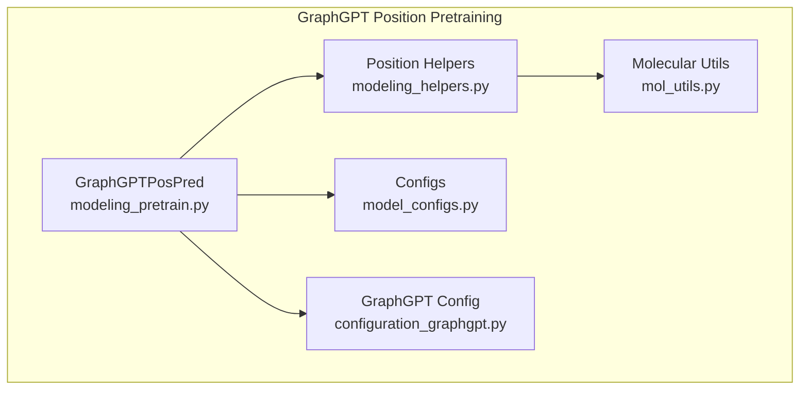
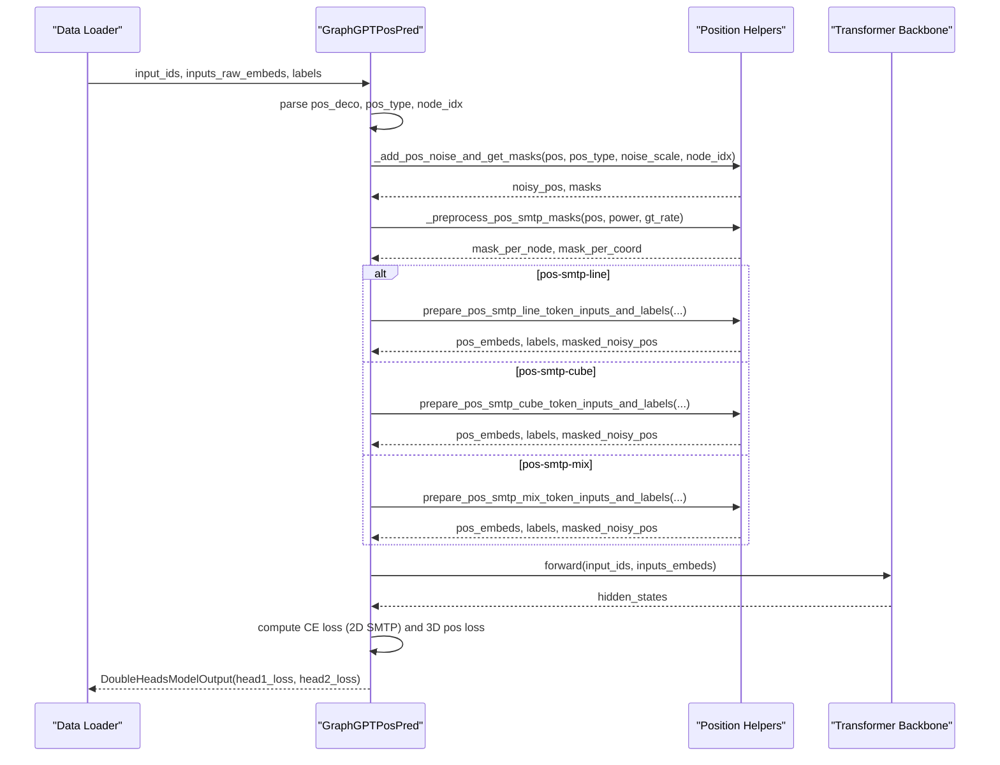
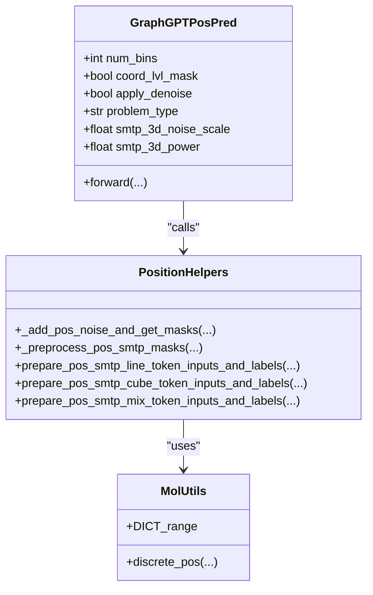
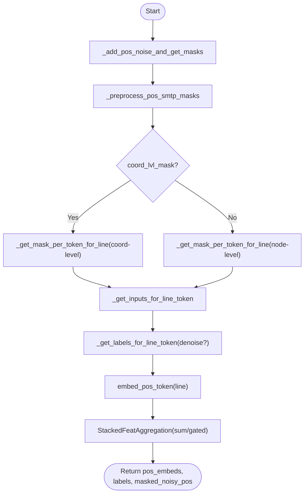
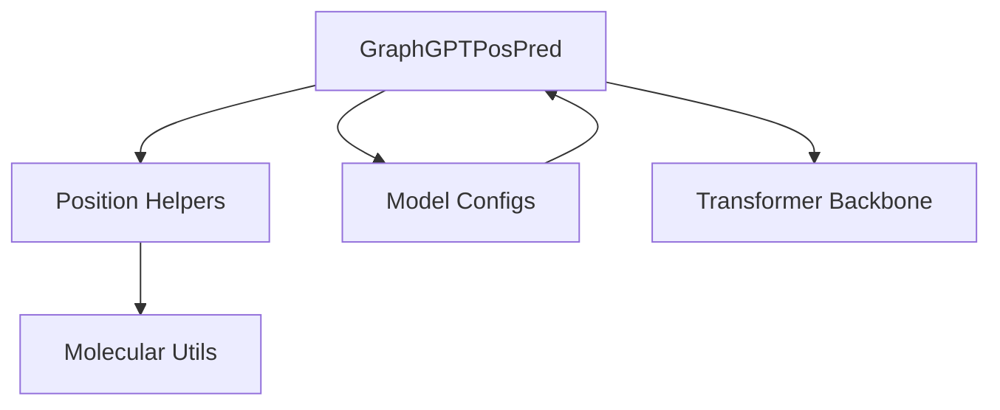

# GraphGPTPosPred

<cite>
**Referenced Files in This Document**
- [modeling_pretrain.py](file://src/models/graphgpt/modeling_pretrain.py)
- [modeling_helpers.py](file://src/models/graphgpt/modeling_helpers.py)
- [model_configs.py](file://src/conf/model/model_configs.py)
- [configuration_graphgpt.py](file://src/models/graphgpt/configuration_graphgpt.py)
- [mol_utils.py](file://src/utils/mol_utils.py)
</cite>

## Table of Contents
1. [Introduction](#introduction)
2. [Project Structure](#project-structure)
3. [Core Components](#core-components)
4. [Architecture Overview](#architecture-overview)
5. [Detailed Component Analysis](#detailed-component-analysis)
6. [Dependency Analysis](#dependency-analysis)
7. [Performance Considerations](#performance-considerations)
8. [Troubleshooting Guide](#troubleshooting-guide)
9. [Conclusion](#conclusion)

## Introduction
GraphGPTPosPred is a specialized pretraining head within the GraphGPT framework designed for 3D position prediction and spatial reasoning. It introduces three position-level pre-training objectives:
- pos-smtp-line: Discrete tokenization per coordinate with per-coordinate masking and optional denoising regression.
- pos-smtp-cube: Discrete tokenization per position (three coordinates aggregated into one token) with per-position masking.
- pos-smtp-mix: Mixed strategy combining both line and cube tokenizations for complementary spatial reasoning.

The module integrates molecular geometry processing, coordinate normalization, and configurable noise injection to support robust 3D molecular modeling applications.

## Project Structure
The GraphGPTPosPred implementation spans several modules:
- Position pretraining head and helpers: modeling_pretrain.py, modeling_helpers.py
- Configuration definitions: model_configs.py, configuration_graphgpt.py
- Molecular geometry utilities: mol_utils.py

**Diagram sources**
- [modeling_pretrain.py:269-352](file://src/models/graphgpt/modeling_pretrain.py#L269-L352)
- [modeling_helpers.py:1-200](file://src/models/graphgpt/modeling_helpers.py#L1-L200)
- [model_configs.py:111-171](file://src/conf/model/model_configs.py#L111-L171)
- [configuration_graphgpt.py:126-157](file://src/models/graphgpt/configuration_graphgpt.py#L126-L157)
- [mol_utils.py:1-200](file://src/utils/mol_utils.py#L1-L200)

**Section sources**
- [modeling_pretrain.py:269-352](file://src/models/graphgpt/modeling_pretrain.py#L269-L352)
- [modeling_helpers.py:1-200](file://src/models/graphgpt/modeling_helpers.py#L1-L200)
- [model_configs.py:111-171](file://src/conf/model/model_configs.py#L111-L171)
- [configuration_graphgpt.py:126-157](file://src/models/graphgpt/configuration_graphgpt.py#L126-L157)
- [mol_utils.py:1-200](file://src/utils/mol_utils.py#L1-L200)

## Core Components
- GraphGPTPosPred: Implements the position-level pretraining head with three objectives (line, cube, mix), position embedding, coordinate-level masking, and optional denoising regression.
- Position preprocessing and tokenization helpers: Provides discrete position binning, positional token transformation, and mixed token strategies.
- Configuration: Defines problem types, bin configurations, noise injection, aggregation methods, and coordinate normalization ranges.

Key responsibilities:
- Position embedding via pos-type embeddings and optional raw-position projection.
- Mask scheduling and per-token/per-coordinate masking strategies.
- Discrete position binning with configurable ranges.
- Dual-task training with optional 2D SMTP and CL losses.

**Section sources**
- [modeling_pretrain.py:269-352](file://src/models/graphgpt/modeling_pretrain.py#L269-L352)
- [modeling_helpers.py:639-768](file://src/models/graphgpt/modeling_helpers.py#L639-L768)
- [modeling_helpers.py:846-922](file://src/models/graphgpt/modeling_helpers.py#L846-L922)
- [modeling_helpers.py:947-1011](file://src/models/graphgpt/modeling_helpers.py#L947-L1011)
- [model_configs.py:111-171](file://src/conf/model/model_configs.py#L111-L171)

## Architecture Overview
The GraphGPTPosPred architecture integrates position preprocessing, masking, tokenization, and dual-task loss computation.

**Diagram sources**
- [modeling_pretrain.py:473-690](file://src/models/graphgpt/modeling_pretrain.py#L473-L690)
- [modeling_helpers.py:639-768](file://src/models/graphgpt/modeling_helpers.py#L639-L768)
- [modeling_helpers.py:758-795](file://src/models/graphgpt/modeling_helpers.py#L758-L795)
- [modeling_helpers.py:846-922](file://src/models/graphgpt/modeling_helpers.py#L846-L922)

## Detailed Component Analysis

### Position-Level Pre-Training Objectives
- pos-smtp-line
  - Discretizes noisy positions into per-coordinate bins.
  - Applies per-coordinate masking controlled by coord_lvl_mask.
  - Supports denoising regression where unmasked noisy coordinates predict clean coordinates.
  - Uses sum or gated aggregation for 3D position tokens.

- pos-smtp-cube
  - Aggregates three coordinates into a single cube token via multipliers.
  - Masks per-position (all three coordinates).
  - Employs tied embedding and projection heads for vocabulary sharing.

- pos-smtp-mix
  - Combines line and cube tokenizations with separate vocabularies.
  - Computes dual losses (line and cube) with configurable weighting.

Implementation highlights:
- Noise injection and masking are orchestrated by shared helper functions.
- Discrete binning uses configurable ranges and bounds.
- Optional raw-position projection enhances integration with transformer embeddings.

**Section sources**
- [modeling_pretrain.py:313-321](file://src/models/graphgpt/modeling_pretrain.py#L313-L321)
- [modeling_pretrain.py:354-472](file://src/models/graphgpt/modeling_pretrain.py#L354-L472)
- [modeling_helpers.py:639-768](file://src/models/graphgpt/modeling_helpers.py#L639-L768)
- [modeling_helpers.py:758-795](file://src/models/graphgpt/modeling_helpers.py#L758-L795)
- [modeling_helpers.py:846-922](file://src/models/graphgpt/modeling_helpers.py#L846-L922)

### Position Embedding Mechanisms
- Position type embedding: Encodes per-node position type (pad, zero, z-only, yz-plane, xyz) using an embedding lookup.
- Raw-position projection: Optional linear projection of masked noisy coordinates into hidden dimension for integration with transformer inputs.
- Token embeddings: Separate embeddings for line tokens (per-coordinate) and cube tokens (aggregated), with optional gating aggregation.

**Diagram sources**
- [modeling_pretrain.py:269-352](file://src/models/graphgpt/modeling_pretrain.py#L269-L352)
- [modeling_helpers.py:639-768](file://src/models/graphgpt/modeling_helpers.py#L639-L768)
- [modeling_helpers.py:758-795](file://src/models/graphgpt/modeling_helpers.py#L758-L795)
- [modeling_helpers.py:846-922](file://src/models/graphgpt/modeling_helpers.py#L846-L922)
- [mol_utils.py:150-164](file://src/utils/mol_utils.py#L150-L164)

**Section sources**
- [modeling_pretrain.py:278-327](file://src/models/graphgpt/modeling_pretrain.py#L278-L327)
- [modeling_helpers.py:117-124](file://src/models/graphgpt/modeling_helpers.py#L117-L124)
- [modeling_helpers.py:526-548](file://src/models/graphgpt/modeling_helpers.py#L526-L548)

### Coordinate-Level Masking and Denoising Regression
- Mask scheduling: Polynomial, cosine, or arc-cosine schedules control masking rates per sample and per coordinate.
- Per-coordinate vs per-position masking: Controlled by coord_lvl_mask; line tokenization supports coordinate-level granularity.
- Denoising regression: When enabled, unmasked noisy coordinates serve as targets for clean coordinates, improving spatial reasoning robustness.

**Diagram sources**
- [modeling_helpers.py:947-1011](file://src/models/graphgpt/modeling_helpers.py#L947-L1011)
- [modeling_helpers.py:692-755](file://src/models/graphgpt/modeling_helpers.py#L692-L755)
- [modeling_helpers.py:639-768](file://src/models/graphgpt/modeling_helpers.py#L639-L768)

**Section sources**
- [modeling_helpers.py:925-944](file://src/models/graphgpt/modeling_helpers.py#L925-L944)
- [modeling_helpers.py:979-1010](file://src/models/graphgpt/modeling_helpers.py#L979-L1010)
- [modeling_helpers.py:726-755](file://src/models/graphgpt/modeling_helpers.py#L726-L755)

### Discrete Position Binning and Normalization
- Discrete binning: Maps continuous coordinates to integer bins within configured ranges using configurable bounds.
- Range normalization: Uses predefined ranges (percentile-based) to ensure stable discretization across molecules.
- Boundaries: Supports both fixed-range and percentile-bound strategies.

Concrete references:
- Discrete binning function and range handling.
- Percentile-derived ranges for coordinate normalization.

**Section sources**
- [mol_utils.py:150-164](file://src/utils/mol_utils.py#L150-L164)
- [mol_utils.py:18-24](file://src/utils/mol_utils.py#L18-L24)

### Mixed Token Strategies (pos-smtp-mix)
- Line tokens: Per-coordinate discretization with optional denoising.
- Cube tokens: Aggregated three-coordinate tokenization with tied embeddings.
- Dual loss computation: Computes separate losses for line and cube tokens with configurable aggregation.

**Section sources**
- [modeling_pretrain.py:411-472](file://src/models/graphgpt/modeling_pretrain.py#L411-L472)
- [modeling_helpers.py:846-922](file://src/models/graphgpt/modeling_helpers.py#L846-L922)

### Relationship with Molecular Geometry Processing
- Euler-order node alignment ensures consistent orientation across molecules.
- Translational and rotational invariance transformations prepare coordinates for stable discretization.
- Specialized tokenization respects structural constraints (e.g., trimmed coordinates for rotated nodes).

**Section sources**
- [mol_utils.py:182-207](file://src/utils/mol_utils.py#L182-L207)
- [mol_utils.py:210-256](file://src/utils/mol_utils.py#L210-L256)

### Configuration Options
Key configuration parameters for GraphGPTPosPred:
- Problem types: pos-smtp-line, pos-smtp-cube, pos-smtp-mix
- Bin configurations: num_bins, num_bins_line, num_bins_cube
- Noise injection: smtp_3d_noise_scale, smtp_3d_power
- Masking: coord_lvl_mask, pos_agg_method
- Denoising: apply_denoise
- Aggregation: loss_agg, pos_range
- 2D SMTP integration: smtp_2d_rate, smtp_2d_replace_rate, sep_2d3d_inputs, global_2d_mask
- Discriminative loss: use_discriminative

**Section sources**
- [model_configs.py:111-171](file://src/conf/model/model_configs.py#L111-L171)
- [configuration_graphgpt.py:126-157](file://src/models/graphgpt/configuration_graphgpt.py#L126-L157)

## Dependency Analysis
The GraphGPTPosPred module depends on:
- Position preprocessing helpers for noise injection, masking, and tokenization.
- Molecular utilities for discrete binning and coordinate normalization.
- Transformer backbone for sequence modeling and dual-head loss computation.

**Diagram sources**
- [modeling_pretrain.py:269-352](file://src/models/graphgpt/modeling_pretrain.py#L269-L352)
- [modeling_helpers.py:1-200](file://src/models/graphgpt/modeling_helpers.py#L1-L200)
- [mol_utils.py:1-200](file://src/utils/mol_utils.py#L1-L200)

**Section sources**
- [modeling_pretrain.py:269-352](file://src/models/graphgpt/modeling_pretrain.py#L269-L352)
- [modeling_helpers.py:1-200](file://src/models/graphgpt/modeling_helpers.py#L1-L200)
- [mol_utils.py:1-200](file://src/utils/mol_utils.py#L1-L200)

## Performance Considerations
- Discretization efficiency: Using vectorized binning and masking reduces overhead.
- Aggregation methods: Gated aggregation may improve representational quality at marginal computational cost.
- Mask scheduling: Polynomial, cosine, and arc-cosine schedules balance training stability and difficulty.
- Mixed strategies: Combining line and cube tokens can improve coverage while maintaining computational feasibility.

## Troubleshooting Guide
Common issues and resolutions:
- Poor convergence in SMTP:
  - Verify noise scale and mask scheduling parameters.
  - Ensure pos_range covers the data distribution.
- Inconsistent coordinate normalization:
  - Confirm discrete_pos uses appropriate range_min/range_max.
  - Validate percentile-derived ranges if using DICT_range.
- Mixed token mismatch:
  - Check num_bins_line and num_bins_cube alignment with vocabulary sizes.
  - Ensure pos_token_shift offsets match aggregation method (sum vs gated).
- Discriminative loss instability:
  - Adjust world_size handling and CL loss scaling.
  - Verify sep_2d3d_inputs and global_2d_mask settings during training vs evaluation.

**Section sources**
- [modeling_helpers.py:145-177](file://src/models/graphgpt/modeling_helpers.py#L145-L177)
- [mol_utils.py:18-24](file://src/utils/mol_utils.py#L18-L24)
- [modeling_pretrain.py:503-533](file://src/models/graphgpt/modeling_pretrain.py#L503-L533)

## Conclusion
GraphGPTPosPred provides a flexible and robust framework for 3D position prediction and spatial reasoning pretraining. Its modular design supports multiple tokenization strategies, configurable masking and denoising, and seamless integration with molecular geometry processing. Proper configuration of binning, normalization, and masking schedules enables strong performance on 3D molecular modeling tasks.
