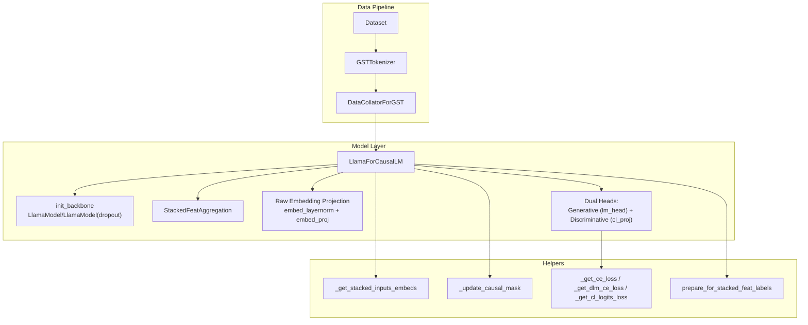
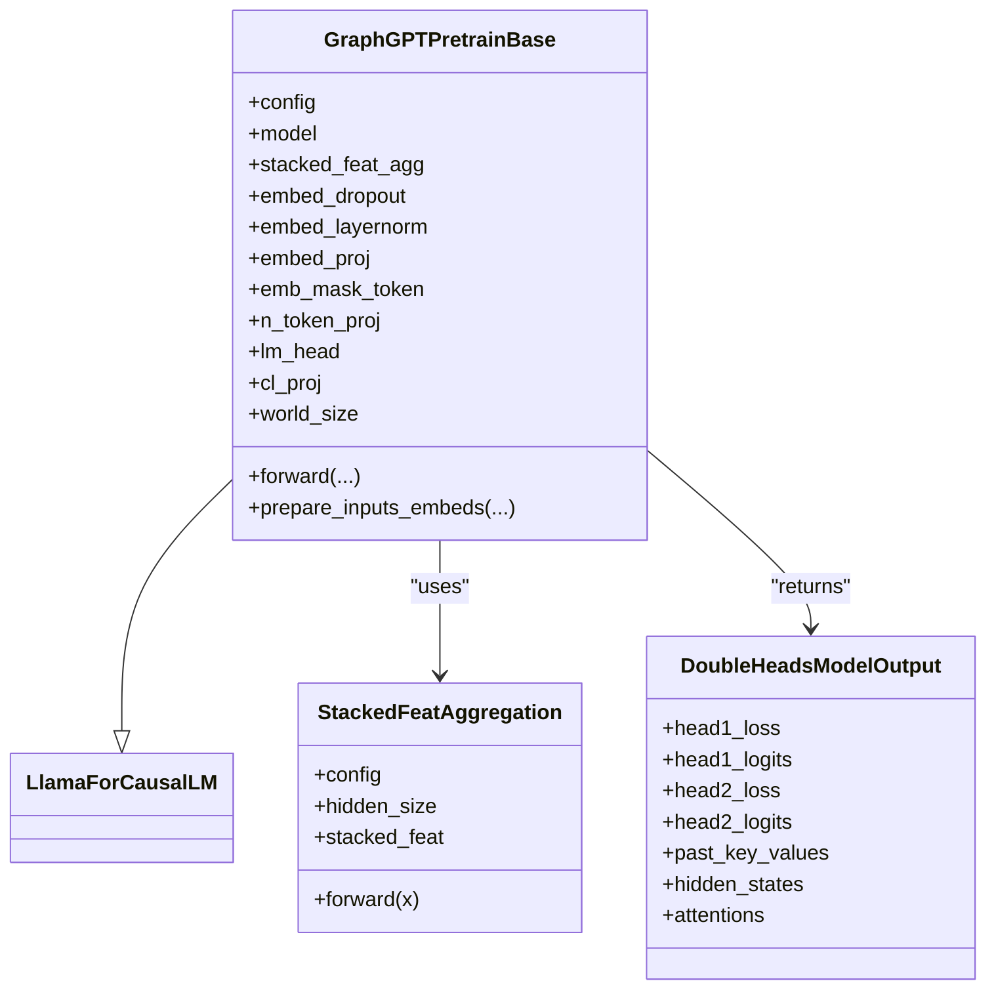
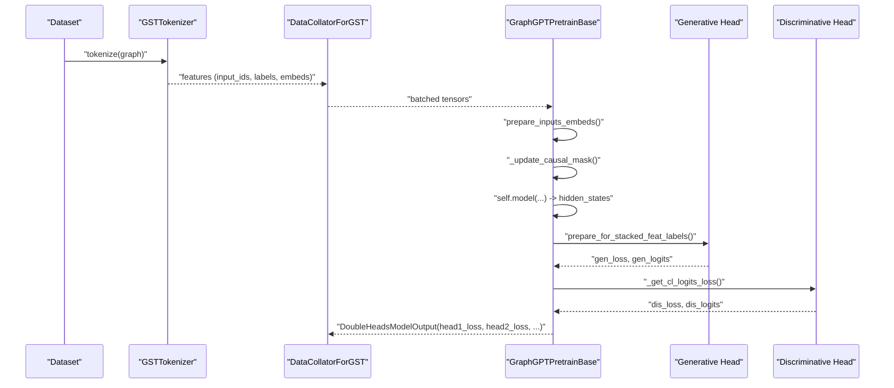
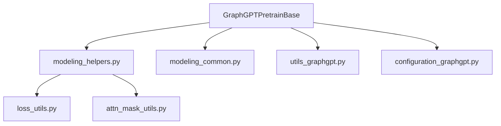

# GraphGPTPretrainBase

<cite>
**Referenced Files in This Document**
- [modeling_pretrain.py](file://src/models/graphgpt/modeling_pretrain.py)
- [modeling_common.py](file://src/models/graphgpt/modeling_common.py)
- [modeling_helpers.py](file://src/models/graphgpt/modeling_helpers.py)
- [configuration_graphgpt.py](file://src/models/graphgpt/configuration_graphgpt.py)
- [utils_graphgpt.py](file://src/models/graphgpt/utils_graphgpt.py)
- [tokenizer.py](file://src/data/tokenizer.py)
- [collator.py](file://src/data/collator.py)
- [pretrain_mode.py](file://src/training/pretrain_mode.py)
- [base.yaml](file://configs/model/base.yaml)
- [training/base.yaml](file://configs/training/base.yaml)
- [loss_utils.py](file://src/utils/loss_utils.py)
- [attn_mask_utils.py](file://src/utils/attn_mask_utils.py)
</cite>

## Table of Contents
1. [Introduction](#introduction)
2. [Project Structure](#project-structure)
3. [Core Components](#core-components)
4. [Architecture Overview](#architecture-overview)
5. [Detailed Component Analysis](#detailed-component-analysis)
6. [Dependency Analysis](#dependency-analysis)
7. [Performance Considerations](#performance-considerations)
8. [Troubleshooting Guide](#troubleshooting-guide)
9. [Conclusion](#conclusion)

## Introduction
This document provides a comprehensive technical guide to the GraphGPTPretrainBase class, focusing on its dual-head architecture for generative pre-training. It explains initialization of the Llama-based backbone, embedding dropout configuration, stacked feature aggregation, and raw embedding projection mechanisms. The forward pass is documented with input preparation, attention masking, dual-head loss computation (generative and discriminative), and gradient flow optimization. Concrete configuration examples are provided for next-token prediction, scheduled masked-token prediction, and mixed training strategies. The relationship with the tokenization system and data pipeline is addressed, along with pre-training optimization techniques, memory management strategies, and performance considerations for large-scale graph foundation models.

## Project Structure
The GraphGPT pre-training implementation centers around a dual-head LlamaForCausalLM subclass that integrates:
- A configurable Llama transformer backbone with optional dropout layers
- Stacked feature aggregation for node/edge attributes
- Optional raw embedding projection for external node/edge features
- Dual-head loss computation combining generative (language modeling) and discriminative (contrastive) objectives
- Integration with tokenization and data collation for efficient pre-training

**Diagram sources**
- [modeling_pretrain.py:57-266](file://src/models/graphgpt/modeling_pretrain.py#L57-L266)
- [modeling_common.py:105-184](file://src/models/graphgpt/modeling_common.py#L105-L184)
- [modeling_helpers.py:38-393](file://src/models/graphgpt/modeling_helpers.py#L38-L393)
- [tokenizer.py:425-612](file://src/data/tokenizer.py#L425-L612)
- [collator.py:22-111](file://src/data/collator.py#L22-L111)

**Section sources**
- [modeling_pretrain.py:57-266](file://src/models/graphgpt/modeling_pretrain.py#L57-L266)
- [modeling_common.py:105-184](file://src/models/graphgpt/modeling_common.py#L105-L184)
- [modeling_helpers.py:38-393](file://src/models/graphgpt/modeling_helpers.py#L38-L393)
- [tokenizer.py:425-612](file://src/data/tokenizer.py#L425-L612)
- [collator.py:22-111](file://src/data/collator.py#L22-L111)

## Core Components
- Dual-head architecture: Generative (language modeling) and discriminative (contrastive) outputs computed in a single forward pass, enabling joint optimization.
- Backbones: Llama-based transformer with optional dropout layers via a custom LlamaModel wrapper.
- Stacked feature aggregation: Combines multi-feature token embeddings into a single sequence representation.
- Raw embedding projection: Integrates external node/edge features into the model’s embedding space.
- Attention masking: Supports causal and non-causal attention depending on configuration.
- Loss computation: Cross-entropy for generative pre-training and contrastive loss for discriminative pre-training.

**Section sources**
- [modeling_pretrain.py:57-266](file://src/models/graphgpt/modeling_pretrain.py#L57-L266)
- [modeling_common.py:105-184](file://src/models/graphgpt/modeling_common.py#L105-L184)
- [modeling_helpers.py:145-227](file://src/models/graphgpt/modeling_helpers.py#L145-L227)

## Architecture Overview
The GraphGPTPretrainBase extends LlamaForCausalLM and augments it with:
- Transformer backbone selection and dropout configuration
- Stacked feature aggregation for multi-modal token sequences
- Optional raw embedding projection for external node/edge features
- Dual-head loss computation with configurable mixing ratios

**Diagram sources**
- [modeling_pretrain.py:57-266](file://src/models/graphgpt/modeling_pretrain.py#L57-L266)
- [modeling_common.py:105-143](file://src/models/graphgpt/modeling_common.py#L105-L143)

**Section sources**
- [modeling_pretrain.py:57-266](file://src/models/graphgpt/modeling_pretrain.py#L57-L266)
- [modeling_common.py:105-143](file://src/models/graphgpt/modeling_common.py#L105-L143)

## Detailed Component Analysis

### Initialization and Backbone Setup
- Backbones: The transformer backbone is selected via init_backbone, which chooses between a standard LlamaModel or a dropout-enabled LlamaModel based on configuration flags.
- Embedding dropout: init_embed_dropout conditionally adds dropout to token embeddings.
- Stacked feature aggregation: init_stacked_feat_agg creates a StackedFeatAggregation module when stack_method is short or long.
- Raw embedding projection: When embed_dim > 0, the model initializes RMSNorm, optional raw_embed_dropout, emb_mask_token, and embed_proj to project external raw embeddings into the model’s hidden space.

Key configuration flags:
- next_n_token: Controls whether to project hidden states across multiple next tokens for joint training.
- use_generative/use_discriminative: Enables/disables respective heads and adjusts loss mixing.
- causal_attention: Controls attention masking behavior.

**Section sources**
- [modeling_pretrain.py:58-117](file://src/models/graphgpt/modeling_pretrain.py#L58-L117)
- [modeling_common.py:160-184](file://src/models/graphgpt/modeling_common.py#L160-L184)
- [configuration_graphgpt.py:56-120](file://src/models/graphgpt/configuration_graphgpt.py#L56-L120)

### Input Preparation and Raw Embedding Projection
- prepare_inputs_embeds converts input_ids to token embeddings, applies stacked feature aggregation if needed, and integrates raw embeddings:
  - Aligns dtype between raw and token embeddings
  - Applies mask-based replacement using emb_mask_token for non-labeled positions
  - Normalizes and projects raw embeddings via embed_layernorm and embed_proj
  - Adds projected raw embeddings to token embeddings

This mechanism supports mixed modalities (tokens + raw features) in the same sequence.

**Section sources**
- [modeling_pretrain.py:119-150](file://src/models/graphgpt/modeling_pretrain.py#L119-L150)
- [modeling_helpers.py:127-139](file://src/models/graphgpt/modeling_helpers.py#L127-L139)

### Forward Pass and Dual-Head Loss Computation
- Input preparation: prepare_inputs_embeds handles token embedding lookup, stacked aggregation, and raw embedding integration.
- Attention masking: _update_causal_mask adapts masks for causal or non-causal attention depending on config.
- Generative head: prepare_for_stacked_feat_labels reshapes hidden states for next-n-token prediction, computes logits via lm_head, and applies cross-entropy loss with optional focal loss and DLM weighting.
- Discriminative head: _get_cl_logits_loss computes contrastive loss on pooled representations, normalizes embeddings, and aggregates across distributed processes if world_size > 1.
- Mixed training: The class supports equal or configurable mixing of generative and discriminative losses.

**Diagram sources**
- [modeling_pretrain.py:152-266](file://src/models/graphgpt/modeling_pretrain.py#L152-L266)
- [modeling_helpers.py:38-227](file://src/models/graphgpt/modeling_helpers.py#L38-L227)
- [tokenizer.py:425-612](file://src/data/tokenizer.py#L425-L612)
- [collator.py:22-111](file://src/data/collator.py#L22-L111)

**Section sources**
- [modeling_pretrain.py:152-266](file://src/models/graphgpt/modeling_pretrain.py#L152-L266)
- [modeling_helpers.py:145-227](file://src/models/graphgpt/modeling_helpers.py#L145-L227)

### Configuration Options for Training Strategies
- Next-token prediction: Configure next_n_token > 1 to project hidden states across multiple next tokens for joint training.
- Scheduled masked-token prediction: Use training configuration to control mask ratios and scheduling policies (e.g., polynomial schedules).
- Mixed training strategies: Enable both use_generative and use_discriminative to combine LM and CL objectives with configurable mixing ratios.

Concrete configuration locations:
- Model-level flags: next_n_token, use_generative, use_discriminative, focal_gamma, smtp_inside
- Training-level scheduling: pretrain_mlm.name, pretrain_mlm.params, dlm_wgt

**Section sources**
- [configuration_graphgpt.py:56-120](file://src/models/graphgpt/configuration_graphgpt.py#L56-L120)
- [base.yaml:74-86](file://configs/model/base.yaml#L74-L86)
- [training/base.yaml:11-22](file://configs/training/base.yaml#L11-L22)

### Relationship with Tokenization and Data Pipeline
- Tokenization: GSTTokenizer produces tokenized sequences with input_ids, labels, and optional embeds for nodes/edges. It supports packing and masking strategies aligned with pre-training objectives.
- Collation: DataCollatorForGST pads sequences, manages attention masks, and prepares tensors for the model.
- Training integration: PretrainMode orchestrates dataset reading, vocabulary building, tokenizer initialization, and training loops with DeepSpeed or native optimizers.

**Section sources**
- [tokenizer.py:425-612](file://src/data/tokenizer.py#L425-L612)
- [collator.py:22-111](file://src/data/collator.py#L22-L111)
- [pretrain_mode.py:97-227](file://src/training/pretrain_mode.py#L97-L227)

## Dependency Analysis
The GraphGPTPretrainBase relies on several helper modules and utilities:
- Modeling helpers: attention masking, embedding preparation, loss computation, label preparation, and SMTP-related transformations
- Utilities: attention mask utilities, loss utilities for distributed contrastive learning
- Configuration: GraphGPTConfig consolidates model, pretraining, and geometric input settings
- Data pipeline: tokenizer and collator integrate with training modes

**Diagram sources**
- [modeling_pretrain.py:57-266](file://src/models/graphgpt/modeling_pretrain.py#L57-L266)
- [modeling_helpers.py:38-393](file://src/models/graphgpt/modeling_helpers.py#L38-L393)
- [modeling_common.py:160-184](file://src/models/graphgpt/modeling_common.py#L160-L184)
- [utils_graphgpt.py:176-194](file://src/models/graphgpt/utils_graphgpt.py#L176-L194)
- [loss_utils.py:107-137](file://src/utils/loss_utils.py#L107-L137)
- [attn_mask_utils.py:12-155](file://src/utils/attn_mask_utils.py#L12-L155)
- [configuration_graphgpt.py:26-200](file://src/models/graphgpt/configuration_graphgpt.py#L26-L200)

**Section sources**
- [modeling_pretrain.py:57-266](file://src/models/graphgpt/modeling_pretrain.py#L57-L266)
- [modeling_helpers.py:38-393](file://src/models/graphgpt/modeling_helpers.py#L38-L393)
- [modeling_common.py:160-184](file://src/models/graphgpt/modeling_common.py#L160-L184)
- [utils_graphgpt.py:176-194](file://src/models/graphgpt/utils_graphgpt.py#L176-L194)
- [loss_utils.py:107-137](file://src/utils/loss_utils.py#L107-L137)
- [attn_mask_utils.py:12-155](file://src/utils/attn_mask_utils.py#L12-L155)
- [configuration_graphgpt.py:26-200](file://src/models/graphgpt/configuration_graphgpt.py#L26-L200)

## Performance Considerations
- Memory management:
  - Use stack_method short with DLM weighting to reduce memory footprint during next-n-token training.
  - Apply embed_pdrop and path/mlp dropout selectively to balance regularization and compute overhead.
  - Normalize logits to float before cross-entropy for large molecule datasets to stabilize training.
- Gradient flow optimization:
  - Contrastive loss uses normalized embeddings and distributed gather for multi-GPU training.
  - Layer-wise parameter groups can be configured to decay learning rates across layers.
- Attention masking:
  - Non-causal attention can improve coverage for packed sequences; ensure appropriate mask expansion utilities are used.
- Large-scale training:
  - DeepSpeed integration supports step-level checkpointing and mixed precision training.
  - Token packing and dynamic mask scheduling help maintain throughput on long sequences.

[No sources needed since this section provides general guidance]

## Troubleshooting Guide
- Shape mismatches in stacked features:
  - Verify stacked_feat matches the number of feature channels in input_ids and that aggregation method aligns with configuration.
- NaN or unstable losses:
  - Check focal_gamma and label_smoothing settings; ensure logits are cast to float for large datasets.
- Distributed contrastive loss:
  - Confirm world_size and GatherLayer behavior; ensure embeddings are normalized before computing scores.
- Attention mask errors:
  - Validate attention_mask shapes and use _update_causal_mask for proper 4D mask expansion.

**Section sources**
- [modeling_helpers.py:145-177](file://src/models/graphgpt/modeling_helpers.py#L145-L177)
- [loss_utils.py:107-137](file://src/utils/loss_utils.py#L107-L137)
- [attn_mask_utils.py:100-155](file://src/utils/attn_mask_utils.py#L100-L155)

## Conclusion
GraphGPTPretrainBase implements a flexible dual-head architecture for graph generative pre-training, integrating token-level language modeling with discriminative contrastive objectives. Its initialization supports dropout-enabled backbones, stacked feature aggregation, and raw embedding projections. The forward pass efficiently computes both generative and discriminative losses, with attention masking and label preparation tailored for large-scale graph datasets. Configuration options enable next-token prediction, scheduled masking, and mixed training strategies, while the data pipeline and training modes facilitate robust, memory-efficient pre-training at scale.
