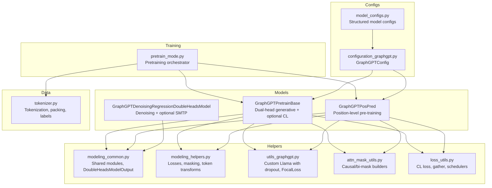
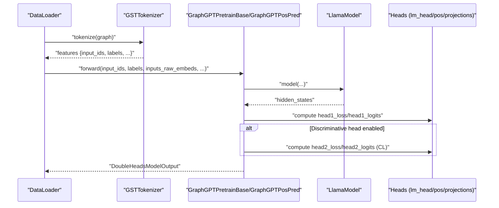
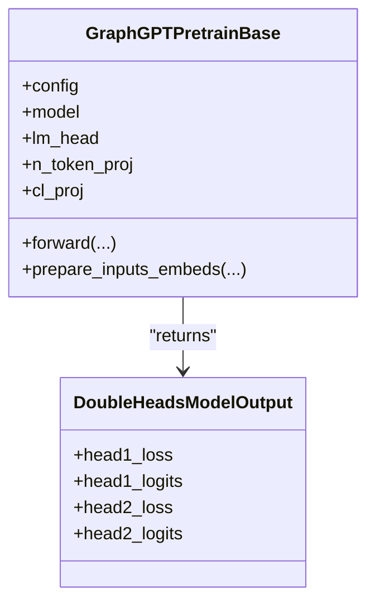
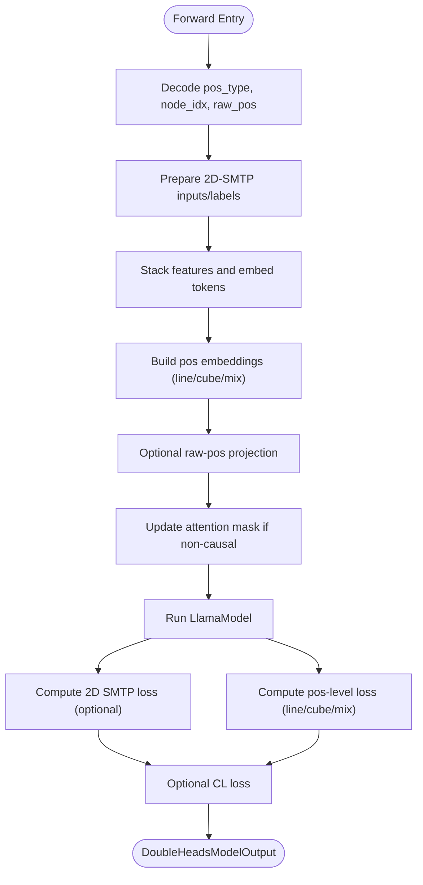
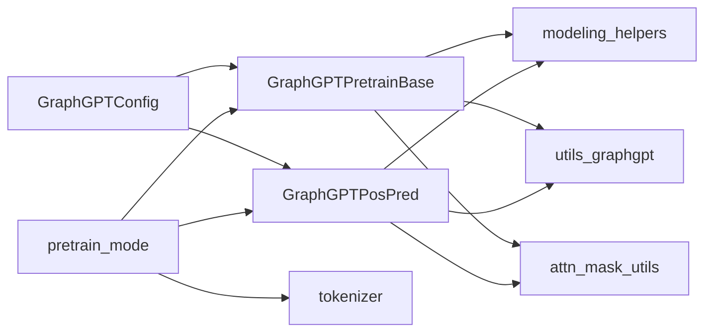

# Pre-training Models

<cite>
**Referenced Files in This Document**
- [modeling_pretrain.py](file://src/models/graphgpt/modeling_pretrain.py)
- [configuration_graphgpt.py](file://src/models/graphgpt/configuration_graphgpt.py)
- [modeling_common.py](file://src/models/graphgpt/modeling_common.py)
- [modeling_helpers.py](file://src/models/graphgpt/modeling_helpers.py)
- [utils_graphgpt.py](file://src/models/graphgpt/utils_graphgpt.py)
- [pretrain_mode.py](file://src/training/pretrain_mode.py)
- [loss_utils.py](file://src/utils/loss_utils.py)
- [attn_mask_utils.py](file://src/utils/attn_mask_utils.py)
- [tokenizer.py](file://src/data/tokenizer.py)
- [model_configs.py](file://src/conf/model/model_configs.py)
</cite>

## Table of Contents
1. [Introduction](#introduction)
2. [Project Structure](#project-structure)
3. [Core Components](#core-components)
4. [Architecture Overview](#architecture-overview)
5. [Detailed Component Analysis](#detailed-component-analysis)
6. [Dependency Analysis](#dependency-analysis)
7. [Performance Considerations](#performance-considerations)
8. [Troubleshooting Guide](#troubleshooting-guide)
9. [Conclusion](#conclusion)
10. [Appendices](#appendices)

## Introduction
This document explains the GraphGPT pre-training model components with a focus on the dual-head architecture and generative pre-training mechanisms. It covers:
- GraphGPTPretrainBase: the base dual-head model supporting next-token prediction (NTP), multi-token prediction (MTP), scheduled masked-token prediction (SMTP), and optional contrastive learning (CL).
- GraphGPTPosPred: the position-level pre-training head with SMTP variants for 3D coordinates (line, cube, mix) and optional CL.
- Denoising regression double-heads model: a separate model variant designed for coordinate denoising and auxiliary pre-training objectives.

It also documents configuration options, attention masking, memory optimization, and the relationship with tokenization and the data pipeline.

## Project Structure
The pre-training implementation centers around the GraphGPT model family in the graphgpt module, with shared initialization helpers, attention utilities, and training orchestration in the training module.

**Diagram sources**
- [modeling_pretrain.py:57-266](file://src/models/graphgpt/modeling_pretrain.py#L57-L266)
- [modeling_pretrain.py:269-690](file://src/models/graphgpt/modeling_pretrain.py#L269-L690)
- [modeling_common.py:54-204](file://src/models/graphgpt/modeling_common.py#L54-L204)
- [modeling_helpers.py:35-1011](file://src/models/graphgpt/modeling_helpers.py#L35-L1011)
- [utils_graphgpt.py:64-582](file://src/models/graphgpt/utils_graphgpt.py#L64-L582)
- [attn_mask_utils.py:9-156](file://src/utils/attn_mask_utils.py#L9-L156)
- [loss_utils.py:89-167](file://src/utils/loss_utils.py#L89-L167)
- [pretrain_mode.py:48-75](file://src/training/pretrain_mode.py#L48-L75)
- [tokenizer.py:30-612](file://src/data/tokenizer.py#L30-L612)
- [configuration_graphgpt.py:6-206](file://src/models/graphgpt/configuration_graphgpt.py#L6-L206)
- [model_configs.py:246-353](file://src/conf/model/model_configs.py#L246-L353)

**Section sources**
- [modeling_pretrain.py:57-266](file://src/models/graphgpt/modeling_pretrain.py#L57-L266)
- [modeling_pretrain.py:269-690](file://src/models/graphgpt/modeling_pretrain.py#L269-L690)
- [modeling_common.py:54-204](file://src/models/graphgpt/modeling_common.py#L54-L204)
- [modeling_helpers.py:35-1011](file://src/models/graphgpt/modeling_helpers.py#L35-L1011)
- [utils_graphgpt.py:64-582](file://src/models/graphgpt/utils_graphgpt.py#L64-L582)
- [attn_mask_utils.py:9-156](file://src/utils/attn_mask_utils.py#L9-L156)
- [loss_utils.py:89-167](file://src/utils/loss_utils.py#L89-L167)
- [pretrain_mode.py:48-75](file://src/training/pretrain_mode.py#L48-L75)
- [tokenizer.py:30-612](file://src/data/tokenizer.py#L30-L612)
- [configuration_graphgpt.py:6-206](file://src/models/graphgpt/configuration_graphgpt.py#L6-L206)
- [model_configs.py:246-353](file://src/conf/model/model_configs.py#L246-L353)

## Core Components
- GraphGPTPretrainBase: Implements a dual-head model with:
  - Generative head: NTP/MTP/SMTP via lm_head and optional next-n-token projection.
  - Discriminative head: Contrastive loss (CL) via a learned projection and global pooling.
  - Supports optional raw embedding fusion and stacked feature aggregation.
- GraphGPTPosPred: Implements position-level pre-training with:
  - SMTP variants: line-token, cube-token, and mix-token.
  - Optional 2D-SMTP with configurable rates and replacement noise.
  - Optional CL loss and positional embedding fusion.
- Denoising regression double-heads model: A separate model variant for coordinate denoising and optional SMTP.

Key configuration options are exposed via GraphGPTConfig and structured sub-configs (PretrainingHeadConfig, PositionPretrainingConfig, DenoisingRegressionConfig).

**Section sources**
- [modeling_pretrain.py:57-266](file://src/models/graphgpt/modeling_pretrain.py#L57-L266)
- [modeling_pretrain.py:269-690](file://src/models/graphgpt/modeling_pretrain.py#L269-L690)
- [configuration_graphgpt.py:6-206](file://src/models/graphgpt/configuration_graphgpt.py#L6-L206)
- [model_configs.py:58-236](file://src/conf/model/model_configs.py#L58-L236)

## Architecture Overview
The dual-head architecture computes two losses per batch:
- Head 1: Generative loss (NTP/MTP/SMTP) or position-level loss (line/cube/mix).
- Head 2: Discriminative loss (CL) or auxiliary position-level loss.

**Diagram sources**
- [pretrain_mode.py:327-333](file://src/training/pretrain_mode.py#L327-L333)
- [tokenizer.py:585-612](file://src/data/tokenizer.py#L585-L612)
- [modeling_pretrain.py:152-266](file://src/models/graphgpt/modeling_pretrain.py#L152-L266)
- [modeling_pretrain.py:473-690](file://src/models/graphgpt/modeling_pretrain.py#L473-L690)
- [modeling_common.py:54-100](file://src/models/graphgpt/modeling_common.py#L54-L100)

## Detailed Component Analysis

### GraphGPTPretrainBase: Dual-Head Generative Pre-training
- Initialization:
  - Initializes LlamaModel backbone with optional dropout modules.
  - Sets up stacked feature aggregation and optional raw embedding fusion.
  - Configures next-n-token projection for multi-token prediction.
  - Enables discriminative (CL) head when configured.
- Forward pass:
  - Prepares inputs: stacks features, applies optional raw embedding fusion, and updates attention masks if non-causal.
  - Runs backbone to obtain hidden states.
  - Computes generative loss via lm_head and optional focal loss or weighted CE.
  - Optionally computes CL loss and aggregates into DoubleHeadsModelOutput.

**Diagram sources**
- [modeling_pretrain.py:57-118](file://src/models/graphgpt/modeling_pretrain.py#L57-L118)
- [modeling_pretrain.py:152-266](file://src/models/graphgpt/modeling_pretrain.py#L152-L266)
- [modeling_common.py:54-100](file://src/models/graphgpt/modeling_common.py#L54-L100)

**Section sources**
- [modeling_pretrain.py:57-118](file://src/models/graphgpt/modeling_pretrain.py#L57-L118)
- [modeling_pretrain.py:119-151](file://src/models/graphgpt/modeling_pretrain.py#L119-L151)
- [modeling_pretrain.py:152-266](file://src/models/graphgpt/modeling_pretrain.py#L152-L266)
- [modeling_helpers.py:145-178](file://src/models/graphgpt/modeling_helpers.py#L145-L178)
- [loss_utils.py:201-227](file://src/utils/loss_utils.py#L201-L227)

### GraphGPTPosPred: Position-Level Pre-training
- Initialization:
  - Sets up backbone, embedding dropout, and stacked feature aggregation (conditional).
  - Configures position-type embedding and 2D/3D SMTP settings.
  - Initializes position-level tokenizers (line/cube/mix) with discretization and aggregation.
  - Optional CL head and raw-position projection.
- Forward pass:
  - Extracts position metadata and prepares 2D-SMTP inputs/labels.
  - Builds position embeddings via line/cube/mix token transforms.
  - Runs backbone and computes:
    - 2D SMTP loss (optional).
    - Position-level loss (line/cube/mix).
    - Optional CL loss and aggregates into DoubleHeadsModelOutput.

**Diagram sources**
- [modeling_pretrain.py:269-352](file://src/models/graphgpt/modeling_pretrain.py#L269-L352)
- [modeling_pretrain.py:473-690](file://src/models/graphgpt/modeling_pretrain.py#L473-L690)
- [modeling_helpers.py:38-48](file://src/models/graphgpt/modeling_helpers.py#L38-L48)
- [modeling_helpers.py:639-690](file://src/models/graphgpt/modeling_helpers.py#L639-L690)
- [modeling_helpers.py:758-795](file://src/models/graphgpt/modeling_helpers.py#L758-L795)
- [modeling_helpers.py:846-922](file://src/models/graphgpt/modeling_helpers.py#L846-L922)

**Section sources**
- [modeling_pretrain.py:269-352](file://src/models/graphgpt/modeling_pretrain.py#L269-L352)
- [modeling_pretrain.py:473-690](file://src/models/graphgpt/modeling_pretrain.py#L473-L690)
- [modeling_helpers.py:38-48](file://src/models/graphgpt/modeling_helpers.py#L38-L48)
- [modeling_helpers.py:639-690](file://src/models/graphgpt/modeling_helpers.py#L639-L690)
- [modeling_helpers.py:758-795](file://src/models/graphgpt/modeling_helpers.py#L758-L795)
- [modeling_helpers.py:846-922](file://src/models/graphgpt/modeling_helpers.py#L846-L922)

### Denoising Regression Double-Heads Model
- Purpose: Separate model variant for coordinate denoising and optional SMTP objectives.
- Relationship: Shares configuration categories with GraphGPTPretrainBase and GraphGPTPosPred via structured sub-configs (DenoisingRegressionConfig).

Note: Implementation resides in the fine-tuning module and is registered in the training orchestrator alongside pre-training models.

**Section sources**
- [model_configs.py:173-236](file://src/conf/model/model_configs.py#L173-L236)
- [pretrain_mode.py:70-75](file://src/training/pretrain_mode.py#L70-L75)

## Dependency Analysis
- Model-to-helper dependencies:
  - GraphGPTPretrainBase and GraphGPTPosPred depend on modeling_helpers for loss computation, label preparation, and position token transforms.
  - Both models rely on utils_graphgpt for custom Llama layers with dropout and FocalLoss.
  - Attention masking is handled by attn_mask_utils and integrated via modeling_helpers.
- Training orchestration:
  - pretrain_mode sets up tokenizer, builds vocabulary, initializes model with legacy config conversion, and runs training loops with logging and evaluation.

**Diagram sources**
- [configuration_graphgpt.py:6-206](file://src/models/graphgpt/configuration_graphgpt.py#L6-L206)
- [modeling_pretrain.py:57-266](file://src/models/graphgpt/modeling_pretrain.py#L57-L266)
- [modeling_pretrain.py:269-690](file://src/models/graphgpt/modeling_pretrain.py#L269-L690)
- [modeling_helpers.py:35-1011](file://src/models/graphgpt/modeling_helpers.py#L35-L1011)
- [utils_graphgpt.py:64-582](file://src/models/graphgpt/utils_graphgpt.py#L64-L582)
- [attn_mask_utils.py:9-156](file://src/utils/attn_mask_utils.py#L9-L156)
- [pretrain_mode.py:48-75](file://src/training/pretrain_mode.py#L48-L75)
- [tokenizer.py:30-612](file://src/data/tokenizer.py#L30-L612)

**Section sources**
- [configuration_graphgpt.py:6-206](file://src/models/graphgpt/configuration_graphgpt.py#L6-L206)
- [modeling_pretrain.py:57-266](file://src/models/graphgpt/modeling_pretrain.py#L57-L266)
- [modeling_pretrain.py:269-690](file://src/models/graphgpt/modeling_pretrain.py#L269-L690)
- [modeling_helpers.py:35-1011](file://src/models/graphgpt/modeling_helpers.py#L35-L1011)
- [utils_graphgpt.py:64-582](file://src/models/graphgpt/utils_graphgpt.py#L64-L582)
- [attn_mask_utils.py:9-156](file://src/utils/attn_mask_utils.py#L9-L156)
- [pretrain_mode.py:48-75](file://src/training/pretrain_mode.py#L48-L75)
- [tokenizer.py:30-612](file://src/data/tokenizer.py#L30-L612)

## Performance Considerations
- Memory optimization:
  - Short-stack method reduces compute by projecting per-sequence masked columns in one go, saving GPU memory and speeding up training.
  - Raw embedding dropout and RMSNorm are conditionally applied to reduce overhead.
- Mixed precision and gradient accumulation:
  - Training mode supports DeepSpeed initialization and profiling; FP16/BF16 is managed by the framework.
- Attention masking:
  - Non-causal attention can be enabled to improve pre-training quality; bi-directional/causal combinations are supported via dedicated mask builders.
- Scheduler and loss stability:
  - Focal loss and label smoothing can stabilize training for long-tail vocabularies.
  - CL loss uses distributed gather for multi-GPU training.

**Section sources**
- [modeling_helpers.py:38-48](file://src/models/graphgpt/modeling_helpers.py#L38-L48)
- [modeling_helpers.py:145-178](file://src/models/graphgpt/modeling_helpers.py#L145-L178)
- [loss_utils.py:107-137](file://src/utils/loss_utils.py#L107-L137)
- [pretrain_mode.py:271-300](file://src/training/pretrain_mode.py#L271-L300)

## Troubleshooting Guide
- Symptom: No decrease in loss with large batch sizes.
  - Cause: FP16 instability in CE loss for large molecules.
  - Fix: Logits are cast to float before CE computation to mitigate numerical issues.
- Symptom: CL loss not aggregating across GPUs.
  - Cause: Missing distributed gather.
  - Fix: Use GatherLayer to collect embeddings across ranks before computing infonce loss.
- Symptom: Position-level pre-training not converging.
  - Cause: Using noisy 3D tokens in 2D-SMTP samples.
  - Fix: During training, set 2D-SMTP positions to zero for 2D-SMTP samples; disable 2D-SMTP during CL-only mode.

**Section sources**
- [modeling_helpers.py:145-178](file://src/models/graphgpt/modeling_helpers.py#L145-L178)
- [loss_utils.py:107-137](file://src/utils/loss_utils.py#L107-L137)
- [modeling_pretrain.py:503-523](file://src/models/graphgpt/modeling_pretrain.py#L503-L523)

## Conclusion
GraphGPT’s pre-training stack combines a robust dual-head design with flexible pre-training objectives:
- GraphGPTPretrainBase supports NTP/MTP/SMTP with optional CL and raw embedding fusion.
- GraphGPTPosPred specializes in 3D position-level pre-training with multiple SMTP variants and optional CL.
- Structured configuration enables precise control over attention masking, scheduling, and memory optimization.
- The training orchestrator integrates tokenization, vocabulary building, and evaluation seamlessly.

## Appendices

### Pre-training Objectives and Configuration Options
- Next-token Prediction (NTP) and Multi-token Prediction (MTP):
  - Controlled by next_n_token and n_token_proj.
  - Loss computed via cross-entropy with optional focal loss and label smoothing.
- Scheduled Masked-token Prediction (SMTP):
  - 2D-SMTP: rate-controlled masking of node attributes with optional replacement noise.
  - 3D-SMTP: polynomial/cosine/arccos scheduling for masking coordinates; optional denoising targets.
- Position-level Pre-training:
  - Line-token, cube-token, and mix-token discretization strategies.
  - Aggregation methods and positional embedding fusion.

**Section sources**
- [modeling_pretrain.py:88-98](file://src/models/graphgpt/modeling_pretrain.py#L88-L98)
- [modeling_helpers.py:399-468](file://src/models/graphgpt/modeling_helpers.py#L399-L468)
- [modeling_helpers.py:639-690](file://src/models/graphgpt/modeling_helpers.py#L639-L690)
- [modeling_helpers.py:758-795](file://src/models/graphgpt/modeling_helpers.py#L758-L795)
- [modeling_helpers.py:846-922](file://src/models/graphgpt/modeling_helpers.py#L846-L922)
- [configuration_graphgpt.py:68-109](file://src/models/graphgpt/configuration_graphgpt.py#L68-L109)
- [model_configs.py:112-171](file://src/conf/model/model_configs.py#L112-L171)
- [model_configs.py:173-236](file://src/conf/model/model_configs.py#L173-L236)

### Attention Masking Patterns
- Causal vs non-causal attention.
- Bi-directional/causal combinations for specific tasks.
- Block-wise masks for packed sequences.

**Section sources**
- [modeling_helpers.py:38-48](file://src/models/graphgpt/modeling_helpers.py#L38-L48)
- [attn_mask_utils.py:12-84](file://src/utils/attn_mask_utils.py#L12-L84)
- [attn_mask_utils.py:128-156](file://src/utils/attn_mask_utils.py#L128-L156)

### Relationship with Tokenization and Data Pipeline
- GSTTokenizer converts graphs to token sequences, generates labels, and supports packing for long contexts.
- Training mode builds vocabulary, initializes tokenizer, and manages collation and evaluation.

**Section sources**
- [tokenizer.py:425-612](file://src/data/tokenizer.py#L425-L612)
- [pretrain_mode.py:118-227](file://src/training/pretrain_mode.py#L118-L227)
