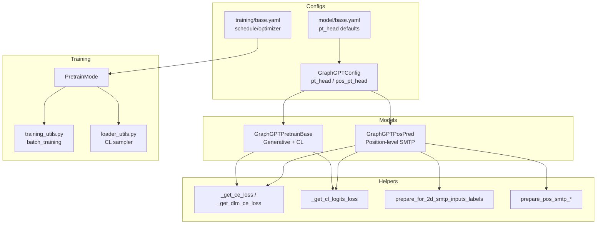
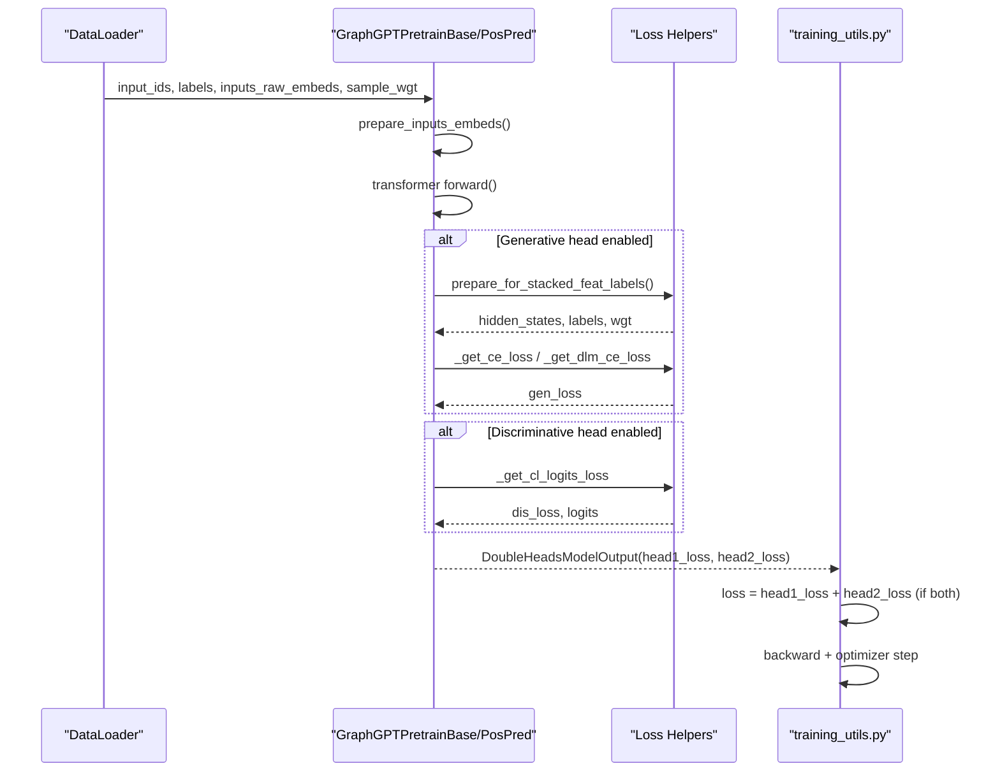
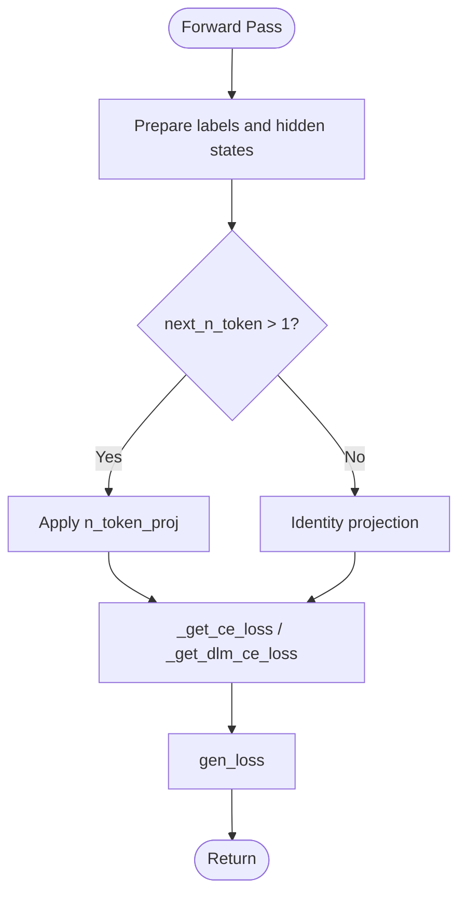
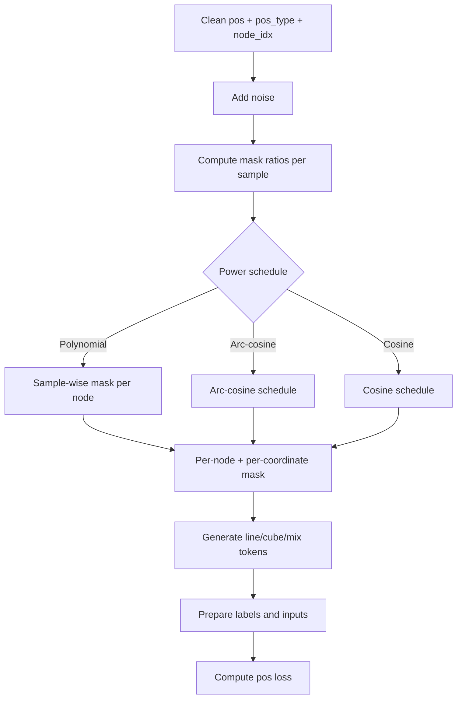
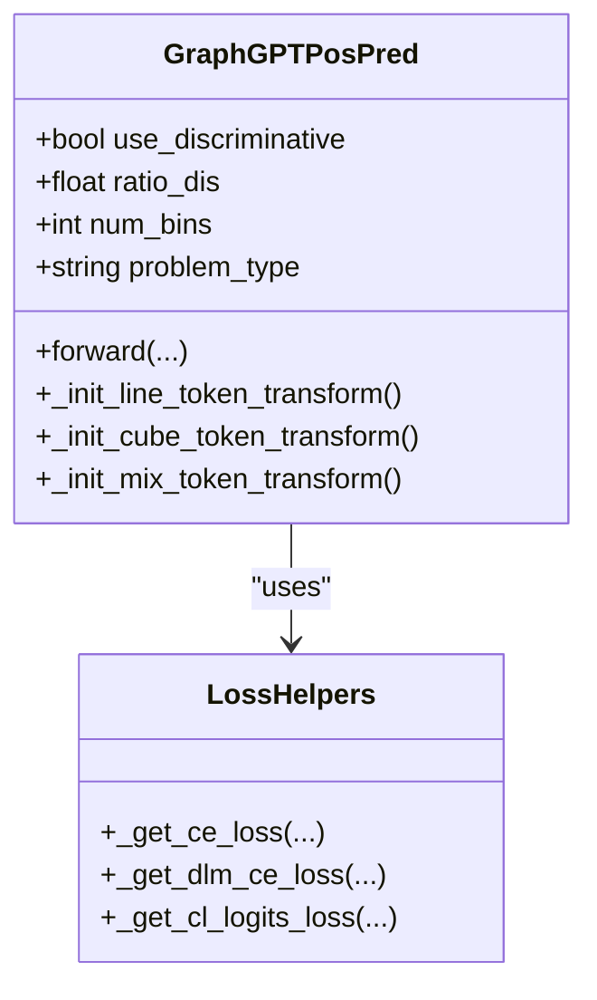
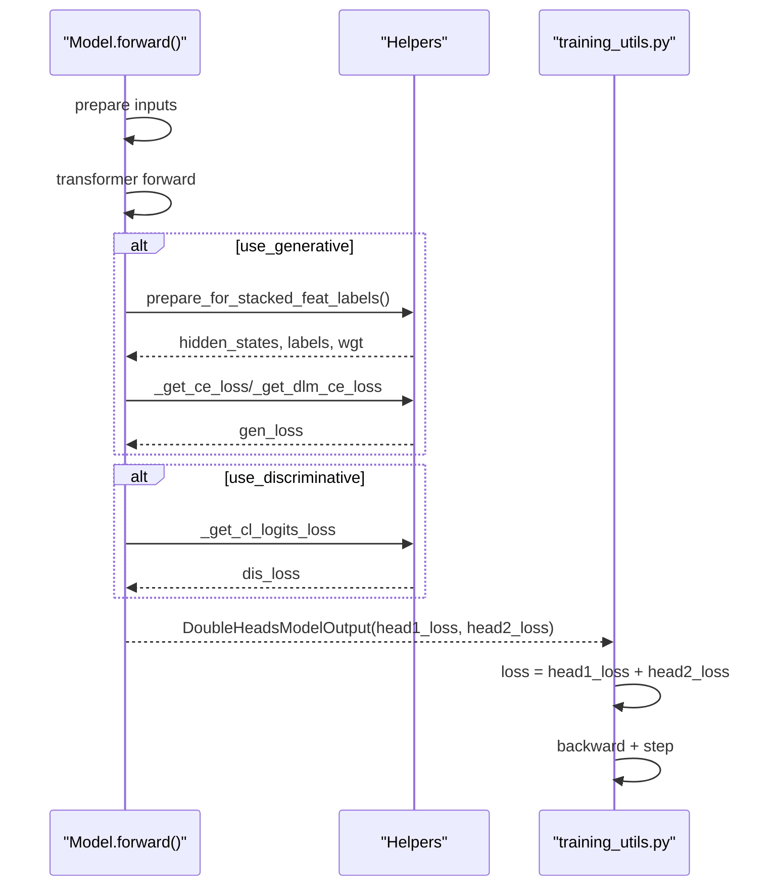
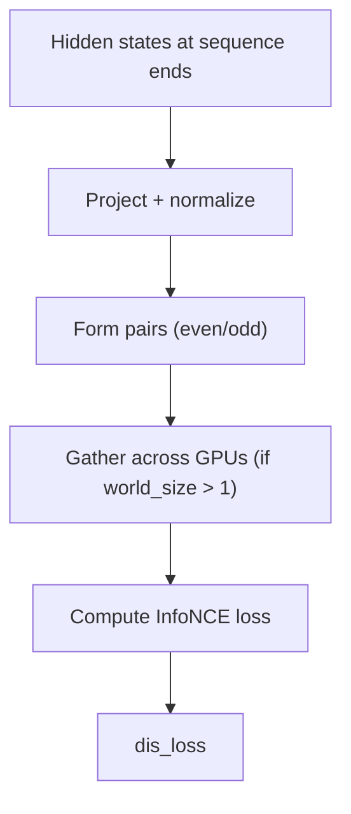
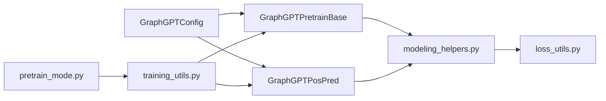

# Pre-training Objectives

<cite>
**Referenced Files in This Document**
- [modeling_pretrain.py](file://src/models/graphgpt/modeling_pretrain.py)
- [modeling_helpers.py](file://src/models/graphgpt/modeling_helpers.py)
- [loss_utils.py](file://src/utils/loss_utils.py)
- [configuration_graphgpt.py](file://src/models/graphgpt/configuration_graphgpt.py)
- [pretrain_mode.py](file://src/training/pretrain_mode.py)
- [training_utils.py](file://src/utils/training_utils.py)
- [base.yaml](file://configs/model/base.yaml)
- [base.yaml](file://configs/training/base.yaml)
- [tokenizer_utils.py](file://src/utils/tokenizer_utils.py)
- [loader_utils.py](file://src/utils/loader_utils.py)
</cite>

## Table of Contents
1. [Introduction](#introduction)
2. [Project Structure](#project-structure)
3. [Core Components](#core-components)
4. [Architecture Overview](#architecture-overview)
5. [Detailed Component Analysis](#detailed-component-analysis)
6. [Dependency Analysis](#dependency-analysis)
7. [Performance Considerations](#performance-considerations)
8. [Troubleshooting Guide](#troubleshooting-guide)
9. [Conclusion](#conclusion)
10. [Appendices](#appendices)

## Introduction
This document explains the pre-training objectives and loss functions used in GraphGPT models. It covers:
- Next-token Prediction (NTP) and multi-token prediction (MTP) via a shared generative head
- Scheduled Masked-token Prediction (SMTP) for both 2D (molecular graph-level attributes) and 3D (molecular 3D coordinates) settings
- Position-level pre-training (GraphGPTPosPred) with line/cube/mix tokenization strategies
- Dual-head loss computation combining generative and discriminative objectives
- Contrastive Learning (CL) integration and mixed training strategies
- Practical examples from the codebase for loss computation, weighting, and optimization
- Relationships between pre-training objectives and downstream task performance
- Convergence strategies, loss scaling, and evaluation metrics

## Project Structure
The pre-training pipeline spans model definitions, helper utilities for loss computation, configuration, and training orchestration:
- Model classes define pre-training heads and forward logic
- Helper modules implement loss functions and tokenization schedules
- Configuration files define pre-training hyperparameters
- Training mode and utilities manage batching, scaling, and optimization

**Diagram sources**
- [modeling_pretrain.py](file://src/models/graphgpt/modeling_pretrain.py)
- [modeling_helpers.py](file://src/models/graphgpt/modeling_helpers.py)
- [configuration_graphgpt.py](file://src/models/graphgpt/configuration_graphgpt.py)
- [base.yaml](file://configs/model/base.yaml)
- [base.yaml](file://configs/training/base.yaml)
- [pretrain_mode.py](file://src/training/pretrain_mode.py)
- [training_utils.py](file://src/utils/training_utils.py)
- [loader_utils.py](file://src/utils/loader_utils.py)

**Section sources**
- [modeling_pretrain.py](file://src/models/graphgpt/modeling_pretrain.py)
- [modeling_helpers.py](file://src/models/graphgpt/modeling_helpers.py)
- [configuration_graphgpt.py](file://src/models/graphgpt/configuration_graphgpt.py)
- [base.yaml](file://configs/model/base.yaml)
- [base.yaml](file://configs/training/base.yaml)
- [pretrain_mode.py](file://src/training/pretrain_mode.py)
- [training_utils.py](file://src/utils/training_utils.py)
- [loader_utils.py](file://src/utils/loader_utils.py)

## Core Components
- Generative head (NTP/MTP/SMTP): computes cross-entropy loss on masked tokens; supports focal loss and discrete diffusion weighting
- Discriminative head (CL): contrastive loss on pooled sequence representations
- Position-level head (GraphGPTPosPred): 2D SMTP for molecular graph attributes and 3D SMTP with line/cube/mix tokenization strategies
- Dual-head output: DoubleHeadsModelOutput aggregating two losses for mixed training

Key implementation references:
- Generative loss and CL loss computation: [modeling_helpers.py](file://src/models/graphgpt/modeling_helpers.py)
- Dual-head forward and loss aggregation: [modeling_pretrain.py](file://src/models/graphgpt/modeling_pretrain.py)
- Position-level preprocessing and tokenization: [modeling_helpers.py](file://src/models/graphgpt/modeling_helpers.py)
- Training orchestration and loss scaling: [training_utils.py](file://src/utils/training_utils.py)

**Section sources**
- [modeling_pretrain.py](file://src/models/graphgpt/modeling_pretrain.py)
- [modeling_helpers.py](file://src/models/graphgpt/modeling_helpers.py)
- [training_utils.py](file://src/utils/training_utils.py)

## Architecture Overview
The pre-training architecture integrates:
- Generative objectives (NTP/MTP/SMTP) via a shared lm_head
- Discriminative objectives (CL) via a dedicated projection
- Position-level objectives (2D/3D SMTP) with specialized tokenization
- Mixed training via dual-head loss summation

**Diagram sources**
- [modeling_pretrain.py](file://src/models/graphgpt/modeling_pretrain.py)
- [modeling_helpers.py](file://src/models/graphgpt/modeling_helpers.py)
- [training_utils.py](file://src/utils/training_utils.py)

## Detailed Component Analysis

### Next-token Prediction (NTP) and Multi-token Prediction (MTP)
- The generative head predicts the next token(s) using a shared lm_head over hidden states
- For next_n_token > 1, a learnable projection expands hidden states across the next-n window
- Supports focal loss and label smoothing; discrete diffusion weighting (DLW) for improved convergence on large vocabularies

Implementation highlights:
- Projection for multi-token prediction: [modeling_pretrain.py](file://src/models/graphgpt/modeling_pretrain.py)
- Label preparation and weighted CE: [modeling_helpers.py](file://src/models/graphgpt/modeling_helpers.py)
- Tokenization scheduling and DLM weighting: [tokenizer_utils.py](file://src/utils/tokenizer_utils.py)

**Diagram sources**
- [modeling_pretrain.py](file://src/models/graphgpt/modeling_pretrain.py)
- [modeling_helpers.py](file://src/models/graphgpt/modeling_helpers.py)
- [tokenizer_utils.py](file://src/utils/tokenizer_utils.py)

**Section sources**
- [modeling_pretrain.py](file://src/models/graphgpt/modeling_pretrain.py)
- [modeling_helpers.py](file://src/models/graphgpt/modeling_helpers.py)
- [tokenizer_utils.py](file://src/utils/tokenizer_utils.py)

### Scheduled Masked-token Prediction (SMTP)
SMTP applies a scheduled masking ratio controlled by a power parameter. Two variants are supported:

- 2D SMTP (graph-level attributes):
  - Samples selected stochastically; masks node-idx level tokens per node with polynomial schedule
  - Optional replacement of [mask] tokens with random draws to inject noise
  - Supports global masking across all samples or selective masking for samples with zero positions

- 3D SMTP (molecular 3D coordinates):
  - Adds Gaussian noise to clean coordinates; masks per-node and per-coordinate levels
  - Line tokenization: three tokens per position (one per coordinate)
  - Cube tokenization: one token per position encoding three coordinates
  - Mix tokenization: combines line and cube tokenization strategies
  - Optional denoising targets unmasked noisy coordinates using clean coordinates

Implementation highlights:
- 2D SMTP masking and replacement: [modeling_helpers.py](file://src/models/graphgpt/modeling_helpers.py)
- 3D SMTP tokenization and labeling: [modeling_helpers.py](file://src/models/graphgpt/modeling_helpers.py)
- Position-level head configuration: [configuration_graphgpt.py](file://src/models/graphgpt/configuration_graphgpt.py)
- Position-level head class: [modeling_pretrain.py](file://src/models/graphgpt/modeling_pretrain.py)

**Diagram sources**
- [modeling_helpers.py](file://src/models/graphgpt/modeling_helpers.py)
- [modeling_pretrain.py](file://src/models/graphgpt/modeling_pretrain.py)
- [configuration_graphgpt.py](file://src/models/graphgpt/configuration_graphgpt.py)

**Section sources**
- [modeling_helpers.py](file://src/models/graphgpt/modeling_helpers.py)
- [modeling_pretrain.py](file://src/models/graphgpt/modeling_pretrain.py)
- [configuration_graphgpt.py](file://src/models/graphgpt/configuration_graphgpt.py)

### Position-level Pre-training Mechanisms (GraphGPTPosPred)
The GraphGPTPosPred head specializes in 3D molecular geometry pre-training:
- Embeds position type and optionally projects noisy 3D coordinates into hidden space
- Supports three strategies:
  - Line token: three tokens per position (coordinate-level)
  - Cube token: one token per position (combined coordinates)
  - Mix token: combination of line and cube tokenization
- Uses configurable binning, label smoothing, and loss aggregation modes

Implementation highlights:
- Position tokenization and embedding: [modeling_helpers.py](file://src/models/graphgpt/modeling_helpers.py)
- Forward pass and dual-loss aggregation: [modeling_pretrain.py](file://src/models/graphgpt/modeling_pretrain.py)
- Configuration defaults: [base.yaml](file://configs/model/base.yaml)

**Diagram sources**
- [modeling_pretrain.py](file://src/models/graphgpt/modeling_pretrain.py)
- [modeling_helpers.py](file://src/models/graphgpt/modeling_helpers.py)

**Section sources**
- [modeling_pretrain.py](file://src/models/graphgpt/modeling_pretrain.py)
- [modeling_helpers.py](file://src/models/graphgpt/modeling_helpers.py)
- [base.yaml](file://configs/model/base.yaml)

### Dual-Head Loss Computation and Mixed Training
GraphGPT supports a dual-head setup:
- Head 1: Generative loss (NTP/MTP/SMTP)
- Head 2: Discriminative loss (CL) or auxiliary position loss
- During mixed training, losses are summed with configurable ratios

Key mechanics:
- Weight balancing for CL: [modeling_pretrain.py](file://src/models/graphgpt/modeling_pretrain.py)
- Contrastive loss computation: [modeling_helpers.py](file://src/models/graphgpt/modeling_helpers.py)
- Dual-head output structure: [modeling_pretrain.py](file://src/models/graphgpt/modeling_pretrain.py)
- Training loop aggregates dual losses: [training_utils.py](file://src/utils/training_utils.py)

**Diagram sources**
- [modeling_pretrain.py](file://src/models/graphgpt/modeling_pretrain.py)
- [modeling_helpers.py](file://src/models/graphgpt/modeling_helpers.py)
- [training_utils.py](file://src/utils/training_utils.py)

**Section sources**
- [modeling_pretrain.py](file://src/models/graphgpt/modeling_pretrain.py)
- [modeling_helpers.py](file://src/models/graphgpt/modeling_helpers.py)
- [training_utils.py](file://src/utils/training_utils.py)

### Contrastive Learning (CL) Integration
- Pooled sequence representations are projected and normalized
- Pairs are formed by taking even/odd samples; contrastive loss computed across devices
- World size-aware gathering enables multi-GPU contrastive training

Implementation highlights:
- CL projection and pairing: [modeling_pretrain.py](file://src/models/graphgpt/modeling_pretrain.py)
- Contrastive loss computation: [modeling_helpers.py](file://src/models/graphgpt/modeling_helpers.py)
- Distributed gathering and scoring: [loss_utils.py](file://src/utils/loss_utils.py)
- Sampler for CL pairs: [loader_utils.py](file://src/utils/loader_utils.py)

**Diagram sources**
- [modeling_pretrain.py](file://src/models/graphgpt/modeling_pretrain.py)
- [modeling_helpers.py](file://src/models/graphgpt/modeling_helpers.py)
- [loss_utils.py](file://src/utils/loss_utils.py)
- [loader_utils.py](file://src/utils/loader_utils.py)

**Section sources**
- [modeling_pretrain.py](file://src/models/graphgpt/modeling_pretrain.py)
- [modeling_helpers.py](file://src/models/graphgpt/modeling_helpers.py)
- [loss_utils.py](file://src/utils/loss_utils.py)
- [loader_utils.py](file://src/utils/loader_utils.py)

### Concrete Examples from the Codebase
- Generative loss with focal loss and label smoothing: [modeling_helpers.py](file://src/models/graphgpt/modeling_helpers.py)
- Discrete diffusion weighting for SMTP: [tokenizer_utils.py](file://src/utils/tokenizer_utils.py)
- CL loss with world-size gathering: [modeling_helpers.py](file://src/models/graphgpt/modeling_helpers.py)
- Dual-head training loop: [training_utils.py](file://src/utils/training_utils.py)
- Position-level tokenization and labeling: [modeling_helpers.py](file://src/models/graphgpt/modeling_helpers.py)

**Section sources**
- [modeling_helpers.py](file://src/models/graphgpt/modeling_helpers.py)
- [tokenizer_utils.py](file://src/utils/tokenizer_utils.py)
- [training_utils.py](file://src/utils/training_utils.py)

## Dependency Analysis
- Model classes depend on helper functions for loss computation and tokenization
- Configuration drives model behavior (generative vs discriminative, SMTP scheduling, position-level settings)
- Training utilities orchestrate forward/backward and gradient scaling

**Diagram sources**
- [configuration_graphgpt.py](file://src/models/graphgpt/configuration_graphgpt.py)
- [modeling_pretrain.py](file://src/models/graphgpt/modeling_pretrain.py)
- [modeling_helpers.py](file://src/models/graphgpt/modeling_helpers.py)
- [loss_utils.py](file://src/utils/loss_utils.py)
- [pretrain_mode.py](file://src/training/pretrain_mode.py)
- [training_utils.py](file://src/utils/training_utils.py)

**Section sources**
- [configuration_graphgpt.py](file://src/models/graphgpt/configuration_graphgpt.py)
- [modeling_pretrain.py](file://src/models/graphgpt/modeling_pretrain.py)
- [modeling_helpers.py](file://src/models/graphgpt/modeling_helpers.py)
- [loss_utils.py](file://src/utils/loss_utils.py)
- [pretrain_mode.py](file://src/training/pretrain_mode.py)
- [training_utils.py](file://src/utils/training_utils.py)

## Performance Considerations
- Focal loss and label smoothing reduce class imbalance and improve stability
- Discrete diffusion weighting adjusts loss contribution based on scheduled mask ratios
- Mixed precision training with gradient scaling improves throughput
- CL loss benefits from world-size gathering for robust contrastive signal
- Position-level tokenization choices (line/cube/mix) balance expressiveness and computational cost

[No sources needed since this section provides general guidance]

## Troubleshooting Guide
Common issues and remedies:
- No decrease in loss with large batches: ensure logits are cast to float before CE computation for large vocabularies
  - Reference: [modeling_helpers.py](file://src/models/graphgpt/modeling_helpers.py)
- CL loss not converging: verify paired sampling and world-size gathering; confirm sequence-length indexing for pooled representations
  - References: [modeling_helpers.py](file://src/models/graphgpt/modeling_helpers.py), [loader_utils.py](file://src/utils/loader_utils.py)
- Position-level loss instability: adjust bin counts, label smoothing, and loss aggregation mode
  - References: [modeling_helpers.py](file://src/models/graphgpt/modeling_helpers.py), [base.yaml](file://configs/model/base.yaml)
- Mixed training imbalance: tune ratio_dis and monitor head1/head2 loss contributions
  - References: [modeling_pretrain.py](file://src/models/graphgpt/modeling_pretrain.py), [training_utils.py](file://src/utils/training_utils.py)

**Section sources**
- [modeling_helpers.py](file://src/models/graphgpt/modeling_helpers.py)
- [loader_utils.py](file://src/utils/loader_utils.py)
- [base.yaml](file://configs/model/base.yaml)
- [training_utils.py](file://src/utils/training_utils.py)

## Conclusion
GraphGPT’s pre-training framework combines strong generative objectives (NTP/MTP/SMTP) with discriminative contrastive learning and specialized position-level pre-training. The dual-head design enables flexible mixed training strategies, while configuration-driven scheduling and weighting improve convergence and robustness across diverse molecular tasks.

[No sources needed since this section summarizes without analyzing specific files]

## Appendices

### Configuration Reference for Pre-training Heads
- Generative head: next_n_token, use_generative, use_discriminative, focal_gamma, smtp_inside
  - Defaults: [base.yaml](file://configs/model/base.yaml)
  - Behavior: [configuration_graphgpt.py](file://src/models/graphgpt/configuration_graphgpt.py)
- Position-level head: problem_type, smtp_power, smtp_3d_power, smtp_3d_noise_scale, num_bins, loss_agg, pt_pos_range, pt_smtp_2d_rate, sep_2d3d_inputs, global_2d_mask, pt_use_discriminative
  - Defaults: [base.yaml](file://configs/model/base.yaml)
  - Implementation: [modeling_pretrain.py](file://src/models/graphgpt/modeling_pretrain.py)
- Training schedule and optimizer: total_tokens, warmup_tokens, lr, weight_decay, gradient_accumulation_steps
  - Defaults: [base.yaml](file://configs/training/base.yaml)

**Section sources**
- [base.yaml](file://configs/model/base.yaml)
- [configuration_graphgpt.py](file://src/models/graphgpt/configuration_graphgpt.py)
- [base.yaml](file://configs/training/base.yaml)
