# Shared Infrastructure

<cite>
**Referenced Files in This Document**
- [modeling_common.py](file://src/models/graphgpt/modeling_common.py)
- [modeling_helpers.py](file://src/models/graphgpt/modeling_helpers.py)
- [utils_graphgpt.py](file://src/models/graphgpt/utils_graphgpt.py)
- [modeling_pretrain.py](file://src/models/graphgpt/modeling_pretrain.py)
- [modeling_finetune.py](file://src/models/graphgpt/modeling_finetune.py)
- [modules_utils.py](file://src/utils/modules_utils.py)
- [misc_utils.py](file://src/utils/misc_utils.py)
- [attn_mask_utils.py](file://src/utils/attn_mask_utils.py)
- [training_utils.py](file://src/utils/training_utils.py)
- [inspection_utils.py](file://src/utils/inspection_utils.py)
- [loader_utils.py](file://src/utils/loader_utils.py)
- [mode.py](file://src/training/mode.py)
- [pipeline.py](file://src/training/pipeline.py)
- [flex_attn_utils.py](file://src/utils/flex_attn_utils.py)
- [base_configs.py](file://src/conf/base_configs.py)
</cite>

## Update Summary
**Changes Made**
- Updated attention implementation abstraction section to reflect the new conditional SDPA/flex_attention registration system
- Enhanced PackedAttention implementation documentation with improved performance optimization, dropout handling, compiled flex attention, and integrated dropout
- Added new section on AttentionInterface registration and flex-attention compilation
- Updated architecture diagrams to show the conditional attention implementation selection
- Revised integration points to highlight the enhanced attention abstraction layer
- Added documentation for the new compiled flex attention system and integrated dropout handling

## Table of Contents
1. [Introduction](#introduction)
2. [Project Structure](#project-structure)
3. [Core Components](#core-components)
4. [Architecture Overview](#architecture-overview)
5. [Detailed Component Analysis](#detailed-component-analysis)
6. [Dependency Analysis](#dependency-analysis)
7. [Performance Considerations](#performance-considerations)
8. [Troubleshooting Guide](#troubleshooting-guide)
9. [Conclusion](#conclusion)
10. [Appendices](#appendices)

## Introduction
This document describes the shared infrastructure that supports both pre-training and fine-tuning GraphGPT models. It focuses on the common transformer backbone, attention mechanisms, positional encoding systems, normalization layers, and supporting utilities for gradient computation, memory optimization, and distributed training. The infrastructure now features streamlined backbone initialization and a unified attention interface that abstracts away implementation differences between SDPA and flex attention modes. Recent enhancements include a conditional SDPA/flex_attention registration system and an improved PackedAttention implementation with enhanced performance optimization, compiled flex attention, and integrated dropout handling.

## Project Structure
The shared infrastructure spans several modules:
- Model-level shared components: common initialization helpers, shared modules, and output dataclasses
- Transformer backbone extensions: Llama-based model with optional dropout and normalization
- Unified attention interface: PackedAttention for flex attention and LlamaAttention for SDPA
- Attention mask utilities: causal/bidirectional mask construction and expansion with enhanced parameter handling
- Positional encoding systems: 2D/3D tokenization and aggregation for molecular graphs
- Training utilities: AMP, gradient clipping, distributed training, and checkpointing
- Helper functions: label/logit preparation, loss computation, and debugging utilities

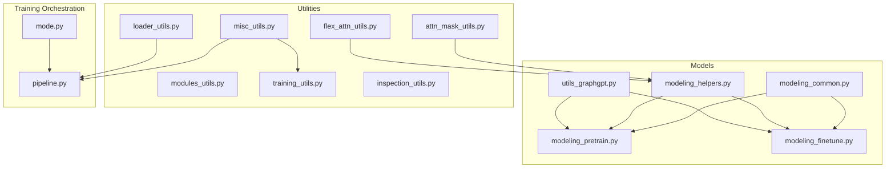

**Diagram sources**
- [modeling_common.py:1-204](file://src/models/graphgpt/modeling_common.py#L1-L204)
- [modeling_helpers.py:1-800](file://src/models/graphgpt/modeling_helpers.py#L1-L800)
- [utils_graphgpt.py:1-665](file://src/models/graphgpt/utils_graphgpt.py#L1-L665)
- [modeling_pretrain.py:1-200](file://src/models/graphgpt/modeling_pretrain.py#L1-L200)
- [modeling_finetune.py:1-200](file://src/models/graphgpt/modeling_finetune.py#L1-L200)
- [modules_utils.py:1-93](file://src/utils/modules_utils.py#L1-L93)
- [misc_utils.py:1-540](file://src/utils/misc_utils.py#L1-L540)
- [attn_mask_utils.py:1-128](file://src/utils/attn_mask_utils.py#L1-L128)
- [flex_attn_utils.py:1-128](file://src/utils/flex_attn_utils.py#L1-L128)
- [training_utils.py:1-262](file://src/utils/training_utils.py#L1-L262)
- [inspection_utils.py:1-167](file://src/utils/inspection_utils.py#L1-L167)
- [loader_utils.py:1-200](file://src/utils/loader_utils.py#L1-L200)
- [mode.py:1-48](file://src/training/mode.py#L1-L48)
- [pipeline.py:149-177](file://src/training/pipeline.py#L149-L177)

**Section sources**
- [modeling_common.py:1-204](file://src/models/graphgpt/modeling_common.py#L1-L204)
- [modeling_helpers.py:1-800](file://src/models/graphgpt/modeling_helpers.py#L1-L800)
- [utils_graphgpt.py:1-665](file://src/models/graphgpt/utils_graphgpt.py#L1-L665)
- [modeling_pretrain.py:1-200](file://src/models/graphgpt/modeling_pretrain.py#L1-L200)
- [modeling_finetune.py:1-200](file://src/models/graphgpt/modeling_finetune.py#L1-L200)
- [modules_utils.py:1-93](file://src/utils/modules_utils.py#L1-L93)
- [misc_utils.py:1-540](file://src/utils/misc_utils.py#L1-L540)
- [attn_mask_utils.py:1-128](file://src/utils/attn_mask_utils.py#L1-L128)
- [flex_attn_utils.py:1-128](file://src/utils/flex_attn_utils.py#L1-L128)
- [training_utils.py:1-262](file://src/utils/training_utils.py#L1-L262)
- [inspection_utils.py:1-167](file://src/utils/inspection_utils.py#L1-L167)
- [loader_utils.py:1-200](file://src/utils/loader_utils.py#L1-L200)
- [mode.py:1-48](file://src/training/mode.py#L1-L48)
- [pipeline.py:149-177](file://src/training/pipeline.py#L149-L177)

## Core Components
- **Streamlined backbone initialization**: Common initialization helpers that select and instantiate the LlamaModel backbone with consistent dropout behavior across pretrain and finetune models
- **Unified attention interface**: Abstraction layer that provides consistent attention behavior regardless of underlying implementation (SDPA vs flex attention)
- **Conditional attention implementation selection**: Automatic switching between SDPA and flex_attention based on configuration with enhanced performance optimization
- **Enhanced PackedAttention implementation**: Improved packed sequence handling with better memory optimization, compiled flex attention, and integrated dropout integration
- **Transformer backbone**: Llama-based model with optional dropout in MLP, attention, and embedding layers; supports both packed sequence processing and standard batched sequences
- **Attention mask utilities**: Causal/bidirectional mask construction and 4D mask expansion for both SDPA and flex attention modes with enhanced parameter validation
- **Flex-attention mask preparation**: Improved handling of packed sequences with corrected parameter signatures and enhanced mask validation
- **Positional encoding systems**: 2D/3D tokenization and aggregation for molecular graphs
- **Label/logit preparation helpers**: Per-sequence/per-feature/mixed-level preparation for stacked features
- **Loss functions**: CE with optional focal loss, contrastive loss, and denoising loss
- **Training utilities**: AMP, gradient clipping, distributed training, and checkpointing
- **Debugging and inspection utilities**: Parameter counting, dataset inspection, and tokenization diagnostics

**Section sources**
- [modeling_common.py:145-184](file://src/models/graphgpt/modeling_common.py#L145-L184)
- [utils_graphgpt.py:63-101](file://src/models/graphgpt/utils_graphgpt.py#L63-L101)
- [utils_graphgpt.py:133-186](file://src/models/graphgpt/utils_graphgpt.py#L133-L186)
- [modeling_helpers.py:35-65](file://src/models/graphgpt/modeling_helpers.py#L35-L65)
- [modeling_helpers.py:396-795](file://src/models/graphgpt/modeling_helpers.py#L396-L795)
- [training_utils.py:7-262](file://src/utils/training_utils.py#L7-L262)
- [misc_utils.py:472-540](file://src/utils/misc_utils.py#L472-L540)
- [inspection_utils.py:13-167](file://src/utils/inspection_utils.py#L13-L167)

## Architecture Overview
The shared infrastructure composes:
- A common model base that initializes the Llama backbone with streamlined initialization helpers
- Input preparation pipelines for tokens, stacked features, and 3D positions
- Unified attention interface that abstracts implementation differences between SDPA and flex attention
- Enhanced attention mask handling for causal and bidirectional regimes with improved parameter validation
- Conditional attention implementation selection based on configuration
- Dual-head outputs for pre-training and downstream tasks
- Distributed training and checkpointing support

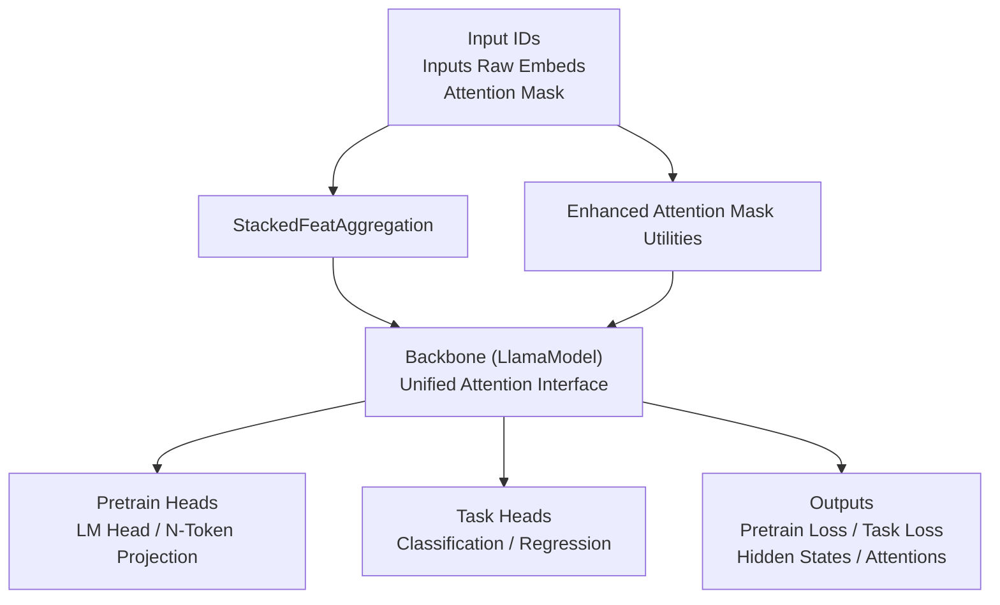

**Diagram sources**
- [modeling_common.py:154-173](file://src/models/graphgpt/modeling_common.py#L154-L173)
- [modeling_helpers.py:35-65](file://src/models/graphgpt/modeling_helpers.py#L35-L65)
- [utils_graphgpt.py:133-186](file://src/models/graphgpt/utils_graphgpt.py#L133-L186)
- [modeling_pretrain.py:57-118](file://src/models/graphgpt/modeling_pretrain.py#L57-L118)
- [modeling_finetune.py:64-106](file://src/models/graphgpt/modeling_finetune.py#L64-L106)

## Detailed Component Analysis

### Streamlined Backbone Initialization
The infrastructure now features streamlined backbone initialization that ensures consistent behavior across both pretrain and finetune models:

- **Consistent initialization pattern**: Both `GraphGPTPretrainBase` and `GraphGPTTaskModel` use identical initialization helpers
- **Conditional dropout application**: `_use_dropout()` function determines whether to apply dropout in the backbone transformer
- **Unified attention mode selection**: `init_backbone()` sets up the LlamaModel with appropriate attention configuration
- **Config-driven architecture**: All initialization follows the model configuration, ensuring reproducibility

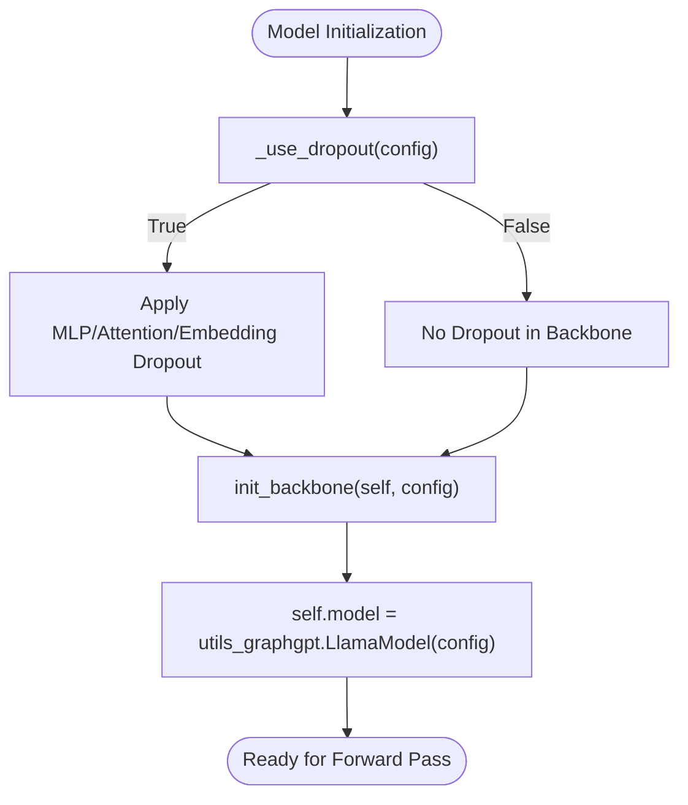

**Diagram sources**
- [modeling_common.py:142-151](file://src/models/graphgpt/modeling_common.py#L142-L151)
- [modeling_common.py:154-158](file://src/models/graphgpt/modeling_common.py#L154-L158)

**Section sources**
- [modeling_common.py:142-151](file://src/models/graphgpt/modeling_common.py#L142-L151)
- [modeling_common.py:154-158](file://src/models/graphgpt/modeling_common.py#L154-L158)
- [modeling_pretrain.py:58-65](file://src/models/graphgpt/modeling_pretrain.py#L58-L65)
- [modeling_finetune.py:67-74](file://src/models/graphgpt/modeling_finetune.py#L67-L74)

### Unified Attention Interface
The attention interface provides a consistent abstraction layer that handles both SDPA and flex attention implementations:

- **PackedAttention for flex attention**: Handles packed sequences with block-wise attention and compiled flex attention with enhanced dropout integration
- **LlamaAttention for SDPA**: Standard attention implementation for traditional SDPA mode
- **Automatic implementation selection**: Based on `_attn_implementation` configuration with conditional instantiation
- **Consistent interface**: Both implementations accept the same parameters and return compatible outputs

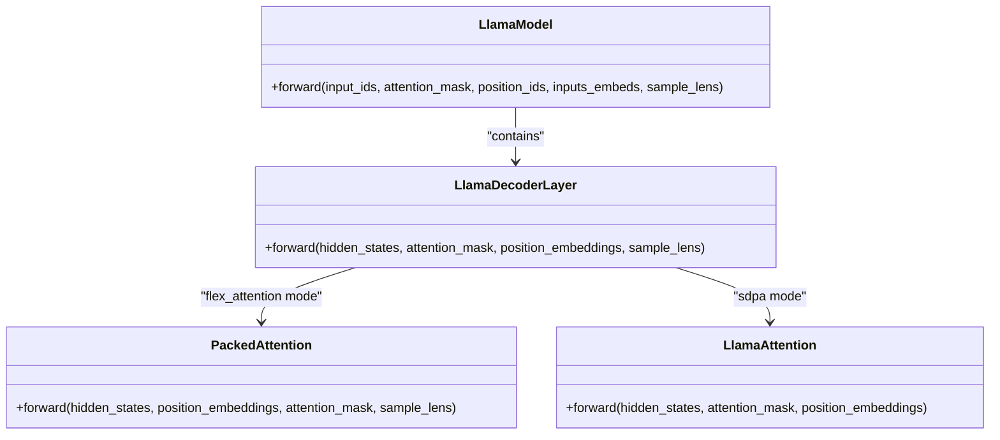

**Diagram sources**
- [utils_graphgpt.py:63-101](file://src/models/graphgpt/utils_graphgpt.py#L63-L101)
- [utils_graphgpt.py:133-186](file://src/models/graphgpt/utils_graphgpt.py#L133-L186)
- [utils_graphgpt.py:188-247](file://src/models/graphgpt/utils_graphgpt.py#L188-L247)

**Section sources**
- [utils_graphgpt.py:63-101](file://src/models/graphgpt/utils_graphgpt.py#L63-L101)
- [utils_graphgpt.py:133-186](file://src/models/graphgpt/utils_graphgpt.py#L133-L186)
- [utils_graphgpt.py:188-247](file://src/models/graphgpt/utils_graphgpt.py#L188-L247)

### Attention Implementation Abstraction
The unified attention interface abstracts implementation differences through a conditional registration system and consistent parameter interface:

- **Conditional implementation selection**: Based on `_attn_implementation` configuration in the model config
- **AttentionInterface registration**: SDPA mode registered with `sdpa_attention_forward` for consistent behavior
- **Automatic instantiation**: `LlamaDecoderLayer` conditionally creates PackedAttention or LlamaAttention based on configuration
- **Parameter compatibility**: Both PackedAttention and LlamaAttention accept identical parameter signatures
- **Return value consistency**: Both return attention outputs and compatible attention weights
- **Memory optimization**: PackedAttention optimizes memory usage for flex attention mode with enhanced padding handling

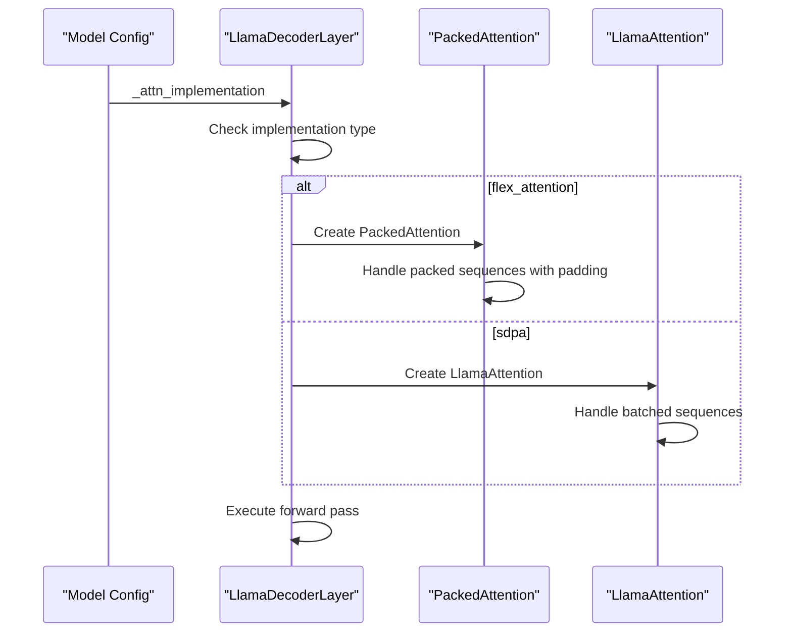

**Diagram sources**
- [utils_graphgpt.py:127-130](file://src/models/graphgpt/utils_graphgpt.py#L127-L130)
- [utils_graphgpt.py:133-141](file://src/models/graphgpt/utils_graphgpt.py#L133-L141)

**Section sources**
- [utils_graphgpt.py:127-130](file://src/models/graphgpt/utils_graphgpt.py#L127-L130)
- [utils_graphgpt.py:133-141](file://src/models/graphgpt/utils_graphgpt.py#L133-L141)
- [utils_graphgpt.py:161-185](file://src/models/graphgpt/utils_graphgpt.py#L161-L185)

### Enhanced PackedAttention Implementation
The PackedAttention implementation has been significantly enhanced with improved performance optimization, compiled flex attention, and integrated dropout handling:

- **Enhanced padding handling**: Better memory optimization by padding to block-aligned length before flex attention computation
- **Compiled flex attention**: Uses `_compiled_flex_attention` with `dynamic=False` for improved performance and consistency
- **Integrated dropout**: Enhanced dropout integration through `get_flex_dropout_mod` with proper random seed handling
- **Memory-efficient processing**: Pads query, key, and value tensors separately and trims results to original sequence length
- **Consistent output format**: Returns attention output and None for attention weights to maintain compatibility with LlamaAttention

**Updated** Enhanced with compiled flex attention and integrated dropout handling for improved performance and training stability

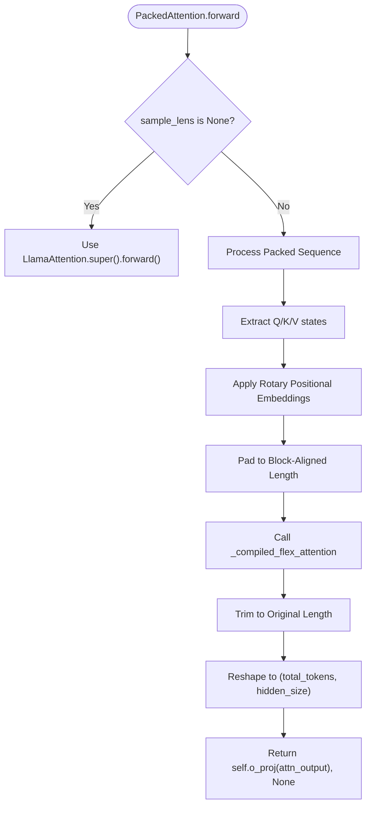

**Diagram sources**
- [utils_graphgpt.py:63-101](file://src/models/graphgpt/utils_graphgpt.py#L63-L101)

**Section sources**
- [utils_graphgpt.py:63-101](file://src/models/graphgpt/utils_graphgpt.py#L63-L101)
- [utils_graphgpt.py:85-100](file://src/models/graphgpt/utils_graphgpt.py#L85-L100)

### Attention Mask Utilities and Conditional Registration
Recent enhancements include improved attention mask utilities with conditional SDPA/flex_attention registration:

- **Conditional mask preparation**: `_update_causal_mask` function automatically selects appropriate mask based on attention implementation
- **Enhanced parameter validation**: Comprehensive assertions ensure required parameters are provided for flex-attention mode
- **AttentionInterface registration**: SDPA mode registered with `sdpa_attention_forward` to ensure consistent behavior across training and evaluation
- **Compiled flex attention**: `_compiled_flex_attention` with `dynamic=False` for improved performance and reliability
- **Flex-attention dropout integration**: `get_flex_dropout_mod` provides efficient dropout handling during flex attention computation

**Updated** Enhanced with compiled flex attention system and integrated dropout handling

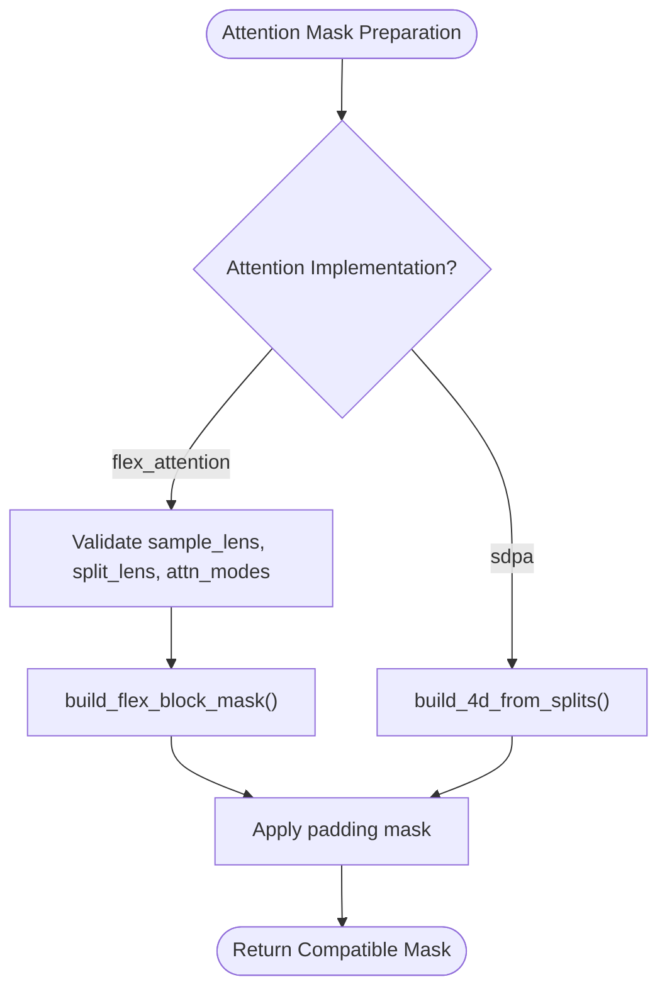

**Diagram sources**
- [modeling_helpers.py:120-132](file://src/models/graphgpt/modeling_helpers.py#L120-L132)
- [utils_graphgpt.py:207-247](file://src/models/graphgpt/utils_graphgpt.py#L207-L247)

**Section sources**
- [modeling_helpers.py:120-132](file://src/models/graphgpt/modeling_helpers.py#L120-L132)
- [utils_graphgpt.py:207-247](file://src/models/graphgpt/utils_graphgpt.py#L207-L247)

### Flex-Attention Mask Preparation for Packed Sequences
The flex-attention implementation now includes improved mask preparation specifically designed for packed sequences:

- **Enhanced parameter validation**: The `_update_causal_mask` function includes comprehensive assertions to ensure all required parameters are present
- **Improved mask construction**: Better handling of packed sequence lengths and attention modes for flex-attention
- **Robust error handling**: Clear validation errors when flex-attention parameters are missing
- **Optimized mask generation**: Efficient creation of BlockMask objects for flex-attention with proper device placement
- **Conditional compilation**: Flex attention compiled with `dynamic=False` for improved performance and consistency

**Updated** Enhanced with compiled flex attention system and integrated dropout handling

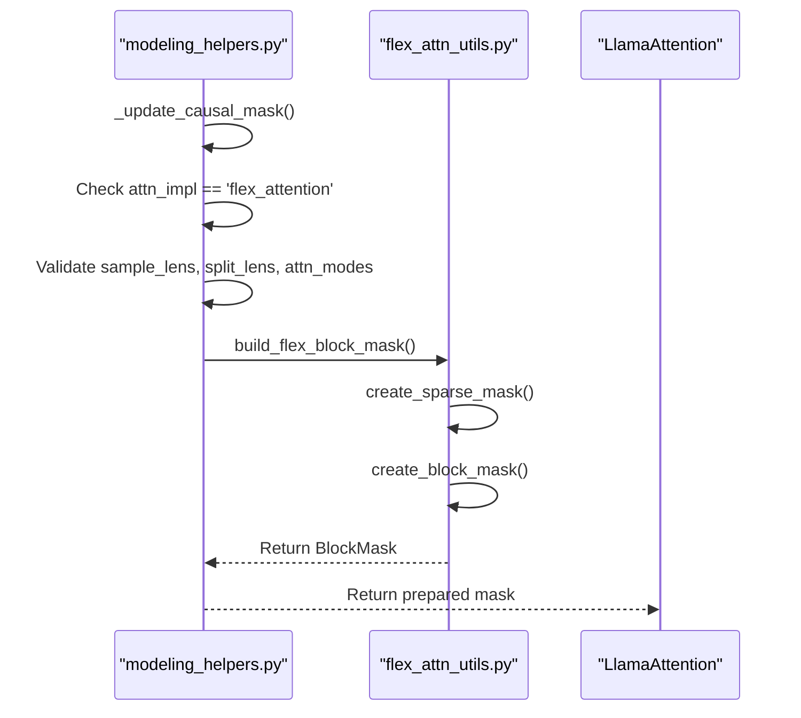

**Diagram sources**
- [modeling_helpers.py:120-132](file://src/models/graphgpt/modeling_helpers.py#L120-L132)
- [flex_attn_utils.py:68-110](file://src/utils/flex_attn_utils.py#L68-L110)

**Section sources**
- [modeling_helpers.py:120-132](file://src/models/graphgpt/modeling_helpers.py#L120-L132)
- [flex_attn_utils.py:68-110](file://src/utils/flex_attn_utils.py#L68-L110)

### Positional Encoding Systems
- 2D SMTP masking for node-level tokens with polynomial scheduling
- 3D position tokenization via line/cube/mix tokens with discretization and aggregation
- Positional embeddings for coordinates and coordinate-type tokens

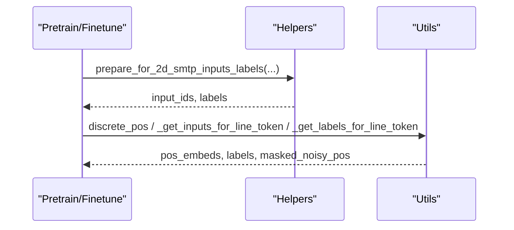

**Diagram sources**
- [modeling_helpers.py:396-795](file://src/models/graphgpt/modeling_helpers.py#L396-L795)
- [modeling_pretrain.py:535-571](file://src/models/graphgpt/modeling_pretrain.py#L535-L571)
- [utils_graphgpt.py:465-551](file://src/models/graphgpt/utils_graphgpt.py#L465-L551)

**Section sources**
- [modeling_helpers.py:396-795](file://src/models/graphgpt/modeling_helpers.py#L396-L795)
- [modeling_pretrain.py:535-571](file://src/models/graphgpt/modeling_pretrain.py#L535-L571)
- [utils_graphgpt.py:465-551](file://src/models/graphgpt/utils_graphgpt.py#L465-L551)

### Label/Logit Preparation and Loss Functions
- Per-sequence, per-feature, and mixed-level preparation for stacked features
- Cross-entropy with optional focal loss and label smoothing
- Contrastive loss for representation learning and denoising loss for 3D coordinates

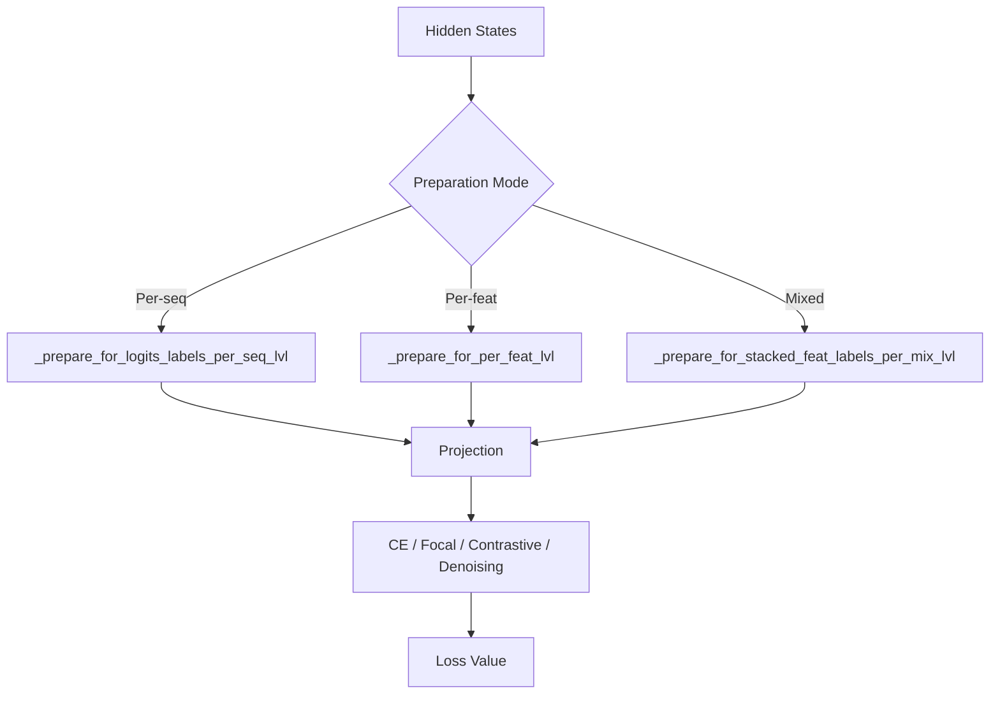

**Diagram sources**
- [modeling_helpers.py:233-394](file://src/models/graphgpt/modeling_helpers.py#L233-L394)
- [modeling_helpers.py:145-228](file://src/models/graphgpt/modeling_helpers.py#L145-L228)

**Section sources**
- [modeling_helpers.py:233-394](file://src/models/graphgpt/modeling_helpers.py#L233-L394)
- [modeling_helpers.py:145-228](file://src/models/graphgpt/modeling_helpers.py#L145-L228)

### Gradient Computation and Memory Optimization
- Automatic mixed precision (AMP) with GradScaler
- Gradient clipping and optimizer step management
- Gradient checkpointing and cache disabling in training pipeline
- Memory-efficient loss computation for large batches

**Updated** Enhanced with compiled flex attention system and improved dropout handling

```mermaid
sequenceDiagram
participant TU as "training_utils.py"
participant DS as "DeepSpeed"
participant AMP as "GradScaler"
participant OPT as "Optimizer"
TU->>DS : forward() / backward() / step() (if DS)
TU->>AMP : scale(loss).backward()
AMP-->>TU : unscale_() and clip_grad_norm_()
AMP->>OPT : step()
AMP-->>TU : update()
```

**Diagram sources**
- [training_utils.py:7-262](file://src/utils/training_utils.py#L7-L262)

**Section sources**
- [training_utils.py:7-262](file://src/utils/training_utils.py#L7-L262)
- [pipeline.py:149-177](file://src/training/pipeline.py#L149-L177)

### Distributed Training Support
- Distributed environment setup and world size/rank detection
- All-gather for statistics across GPUs
- Checkpoint saving/loading for DDP and DeepSpeed ZeRO

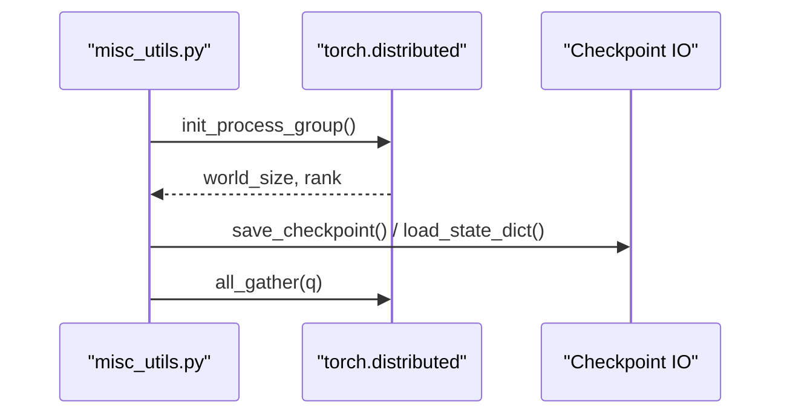

**Diagram sources**
- [misc_utils.py:507-540](file://src/utils/misc_utils.py#L507-L540)
- [misc_utils.py:472-505](file://src/utils/misc_utils.py#L472-L505)
- [misc_utils.py:69-122](file://src/utils/misc_utils.py#L69-L122)

**Section sources**
- [misc_utils.py:507-540](file://src/utils/misc_utils.py#L507-L540)
- [misc_utils.py:472-505](file://src/utils/misc_utils.py#L472-L505)
- [misc_utils.py:69-122](file://src/utils/misc_utils.py#L69-L122)

### Cross-Model Compatibility and Initialization Patterns
- **Streamlined initialization**: Shared initialization helpers ensure consistent backbone selection and dropout behavior across all model variants
- **Conditional attention interface**: Both PackedAttention and LlamaAttention provide identical parameter interfaces based on configuration
- **Config-driven architecture**: All components follow the model configuration, ensuring consistent behavior
- **Forward defaults resolution**: Consistent forward method signature across all model variants
- **Enhanced abstraction**: Improved attention implementation selection with automatic registration system

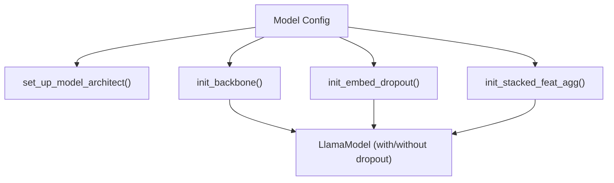

**Diagram sources**
- [modules_utils.py:37-82](file://src/utils/modules_utils.py#L37-L82)
- [modeling_common.py:148-184](file://src/models/graphgpt/modeling_common.py#L148-L184)

**Section sources**
- [modules_utils.py:37-82](file://src/utils/modules_utils.py#L37-L82)
- [modeling_common.py:148-184](file://src/models/graphgpt/modeling_common.py#L148-L184)

### Integration Points and Architectural Consistency
- Both pretrain and finetune models inherit from Llama-based architectures and share:
  - **Streamlined initialization**: Consistent backbone setup using shared helpers
  - **Conditional attention interface**: Same attention behavior regardless of implementation
  - **Input embedding preparation and stacked feature aggregation**: Identical processing pipelines
  - **Enhanced attention mask handling**: Improved mask preparation with corrected parameter validation
  - **Output dataclass for dual-head outputs**: Same output structure
- Training pipeline enables gradient checkpointing and cache disabling for memory efficiency
- **Enhanced abstraction layer**: Improved attention implementation selection with automatic registration system

**Updated** Enhanced with compiled flex attention system and integrated dropout handling

**Section sources**
- [modeling_pretrain.py:57-118](file://src/models/graphgpt/modeling_pretrain.py#L57-L118)
- [modeling_finetune.py:64-106](file://src/models/graphgpt/modeling_finetune.py#L64-L106)
- [modeling_common.py:54-100](file://src/models/graphgpt/modeling_common.py#L54-L100)
- [pipeline.py:149-177](file://src/training/pipeline.py#L149-L177)

## Dependency Analysis
- **Cohesion**: Shared components are cohesive around initialization, input preparation, and attention handling
- **Coupling**: Pretrain and finetune models depend on shared helpers and utilities; distributed and training utilities are orthogonal but integrated via the training pipeline
- **External dependencies**: Transformers Llama, DeepSpeed, PyTorch distributed, and optional AMD SDPA backend
- **Unified interface**: Attention implementations are decoupled from model logic through consistent parameter interfaces
- **Enhanced flex-attention integration**: Improved coupling between modeling helpers and flex-attention utilities
- **Conditional registration system**: AttentionInterface provides consistent behavior across SDPA and flex_attention modes

**Updated** Enhanced with compiled flex attention system and integrated dropout handling

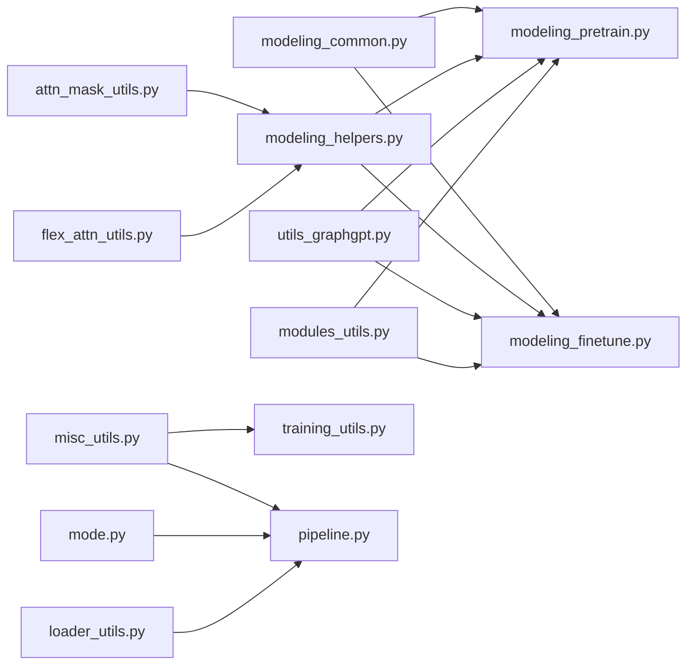

**Diagram sources**
- [modeling_common.py:1-204](file://src/models/graphgpt/modeling_common.py#L1-L204)
- [modeling_helpers.py:1-800](file://src/models/graphgpt/modeling_helpers.py#L1-L800)
- [utils_graphgpt.py:1-665](file://src/models/graphgpt/utils_graphgpt.py#L1-L665)
- [modeling_pretrain.py:1-200](file://src/models/graphgpt/modeling_pretrain.py#L1-L200)
- [modeling_finetune.py:1-200](file://src/models/graphgpt/modeling_finetune.py#L1-L200)
- [modules_utils.py:1-93](file://src/utils/modules_utils.py#L1-L93)
- [misc_utils.py:1-540](file://src/utils/misc_utils.py#L1-L540)
- [attn_mask_utils.py:1-128](file://src/utils/attn_mask_utils.py#L1-L128)
- [flex_attn_utils.py:1-128](file://src/utils/flex_attn_utils.py#L1-L128)
- [training_utils.py:1-262](file://src/utils/training_utils.py#L1-L262)
- [loader_utils.py:1-200](file://src/utils/loader_utils.py#L1-L200)
- [mode.py:1-48](file://src/training/mode.py#L1-L48)
- [pipeline.py:149-177](file://src/training/pipeline.py#L149-L177)

**Section sources**
- [modeling_common.py:1-204](file://src/models/graphgpt/modeling_common.py#L1-L204)
- [modeling_helpers.py:1-800](file://src/models/graphgpt/modeling_helpers.py#L1-L800)
- [utils_graphgpt.py:1-665](file://src/models/graphgpt/utils_graphgpt.py#L1-L665)
- [modeling_pretrain.py:1-200](file://src/models/graphgpt/modeling_pretrain.py#L1-L200)
- [modeling_finetune.py:1-200](file://src/models/graphgpt/modeling_finetune.py#L1-L200)
- [modules_utils.py:1-93](file://src/utils/modules_utils.py#L1-L93)
- [misc_utils.py:1-540](file://src/utils/misc_utils.py#L1-L540)
- [attn_mask_utils.py:1-128](file://src/utils/attn_mask_utils.py#L1-L128)
- [flex_attn_utils.py:1-128](file://src/utils/flex_attn_utils.py#L1-L128)
- [training_utils.py:1-262](file://src/utils/training_utils.py#L1-L262)
- [loader_utils.py:1-200](file://src/utils/loader_utils.py#L1-L200)
- [mode.py:1-48](file://src/training/mode.py#L1-L48)
- [pipeline.py:149-177](file://src/training/pipeline.py#L149-L177)

## Performance Considerations
- Use AMP with GradScaler to reduce memory footprint and improve throughput
- Enable gradient checkpointing and disable KV-cache in training pipeline for memory savings
- Prefer mixed-level label preparation to reduce compute and memory overhead
- Use appropriate attention mask expansion for packed sequences to avoid unnecessary padding
- Clamp ratios and normalize weights to stabilize training on large batches
- **Enhanced flex-attention performance**: Compiled flex attention with `dynamic=False` provides improved performance and consistency
- **Conditional attention selection**: Automatic switching between SDPA and flex_attention based on configuration reduces runtime overhead
- **Integrated dropout optimization**: Enhanced dropout handling in PackedAttention improves training stability
- **Streamlined initialization**: Reduced initialization overhead and consistent memory usage patterns
- **Block size compatibility**: Padding to 128 for flex_attention block size compatibility

**Updated** Enhanced with compiled flex attention system and integrated dropout handling

## Troubleshooting Guide
- Parameter inspection: Use trainable parameter counting to diagnose freezing/unfreezing issues
- Tokenization diagnostics: Inspect tokenization results and packed sequences to validate inputs
- Distributed sanity checks: Verify world size, rank, and NCCL backend initialization
- Checkpoint loading: Handle missing/unexpected keys and Zero-3 state dict conversion
- **Attention interface debugging**: Verify that attention implementation selection matches configuration
- **Enhanced mask validation**: Check for proper parameter validation in `_update_causal_mask` function
- **Flex-attention debugging**: Ensure all required parameters (`sample_lens`, `split_lens`, `attn_modes`) are provided when using flex-attention mode
- **Conditional registration**: Verify that AttentionInterface is properly registered for SDPA mode
- **Initialization consistency**: Ensure streamlined initialization produces expected dropout behavior
- **Compiled flex attention debugging**: Verify that `_compiled_flex_attention` is properly configured with `dynamic=False`

**Updated** Enhanced with compiled flex attention system and integrated dropout handling

**Section sources**
- [inspection_utils.py:13-33](file://src/utils/inspection_utils.py#L13-L33)
- [inspection_utils.py:73-143](file://src/utils/inspection_utils.py#L73-L143)
- [misc_utils.py:507-540](file://src/utils/misc_utils.py#L507-L540)
- [misc_utils.py:231-252](file://src/utils/misc_utils.py#L231-L252)

## Conclusion
The shared infrastructure provides a robust, modular foundation for both pre-training and fine-tuning GraphGPT models. The streamlined backbone initialization and unified attention interface ensure architectural consistency, simplify extension, and enable efficient memory and performance optimization across diverse molecular modeling tasks. Recent enhancements include a conditional SDPA/flex_attention registration system and an improved PackedAttention implementation with enhanced performance optimization, compiled flex attention, and integrated dropout handling. The abstraction layer successfully decouples implementation details from model logic, making the system more maintainable, extensible, and performant.

**Updated** Enhanced with compiled flex attention system and integrated dropout handling

## Appendices

### Example Usage Patterns
- Initialize model with streamlined helpers and configure attention masks for causal/bidirectional regimes with proper parameter validation
- Prepare inputs with stacked features and 3D positions, then run forward to obtain dual-head outputs
- Train with AMP and gradient clipping; save/load checkpoints with DDDP/DeepSpeed support
- **Enhanced attention interface**: Transparently handle both SDPA and flex attention modes with improved parameter handling and conditional selection
- **Flex-attention with packed sequences**: Properly configure `sample_lens`, `split_lens`, and `attn_modes` for optimal performance with enhanced padding and dropout handling
- **Compiled flex attention**: Leverage the compiled flex attention system with `dynamic=False` for improved performance and consistency

**Updated** Enhanced with compiled flex attention system and integrated dropout handling

**Section sources**
- [modeling_common.py:148-184](file://src/models/graphgpt/modeling_common.py#L148-L184)
- [modeling_helpers.py:35-65](file://src/models/graphgpt/modeling_helpers.py#L35-L65)
- [training_utils.py:7-262](file://src/utils/training_utils.py#L7-L262)
- [misc_utils.py:69-122](file://src/utils/misc_utils.py#L69-L122)

### Extension Points
- Add new positional encoding schemes by extending tokenization and aggregation logic
- Introduce new loss functions by following the pattern of CE/focal/contrastive/denoising losses
- Extend initialization helpers to support additional normalization or regularization modules
- **Enhanced attention interface extensions**: Add new attention implementations that follow the unified interface pattern with proper parameter validation and conditional registration
- **Flex-attention improvements**: Extend mask preparation utilities for new attention modes and sequence types
- **Conditional registration system**: Leverage AttentionInterface for consistent behavior across different attention implementations
- **Compiled flex attention extensions**: Extend the compiled flex attention system for new performance optimizations and dropout handling patterns

**Updated** Enhanced with compiled flex attention system and integrated dropout handling

**Section sources**
- [modeling_helpers.py:396-795](file://src/models/graphgpt/modeling_helpers.py#L396-L795)
- [modeling_helpers.py:145-228](file://src/models/graphgpt/modeling_helpers.py#L145-L228)
- [modeling_common.py:148-184](file://src/models/graphgpt/modeling_common.py#L148-L184)
- [utils_graphgpt.py:63-101](file://src/models/graphgpt/utils_graphgpt.py#L63-L101)
- [flex_attn_utils.py:68-110](file://src/utils/flex_attn_utils.py#L68-L110)
- [utils_graphgpt.py:48](file://src/models/graphgpt/utils_graphgpt.py#L48)
