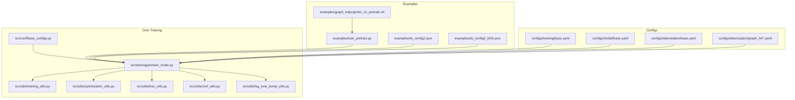
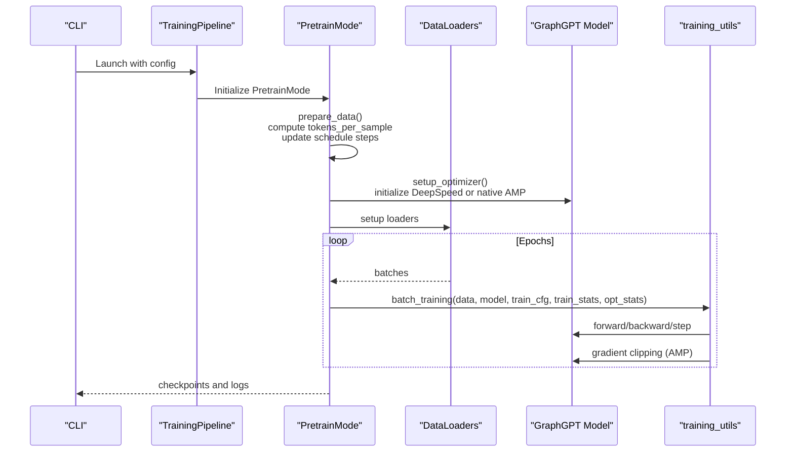
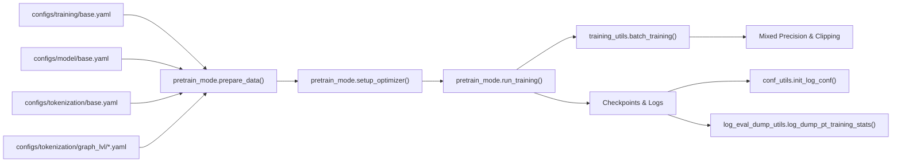
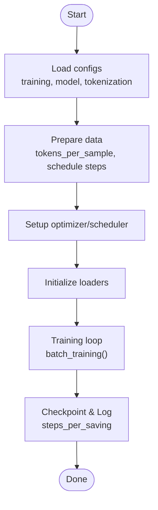

# Pre-training Hyperparameters and Scheduling

<cite>
**Referenced Files in This Document**
- [configs/training/base.yaml](file://configs/training/base.yaml)
- [configs/model/base.yaml](file://configs/model/base.yaml)
- [configs/tokenization/base.yaml](file://configs/tokenization/base.yaml)
- [configs/tokenization/graph_lvl/pcqm4m-v2.yaml](file://configs/tokenization/graph_lvl/pcqm4m-v2.yaml)
- [configs/tokenization/graph_lvl/reddit.yaml](file://configs/tokenization/graph_lvl/reddit.yaml)
- [examples/train_pretrain.py](file://examples/train_pretrain.py)
- [examples/ds_config2.json](file://examples/ds_config2.json)
- [examples/ds_config2_bf16.json](file://examples/ds_config2_bf16.json)
- [examples/graph_lvl/pcqm4m_v2_pretrain.sh](file://examples/graph_lvl/pcqm4m_v2_pretrain.sh)
- [src/conf/base_configs.py](file://src/conf/base_configs.py)
- [src/training/pretrain_mode.py](file://src/training/pretrain_mode.py)
- [src/utils/training_utils.py](file://src/utils/training_utils.py)
- [src/utils/optimization_utils.py](file://src/utils/optimization_utils.py)
- [src/utils/loss_utils.py](file://src/utils/loss_utils.py)
- [src/utils/conf_utils.py](file://src/utils/conf_utils.py)
- [src/utils/log_eval_dump_utils.py](file://src/utils/log_eval_dump_utils.py)
</cite>

## Update Summary
**Changes Made**
- Updated parameter naming from `samples_per_saving` to `steps_per_saving` throughout the documentation
- Added new section documenting the parameter rename and its implications
- Updated all references to use the new `steps_per_saving` parameter
- Enhanced troubleshooting section with guidance for parameter migration

## Table of Contents
1. [Introduction](#introduction)
2. [Project Structure](#project-structure)
3. [Core Components](#core-components)
4. [Architecture Overview](#architecture-overview)
5. [Detailed Component Analysis](#detailed-component-analysis)
6. [Parameter Renaming and Migration](#parameter-renaming-and-migration)
7. [Dependency Analysis](#dependency-analysis)
8. [Performance Considerations](#performance-considerations)
9. [Troubleshooting Guide](#troubleshooting-guide)
10. [Conclusion](#conclusion)
11. [Appendices](#appendices)

## Introduction
This document explains the pre-training hyperparameters and scheduling strategies in Graph-GPT. It covers learning rate schedules, batch sizing, gradient accumulation, optimizer parameters, and how pre-training objectives influence hyperparameter choices. It also documents mixed precision training, gradient clipping, warmup strategies, decay schedules, adaptive scheduling, early stopping, convergence monitoring, and practical tuning methodologies grounded in the repository's configuration and training code.

**Updated** The documentation now reflects the recent parameter renaming from `samples_per_saving` to `steps_per_saving` throughout the training configuration system.

## Project Structure
The repository organizes pre-training configuration and training logic across configuration YAMLs and Python modules:
- Configuration files define training schedule, optimizer, model heads, and tokenization specifics.
- Training entry points and modes orchestrate data loading, model setup, and training loops.
- Utilities implement mixed precision, gradient clipping, and scheduler integration.

**Diagram sources**
- [configs/training/base.yaml:1-76](file://configs/training/base.yaml#L1-L76)
- [configs/model/base.yaml:1-222](file://configs/model/base.yaml#L1-L222)
- [configs/tokenization/base.yaml:1-117](file://configs/tokenization/base.yaml#L1-L117)
- [configs/tokenization/graph_lvl/pcqm4m-v2.yaml:1-114](file://configs/tokenization/graph_lvl/pcqm4m-v2.yaml#L1-L114)
- [examples/train_pretrain.py:1-19](file://examples/train_pretrain.py#L1-L19)
- [examples/ds_config2.json:1-43](file://examples/ds_config2.json#L1-L43)
- [examples/ds_config2_bf16.json:1-38](file://examples/ds_config2_bf16.json#L1-L38)
- [examples/graph_lvl/pcqm4m_v2_pretrain.sh:1-323](file://examples/graph_lvl/pcqm4m_v2_pretrain.sh#L1-L323)
- [src/conf/base_configs.py:1-302](file://src/conf/base_configs.py#L1-L302)
- [src/training/pretrain_mode.py:1-526](file://src/training/pretrain_mode.py#L1-L526)
- [src/utils/training_utils.py:1-206](file://src/utils/training_utils.py#L1-L206)
- [src/utils/optimization_utils.py:1-14](file://src/utils/optimization_utils.py#L1-L14)
- [src/utils/loss_utils.py:252-387](file://src/utils/loss_utils.py#L252-L387)
- [src/utils/conf_utils.py:150-232](file://src/utils/conf_utils.py#L150-L232)
- [src/utils/log_eval_dump_utils.py:545-744](file://src/utils/log_eval_dump_utils.py#L545-L744)

**Section sources**
- [examples/train_pretrain.py:1-19](file://examples/train_pretrain.py#L1-L19)
- [src/training/pretrain_mode.py:1-526](file://src/training/pretrain_mode.py#L1-L526)

## Core Components
- Training schedule and optimizer parameters are defined centrally and consumed by the pretraining mode.
- Mixed precision and gradient clipping are applied in the training loop depending on the backend (DeepSpeed vs native AMP).
- Tokenization and pretraining objectives (e.g., masked language modeling, SMTP) are configured via tokenization configs and influence model heads and MLM parameters.

Key hyperparameters and their locations:
- Learning rate schedule and warmup: [configs/training/base.yaml:24-31](file://configs/training/base.yaml#L24-L31)
- Optimizer: [configs/training/base.yaml:35-44](file://configs/training/base.yaml#L35-L44)
- Batch size and accumulation: [configs/training/base.yaml:46-47](file://configs/training/base.yaml#L46-L47), [src/utils/training_utils.py:47-49](file://src/utils/training_utils.py#L47-L49)
- Mixed precision and clipping: [src/utils/training_utils.py:53-86](file://src/utils/training_utils.py#L53-L86), [src/utils/training_utils.py:72-77](file://src/utils/training_utils.py#L72-L77)
- Pretraining objectives and MLM parameters: [configs/training/base.yaml:13-22](file://configs/training/base.yaml#L13-L22), [configs/tokenization/graph_lvl/pcqm4m-v2.yaml:14-22](file://configs/tokenization/graph_lvl/pcqm4m-v2.yaml#L14-L22)
- Model heads influencing objectives: [configs/model/base.yaml:75-167](file://configs/model/base.yaml#L75-L167)
- **Updated** Saving intervals and checkpoint cadence: [configs/training/base.yaml:31](file://configs/training/base.yaml#L31), [src/conf/base_configs.py:49](file://src/conf/base_configs.py#L49), [src/training/pretrain_mode.py:495-498](file://src/training/pretrain_mode.py#L495-L498)

**Section sources**
- [configs/training/base.yaml:13-44](file://configs/training/base.yaml#L13-L44)
- [configs/model/base.yaml:75-167](file://configs/model/base.yaml#L75-L167)
- [configs/tokenization/graph_lvl/pcqm4m-v2.yaml:14-22](file://configs/tokenization/graph_lvl/pcqm4m-v2.yaml#L14-L22)
- [src/utils/training_utils.py:47-86](file://src/utils/training_utils.py#L47-L86)
- [src/conf/base_configs.py:49](file://src/conf/base_configs.py#L49)
- [src/training/pretrain_mode.py:495-498](file://src/training/pretrain_mode.py#L495-L498)

## Architecture Overview
The pretraining pipeline reads configuration, builds tokenization and model, sets up the optimizer/scheduler, and runs the training loop with mixed precision and gradient clipping.

**Diagram sources**
- [examples/train_pretrain.py:12-18](file://examples/train_pretrain.py#L12-L18)
- [src/training/pretrain_mode.py:97-216](file://src/training/pretrain_mode.py#L97-L216)
- [src/utils/training_utils.py:7-90](file://src/utils/training_utils.py#L7-L90)

## Detailed Component Analysis

### Learning Rate Schedules and Warmup
- Schedule configuration supports token-based durations and warmup:
  - Total tokens and warmup tokens drive total steps and warmup steps.
  - Logging intervals and saving cadence are configurable.
- Warmup and decay are implemented via DeepSpeed scheduler integration when enabled, or via PyTorch schedulers in native AMP mode.
- Min learning rate is set conditionally based on DeepSpeed usage.

Practical implications:
- Use total_tokens and warmup_tokens to scale training to dataset size and desired convergence.
- Choose scheduler type (e.g., OneCycleLR) via DeepSpeed config when applicable.

Concrete references:
- Schedule definition: [configs/training/base.yaml:24-34](file://configs/training/base.yaml#L24-L34)
- Steps computation and printing: [src/conf/base_configs.py:54-73](file://src/conf/base_configs.py#L54-L73)
- Conditional min_lr: [src/training/pretrain_mode.py](file://src/training/pretrain_mode.py#L108)
- Scheduler helpers (PyTorch): [src/utils/loss_utils.py:266-367](file://src/utils/loss_utils.py#L266-L367)
- DeepSpeed scheduler update: [src/utils/optimization_utils.py:4-13](file://src/utils/optimization_utils.py#L4-L13)

**Section sources**
- [configs/training/base.yaml:24-34](file://configs/training/base.yaml#L24-L34)
- [src/conf/base_configs.py:54-73](file://src/conf/base_configs.py#L54-L73)
- [src/training/pretrain_mode.py](file://src/training/pretrain_mode.py#L108)
- [src/utils/loss_utils.py:266-367](file://src/utils/loss_utils.py#L266-L367)
- [src/utils/optimization_utils.py:4-13](file://src/utils/optimization_utils.py#L4-L13)

### Batch Size and Gradient Accumulation
- Global batch size is controlled by training.batch_size and world_size.
- Token-based schedule updates steps based on tokens_per_sample, batch_size, and world_size.
- Gradient accumulation is enforced to 1 in native AMP mode to align with autocast semantics.

Guidelines:
- Increase batch_size for larger GPUs; keep gradient_accumulation_steps at 1 for AMP.
- For DeepSpeed, micro-batch size is configured externally (see ds_config examples).

References:
- Batch size and accumulation: [configs/training/base.yaml:46-47](file://configs/training/base.yaml#L46-L47), [src/utils/training_utils.py:47-49](file://src/utils/training_utils.py#L47-L49)
- Step computation: [src/conf/base_configs.py:54-61](file://src/conf/base_configs.py#L54-L61)

**Section sources**
- [configs/training/base.yaml:46-47](file://configs/training/base.yaml#L46-L47)
- [src/utils/training_utils.py:47-49](file://src/utils/training_utils.py#L47-L49)
- [src/conf/base_configs.py:54-61](file://src/conf/base_configs.py#L54-L61)

### Optimizer Parameters
- Adam-like optimizer with configurable lr, betas, weight_decay, eps, and max_grad_norm.
- EMA can be enabled for model averaging.

Recommendations:
- Start with betas aligned with transformer defaults; adjust weight_decay for regularization.
- Tune max_grad_norm to stabilize training; typical values around 1.0.

References:
- Optimizer config: [configs/training/base.yaml:35-44](file://configs/training/base.yaml#L35-L44)
- EMA toggle: [configs/training/base.yaml:43-44](file://configs/training/base.yaml#L43-L44)

**Section sources**
- [configs/training/base.yaml:35-44](file://configs/training/base.yaml#L35-L44)

### Mixed Precision, Gradient Clipping, and Numerical Stability
- Native AMP path uses torch.amp autocast with scaler.scale(loss).backward().
- Gradient clipping is applied after unscale when max_grad_norm > 0.
- DeepSpeed path delegates scaling and clipping to its engine.

Stability tips:
- Keep eps in optimizer reasonable (e.g., 1e-6–1e-8).
- Monitor for inf/nan and reduce lr or clipping threshold if instability occurs.

References:
- AMP and clipping: [src/utils/training_utils.py:53-86](file://src/utils/training_utils.py#L53-L86), [src/utils/training_utils.py:72-77](file://src/utils/training_utils.py#L72-L77)

**Section sources**
- [src/utils/training_utils.py:53-86](file://src/utils/training_utils.py#L53-L86)
- [src/utils/training_utils.py:72-77](file://src/utils/training_utils.py#L72-L77)

### Pre-training Objectives and Their Influence on Hyperparameters
- Masked Language Modeling (MLM) and Diffusion-based objectives are selectable.
- SMTP-based objectives and positional prediction heads are configurable in model heads.
- Tokenization configs specify MLM method and ratios.

Implications:
- Higher masking ratios increase pretraining signal but may require lower lr or stronger regularization.
- SMTP objectives often pair with dedicated heads and positional discretization settings.

References:
- Pretrain MLM config: [configs/training/base.yaml:13-22](file://configs/training/base.yaml#L13-L22)
- Tokenization MLM method: [configs/tokenization/graph_lvl/pcqm4m-v2.yaml:14-22](file://configs/tokenization/graph_lvl/pcqm4m-v2.yaml#L14-L22)
- Model heads (SMTP, denoising): [configs/model/base.yaml:75-167](file://configs/model/base.yaml#L75-L167)

**Section sources**
- [configs/training/base.yaml:13-22](file://configs/training/base.yaml#L13-L22)
- [configs/tokenization/graph_lvl/pcqm4m-v2.yaml:14-22](file://configs/tokenization/graph_lvl/pcqm4m-v2.yaml#L14-L22)
- [configs/model/base.yaml:75-167](file://configs/model/base.yaml#L75-L167)

### Warmup Strategies and Decay Schedules
- Warmup is token-based; warmup_tokens divided by effective tokens per step determines warmup steps.
- When using DeepSpeed, schedulers are parsed from ds_config and passed to initialize().
- PyTorch schedulers are supported via helpers (e.g., OneCycleLR, CosineAnnealing).

References:
- Warmup and total tokens: [configs/training/base.yaml:27-30](file://configs/training/base.yaml#L27-L30)
- Steps computation: [src/conf/base_configs.py:54-61](file://src/conf/base_configs.py#L54-L61)
- DeepSpeed scheduler update: [src/utils/optimization_utils.py:4-13](file://src/utils/optimization_utils.py#L4-L13)
- Scheduler helpers: [src/utils/loss_utils.py:322-367](file://src/utils/loss_utils.py#L322-L367)

**Section sources**
- [configs/training/base.yaml:27-30](file://configs/training/base.yaml#L27-L30)
- [src/conf/base_configs.py:54-61](file://src/conf/base_configs.py#L54-L61)
- [src/utils/optimization_utils.py:4-13](file://src/utils/optimization_utils.py#L4-L13)
- [src/utils/loss_utils.py:322-367](file://src/utils/loss_utils.py#L322-L367)

### Adaptive Scheduling, Early Stopping, and Convergence Monitoring
- The training loop tracks steps and saves checkpoints at configured intervals.
- Validation and generation evaluation are integrated; best EMA results tracked when enabled.
- Convergence monitoring can leverage logging steps and saved metrics.

**Updated** The saving interval parameter has been renamed from `samples_per_saving` to `steps_per_saving` throughout the system.

References:
- Saving intervals and logging: [configs/training/base.yaml:31](file://configs/training/base.yaml#L31), [src/conf/base_configs.py:49](file://src/conf/base_configs.py#L49)
- Evaluation hooks: [src/training/pretrain_mode.py:344-360](file://src/training/pretrain_mode.py#L344-L360)
- Loop termination at total_num_steps: [src/training/pretrain_mode.py:484-497](file://src/training/pretrain_mode.py#L484-L497)
- Checkpoint saving logic: [src/training/pretrain_mode.py:495-498](file://src/training/pretrain_mode.py#L495-L498)
- Resume training logic: [src/utils/conf_utils.py:150-175](file://src/utils/conf_utils.py#L150-L175)
- FLOPS calculation: [src/utils/log_eval_dump_utils.py:550-556](file://src/utils/log_eval_dump_utils.py#L550-L556)

**Section sources**
- [configs/training/base.yaml:31](file://configs/training/base.yaml#L31)
- [src/conf/base_configs.py:49](file://src/conf/base_configs.py#L49)
- [src/training/pretrain_mode.py:344-360](file://src/training/pretrain_mode.py#L344-L360)
- [src/training/pretrain_mode.py:484-497](file://src/training/pretrain_mode.py#L484-L497)
- [src/training/pretrain_mode.py:495-498](file://src/training/pretrain_mode.py#L495-L498)
- [src/utils/conf_utils.py:150-175](file://src/utils/conf_utils.py#L150-L175)
- [src/utils/log_eval_dump_utils.py:550-556](file://src/utils/log_eval_dump_utils.py#L550-L556)

### Examples: Optimal Parameter Settings by Dataset and Scale
Below are concrete examples from the repository's scripts and configs. These demonstrate how to set hyperparameters for different graph sizes and computational resources.

- PCQM4Mv2 (molecular) pretraining:
  - Script defines batch_size, lr, weight_decay, max_grad_norm, and DeepSpeed config.
  - Tokens budget and warmup are set via command-line arguments mapped to training.schedule.
  - **Updated** Uses `steps_per_saving` parameter instead of the old `samples_per_saving`.
  - References:
    - [examples/graph_lvl/pcqm4m_v2_pretrain.sh:29-61](file://examples/graph_lvl/pcqm4m_v2_pretrain.sh#L29-L61)
    - [examples/graph_lvl/pcqm4m_v2_pretrain.sh:283](file://examples/graph_lvl/pcqm4m_v2_pretrain.sh#L283)
    - [examples/ds_config2.json:1-43](file://examples/ds_config2.json#L1-L43)
    - [examples/ds_config2_bf16.json:1-38](file://examples/ds_config2_bf16.json#L1-L38)

- Reddit (graph-level) pretraining:
  - Tokenization config demonstrates vocabulary and structure tokens for graph tasks.
  - References:
    - [configs/tokenization/graph_lvl/reddit.yaml:1-121](file://configs/tokenization/graph_lvl/reddit.yaml#L1-L121)

- Base training configuration:
  - Centralized schedule, optimizer, and batch settings.
  - **Updated** Uses `steps_per_saving` parameter in the schedule configuration.
  - References:
    - [configs/training/base.yaml:24-47](file://configs/training/base.yaml#L24-L47)

Notes:
- Adjust lr, weight_decay, and batch_size according to GPU memory and dataset scale.
- For DeepSpeed, tune micro-batch size and zero-stage in ds_config accordingly.
- **Updated** When migrating from older configurations, replace `samples_per_saving` with `steps_per_saving`.

**Section sources**
- [examples/graph_lvl/pcqm4m_v2_pretrain.sh:29-61](file://examples/graph_lvl/pcqm4m_v2_pretrain.sh#L29-L61)
- [examples/graph_lvl/pcqm4m_v2_pretrain.sh:283](file://examples/graph_lvl/pcqm4m_v2_pretrain.sh#L283)
- [examples/ds_config2.json:1-43](file://examples/ds_config2.json#L1-L43)
- [examples/ds_config2_bf16.json:1-38](file://examples/ds_config2_bf16.json#L1-L38)
- [configs/tokenization/graph_lvl/reddit.yaml:1-121](file://configs/tokenization/graph_lvl/reddit.yaml#L1-L121)
- [configs/training/base.yaml:24-47](file://configs/training/base.yaml#L24-L47)

### Training Entry Point and Execution Flow
- The pretraining entry point launches the training pipeline with a PretrainMode.
- The mode orchestrates data preparation, model setup, optimizer initialization, and the training loop.

References:
- Entry point: [examples/train_pretrain.py:12-18](file://examples/train_pretrain.py#L12-L18)
- Pretrain mode lifecycle: [src/training/pretrain_mode.py:97-216](file://src/training/pretrain_mode.py#L97-L216), [src/training/pretrain_mode.py:412-526](file://src/training/pretrain_mode.py#L412-L526)

**Section sources**
- [examples/train_pretrain.py:12-18](file://examples/train_pretrain.py#L12-L18)
- [src/training/pretrain_mode.py:97-216](file://src/training/pretrain_mode.py#L97-L216)
- [src/training/pretrain_mode.py:412-526](file://src/training/pretrain_mode.py#L412-L526)

## Parameter Renaming and Migration

**Updated** The training configuration system has undergone a parameter renaming from `samples_per_saving` to `steps_per_saving` to better reflect the step-based nature of checkpoint saving intervals.

### Parameter Rename Details
- **Old parameter**: `samples_per_saving` - used to specify the number of samples between checkpoints
- **New parameter**: `steps_per_saving` - now used to specify the number of training steps between checkpoints
- **Scope**: Affects all YAML configuration files, Python configuration classes, and training utilities

### Migration Guide
When updating existing configurations:

1. **YAML Configuration Files**:
   - Replace `samples_per_saving` with `steps_per_saving` in all training schedule sections
   - Example: `samples_per_saving: 256000` becomes `steps_per_saving: 256000`

2. **Python Configuration Classes**:
   - The `ScheduleConfig` class now uses `steps_per_saving` attribute
   - No functional change, only attribute name update

3. **Training Utilities**:
   - All utility functions now reference `steps_per_saving`
   - Checkpoint saving logic uses step-based intervals consistently

4. **Script Parameters**:
   - Command-line scripts pass `steps_per_saving` instead of `samples_per_saving`
   - Example: `--training.schedule.steps_per_saving=${steps_per_saving}`

### Impact Analysis
- **Checkpoint Frequency**: The new parameter maintains the same checkpoint frequency semantics
- **Step-Based Logic**: Better aligns with training progress tracking (steps vs samples)
- **Backward Compatibility**: Existing configurations with the old parameter name will need manual updates
- **Consistency**: Eliminates confusion between sample-based and step-based saving intervals

**Section sources**
- [configs/training/base.yaml:31](file://configs/training/base.yaml#L31)
- [src/conf/base_configs.py:49](file://src/conf/base_configs.py#L49)
- [src/training/pretrain_mode.py:495-498](file://src/training/pretrain_mode.py#L495-L498)
- [src/utils/conf_utils.py:150-175](file://src/utils/conf_utils.py#L150-L175)
- [src/utils/log_eval_dump_utils.py:550-556](file://src/utils/log_eval_dump_utils.py#L550-L556)

## Dependency Analysis
The following diagram shows how configuration, training mode, and utilities depend on each other during pretraining.

**Diagram sources**
- [configs/training/base.yaml:1-76](file://configs/training/base.yaml#L1-L76)
- [configs/model/base.yaml:1-222](file://configs/model/base.yaml#L1-L222)
- [configs/tokenization/base.yaml:1-117](file://configs/tokenization/base.yaml#L1-L117)
- [configs/tokenization/graph_lvl/pcqm4m-v2.yaml:1-114](file://configs/tokenization/graph_lvl/pcqm4m-v2.yaml#L1-L114)
- [src/training/pretrain_mode.py:97-216](file://src/training/pretrain_mode.py#L97-L216)
- [src/utils/training_utils.py:7-90](file://src/utils/training_utils.py#L7-L90)
- [src/utils/conf_utils.py:150-232](file://src/utils/conf_utils.py#L150-L232)
- [src/utils/log_eval_dump_utils.py:545-744](file://src/utils/log_eval_dump_utils.py#L545-L744)

**Section sources**
- [src/training/pretrain_mode.py:97-216](file://src/training/pretrain_mode.py#L97-L216)
- [src/utils/training_utils.py:7-90](file://src/utils/training_utils.py#L7-L90)

## Performance Considerations
- Use DeepSpeed with appropriate zero stages and activation checkpointing for large models and datasets.
- Tune micro-batch size in ds_config to fit GPU memory while maintaining throughput.
- Prefer OneCycle-style schedules for strong initial convergence with controlled decay.
- Monitor gradient norms and adjust max_grad_norm to prevent exploding gradients.
- For token-packeted training, estimate tokens_per_sample carefully to avoid excessive padding overhead.
- **Updated** The new `steps_per_saving` parameter provides more precise control over checkpoint frequency, enabling better resource utilization.

## Troubleshooting Guide
Common issues and remedies grounded in the code:

- **Gradient accumulation assertion in AMP mode**:
  - Ensure gradient_accumulation_steps remains at 1 when using autocast.
  - Reference: [src/utils/training_utils.py:47-49](file://src/utils/training_utils.py#L47-L49)

- **DeepSpeed vs native AMP**:
  - When DeepSpeed is enabled, scaling and clipping are handled by the engine; verify ds_config compatibility.
  - References: [src/training/pretrain_mode.py:276-298](file://src/training/pretrain_mode.py#L276-L298), [src/utils/optimization_utils.py:4-13](file://src/utils/optimization_utils.py#L4-L13)

- **Scheduler mismatch**:
  - Confirm scheduler type and parameters match ds_config when using DeepSpeed.
  - Reference: [src/utils/optimization_utils.py:4-13](file://src/utils/optimization_utils.py#L4-L13)

- **Final step reached**:
  - Training exits when total_num_steps is met; verify schedule settings.
  - Reference: [src/training/pretrain_mode.py:484-497](file://src/training/pretrain_mode.py#L484-L497)

- **Parameter naming issues**:
  - **Updated** Ensure all configurations use `steps_per_saving` instead of the deprecated `samples_per_saving`.
  - Check that scripts pass `steps_per_saving` via command line parameters.
  - Verify that resume training logic correctly interprets the new parameter name.

**Section sources**
- [src/utils/training_utils.py:47-49](file://src/utils/training_utils.py#L47-L49)
- [src/training/pretrain_mode.py:276-298](file://src/training/pretrain_mode.py#L276-L298)
- [src/utils/optimization_utils.py:4-13](file://src/utils/optimization_utils.py#L4-L13)
- [src/training/pretrain_mode.py:484-497](file://src/training/pretrain_mode.py#L484-L497)

## Conclusion
Graph-GPT's pretraining is configured through centralized YAML files and executed via a structured training mode. Token-based scheduling, robust optimizer settings, and mixed precision with gradient clipping form the backbone of stable and efficient training. Objective-specific configurations (MLM, SMTP, denoising) guide model head choices and masking strategies. By aligning schedule budgets (total_tokens/warmup_tokens), batch sizing, and optimizer parameters with dataset characteristics and hardware capacity—guided by the included scripts and configs—users can achieve reliable convergence and strong pretraining outcomes.

**Updated** The recent parameter renaming to `steps_per_saving` improves clarity and consistency in the training configuration system, providing more precise control over checkpoint frequency and better alignment with step-based training progress tracking.

## Appendices

### Appendix A: End-to-End Pretraining Flow

**Diagram sources**
- [src/training/pretrain_mode.py:97-216](file://src/training/pretrain_mode.py#L97-L216)
- [src/utils/training_utils.py:7-90](file://src/utils/training_utils.py#L7-L90)
- [src/utils/log_eval_dump_utils.py:550-556](file://src/utils/log_eval_dump_utils.py#L550-L556)
