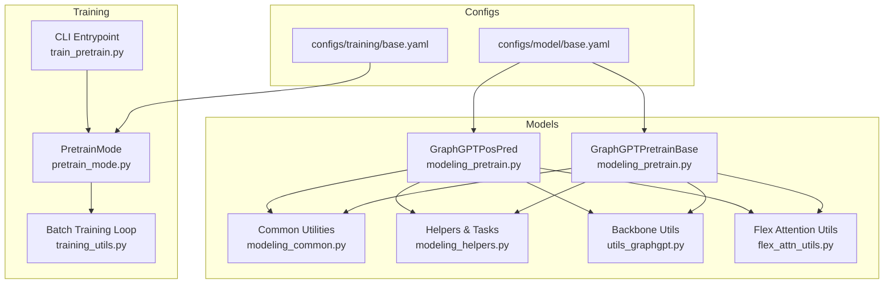
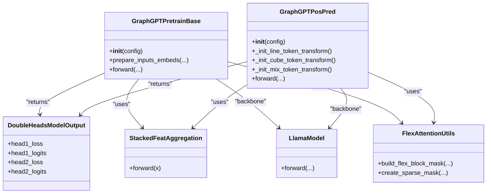
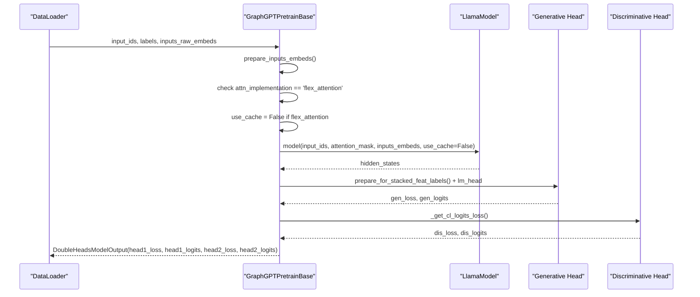
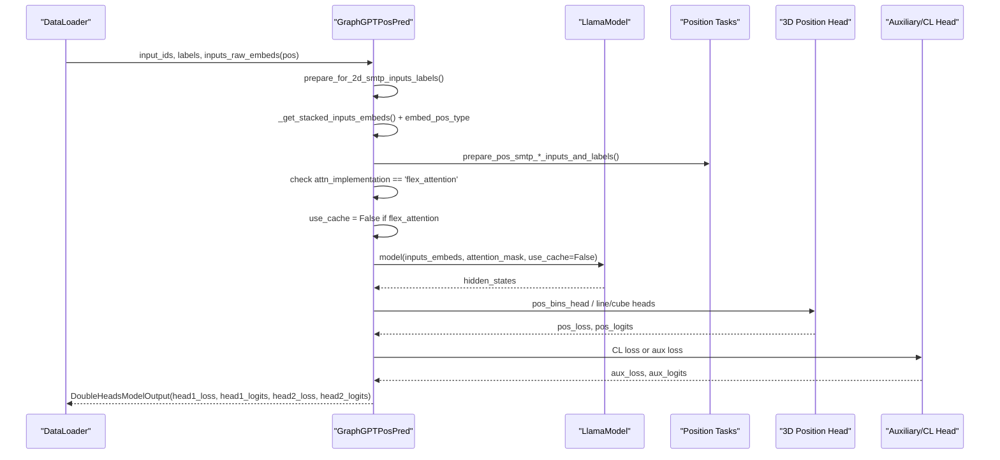
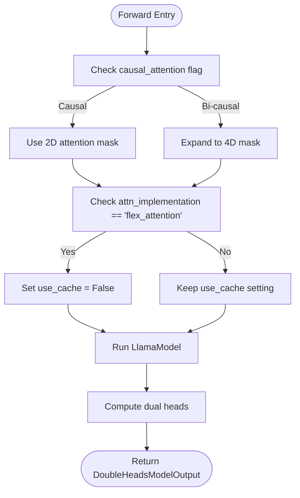
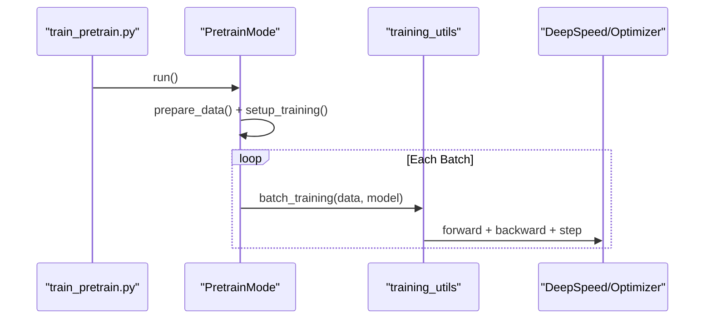
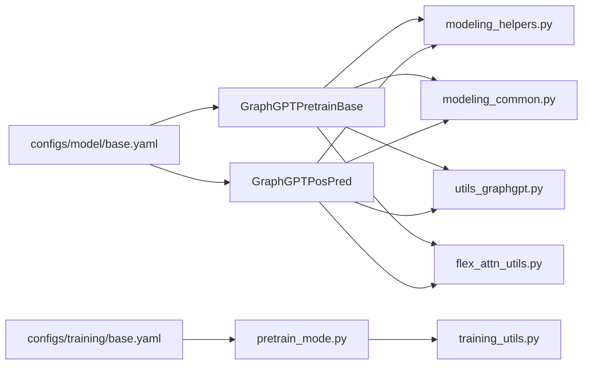

# Pre-training Model Architecture

<cite>
**Referenced Files in This Document**
- [modeling_pretrain.py](file://src/models/graphgpt/modeling_pretrain.py)
- [configuration_graphgpt.py](file://src/models/graphgpt/configuration_graphgpt.py)
- [modeling_common.py](file://src/models/graphgpt/modeling_common.py)
- [modeling_helpers.py](file://src/models/graphgpt/modeling_helpers.py)
- [utils_graphgpt.py](file://src/models/graphgpt/utils_graphgpt.py)
- [flex_attn_utils.py](file://src/utils/flex_attn_utils.py)
- [modeling_finetune.py](file://src/models/graphgpt/modeling_finetune.py)
- [base.yaml](file://configs/model/base.yaml)
- [base.yaml](file://configs/training/base.yaml)
- [pretrain_mode.py](file://src/training/pretrain_mode.py)
- [training_utils.py](file://src/utils/training_utils.py)
- [train_pretrain.py](file://examples/train_pretrain.py)
</cite>

## Update Summary
**Changes Made**
- Updated Attention Mechanisms and Masking section to document the explicit caching disablement for flex_attention implementations
- Added new subsection on torch.compile compatibility considerations
- Enhanced troubleshooting guide with flex_attention-specific guidance
- Updated performance considerations to include caching implications

## Table of Contents
1. [Introduction](#introduction)
2. [Project Structure](#project-structure)
3. [Core Components](#core-components)
4. [Architecture Overview](#architecture-overview)
5. [Detailed Component Analysis](#detailed-component-analysis)
6. [Dependency Analysis](#dependency-analysis)
7. [Performance Considerations](#performance-considerations)
8. [Troubleshooting Guide](#troubleshooting-guide)
9. [Conclusion](#conclusion)
10. [Appendices](#appendices)

## Introduction
This document explains the Graph-GPT pre-training model architectures with a focus on dual-head designs and position-level pre-training components. It details the GraphGPTPretrainBase encoder-decoder structure, attention adaptations for graph sequences, and the dual-head configuration enabling simultaneous next-token prediction and discriminative contrastive objectives. It also documents model initialization, parameter sharing strategies, computational efficiency optimizations, and practical guidance for scaling, mixed precision training, and distributed training.

**Updated** Added explicit caching disablement for flex_attention implementations to prevent symbolic batch-dimension mismatches during torch.compile.

## Project Structure
The pre-training architecture is implemented in the GraphGPT module and orchestrated by the training pipeline:
- Model definitions and shared components live under src/models/graphgpt
- Configuration groups define model, training, and generation settings
- Training orchestration is handled by src/training/pretrain_mode.py
- Example entry point is examples/train_pretrain.py

**Diagram sources**
- [modeling_pretrain.py:57-266](file://src/models/graphgpt/modeling_pretrain.py#L57-L266)
- [modeling_pretrain.py:269-690](file://src/models/graphgpt/modeling_pretrain.py#L269-L690)
- [modeling_common.py:54-100](file://src/models/graphgpt/modeling_common.py#L54-L100)
- [modeling_helpers.py:38-65](file://src/models/graphgpt/modeling_helpers.py#L38-L65)
- [utils_graphgpt.py:176-194](file://src/models/graphgpt/utils_graphgpt.py#L176-L194)
- [flex_attn_utils.py:161-205](file://src/utils/flex_attn_utils.py#L161-L205)
- [base.yaml](file://configs/model/base.yaml)
- [base.yaml](file://configs/training/base.yaml)
- [pretrain_mode.py:48-76](file://src/training/pretrain_mode.py#L48-L76)
- [training_utils.py:7-96](file://src/utils/training_utils.py#L7-L96)
- [train_pretrain.py:12-19](file://examples/train_pretrain.py#L12-L19)

**Section sources**
- [modeling_pretrain.py:57-266](file://src/models/graphgpt/modeling_pretrain.py#L57-L266)
- [modeling_pretrain.py:269-690](file://src/models/graphgpt/modeling_pretrain.py#L269-L690)
- [modeling_common.py:54-100](file://src/models/graphgpt/modeling_common.py#L54-L100)
- [modeling_helpers.py:38-65](file://src/models/graphgpt/modeling_helpers.py#L38-L65)
- [utils_graphgpt.py:176-194](file://src/models/graphgpt/utils_graphgpt.py#L176-L194)
- [flex_attn_utils.py:161-205](file://src/utils/flex_attn_utils.py#L161-L205)
- [base.yaml](file://configs/model/base.yaml)
- [base.yaml](file://configs/training/base.yaml)
- [pretrain_mode.py:48-76](file://src/training/pretrain_mode.py#L48-L76)
- [training_utils.py:7-96](file://src/utils/training_utils.py#L7-L96)
- [train_pretrain.py:12-19](file://examples/train_pretrain.py#L12-L19)

## Core Components
- Dual-head outputs: DoubleHeadsModelOutput encapsulates head1_loss/head1_logits and head2_loss/head2_logits for the two pre-training objectives.
- Encoder-decoder backbone: LlamaForCausalLM-based architecture with optional dropout-enabled LlamaModel wrapper via utils_graphgpt.
- Generative head: Next-token prediction (NTP/MTP/SMTP) with optional multi-token projection and focal loss support.
- Discriminative head: Contrastive loss (CL) computed from sequence-level representations.
- Position-level pre-training head: GraphGPTPosPred supports 2D/3D position prediction with configurable tokenization schemes (line/cube/mix), positional binning, and optional denoising.

Key implementation highlights:
- Initialization helpers: init_backbone, init_embed_dropout, init_stacked_feat_agg
- Input preparation: stacked feature aggregation, positional type embeddings, and raw embedding fusion
- Attention masking: causal/bi-causal mask handling and 4D mask expansion
- **Updated** Caching compatibility: Explicit caching disablement for flex_attention implementations during torch.compile
- Loss computation: cross-entropy with label smoothing/focal loss, contrastive loss across devices

**Section sources**
- [modeling_common.py:54-100](file://src/models/graphgpt/modeling_common.py#L54-L100)
- [modeling_common.py:160-170](file://src/models/graphgpt/modeling_common.py#L160-L170)
- [modeling_helpers.py:89-114](file://src/models/graphgpt/modeling_helpers.py#L89-L114)
- [modeling_helpers.py:38-65](file://src/models/graphgpt/modeling_helpers.py#L38-L65)
- [modeling_helpers.py:145-177](file://src/models/graphgpt/modeling_helpers.py#L145-L177)
- [modeling_helpers.py:201-227](file://src/models/graphgpt/modeling_helpers.py#L201-L227)

## Architecture Overview
The dual-head design shares the same transformer backbone while computing two complementary objectives:
- Head 1: Generative pre-training (e.g., next-token prediction, multi-token prediction, or SMTP)
- Head 2: Discriminative pre-training (contrastive loss) or auxiliary position-level objectives

**Diagram sources**
- [modeling_pretrain.py:57-266](file://src/models/graphgpt/modeling_pretrain.py#L57-L266)
- [modeling_pretrain.py:269-690](file://src/models/graphgpt/modeling_pretrain.py#L269-L690)
- [modeling_common.py:105-142](file://src/models/graphgpt/modeling_common.py#L105-L142)
- [utils_graphgpt.py:176-194](file://src/models/graphgpt/utils_graphgpt.py#L176-L194)
- [flex_attn_utils.py:161-205](file://src/utils/flex_attn_utils.py#L161-L205)

## Detailed Component Analysis

### GraphGPTPretrainBase: Generative + Discriminative Dual Heads
- Backbone: LlamaForCausalLM with optional dropout-enabled LlamaModel via init_backbone
- Inputs: Stacked token embeddings with optional raw embedding fusion and positional type addition
- Generative head: lm_head over hidden states; optional next-n-token projection; optional focal loss
- Discriminative head: CL loss computed from pooled representations across devices
- Dual-head output: head1_loss/head1_logits for generative objective; head2_loss/head2_logits for discriminative objective

Implementation notes:
- prepare_inputs_embeds integrates raw embeddings with token embeddings and applies dropout and normalization
- forward resolves attention masks, runs the backbone, and computes both heads' losses/logits
- Parameter sharing: the backbone and attention layers are shared between heads
- **Updated** Caching compatibility: Explicit caching disablement when attention implementation is set to 'flex_attention' to prevent torch.compile symbolic batch-dimension mismatches

**Diagram sources**
- [modeling_pretrain.py:152-266](file://src/models/graphgpt/modeling_pretrain.py#L152-L266)
- [modeling_helpers.py:362-393](file://src/models/graphgpt/modeling_helpers.py#L362-L393)
- [modeling_helpers.py:201-227](file://src/models/graphgpt/modeling_helpers.py#L201-L227)

**Section sources**
- [modeling_pretrain.py:57-118](file://src/models/graphgpt/modeling_pretrain.py#L57-L118)
- [modeling_pretrain.py:119-151](file://src/models/graphgpt/modeling_pretrain.py#L119-L151)
- [modeling_pretrain.py:152-266](file://src/models/graphgpt/modeling_pretrain.py#L152-L266)
- [modeling_helpers.py:89-114](file://src/models/graphgpt/modeling_helpers.py#L89-L114)
- [modeling_helpers.py:362-393](file://src/models/graphgpt/modeling_helpers.py#L362-L393)
- [modeling_helpers.py:145-177](file://src/models/graphgpt/modeling_helpers.py#L145-L177)

### GraphGPTPosPred: Position-Level Pre-training Dual Heads
- Backbone: Same Llama-based architecture with dropout support
- Inputs: Tokenized graph tokens + positional type embeddings + optional noisy position projections
- Position-level objectives:
  - 2D-SMTP: masked node/edge attributes with optional replacement noise
  - 3D-SMTP: line-token, cube-token, or mix-token schemes with positional binning and optional denoising
- Discriminative head: Optional CL loss integrated with position-level auxiliary loss

**Diagram sources**
- [modeling_pretrain.py:269-690](file://src/models/graphgpt/modeling_pretrain.py#L269-L690)
- [modeling_helpers.py:399-450](file://src/models/graphgpt/modeling_helpers.py#L399-L450)
- [modeling_helpers.py:639-756](file://src/models/graphgpt/modeling_helpers.py#L639-L756)
- [modeling_helpers.py:758-843](file://src/models/graphgpt/modeling_helpers.py#L758-L843)
- [modeling_helpers.py:846-922](file://src/models/graphgpt/modeling_helpers.py#L846-L922)

**Section sources**
- [modeling_pretrain.py:269-352](file://src/models/graphgpt/modeling_pretrain.py#L269-L352)
- [modeling_pretrain.py:354-472](file://src/models/graphgpt/modeling_pretrain.py#L354-L472)
- [modeling_pretrain.py:473-690](file://src/models/graphgpt/modeling_pretrain.py#L473-L690)
- [modeling_helpers.py:399-450](file://src/models/graphgpt/modeling_helpers.py#L399-L450)
- [modeling_helpers.py:639-756](file://src/models/graphgpt/modeling_helpers.py#L639-L756)
- [modeling_helpers.py:758-843](file://src/models/graphgpt/modeling_helpers.py#L758-L843)
- [modeling_helpers.py:846-922](file://src/models/graphgpt/modeling_helpers.py#L846-L922)

### Attention Mechanisms and Masking for Graph Sequences
- Attention mask utilities adapt masks for 2D/3D scenarios and bi-causal attention when configured
- 4D mask expansion supports packed sequences
- Positional embeddings and type embeddings are fused into inputs for position-level tasks
- **Updated** Caching compatibility: When attention implementation is set to 'flex_attention', caching is automatically disabled to prevent torch.compile symbolic batch-dimension mismatches during inductor lowering

**Diagram sources**
- [modeling_helpers.py:38-65](file://src/models/graphgpt/modeling_helpers.py#L38-L65)
- [modeling_helpers.py:51-64](file://src/models/graphgpt/modeling_helpers.py#L51-L64)
- [utils_graphgpt.py:176-194](file://src/models/graphgpt/utils_graphgpt.py#L176-L194)
- [modeling_pretrain.py:205-209](file://src/models/graphgpt/modeling_pretrain.py#L205-L209)
- [modeling_pretrain.py:597-601](file://src/models/graphgpt/modeling_pretrain.py#L597-L601)

**Section sources**
- [modeling_helpers.py:38-65](file://src/models/graphgpt/modeling_helpers.py#L38-L65)
- [modeling_helpers.py:51-64](file://src/models/graphgpt/modeling_helpers.py#L51-L64)
- [utils_graphgpt.py:176-194](file://src/models/graphgpt/utils_graphgpt.py#L176-L194)
- [modeling_pretrain.py:205-209](file://src/models/graphgpt/modeling_pretrain.py#L205-L209)
- [modeling_pretrain.py:597-601](file://src/models/graphgpt/modeling_pretrain.py#L597-L601)

### Implementation Details: Initialization, Parameter Sharing, and Efficiency
- Initialization:
  - init_backbone selects LlamaModel with or without dropout based on config
  - init_embed_dropout sets up embedding dropout
  - init_stacked_feat_agg creates StackedFeatAggregation when stack_method is short/long
- Parameter sharing:
  - Both heads share the same LlamaModel backbone and token embeddings
  - Optional weight tying for position token embeddings in cube-token schemes
- Computational efficiency:
  - Mixed precision training via autocast and GradScaler
  - Optional focal loss and label smoothing to stabilize training
  - Token-level vs sample-level loss weighting for different objectives
- **Updated** Caching compatibility:
  - Automatic caching disablement for flex_attention implementations during torch.compile
  - Prevents symbolic batch-dimension mismatches in DynamicCache during inductor lowering
  - flex_decoding assertions (Bq == Bkv) are avoided by disabling caching

**Section sources**
- [modeling_common.py:160-170](file://src/models/graphgpt/modeling_common.py#L160-L170)
- [modeling_common.py:172-184](file://src/models/graphgpt/modeling_common.py#L172-L184)
- [modeling_helpers.py:145-177](file://src/models/graphgpt/modeling_helpers.py#L145-L177)
- [training_utils.py:53-86](file://src/utils/training_utils.py#L53-L86)

### Practical Examples: Model Construction, Forward Pass, and Gradient Flow
- Model construction:
  - Use PretrainMode to load configs and instantiate GraphGPTPretrainBase or GraphGPTPosPred
  - Convert to legacy config and initialize tokenizer/vocabulary
- Forward pass:
  - training_utils.batch_training invokes model.forward with input_ids, attention_mask, labels, and optional inputs_raw_embeds
  - Outputs are DoubleHeadsModelOutput with head1_loss/head2_loss
  - **Updated** When attention implementation is 'flex_attention', use_cache is automatically set to False
- Gradient flow:
  - With DeepSpeed: model.backward(loss) followed by model.step()
  - Without DeepSpeed: autocast forward, scaled backward, gradient clipping, optimizer step

**Diagram sources**
- [train_pretrain.py:12-19](file://examples/train_pretrain.py#L12-L19)
- [pretrain_mode.py:412-498](file://src/training/pretrain_mode.py#L412-L498)
- [training_utils.py:7-96](file://src/utils/training_utils.py#L7-L96)

**Section sources**
- [pretrain_mode.py:48-76](file://src/training/pretrain_mode.py#L48-L76)
- [pretrain_mode.py:218-227](file://src/training/pretrain_mode.py#L218-L227)
- [training_utils.py:7-96](file://src/utils/training_utils.py#L7-L96)

## Dependency Analysis
- Model-to-helper dependencies:
  - GraphGPTPretrainBase and GraphGPTPosPred depend on modeling_helpers for input preparation, masking, and loss computation
  - Both models rely on DoubleHeadsModelOutput for unified output structure
- Backbone customization:
  - utils_graphgpt provides dropout-enabled LlamaModel/LlamaDecoderLayer variants
- Configuration-driven behavior:
  - base.yaml controls model size, attention type, dropout, and pre-training heads
  - training/base.yaml governs optimizer, scheduling, and mixed precision settings
- **Updated** Flex attention integration:
  - flex_attn_utils provides BlockMask creation and sparse mask utilities
  - Automatic caching disablement ensures compatibility with torch.compile

**Diagram sources**
- [base.yaml](file://configs/model/base.yaml)
- [base.yaml](file://configs/training/base.yaml)
- [modeling_pretrain.py:57-266](file://src/models/graphgpt/modeling_pretrain.py#L57-L266)
- [modeling_pretrain.py:269-690](file://src/models/graphgpt/modeling_pretrain.py#L269-L690)
- [modeling_helpers.py:38-65](file://src/models/graphgpt/modeling_helpers.py#L38-L65)
- [modeling_common.py:54-100](file://src/models/graphgpt/modeling_common.py#L54-L100)
- [utils_graphgpt.py:176-194](file://src/models/graphgpt/utils_graphgpt.py#L176-L194)
- [flex_attn_utils.py:161-205](file://src/utils/flex_attn_utils.py#L161-L205)
- [pretrain_mode.py:48-76](file://src/training/pretrain_mode.py#L48-L76)
- [training_utils.py:7-96](file://src/utils/training_utils.py#L7-L96)

**Section sources**
- [base.yaml](file://configs/model/base.yaml)
- [base.yaml](file://configs/training/base.yaml)
- [modeling_pretrain.py:57-266](file://src/models/graphgpt/modeling_pretrain.py#L57-L266)
- [modeling_pretrain.py:269-690](file://src/models/graphgpt/modeling_pretrain.py#L269-L690)
- [modeling_helpers.py:38-65](file://src/models/graphgpt/modeling_helpers.py#L38-L65)
- [modeling_common.py:54-100](file://src/models/graphgpt/modeling_common.py#L54-L100)
- [utils_graphgpt.py:176-194](file://src/models/graphgpt/utils_graphgpt.py#L176-L194)
- [flex_attn_utils.py:161-205](file://src/utils/flex_attn_utils.py#L161-L205)
- [pretrain_mode.py:48-76](file://src/training/pretrain_mode.py#L48-L76)
- [training_utils.py:7-96](file://src/utils/training_utils.py#L7-L96)

## Performance Considerations
- Mixed precision training:
  - Autocast with torch.float16 and GradScaler reduce memory footprint and improve throughput
  - Focal loss and label smoothing can stabilize convergence for imbalanced pre-training tasks
- Memory and compute optimizations:
  - next_n_token projection reduces repeated head application overhead
  - Token-level vs sample-level weighting balances compute and signal strength
  - Dropout-enabled backbone reduces overfitting and can improve generalization
- Distributed training:
  - World size-aware contrastive loss computation across devices
  - DeepSpeed integration for gradient accumulation and ZeRO optimizations
- **Updated** Caching and compilation considerations:
  - Automatic caching disablement for flex_attention prevents torch.compile symbolic dimension mismatches
  - Flex attention with torch.compile requires use_cache=False to avoid DynamicCache issues
  - flex_decoding assertions (Bq == Bkv) are prevented by disabling caching during compilation

## Troubleshooting Guide
- Contrastive loss computation:
  - Ensure pad_token_id is set and sequence lengths are correctly inferred for pooled representations
- Attention masking:
  - Verify causal_attention flag and mask expansion for 2D/3D scenarios
  - **Updated** Check that flex_attention implementations automatically disable caching
- Position-level tasks:
  - Confirm pos_type and node_idx alignment; check sample-level mask logic for zero-position molecules
- Mixed precision:
  - Use autocast for forward pass and ensure proper scaler updates; clip gradients when necessary
- **Updated** Flex attention compatibility:
  - When using attention implementation 'flex_attention', caching is automatically disabled
  - This prevents torch.compile symbolic batch-dimension mismatches during inductor lowering
  - flex_decoding assertion failures (Bq == Bkv) are avoided by use_cache=False

**Section sources**
- [modeling_helpers.py:201-227](file://src/models/graphgpt/modeling_helpers.py#L201-L227)
- [modeling_helpers.py:38-65](file://src/models/graphgpt/modeling_helpers.py#L38-L65)
- [training_utils.py:53-86](file://src/utils/training_utils.py#L53-L86)
- [modeling_pretrain.py:205-209](file://src/models/graphgpt/modeling_pretrain.py#L205-L209)
- [modeling_pretrain.py:597-601](file://src/models/graphgpt/modeling_pretrain.py#L597-L601)

## Conclusion
Graph-GPT's pre-training architecture leverages a shared transformer backbone with dual-head outputs to jointly optimize next-token prediction and discriminative objectives. The GraphGPTPosPred head extends this design to position-level pre-training with flexible tokenization schemes and optional denoising. The codebase provides robust initialization, masking, and loss computation utilities, along with practical training integrations for mixed precision and distributed environments.

**Updated** Recent improvements include explicit caching disablement for flex_attention implementations to ensure compatibility with torch.compile, preventing symbolic batch-dimension mismatches and flex_decoding assertion failures.

## Appendices

### Configuration Highlights for Dual-Head Pre-training
- Generative head settings: next_n_token, use_generative, focal_gamma, smtp_inside
- Discriminative head settings: use_discriminative, ratio_dis, pad_token_id
- Position-level head settings: pt_problem_type, pt_num_bins, apply_denoise, loss_agg, pt_pos_range
- **Updated** Attention implementation settings: _attn_implementation controls flex_attention vs SDPA path

**Section sources**
- [configuration_graphgpt.py:56-87](file://src/models/graphgpt/configuration_graphgpt.py#L56-L87)
- [base.yaml](file://configs/model/base.yaml)
- [configuration_graphgpt.py:243](file://src/models/graphgpt/configuration_graphgpt.py#L243)
