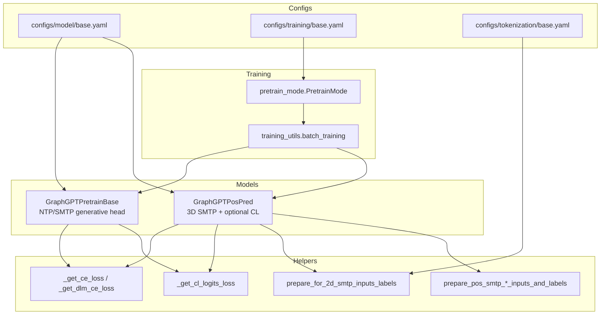
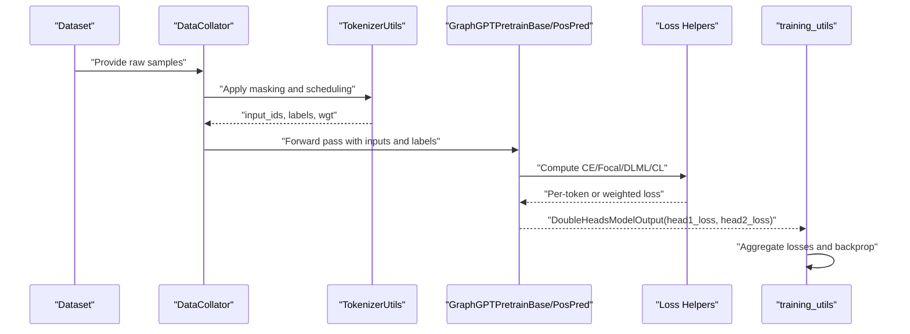
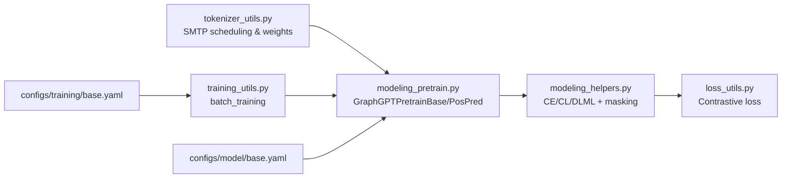

# Pre-training Objectives

<cite>
**Referenced Files in This Document**
- [modeling_pretrain.py](file://src/models/graphgpt/modeling_pretrain.py)
- [modeling_helpers.py](file://src/models/graphgpt/modeling_helpers.py)
- [loss_utils.py](file://src/utils/loss_utils.py)
- [pretrain_mode.py](file://src/training/pretrain_mode.py)
- [training_utils.py](file://src/utils/training_utils.py)
- [base.yaml](file://configs/model/base.yaml)
- [base.yaml](file://configs/training/base.yaml)
- [base.yaml](file://configs/tokenization/base.yaml)
- [tokenizer_utils.py](file://src/utils/tokenizer_utils.py)
</cite>

## Table of Contents
1. [Introduction](#introduction)
2. [Project Structure](#project-structure)
3. [Core Components](#core-components)
4. [Architecture Overview](#architecture-overview)
5. [Detailed Component Analysis](#detailed-component-analysis)
6. [Dependency Analysis](#dependency-analysis)
7. [Performance Considerations](#performance-considerations)
8. [Troubleshooting Guide](#troubleshooting-guide)
9. [Conclusion](#conclusion)
10. [Appendices](#appendices)

## Introduction
This document explains the Graph-GPT pre-training objectives with a focus on Next-token Prediction (NTP) and Scheduled Masked-token Prediction (SMTP). It covers the mathematical formulations, implementation details, and theoretical foundations of each objective, how they enable autoregressive sequence modeling for graph data, and how SMTP introduces controlled masking strategies for robust pre-training. We also connect the objectives to diffusion language model principles, describe objective-specific hyperparameters and scheduling strategies, and explain multi-objective training and custom objective development.

## Project Structure
The pre-training objectives are implemented across model classes, helper utilities, and training orchestration. Key locations:
- Objective computation and model heads: modeling_pretrain.py
- Loss functions and label preparation helpers: modeling_helpers.py
- Contrastive loss and distributed gathering utilities: loss_utils.py
- Training loop and multi-head aggregation: training_utils.py and pretrain_mode.py
- Configuration of objective hyperparameters: configs/model/base.yaml and configs/training/base.yaml
- Tokenization and scheduling for SMTP: src/utils/tokenizer_utils.py and configs/tokenization/base.yaml

**Diagram sources**
- [modeling_pretrain.py:57-266](file://src/models/graphgpt/modeling_pretrain.py#L57-L266)
- [modeling_pretrain.py:269-691](file://src/models/graphgpt/modeling_pretrain.py#L269-L691)
- [modeling_helpers.py:145-227](file://src/models/graphgpt/modeling_helpers.py#L145-L227)
- [modeling_helpers.py:399-449](file://src/models/graphgpt/modeling_helpers.py#L399-L449)
- [modeling_helpers.py:639-944](file://src/models/graphgpt/modeling_helpers.py#L639-L944)
- [loss_utils.py:107-137](file://src/utils/loss_utils.py#L107-L137)
- [training_utils.py:7-96](file://src/utils/training_utils.py#L7-L96)
- [pretrain_mode.py:48-75](file://src/training/pretrain_mode.py#L48-L75)
- [base.yaml:74-127](file://configs/model/base.yaml#L74-L127)
- [base.yaml:10-78](file://configs/training/base.yaml#L10-L78)
- [base.yaml:1-117](file://configs/tokenization/base.yaml#L1-L117)

**Section sources**
- [modeling_pretrain.py:57-266](file://src/models/graphgpt/modeling_pretrain.py#L57-L266)
- [modeling_helpers.py:145-227](file://src/models/graphgpt/modeling_helpers.py#L145-L227)
- [training_utils.py:7-96](file://src/utils/training_utils.py#L7-L96)
- [pretrain_mode.py:48-75](file://src/training/pretrain_mode.py#L48-L75)
- [base.yaml:74-127](file://configs/model/base.yaml#L74-L127)
- [base.yaml:10-78](file://configs/training/base.yaml#L10-L78)
- [base.yaml:1-117](file://configs/tokenization/base.yaml#L1-L117)

## Core Components
- Generative heads (NTP/SMTP):
  - GraphGPTPretrainBase implements a dual-head setup with a generative head (lm_head) and optional discriminative head (CL). The generative head computes cross-entropy over next-token predictions with optional focal loss and label smoothing. It supports multi-token prediction via a learned projection.
  - GraphGPTPosPred specializes in 3D position pre-training with line/cube/mix tokenization and optional denoising, and optionally adds CL loss.
- Loss functions:
  - Standard cross-entropy and focal loss variants for token-level classification.
  - Discrete Diffusion Language (DLML) weighted CE for token-level weighting in NTP/SMTP.
  - Contrastive loss with distributed gather for CL objective.
- Label preparation:
  - Per-sequence and per-feature-level masking and label extraction for stacked features.
  - 2D SMTP masking and replacement strategies.
  - 3D SMTP masking with polynomial/cosine/arccos scheduling and coordinate-level masking.
- Training orchestration:
  - Multi-head aggregation of main and auxiliary losses, gradient computation, and optimizer steps.

**Section sources**
- [modeling_pretrain.py:57-266](file://src/models/graphgpt/modeling_pretrain.py#L57-L266)
- [modeling_pretrain.py:269-691](file://src/models/graphgpt/modeling_pretrain.py#L269-L691)
- [modeling_helpers.py:145-227](file://src/models/graphgpt/modeling_helpers.py#L145-L227)
- [modeling_helpers.py:399-449](file://src/models/graphgpt/modeling_helpers.py#L399-L449)
- [modeling_helpers.py:639-944](file://src/models/graphgpt/modeling_helpers.py#L639-L944)
- [loss_utils.py:107-137](file://src/utils/loss_utils.py#L107-L137)
- [training_utils.py:7-96](file://src/utils/training_utils.py#L7-L96)

## Architecture Overview
The pre-training pipeline composes tokenization, masking, model forward pass, and loss computation. For NTP/SMTP, the model predicts next tokens autoregressively; for 3D SMTP, it reconstructs discretized positions or denoises noisy coordinates.

**Diagram sources**
- [pretrain_mode.py:327-333](file://src/training/pretrain_mode.py#L327-L333)
- [tokenizer_utils.py:250-303](file://src/utils/tokenizer_utils.py#L250-L303)
- [modeling_pretrain.py:152-266](file://src/models/graphgpt/modeling_pretrain.py#L152-L266)
- [modeling_helpers.py:145-227](file://src/models/graphgpt/modeling_helpers.py#L145-L227)
- [training_utils.py:7-96](file://src/utils/training_utils.py#L7-L96)

## Detailed Component Analysis

### Next-token Prediction (NTP)
NTP trains the model to predict the next token(s) given the previous context, enabling autoregressive sequence modeling for graph-structured data.

- Mathematical formulation:
  - Standard cross-entropy loss over next-token predictions:
    $$
    \mathcal{L}_{\text{CE}} = -\frac{1}{N} \sum_{i=1}^{N} \log p_{\theta}(y_i \mid x_{<i})
    $$
  - Focal loss variant for long-tail distributions:
    $$
    \mathcal{L}_{\text{Focal}} = -\frac{1}{N} \sum_{i=1}^{N} \alpha_i (1 - p_{\theta}(y_i \mid x_{<i}))^\gamma \log p_{\theta}(y_i \mid x_{<i})
    $$
  - Discrete Diffusion Language (DLML) weighted CE for token-level weighting:
    $$
    \mathcal{L}_{\text{DLML}} = \frac{\sum_{i} w_i \cdot \ell_{\text{CE}}(y_i, \hat{y}_i)}{\sum_{i} w_i}
    $$
    where $w_i$ is a per-token weight derived from scheduling.

- Implementation highlights:
  - Generative head projection for multi-token prediction: [modeling_pretrain.py:88-95](file://src/models/graphgpt/modeling_pretrain.py#L88-L95)
  - Cross-entropy and focal loss wrappers: [_get_ce_loss:145-177](file://src/models/graphgpt/modeling_helpers.py#L145-L177)
  - DLML weighted CE: [_get_dlm_ce_loss:180-198](file://src/models/graphgpt/modeling_helpers.py#L180-L198)
  - Label preparation for stacked features: [prepare_for_stacked_feat_labels:362-393](file://src/models/graphgpt/modeling_helpers.py#L362-L393)

- Objective-specific hyperparameters:
  - next_n_token: number of next tokens to predict jointly
  - focal_gamma: gamma for focal loss
  - label_smoothing: label smoothing coefficient
  - use_generative/use_discriminative: enable/disable objectives

- Scheduling and weighting:
  - Token-level weights for NTP/SMTP are computed during tokenization and passed to the model for DLML-style averaging.

- Relationship to diffusion language models:
  - The DLML weighting aligns with diffusion schedules by emphasizing informative tokens and downweighting easy-to-predict ones, stabilizing training dynamics.

- Concrete examples from codebase:
  - Loss computation paths: [modeling_pretrain.py:220-237](file://src/models/graphgpt/modeling_pretrain.py#L220-L237)
  - Label preparation path: [modeling_helpers.py:362-393](file://src/models/graphgpt/modeling_helpers.py#L362-L393)
  - Tokenization scheduling and weights: [tokenizer_utils.py:250-303](file://src/utils/tokenizer_utils.py#L250-L303)

**Section sources**
- [modeling_pretrain.py:88-95](file://src/models/graphgpt/modeling_pretrain.py#L88-L95)
- [modeling_helpers.py:145-177](file://src/models/graphgpt/modeling_helpers.py#L145-L177)
- [modeling_helpers.py:180-198](file://src/models/graphgpt/modeling_helpers.py#L180-L198)
- [modeling_helpers.py:362-393](file://src/models/graphgpt/modeling_helpers.py#L362-L393)
- [tokenizer_utils.py:250-303](file://src/utils/tokenizer_utils.py#L250-L303)

### Scheduled Masked-token Prediction (SMTP)
SMTP extends masked-language-modeling to graph-structured tokens with controlled masking schedules and optional noise injection. It supports 2D (node/edge attributes) and 3D (positions) variants.

- Mathematical formulation:
  - Token-level CE with optional label smoothing and focal loss.
  - Scheduled masking ratio $\alpha_t$ controlled by a power schedule:
    $$
    \alpha_t = 1 - T(t)^p
    $$
    where $T(t)$ is uniformly sampled and $p$ is the scheduler power. Cosine and arccosine schedules are also supported.
  - Optional token replacement (noise injection) with Gaussian shifts:
    $$
    x_{\text{rnd}} = (x + \epsilon) \bmod V,\quad \epsilon \sim \mathcal{N}(0, \sigma^2)
    $$

- Implementation highlights:
  - 2D SMTP masking and replacement: [prepare_for_2d_smtp_inputs_labels:399-449](file://src/models/graphgpt/modeling_helpers.py#L399-L449)
  - 3D SMTP masking with polynomial/cosine/arccos scheduling: [_preprocess_pos_smtp_masks:925-944](file://src/models/graphgpt/modeling_helpers.py#L925-L944)
  - Line/cube/mix tokenization and label creation: [prepare_pos_smtp_line_token_inputs_and_labels:639-689](file://src/models/graphgpt/modeling_helpers.py#L639-L689), [prepare_pos_smtp_cube_token_inputs_and_labels:758-795](file://src/models/graphgpt/modeling_helpers.py#L758-L795), [prepare_pos_smtp_mix_token_inputs_and_labels:846-922](file://src/models/graphgpt/modeling_helpers.py#L846-L922)
  - Denoising targets: optional reconstruction of clean coordinates from noisy inputs.

- Objective-specific hyperparameters:
  - smtp_2d_rate/smtp_2d_replace_rate: 2D masking and replacement rates
  - smtp_3d_power/smtp_3d_noise_scale: 3D masking scheduler and noise scale
  - coord_lvl_mask: mask at coordinate level for 3D
  - num_bins/num_bins_line/num_bins_cube: discretization bins
  - apply_denoise: use clean coords as targets for unmasked noisy positions
  - loss_agg: token-lvl vs sample-lvl aggregation

- Scheduling strategies:
  - Polynomial: $p > 0$, cosine: $p = -1$, arccosine: $p = -2$
  - Tokenization schedules are applied per sample/node/coordinate depending on the task.

- Concrete examples from codebase:
  - 2D masking and replacement: [modeling_helpers.py:399-449](file://src/models/graphgpt/modeling_helpers.py#L399-L449)
  - 3D masking and tokenization: [modeling_helpers.py:639-795](file://src/models/graphgpt/modeling_helpers.py#L639-L795)
  - Forward pass integrating SMTP: [modeling_pretrain.py:175-190](file://src/models/graphgpt/modeling_pretrain.py#L175-L190), [modeling_pretrain.py:503-533](file://src/models/graphgpt/modeling_pretrain.py#L503-L533)

**Section sources**
- [modeling_helpers.py:399-449](file://src/models/graphgpt/modeling_helpers.py#L399-L449)
- [modeling_helpers.py:639-795](file://src/models/graphgpt/modeling_helpers.py#L639-L795)
- [modeling_helpers.py:846-922](file://src/models/graphgpt/modeling_helpers.py#L846-L922)
- [modeling_helpers.py:925-944](file://src/models/graphgpt/modeling_helpers.py#L925-L944)
- [modeling_pretrain.py:175-190](file://src/models/graphgpt/modeling_pretrain.py#L175-L190)
- [modeling_pretrain.py:503-533](file://src/models/graphgpt/modeling_pretrain.py#L503-L533)

### Relationship to Diffusion Language Model Principles
- Token-level weighting (DLML) mirrors diffusion schedules by assigning higher weights to tokens that are harder to predict, aligning with the intuition that informative tokens carry more signal.
- Scheduled masking (SMTP) mimics iterative denoising procedures by gradually increasing the fraction of masked tokens according to a schedule, stabilizing training and encouraging robust feature learning.

[No sources needed since this section provides conceptual connections]

### Multi-objective Training Scenarios
- Dual-head setup:
  - GraphGPTPretrainBase supports both generative (NTP/SMTP) and discriminative (CL) objectives simultaneously, with configurable ratios.
  - Loss aggregation: total loss equals head1_loss + head2_loss (or head1_loss alone if discriminative is disabled).
- Position pre-training:
  - GraphGPTPosPred can combine 2D SMTP (node/edge attributes), 3D SMTP (positions), and optional CL loss, with flexible aggregation via loss_agg.

Implementation details:
- Head selection and aggregation: [modeling_pretrain.py:252-266](file://src/models/graphgpt/modeling_pretrain.py#L252-L266)
- Training loop aggregation: [training_utils.py:38-43](file://src/utils/training_utils.py#L38-L43)

**Section sources**
- [modeling_pretrain.py:252-266](file://src/models/graphgpt/modeling_pretrain.py#L252-L266)
- [training_utils.py:38-43](file://src/utils/training_utils.py#L38-L43)

### Custom Objective Development
To add a new objective:
- Define a new head in the model class and compute logits for the new task.
- Implement a loss function in modeling_helpers.py or loss_utils.py.
- Integrate the new loss into the forward pass and aggregate with existing objectives.
- Configure hyperparameters in configs/model/base.yaml and/or configs/training/base.yaml.
- Ensure proper label preparation and masking utilities are available or extended.

[No sources needed since this section provides general guidance]

## Dependency Analysis
The following diagram shows key dependencies among components implementing NTP and SMTP.

**Diagram sources**
- [tokenizer_utils.py:250-303](file://src/utils/tokenizer_utils.py#L250-L303)
- [modeling_pretrain.py:57-266](file://src/models/graphgpt/modeling_pretrain.py#L57-L266)
- [modeling_helpers.py:145-227](file://src/models/graphgpt/modeling_helpers.py#L145-L227)
- [loss_utils.py:107-137](file://src/utils/loss_utils.py#L107-L137)
- [training_utils.py:7-96](file://src/utils/training_utils.py#L7-L96)
- [base.yaml:74-127](file://configs/model/base.yaml#L74-L127)
- [base.yaml:10-78](file://configs/training/base.yaml#L10-L78)

**Section sources**
- [modeling_pretrain.py:57-266](file://src/models/graphgpt/modeling_pretrain.py#L57-L266)
- [modeling_helpers.py:145-227](file://src/models/graphgpt/modeling_helpers.py#L145-L227)
- [loss_utils.py:107-137](file://src/utils/loss_utils.py#L107-L137)
- [training_utils.py:7-96](file://src/utils/training_utils.py#L7-L96)
- [base.yaml:74-127](file://configs/model/base.yaml#L74-L127)
- [base.yaml:10-78](file://configs/training/base.yaml#L10-L78)

## Performance Considerations
- Mixed precision and gradient accumulation are handled in the training loop to reduce memory footprint and improve throughput.
- Distributed contrastive loss uses all-gather to aggregate embeddings across devices, ensuring consistent global contrastive signals.
- Token-level weighting in DLML helps stabilize training by focusing on informative tokens.

[No sources needed since this section provides general guidance]

## Troubleshooting Guide
Common issues and remedies:
- Unstable CL loss:
  - Verify pad_token_id is set and sequence lengths are computed correctly for CL pooling.
  - Confirm world_size detection and distributed gather are functioning.
  - References: [modeling_helpers.py:201-227](file://src/models/graphgpt/modeling_helpers.py#L201-L227), [modeling_pretrain.py:108-115](file://src/models/graphgpt/modeling_pretrain.py#L108-L115)
- Poor NTP/SMTP convergence:
  - Adjust focal_gamma and label_smoothing.
  - Tune next_n_token and use_generative/use_discriminative flags.
  - References: [modeling_helpers.py:145-177](file://src/models/graphgpt/modeling_helpers.py#L145-L177), [modeling_pretrain.py:96-107](file://src/models/graphgpt/modeling_pretrain.py#L96-L107)
- 3D SMTP artifacts:
  - Increase smtp_3d_noise_scale or enable apply_denoise.
  - Adjust num_bins_line/num_bins_cube and coord_lvl_mask.
  - References: [modeling_pretrain.py:290-310](file://src/models/graphgpt/modeling_pretrain.py#L290-L310), [modeling_helpers.py:639-795](file://src/models/graphgpt/modeling_helpers.py#L639-L795)

**Section sources**
- [modeling_helpers.py:201-227](file://src/models/graphgpt/modeling_helpers.py#L201-L227)
- [modeling_helpers.py:145-177](file://src/models/graphgpt/modeling_helpers.py#L145-L177)
- [modeling_pretrain.py:96-107](file://src/models/graphgpt/modeling_pretrain.py#L96-L107)
- [modeling_pretrain.py:290-310](file://src/models/graphgpt/modeling_pretrain.py#L290-L310)
- [modeling_helpers.py:639-795](file://src/models/graphgpt/modeling_helpers.py#L639-L795)

## Conclusion
Graph-GPT’s pre-training objectives combine autoregressive NTP with scheduled SMTP to learn robust graph representations. NTP encourages contextual token prediction, while SMTP introduces controlled masking and noise injection to strengthen generalization. The framework supports multi-objective training, distributed contrastive learning, and flexible scheduling aligned with diffusion language model principles. Configurable hyperparameters and modular helpers enable practical experimentation and extension to new objectives.

[No sources needed since this section summarizes without analyzing specific files]

## Appendices

### Appendix A: Objective Hyperparameters Quick Reference
- NTP/SMTP generative head:
  - next_n_token, use_generative, use_discriminative, focal_gamma, label_smoothing
- 2D SMTP:
  - smtp_2d_rate, smtp_2d_replace_rate, global_2d_mask, sep_2d3d_inputs
- 3D SMTP:
  - smtp_3d_power, smtp_3d_noise_scale, coord_lvl_mask, num_bins_line, num_bins_cube, apply_denoise
- Aggregation:
  - loss_agg (token-lvl/sample-lvl), ratio_dis (discriminative ratio)

**Section sources**
- [base.yaml:74-127](file://configs/model/base.yaml#L74-L127)
- [base.yaml:10-78](file://configs/training/base.yaml#L10-L78)
