# Pre-training Pipeline Execution

<cite>
**Referenced Files in This Document**
- [train_pretrain.py](file://examples/train_pretrain.py)
- [pipeline.py](file://src/training/pipeline.py)
- [pretrain_mode.py](file://src/training/pretrain_mode.py)
- [mode.py](file://src/training/mode.py)
- [loader_utils.py](file://src/utils/loader_utils.py)
- [log_eval_dump_utils.py](file://src/utils/log_eval_dump_utils.py)
- [misc_utils.py](file://src/utils/misc_utils.py)
- [config.yaml](file://configs/config.yaml)
- [base.yaml (training)](file://configs/training/base.yaml)
- [base.yaml (tokenization)](file://configs/tokenization/base.yaml)
- [base.yaml (model)](file://configs/model/base.yaml)
- [ds_config2.json](file://examples/ds_config2.json)
- [pcqm4m_v2_pretrain.sh](file://examples/graph_lvl/pcqm4m_v2_pretrain.sh)
- [reddit_pretrain.sh](file://examples/toy_examples/reddit_pretrain.sh)
- [modeling_pretrain.py](file://src/models/graphgpt/modeling_pretrain.py)
</cite>

## Update Summary
**Changes Made**
- Enhanced evaluation logging integration with Weights & Biases (wandb) for better monitoring capabilities
- Added comprehensive evaluation metrics logging with improved training statistics correlation
- Implemented structured evaluation result logging with prefix-based metric naming
- Enhanced monitoring capabilities for pre-training processes through unified logging infrastructure

## Table of Contents
1. [Introduction](#introduction)
2. [Project Structure](#project-structure)
3. [Core Components](#core-components)
4. [Architecture Overview](#architecture-overview)
5. [Detailed Component Analysis](#detailed-component-analysis)
6. [Dependency Analysis](#dependency-analysis)
7. [Performance Considerations](#performance-considerations)
8. [Troubleshooting Guide](#troubleshooting-guide)
9. [Conclusion](#conclusion)
10. [Appendices](#appendices)

## Introduction
This document explains the end-to-end Graph-GPT pre-training pipeline, from configuration to checkpoint saving. It covers how the TrainingPipeline orchestrates the workflow, how PretrainMode implements pre-training specifics, and how Hydra integrates configuration. It also documents the step-by-step execution flow (data loading, model initialization, training loop management, evaluation), checkpoint and logging strategies, distributed training setup, memory optimization, fault tolerance, and practical debugging and profiling tips.

**Updated** Enhanced with improved evaluation logging capabilities through Weights & Biases integration, providing better monitoring and correlation between training statistics and evaluation metrics.

## Project Structure
The pre-training entry point is a Hydra-driven Python script that constructs a TrainingPipeline with a PretrainMode strategy. Configuration is organized via Hydra groups (tokenization, model, training, generation) and defaults. Shell scripts demonstrate command-line usage and configuration overrides for different datasets and hardware setups.

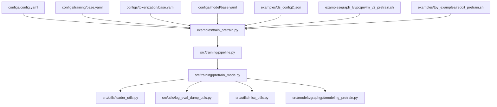

**Diagram sources**
- [train_pretrain.py:12-18](file://examples/train_pretrain.py#L12-L18)
- [pipeline.py:60-96](file://src/training/pipeline.py#L60-L96)
- [pretrain_mode.py:97-227](file://src/training/pretrain_mode.py#L97-L227)
- [loader_utils.py:318-409](file://src/utils/loader_utils.py#L318-L409)
- [log_eval_dump_utils.py:565-646](file://src/utils/log_eval_dump_utils.py#L565-L646)
- [misc_utils.py:69-122](file://src/utils/misc_utils.py#L69-L122)
- [modeling_pretrain.py:57-118](file://src/models/graphgpt/modeling_pretrain.py#L57-L118)
- [config.yaml:1-20](file://configs/config.yaml#L1-L20)
- [base.yaml (training):1-78](file://configs/training/base.yaml#L1-L78)
- [base.yaml (tokenization):1-117](file://configs/tokenization/base.yaml#L1-L117)
- [base.yaml (model):1-222](file://configs/model/base.yaml#L1-L222)
- [ds_config2.json:1-43](file://examples/ds_config2.json#L1-L43)
- [pcqm4m_v2_pretrain.sh:253-307](file://examples/graph_lvl/pcqm4m_v2_pretrain.sh#L253-L307)
- [reddit_pretrain.sh:203-253](file://examples/toy_examples/reddit_pretrain.sh#L203-L253)

**Section sources**
- [train_pretrain.py:12-18](file://examples/train_pretrain.py#L12-L18)
- [config.yaml:1-20](file://configs/config.yaml#L1-L20)
- [base.yaml (training):1-78](file://configs/training/base.yaml#L1-L78)
- [base.yaml (tokenization):1-117](file://configs/tokenization/base.yaml#L1-L117)
- [base.yaml (model):1-222](file://configs/model/base.yaml#L1-L222)
- [ds_config2.json:1-43](file://examples/ds_config2.json#L1-L43)
- [pcqm4m_v2_pretrain.sh:253-307](file://examples/graph_lvl/pcqm4m_v2_pretrain.sh#L253-L307)
- [reddit_pretrain.sh:203-253](file://examples/toy_examples/reddit_pretrain.sh#L203-L253)

## Core Components
- TrainingPipeline: Orchestrates shared setup and delegates mode-specific behavior. It extracts Hydra config, sets up distributed and DeepSpeed, initializes data and model, manages checkpoints, and runs cleanup.
- PretrainMode: Implements pre-training specifics: tokenizer/vocab building, sampler creation, schedule updates, collation, evaluation, and the training loop.
- TrainingMode: Strategy interface defining hooks for mode-specific behavior.
- Hydra configuration: Centralized via config.yaml and grouped YAMLs for tokenization, model, training, and generation.
- Utilities: Loader utilities for samplers and data loaders, logging and evaluation utilities, and checkpoint helpers.

Key responsibilities:
- Configuration extraction and distributed setup
- Data pipeline: dataset reading, tokenizer, vocab, sampler, schedule updates
- Model creation and initialization (including DeepSpeed and gradient checkpointing)
- Training loop: batching, optimization, EMA updates, logging, periodic evaluation, and checkpointing
- Evaluation: validation, test, and generation evaluation with enhanced logging integration
- Logging and checkpointing: CSV logs, TensorBoard summaries, Weights & Biases monitoring, and model checkpoints

**Updated** Enhanced evaluation logging with Weights & Biases integration for comprehensive monitoring and better correlation between training statistics and evaluation metrics.

**Section sources**
- [pipeline.py:15-96](file://src/training/pipeline.py#L15-L96)
- [pretrain_mode.py:48-266](file://src/training/pretrain_mode.py#L48-L266)
- [mode.py:5-90](file://src/training/mode.py#L5-L90)
- [loader_utils.py:318-409](file://src/utils/loader_utils.py#L318-L409)
- [log_eval_dump_utils.py:504-646](file://src/utils/log_eval_dump_utils.py#L504-L646)
- [misc_utils.py:69-122](file://src/utils/misc_utils.py#L69-L122)

## Architecture Overview
The pre-training pipeline follows a staged workflow:
1. Hydra loads configuration and passes it to the training entry point.
2. TrainingPipeline performs shared setup (distributed, DeepSpeed, config extraction).
3. PretrainMode prepares data (tokenizer, vocab, sampler, schedule), creates the model, and sets up training.
4. The training loop executes batches, updates EMA, logs metrics, evaluates periodically, and saves checkpoints.
5. Cleanup writes final artifacts and closes writers.

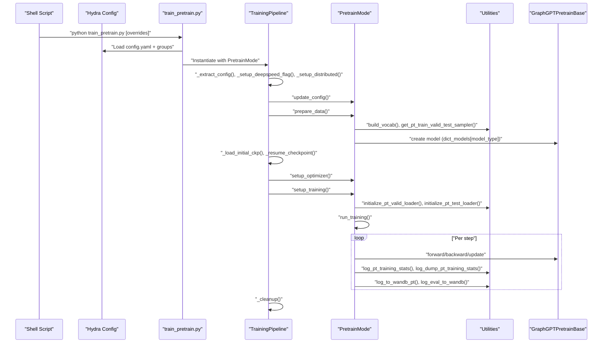

**Updated** Enhanced with Weights & Biases logging integration for comprehensive monitoring of both training and evaluation metrics.

**Diagram sources**
- [train_pretrain.py:12-18](file://examples/train_pretrain.py#L12-L18)
- [pipeline.py:60-96](file://src/training/pipeline.py#L60-L96)
- [pretrain_mode.py:81-501](file://src/training/pretrain_mode.py#L81-L501)
- [loader_utils.py:663-751](file://src/utils/loader_utils.py#L663-L751)
- [log_eval_dump_utils.py:504-646](file://src/utils/log_eval_dump_utils.py#L504-L646)
- [modeling_pretrain.py:57-118](file://src/models/graphgpt/modeling_pretrain.py#L57-L118)

## Detailed Component Analysis

### TrainingPipeline Orchestration
- Shared setup: Extracts config groups, sets DeepSpeed flag, initializes distributed environment, and initializes stacked features and embedding dimensions.
- Data preparation: Delegates to PretrainMode.prepare_data for tokenizer, vocab, sampler, schedule updates, and model config.
- Model creation: Initializes DeepSpeed if enabled, selects model class by type, enables gradient checkpointing, disables cache.
- Checkpointing: Loads initial pretrained checkpoint if provided and different from output_dir; resumes from latest checkpoint if allowed.
- Training preparation: Initializes logging, collator, evaluation loaders, TensorBoard writer, and TrainingStats.
- Training loop: Executes epochs and steps, updates EMA, logs, evaluates, and saves checkpoints.
- Cleanup: Saves final config and closes writers.

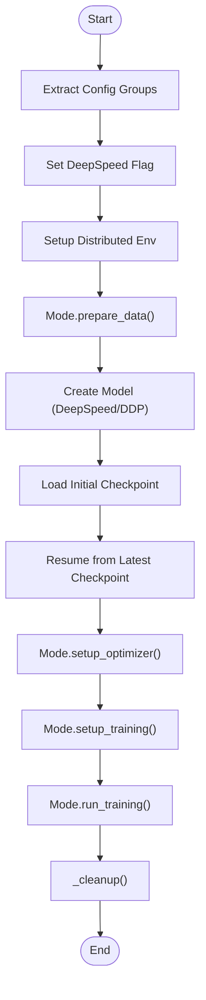

**Diagram sources**
- [pipeline.py:60-227](file://src/training/pipeline.py#L60-L227)

**Section sources**
- [pipeline.py:60-227](file://src/training/pipeline.py#L60-L227)

### PretrainMode Implementation
- update_config: Marks pretrain mode, toggles validation/test based on config, and propagates ODPS settings.
- prepare_data: Computes min learning rate based on DeepSpeed presence, builds tokenizer config, reads dataset, creates train/valid/test sampler, builds vocab, initializes tokenizer, token packing, estimates tokens per sample, updates schedule and model config, and stores pipeline state.
- post_model_setup: Supports eval-only and infer-only modes by invoking dedicated evaluation/inference utilities.
- setup_optimizer: Creates optimizer/scheduler (DeepSpeed or native), initializes EMA model.
- setup_training: Initializes logging, collator, evaluation loaders, TensorBoard writer, runs pre-training evaluation, and sets up TrainingStats.
- run_training: Iterates epochs and steps, performs batch training, updates EMA, logs, evaluates, and saves checkpoints at configured intervals.

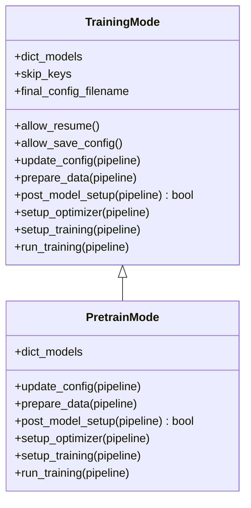

**Diagram sources**
- [mode.py:5-90](file://src/training/mode.py#L5-L90)
- [pretrain_mode.py:48-266](file://src/training/pretrain_mode.py#L48-L266)

**Section sources**
- [pretrain_mode.py:81-501](file://src/training/pretrain_mode.py#L81-L501)

### Data Loading and Samplers
- Sampler creation: Builds train/valid/test samplers for pre-training, supports deterministic splits and distribution across ranks.
- Tokenization and packing: Initializes tokenizer, optionally packs tokens, and estimates tokens per sample for schedule computation.
- Collation: Uses DataCollatorForGST to assemble batches with padding and multiple workers.
- Evaluation loaders: Initializes validation and test loaders with appropriate collators and samplers.

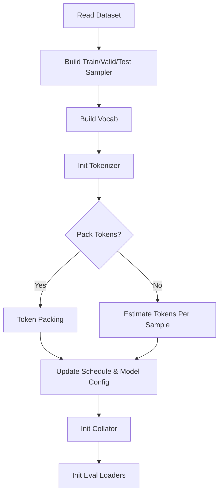

**Diagram sources**
- [pretrain_mode.py:130-227](file://src/training/pretrain_mode.py#L130-L227)
- [loader_utils.py:318-409](file://src/utils/loader_utils.py#L318-L409)
- [loader_utils.py:663-751](file://src/utils/loader_utils.py#L663-L751)

**Section sources**
- [loader_utils.py:318-409](file://src/utils/loader_utils.py#L318-L409)
- [loader_utils.py:663-751](file://src/utils/loader_utils.py#L663-L751)

### Training Loop Management
- Epoch and step iteration: Resets train sampler per epoch when configured, supports ODPS iterable datasets with skipped samples.
- Batch training: Executes forward/backward/update via training utilities.
- EMA updates: Maintains exponential moving averages of model parameters.
- Logging and evaluation: Logs training stats, evaluates on validation/test, and optionally evaluates generation accuracy.
- Checkpointing: Saves checkpoints at configured intervals and after final step.

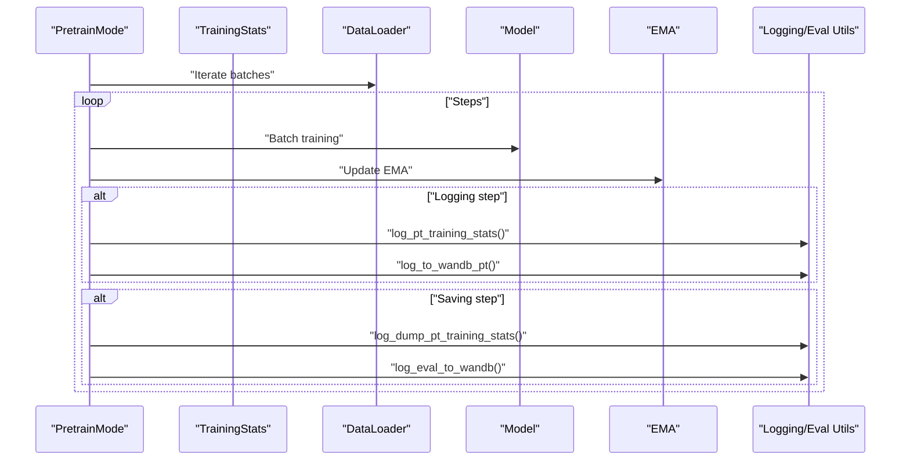

**Updated** Enhanced with Weights & Biases logging integration for comprehensive monitoring of both training and evaluation metrics.

**Diagram sources**
- [pretrain_mode.py:412-499](file://src/training/pretrain_mode.py#L412-L499)
- [log_eval_dump_utils.py:504-646](file://src/utils/log_eval_dump_utils.py#L504-L646)

**Section sources**
- [pretrain_mode.py:412-499](file://src/training/pretrain_mode.py#L412-L499)
- [log_eval_dump_utils.py:504-646](file://src/utils/log_eval_dump_utils.py#L504-L646)

### Evaluation Procedures
- Validation and test evaluation: Computes loss and metrics on held-out sets.
- Generation evaluation: Evaluates generation accuracy across un-mask ratio intervals.
- EMA evaluation: Optionally evaluates using exponentially averaged model parameters.

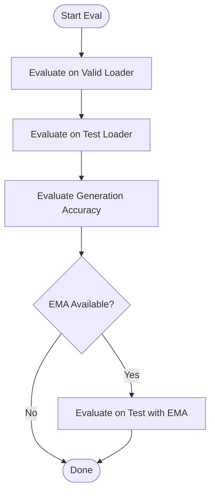

**Diagram sources**
- [log_eval_dump_utils.py:242-304](file://src/utils/log_eval_dump_utils.py#L242-L304)
- [log_eval_dump_utils.py:307-384](file://src/utils/log_eval_dump_utils.py#L307-L384)
- [log_eval_dump_utils.py:588-641](file://src/utils/log_eval_dump_utils.py#L588-L641)

**Section sources**
- [log_eval_dump_utils.py:242-304](file://src/utils/log_eval_dump_utils.py#L242-L304)
- [log_eval_dump_utils.py:307-384](file://src/utils/log_eval_dump_utils.py#L307-L384)
- [log_eval_dump_utils.py:588-641](file://src/utils/log_eval_dump_utils.py#L588-L641)

### Enhanced Evaluation Logging and Monitoring
**Updated** The evaluation logging system has been significantly enhanced with Weights & Biases integration for comprehensive monitoring capabilities.

- **Comprehensive Metrics Logging**: Evaluation metrics are now logged with structured naming conventions using prefix-based metric names (e.g., "valid/loss", "test/loss").
- **Training-Evaluation Correlation**: Evaluation metrics are logged alongside training statistics, enabling better correlation between training progress and evaluation performance.
- **Unified Logging Infrastructure**: Both CSV logs and Weights & Biases provide synchronized evaluation results for comprehensive monitoring.
- **Enhanced WandB Integration**: Dedicated evaluation logging function (`log_eval_to_wandb`) provides structured metric logging with proper step tracking.

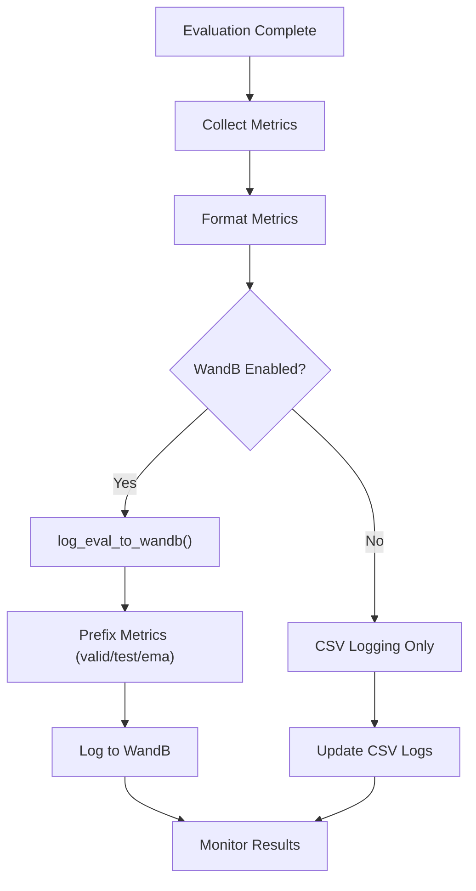

**Diagram sources**
- [pretrain_mode.py:544-555](file://src/training/pretrain_mode.py#L544-L555)
- [log_eval_dump_utils.py:1109-1127](file://src/utils/log_eval_dump_utils.py#L1109-L1127)

**Section sources**
- [pretrain_mode.py:544-555](file://src/training/pretrain_mode.py#L544-L555)
- [log_eval_dump_utils.py:1109-1127](file://src/utils/log_eval_dump_utils.py#L1109-L1127)

### Checkpoint Management and Logging
- Checkpoint saving: Uses DeepSpeed save_checkpoint or PyTorch save for DDP; cleans up older checkpoints.
- Logging: Writes CSV logs for training and evaluation; supports TensorBoard histograms.
- Resume: Detects existing log to resume from current output_dir instead of pretrained checkpoint.

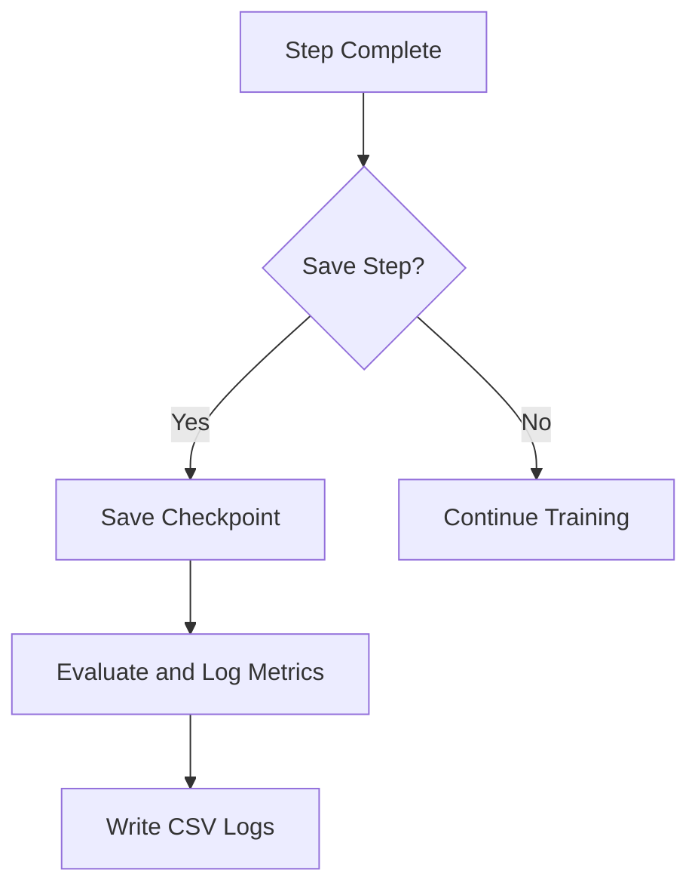

**Diagram sources**
- [misc_utils.py:69-122](file://src/utils/misc_utils.py#L69-L122)
- [log_eval_dump_utils.py:565-646](file://src/utils/log_eval_dump_utils.py#L565-L646)
- [pipeline.py:179-202](file://src/training/pipeline.py#L179-L202)

**Section sources**
- [misc_utils.py:69-122](file://src/utils/misc_utils.py#L69-L122)
- [log_eval_dump_utils.py:565-646](file://src/utils/log_eval_dump_utils.py#L565-L646)
- [pipeline.py:179-202](file://src/training/pipeline.py#L179-L202)

### Distributed Training Setup and Memory Optimization
- Distributed environment: Sets world_size and rank, and initializes NCCL backend when DeepSpeed is enabled.
- DeepSpeed integration: Parses ds_config2.json for mixed precision, optimizer, scheduler, zero optimization, activation checkpointing, and flops profiler.
- Memory optimization: Gradient checkpointing, disabling cache, activation checkpointing, and careful sampler distribution across ranks.

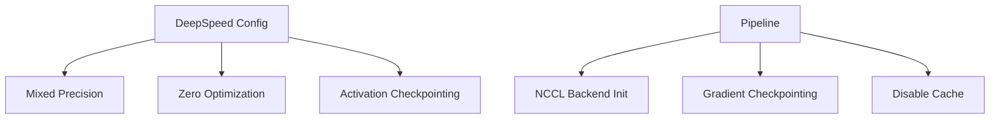

**Diagram sources**
- [ds_config2.json:1-43](file://examples/ds_config2.json#L1-L43)
- [pipeline.py:152-164](file://src/training/pipeline.py#L152-L164)
- [pretrain_mode.py:276-298](file://src/training/pretrain_mode.py#L276-L298)

**Section sources**
- [ds_config2.json:1-43](file://examples/ds_config2.json#L1-L43)
- [pipeline.py:152-164](file://src/training/pipeline.py#L152-L164)
- [pretrain_mode.py:276-298](file://src/training/pretrain_mode.py#L276-L298)

### Fault Tolerance Mechanisms
- Resume from latest checkpoint: If a log exists in output_dir, resume training from there instead of pretrained checkpoint.
- Robust checkpoint loading: Falls back to DeepSpeed's zero-to-fp32 API when direct loading fails.
- Graceful evaluation: Handles distributed reductions and NaN checks during evaluation.

**Section sources**
- [pipeline.py:129-135](file://src/training/pipeline.py#L129-L135)
- [misc_utils.py:176-220](file://src/utils/misc_utils.py#L176-L220)
- [log_eval_dump_utils.py:242-304](file://src/utils/log_eval_dump_utils.py#L242-L304)

## Dependency Analysis
The pipeline exhibits clear separation of concerns:
- TrainingPipeline depends on PretrainMode for mode-specific behavior.
- PretrainMode depends on data utilities for samplers and loaders, logging utilities for evaluation and logging, and model utilities for checkpointing.
- Hydra configuration drives all components via unified config groups.

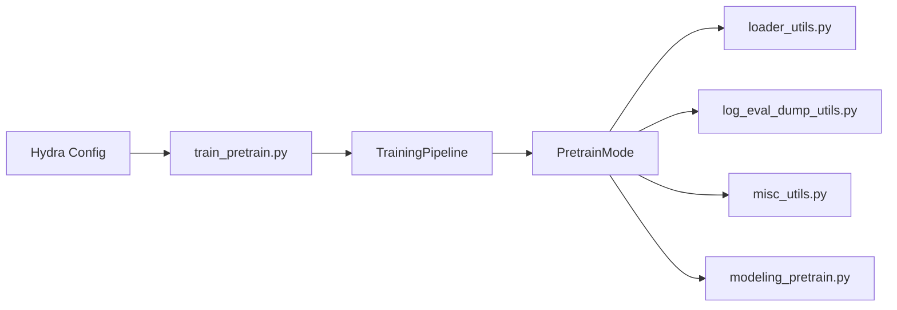

**Diagram sources**
- [train_pretrain.py:12-18](file://examples/train_pretrain.py#L12-L18)
- [pipeline.py:60-96](file://src/training/pipeline.py#L60-L96)
- [pretrain_mode.py:97-227](file://src/training/pretrain_mode.py#L97-L227)
- [loader_utils.py:318-409](file://src/utils/loader_utils.py#L318-L409)
- [log_eval_dump_utils.py:504-646](file://src/utils/log_eval_dump_utils.py#L504-L646)
- [misc_utils.py:69-122](file://src/utils/misc_utils.py#L69-L122)
- [modeling_pretrain.py:57-118](file://src/models/graphgpt/modeling_pretrain.py#L57-L118)

**Section sources**
- [train_pretrain.py:12-18](file://examples/train_pretrain.py#L12-L18)
- [pipeline.py:60-96](file://src/training/pipeline.py#L60-L96)
- [pretrain_mode.py:97-227](file://src/training/pretrain_mode.py#L97-L227)

## Performance Considerations
- Mixed precision and ZeRO: Enable fp16 and stage 2 to reduce memory footprint.
- Activation checkpointing: Reduces peak memory at the cost of recomputation.
- Gradient checkpointing: Enabled in model creation to further reduce memory.
- Prefetch and pin memory: DataLoader settings improve throughput.
- Steps per saving: Tune to balance checkpoint frequency and I/O overhead.
- Profiling: Use DeepSpeed flops profiler to identify bottlenecks.

**Updated** Enhanced monitoring capabilities through Weights & Biases integration provide better performance insights and correlation between training and evaluation metrics.

[No sources needed since this section provides general guidance]

## Troubleshooting Guide
Common issues and remedies:
- No checkpoint found: Ensure pretrain_cpt points to a valid directory with epoch_* subfolders.
- Resume confusion: If log.csv exists in output_dir, training resumes from there; otherwise, it loads from pretrain_cpt.
- OOM errors: Reduce batch_size, enable gradient checkpointing, or switch to smaller model variants.
- Evaluation hangs: Verify distributed environment variables and sampler distribution across ranks.
- Logging gaps: Confirm steps_per_saving and logging_steps alignment with schedule configuration.
- **WandB Issues**: Ensure API key is configured and project name is set when enabling wandb logging.

**Updated** Added troubleshooting guidance for Weights & Biases integration issues.

**Section sources**
- [pipeline.py:129-135](file://src/training/pipeline.py#L129-L135)
- [misc_utils.py:69-122](file://src/utils/misc_utils.py#L69-L122)
- [loader_utils.py:318-409](file://src/utils/loader_utils.py#L318-L409)

## Conclusion
The Graph-GPT pre-training pipeline integrates Hydra configuration, a flexible TrainingMode strategy, and robust utilities to support scalable, distributed pre-training. By following the documented workflow—from configuration to checkpoint saving—users can reliably execute pre-training across diverse datasets and hardware setups while leveraging logging, evaluation, and memory optimization features.

**Updated** Enhanced with comprehensive evaluation logging capabilities through Weights & Biases integration, providing better monitoring and correlation between training statistics and evaluation metrics for improved pre-training process oversight.

[No sources needed since this section summarizes without analyzing specific files]

## Appendices

### Command-Line Usage and Configuration Overrides
Examples show how to override configurations via command line and shell scripts:
- Override tokenization group and training parameters (e.g., output_dir, pretrain_cpt, task_type, batch_size, optimizer, schedule).
- Use DeepSpeed by pointing to ds_config2.json or ds_config2_pt.json.
- Select dataset-specific tokenization configs via tokenization=<dir><file>.

Concrete examples:
- [pcqm4m_v2_pretrain.sh:253-307](file://examples/graph_lvl/pcqm4m_v2_pretrain.sh#L253-L307)
- [reddit_pretrain.sh:203-253](file://examples/toy_examples/reddit_pretrain.sh#L203-L253)

**Section sources**
- [pcqm4m_v2_pretrain.sh:253-307](file://examples/graph_lvl/pcqm4m_v2_pretrain.sh#L253-L307)
- [reddit_pretrain.sh:203-253](file://examples/toy_examples/reddit_pretrain.sh#L203-L253)

### Runtime Parameter Adjustments
Key runtime parameters controlled via configuration:
- Training: total_tokens, warmup_tokens, samples_per_saving, logging_steps, batch_size, optimizer hyperparameters, use_ema.
- Tokenization: tokenizer_class, dataset selection, vocab_file, structure tokens.
- Model: model_type, hidden_size, num_hidden_layers, max_position_embeddings, dropout settings.
- Generation: do_generation, generation algorithm, parallel generation.
- **Weights & Biases**: enabled, api_key, project, entity, name, tags, notes, group, job_type, resume, log_model, log_freq.

**Updated** Added Weights & Biases configuration parameters for enhanced monitoring.

**Section sources**
- [base.yaml (training):24-78](file://configs/training/base.yaml#L24-L78)
- [base.yaml (tokenization):1-117](file://configs/tokenization/base.yaml#L1-L117)
- [base.yaml (model):1-222](file://configs/model/base.yaml#L1-L222)

### Model Initialization and Forward Pass
- Model class registry maps model_type to GraphGPTPretrainBase or GraphGPTPosPred.
- Model initialization includes backbone setup, stacked feature aggregation, optional raw embedding projection, and head configuration.
- Forward pass supports generative and discriminative objectives, with optional SMTP inside model.

**Section sources**
- [pretrain_mode.py:71-75](file://src/training/pretrain_mode.py#L71-L75)
- [modeling_pretrain.py:57-118](file://src/models/graphgpt/modeling_pretrain.py#L57-L118)
- [modeling_pretrain.py:152-200](file://src/models/graphgpt/modeling_pretrain.py#L152-L200)
