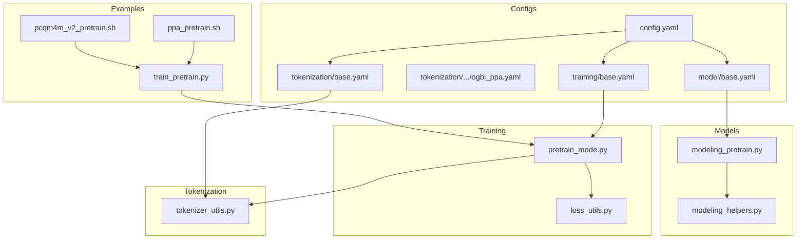
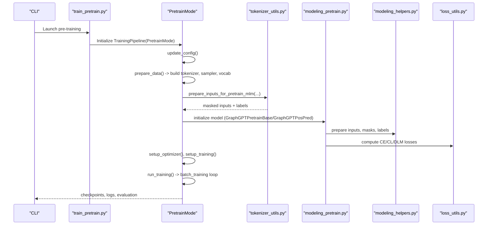
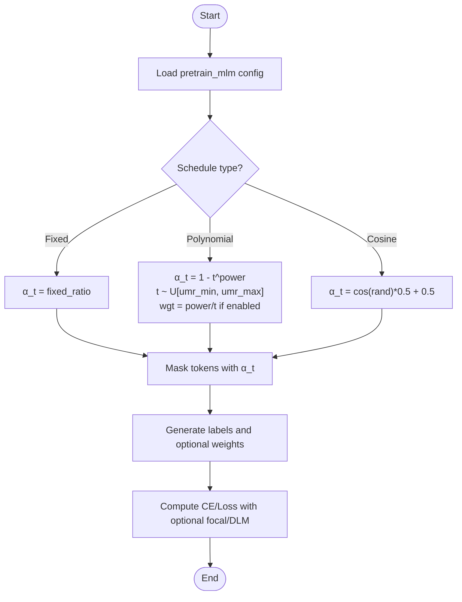
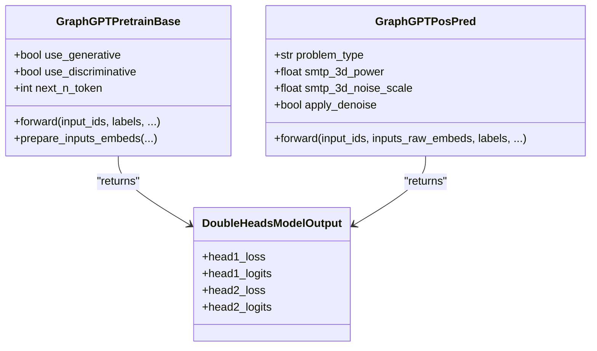
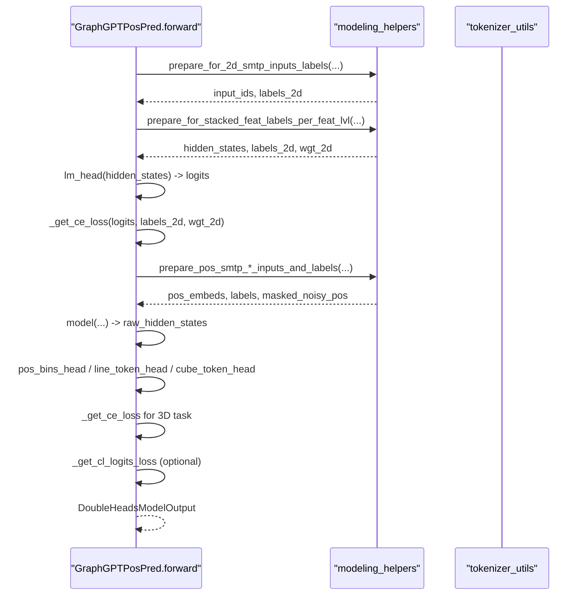
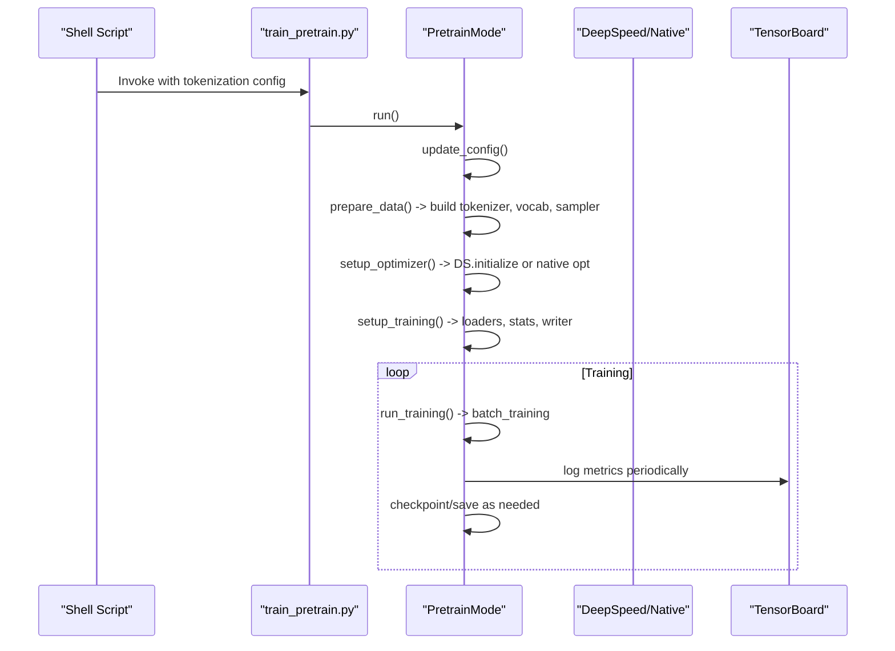
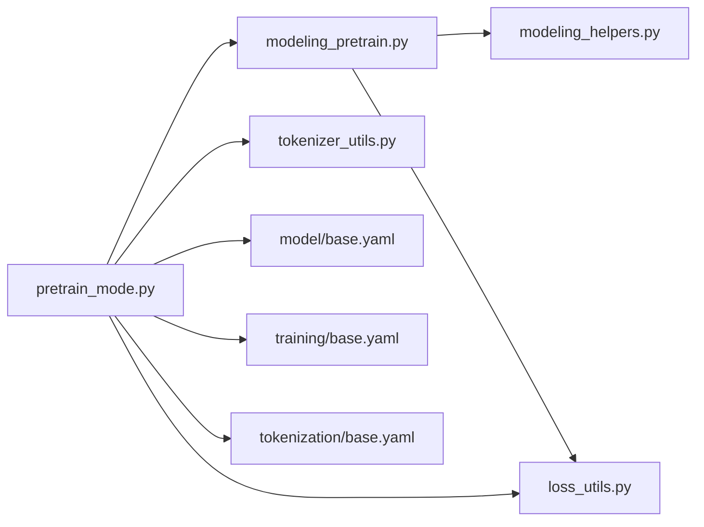

# Pre-training System

<cite>
**Referenced Files in This Document**
- [modeling_pretrain.py](file://src/models/graphgpt/modeling_pretrain.py)
- [modeling_helpers.py](file://src/models/graphgpt/modeling_helpers.py)
- [pretrain_mode.py](file://src/training/pretrain_mode.py)
- [loss_utils.py](file://src/utils/loss_utils.py)
- [tokenizer_utils.py](file://src/utils/tokenizer_utils.py)
- [base.yaml](file://configs/model/base.yaml)
- [base.yaml](file://configs/training/base.yaml)
- [config.yaml](file://configs/config.yaml)
- [base.yaml](file://configs/tokenization/base.yaml)
- [ogbl_ppa.yaml](file://configs/tokenization/edge_lvl/ogbl_ppa.yaml)
- [train_pretrain.py](file://examples/train_pretrain.py)
- [ppa_pretrain.sh](file://examples/edge_lvl/ppa_pretrain.sh)
- [pcqm4m_v2_pretrain.sh](file://examples/graph_lvl/pcqm4m_v2_pretrain.sh)
</cite>

## Table of Contents
1. [Introduction](#introduction)
2. [Project Structure](#project-structure)
3. [Core Components](#core-components)
4. [Architecture Overview](#architecture-overview)
5. [Detailed Component Analysis](#detailed-component-analysis)
6. [Dependency Analysis](#dependency-analysis)
7. [Performance Considerations](#performance-considerations)
8. [Troubleshooting Guide](#troubleshooting-guide)
9. [Conclusion](#conclusion)
10. [Appendices](#appendices)

## Introduction
This document explains the Graph-GPT pre-training system with a focus on generative objectives and dual-head architectures. It covers:
- Next-token prediction (NTP) and scheduled masked-token prediction (SMTP) objectives, including mathematical formulations and implementation details
- Dual-head model designs and position-level pre-training components
- Concrete examples from the codebase for configuration, execution, and monitoring
- Hyperparameters, scheduling strategies, and optimization techniques
- Relationship to diffusion language model principles
- Best practices, convergence criteria, and quality assessment methods

## Project Structure
The pre-training system is organized around modular components:
- Model definitions for generative and position-level pre-training
- Training orchestration and data preparation
- Tokenization and masking utilities
- Configuration files for model, training, and tokenization
- Example scripts for launching pre-training runs

**Diagram sources**
- [config.yaml:1-20](file://configs/config.yaml#L1-L20)
- [base.yaml:1-117](file://configs/tokenization/base.yaml#L1-L117)
- [ogbl_ppa.yaml:1-123](file://configs/tokenization/edge_lvl/ogbl_ppa.yaml#L1-L123)
- [base.yaml:1-222](file://configs/model/base.yaml#L1-L222)
- [base.yaml:1-78](file://configs/training/base.yaml#L1-L78)
- [modeling_pretrain.py:1-691](file://src/models/graphgpt/modeling_pretrain.py#L1-L691)
- [modeling_helpers.py:1-800](file://src/models/graphgpt/modeling_helpers.py#L1-L800)
- [pretrain_mode.py:1-501](file://src/training/pretrain_mode.py#L1-L501)
- [loss_utils.py:1-413](file://src/utils/loss_utils.py#L1-L413)
- [tokenizer_utils.py:250-449](file://src/utils/tokenizer_utils.py#L250-L449)
- [train_pretrain.py:1-19](file://examples/train_pretrain.py#L1-L19)
- [ppa_pretrain.sh:1-287](file://examples/edge_lvl/ppa_pretrain.sh#L1-L287)
- [pcqm4m_v2_pretrain.sh:1-311](file://examples/graph_lvl/pcqm4m_v2_pretrain.sh#L1-L311)

**Section sources**
- [config.yaml:1-20](file://configs/config.yaml#L1-L20)
- [base.yaml:1-222](file://configs/model/base.yaml#L1-L222)
- [base.yaml:1-78](file://configs/training/base.yaml#L1-L78)
- [base.yaml:1-117](file://configs/tokenization/base.yaml#L1-L117)
- [ogbl_ppa.yaml:1-123](file://configs/tokenization/edge_lvl/ogbl_ppa.yaml#L1-L123)

## Core Components
- Generative pre-training heads:
  - Next-token prediction (NTP) with optional multi-token projection
  - Scheduled masked-token prediction (SMTP) with discrete diffusion weighting
- Discriminative pre-training head:
  - Contrastive Learning (CL) loss for sequence-level representation learning
- Position-level pre-training head:
  - 2D SMTP for node attributes and 3D SMTP for coordinates via line/cube tokenization
  - Optional denoising targets and positional type embeddings

Key implementation highlights:
- Dual-head outputs with separate losses for generative and discriminative objectives
- Flexible masking schedules and discrete diffusion weighting
- Position tokenization and aggregation for 3D coordinates

**Section sources**
- [modeling_pretrain.py:57-266](file://src/models/graphgpt/modeling_pretrain.py#L57-L266)
- [modeling_pretrain.py:269-691](file://src/models/graphgpt/modeling_pretrain.py#L269-L691)
- [modeling_helpers.py:145-228](file://src/models/graphgpt/modeling_helpers.py#L145-L228)
- [modeling_helpers.py:399-476](file://src/models/graphgpt/modeling_helpers.py#L399-L476)
- [modeling_helpers.py:639-796](file://src/models/graphgpt/modeling_helpers.py#L639-L796)
- [loss_utils.py:201-228](file://src/utils/loss_utils.py#L201-L228)

## Architecture Overview
The pre-training pipeline integrates configuration-driven tokenization, model heads, and training orchestration.

**Diagram sources**
- [train_pretrain.py:1-19](file://examples/train_pretrain.py#L1-L19)
- [pretrain_mode.py:48-501](file://src/training/pretrain_mode.py#L48-L501)
- [tokenizer_utils.py:250-449](file://src/utils/tokenizer_utils.py#L250-L449)
- [modeling_pretrain.py:57-266](file://src/models/graphgpt/modeling_pretrain.py#L57-L266)
- [modeling_helpers.py:145-228](file://src/models/graphgpt/modeling_helpers.py#L145-L228)
- [loss_utils.py:201-228](file://src/utils/loss_utils.py#L201-L228)

## Detailed Component Analysis

### Next-token Prediction (NTP) and Scheduled Masked-token Prediction (SMTP)
- NTP objective:
  - Predict the next token(s) using a learned lm_head
  - Multi-token extension via a learnable projection when next_n_token > 1
- SMTP objective:
  - Randomly mask tokens according to a scheduled ratio α_t
  - Support for polynomial, cosine, and fixed schedules
  - Optional discrete diffusion weighting (DLM) for improved training stability

Mathematical formulation (conceptual):
- NTP loss:
  - L_NTP = CrossEntropy(logits, targets)
- SMTP with discrete diffusion weighting:
  - L_SMTP = Σ_i w_i * CrossEntropy(logits_i, targets_i)
  - w_i derived from schedule derivatives to stabilize training

Implementation details:
- Masking schedule and weighting computed in tokenizer utilities
- Labels and weights prepared per-feature-level or mixed-level in modeling helpers
- Optional focal loss supported for NTP/SMTP

**Diagram sources**
- [tokenizer_utils.py:250-277](file://src/utils/tokenizer_utils.py#L250-L277)
- [modeling_helpers.py:145-177](file://src/models/graphgpt/modeling_helpers.py#L145-L177)
- [modeling_helpers.py:327-393](file://src/models/graphgpt/modeling_helpers.py#L327-L393)

**Section sources**
- [tokenizer_utils.py:250-277](file://src/utils/tokenizer_utils.py#L250-L277)
- [modeling_helpers.py:145-177](file://src/models/graphgpt/modeling_helpers.py#L145-L177)
- [modeling_helpers.py:327-393](file://src/models/graphgpt/modeling_helpers.py#L327-L393)
- [base.yaml:13-22](file://configs/training/base.yaml#L13-L22)

### Dual-Head Model Architectures
- GraphGPTPretrainBase:
  - Generative head (lm_head) and optional discriminative head (CL)
  - Supports multi-token next prediction via n_token_proj
  - Embedding dropout and stacked feature aggregation
- GraphGPTPosPred:
  - Position-level pre-training with 2D SMTP and 3D SMTP
  - Line/cube tokenization for coordinates with configurable aggregation
  - Optional denoising targets and positional type embeddings

**Diagram sources**
- [modeling_pretrain.py:57-118](file://src/models/graphgpt/modeling_pretrain.py#L57-L118)
- [modeling_pretrain.py:269-352](file://src/models/graphgpt/modeling_pretrain.py#L269-L352)
- [modeling_pretrain.py:258-266](file://src/models/graphgpt/modeling_pretrain.py#L258-L266)
- [modeling_pretrain.py:683-690](file://src/models/graphgpt/modeling_pretrain.py#L683-L690)

**Section sources**
- [modeling_pretrain.py:57-118](file://src/models/graphgpt/modeling_pretrain.py#L57-L118)
- [modeling_pretrain.py:269-352](file://src/models/graphgpt/modeling_pretrain.py#L269-L352)
- [modeling_pretrain.py:152-266](file://src/models/graphgpt/modeling_pretrain.py#L152-L266)
- [modeling_pretrain.py:473-691](file://src/models/graphgpt/modeling_pretrain.py#L473-L691)

### Position-Level Pre-training Components
- 2D SMTP for node attributes:
  - Sample-level selection of molecules with zero coordinates
  - Per-node/per-coordinate masking with polynomial schedule
  - Optional replacement of [mask] tokens with random draws
- 3D SMTP for coordinates:
  - Line tokenization: three tokens per position (x, y, z)
  - Cube tokenization: one token per position via trinary encoding
  - Optional denoising targets using clean coordinates as labels
  - Position type embeddings and optional raw position projection

**Diagram sources**
- [modeling_pretrain.py:473-691](file://src/models/graphgpt/modeling_pretrain.py#L473-L691)
- [modeling_helpers.py:399-476](file://src/models/graphgpt/modeling_helpers.py#L399-L476)
- [modeling_helpers.py:639-796](file://src/models/graphgpt/modeling_helpers.py#L639-L796)
- [modeling_helpers.py:145-177](file://src/models/graphgpt/modeling_helpers.py#L145-L177)

**Section sources**
- [modeling_helpers.py:399-476](file://src/models/graphgpt/modeling_helpers.py#L399-L476)
- [modeling_helpers.py:639-796](file://src/models/graphgpt/modeling_helpers.py#L639-L796)
- [modeling_helpers.py:145-177](file://src/models/graphgpt/modeling_helpers.py#L145-L177)
- [modeling_pretrain.py:473-691](file://src/models/graphgpt/modeling_pretrain.py#L473-L691)

### Training Orchestration and Execution
- PretrainMode orchestrates:
  - Data preparation, vocabulary building, and sampler setup
  - Tokenization with SMTP masking and optional DLM weighting
  - Model initialization and optimizer setup (DeepSpeed or native)
  - Training loop with logging, evaluation, and checkpointing
- Example scripts demonstrate:
  - Edge-level and graph-level pre-training configurations
  - Command-line overrides for model, training, and tokenization

**Diagram sources**
- [ppa_pretrain.sh:283-287](file://examples/edge_lvl/ppa_pretrain.sh#L283-L287)
- [pcqm4m_v2_pretrain.sh:302-311](file://examples/graph_lvl/pcqm4m_v2_pretrain.sh#L302-L311)
- [train_pretrain.py:1-19](file://examples/train_pretrain.py#L1-L19)
- [pretrain_mode.py:48-501](file://src/training/pretrain_mode.py#L48-L501)

**Section sources**
- [pretrain_mode.py:48-501](file://src/training/pretrain_mode.py#L48-L501)
- [ppa_pretrain.sh:1-287](file://examples/edge_lvl/ppa_pretrain.sh#L1-L287)
- [pcqm4m_v2_pretrain.sh:1-311](file://examples/graph_lvl/pcqm4m_v2_pretrain.sh#L1-L311)
- [train_pretrain.py:1-19](file://examples/train_pretrain.py#L1-L19)

## Dependency Analysis
- Model-to-helper dependencies:
  - GraphGPTPretrainBase and GraphGPTPosPred rely on modeling_helpers for:
    - Attention mask updates
    - Input embedding preparation
    - Loss computation (CE, DLM, CL)
    - SMTP and position tokenization utilities
- Training-mode dependencies:
  - PretrainMode depends on:
    - Tokenization utilities for masking and labeling
    - Loss utilities for CL and distributed contrastive loss
    - Configuration files for model, training, and tokenization

**Diagram sources**
- [modeling_pretrain.py:1-691](file://src/models/graphgpt/modeling_pretrain.py#L1-L691)
- [modeling_helpers.py:1-800](file://src/models/graphgpt/modeling_helpers.py#L1-L800)
- [loss_utils.py:1-413](file://src/utils/loss_utils.py#L1-L413)
- [pretrain_mode.py:1-501](file://src/training/pretrain_mode.py#L1-L501)
- [base.yaml:1-222](file://configs/model/base.yaml#L1-L222)
- [base.yaml:1-78](file://configs/training/base.yaml#L1-L78)
- [base.yaml:1-117](file://configs/tokenization/base.yaml#L1-L117)

**Section sources**
- [modeling_pretrain.py:1-691](file://src/models/graphgpt/modeling_pretrain.py#L1-L691)
- [modeling_helpers.py:1-800](file://src/models/graphgpt/modeling_helpers.py#L1-L800)
- [loss_utils.py:1-413](file://src/utils/loss_utils.py#L1-L413)
- [pretrain_mode.py:1-501](file://src/training/pretrain_mode.py#L1-L501)

## Performance Considerations
- Discrete diffusion weighting (DLM) improves training stability for SMTP by downweighting easy-to-predict tokens
- Focal loss can reduce focus on easy negatives and improve convergence
- Layer-wise learning rate decay can stabilize pre-training for deeper models
- Token packing and attention mask strategies help manage long sequences efficiently
- Distributed contrastive loss benefits from proper world size handling

[No sources needed since this section provides general guidance]

## Troubleshooting Guide
Common issues and remedies:
- Shape mismatches in multi-token next prediction:
  - Ensure n_token_proj aligns with next_n_token and stack_method
- CL loss not aggregating across devices:
  - Verify world_size and GatherLayer usage
- Position-level pre-training not converging:
  - Check 2D/3D masking rates, denoising settings, and tokenization binning
- Memory issues during generation:
  - Reduce batch size, disable EMA, or switch to native DDP

**Section sources**
- [modeling_helpers.py:327-393](file://src/models/graphgpt/modeling_helpers.py#L327-L393)
- [loss_utils.py:89-137](file://src/utils/loss_utils.py#L89-L137)
- [modeling_helpers.py:639-796](file://src/models/graphgpt/modeling_helpers.py#L639-L796)

## Conclusion
Graph-GPT’s pre-training system combines flexible generative objectives (NTP/SMTP) with discriminative and position-level tasks. The dual-head design enables joint optimization for language modeling and structure-aware representation learning. Configuration-driven tokenization and robust training orchestration make it practical to scale across diverse graph domains.

[No sources needed since this section summarizes without analyzing specific files]

## Appendices

### A. Pre-training Configuration Examples
- Example shell scripts show how to:
  - Select tokenization configs (e.g., edge-level ogbl-ppa)
  - Override model, training, and generation parameters
  - Launch with DeepSpeed or native DDP

**Section sources**
- [ppa_pretrain.sh:1-287](file://examples/edge_lvl/ppa_pretrain.sh#L1-L287)
- [pcqm4m_v2_pretrain.sh:1-311](file://examples/graph_lvl/pcqm4m_v2_pretrain.sh#L1-L311)

### B. Configuration Reference
- Model-level:
  - Generative/discriminative head toggles, next_n_token, SMTP scheduling, position-level heads
- Training-level:
  - Schedules, optimizer settings, logging/checkpointing, focal loss and DLM weighting
- Tokenization-level:
  - Pre-training MLM settings, mask ratios, and masking strategies

**Section sources**
- [base.yaml:74-127](file://configs/model/base.yaml#L74-L127)
- [base.yaml:13-78](file://configs/training/base.yaml#L13-L78)
- [base.yaml:1-117](file://configs/tokenization/base.yaml#L1-L117)
- [ogbl_ppa.yaml:1-123](file://configs/tokenization/edge_lvl/ogbl_ppa.yaml#L1-L123)
- [config.yaml:1-20](file://configs/config.yaml#L1-L20)
