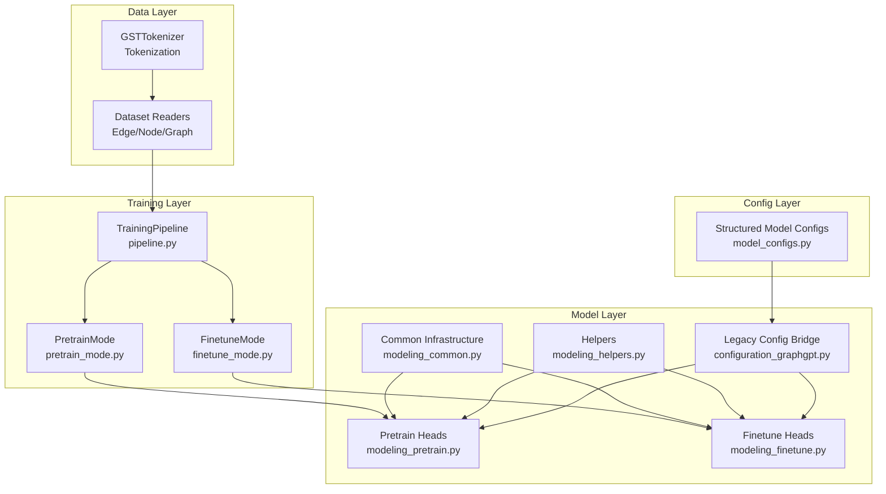
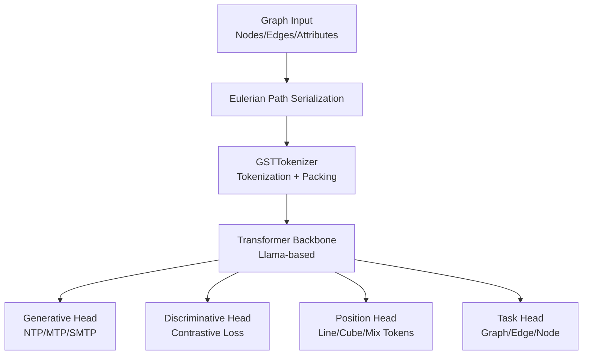
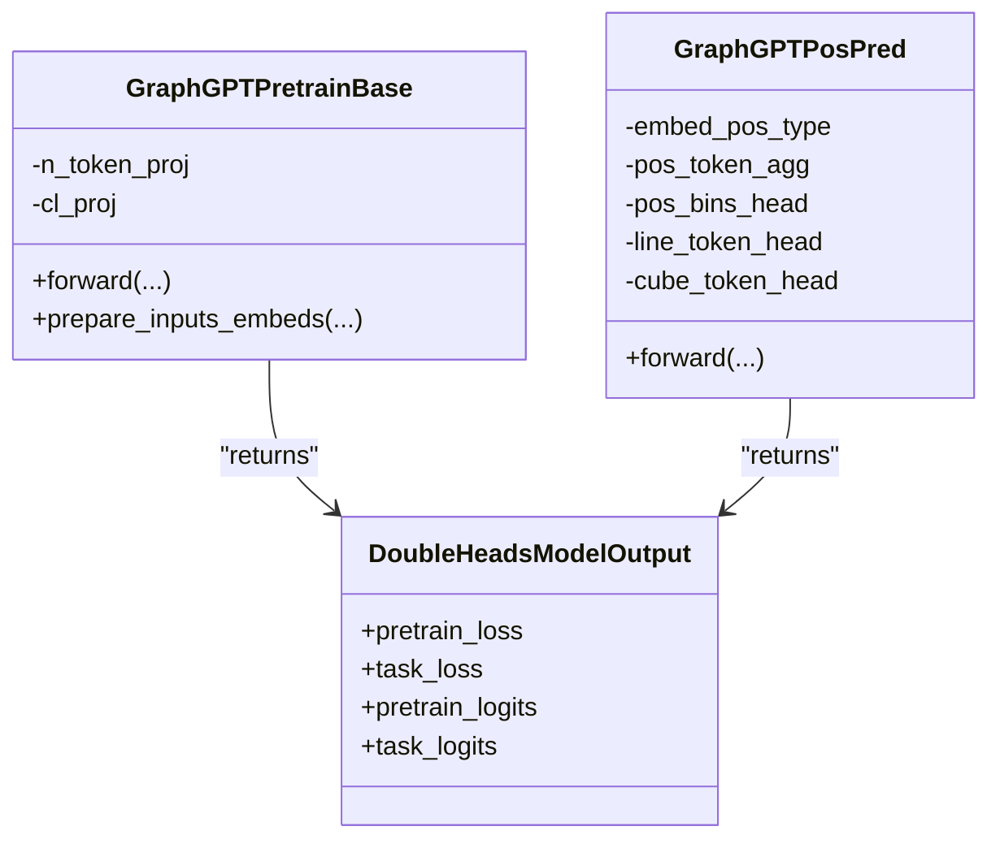
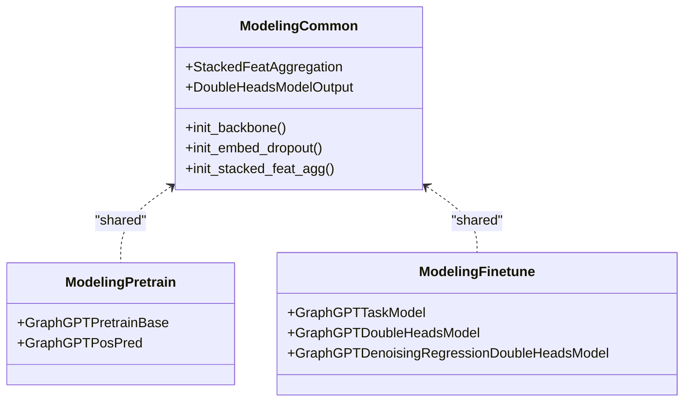
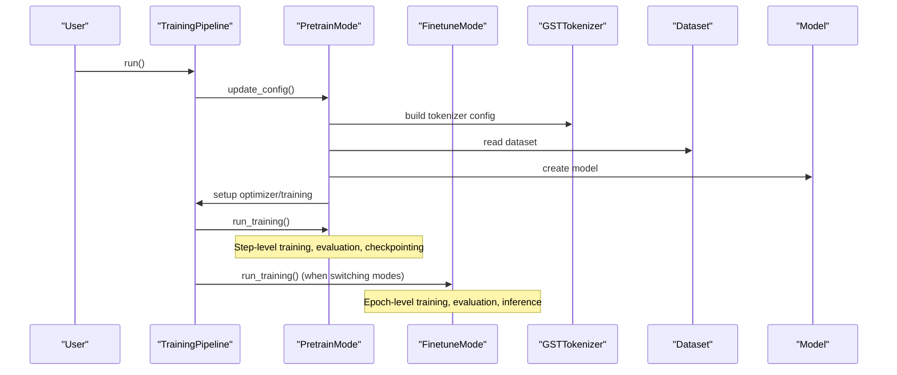
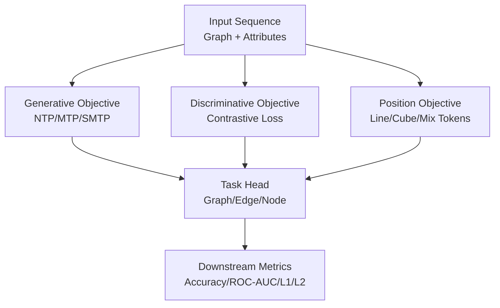
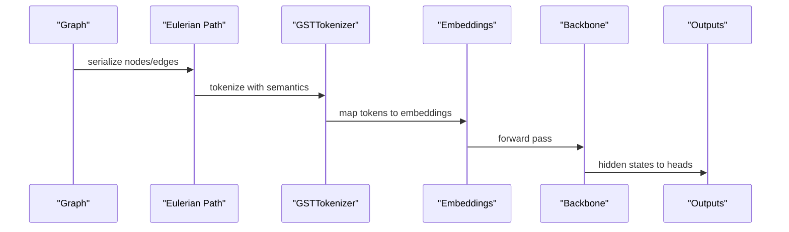
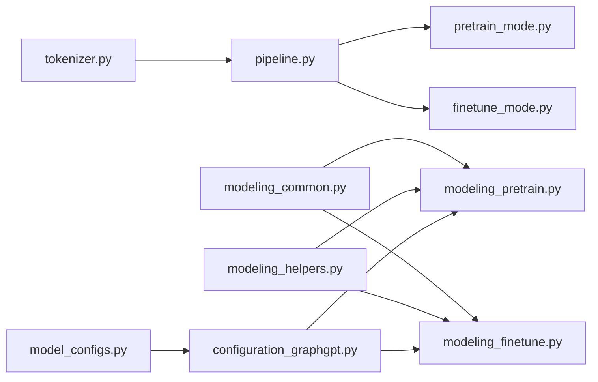

# Architecture Overview

<cite>
**Referenced Files in This Document**
- [README.md](file://README.md)
- [modeling_graphgpt.py](file://src/models/graphgpt/modeling_graphgpt.py)
- [modeling_common.py](file://src/models/graphgpt/modeling_common.py)
- [modeling_pretrain.py](file://src/models/graphgpt/modeling_pretrain.py)
- [modeling_finetune.py](file://src/models/graphgpt/modeling_finetune.py)
- [modeling_helpers.py](file://src/models/graphgpt/modeling_helpers.py)
- [configuration_graphgpt.py](file://src/models/graphgpt/configuration_graphgpt.py)
- [model_configs.py](file://src/conf/model/model_configs.py)
- [pipeline.py](file://src/training/pipeline.py)
- [pretrain_mode.py](file://src/training/pretrain_mode.py)
- [finetune_mode.py](file://src/training/finetune_mode.py)
- [modules_utils.py](file://src/utils/modules_utils.py)
- [tokenizer.py](file://src/data/tokenizer.py)
</cite>

## Table of Contents
1. [Introduction](#introduction)
2. [Project Structure](#project-structure)
3. [Core Components](#core-components)
4. [Architecture Overview](#architecture-overview)
5. [Detailed Component Analysis](#detailed-component-analysis)
6. [Dependency Analysis](#dependency-analysis)
7. [Performance Considerations](#performance-considerations)
8. [Troubleshooting Guide](#troubleshooting-guide)
9. [Conclusion](#conclusion)
10. [Appendices](#appendices)

## Introduction
This section presents the Graph-GPT architecture overview, focusing on the dual pre-training paradigm integrating transformer encoder/decoder capabilities, the modular decomposition into common, pretrain, and finetune components, and the unified training pipeline. It explains how pre-training objectives (Next-Token Prediction, Scheduled Masked Token Prediction, and Position Prediction) map to downstream task heads, and how the system supports scalable billion-parameter training across graph, edge, and node tasks.

## Project Structure
Graph-GPT adopts a modular, layered design:
- Model layer: shared components and specialized heads for pretraining and fine-tuning
- Data layer: tokenizer and dataset readers producing Eulerian sequences
- Training layer: unified pipeline with strategy-based modes for pretraining and fine-tuning
- Configuration layer: structured YAML and dataclass configs for model and training parameters

**Diagram sources**
- [modeling_graphgpt.py:1-30](file://src/models/graphgpt/modeling_graphgpt.py#L1-L30)
- [modeling_common.py:1-204](file://src/models/graphgpt/modeling_common.py#L1-L204)
- [modeling_pretrain.py:1-691](file://src/models/graphgpt/modeling_pretrain.py#L1-L691)
- [modeling_finetune.py:1-904](file://src/models/graphgpt/modeling_finetune.py#L1-L904)
- [modeling_helpers.py:1-1011](file://src/models/graphgpt/modeling_helpers.py#L1-L1011)
- [configuration_graphgpt.py:1-346](file://src/models/graphgpt/configuration_graphgpt.py#L1-L346)
- [model_configs.py:1-353](file://src/conf/model/model_configs.py#L1-L353)
- [pipeline.py:1-258](file://src/training/pipeline.py#L1-L258)
- [pretrain_mode.py:1-501](file://src/training/pretrain_mode.py#L1-L501)
- [finetune_mode.py:1-459](file://src/training/finetune_mode.py#L1-L459)
- [tokenizer.py:1-800](file://src/data/tokenizer.py#L1-L800)

**Section sources**
- [README.md:127-142](file://README.md#L127-L142)
- [modeling_graphgpt.py:1-30](file://src/models/graphgpt/modeling_graphgpt.py#L1-L30)
- [modeling_common.py:1-204](file://src/models/graphgpt/modeling_common.py#L1-L204)
- [modeling_pretrain.py:1-691](file://src/models/graphgpt/modeling_pretrain.py#L1-L691)
- [modeling_finetune.py:1-904](file://src/models/graphgpt/modeling_finetune.py#L1-L904)
- [modeling_helpers.py:1-1011](file://src/models/graphgpt/modeling_helpers.py#L1-L1011)
- [configuration_graphgpt.py:1-346](file://src/models/graphgpt/configuration_graphgpt.py#L1-L346)
- [model_configs.py:1-353](file://src/conf/model/model_configs.py#L1-L353)
- [pipeline.py:1-258](file://src/training/pipeline.py#L1-L258)
- [pretrain_mode.py:1-501](file://src/training/pretrain_mode.py#L1-L501)
- [finetune_mode.py:1-459](file://src/training/finetune_mode.py#L1-L459)
- [tokenizer.py:1-800](file://src/data/tokenizer.py#L1-L800)

## Core Components
- Dual pre-training heads:
  - Next-Token Prediction (NTP) and Multi-Step NTP (MTP)
  - Scheduled Masked Token Prediction (SMTP) for structural and semantic attributes
  - Position Prediction (3D coordinates) via line/cube/mix tokenization strategies
- Modular model decomposition:
  - Common: shared transformer backbone, attention utilities, and shared modules
  - Pretrain: dual-head outputs supporting generative and discriminative objectives
  - Finetune: task-specific heads for graph, edge, and node classification/regression
- Unified training pipeline:
  - Strategy-based modes for pretraining and fine-tuning
  - Shared orchestration for data, model creation, optimizer setup, and checkpointing

**Section sources**
- [modeling_pretrain.py:57-267](file://src/models/graphgpt/modeling_pretrain.py#L57-L267)
- [modeling_pretrain.py:269-691](file://src/models/graphgpt/modeling_pretrain.py#L269-L691)
- [modeling_finetune.py:64-327](file://src/models/graphgpt/modeling_finetune.py#L64-L327)
- [modeling_common.py:54-100](file://src/models/graphgpt/modeling_common.py#L54-L100)
- [modeling_helpers.py:38-65](file://src/models/graphgpt/modeling_helpers.py#L38-L65)
- [pipeline.py:15-96](file://src/training/pipeline.py#L15-L96)
- [pretrain_mode.py:48-76](file://src/training/pretrain_mode.py#L48-L76)
- [finetune_mode.py:43-71](file://src/training/finetune_mode.py#L43-L71)

## Architecture Overview
GraphGPT integrates a transformer backbone with a graph-to-sequence transformation (Eulerian paths) to support both encoder-style and decoder-style pretraining. The dual pre-training architecture supports:
- Generative objectives (NTP/MTP/SMTP) for self-supervised learning
- Discriminative objective (contrastive learning) for improved representation learning
- Position prediction for molecular 3D geometry modeling

**Diagram sources**
- [tokenizer.py:425-613](file://src/data/tokenizer.py#L425-L613)
- [modeling_pretrain.py:152-267](file://src/models/graphgpt/modeling_pretrain.py#L152-L267)
- [modeling_pretrain.py:473-691](file://src/models/graphgpt/modeling_pretrain.py#L473-L691)
- [modeling_finetune.py:236-327](file://src/models/graphgpt/modeling_finetune.py#L236-L327)

## Detailed Component Analysis

### Dual Pre-Training Architecture and Transformer Integration
- Generative objectives:
  - NTP/MTP: predict next token(s) using a shared LM head
  - SMTP: scheduled masking of attributes with optional replacement and weighting
- Discriminative objective:
  - Contrastive loss on sequence-level representations for robust pretraining
- Position prediction:
  - Line/cube/mix tokenization of 3D coordinates with configurable aggregation and discretization
  - Optional denoising targets and positional type embeddings

**Diagram sources**
- [modeling_pretrain.py:57-267](file://src/models/graphgpt/modeling_pretrain.py#L57-L267)
- [modeling_pretrain.py:269-691](file://src/models/graphgpt/modeling_pretrain.py#L269-L691)
- [modeling_common.py:54-100](file://src/models/graphgpt/modeling_common.py#L54-L100)

**Section sources**
- [modeling_pretrain.py:57-267](file://src/models/graphgpt/modeling_pretrain.py#L57-L267)
- [modeling_pretrain.py:269-691](file://src/models/graphgpt/modeling_pretrain.py#L269-L691)
- [modeling_helpers.py:145-228](file://src/models/graphgpt/modeling_helpers.py#L145-L228)

### Model Decomposition: Common, Pretrain, Finetune
- Common:
  - Shared transformer backbone initialization, attention mask utilities, and stacked feature aggregation
  - Output dataclass for dual-head models
- Pretrain:
  - Dual-head outputs supporting generative and discriminative objectives
  - Flexible input embedding composition with raw attributes and positional types
- Finetune:
  - Single-head task model with configurable pooling and MLP heads
  - Support for token-level and sequence-level tasks

**Diagram sources**
- [modeling_common.py:105-204](file://src/models/graphgpt/modeling_common.py#L105-L204)
- [modeling_pretrain.py:57-691](file://src/models/graphgpt/modeling_pretrain.py#L57-L691)
- [modeling_finetune.py:64-904](file://src/models/graphgpt/modeling_finetune.py#L64-L904)

**Section sources**
- [modeling_common.py:105-204](file://src/models/graphgpt/modeling_common.py#L105-L204)
- [modeling_pretrain.py:57-691](file://src/models/graphgpt/modeling_pretrain.py#L57-L691)
- [modeling_finetune.py:64-904](file://src/models/graphgpt/modeling_finetune.py#L64-L904)

### Unified Training Pipeline and Modes
- TrainingPipeline orchestrates shared setup and delegates to mode-specific strategies
- PretrainMode: step-level training, token packing, and generation evaluation
- FinetuneMode: epoch-level evaluation, layer freezing, and inference modes

**Diagram sources**
- [pipeline.py:60-96](file://src/training/pipeline.py#L60-L96)
- [pretrain_mode.py:81-266](file://src/training/pretrain_mode.py#L81-L266)
- [finetune_mode.py:86-359](file://src/training/finetune_mode.py#L86-L359)

**Section sources**
- [pipeline.py:15-96](file://src/training/pipeline.py#L15-L96)
- [pretrain_mode.py:48-266](file://src/training/pretrain_mode.py#L48-L266)
- [finetune_mode.py:43-359](file://src/training/finetune_mode.py#L43-L359)

### Relationship Between Pre-Training Objectives and Task Heads
- NTP/MTP/SMTP (generative):
  - Predict next token(s) or masked tokens using shared LM head
  - Optional discriminative contrastive loss on sequence representations
- Position Prediction (3D):
  - Discretize coordinates into line/cube/mix tokens
  - Optional denoising targets and positional type embeddings
- Task Heads (fine-tuning):
  - Graph/edge/node classification/regression with configurable pooling and MLP heads

**Diagram sources**
- [modeling_pretrain.py:212-267](file://src/models/graphgpt/modeling_pretrain.py#L212-L267)
- [modeling_pretrain.py:590-691](file://src/models/graphgpt/modeling_pretrain.py#L590-L691)
- [modeling_finetune.py:167-327](file://src/models/graphgpt/modeling_finetune.py#L167-L327)

**Section sources**
- [modeling_pretrain.py:212-267](file://src/models/graphgpt/modeling_pretrain.py#L212-L267)
- [modeling_pretrain.py:590-691](file://src/models/graphgpt/modeling_pretrain.py#L590-L691)
- [modeling_finetune.py:167-327](file://src/models/graphgpt/modeling_finetune.py#L167-L327)

### Data Flow: From Graph Input to Model Output
- Graph input is transformed into Eulerian sequences and tokenized
- Tokenization supports packing and cyclic node re-indexing
- Inputs are embedded, optionally augmented with raw attributes and positional types
- Transformer backbone produces hidden states consumed by pre-training and task heads

**Diagram sources**
- [tokenizer.py:425-613](file://src/data/tokenizer.py#L425-L613)
- [modeling_helpers.py:89-114](file://src/models/graphgpt/modeling_helpers.py#L89-L114)
- [modeling_pretrain.py:152-208](file://src/models/graphgpt/modeling_pretrain.py#L152-L208)

**Section sources**
- [tokenizer.py:425-613](file://src/data/tokenizer.py#L425-L613)
- [modeling_helpers.py:89-114](file://src/models/graphgpt/modeling_helpers.py#L89-L114)
- [modeling_pretrain.py:152-208](file://src/models/graphgpt/modeling_pretrain.py#L152-L208)

### Scalability and Billion-Parameter Training
- Modular design and shared components reduce duplication and improve maintainability
- Strategy-based training modes minimize code duplication between pretraining and fine-tuning
- Legacy configuration bridge supports backward compatibility for large-scale deployments
- Structured model configurations enable controlled scaling and reproducibility

**Section sources**
- [README.md:94-117](file://README.md#L94-L117)
- [configuration_graphgpt.py:212-346](file://src/models/graphgpt/configuration_graphgpt.py#L212-L346)
- [model_configs.py:246-353](file://src/conf/model/model_configs.py#L246-L353)
- [modules_utils.py:57-93](file://src/utils/modules_utils.py#L57-L93)

## Dependency Analysis
The architecture exhibits low coupling and high cohesion:
- Common and helpers encapsulate shared logic
- Pretrain and finetune modules depend on common infrastructure
- Training pipeline coordinates data, model, and mode-specific logic
- Configuration layer decouples runtime behavior from model internals

**Diagram sources**
- [modeling_common.py:1-204](file://src/models/graphgpt/modeling_common.py#L1-L204)
- [modeling_pretrain.py:1-691](file://src/models/graphgpt/modeling_pretrain.py#L1-L691)
- [modeling_finetune.py:1-904](file://src/models/graphgpt/modeling_finetune.py#L1-L904)
- [modeling_helpers.py:1-1011](file://src/models/graphgpt/modeling_helpers.py#L1-L1011)
- [configuration_graphgpt.py:1-346](file://src/models/graphgpt/configuration_graphgpt.py#L1-L346)
- [pipeline.py:1-258](file://src/training/pipeline.py#L1-L258)
- [pretrain_mode.py:1-501](file://src/training/pretrain_mode.py#L1-L501)
- [finetune_mode.py:1-459](file://src/training/finetune_mode.py#L1-L459)
- [tokenizer.py:1-800](file://src/data/tokenizer.py#L1-L800)
- [model_configs.py:1-353](file://src/conf/model/model_configs.py#L1-L353)

**Section sources**
- [modeling_common.py:1-204](file://src/models/graphgpt/modeling_common.py#L1-L204)
- [modeling_pretrain.py:1-691](file://src/models/graphgpt/modeling_pretrain.py#L1-L691)
- [modeling_finetune.py:1-904](file://src/models/graphgpt/modeling_finetune.py#L1-L904)
- [modeling_helpers.py:1-1011](file://src/models/graphgpt/modeling_helpers.py#L1-L1011)
- [configuration_graphgpt.py:1-346](file://src/models/graphgpt/configuration_graphgpt.py#L1-L346)
- [pipeline.py:1-258](file://src/training/pipeline.py#L1-L258)
- [pretrain_mode.py:1-501](file://src/training/pretrain_mode.py#L1-L501)
- [finetune_mode.py:1-459](file://src/training/finetune_mode.py#L1-L459)
- [tokenizer.py:1-800](file://src/data/tokenizer.py#L1-L800)
- [model_configs.py:1-353](file://src/conf/model/model_configs.py#L1-L353)

## Performance Considerations
- Gradient checkpointing and caching controls are configured centrally in the pipeline
- Attention mask utilities support both causal and bidirectional attention depending on task type
- Token packing and cyclic node re-indexing improve training efficiency and coverage
- Structured configuration enables reproducible scaling across model sizes

[No sources needed since this section provides general guidance]

## Troubleshooting Guide
- Distributed and DeepSpeed setup:
  - Verify world size and rank configuration for multi-GPU training
  - Confirm DeepSpeed configuration file presence and compatibility
- Model creation and checkpointing:
  - Ensure legacy configuration conversion matches structured model config
  - Validate checkpoint loading paths and resume flags
- Training modes:
  - PretrainMode: confirm token packing and schedule updates
  - FinetuneMode: verify layer freezing and evaluation-only modes

**Section sources**
- [pipeline.py:137-203](file://src/training/pipeline.py#L137-L203)
- [configuration_graphgpt.py:212-346](file://src/models/graphgpt/configuration_graphgpt.py#L212-L346)
- [pretrain_mode.py:118-266](file://src/training/pretrain_mode.py#L118-L266)
- [finetune_mode.py:116-359](file://src/training/finetune_mode.py#L116-L359)

## Conclusion
Graph-GPT’s architecture integrates a dual pre-training paradigm with a modular, unified training pipeline. The separation of concerns across common, pretrain, and finetune components, combined with structured configuration and strategy-based modes, enables scalable, reproducible training across billions of parameters. Pre-training objectives (NTP/SMTP/Position Prediction) map cleanly to downstream task heads, supporting graph, edge, and node-level tasks with strong empirical performance.

[No sources needed since this section summarizes without analyzing specific files]

## Appendices
- Configuration bridging:
  - Legacy configuration class and structured model configuration conversion
- Model utilities:
  - MLP head construction and layer freezing for fine-tuning

**Section sources**
- [configuration_graphgpt.py:212-346](file://src/models/graphgpt/configuration_graphgpt.py#L212-L346)
- [modules_utils.py:8-35](file://src/utils/modules_utils.py#L8-L35)
