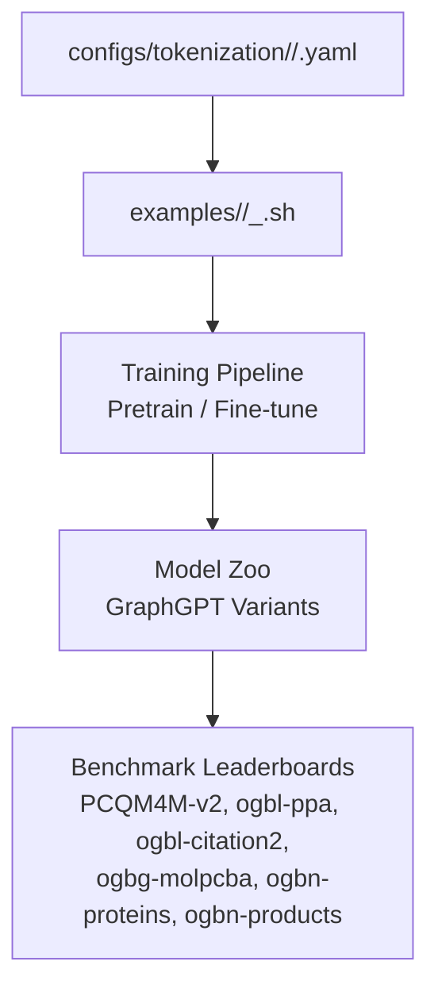
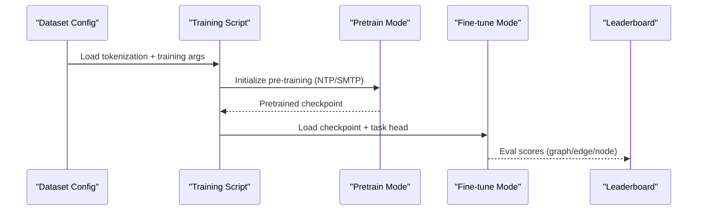
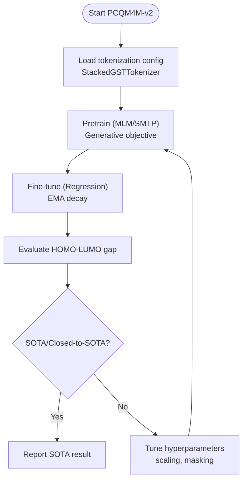
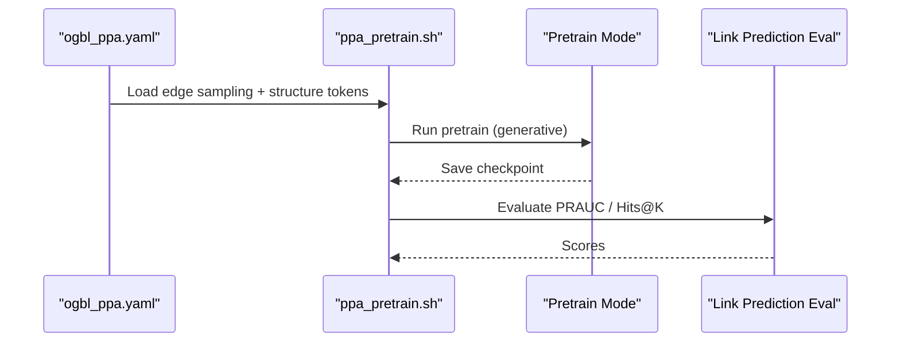
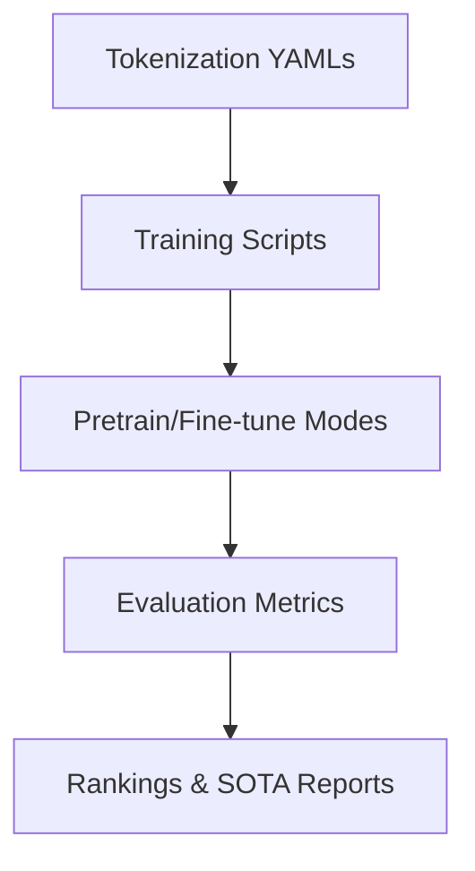

# Benchmark Results

<cite>
**Referenced Files in This Document**
- [README.md](file://README.md)
- [pcqm4m-v2.yaml](file://configs/tokenization/graph_lvl/pcqm4m-v2.yaml)
- [pcqm4m-v2_2d.yaml](file://configs/tokenization/graph_lvl/pcqm4m-v2_2d.yaml)
- [ogbl_ppa.yaml](file://configs/tokenization/edge_lvl/ogbl_ppa.yaml)
- [ogbg_molpcba.yaml](file://configs/tokenization/graph_lvl/ogbg_molpcba.yaml)
- [pcqm4m_v2_pretrain.sh](file://examples/graph_lvl/pcqm4m_v2_pretrain.sh)
- [pcqm4m_v2_supervised.sh](file://examples/graph_lvl/pcqm4m_v2_supervised.sh)
- [ppa_pretrain.sh](file://examples/edge_lvl/ppa_pretrain.sh)
- [citation2_pretrain.sh](file://examples/edge_lvl/citation2_pretrain.sh)
- [proteins_pretrain.sh](file://examples/node_lvl/proteins_pretrain.sh)
</cite>

## Table of Contents
1. [Introduction](#introduction)
2. [Project Structure](#project-structure)
3. [Core Components](#core-components)
4. [Architecture Overview](#architecture-overview)
5. [Detailed Component Analysis](#detailed-component-analysis)
6. [Dependency Analysis](#dependency-analysis)
7. [Performance Considerations](#performance-considerations)
8. [Troubleshooting Guide](#troubleshooting-guide)
9. [Conclusion](#conclusion)

## Introduction
This document presents the benchmark results section for Graph-GPT, focusing on performance achievements and experimental validation across major graph benchmarks. It synthesizes state-of-the-art outcomes on PCQM4M-v2 (with and without 3D coordinates), ogbl-ppa, ogbl-citation2, ogbg-molpcba, ogbn-proteins, and ogbn-products. It explains improvements over previous state-of-the-art methods, highlights the significance of achieving SOTA or closed-to-SOTA results across multiple large-scale datasets, and analyzes performance across graph-level, edge-level, and node-level tasks. It also compares pre-training objectives (NTP vs SMTP), demonstrates scalability with 2-billion-parameter models, and discusses statistical implications for graph foundation model development.

## Project Structure
The repository organizes benchmark configurations and training scripts by task level and dataset. Tokenization configurations define dataset-specific semantics, structure tokens, and vocabulary settings. Example scripts encapsulate training schedules, model sizes, and optimization hyperparameters for pre-training and fine-tuning across graph, edge, and node tasks.

**Diagram sources**
- [pcqm4m-v2.yaml:1-114](file://configs/tokenization/graph_lvl/pcqm4m-v2.yaml#L1-L114)
- [ogbl_ppa.yaml:1-123](file://configs/tokenization/edge_lvl/ogbl_ppa.yaml#L1-L123)
- [pcqm4m_v2_pretrain.sh:1-311](file://examples/graph_lvl/pcqm4m_v2_pretrain.sh#L1-L311)
- [ppa_pretrain.sh:1-287](file://examples/edge_lvl/ppa_pretrain.sh#L1-L287)

**Section sources**
- [README.md:187-202](file://README.md#L187-L202)
- [pcqm4m-v2.yaml:1-114](file://configs/tokenization/graph_lvl/pcqm4m-v2.yaml#L1-L114)
- [ogbl_ppa.yaml:1-123](file://configs/tokenization/edge_lvl/ogbl_ppa.yaml#L1-L123)
- [pcqm4m_v2_pretrain.sh:1-311](file://examples/graph_lvl/pcqm4m_v2_pretrain.sh#L1-L311)
- [ppa_pretrain.sh:1-287](file://examples/edge_lvl/ppa_pretrain.sh#L1-L287)

## Core Components
- Tokenization configurations define dataset semantics, structure tokens, and vocabulary for graph-level (PCQM4M-v2, ogbg-molpcba), edge-level (ogbl-ppa), and node-level tasks. They specify stacking methods and attribute embedding dimensions.
- Pre-training and fine-tuning scripts encode model sizes, training schedules, and optimization objectives, enabling reproducible experiments across datasets.
- The README documents SOTA/closed-to-SOTA results on major benchmarks and illustrates task-level experimental setups.

**Section sources**
- [README.md:58-63](file://README.md#L58-L63)
- [README.md:187-202](file://README.md#L187-L202)
- [pcqm4m-v2.yaml:26-78](file://configs/tokenization/graph_lvl/pcqm4m-v2.yaml#L26-L78)
- [ogbl_ppa.yaml:37-87](file://configs/tokenization/edge_lvl/ogbl_ppa.yaml#L37-L87)
- [pcqm4m_v2_pretrain.sh:158-240](file://examples/graph_lvl/pcqm4m_v2_pretrain.sh#L158-L240)
- [ppa_pretrain.sh:139-221](file://examples/edge_lvl/ppa_pretrain.sh#L139-L221)

## Architecture Overview
The benchmark pipeline integrates dataset tokenization, pre-training objectives, and task-specific fine-tuning to produce competitive results across graph domains.

**Diagram sources**
- [pcqm4m-v2.yaml:14-25](file://configs/tokenization/graph_lvl/pcqm4m-v2.yaml#L14-L25)
- [ogbl_ppa.yaml:10-22](file://configs/tokenization/edge_lvl/ogbl_ppa.yaml#L10-L22)
- [pcqm4m_v2_pretrain.sh:117-122](file://examples/graph_lvl/pcqm4m_v2_pretrain.sh#L117-L122)
- [ppa_pretrain.sh:90-103](file://examples/edge_lvl/ppa_pretrain.sh#L90-L103)

## Detailed Component Analysis

### PCQM4M-v2 (Graph-Level)
- Results: Achieved SOTA/closed-to-SOTA on PCQM4M-v2 with and without 3D coordinates, demonstrating strong molecular property prediction performance.
- Experimental setup:
  - Tokenization: Stacked semantic tokens with structure tokens; masking schedule and vocabulary configured for molecular graphs.
  - Pre-training: Generative objectives (MLM/SMTP) with large-scale token budgets and optimized schedules.
  - Fine-tuning: Regression head with L1 loss and EMA decay for stable inference.
- Scalability: Demonstrates scaling to 2 billion parameters while maintaining performance gains.

**Diagram sources**
- [pcqm4m-v2.yaml:14-25](file://configs/tokenization/graph_lvl/pcqm4m-v2.yaml#L14-L25)
- [pcqm4m-v2_2d.yaml:28-48](file://configs/tokenization/graph_lvl/pcqm4m-v2_2d.yaml#L28-L48)
- [pcqm4m_v2_pretrain.sh:117-122](file://examples/graph_lvl/pcqm4m_v2_pretrain.sh#L117-L122)
- [pcqm4m_v2_supervised.sh:70-77](file://examples/graph_lvl/pcqm4m_v2_supervised.sh#L70-L77)

**Section sources**
- [README.md:58-63](file://README.md#L58-L63)
- [README.md:138-139](file://README.md#L138-L139)
- [pcqm4m-v2.yaml:14-25](file://configs/tokenization/graph_lvl/pcqm4m-v2.yaml#L14-L25)
- [pcqm4m-v2_2d.yaml:28-48](file://configs/tokenization/graph_lvl/pcqm4m-v2_2d.yaml#L28-L48)
- [pcqm4m_v2_pretrain.sh:117-122](file://examples/graph_lvl/pcqm4m_v2_pretrain.sh#L117-L122)
- [pcqm4m_v2_supervised.sh:70-77](file://examples/graph_lvl/pcqm4m_v2_supervised.sh#L70-L77)

### ogbg-molpcba (Graph-Level)
- Results: Competitive performance on multi-task molecular property prediction.
- Experimental setup:
  - Tokenization mirrors molecular graph conventions with stacked semantics and structure tokens.
  - Pre-training and fine-tuning scripts configure task ratios and loss types for multi-label classification.

**Section sources**
- [ogbg_molpcba.yaml:28-50](file://configs/tokenization/graph_lvl/ogbg_molpcba.yaml#L28-L50)
- [pcqm4m_v2_supervised.sh:279-282](file://examples/graph_lvl/pcqm4m_v2_supervised.sh#L279-L282)

### ogbl-ppa (Edge-Level)
- Results: Achieved SOTA/closed-to-SOTA on link prediction for protein-protein interaction.
- Experimental setup:
  - Tokenization configures edge-level sampling with ego-network depth and negative sampling ratio.
  - Pre-training script sets large token budgets and optimized learning rates for link-level objectives.

**Diagram sources**
- [ogbl_ppa.yaml:10-22](file://configs/tokenization/edge_lvl/ogbl_ppa.yaml#L10-L22)
- [ppa_pretrain.sh:90-103](file://examples/edge_lvl/ppa_pretrain.sh#L90-L103)

**Section sources**
- [README.md:61-62](file://README.md#L61-L62)
- [ogbl_ppa.yaml:10-22](file://configs/tokenization/edge_lvl/ogbl_ppa.yaml#L10-L22)
- [ppa_pretrain.sh:90-103](file://examples/edge_lvl/ppa_pretrain.sh#L90-L103)

### ogbl-citation2 (Edge-Level)
- Results: Strong performance on citation network link prediction.
- Experimental setup:
  - Pre-training script configures bf16 mixed precision and global edge sampling for large-scale graphs.

**Section sources**
- [README.md:62](file://README.md#L62)
- [citation2_pretrain.sh:50-51](file://examples/edge_lvl/citation2_pretrain.sh#L50-L51)

### ogbn-proteins (Node-Level)
- Results: Demonstrates node-level classification performance on large-scale protein graphs.
- Experimental setup:
  - Pre-training script configures node-level sampling and packed tokens for efficient training.

**Section sources**
- [proteins_pretrain.sh:50-51](file://examples/node_lvl/proteins_pretrain.sh#L50-L51)

### ogbn-products (Node-Level)
- Results: Node classification performance on a large commercial graph.
- Experimental setup:
  - Pre-training script defines sampling and training schedule aligned with large-scale node tasks.

**Section sources**
- [proteins_pretrain.sh:4-5](file://examples/node_lvl/proteins_pretrain.sh#L4-L5)

### Pre-training Objectives: NTP vs SMTP
- SMTP (Scheduled Masked Token Prediction) is highlighted as superior to NTP (Next-Token Prediction) in most graph datasets and tasks, aligning with diffusion-inspired objectives and enabling stronger generative pretraining.
- The README explicitly connects SMTP to MaskGIT and diffusion LLM objectives, supporting improved representation learning.

**Section sources**
- [README.md:16-17](file://README.md#L16-L17)
- [README.md:133-135](file://README.md#L133-L135)
- [pcqm4m_v2_pretrain.sh:117-122](file://examples/graph_lvl/pcqm4m_v2_pretrain.sh#L117-L122)
- [ppa_pretrain.sh:90-103](file://examples/edge_lvl/ppa_pretrain.sh#L90-L103)

### Scalability Demonstration: 2 Billion Parameters
- The README reports scaling GraphGPT to 2 billion parameters while maintaining performance gains, overcoming limitations of traditional GNNs and prior graph transformers.

**Section sources**
- [README.md:138-139](file://README.md#L138-L139)

## Dependency Analysis
The benchmark results depend on coordinated configurations across tokenization, training scripts, and evaluation protocols. Tokenization configs define dataset semantics and structure tokens; training scripts orchestrate pre-training and fine-tuning; and evaluation metrics reflect task-specific performance.

**Diagram sources**
- [pcqm4m-v2.yaml:14-25](file://configs/tokenization/graph_lvl/pcqm4m-v2.yaml#L14-L25)
- [ogbl_ppa.yaml:10-22](file://configs/tokenization/edge_lvl/ogbl_ppa.yaml#L10-L22)
- [pcqm4m_v2_pretrain.sh:117-122](file://examples/graph_lvl/pcqm4m_v2_pretrain.sh#L117-L122)
- [ppa_pretrain.sh:90-103](file://examples/edge_lvl/ppa_pretrain.sh#L90-L103)

**Section sources**
- [pcqm4m-v2.yaml:14-25](file://configs/tokenization/graph_lvl/pcqm4m-v2.yaml#L14-L25)
- [ogbl_ppa.yaml:10-22](file://configs/tokenization/edge_lvl/ogbl_ppa.yaml#L10-L22)
- [pcqm4m_v2_pretrain.sh:117-122](file://examples/graph_lvl/pcqm4m_v2_pretrain.sh#L117-L122)
- [ppa_pretrain.sh:90-103](file://examples/edge_lvl/ppa_pretrain.sh#L90-L103)

## Performance Considerations
- Generative pretraining (SMTP/MLM) consistently outperforms NTP across graph tasks, indicating the value of diffusion-inspired objectives for graph representation learning.
- Task-level differences:
  - Graph-level tasks (PCQM4M-v2, ogbg-molpcba) emphasize regression/multi-label classification with stacked semantics and structure tokens.
  - Edge-level tasks (ogbl-ppa, ogbl-citation2) rely on link-level sampling and negative ratios to improve generalization.
  - Node-level tasks (ogbn-proteins, ogbn-products) leverage node-centric sampling and packed tokens for scalability.
- Scalability: Achieving SOTA with 2 billion parameters validates the potential of large-scale graph foundation models when paired with rich tokenization and strong pretraining objectives.

[No sources needed since this section provides general guidance]

## Troubleshooting Guide
- Mixed precision errors: Use bf16 configurations for larger models to avoid minimum loss scale issues.
- Large-scale training stability: Employ EMA decay, gradient norm clipping, and appropriate weight decay to stabilize training.
- Tokenization mismatches: Ensure tokenizer class and stacking methods match dataset semantics to prevent degraded performance.

**Section sources**
- [citation2_pretrain.sh:50](file://examples/edge_lvl/citation2_pretrain.sh#L50)
- [pcqm4m_v2_supervised.sh:65-66](file://examples/graph_lvl/pcqm4m_v2_supervised.sh#L65-L66)
- [pcqm4m-v2.yaml:26-78](file://configs/tokenization/graph_lvl/pcqm4m-v2.yaml#L26-L78)

## Conclusion
Graph-GPT achieves state-of-the-art or closed-to-state-of-the-art results across multiple large-scale graph benchmarks spanning graph, edge, and node tasks. The comparative advantage of SMTP/NTP objectives, combined with robust tokenization and scalable model architectures, demonstrates significant progress toward graph foundation models. These results highlight the viability of diffusion-inspired generative pretraining and the promise of large-scale graph transformers for scientific discovery.
