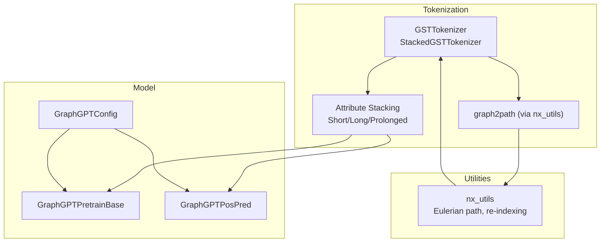
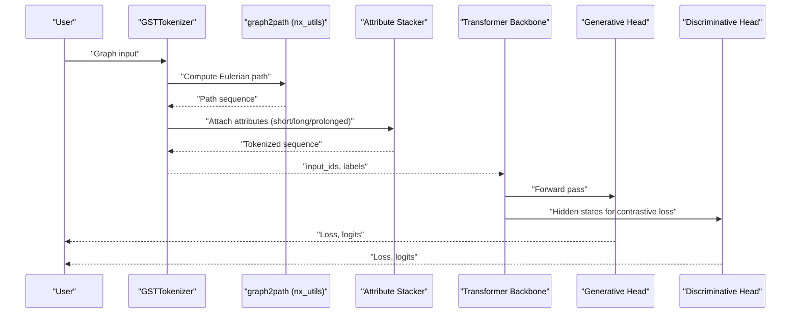
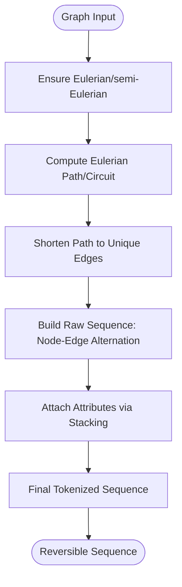
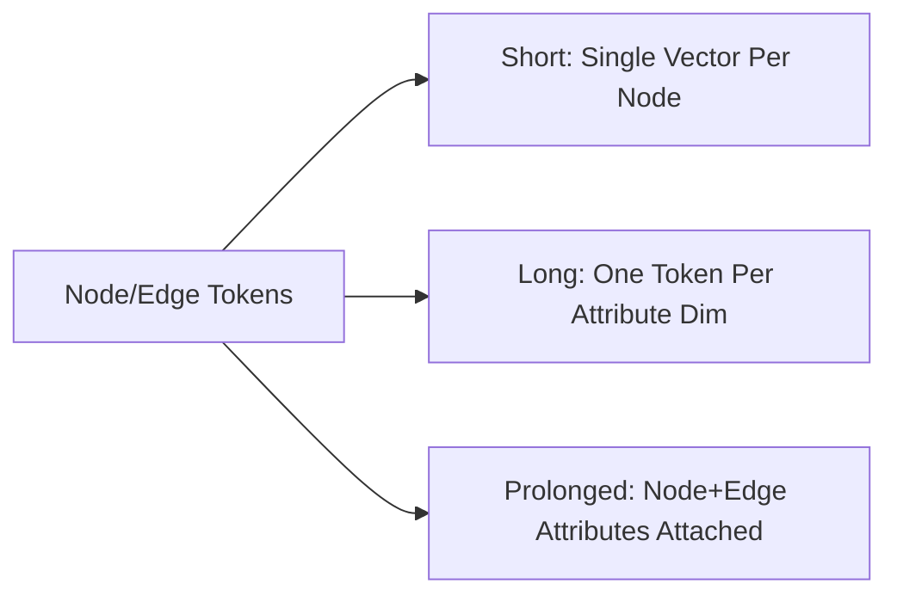
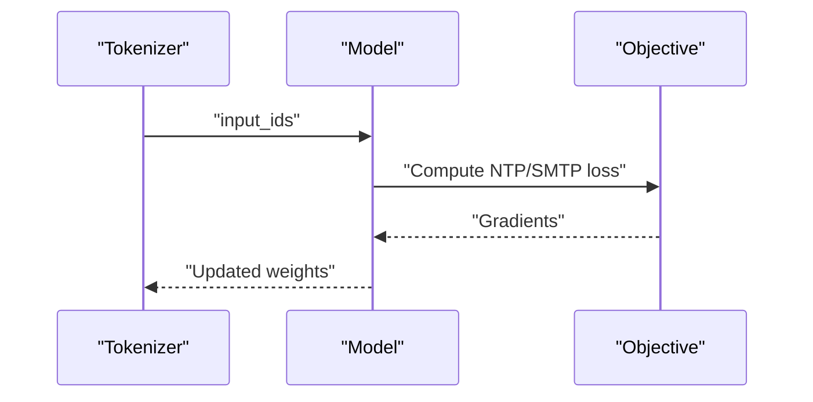
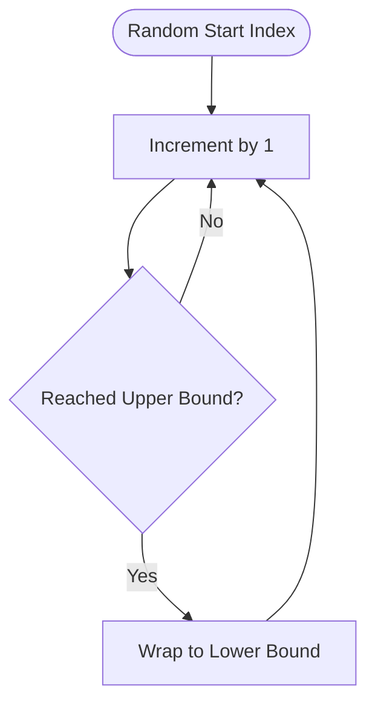
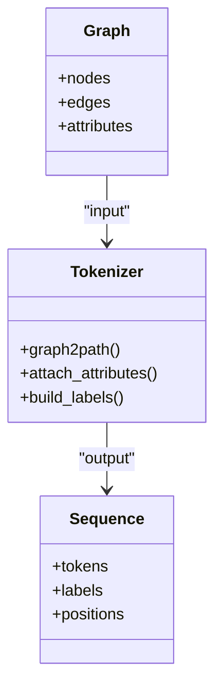
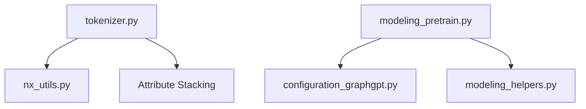

# Core Concepts

<cite>
**Referenced Files in This Document**
- [README.md](file://README.md)
- [configuration_graphgpt.py](file://src/models/graphgpt/configuration_graphgpt.py)
- [modeling_pretrain.py](file://src/models/graphgpt/modeling_pretrain.py)
- [modeling_helpers.py](file://src/models/graphgpt/modeling_helpers.py)
- [tokenizer.py](file://src/data/tokenizer.py)
- [nx_utils.py](file://src/utils/nx_utils.py)
</cite>

## Table of Contents
1. [Introduction](#introduction)
2. [Project Structure](#project-structure)
3. [Core Components](#core-components)
4. [Architecture Overview](#architecture-overview)
5. [Detailed Component Analysis](#detailed-component-analysis)
6. [Dependency Analysis](#dependency-analysis)
7. [Performance Considerations](#performance-considerations)
8. [Troubleshooting Guide](#troubleshooting-guide)
9. [Conclusion](#conclusion)

## Introduction
This document explains the core concepts behind Graph-GPT with a focus on graph theory and transformer fundamentals essential to understanding the framework. It covers:
- Eulerian paths and their role in converting graphs to reversible sequences
- The Graph Eulerian Transformer (GET) architecture
- Next-token prediction (NTP) versus scheduled masked-token prediction (SMTP) objectives
- Three attribute stacking methods (short, long, prolonged)
- Cyclical node re-indexing
- Beginner-friendly graph theory and tokenization foundations
- Mathematical and conceptual diagrams showing how graphs become reversible sequences while preserving structure

## Project Structure
At a high level, Graph-GPT consists of:
- A tokenizer that converts graphs into Eulerian sequences and attaches attributes
- A transformer-based model (GET) that operates on these sequences
- Training modes supporting NTP and SMTP objectives
- Utilities for graph transformations and node re-indexing

**Diagram sources**
- [tokenizer.py:425-535](file://src/data/tokenizer.py#L425-L535)
- [nx_utils.py:351-422](file://src/utils/nx_utils.py#L351-L422)
- [modeling_pretrain.py:57-118](file://src/models/graphgpt/modeling_pretrain.py#L57-L118)
- [configuration_graphgpt.py:6-50](file://src/models/graphgpt/configuration_graphgpt.py#L6-L50)

**Section sources**
- [README.md:127-186](file://README.md#L127-L186)
- [tokenizer.py:425-535](file://src/data/tokenizer.py#L425-L535)
- [nx_utils.py:351-422](file://src/utils/nx_utils.py#L351-L422)
- [modeling_pretrain.py:57-118](file://src/models/graphgpt/modeling_pretrain.py#L57-L118)
- [configuration_graphgpt.py:6-50](file://src/models/graphgpt/configuration_graphgpt.py#L6-L50)

## Core Components
- Graph-to-Eulerian sequence conversion: The tokenizer transforms a graph into an Eulerian path and then into a sequence of tokens representing nodes, edges, and attributes. This transformation is designed to be reversible, preserving structural information.
- Attribute stacking: Attributes (node/edge/graph) are attached to tokens using three methods:
  - Short stacking: Concatenate all attributes for each node as a single token vector
  - Long stacking: Separate tokens per attribute dimension
  - Prolonged stacking: Attach attributes to both nodes and edges in a structured way
- Objective functions:
  - NTP (next-token prediction): Predict the next token in the sequence
  - SMTP (scheduled masked-token prediction): Mask tokens according to a schedule and predict them; GraphGPT supports a 2D variant for graph-level tasks and a 3D variant for positional tasks
- Cyclical node re-indexing: Nodes are re-indexed cyclically to improve training coverage across indices

**Section sources**
- [README.md:143-186](file://README.md#L143-L186)
- [tokenizer.py:897-1186](file://src/data/tokenizer.py#L897-L1186)
- [modeling_helpers.py:399-469](file://src/models/graphgpt/modeling_helpers.py#L399-L469)
- [nx_utils.py:234-260](file://src/utils/nx_utils.py#L234-L260)

## Architecture Overview
The GET architecture couples a standard transformer backbone with a graph-to-sequence transformation via Eulerian paths. The model supports dual-head training:
- Generative head: NTP/SMTP objectives
- Discriminative head: Contrastive loss for improved representation learning

**Diagram sources**
- [tokenizer.py:425-535](file://src/data/tokenizer.py#L425-L535)
- [nx_utils.py:351-422](file://src/utils/nx_utils.py#L351-L422)
- [modeling_pretrain.py:152-266](file://src/models/graphgpt/modeling_pretrain.py#L152-L266)

**Section sources**
- [modeling_pretrain.py:57-118](file://src/models/graphgpt/modeling_pretrain.py#L57-L118)
- [configuration_graphgpt.py:56-120](file://src/models/graphgpt/configuration_graphgpt.py#L56-L120)

## Detailed Component Analysis

### Eulerian Path Transformation and Reversible Sequence Construction
- Purpose: Convert a graph into a sequence that captures structural adjacency and allows reconstruction of the original graph.
- Steps:
  1. Eulerize the graph (ensure Eulerian or semi-Eulerian properties)
  2. Compute an Eulerian path/circuit
  3. Shorten the path to avoid redundant traversals
  4. Convert the path into a tokenized sequence of nodes and edges
  5. Attach attributes to tokens using stacking strategies
- Reversibility: The process preserves node-edge relationships and can be reversed to reconstruct the graph.

**Diagram sources**
- [nx_utils.py:351-422](file://src/utils/nx_utils.py#L351-L422)
- [nx_utils.py:425-437](file://src/utils/nx_utils.py#L425-L437)
- [tokenizer.py:425-535](file://src/data/tokenizer.py#L425-L535)

**Section sources**
- [nx_utils.py:351-422](file://src/utils/nx_utils.py#L351-L422)
- [nx_utils.py:425-437](file://src/utils/nx_utils.py#L425-L437)
- [tokenizer.py:425-535](file://src/data/tokenizer.py#L425-L535)

### Attribute Stacking Methods: Short, Long, and Prolonged
- Short stacking:
  - Concatenates all attributes for each node into a single token vector
  - Reduces sequence length and speeds up training
- Long stacking:
  - Uses separate tokens per attribute dimension
  - Provides finer-grained supervision per attribute
- Prolonged stacking:
  - Extends the sequence by attaching attributes to both nodes and edges
  - Preserves richer structural semantics

**Diagram sources**
- [tokenizer.py:1196-1359](file://src/data/tokenizer.py#L1196-L1359)

**Section sources**
- [tokenizer.py:1196-1359](file://src/data/tokenizer.py#L1196-L1359)

### Next-Token Prediction (NTP) vs Scheduled Masked-Token Prediction (SMTP)
- NTP:
  - Predicts the next token in the sequence
  - Simpler objective; commonly used in autoregressive language modeling
- SMTP:
  - Masks tokens according to a schedule and predicts them
  - Supports 2D masking for graph-level tasks and 3D masking for positional tasks
  - Enables generative pre-training aligned with diffusion objectives

**Diagram sources**
- [modeling_pretrain.py:152-266](file://src/models/graphgpt/modeling_pretrain.py#L152-L266)
- [modeling_helpers.py:399-469](file://src/models/graphgpt/modeling_helpers.py#L399-L469)

**Section sources**
- [modeling_pretrain.py:84-118](file://src/models/graphgpt/modeling_pretrain.py#L84-L118)
- [modeling_helpers.py:399-469](file://src/models/graphgpt/modeling_helpers.py#L399-L469)

### Cyclical Node Re-Indexing
- Motivation: Prevent overtraining on low-index nodes and ensure balanced coverage across node indices
- Technique:
  - Start from a random index within a range and increment by one
  - Wrap around after reaching the upper bound (cyclic)
- Impact: Improves generalization and training stability

**Diagram sources**
- [nx_utils.py:234-260](file://src/utils/nx_utils.py#L234-L260)
- [tokenizer.py:664-678](file://src/data/tokenizer.py#L664-L678)

**Section sources**
- [README.md:178-185](file://README.md#L178-L185)
- [nx_utils.py:234-260](file://src/utils/nx_utils.py#L234-L260)
- [tokenizer.py:664-678](file://src/data/tokenizer.py#L664-L678)

### Beginner-Friendly Graph Theory and Tokenization Foundations
- Graph theory basics:
  - Node: vertex in the graph
  - Edge: connection between nodes
  - Path: sequence of edges connecting nodes
  - Eulerian path/circuit: visits every edge exactly once; circuit returns to start
- Tokenization:
  - Nodes and edges are encoded as tokens
  - Attributes are attached to tokens using stacking strategies
  - Labels are constructed to align with the sequence for supervised objectives

**Diagram sources**
- [nx_utils.py:351-422](file://src/utils/nx_utils.py#L351-L422)
- [tokenizer.py:425-535](file://src/data/tokenizer.py#L425-L535)

**Section sources**
- [nx_utils.py:351-422](file://src/utils/nx_utils.py#L351-L422)
- [tokenizer.py:425-535](file://src/data/tokenizer.py#L425-L535)

## Dependency Analysis
- Tokenizer depends on:
  - Graph transformation utilities (Eulerian path computation, path shortening)
  - Attribute mapping and stacking logic
- Model depends on:
  - Configuration for transformer backbone and pre-training objectives
  - Helper functions for masking, loss computation, and positional tokenization

**Diagram sources**
- [tokenizer.py:425-535](file://src/data/tokenizer.py#L425-L535)
- [nx_utils.py:351-422](file://src/utils/nx_utils.py#L351-L422)
- [modeling_pretrain.py:57-118](file://src/models/graphgpt/modeling_pretrain.py#L57-L118)
- [configuration_graphgpt.py:6-50](file://src/models/graphgpt/configuration_graphgpt.py#L6-L50)
- [modeling_helpers.py:1-50](file://src/models/graphgpt/modeling_helpers.py#L1-L50)

**Section sources**
- [tokenizer.py:425-535](file://src/data/tokenizer.py#L425-L535)
- [nx_utils.py:351-422](file://src/utils/nx_utils.py#L351-L422)
- [modeling_pretrain.py:57-118](file://src/models/graphgpt/modeling_pretrain.py#L57-L118)
- [configuration_graphgpt.py:6-50](file://src/models/graphgpt/configuration_graphgpt.py#L6-L50)
- [modeling_helpers.py:1-50](file://src/models/graphgpt/modeling_helpers.py#L1-L50)

## Performance Considerations
- Attribute stacking impacts sequence length and compute:
  - Short stacking reduces sequence length and accelerates training
  - Long stacking increases supervision granularity but may raise memory usage
- SMTP scheduling and replacement rates influence training dynamics and convergence
- Positional tokenization (line/cube/mix) affects 3D pre-training costs and accuracy

[No sources needed since this section provides general guidance]

## Troubleshooting Guide
- Disconnected graphs:
  - Ensure connectivity before computing Eulerian paths; the utilities connect components when needed
- Non-Eulerian graphs:
  - Eulerize the graph to guarantee a valid path
- Label padding:
  - Use appropriate label padding tokens to ignore irrelevant positions during loss computation
- Positional masking:
  - Verify mask schedules and replacement rates for 2D/3D SMTP objectives

**Section sources**
- [nx_utils.py:293-328](file://src/utils/nx_utils.py#L293-L328)
- [nx_utils.py:351-422](file://src/utils/nx_utils.py#L351-L422)
- [modeling_helpers.py:145-177](file://src/models/graphgpt/modeling_helpers.py#L145-L177)
- [modeling_helpers.py:399-469](file://src/models/graphgpt/modeling_helpers.py#L399-L469)

## Conclusion
Graph-GPT introduces a principled fusion of graph theory and transformer modeling through Eulerian path-based sequence conversion. The GET architecture leverages NTP and SMTP objectives, supports flexible attribute stacking strategies, and employs cyclical node re-indexing to improve training coverage. Together, these components enable scalable, reversible graph serialization suitable for downstream tasks across node, edge, and graph levels.

[No sources needed since this section summarizes without analyzing specific files]
