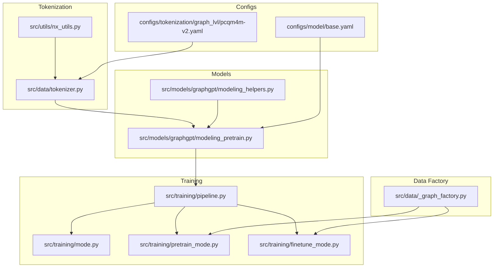
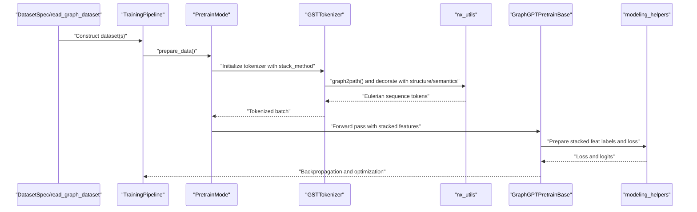
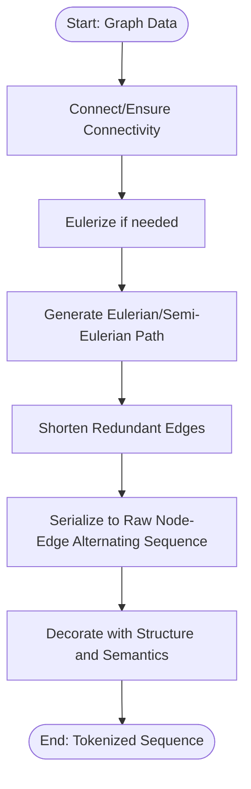
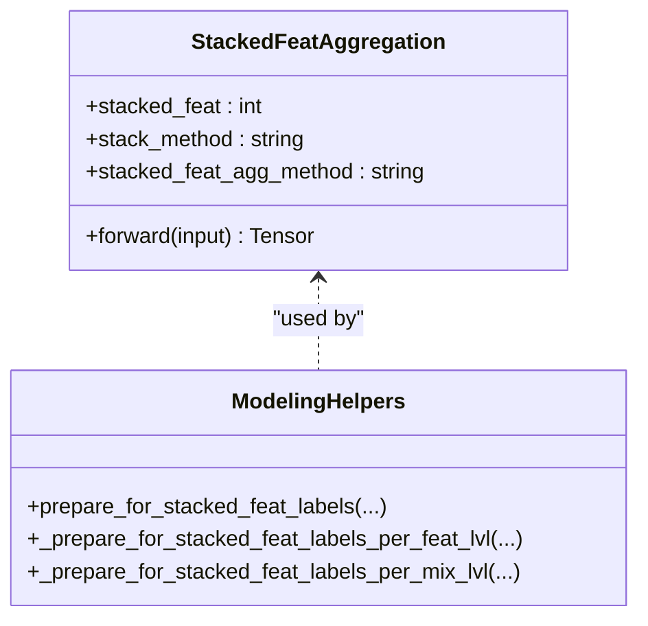
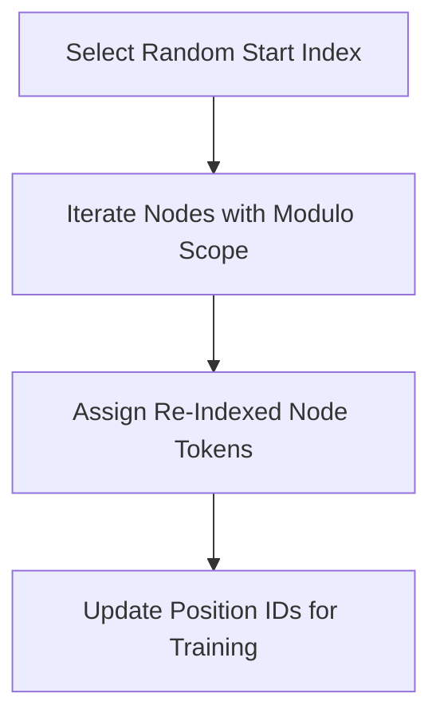
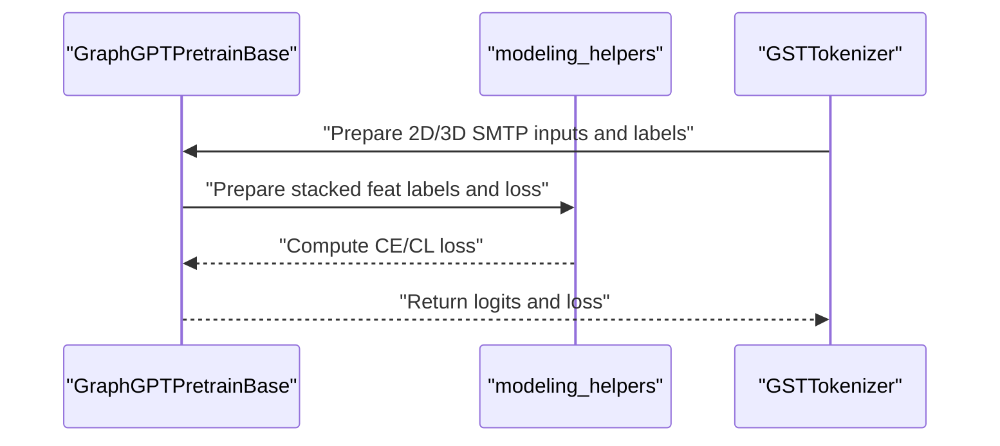
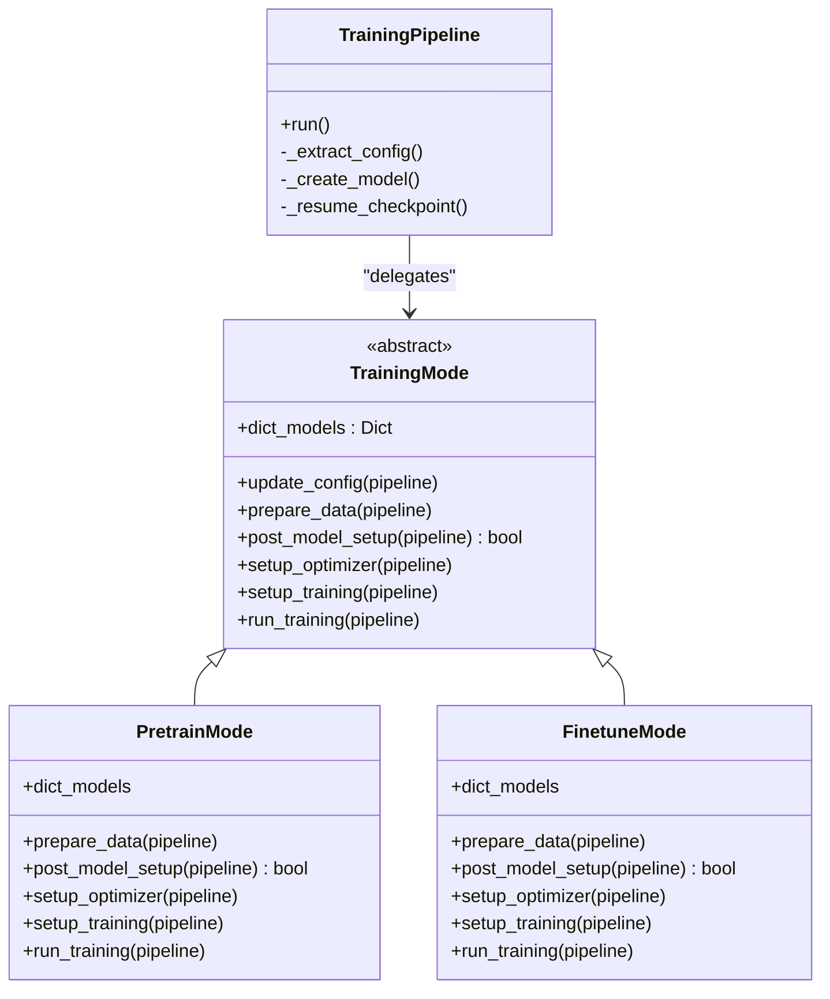
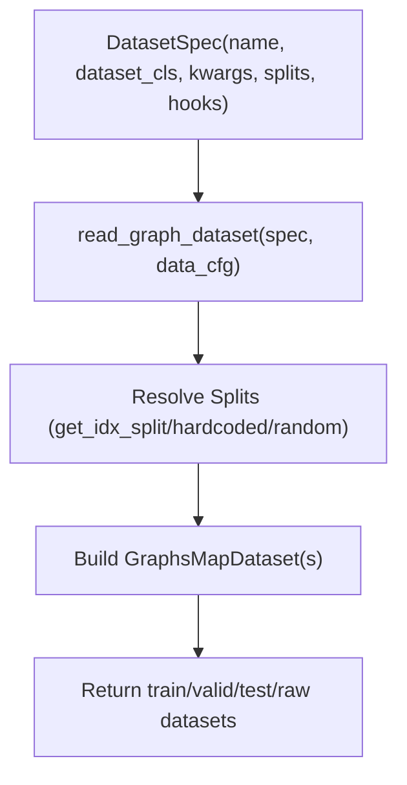
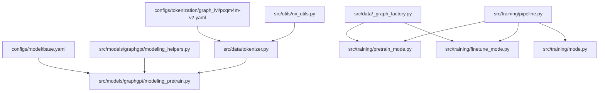

# Key Innovations

<cite>
**Referenced Files in This Document**
- [README.md](file://README.md)
- [src/utils/nx_utils.py](file://src/utils/nx_utils.py)
- [src/data/tokenizer.py](file://src/data/tokenizer.py)
- [src/models/graphgpt/modeling_pretrain.py](file://src/models/graphgpt/modeling_pretrain.py)
- [src/models/graphgpt/modeling_helpers.py](file://src/models/graphgpt/modeling_helpers.py)
- [src/training/pipeline.py](file://src/training/pipeline.py)
- [src/training/mode.py](file://src/training/mode.py)
- [src/training/pretrain_mode.py](file://src/training/pretrain_mode.py)
- [src/training/finetune_mode.py](file://src/training/finetune_mode.py)
- [src/data/_graph_factory.py](file://src/data/_graph_factory.py)
- [configs/model/base.yaml](file://configs/model/base.yaml)
- [configs/tokenization/graph_lvl/pcqm4m-v2.yaml](file://configs/tokenization/graph_lvl/pcqm4m-v2.yaml)
</cite>

## Table of Contents
1. [Introduction](#introduction)
2. [Project Structure](#project-structure)
3. [Core Components](#core-components)
4. [Architecture Overview](#architecture-overview)
5. [Detailed Component Analysis](#detailed-component-analysis)
6. [Dependency Analysis](#dependency-analysis)
7. [Performance Considerations](#performance-considerations)
8. [Troubleshooting Guide](#troubleshooting-guide)
9. [Conclusion](#conclusion)

## Introduction
This document presents the key innovations behind Graph-GPT, focusing on the novel contributions and technical breakthroughs that distinguish it from traditional GNNs and prior graph transformers. The innovations include:
- Eulerian path-based graph-to-sequence transformation
- Three attribute stacking strategies (short, long, prolonged)
- Cyclical node re-indexing
- Pre-training objective innovations adopting SMTP from MaskGIT and advantages over NTP in graph domains
- Unified training pipeline with strategy pattern implementation
- Model decomposition approach
- Registry-driven dataset factory system

These innovations collectively enable scalable, efficient, and effective graph foundation modeling with strong empirical performance across large-scale benchmarks.

## Project Structure
The repository is organized around modular components supporting:
- Tokenization and graph-to-sequence conversion
- Pre-training and fine-tuning models
- Unified training orchestration via strategy pattern
- Registry-driven dataset factory for generalized data sources
- Configuration-driven model and tokenization settings

**Diagram sources**
- [src/data/tokenizer.py:30-612](file://src/data/tokenizer.py#L30-L612)
- [src/utils/nx_utils.py:125-202](file://src/utils/nx_utils.py#L125-L202)
- [src/models/graphgpt/modeling_pretrain.py:57-266](file://src/models/graphgpt/modeling_pretrain.py#L57-L266)
- [src/models/graphgpt/modeling_helpers.py:89-114](file://src/models/graphgpt/modeling_helpers.py#L89-L114)
- [src/training/pipeline.py:15-96](file://src/training/pipeline.py#L15-L96)
- [src/training/mode.py:5-90](file://src/training/mode.py#L5-L90)
- [src/training/pretrain_mode.py:48-227](file://src/training/pretrain_mode.py#L48-L227)
- [src/training/finetune_mode.py:43-199](file://src/training/finetune_mode.py#L43-L199)
- [src/data/_graph_factory.py:50-101](file://src/data/_graph_factory.py#L50-L101)
- [configs/model/base.yaml:60-64](file://configs/model/base.yaml#L60-L64)
- [configs/tokenization/graph_lvl/pcqm4m-v2.yaml:10-11](file://configs/tokenization/graph_lvl/pcqm4m-v2.yaml#L10-L11)

**Section sources**
- [README.md:248-285](file://README.md#L248-L285)

## Core Components
This section highlights the core innovations and their implementation:

- Eulerian path-based graph-to-sequence transformation
  - Converts graphs (or sampled subgraphs) into reversible node-edge alternating sequences using Eulerian paths, enabling standard transformer architectures to process graph data.
  - Includes graph connectivity enhancement and path shortening to minimize redundancy.

- Attribute stacking strategies
  - Short: stacks features per token with mixed-level handling to reduce memory and improve speed.
  - Long: aggregates features per token with per-feature weighting.
  - Prolonged: extends tokenization to incorporate richer semantic structures.

- Cyclical node re-indexing
  - Randomly initializes node indices within a configurable range and increments modulo the range to ensure balanced training coverage across indices.

- SMTP adoption from MaskGIT
  - Scheduled masked token prediction (SMTP) pre-training objectives adapted for graph domains, offering advantages over next-token prediction (NTP) in terms of robustness and performance on graph tasks.

- Unified training pipeline with strategy pattern
  - TrainingPipeline orchestrates shared setup while delegating mode-specific behavior to TrainingMode subclasses (pretrain/finetune), reducing duplication and improving maintainability.

- Model decomposition approach
  - The monolithic modeling module was split into common, helpers, pretrain, and fine-tune components, preserving backward compatibility while enhancing modularity.

- Registry-driven dataset factory
  - DatasetSpec and read_graph_dataset provide a declarative, extensible mechanism to define and instantiate datasets without duplicating reader logic.

**Section sources**
- [README.md:130-186](file://README.md#L130-L186)
- [src/utils/nx_utils.py:125-202](file://src/utils/nx_utils.py#L125-L202)
- [src/data/tokenizer.py:639-685](file://src/data/tokenizer.py#L639-L685)
- [src/models/graphgpt/modeling_pretrain.py:57-118](file://src/models/graphgpt/modeling_pretrain.py#L57-L118)
- [src/training/pipeline.py:15-96](file://src/training/pipeline.py#L15-L96)
- [src/data/_graph_factory.py:19-48](file://src/data/_graph_factory.py#L19-L48)

## Architecture Overview
The end-to-end pipeline integrates tokenization, model heads, and training orchestration:

**Diagram sources**
- [src/data/_graph_factory.py:50-101](file://src/data/_graph_factory.py#L50-L101)
- [src/training/pipeline.py:60-96](file://src/training/pipeline.py#L60-L96)
- [src/training/pretrain_mode.py:97-227](file://src/training/pretrain_mode.py#L97-L227)
- [src/data/tokenizer.py:585-612](file://src/data/tokenizer.py#L585-L612)
- [src/utils/nx_utils.py:351-422](file://src/utils/nx_utils.py#L351-L422)
- [src/models/graphgpt/modeling_pretrain.py:152-266](file://src/models/graphgpt/modeling_pretrain.py#L152-L266)
- [src/models/graphgpt/modeling_helpers.py:362-393](file://src/models/graphgpt/modeling_helpers.py#L362-L393)

## Detailed Component Analysis

### Eulerian Path-Based Graph-to-Sequence Transformation
- Graph-to-path conversion:
  - Ensures connectivity and Eulerization for graphs that are not Eulerian.
  - Generates Eulerian or semi-Eulerian paths and shortens redundant edges.
- Path serialization:
  - Alternates nodes and edges in a raw sequence suitable for tokenization.
- Node permutation and re-indexing:
  - Randomly permutes nodes to augment data diversity and applies cyclical re-indexing to balance index coverage.

**Diagram sources**
- [src/utils/nx_utils.py:351-422](file://src/utils/nx_utils.py#L351-L422)
- [src/utils/nx_utils.py:425-437](file://src/utils/nx_utils.py#L425-L437)
- [src/utils/nx_utils.py:594-612](file://src/utils/nx_utils.py#L594-L612)

**Section sources**
- [src/utils/nx_utils.py:351-422](file://src/utils/nx_utils.py#L351-L422)
- [src/utils/nx_utils.py:425-437](file://src/utils/nx_utils.py#L425-L437)
- [src/utils/nx_utils.py:594-612](file://src/utils/nx_utils.py#L594-L612)

### Attribute Stacking Strategies (Short/Long/Prolonged)
- Short stacking:
  - Mixed-level handling reduces memory footprint and accelerates training.
- Long stacking:
  - Per-feature weighting and aggregation tailored for token-level masking.
- Prolonged stacking:
  - Extends tokenization to capture richer semantic structures.

**Diagram sources**
- [configs/model/base.yaml:60-64](file://configs/model/base.yaml#L60-L64)
- [src/models/graphgpt/modeling_helpers.py:362-393](file://src/models/graphgpt/modeling_helpers.py#L362-L393)
- [src/models/graphgpt/modeling_helpers.py:263-301](file://src/models/graphgpt/modeling_helpers.py#L263-L301)

**Section sources**
- [configs/model/base.yaml:60-64](file://configs/model/base.yaml#L60-L64)
- [src/models/graphgpt/modeling_helpers.py:362-393](file://src/models/graphgpt/modeling_helpers.py#L362-L393)

### Cyclical Node Re-Indexing
- Randomly selects a start index within a configured scope and increments modulo the scope to ensure balanced coverage of node indices across training.
- Adjusts position IDs accordingly to maintain positional awareness.

**Diagram sources**
- [src/data/tokenizer.py:639-685](file://src/data/tokenizer.py#L639-L685)
- [src/utils/nx_utils.py:234-260](file://src/utils/nx_utils.py#L234-L260)

**Section sources**
- [src/data/tokenizer.py:639-685](file://src/data/tokenizer.py#L639-L685)
- [src/utils/nx_utils.py:234-260](file://src/utils/nx_utils.py#L234-L260)

### SMTP Adoption from MaskGIT and Advantages Over NTP
- SMTP objectives:
  - Scheduled masked token prediction adapted for graph domains, enabling robust pre-training with controlled masking schedules.
- Advantages over NTP:
  - Empirical evidence indicates SMTP outperforms next-token prediction on most graph datasets and tasks, improving generalization and stability.

**Diagram sources**
- [src/models/graphgpt/modeling_pretrain.py:175-190](file://src/models/graphgpt/modeling_pretrain.py#L175-L190)
- [src/models/graphgpt/modeling_helpers.py:399-449](file://src/models/graphgpt/modeling_helpers.py#L399-L449)
- [README.md:16-17](file://README.md#L16-L17)

**Section sources**
- [src/models/graphgpt/modeling_pretrain.py:84-117](file://src/models/graphgpt/modeling_pretrain.py#L84-L117)
- [src/models/graphgpt/modeling_helpers.py:399-449](file://src/models/graphgpt/modeling_helpers.py#L399-L449)
- [README.md:16-17](file://README.md#L16-L17)

### Unified Training Pipeline with Strategy Pattern
- TrainingPipeline centralizes shared setup and delegates mode-specific logic to TrainingMode subclasses.
- PretrainMode and FinetuneMode encapsulate pre-training and fine-tuning specifics, respectively.

**Diagram sources**
- [src/training/mode.py:5-90](file://src/training/mode.py#L5-L90)
- [src/training/pretrain_mode.py:48-227](file://src/training/pretrain_mode.py#L48-L227)
- [src/training/finetune_mode.py:43-199](file://src/training/finetune_mode.py#L43-L199)
- [src/training/pipeline.py:15-96](file://src/training/pipeline.py#L15-L96)

**Section sources**
- [src/training/pipeline.py:60-96](file://src/training/pipeline.py#L60-L96)
- [src/training/mode.py:5-90](file://src/training/mode.py#L5-L90)
- [src/training/pretrain_mode.py:48-227](file://src/training/pretrain_mode.py#L48-L227)
- [src/training/finetune_mode.py:43-199](file://src/training/finetune_mode.py#L43-L199)

### Model Decomposition Approach
- The monolithic modeling module was decomposed into:
  - modeling_common.py
  - modeling_helpers.py
  - modeling_pretrain.py
  - modeling_finetune.py
  - configuration_graphgpt.py
- Backward-compatible re-exports preserve existing imports.

**Section sources**
- [README.md:40-44](file://README.md#L40-L44)
- [src/models/graphgpt/modeling_graphgpt.py:25-29](file://src/models/graphgpt/modeling_graphgpt.py#L25-L29)

### Registry-Driven Dataset Factory System
- DatasetSpec defines dataset metadata and behavior declaratively.
- read_graph_dataset interprets specs to construct train/validation/test splits and raw datasets consistently.

**Diagram sources**
- [src/data/_graph_factory.py:19-48](file://src/data/_graph_factory.py#L19-L48)
- [src/data/_graph_factory.py:50-101](file://src/data/_graph_factory.py#L50-L101)

**Section sources**
- [src/data/_graph_factory.py:19-48](file://src/data/_graph_factory.py#L19-L48)
- [src/data/_graph_factory.py:50-101](file://src/data/_graph_factory.py#L50-L101)

## Dependency Analysis
The following diagram shows key dependencies among components implementing the innovations:

**Diagram sources**
- [src/utils/nx_utils.py:351-422](file://src/utils/nx_utils.py#L351-L422)
- [src/data/tokenizer.py:585-612](file://src/data/tokenizer.py#L585-L612)
- [src/models/graphgpt/modeling_pretrain.py:152-266](file://src/models/graphgpt/modeling_pretrain.py#L152-L266)
- [src/models/graphgpt/modeling_helpers.py:362-393](file://src/models/graphgpt/modeling_helpers.py#L362-L393)
- [configs/model/base.yaml:60-64](file://configs/model/base.yaml#L60-L64)
- [configs/tokenization/graph_lvl/pcqm4m-v2.yaml:10-11](file://configs/tokenization/graph_lvl/pcqm4m-v2.yaml#L10-L11)
- [src/training/pipeline.py:60-96](file://src/training/pipeline.py#L60-L96)
- [src/training/pretrain_mode.py:97-227](file://src/training/pretrain_mode.py#L97-L227)
- [src/training/finetune_mode.py:116-199](file://src/training/finetune_mode.py#L116-L199)
- [src/data/_graph_factory.py:50-101](file://src/data/_graph_factory.py#L50-L101)

**Section sources**
- [src/training/pipeline.py:15-96](file://src/training/pipeline.py#L15-L96)
- [src/training/mode.py:5-90](file://src/training/mode.py#L5-L90)

## Performance Considerations
- Scalability:
  - GraphGPT demonstrates strong scaling behavior and achieves state-of-the-art or near-state-of-the-art results on large-scale OGB benchmarks, including PCQM4M-v2 and ogbl-ppa.
- Efficiency:
  - Attribute stacking strategies and token packing reduce memory usage and accelerate training.
- Flexibility:
  - The unified training pipeline and registry-driven dataset factory simplify adding new datasets and tasks without duplicating code.

[No sources needed since this section provides general guidance]

## Troubleshooting Guide
Common issues and resolutions:
- Tokenization errors:
  - Verify tokenizer configuration and ensure stack_method matches model configuration.
- Dataset loading problems:
  - Confirm DatasetSpec definitions and split methods align with dataset availability.
- Training instability:
  - Adjust SMTP scheduling parameters and loss aggregation settings.

**Section sources**
- [src/data/tokenizer.py:194-267](file://src/data/tokenizer.py#L194-L267)
- [src/data/_graph_factory.py:104-137](file://src/data/_graph_factory.py#L104-L137)
- [src/models/graphgpt/modeling_helpers.py:399-449](file://src/models/graphgpt/modeling_helpers.py#L399-L449)

## Conclusion
Graph-GPT introduces transformative innovations that overcome limitations of traditional GNNs and prior graph transformers:
- Eulerian path-based graph-to-sequence conversion enables standard transformer architectures to process graph data efficiently.
- Attribute stacking strategies and cyclical node re-indexing improve training effectiveness and generalization.
- SMTP adoption from MaskGIT yields superior pre-training performance compared to NTP in graph domains.
- The unified training pipeline with strategy pattern, model decomposition, and registry-driven dataset factory deliver a scalable, maintainable, and extensible system.
Empirical results demonstrate significant improvements across large-scale benchmarks, validating the impact of these innovations.

[No sources needed since this section summarizes without analyzing specific files]
