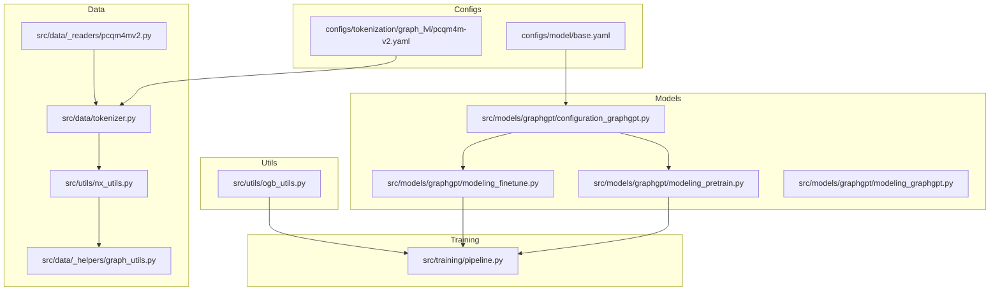
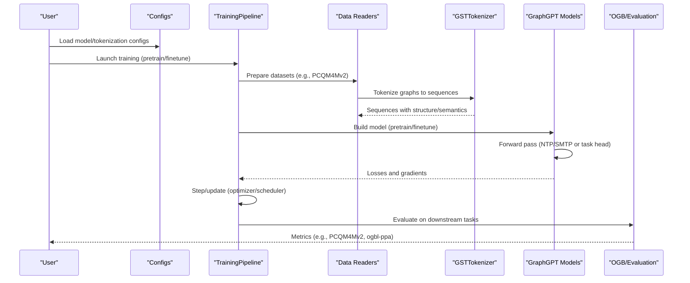
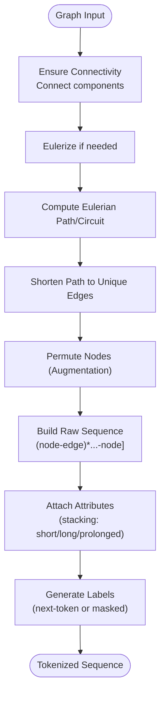
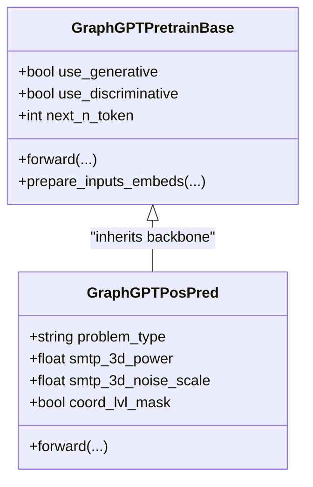
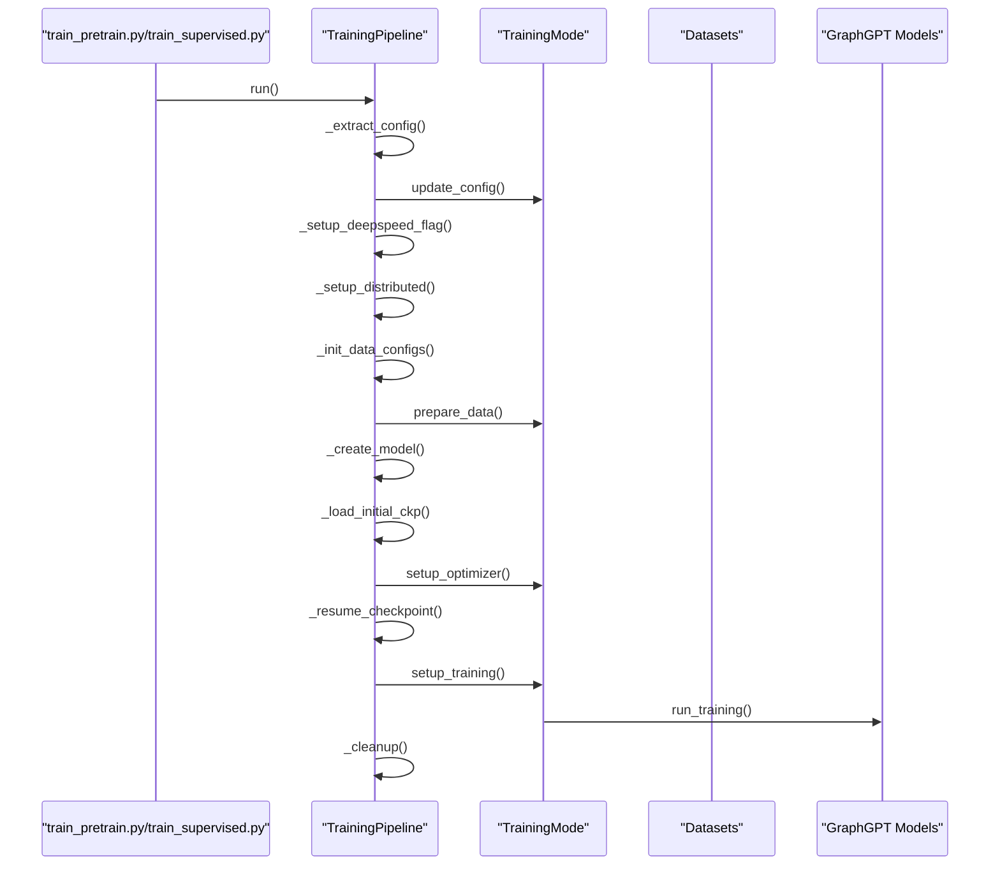
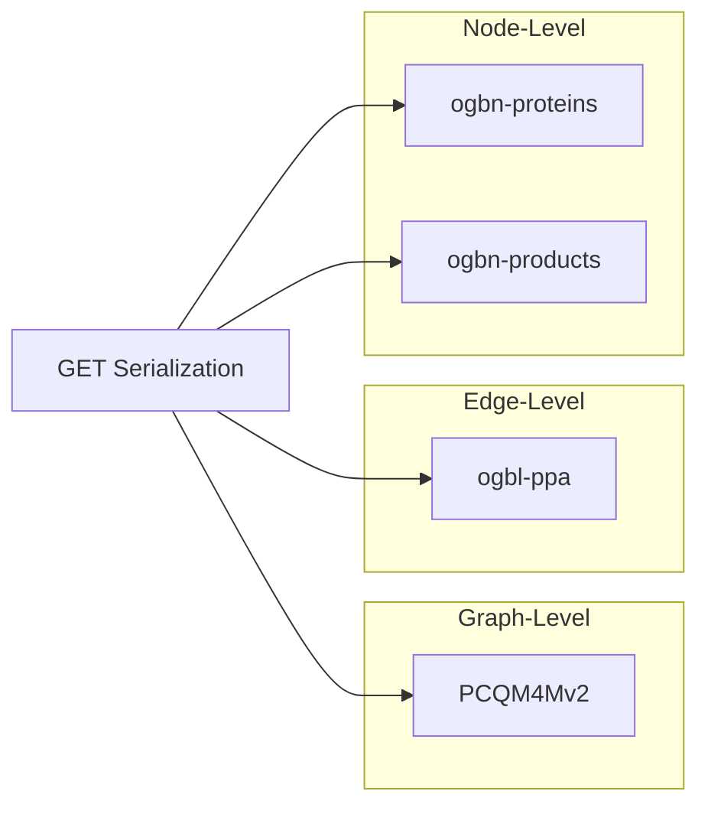
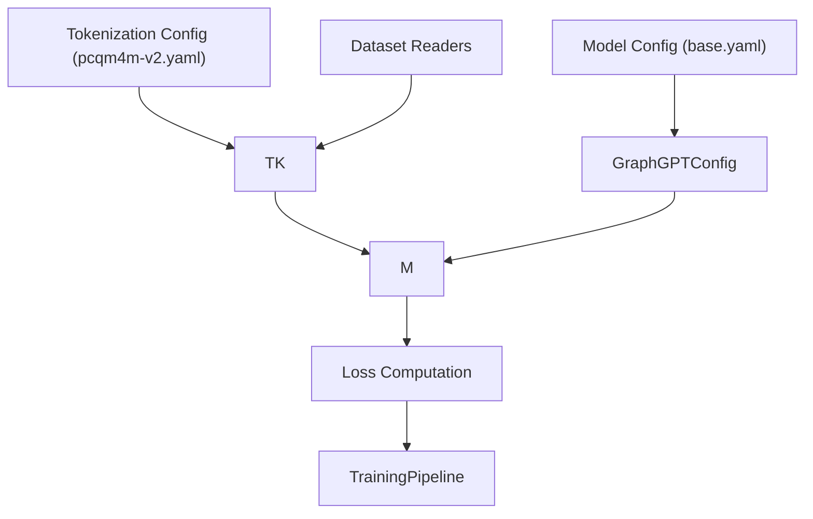

# Project Overview

<cite>
**Referenced Files in This Document**
- [README.md](file://README.md)
- [configuration_graphgpt.py](file://src/models/graphgpt/configuration_graphgpt.py)
- [modeling_pretrain.py](file://src/models/graphgpt/modeling_pretrain.py)
- [modeling_finetune.py](file://src/models/graphgpt/modeling_finetune.py)
- [modeling_graphgpt.py](file://src/models/graphgpt/modeling_graphgpt.py)
- [pipeline.py](file://src/training/pipeline.py)
- [tokenizer.py](file://src/data/tokenizer.py)
- [nx_utils.py](file://src/utils/nx_utils.py)
- [graph_utils.py](file://src/data/_helpers/graph_utils.py)
- [base.yaml](file://configs/model/base.yaml)
- [pcqm4m-v2.yaml](file://configs/tokenization/graph_lvl/pcqm4m-v2.yaml)
- [pcqm4m_v2_pretrain.sh](file://examples/graph_lvl/pcqm4m_v2_pretrain.sh)
- [ogb_utils.py](file://src/utils/ogb_utils.py)
- [pcqm4mv2.py](file://src/data/_readers/pcqm4mv2.py)
</cite>

## Table of Contents
1. [Introduction](#introduction)
2. [Project Structure](#project-structure)
3. [Core Components](#core-components)
4. [Architecture Overview](#architecture-overview)
5. [Detailed Component Analysis](#detailed-component-analysis)
6. [Dependency Analysis](#dependency-analysis)
7. [Performance Considerations](#performance-considerations)
8. [Troubleshooting Guide](#troubleshooting-guide)
9. [Conclusion](#conclusion)
10. [Appendices](#appendices)

## Introduction
GraphGPT introduces a novel self-supervised generative pre-trained model for graph learning built upon the Graph Eulerian Transformer (GET). Its central innovation is converting graphs (or sampled subgraphs) into reversible sequences using Eulerian paths, enabling effective serialization of structural and semantic information. The framework supports dual pre-training objectives—next-token prediction (NTP) and scheduled masked-token prediction (SMTP)—and unifies pre-training and fine-tuning via a shared training pipeline. It synergizes with diffusion language model (dLLM) principles, leveraging generative objectives aligned with diffusion training paradigms. The framework demonstrates strong empirical performance on large-scale Open Graph Benchmark (OGB) datasets and molecular property prediction tasks, including PCQM4M-v2 and ogbl-ppa.

## Project Structure
The repository organizes code around modular components:
- Configuration: YAML-based model and tokenization configs
- Data: Tokenizer, readers, helpers, and dataset utilities
- Models: GET-based model families for pre-training and fine-tuning
- Training: Unified training pipeline and strategies
- Utilities: Evaluation, molecular utilities, and graph helpers

**Diagram sources**
- [base.yaml:1-222](file://configs/model/base.yaml#L1-L222)
- [pcqm4m-v2.yaml:1-114](file://configs/tokenization/graph_lvl/pcqm4m-v2.yaml#L1-L114)
- [tokenizer.py:1-800](file://src/data/tokenizer.py#L1-L800)
- [nx_utils.py:1-631](file://src/utils/nx_utils.py#L1-L631)
- [graph_utils.py:1-87](file://src/data/_helpers/graph_utils.py#L1-L87)
- [pcqm4mv2.py:1-488](file://src/data/_readers/pcqm4mv2.py#L1-L488)
- [configuration_graphgpt.py:1-346](file://src/models/graphgpt/configuration_graphgpt.py#L1-L346)
- [modeling_pretrain.py:1-691](file://src/models/graphgpt/modeling_pretrain.py#L1-L691)
- [modeling_finetune.py:1-904](file://src/models/graphgpt/modeling_finetune.py#L1-L904)
- [modeling_graphgpt.py:1-30](file://src/models/graphgpt/modeling_graphgpt.py#L1-L30)
- [pipeline.py:1-258](file://src/training/pipeline.py#L1-L258)
- [ogb_utils.py:1-214](file://src/utils/ogb_utils.py#L1-L214)

**Section sources**
- [README.md:248-286](file://README.md#L248-L286)
- [base.yaml:1-222](file://configs/model/base.yaml#L1-L222)
- [pcqm4m-v2.yaml:1-114](file://configs/tokenization/graph_lvl/pcqm4m-v2.yaml#L1-L114)

## Core Components
- Graph Eulerian Transformer (GET): Combines a transformer backbone with a graph-to-sequence conversion using Eulerian paths. The tokenizer transforms graphs into reversible sequences and attaches node/edge attributes using stacking strategies (short, long, prolonged).
- Dual pre-training objectives:
  - Next-token prediction (NTP): Predicts the next token(s) in the serialized sequence.
  - Scheduled masked-token prediction (SMTP): Masks tokens according to scheduling policies and reconstructs them, aligning with diffusion training paradigms.
- Unified training pipeline: A shared TrainingPipeline orchestrates configuration extraction, data/tokenizer/model setup, optimizer initialization, checkpoint loading/resuming, and training loops for both pre-training and fine-tuning modes.
- Model families:
  - GraphGPTPretrainBase: Implements generative and/or discriminative heads for NTP/SMTP and contrastive learning.
  - GraphGPTPosPred: Specialized pre-training head for 3D position prediction using SMTP variants (line/cube/mix).
  - GraphGPTTaskModel and GraphGPTDenoisingRegressionDoubleHeadsModel: Fine-tuning heads for graph-, edge-, and node-level tasks, including denoising regression and auxiliary losses.

**Section sources**
- [README.md:127-142](file://README.md#L127-L142)
- [configuration_graphgpt.py:1-346](file://src/models/graphgpt/configuration_graphgpt.py#L1-L346)
- [modeling_pretrain.py:1-691](file://src/models/graphgpt/modeling_pretrain.py#L1-L691)
- [modeling_finetune.py:1-904](file://src/models/graphgpt/modeling_finetune.py#L1-L904)
- [pipeline.py:1-258](file://src/training/pipeline.py#L1-L258)

## Architecture Overview
The GET framework serializes graphs into sequences via Eulerian paths, stacks structural and semantic tokens, and trains generatively with NTP/SMTP. The unified pipeline coordinates data loading, tokenization, model instantiation, and training/fine-tuning.

**Diagram sources**
- [base.yaml:1-222](file://configs/model/base.yaml#L1-L222)
- [pcqm4m-v2.yaml:1-114](file://configs/tokenization/graph_lvl/pcqm4m-v2.yaml#L1-L114)
- [pcqm4mv2.py:1-488](file://src/data/_readers/pcqm4mv2.py#L1-L488)
- [tokenizer.py:1-800](file://src/data/tokenizer.py#L1-L800)
- [modeling_pretrain.py:1-691](file://src/models/graphgpt/modeling_pretrain.py#L1-L691)
- [modeling_finetune.py:1-904](file://src/models/graphgpt/modeling_finetune.py#L1-L904)
- [pipeline.py:1-258](file://src/training/pipeline.py#L1-L258)
- [ogb_utils.py:1-214](file://src/utils/ogb_utils.py#L1-L214)

## Detailed Component Analysis

### Graph Serialization and Tokenization (Eulerian Paths)
- Eulerian path construction:
  - Ensures connectivity and Eulerization for non-Eulerian graphs.
  - Supports customized Eulerian paths/circuits and path shortening to remove redundant edges.
  - Permutation of nodes augments data augmentation and reduces positional bias.
- Sequence assembly:
  - Alternating node-edge-node tokens form the raw sequence.
  - Node/edge attributes are attached using stacking strategies (short/long/prolonged).
  - Special tokens (BOS/EOS, masks, separators) and reserved tokens encode structure and semantics.
- Positional indexing:
  - Cyclic node re-indexing prevents over-representation of low-index nodes and balances training signals.

**Diagram sources**
- [nx_utils.py:326-422](file://src/utils/nx_utils.py#L326-L422)
- [nx_utils.py:554-591](file://src/utils/nx_utils.py#L554-L591)
- [nx_utils.py:615-631](file://src/utils/nx_utils.py#L615-L631)

**Section sources**
- [nx_utils.py:125-202](file://src/utils/nx_utils.py#L125-L202)
- [nx_utils.py:351-422](file://src/utils/nx_utils.py#L351-L422)
- [nx_utils.py:554-631](file://src/utils/nx_utils.py#L554-L631)
- [graph_utils.py:33-87](file://src/data/_helpers/graph_utils.py#L33-L87)
- [tokenizer.py:425-535](file://src/data/tokenizer.py#L425-L535)

### Dual Pre-Training Objectives (NTP and SMTP)
- Next-token prediction (NTP): Predicts the next token(s) in the sequence, optionally extended to multi-token prediction.
- Scheduled masked-token prediction (SMTP): Masks tokens according to scheduling policies and reconstructs them, aligning with diffusion training.
- Discriminative objective: Optional contrastive loss (CL) to improve representation learning.
- Position pre-training (GraphGPTPosPred): Specialized for 3D coordinate prediction using SMTP variants (line/cube/mix), with configurable loss aggregation and positional discretization.

**Diagram sources**
- [modeling_pretrain.py:57-266](file://src/models/graphgpt/modeling_pretrain.py#L57-L266)
- [modeling_pretrain.py:269-691](file://src/models/graphgpt/modeling_pretrain.py#L269-L691)

**Section sources**
- [modeling_pretrain.py:57-266](file://src/models/graphgpt/modeling_pretrain.py#L57-L266)
- [modeling_pretrain.py:269-691](file://src/models/graphgpt/modeling_pretrain.py#L269-L691)
- [configuration_graphgpt.py:74-182](file://src/models/graphgpt/configuration_graphgpt.py#L74-L182)

### Unified Training Pipeline
- Shared orchestration: Extracts configs, sets up distributed environments, initializes tokenizer and model, loads checkpoints, and runs training loops.
- Mode strategies: PretrainMode and FinetuneMode encapsulate mode-specific behaviors while sharing common setup and cleanup steps.
- Checkpointing and logging: Supports DeepSpeed and standard DDP, with EMA and logging integrations.

**Diagram sources**
- [pipeline.py:60-96](file://src/training/pipeline.py#L60-L96)
- [pipeline.py:149-203](file://src/training/pipeline.py#L149-L203)

**Section sources**
- [pipeline.py:1-258](file://src/training/pipeline.py#L1-L258)

### Practical Applications Across Tasks
- Graph-level tasks (e.g., PCQM4M-v2): Property prediction using serialized molecular graphs.
- Edge-level tasks (e.g., ogbl-ppa): Link prediction leveraging Eulerian path serialization.
- Node-level tasks (e.g., ogbn-proteins/products): Node classification/regression with task heads.

**Diagram sources**
- [pcqm4m_v2_pretrain.sh:1-311](file://examples/graph_lvl/pcqm4m_v2_pretrain.sh#L1-L311)
- [pcqm4mv2.py:1-488](file://src/data/_readers/pcqm4mv2.py#L1-L488)
- [ogb_utils.py:198-204](file://src/utils/ogb_utils.py#L198-L204)

**Section sources**
- [pcqm4m_v2_pretrain.sh:1-311](file://examples/graph_lvl/pcqm4m_v2_pretrain.sh#L1-L311)
- [pcqm4mv2.py:1-488](file://src/data/_readers/pcqm4mv2.py#L1-L488)
- [ogb_utils.py:198-204](file://src/utils/ogb_utils.py#L198-L204)

## Dependency Analysis
- Configuration-driven model construction: ModelConfig and TokenConfig define architecture, dropout, stacking, and pre-training heads.
- Tokenizer-to-model integration: GSTTokenizer produces sequences consumed by GraphGPT models; position-aware inputs are handled by specialized heads.
- Data-to-model flow: Readers assemble datasets; tokenizers serialize graphs; models compute losses and gradients; evaluation utilities compute OGB metrics.

**Diagram sources**
- [base.yaml:1-222](file://configs/model/base.yaml#L1-L222)
- [pcqm4m-v2.yaml:1-114](file://configs/tokenization/graph_lvl/pcqm4m-v2.yaml#L1-L114)
- [configuration_graphgpt.py:1-346](file://src/models/graphgpt/configuration_graphgpt.py#L1-L346)
- [tokenizer.py:1-800](file://src/data/tokenizer.py#L1-L800)
- [modeling_pretrain.py:1-691](file://src/models/graphgpt/modeling_pretrain.py#L1-L691)
- [pipeline.py:1-258](file://src/training/pipeline.py#L1-L258)

**Section sources**
- [base.yaml:1-222](file://configs/model/base.yaml#L1-L222)
- [pcqm4m-v2.yaml:1-114](file://configs/tokenization/graph_lvl/pcqm4m-v2.yaml#L1-L114)
- [configuration_graphgpt.py:1-346](file://src/models/graphgpt/configuration_graphgpt.py#L1-L346)
- [tokenizer.py:1-800](file://src/data/tokenizer.py#L1-L800)
- [modeling_pretrain.py:1-691](file://src/models/graphgpt/modeling_pretrain.py#L1-L691)
- [pipeline.py:1-258](file://src/training/pipeline.py#L1-L258)

## Performance Considerations
- Scalability: Achieves strong performance scaling up to 2 billion parameters in generative pretraining, overcoming limitations of traditional GNNs and prior graph transformers.
- Data quality and diversity: Insights indicate that high-quality graph data with rich semantics and structure is crucial for scaling and few-shot generalization.
- Positional encoding and masking: Cyclic node re-indexing and configurable masking strategies balance training dynamics and generalize across tasks.

[No sources needed since this section provides general guidance]

## Troubleshooting Guide
- Installation and environment: Ensure correct Python and PyTorch versions, CUDA compatibility, and dependencies installed as per installation instructions.
- Dataset downloads: Use OGB utilities; for large datasets like PCQM4M-v2, preprocessing can be separated for reliability.
- Training stability: Adjust dropout, attention masking, and schedule parameters; verify DeepSpeed configuration and logging steps.
- Evaluation: Use OGB evaluators for benchmark tasks; confirm metric computation and CSV formatting.

**Section sources**
- [README.md:203-246](file://README.md#L203-L246)
- [pcqm4mv2.py:18-72](file://src/data/_readers/pcqm4mv2.py#L18-L72)
- [ogb_utils.py:1-214](file://src/utils/ogb_utils.py#L1-L214)

## Conclusion
GraphGPT advances graph learning by introducing GET, a generative pre-trained framework that serializes graphs via Eulerian paths and leverages dual pre-training objectives (NTP and SMTP). Its unified training pipeline and diffusion-aligned objectives enable strong performance across graph-level, edge-level, and node-level tasks, particularly on large-scale molecular and benchmark datasets. The modular design and structured configuration support scalable development and deployment.

[No sources needed since this section summarizes without analyzing specific files]

## Appendices

### Conceptual Overview for Beginners
- Graph theory basics:
  - Node: entity in a graph.
  - Edge: connection between nodes.
  - Path: sequence of nodes connected by edges.
  - Eulerian path/circuit: visits every edge exactly once; circuits return to start.
- Serialization:
  - Convert a graph into a sequence by traversing an Eulerian path and alternating node-edge tokens.
  - Attach attributes (node/edge/graph) to tokens using stacking strategies.
- Pre-training:
  - NTP: predict the next token(s).
  - SMTP: mask tokens and reconstruct them with scheduling.
- Diffusion language model (dLLM) integration:
  - SMTP aligns with diffusion training, improving generative modeling of graph sequences.

[No sources needed since this diagram shows conceptual workflow, not actual code structure]
