# Testing Guide

<cite>
**Referenced Files in This Document**
- [test_forward_minimal.py](file://tests/test_forward_minimal.py)
- [test_forward_simple.py](file://tests/test_forward_simple.py)
- [test_model_forward_inputs.py](file://tests/test_model_forward_inputs.py)
- [test_tokenizer_smoke.py](file://tests/test_tokenizer_smoke.py)
- [test_refactoring_syntax.py](file://tests/test_refactoring_syntax.py)
- [config.yaml](file://configs/config.yaml)
- [requirements.txt](file://requirements.txt)
- [README.md](file://README.md)
</cite>

## Table of Contents
1. [Introduction](#introduction)
2. [Testing Framework Overview](#testing-framework-overview)
3. [Core Testing Components](#core-testing-components)
4. [Forward Pass Testing](#forward-pass-testing)
5. [Tokenizer Testing](#tokenizer-testing)
6. [Refactoring Validation](#refactoring-validation)
7. [Integration Testing](#integration-testing)
8. [Testing Best Practices](#testing-best-practices)
9. [Troubleshooting Guide](#troubleshooting-guide)
10. [Conclusion](#conclusion)

## Introduction

This Testing Guide provides comprehensive documentation for the GraphGPT testing framework, covering forward pass validation, tokenizer functionality, refactoring verification, and integration testing approaches. The guide focuses on the four primary test files that validate different aspects of the GraphGPT system architecture.

## Testing Framework Overview

The GraphGPT testing framework consists of four main categories of tests that validate different components of the system:

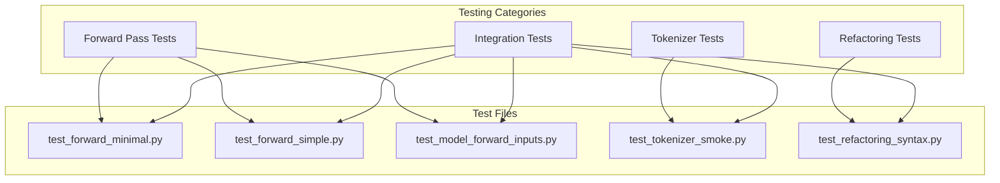

**Section sources**
- [test_forward_minimal.py:1-568](file://tests/test_forward_minimal.py#L1-L568)
- [test_forward_simple.py:1-351](file://tests/test_forward_simple.py#L1-L351)
- [test_model_forward_inputs.py:1-457](file://tests/test_model_forward_inputs.py#L1-L457)
- [test_tokenizer_smoke.py:1-232](file://tests/test_tokenizer_smoke.py#L1-L232)
- [test_refactoring_syntax.py:1-265](file://tests/test_refactoring_syntax.py#L1-L265)

## Core Testing Components

### Forward Pass Testing Suite

The forward pass testing suite validates model input structures and tensor shapes across different training modes:

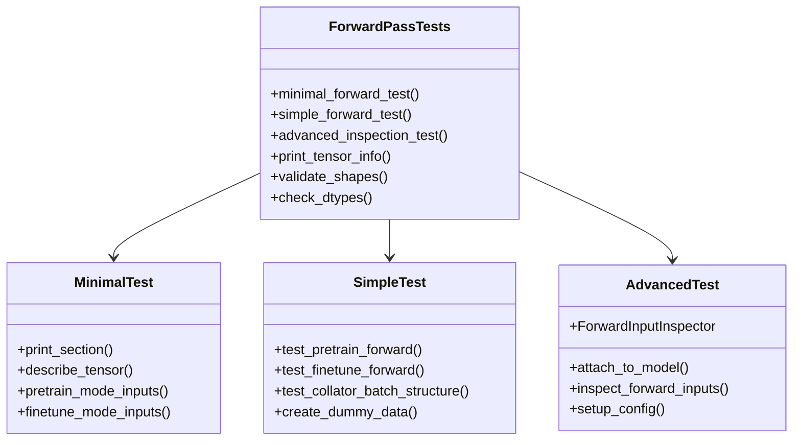

**Diagram sources**
- [test_forward_minimal.py:13-140](file://tests/test_forward_minimal.py#L13-L140)
- [test_forward_simple.py:40-254](file://tests/test_forward_simple.py#L40-L254)
- [test_model_forward_inputs.py:39-122](file://tests/test_model_forward_inputs.py#L39-L122)

### Tokenizer Testing Framework

The tokenizer testing framework validates import functionality, utility functions, and public API surfaces:

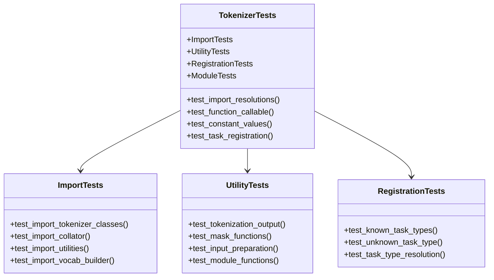

**Diagram sources**
- [test_tokenizer_smoke.py:22-232](file://tests/test_tokenizer_smoke.py#L22-L232)

### Refactoring Validation Tests

The refactoring validation tests ensure code structure integrity and backward compatibility:

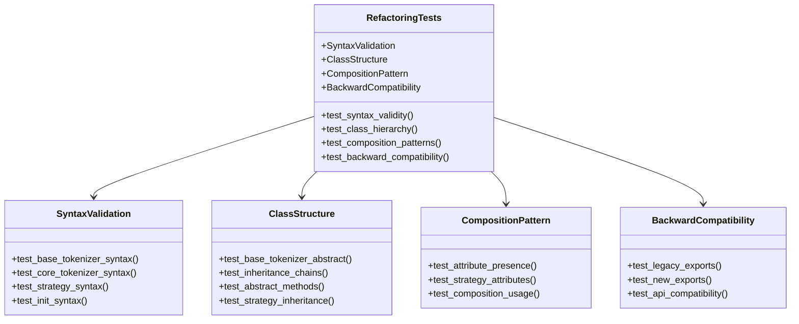

**Diagram sources**
- [test_refactoring_syntax.py:14-265](file://tests/test_refactoring_syntax.py#L14-L265)

**Section sources**
- [test_forward_minimal.py:1-568](file://tests/test_forward_minimal.py#L1-L568)
- [test_forward_simple.py:1-351](file://tests/test_forward_simple.py#L1-L351)
- [test_model_forward_inputs.py:1-457](file://tests/test_model_forward_inputs.py#L1-L457)
- [test_tokenizer_smoke.py:1-232](file://tests/test_tokenizer_smoke.py#L1-L232)
- [test_refactoring_syntax.py:1-265](file://tests/test_refactoring_syntax.py#L1-L265)

## Forward Pass Testing

### Minimal Forward Pass Testing

The minimal forward pass test provides comprehensive documentation of model input structures without requiring full environment setup:

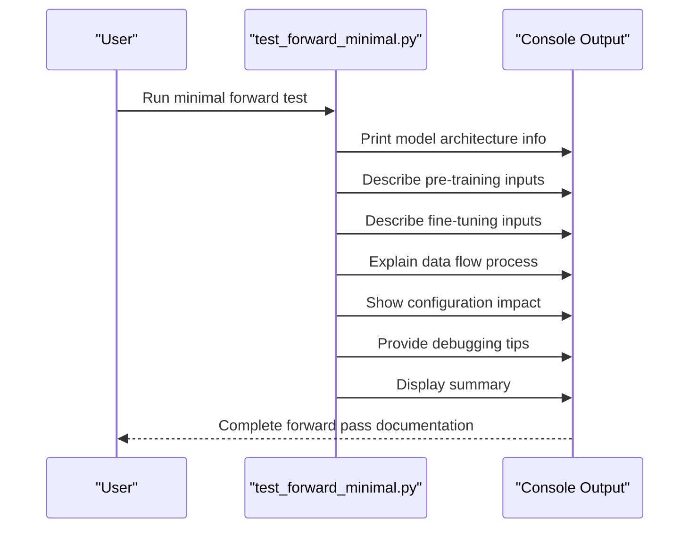

**Diagram sources**
- [test_forward_minimal.py:32-561](file://tests/test_forward_minimal.py#L32-L561)

### Simple Forward Pass Testing

The simple forward pass test executes actual model forward passes with dummy data:

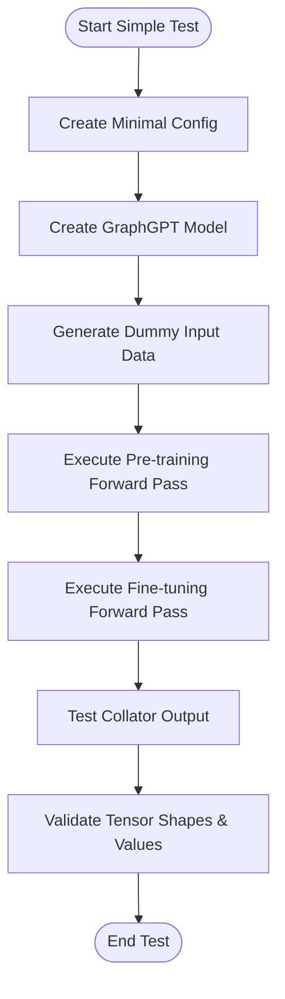

**Diagram sources**
- [test_forward_simple.py:40-346](file://tests/test_forward_simple.py#L40-L346)

### Advanced Forward Input Inspection

The advanced testing framework uses hook-based inspection for detailed input analysis:

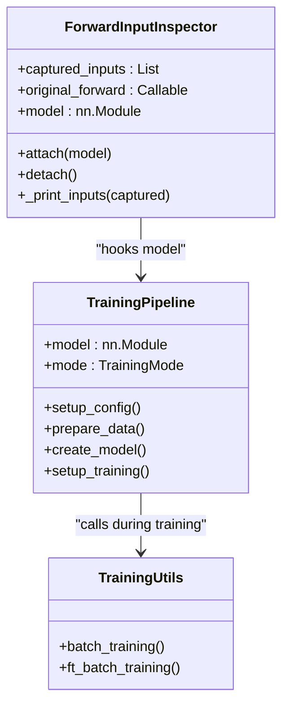

**Diagram sources**
- [test_model_forward_inputs.py:39-122](file://tests/test_model_forward_inputs.py#L39-L122)
- [test_model_forward_inputs.py:180-344](file://tests/test_model_forward_inputs.py#L180-L344)

**Section sources**
- [test_forward_minimal.py:1-568](file://tests/test_forward_minimal.py#L1-L568)
- [test_forward_simple.py:1-351](file://tests/test_forward_simple.py#L1-L351)
- [test_model_forward_inputs.py:1-457](file://tests/test_model_forward_inputs.py#L1-L457)

## Tokenizer Testing

### Import Resolution Testing

The tokenizer smoke tests validate that all public import paths resolve correctly:

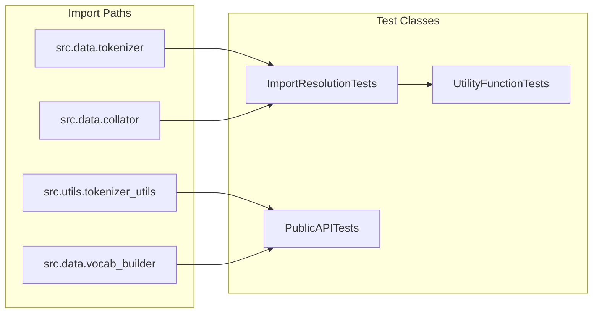

**Diagram sources**
- [test_tokenizer_smoke.py:22-77](file://tests/test_tokenizer_smoke.py#L22-L77)

### Tokenization Output Validation

The tokenization output tests verify TokenizationOutput functionality and field mutations:

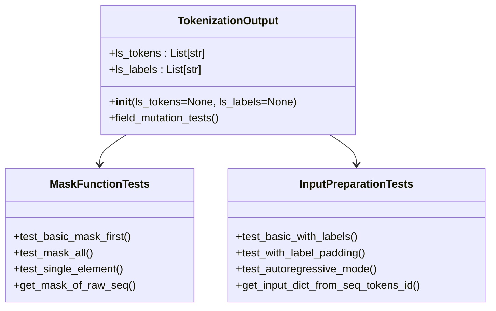

**Diagram sources**
- [test_tokenizer_smoke.py:84-177](file://tests/test_tokenizer_smoke.py#L84-L177)

### Task Type Registration Testing

The registration tests validate task-type functionality across different task categories:

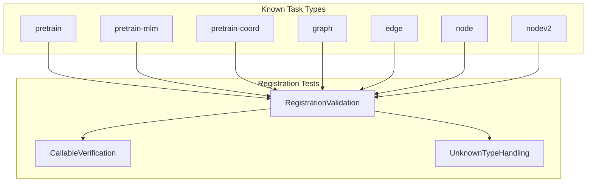

**Diagram sources**
- [test_tokenizer_smoke.py:179-206](file://tests/test_tokenizer_smoke.py#L179-L206)

**Section sources**
- [test_tokenizer_smoke.py:1-232](file://tests/test_tokenizer_smoke.py#L1-L232)

## Refactoring Validation

### Syntax Validation Testing

The refactoring syntax tests ensure all refactored files maintain valid Python syntax:

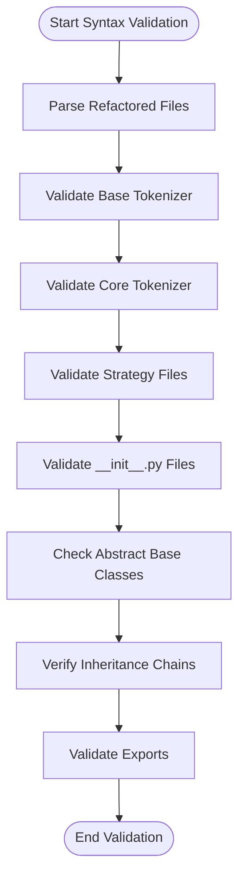

**Diagram sources**
- [test_refactoring_syntax.py:14-61](file://tests/test_refactoring_syntax.py#L14-L61)

### Class Structure Validation

The class structure tests verify inheritance patterns and abstract method implementations:

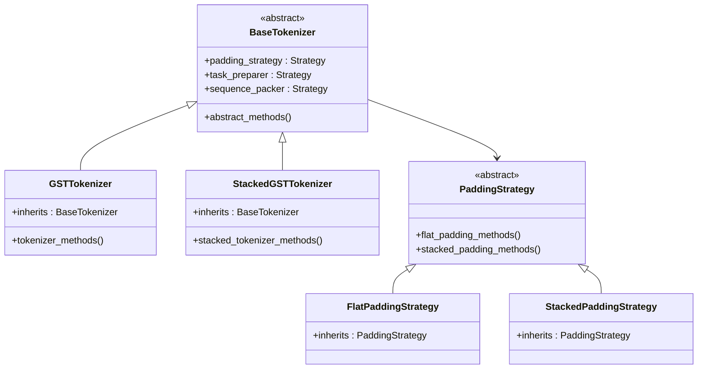

**Diagram sources**
- [test_refactoring_syntax.py:63-165](file://tests/test_refactoring_syntax.py#L63-L165)

**Section sources**
- [test_refactoring_syntax.py:1-265](file://tests/test_refactoring_syntax.py#L1-L265)

## Integration Testing

### Configuration-Based Testing

The integration testing framework validates configuration impacts on model inputs:

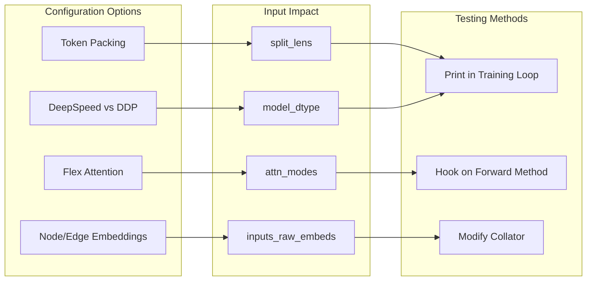

**Diagram sources**
- [test_forward_minimal.py:334-392](file://tests/test_forward_minimal.py#L334-L392)
- [test_forward_minimal.py:399-462](file://tests/test_forward_minimal.py#L399-L462)

### Pipeline Integration Testing

The pipeline integration tests validate end-to-end training workflows:

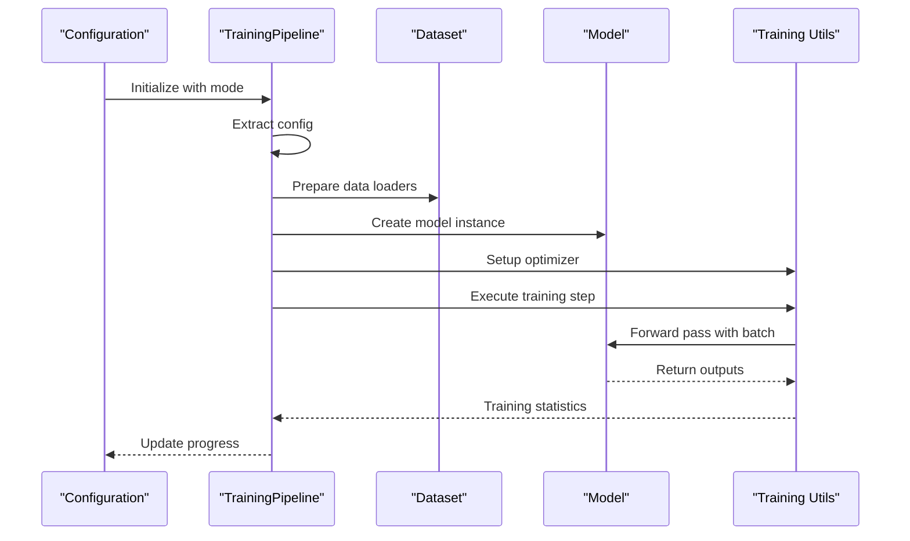

**Diagram sources**
- [test_model_forward_inputs.py:180-344](file://tests/test_model_forward_inputs.py#L180-L344)

**Section sources**
- [test_forward_minimal.py:1-568](file://tests/test_forward_minimal.py#L1-L568)
- [test_model_forward_inputs.py:1-457](file://tests/test_model_forward_inputs.py#L1-L457)

## Testing Best Practices

### Debugging and Troubleshooting

The testing framework provides comprehensive debugging utilities and common error patterns:

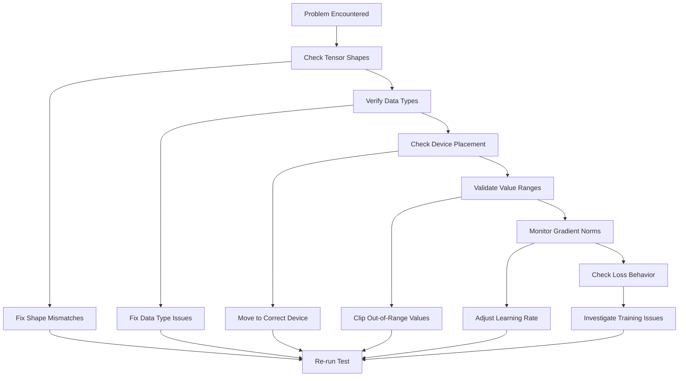

### Common Error Patterns

The testing framework documents common errors and their solutions:

| Error Type | Description | Solution |
|------------|-------------|----------|
| Device Mismatch | Expected device cuda but got cpu | Move batch to model device |
| Shape Mismatch | Dimension mismatch in tensor operations | Check stacked_feat, batch_size, seq_len |
| Memory Issues | CUDA out of memory errors | Reduce batch_size or max_position_embeddings |
| Label Range | Labels outside vocabulary range | Ensure labels < vocab_size or = -100 for masking |

**Section sources**
- [test_forward_minimal.py:498-526](file://tests/test_forward_minimal.py#L498-L526)

## Troubleshooting Guide

### Environment Setup Issues

Common installation and environment problems:

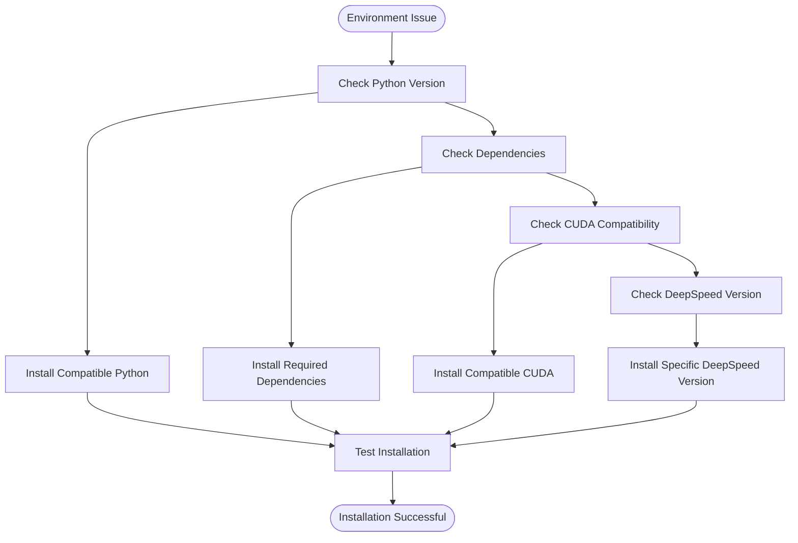

### Test Execution Problems

Problems encountered during test execution:

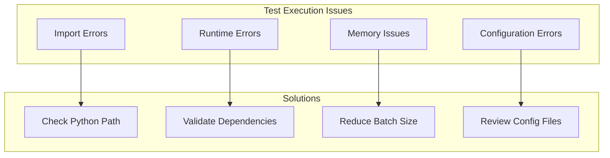

**Section sources**
- [requirements.txt:1-28](file://requirements.txt#L1-L28)
- [README.md:203-223](file://README.md#L203-L223)

## Conclusion

The GraphGPT testing framework provides comprehensive validation across multiple testing categories, ensuring code quality, functionality, and maintainability. The framework's modular design allows for targeted testing of specific components while maintaining integration validation through the pipeline testing approach.

Key testing capabilities include:
- Forward pass validation with detailed input inspection
- Tokenizer functionality verification
- Refactoring validation for code structure integrity
- Integration testing through training pipeline validation
- Comprehensive debugging utilities and error handling

The testing framework supports both lightweight smoke tests and comprehensive integration tests, making it suitable for development, CI/CD pipelines, and production validation scenarios.
