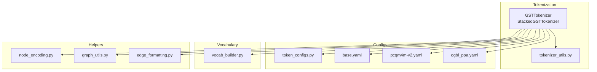
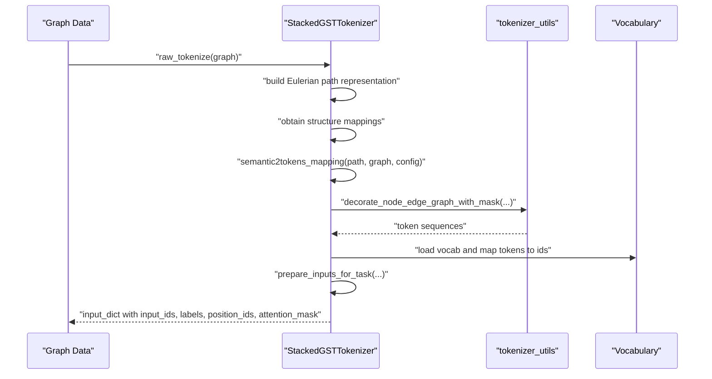
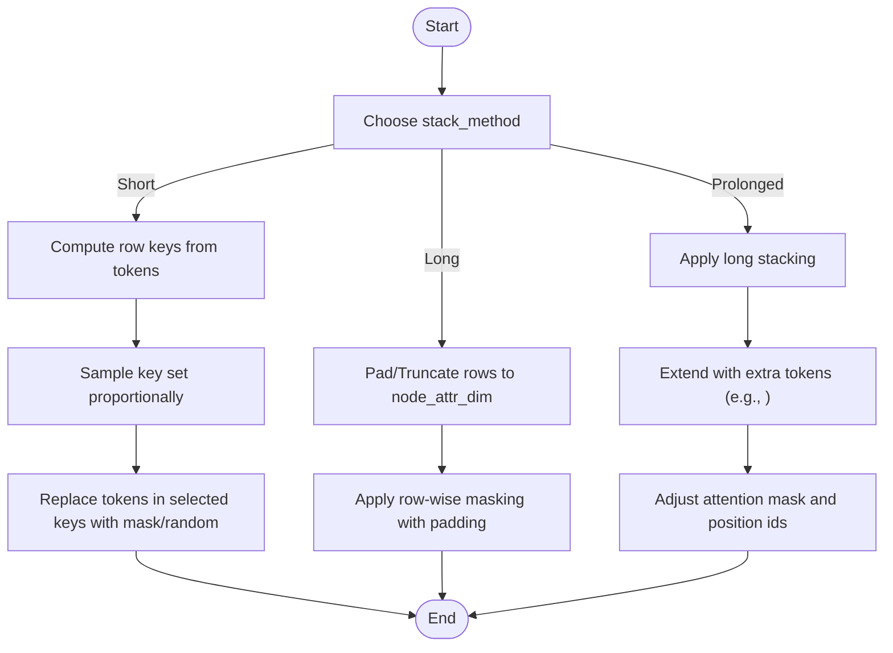
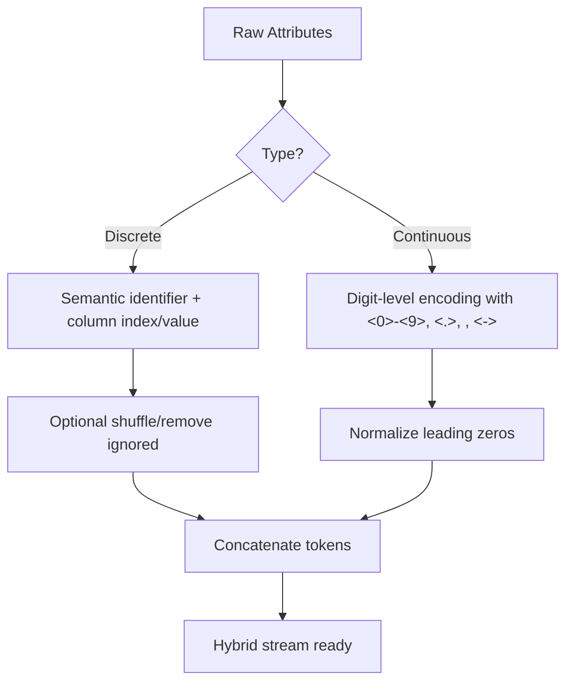
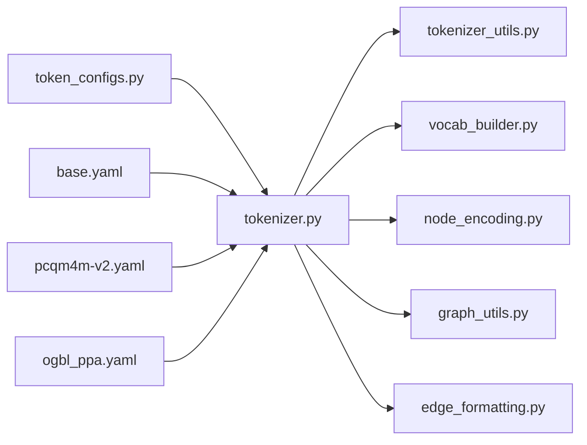

# Attribute Stacking Methods

<cite>
**Referenced Files in This Document**
- [tokenizer.py](file://src/data/tokenizer.py)
- [tokenizer_utils.py](file://src/utils/tokenizer_utils.py)
- [token_configs.py](file://src/conf/tokenization/token_configs.py)
- [base.yaml](file://configs/tokenization/base.yaml)
- [pcqm4m-v2.yaml](file://configs/tokenization/graph_lvl/pcqm4m-v2.yaml)
- [ogbl_ppa.yaml](file://configs/tokenization/edge_lvl/ogbl_ppa.yaml)
- [vocab_builder.py](file://src/data/vocab_builder.py)
- [node_encoding.py](file://src/data/_helpers/node_encoding.py)
- [graph_utils.py](file://src/data/_helpers/graph_utils.py)
- [edge_formatting.py](file://src/data/_helpers/edge_formatting.py)
</cite>

## Table of Contents
1. [Introduction](#introduction)
2. [Project Structure](#project-structure)
3. [Core Components](#core-components)
4. [Architecture Overview](#architecture-overview)
5. [Detailed Component Analysis](#detailed-component-analysis)
6. [Dependency Analysis](#dependency-analysis)
7. [Performance Considerations](#performance-considerations)
8. [Troubleshooting Guide](#troubleshooting-guide)
9. [Conclusion](#conclusion)
10. [Appendices](#appendices)

## Introduction
This document explains the attribute stacking methods system that encodes node and edge attributes into token sequences for graph transformer workloads. It covers:
- Three stacking strategies: short, long, and prolonged (implemented via long plus extended masking).
- Discrete attribute tokenization using semantic identifiers and continuous attribute tokenization with digit-level encoding.
- Hybrid approaches for mixed data types.
- Configuration options for attribute assignment strategies, masking schemes, and vocabulary sharing.
- Transformer architecture alignment and sequence length optimization.
- Practical guidance for handling missing values, data type conversions, and normalization.

## Project Structure
The attribute stacking system spans tokenizer orchestration, tokenization utilities, configuration, and vocabulary building:
- Tokenizer orchestrator and stacked tokenizer define how attributes are transformed into tokens and stacked into sequences.
- Utilities implement masking strategies and task-specific input preparation for stacked sequences.
- Configurations define semantics, structure, and task-specific parameters.
- Vocabulary builder constructs semantic tokens for discrete and continuous attributes.

**Diagram sources**
- [tokenizer.py:30-936](file://src/data/tokenizer.py#L30-L936)
- [tokenizer_utils.py:1-890](file://src/utils/tokenizer_utils.py#L1-L890)
- [token_configs.py:1-127](file://src/conf/tokenization/token_configs.py#L1-L127)
- [base.yaml:1-117](file://configs/tokenization/base.yaml#L1-L117)
- [pcqm4m-v2.yaml:1-114](file://configs/tokenization/graph_lvl/pcqm4m-v2.yaml#L1-L114)
- [ogbl_ppa.yaml:1-123](file://configs/tokenization/edge_lvl/ogbl_ppa.yaml#L1-L123)
- [vocab_builder.py:1-219](file://src/data/vocab_builder.py#L1-L219)
- [node_encoding.py:1-85](file://src/data/_helpers/node_encoding.py#L1-L85)
- [graph_utils.py:1-87](file://src/data/_helpers/graph_utils.py#L1-L87)
- [edge_formatting.py:1-83](file://src/data/_helpers/edge_formatting.py#L1-L83)

**Section sources**
- [tokenizer.py:30-936](file://src/data/tokenizer.py#L30-L936)
- [tokenizer_utils.py:1-890](file://src/utils/tokenizer_utils.py#L1-L890)
- [token_configs.py:1-127](file://src/conf/tokenization/token_configs.py#L1-L127)
- [base.yaml:1-117](file://configs/tokenization/base.yaml#L1-L117)
- [pcqm4m-v2.yaml:1-114](file://configs/tokenization/graph_lvl/pcqm4m-v2.yaml#L1-L114)
- [ogbl_ppa.yaml:1-123](file://configs/tokenization/edge_lvl/ogbl_ppa.yaml#L1-L123)
- [vocab_builder.py:1-219](file://src/data/vocab_builder.py#L1-L219)
- [node_encoding.py:1-85](file://src/data/_helpers/node_encoding.py#L1-L85)
- [graph_utils.py:1-87](file://src/data/_helpers/graph_utils.py#L1-L87)
- [edge_formatting.py:1-83](file://src/data/_helpers/edge_formatting.py#L1-L83)

## Core Components
- StackedGSTTokenizer: Implements the stacking strategies and integrates with masking utilities for pretraining.
- Attribute tokenization helpers: Provide discrete and continuous tokenization routines.
- Task preparation utilities: Prepare inputs for pretrain-mlm, pretrain-cl, and downstream tasks with stacked sequences.
- Configuration and vocab builder: Define semantics, structure, and build semantic vocabularies for attributes.

Key responsibilities:
- Short stacking: stacks tokens per node/edge with minimal cross-row interference.
- Long stacking: aligns tokens into a dense matrix-like structure for row-wise prediction targets.
- Prolonged stacking: extends long stacking with additional masking and positional augmentation for improved signal separation.

**Section sources**
- [tokenizer.py:897-936](file://src/data/tokenizer.py#L897-L936)
- [tokenizer_utils.py:62-173](file://src/utils/tokenizer_utils.py#L62-L173)
- [token_configs.py:57-64](file://src/conf/tokenization/token_configs.py#L57-L64)
- [base.yaml:29-82](file://configs/tokenization/base.yaml#L29-L82)

## Architecture Overview
The attribute stacking pipeline transforms graph attributes into token sequences aligned with transformer expectations. It supports:
- Semantic tokenization of discrete and continuous attributes.
- Row-wise masking strategies for pretraining objectives.
- Task-specific input augmentation (e.g., graph summary tokens, node masks).

**Diagram sources**
- [tokenizer.py:428-535](file://src/data/tokenizer.py#L428-L535)
- [tokenizer_utils.py:224-363](file://src/utils/tokenizer_utils.py#L224-L363)
- [vocab_builder.py:209-219](file://src/data/vocab_builder.py#L209-L219)

## Detailed Component Analysis

### Stacking Strategies: Short, Long, and Prolonged
- Short stacking:
  - Masks per-row keys uniformly across the sequence.
  - Suitable for straightforward masked language modeling on row-aligned tokens.
  - Implemented via a per-key masking routine operating on row keys.

- Long stacking:
  - Aligns tokens into a matrix with fixed row width equal to the node attribute dimension.
  - Pads or truncates rows to maintain uniform shape.
  - Applies row-wise masking during pretraining to isolate targets.

- Prolonged stacking:
  - Extends long stacking with additional masking and positional augmentation.
  - Designed to improve training dynamics by increasing effective sequence coverage and reducing co-occurrence artifacts.

**Diagram sources**
- [tokenizer_utils.py:62-110](file://src/utils/tokenizer_utils.py#L62-L110)
- [tokenizer_utils.py:112-149](file://src/utils/tokenizer_utils.py#L112-L149)
- [tokenizer_utils.py:151-173](file://src/utils/tokenizer_utils.py#L151-L173)
- [tokenizer_utils.py:326-334](file://src/utils/tokenizer_utils.py#L326-L334)

**Section sources**
- [tokenizer_utils.py:62-173](file://src/utils/tokenizer_utils.py#L62-L173)
- [tokenizer_utils.py:224-363](file://src/utils/tokenizer_utils.py#L224-L363)

### Attribute Tokenization: Discrete, Continuous, and Hybrid
- Discrete attributes:
  - Encoded using semantic identifiers with optional shared vocabulary across columns.
  - Tokens carry column index and value when not sharing vocabulary.
  - Supports removal of ignored values and optional shuffling.

- Continuous attributes:
  - Digit-level encoding converts numeric strings into character tokens (e.g., <0>, <.>, <e>, <->, <digit>).
  - Leading zeros are normalized for shorter tokens.
  - Graph-level continuous attributes use a dedicated summary token.

- Hybrid approaches:
  - Combine discrete and continuous encodings by concatenating their token streams.
  - Ensure consistent ordering and padding to match transformer expectations.

**Diagram sources**
- [tokenizer.py:688-757](file://src/data/tokenizer.py#L688-L757)
- [vocab_builder.py:18-54](file://src/data/vocab_builder.py#L18-L54)

**Section sources**
- [tokenizer.py:688-757](file://src/data/tokenizer.py#L688-L757)
- [vocab_builder.py:18-54](file://src/data/vocab_builder.py#L18-L54)

### Configuration Options for Attribute Encoding
- Attribute assignment strategies:
  - attr_assignment controls how attributes are assigned to tokens (e.g., first, last, random, all, mix).
  - Supported values are defined in the tokenization configuration.

- Vocabulary sharing:
  - share_vocab enables a single vocabulary across columns for discrete attributes.
  - Reduces vocabulary size and improves generalization.

- Ignored values:
  - ignored_val filters out specific values during vocabulary construction and tokenization.

- Task and structure parameters:
  - node/edge/graph semantics dims define the expected width for long stacking.
  - Structure tokens (e.g., <mask>, <eos>, <gsum>) are configured centrally.

- Example configurations:
  - Base tokenization configuration defines semantics and structure defaults.
  - Graph-level and edge-level configs override specifics per dataset/task.

**Section sources**
- [token_configs.py:4-6](file://src/conf/tokenization/token_configs.py#L4-L6)
- [token_configs.py:57-64](file://src/conf/tokenization/token_configs.py#L57-L64)
- [base.yaml:29-82](file://configs/tokenization/base.yaml#L29-L82)
- [pcqm4m-v2.yaml:26-48](file://configs/tokenization/graph_lvl/pcqm4m-v2.yaml#L26-L48)
- [ogbl_ppa.yaml:37-57](file://configs/tokenization/edge_lvl/ogbl_ppa.yaml#L37-L57)

### Transformer Alignment and Sequence Length Optimization
- Positional encoding:
  - Position ids are generated cyclically or non-cyclically depending on configuration.
  - Node-position-aware cumulative positions can be used to reflect structural locality.

- Attention masks:
  - Standard attention mask sets 1s for valid positions.
  - For packed sequences, block-diagonal attention masks are constructed to prevent leakage.

- Sequence length:
  - Batch sequence lengths are rounded up to multiples of a configurable value and capped by maximum position embeddings.
  - Packing multiple sequences increases throughput but requires careful attention mask design.

- Extended tokens:
  - Tasks may append special tokens (e.g., <gsum>) to input sequences, extending position ids and attention masks accordingly.

**Section sources**
- [tokenizer.py:639-685](file://src/data/tokenizer.py#L639-L685)
- [tokenizer_utils.py:326-363](file://src/utils/tokenizer_utils.py#L326-L363)
- [tokenizer.py:227-267](file://src/data/tokenizer.py#L227-L267)

### Practical Examples from the Codebase
- Node features:
  - Discrete node features are encoded with semantic identifiers and optionally shuffled.
  - Continuous node features are digit-level encoded and normalized.

- Edge weights:
  - Edge attributes are aligned to the configured edge dimension for long stacking.
  - Default edge attributes can be injected to maintain consistent row widths.

- Graph-level attributes:
  - Graph-level continuous attributes use a summary token in the tokenization process.
  - Binary classification tasks may convert regression targets into binary token sequences.

- Mixed data types:
  - Hybrid token streams combine discrete and continuous tokens respecting order and padding.

**Section sources**
- [tokenizer.py:688-757](file://src/data/tokenizer.py#L688-L757)
- [tokenizer_utils.py:521-567](file://src/utils/tokenizer_utils.py#L521-L567)
- [tokenizer_utils.py:570-633](file://src/utils/tokenizer_utils.py#L570-L633)
- [tokenizer_utils.py:569-567](file://src/utils/tokenizer_utils.py#L569-L567)

## Dependency Analysis
The stacking system depends on:
- Tokenizer orchestrator for end-to-end tokenization and input preparation.
- Tokenization utilities for masking and task-specific augmentation.
- Configuration modules for semantics and structure.
- Vocabulary builder for constructing semantic tokens.

**Diagram sources**
- [token_configs.py:1-127](file://src/conf/tokenization/token_configs.py#L1-L127)
- [base.yaml:1-117](file://configs/tokenization/base.yaml#L1-L117)
- [pcqm4m-v2.yaml:1-114](file://configs/tokenization/graph_lvl/pcqm4m-v2.yaml#L1-L114)
- [ogbl_ppa.yaml:1-123](file://configs/tokenization/edge_lvl/ogbl_ppa.yaml#L1-L123)
- [tokenizer.py:30-936](file://src/data/tokenizer.py#L30-L936)
- [tokenizer_utils.py:1-890](file://src/utils/tokenizer_utils.py#L1-L890)
- [vocab_builder.py:1-219](file://src/data/vocab_builder.py#L1-L219)
- [node_encoding.py:1-85](file://src/data/_helpers/node_encoding.py#L1-L85)
- [graph_utils.py:1-87](file://src/data/_helpers/graph_utils.py#L1-L87)
- [edge_formatting.py:1-83](file://src/data/_helpers/edge_formatting.py#L1-L83)

**Section sources**
- [tokenizer.py:30-936](file://src/data/tokenizer.py#L30-L936)
- [tokenizer_utils.py:1-890](file://src/utils/tokenizer_utils.py#L1-L890)
- [token_configs.py:1-127](file://src/conf/tokenization/token_configs.py#L1-L127)
- [base.yaml:1-117](file://configs/tokenization/base.yaml#L1-L117)
- [pcqm4m-v2.yaml:1-114](file://configs/tokenization/graph_lvl/pcqm4m-v2.yaml#L1-L114)
- [ogbl_ppa.yaml:1-123](file://configs/tokenization/edge_lvl/ogbl_ppa.yaml#L1-L123)
- [vocab_builder.py:1-219](file://src/data/vocab_builder.py#L1-L219)
- [node_encoding.py:1-85](file://src/data/_helpers/node_encoding.py#L1-L85)
- [graph_utils.py:1-87](file://src/data/_helpers/graph_utils.py#L1-L87)
- [edge_formatting.py:1-83](file://src/data/_helpers/edge_formatting.py#L1-L83)

## Performance Considerations
- Prefer long stacking for dense row-wise prediction tasks to reduce overhead and improve training signal.
- Use digit-level encoding for continuous attributes to minimize vocabulary size while preserving precision.
- Enable ignored value filtering to prune rare or sentinel values from the vocabulary.
- Optimize sequence length by rounding to multiples of a configurable factor and capping at maximum position embeddings.
- For packed sequences, construct block-diagonal attention masks to preserve locality and reduce cross-sequence leakage.

[No sources needed since this section provides general guidance]

## Troubleshooting Guide
Common issues and resolutions:
- Missing values:
  - Use ignored_val to filter sentinel values during vocabulary construction and tokenization.
  - Ensure discrete and continuous attribute arrays are consistently shaped before tokenization.

- Data type conversions:
  - Convert numeric attributes to strings for digit-level encoding.
  - Normalize leading zeros to reduce token counts for decimal values.

- Attribute normalization:
  - For continuous attributes, consider scaling or binning to stabilize training.
  - For graph-level tasks, convert regression targets to binary tokens when required.

- Sequence misalignment:
  - Verify node_attr_dim and edge_attr dim match configuration for long stacking.
  - Pad or truncate rows to ensure uniform shapes across the batch.

**Section sources**
- [tokenizer.py:688-757](file://src/data/tokenizer.py#L688-L757)
- [tokenizer_utils.py:206-220](file://src/utils/tokenizer_utils.py#L206-L220)
- [base.yaml:32-48](file://configs/tokenization/base.yaml#L32-L48)

## Conclusion
The attribute stacking system provides a flexible framework for encoding heterogeneous graph attributes into token sequences suitable for transformer-based models. By combining discrete and continuous tokenization, supporting short, long, and prolonged stacking strategies, and integrating robust masking and vocabulary mechanisms, it enables efficient pretraining and downstream tasks across diverse graph domains.

[No sources needed since this section summarizes without analyzing specific files]

## Appendices

### Appendix A: Mathematical Formulations (Conceptual)
- Short stacking masking:
  - Select a subset of row keys uniformly at random and replace tokens in those rows with mask or random tokens.
  - Objective: isolate target rows for prediction while maintaining contextual tokens.

- Long stacking padding:
  - For each row, pad or truncate to node_attr_dim.
  - Apply row-wise masking with label padding beyond the target region.

- Prolonged stacking extension:
  - Append special tokens (e.g., <gsum>) to increase sequence coverage.
  - Adjust attention masks and position ids to reflect extended sequences.

[No sources needed since this section provides conceptual formulations]
