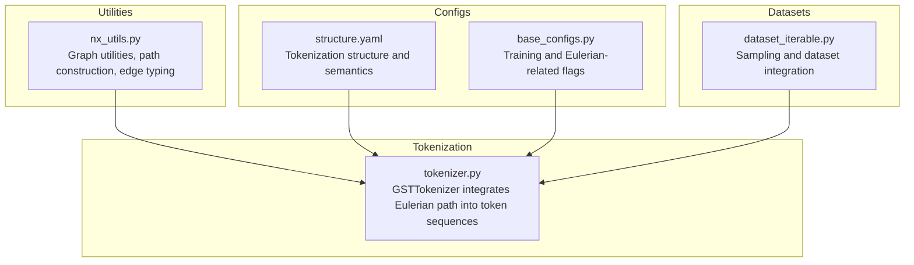
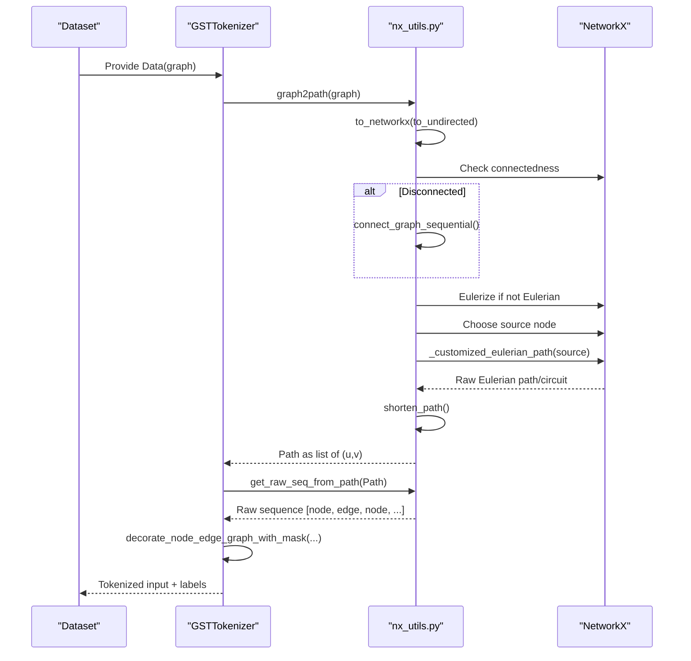
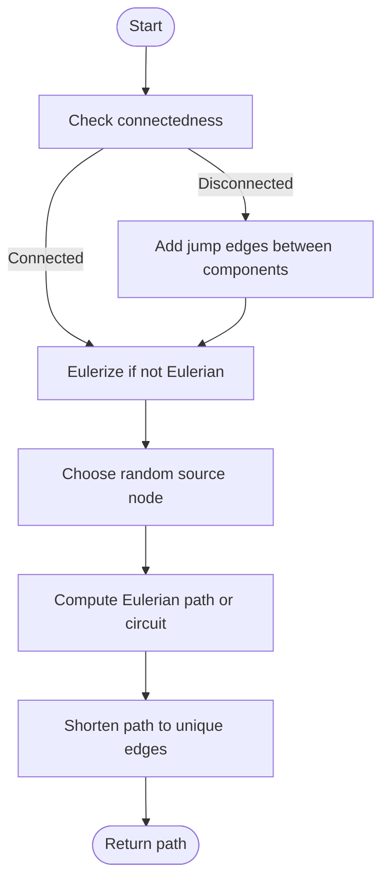
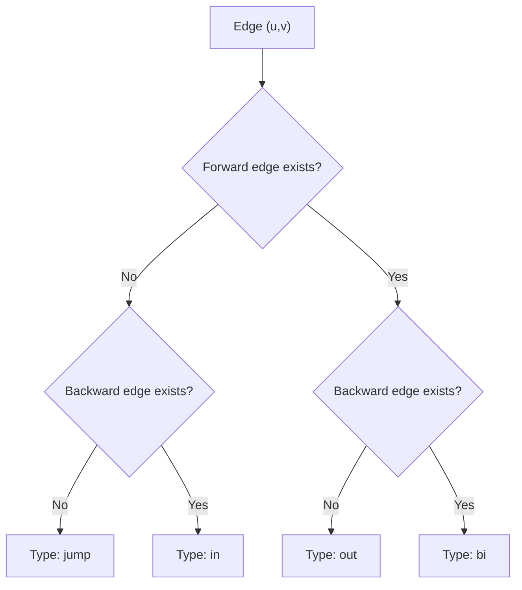
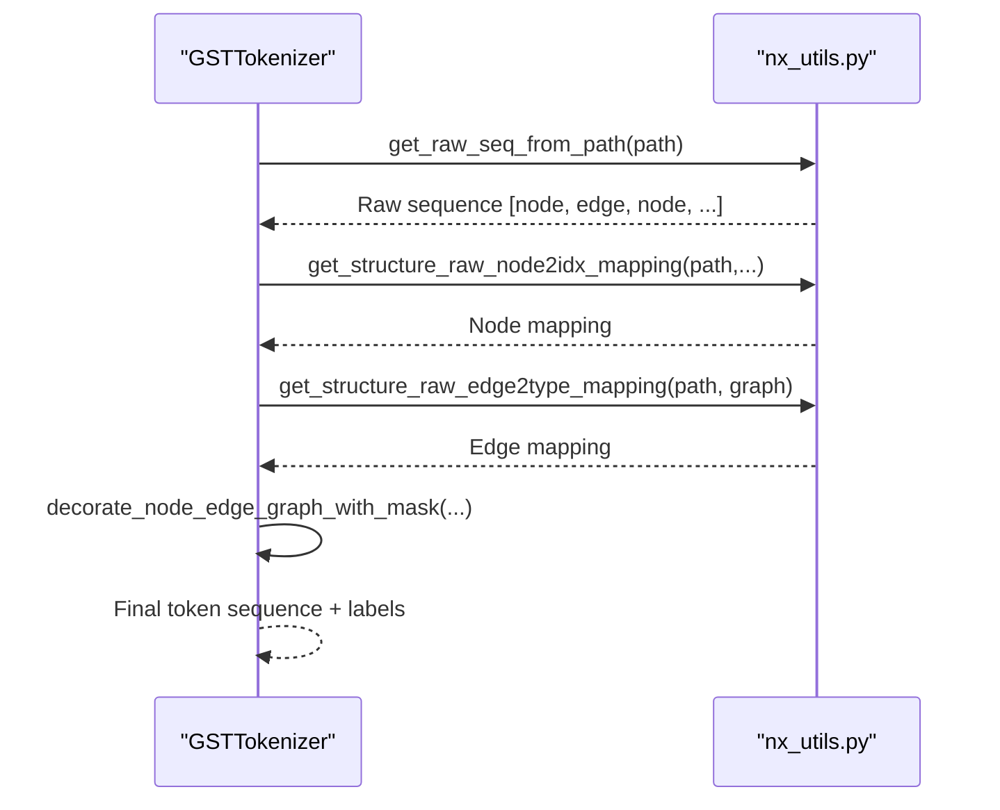
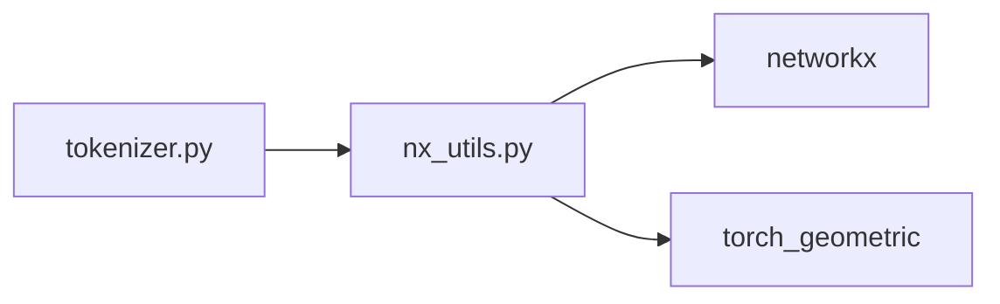

# Eulerian Path Conversion

<cite>
**Referenced Files in This Document**
- [nx_utils.py](file://src/utils/nx_utils.py)
- [tokenizer.py](file://src/data/tokenizer.py)
- [base_configs.py](file://src/conf/base_configs.py)
- [structure.yaml](file://configs/tokenization/graph_lvl/structure.yaml)
- [dataset_iterable.py](file://src/data/dataset_iterable.py)
</cite>

## Table of Contents
1. [Introduction](#introduction)
2. [Project Structure](#project-structure)
3. [Core Components](#core-components)
4. [Architecture Overview](#architecture-overview)
5. [Detailed Component Analysis](#detailed-component-analysis)
6. [Dependency Analysis](#dependency-analysis)
7. [Performance Considerations](#performance-considerations)
8. [Troubleshooting Guide](#troubleshooting-guide)
9. [Conclusion](#conclusion)
10. [Appendices](#appendices)

## Introduction
This document explains the Eulerian path conversion system that transforms graphs into sequential representations. It covers the mathematical foundations of Eulerian paths and circuits, algorithmic strategies for constructing paths across different graph types, and the handling of semi-Eulerian and non-Eulerian graphs. It also documents path construction, node traversal, edge inclusion, and configuration options that influence path selection, cycle handling, and optimization. Practical examples are drawn from the codebase to illustrate transformations for trees, cycles, and complex networks. Finally, it addresses connectivity, multigraphs, self-loops, and computational complexity considerations.

## Project Structure
The Eulerian path conversion pipeline spans utility functions for graph manipulation and path construction, tokenizer integration for sequence generation, and configuration files that define structure and semantics.

**Diagram sources**
- [nx_utils.py:125-211](file://src/utils/nx_utils.py#L125-L211)
- [tokenizer.py:425-535](file://src/data/tokenizer.py#L425-L535)
- [structure.yaml:77-121](file://configs/tokenization/graph_lvl/structure.yaml#L77-L121)
- [base_configs.py:186-204](file://src/conf/base_configs.py#L186-L204)
- [dataset_iterable.py:140-190](file://src/data/dataset_iterable.py#L140-L190)

**Section sources**
- [nx_utils.py:125-211](file://src/utils/nx_utils.py#L125-L211)
- [tokenizer.py:425-535](file://src/data/tokenizer.py#L425-L535)
- [structure.yaml:77-121](file://configs/tokenization/graph_lvl/structure.yaml#L77-L121)
- [base_configs.py:186-204](file://src/conf/base_configs.py#L186-L204)
- [dataset_iterable.py:140-190](file://src/data/dataset_iterable.py#L140-L190)

## Core Components
- Eulerian path construction utilities:
  - Connected graph handling and path concatenation across components
  - Eulerization for non-Eulerian graphs
  - Randomized path/circuit selection for augmentation
  - Shortening Eulerian paths to remove redundant edges
- Tokenization integration:
  - Converting constructed paths into token sequences with node and edge structure mappings
  - Edge type tokens for in/out/bidirectional/jump edges
  - Optional removal of default bidirectional edge tokens
- Configuration:
  - Structure and semantics definitions for tokenization
  - Flags influencing Eulerian path usage and position encoding

Key functions and responsibilities:
- Path construction: [graph2path_v2:388-410](file://src/utils/nx_utils.py#L388-L410), [connected_graph2path:413-422](file://src/utils/nx_utils.py#L413-L422)
- Eulerization and traversal: [nx.eulerize:177-179](file://src/utils/nx_utils.py#L177-L179), [_customized_eulerian_path:205-210](file://src/utils/nx_utils.py#L205-L210)
- Path shortening: [shorten_path:331-348](file://src/utils/nx_utils.py#L331-L348)
- Tokenization pipeline: [GSTTokenizer.raw_tokenize:425-535](file://src/data/tokenizer.py#L425-L535)
- Edge typing: [get_edge_type:277-290](file://src/utils/nx_utils.py#L277-L290)

**Section sources**
- [nx_utils.py:175-211](file://src/utils/nx_utils.py#L175-L211)
- [nx_utils.py:331-422](file://src/utils/nx_utils.py#L331-L422)
- [tokenizer.py:425-535](file://src/data/tokenizer.py#L425-L535)
- [nx_utils.py:271-290](file://src/utils/nx_utils.py#L271-L290)

## Architecture Overview
The system converts a PyG graph into an Eulerian path and then into a tokenized sequence. The pipeline performs:
- Graph preprocessing (connectivity and Eulerization)
- Path discovery via randomized Eulerian path or circuit
- Path shortening to remove duplicates
- Tokenization with node and edge structure mappings
- Optional integration of graph-level structure functions

**Diagram sources**
- [tokenizer.py:425-535](file://src/data/tokenizer.py#L425-L535)
- [nx_utils.py:388-437](file://src/utils/nx_utils.py#L388-L437)
- [nx_utils.py:205-210](file://src/utils/nx_utils.py#L205-L210)
- [nx_utils.py:331-348](file://src/utils/nx_utils.py#L331-L348)

## Detailed Component Analysis

### Mathematical Foundations and Graph Properties
- Eulerian cycle: A closed walk traversing each edge exactly once.
- Eulerian path: An open walk traversing each edge exactly once, starting and ending at distinct vertices.
- Semi-Eulerian: Graphs with an Eulerian path but not an Eulerian cycle.
- Necessary and sufficient conditions:
  - Undirected graph: All vertices have even degree (Eulerian cycle), or exactly two vertices have odd degree (semi-Eulerian path).
  - Directed graph: Strong connectivity and equal in-degree and out-degree for all vertices (Eulerian cycle), or a single pair differing by one (semi-Eulerian path).
- Eulerization: Adding edges to make all degrees even (or balancing in-degrees and out-degrees) to guarantee an Eulerian cycle.

Practical implications in the code:
- Non-Eulerian graphs are Eulerized before path discovery.
- Disconnected graphs are made connected by adding jump edges between components.

**Section sources**
- [nx_utils.py:175-179](file://src/utils/nx_utils.py#L175-L179)
- [nx_utils.py:310-323](file://src/utils/nx_utils.py#L310-L323)

### Path Construction and Traversal Strategies
- Connected graphs:
  - Eulerize if not Eulerian.
  - Randomly select a source node and compute an Eulerian path or circuit (randomized for augmentation).
  - Shorten the path to remove redundant edges after revisiting the start node.
- Disconnected graphs:
  - Split into connected components.
  - Compute a path for each component and concatenate with jump edges connecting components.

**Diagram sources**
- [nx_utils.py:388-422](file://src/utils/nx_utils.py#L388-L422)
- [nx_utils.py:331-348](file://src/utils/nx_utils.py#L331-L348)
- [nx_utils.py:205-210](file://src/utils/nx_utils.py#L205-L210)

**Section sources**
- [nx_utils.py:388-422](file://src/utils/nx_utils.py#L388-L422)
- [nx_utils.py:205-210](file://src/utils/nx_utils.py#L205-L210)
- [nx_utils.py:331-348](file://src/utils/nx_utils.py#L331-L348)

### Edge Inclusion and Type Tokens
- Edge types are inferred from the graph’s edge_index:
  - Forward edge present: “out” token
  - Backward edge present: “in” token
  - Both present: “bi” token
  - Neither present: “jump” token
- Bidirectional edge token can be removed to reduce redundancy.

**Diagram sources**
- [nx_utils.py:277-290](file://src/utils/nx_utils.py#L277-L290)

**Section sources**
- [nx_utils.py:271-290](file://src/utils/nx_utils.py#L271-L290)

### Tokenization Pipeline and Sequence Representation
- The path is transformed into a raw sequence alternating nodes and edges: [get_raw_seq_from_path:425-437](file://src/utils/nx_utils.py#L425-L437).
- Node and edge structure mappings are generated from the path:
  - Node mapping: positional or cyclic indexing within configured scope.
  - Edge mapping: type tokens derived from edge directionality.
- The decorated sequence is produced with optional semantic attributes and masking.

**Diagram sources**
- [tokenizer.py:425-535](file://src/data/tokenizer.py#L425-L535)
- [nx_utils.py:425-437](file://src/utils/nx_utils.py#L425-L437)
- [nx_utils.py:234-268](file://src/utils/nx_utils.py#L234-L268)
- [nx_utils.py:263-268](file://src/utils/nx_utils.py#L263-L268)
- [nx_utils.py:554-591](file://src/utils/nx_utils.py#L554-L591)

**Section sources**
- [tokenizer.py:425-535](file://src/data/tokenizer.py#L425-L535)
- [nx_utils.py:234-268](file://src/utils/nx_utils.py#L234-L268)
- [nx_utils.py:263-268](file://src/utils/nx_utils.py#L263-L268)
- [nx_utils.py:425-437](file://src/utils/nx_utils.py#L425-L437)
- [nx_utils.py:554-591](file://src/utils/nx_utils.py#L554-L591)

### Configuration Options for Path Selection and Optimization
- Structure and semantics:
  - Node scope and cyclic mapping: [structure.node.*:91-97](file://configs/tokenization/graph_lvl/structure.yaml#L91-L97)
  - Edge type tokens and removal policy: [structure.edge.*:98-103](file://configs/tokenization/graph_lvl/structure.yaml#L98-L103)
  - Reserved tokens and separators: [structure.common.*:106-120](file://configs/tokenization/graph_lvl/structure.yaml#L106-L120)
- Tokenization behavior:
  - Masking strategy and EOS handling: [tokenizer.py:425-535](file://src/data/tokenizer.py#L425-L535)
  - Attribute shuffling and semantic decoration: [tokenizer.py:472-488](file://src/data/tokenizer.py#L472-L488)
- Training flags:
  - Sampling proportionally to number of Eulerian paths: [with_prob:194-196](file://src/conf/base_configs.py#L194-L196)
  - Eulerian position encoding flag: [eulerian_position:199-200](file://src/conf/base_configs.py#L199-L200)

**Section sources**
- [structure.yaml:77-121](file://configs/tokenization/graph_lvl/structure.yaml#L77-L121)
- [tokenizer.py:425-535](file://src/data/tokenizer.py#L425-L535)
- [base_configs.py:194-200](file://src/conf/base_configs.py#L194-L200)

### Examples from the Codebase
- Trees and cycles:
  - A cycle graph becomes Eulerian; the path shortener removes the redundant final edge to match the cycle boundary.
  - A tree is Eulerized by adding edges to balance degrees; the resulting path visits edges to achieve Eulerian traversal.
- Complex networks:
  - Disconnected graphs are connected via jump edges; paths are concatenated across components with inter-component jump edges included in the sequence.

These behaviors are implemented by:
- [graph2path_v2:388-410](file://src/utils/nx_utils.py#L388-L410)
- [connected_graph2path:413-422](file://src/utils/nx_utils.py#L413-L422)
- [connect_graph_sequential:310-323](file://src/utils/nx_utils.py#L310-L323)
- [shorten_path:331-348](file://src/utils/nx_utils.py#L331-L348)

**Section sources**
- [nx_utils.py:388-422](file://src/utils/nx_utils.py#L388-L422)
- [nx_utils.py:310-323](file://src/utils/nx_utils.py#L310-L323)
- [nx_utils.py:331-348](file://src/utils/nx_utils.py#L331-L348)

## Dependency Analysis
- Tokenizer depends on:
  - Path construction utilities for converting graphs to paths
  - Node and edge structure mapping utilities for tokenization
- Path construction utilities depend on:
  - NetworkX for graph algorithms (Eulerian path/circuit, Eulerization, connected components)
  - Torch Geometric for graph representation conversion

**Diagram sources**
- [tokenizer.py:10-18](file://src/data/tokenizer.py#L10-L18)
- [nx_utils.py:1-11](file://src/utils/nx_utils.py#L1-L11)

**Section sources**
- [tokenizer.py:10-18](file://src/data/tokenizer.py#L10-L18)
- [nx_utils.py:1-11](file://src/utils/nx_utils.py#L1-L11)

## Performance Considerations
- Computational complexity:
  - Eulerian path/circuit computation is linear in the number of edges for simple implementations.
  - Eulerization adds edges to balance degrees; worst-case depends on the graph structure.
  - Path shortening is linear in path length.
- Memory:
  - Converting PyG graphs to NetworkX and back introduces overhead; batching and caching can mitigate.
- Randomization:
  - Randomized choice between path and circuit increases diversity and reduces overfitting.
- Practical tips:
  - Prefer connected graphs or use minimal jump edges to reduce path length.
  - Remove redundant edge type tokens to reduce sequence length.

[No sources needed since this section provides general guidance]

## Troubleshooting Guide
Common issues and remedies:
- Disconnected graphs:
  - Symptom: Missing connections between components.
  - Fix: Ensure jump edges are added via [connect_graph_sequential:310-323](file://src/utils/nx_utils.py#L310-L323).
- Self-loops and multi-edges:
  - Behavior: Self-loops are treated as edges; multi-edges are handled by edge_index lookup.
  - Verify: Use [get_edge_index:271-274](file://src/utils/nx_utils.py#L271-L274) and [get_edge_type:277-290](file://src/utils/nx_utils.py#L277-L290) to confirm mapping.
- Overly long sequences:
  - Cause: Eulerian paths revisit the start node; redundant edges accumulate.
  - Solution: Apply [shorten_path:331-348](file://src/utils/nx_utils.py#L331-L348) to prune duplicates.
- Node permutation effects:
  - Behavior: Nodes are permuted for augmentation; original node-to-token mapping is preserved via inverse permutation.
  - Check: [permute_nodes:594-612](file://src/utils/nx_utils.py#L594-L612) and related mapping logic.
- Configuration mismatches:
  - Symptoms: Unexpected tokenization or missing structure functions.
  - Verify: [structure.yaml:77-121](file://configs/tokenization/graph_lvl/structure.yaml#L77-L121) and [tokenizer.py:425-535](file://src/data/tokenizer.py#L425-L535).

**Section sources**
- [nx_utils.py:310-323](file://src/utils/nx_utils.py#L310-L323)
- [nx_utils.py:271-290](file://src/utils/nx_utils.py#L271-L290)
- [nx_utils.py:331-348](file://src/utils/nx_utils.py#L331-L348)
- [nx_utils.py:594-612](file://src/utils/nx_utils.py#L594-L612)
- [structure.yaml:77-121](file://configs/tokenization/graph_lvl/structure.yaml#L77-L121)
- [tokenizer.py:425-535](file://src/data/tokenizer.py#L425-L535)

## Conclusion
The Eulerian path conversion system provides a robust framework for turning graphs into sequential representations suitable for tokenization and downstream modeling. By leveraging NetworkX for graph algorithms, applying Eulerization and connectivity adjustments, and carefully managing edge types and node mappings, the system supports diverse graph topologies. Configuration options allow fine-tuning of tokenization behavior, while path shortening and randomization improve generalization. The documented components and examples offer a clear blueprint for extending or customizing the path conversion strategy.

[No sources needed since this section summarizes without analyzing specific files]

## Appendices

### Appendix A: API and Function Reference
- Path construction:
  - [graph2path_v2:388-410](file://src/utils/nx_utils.py#L388-L410)
  - [connected_graph2path:413-422](file://src/utils/nx_utils.py#L413-L422)
  - [shorten_path:331-348](file://src/utils/nx_utils.py#L331-L348)
- Traversal and augmentation:
  - [_customized_eulerian_path:205-210](file://src/utils/nx_utils.py#L205-L210)
- Connectivity and edge typing:
  - [connect_graph_sequential:310-323](file://src/utils/nx_utils.py#L310-L323)
  - [get_edge_type:277-290](file://src/utils/nx_utils.py#L277-L290)
- Tokenization:
  - [GSTTokenizer.raw_tokenize:425-535](file://src/data/tokenizer.py#L425-L535)
  - [get_raw_seq_from_path:425-437](file://src/utils/nx_utils.py#L425-L437)

**Section sources**
- [nx_utils.py:388-437](file://src/utils/nx_utils.py#L388-L437)
- [nx_utils.py:205-210](file://src/utils/nx_utils.py#L205-L210)
- [nx_utils.py:310-323](file://src/utils/nx_utils.py#L310-L323)
- [nx_utils.py:277-290](file://src/utils/nx_utils.py#L277-L290)
- [tokenizer.py:425-535](file://src/data/tokenizer.py#L425-L535)
