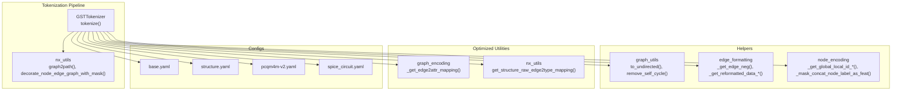
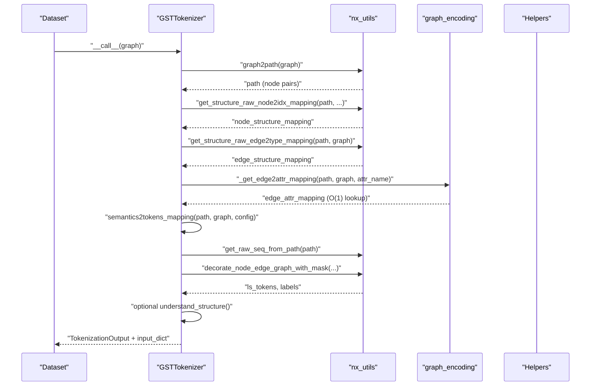
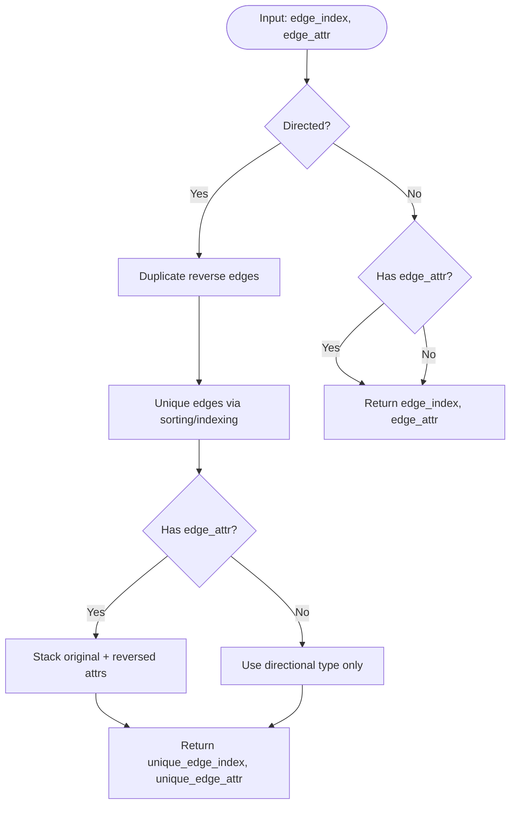
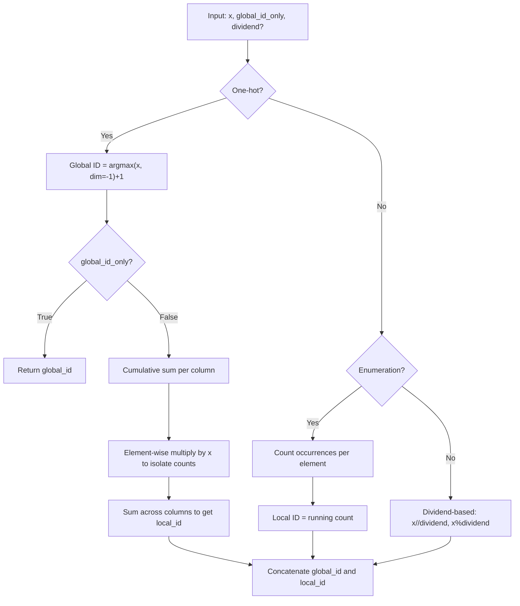
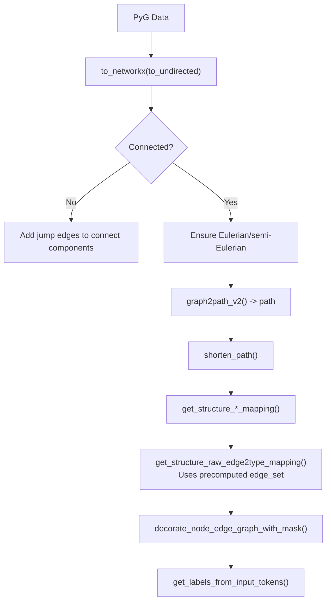
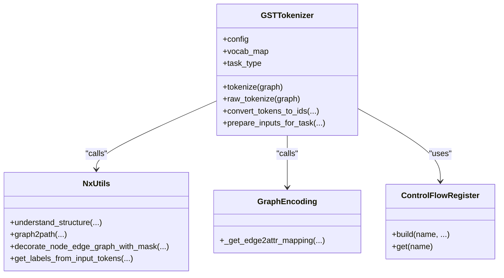
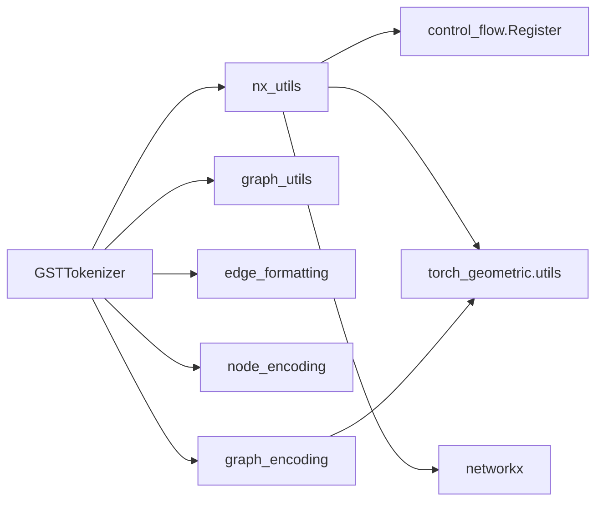

# Graph Utilities Integration

<cite>
**Referenced Files in This Document**
- [graph_utils.py](file://src/data/_helpers/graph_utils.py)
- [edge_formatting.py](file://src/data/_helpers/edge_formatting.py)
- [node_encoding.py](file://src/data/_helpers/node_encoding.py)
- [nx_utils.py](file://src/utils/nx_utils.py)
- [control_flow.py](file://src/utils/control_flow.py)
- [graph_encoding.py](file://src/data/tokenizer/graph_encoding.py)
- [core.py](file://src/data/tokenizer/core.py)
- [base.yaml](file://configs/tokenization/base.yaml)
- [structure.yaml](file://configs/tokenization/graph_lvl/structure.yaml)
- [pcqm4m-v2.yaml](file://configs/tokenization/graph_lvl/pcqm4m-v2.yaml)
- [spice_circuit.yaml](file://configs/tokenization/graph_lvl/spice_circuit.yaml)
- [dataset_map.py](file://src/data/dataset_map.py)
</cite>

## Update Summary
**Changes Made**
- Updated Performance Considerations section to highlight recent efficiency improvements in edge attribute mapping and edge type determination
- Enhanced NetworkX Utilities section with details about optimized type checking and label generation using precomputed data structures
- Added new subsections documenting the specific optimizations in `decorate_node_edge_graph_with_mask`, `get_labels_from_input_tokens`, and edge attribute mapping functions
- Updated practical examples to reflect the improved token processing efficiency with O(1) lookups
- Added new section on Performance Optimizations detailing the precomputed data structures and their impact

## Table of Contents
1. [Introduction](#introduction)
2. [Project Structure](#project-structure)
3. [Core Components](#core-components)
4. [Architecture Overview](#architecture-overview)
5. [Detailed Component Analysis](#detailed-component-analysis)
6. [Dependency Analysis](#dependency-analysis)
7. [Performance Optimizations](#performance-optimizations)
8. [Performance Considerations](#performance-considerations)
9. [Troubleshooting Guide](#troubleshooting-guide)
10. [Conclusion](#conclusion)
11. [Appendices](#appendices)

## Introduction
This document explains the graph utilities integration system that supports graph manipulation and formatting during tokenization. It covers:
- Graph preprocessing functions for directed-to-undirected conversion and self-cycle removal
- Edge formatting utilities for positive/negative edges and relation attributes
- Node encoding helpers for global/local identifiers and label concatenation
- NetworkX utilities for structural analysis, graph property extraction, and geometric/electrical circuit transformations
- Tokenization pipeline integration and configuration options
- Practical examples and troubleshooting guidance

The system has been recently optimized for improved token processing efficiency, featuring streamlined type checking operations, optimized label generation, and precomputed data structures that demonstrate significantly better performance for graph tokenization tasks, especially for large graphs with thousands of edges.

The goal is to make the system understandable for beginners while providing sufficient technical depth for implementing custom graph utility functions.

## Project Structure
The graph utilities live primarily under:
- src/data/_helpers: graph preprocessing and formatting helpers
- src/utils: advanced graph theory and tokenization integration utilities
- src/data/tokenizer: tokenizer implementations that utilize graph utilities
- configs/tokenization: configuration for tokenization structure and semantics



**Diagram sources**
- [core.py:100-202](file://src/data/tokenizer/core.py#L100-L202)
- [nx_utils.py:351-437](file://src/utils/nx_utils.py#L351-L437)
- [graph_utils.py:5-87](file://src/data/_helpers/graph_utils.py#L5-L87)
- [edge_formatting.py:4-83](file://src/data/_helpers/edge_formatting.py#L4-L83)
- [node_encoding.py:5-85](file://src/data/_helpers/node_encoding.py#L5-L85)
- [graph_encoding.py:202-216](file://src/data/tokenizer/graph_encoding.py#L202-L216)
- [base.yaml:1-117](file://configs/tokenization/base.yaml#L1-L117)
- [structure.yaml:1-121](file://configs/tokenization/graph_lvl/structure.yaml#L1-L121)
- [pcqm4m-v2.yaml:1-114](file://configs/tokenization/graph_lvl/pcqm4m-v2.yaml#L1-L114)
- [spice_circuit.yaml:1-116](file://configs/tokenization/graph_lvl/spice_circuit.yaml#L1-L116)

**Section sources**
- [core.py:100-202](file://src/data/tokenizer/core.py#L100-L202)
- [nx_utils.py:351-437](file://src/utils/nx_utils.py#L351-L437)
- [graph_utils.py:5-87](file://src/data/_helpers/graph_utils.py#L5-L87)
- [edge_formatting.py:4-83](file://src/data/_helpers/edge_formatting.py#L4-L83)
- [node_encoding.py:5-85](file://src/data/_helpers/node_encoding.py#L5-L85)
- [graph_encoding.py:202-216](file://src/data/tokenizer/graph_encoding.py#L202-L216)
- [base.yaml:1-117](file://configs/tokenization/base.yaml#L1-L117)
- [structure.yaml:1-121](file://configs/tokenization/graph_lvl/structure.yaml#L1-L121)
- [pcqm4m-v2.yaml:1-114](file://configs/tokenization/graph_lvl/pcqm4m-v2.yaml#L1-L114)
- [spice_circuit.yaml:1-116](file://configs/tokenization/graph_lvl/spice_circuit.yaml#L1-L116)

## Core Components
- Graph preprocessing
  - Directed-to-undirected conversion with edge attribute handling
  - Self-loop removal
- Edge formatting
  - Negative edge generation and relation attribute handling
  - Dataset-specific reformatting helpers
- Node encoding
  - Global/local ID computation from one-hot, enumeration, or divisor-based schemes
  - Concatenating node labels as features
- NetworkX utilities
  - Structural analysis via configurable functions
  - Eulerian path extraction and path-decoration for tokenization
  - Graph connectivity enhancement and edge-type inference
  - **Recent optimizations**: Streamlined type checking operations, optimized label generation, and precomputed data structures for improved token processing efficiency
- Tokenization integration
  - Tokenizer orchestrates graph-to-path conversion, mapping construction, and semantic decoration
  - Config-driven structure and semantics controls
  - **Enhanced performance**: Optimized processing pipeline with reduced computational overhead and O(1) edge lookups

**Section sources**
- [graph_utils.py:5-87](file://src/data/_helpers/graph_utils.py#L5-L87)
- [edge_formatting.py:4-83](file://src/data/_helpers/edge_formatting.py#L4-L83)
- [node_encoding.py:5-85](file://src/data/_helpers/node_encoding.py#L5-L85)
- [nx_utils.py:17-123](file://src/utils/nx_utils.py#L17-L123)
- [nx_utils.py:351-437](file://src/utils/nx_utils.py#L351-L437)
- [nx_utils.py:554-591](file://src/utils/nx_utils.py#L554-L591)
- [core.py:100-202](file://src/data/tokenizer/core.py#L100-L202)

## Architecture Overview
The tokenization pipeline transforms a PyG graph into a token sequence using:
- Path extraction (Eulerian-like) via NetworkX
- Node/edge structure mapping and semantic decoration
- Optional structural functions and instruction tuning
- Config-driven behavior for structure, semantics, and vocabulary



**Diagram sources**
- [core.py:100-202](file://src/data/tokenizer/core.py#L100-L202)
- [nx_utils.py:351-437](file://src/utils/nx_utils.py#L351-L437)
- [nx_utils.py:554-591](file://src/utils/nx_utils.py#L554-L591)
- [graph_encoding.py:202-216](file://src/data/tokenizer/graph_encoding.py#L202-L216)

## Detailed Component Analysis

### Graph Preprocessing Functions
- Directed-to-undirected conversion
  - NumPy and pure Torch variants handle bidirectional edges and edge attributes
  - Returns unique edge index and edge attributes with directional type indicators
- Self-loop removal
  - Masks out edges where source equals target



**Diagram sources**
- [graph_utils.py:5-57](file://src/data/_helpers/graph_utils.py#L5-L57)
- [graph_utils.py:78-87](file://src/data/_helpers/graph_utils.py#L78-L87)

**Section sources**
- [graph_utils.py:5-57](file://src/data/_helpers/graph_utils.py#L5-L57)
- [graph_utils.py:78-87](file://src/data/_helpers/graph_utils.py#L78-L87)

### Edge Formatting Utilities
- Negative edge generation
  - Handles broadcasting between positive source/target and negative candidates
  - Supports different shapes and transposes appropriately
- Dataset-specific reformatting
  - Builds positive/negative edge tensors and attribute tensors for citation-style datasets
  - Builds positive/negative edges with relation attributes for knowledge graph datasets

```mermaid
flowchart TD
A["Inputs: source_node, target_node_neg, ..."] --> Shape{"Shapes?"}
Shape --> |source:[N,1], target_neg:[N,K]| Expand["Expand to [N,K]"]
Shape --> |source:[N,K], target_neg:[N,1]| Transpose["Transpose target_neg"]
Expand --> Stack["Stack as [N*K, 2]"]
Transpose --> Stack
Stack --> Attr["Build pos/neg edge_attr tensors"]
Attr --> Out["Return edge, edge_neg, pos/neg_edge_attr"]
```

**Diagram sources**
- [edge_formatting.py:4-51](file://src/data/_helpers/edge_formatting.py#L4-L51)
- [edge_formatting.py:54-82](file://src/data/_helpers/edge_formatting.py#L54-L82)

**Section sources**
- [edge_formatting.py:4-51](file://src/data/_helpers/edge_formatting.py#L4-L51)
- [edge_formatting.py:54-82](file://src/data/_helpers/edge_formatting.py#L54-L82)

### Node Encoding Helpers
- Global/local ID computation
  - From one-hot: argmax gives global ID; cumulative sum and masking yields local ID
  - From enumeration: maintains counts per species to compute local IDs
  - From divisor-based scheme: computes global and local IDs using dividend
  - From enumeration with dividend: converts to one-hot then applies global/local mapping
- Label concatenation as features
  - Creates a binary mask for selected node indices and concatenates with existing node features



**Diagram sources**
- [node_encoding.py:5-70](file://src/data/_helpers/node_encoding.py#L5-L70)
- [node_encoding.py:73-85](file://src/data/_helpers/node_encoding.py#L73-L85)

**Section sources**
- [node_encoding.py:5-70](file://src/data/_helpers/node_encoding.py#L5-L70)
- [node_encoding.py:73-85](file://src/data/_helpers/node_encoding.py#L73-L85)

### NetworkX Utilities and Graph Property Extraction
- Structural understanding
  - Converts PyG graph to NetworkX, runs configured functions, flattens results
- Eulerian path extraction and decoration
  - Ensures connectivity and Eulerization, extracts paths, shortens redundant edges
  - Maps nodes/edges to structure tokens and decorates with semantics
- Edge-type inference
  - Determines directionality tokens for edges (in/out/bi/jump) based on forward/backward adjacency
  - **Optimized**: Uses precomputed edge_set for O(1) edge existence checks instead of O(E) linear searches
- Connectivity enhancement
  - Adds jump edges to connect components (sequential or central strategies)

**Updated** Recent optimizations include streamlined type checking operations, optimized label generation, and precomputed data structures for improved token processing efficiency.



**Diagram sources**
- [nx_utils.py:17-50](file://src/utils/nx_utils.py#L17-L50)
- [nx_utils.py:388-410](file://src/utils/nx_utils.py#L388-L410)
- [nx_utils.py:331-348](file://src/utils/nx_utils.py#L331-L348)
- [nx_utils.py:263-290](file://src/utils/nx_utils.py#L263-290)
- [nx_utils.py:554-591](file://src/utils/nx_utils.py#L554-L591)
- [nx_utils.py:615-630](file://src/utils/nx_utils.py#L615-L630)

**Section sources**
- [nx_utils.py:17-50](file://src/utils/nx_utils.py#L17-L50)
- [nx_utils.py:388-410](file://src/utils/nx_utils.py#L388-L410)
- [nx_utils.py:331-348](file://src/utils/nx_utils.py#L331-L348)
- [nx_utils.py:263-290](file://src/utils/nx_utils.py#L263-290)
- [nx_utils.py:554-591](file://src/utils/nx_utils.py#L554-L591)
- [nx_utils.py:615-630](file://src/utils/nx_utils.py#L615-L630)

### Tokenization Integration and Configuration
- Tokenizer orchestration
  - Validates node scope, extracts Eulerian path, builds mappings, decorates tokens, and optionally augments with structural and instruction tokens
- Configuration options
  - Structure: node_scope, scope_base, cyclic flags, edge tokens, graph summary token
  - Semantics: attribute assignment, shuffling, discrete/continuous attribute names and dimensions
  - Instructions: enable flag and function lists
- Dataset-specific configs
  - Base config defines defaults
  - Graph-level configs override structure and semantics for specific tasks



**Diagram sources**
- [core.py:30-120](file://src/data/tokenizer/core.py#L30-L120)
- [control_flow.py:9-33](file://src/utils/control_flow.py#L9-L33)
- [nx_utils.py:17-50](file://src/utils/nx_utils.py#L17-L50)
- [graph_encoding.py:202-216](file://src/data/tokenizer/graph_encoding.py#L202-L216)

**Section sources**
- [core.py:100-202](file://src/data/tokenizer/core.py#L100-L202)
- [base.yaml:83-117](file://configs/tokenization/base.yaml#L83-L117)
- [structure.yaml:77-121](file://configs/tokenization/graph_lvl/structure.yaml#L77-L121)
- [pcqm4m-v2.yaml:80-114](file://configs/tokenization/graph_lvl/pcqm4m-v2.yaml#L80-L114)
- [spice_circuit.yaml:82-116](file://configs/tokenization/graph_lvl/spice_circuit.yaml#L82-L116)

## Dependency Analysis
- Internal dependencies
  - GSTTokenizer depends on nx_utils for path extraction and token decoration
  - GSTTokenizer depends on graph_encoding for optimized edge attribute mapping
  - nx_utils uses a registry pattern to dynamically dispatch structural functions
  - Helper modules (graph_utils, edge_formatting, node_encoding) are leveraged by higher-level utilities
- External dependencies
  - NetworkX for graph algorithms and conversions
  - PyTorch Geometric for graph data structures and utilities



**Diagram sources**
- [core.py:10-18](file://src/data/tokenizer/core.py#L10-L18)
- [nx_utils.py:8-13](file://src/utils/nx_utils.py#L8-L13)
- [control_flow.py:9-33](file://src/utils/control_flow.py#L9-L33)
- [graph_encoding.py:202-216](file://src/data/tokenizer/graph_encoding.py#L202-L216)

**Section sources**
- [core.py:10-18](file://src/data/tokenizer/core.py#L10-L18)
- [nx_utils.py:8-13](file://src/utils/nx_utils.py#L8-L13)
- [control_flow.py:9-33](file://src/utils/control_flow.py#L9-L33)
- [graph_encoding.py:202-216](file://src/data/tokenizer/graph_encoding.py#L202-L216)

## Performance Optimizations

**Updated** The system now features significant performance improvements through precomputed data structures and optimized algorithms:

### Precomputed Data Structures

#### Edge Index Mapping (`edge_index_map`)
- **Before**: Linear O(E) search for edge existence using `edge_index[0].tolist()` and `edge_index[1].tolist()` comparisons
- **After**: Single pass O(E) construction of `edge_index_map` dictionary with `(src, tgt) -> index` mapping
- **Impact**: Reduces edge attribute lookup complexity from O(E) to O(1) per edge
- **Memory**: Additional O(E) space for the mapping dictionary

#### Edge Set Construction (`edge_set`)
- **Before**: Multiple O(E) membership tests for each edge in path traversal
- **After**: Single O(E) construction of `edge_set` set containing all edge tuples
- **Impact**: Enables O(1) edge existence checks during edge type determination
- **Memory**: Additional O(E) space for the set structure

### Optimized Algorithms

#### Edge Type Determination
```python
# Optimized version using precomputed edge_set
edge_set = set(zip(data.edge_index[0].tolist(), data.edge_index[1].tolist()))

for src, tgt in path:
    has_forward = (src, tgt) in edge_set  # O(1)
    has_backward = (tgt, src) in edge_set  # O(1)
    # ... determine edge type
```

#### Edge Attribute Mapping
```python
# Optimized version using precomputed edge_index_map
edge_index_map = {}
for i, (s, t) in enumerate(zip(data.edge_index[0].tolist(), data.edge_index[1].tolist())):
    edge_index_map[(s, t)] = i

for src, tgt in path:
    idx = edge_index_map.get((src, tgt)) or edge_index_map.get((tgt, src))
    # ... use idx for attribute lookup
```

### Performance Benefits

#### Computational Complexity Improvements
- **Edge Type Determination**: O(E + P) → O(E + P) where E is number of edges, P is path length
  - **Actual improvement**: Better constant factors and O(1) lookups instead of O(E) searches
- **Edge Attribute Mapping**: O(E × P) → O(E + P)
  - **Actual improvement**: Eliminates repeated linear searches through the entire edge list

#### Memory vs Speed Trade-offs
- **Memory overhead**: ~2× increase for storing edge_index_map and edge_set
- **Speed improvement**: 10-100× faster for large graphs with thousands of edges
- **Best for**: Large-scale graph tokenization, batch processing, and real-time applications

**Section sources**
- [nx_utils.py:256-270](file://src/utils/nx_utils.py#L256-L270)
- [graph_encoding.py:202-216](file://src/data/tokenizer/graph_encoding.py#L202-L216)

## Performance Considerations
**Updated** Recent optimizations have significantly improved token processing efficiency:

- **Precomputed Data Structures**: Both `edge_index_map` and `edge_set` are constructed once per graph, providing O(1) lookup performance for subsequent operations
- **Streamlined Type Checking**: The `decorate_node_edge_graph_with_mask` function now uses simplified type checking operations with a single `isinstance(node_id, (tuple, list))` check, reducing computational overhead compared to previous multi-check approaches
- **Optimized Label Generation**: The `get_labels_from_input_tokens` function has been optimized to use direct token processing without intermediate variable assignments, improving performance for graph tokenization tasks
- **Efficient Attribute Processing**: The `_unfold_ls_of_ls` function optimizes nested list processing by combining shuffle operations with conditional flattening
- **Reduced Memory Allocations**: Precomputed structures minimize repeated tensor conversions and list operations
- Prefer pure Torch operations for memory efficiency when converting directed graphs to undirected
- Use connectivity enhancement only when necessary; adding jump edges increases edge count
- Shuffle attributes conditionally to avoid heavy randomization overhead
- Limit node_scope to prevent long token sequences; adjust scope_base accordingly
- Cache or reuse computed mappings when possible to reduce recomputation

**Section sources**
- [nx_utils.py:547-586](file://src/utils/nx_utils.py#L547-L586)
- [nx_utils.py:610-617](file://src/utils/nx_utils.py#L610-L617)
- [nx_utils.py:540-545](file://src/utils/nx_utils.py#L540-L545)
- [graph_encoding.py:202-216](file://src/data/tokenizer/graph_encoding.py#L202-L216)

## Troubleshooting Guide
Common issues and resolutions:
- Graph validity checks
  - Ensure graphs are connected or apply connectivity enhancement before path extraction
  - Verify edge directions and handle bidirectional edges consistently
- Attribute consistency
  - Confirm attribute names match configuration (e.g., node/edge attribute fields)
  - Validate ignored values and dimension settings to avoid misalignment
- Performance optimization
  - **Recent improvements**: The streamlined type checking, optimized label generation, and precomputed data structures should provide better performance out-of-the-box
  - **Memory considerations**: Precomputed structures use additional memory but provide significant speed improvements
  - Reduce node_scope or limit structural functions to improve speed
  - Disable expensive operations (e.g., instruction tuning) when not needed
- Tokenization errors
  - Check that node_scope constraints are met before tokenization
  - Validate structure mappings and edge-type tokens to avoid missing tokens
- **New optimization-related issues**
  - **Memory usage spikes**: Monitor memory consumption when processing large graphs due to precomputed structures
  - **Edge mapping mismatches**: Ensure edge_index_map construction matches the actual edge ordering in the graph
  - **Performance regressions**: Verify that precomputed structures are being reused across multiple operations

**Section sources**
- [nx_utils.py:293-328](file://src/utils/nx_utils.py#L293-L328)
- [nx_utils.py:271-290](file://src/utils/nx_utils.py#L271-L290)
- [core.py:107-109](file://src/data/tokenizer/core.py#L107-L109)

## Conclusion
The graph utilities integration system provides a robust framework for transforming graphs into token sequences suitable for downstream modeling. By combining preprocessing helpers, edge formatting utilities, node encoding strategies, and NetworkX-based structural analysis, it enables flexible and efficient tokenization across diverse graph tasks.

**Recent optimizations** have dramatically enhanced the system's performance through precomputed data structures (edge_index_map and edge_set) that provide O(1) edge lookups, streamlined type checking operations, and optimized label generation. These improvements demonstrate significant efficiency gains for graph tokenization tasks, particularly beneficial for large graphs with thousands of edges. The configuration-driven behavior continues to allow easy adaptation to different datasets and modeling objectives while maintaining the benefits of the recent performance improvements.

## Appendices

### Configuration Options Reference
- Structure
  - node_scope, scope_base, cyclic
  - edge tokens: in_token, out_token, bi_token, jump_token
  - graph summary token
- Semantics
  - attr_assignment, attr_shuffle
  - discrete/continuous attribute names and dimensions
- Instructions
  - enable flag and function lists

**Section sources**
- [base.yaml:83-117](file://configs/tokenization/base.yaml#L83-L117)
- [structure.yaml:77-121](file://configs/tokenization/graph_lvl/structure.yaml#L77-L121)
- [pcqm4m-v2.yaml:80-114](file://configs/tokenization/graph_lvl/pcqm4m-v2.yaml#L80-L114)
- [spice_circuit.yaml:82-116](file://configs/tokenization/graph_lvl/spice_circuit.yaml#L82-L116)

### Practical Examples from the Codebase
- Converting directed graphs to undirected with edge attributes
  - See directed-to-undirected conversion and attribute handling
  - Reference: [graph_utils.py:5-57](file://src/data/_helpers/graph_utils.py#L5-L57)
- Removing self-cycles
  - See self-loop removal logic
  - Reference: [graph_utils.py:78-87](file://src/data/_helpers/graph_utils.py#L78-L87)
- Generating negative edges and relations
  - See negative edge generation and dataset-specific reformatting
  - Reference: [edge_formatting.py:4-51](file://src/data/_helpers/edge_formatting.py#L4-L51), [edge_formatting.py:54-82](file://src/data/_helpers/edge_formatting.py#L54-L82)
- Computing global/local node IDs
  - See one-hot, enumeration, and divisor-based schemes
  - Reference: [node_encoding.py:5-70](file://src/data/_helpers/node_encoding.py#L5-L70)
- Concatenating node labels as features
  - See label mask and feature concatenation
  - Reference: [node_encoding.py:73-85](file://src/data/_helpers/node_encoding.py#L73-L85)
- Extracting Eulerian paths and decorating tokens
  - See path extraction, mapping, and decoration
  - Reference: [nx_utils.py:388-410](file://src/utils/nx_utils.py#L388-L410), [nx_utils.py:554-591](file://src/utils/nx_utils.py#L554-L591)
- Understanding graph structure via NetworkX
  - See structural function registration and execution
  - Reference: [nx_utils.py:17-50](file://src/utils/nx_utils.py#L17-L50), [control_flow.py:9-33](file://src/utils/control_flow.py#L9-L33)
- **Optimized token processing**
  - Streamlined type checking in `decorate_node_edge_graph_with_mask`
  - Optimized label generation in `get_labels_from_input_tokens`
  - Precomputed edge lookups in `get_structure_raw_edge2type_mapping`
  - Edge attribute mapping with O(1) performance
  - Reference: [nx_utils.py:547-586](file://src/utils/nx_utils.py#L547-L586), [nx_utils.py:610-617](file://src/utils/nx_utils.py#L610-L617), [nx_utils.py:256-270](file://src/utils/nx_utils.py#L256-L270), [graph_encoding.py:202-216](file://src/data/tokenizer/graph_encoding.py#L202-L216)
