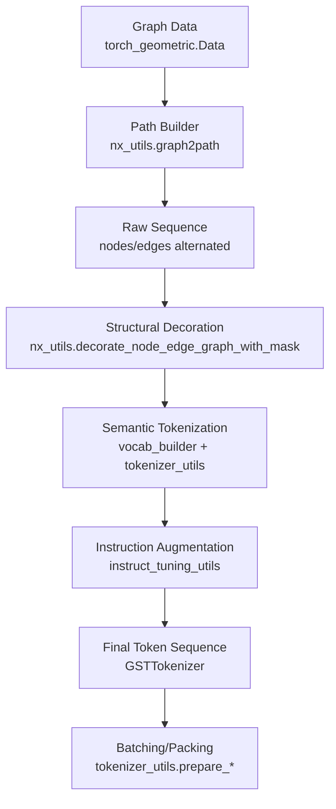
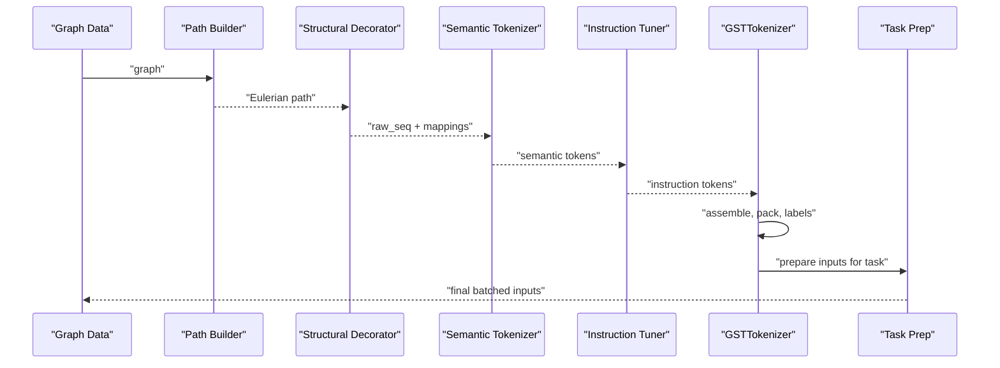
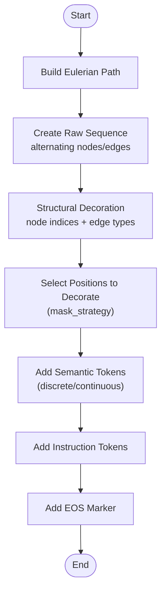
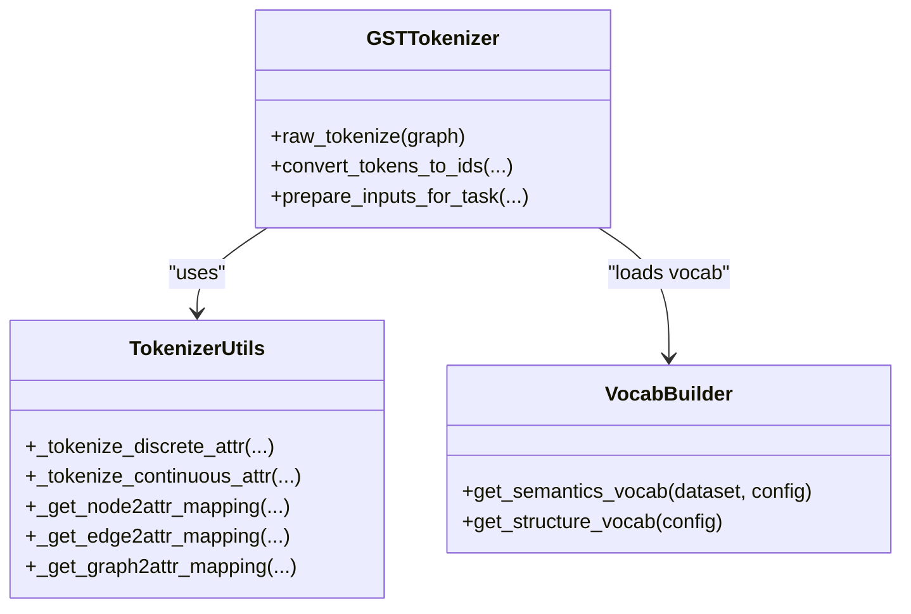
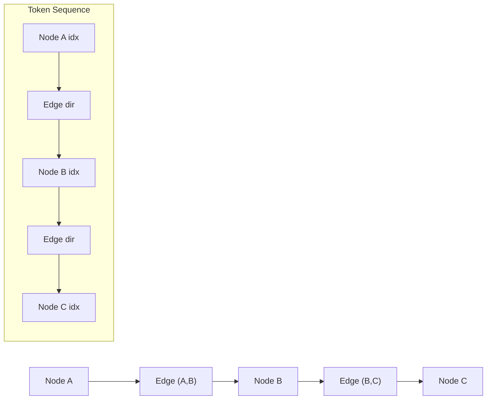
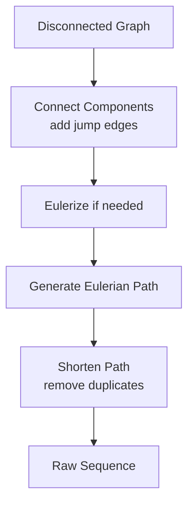
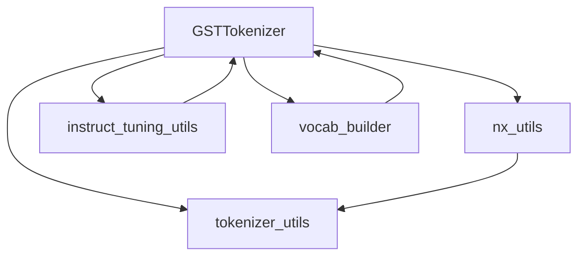

# Semantic-Structural Token Combination

<cite>
**Referenced Files in This Document**
- [tokenizer.py](file://src/data/tokenizer.py)
- [token_configs.py](file://src/conf/tokenization/token_configs.py)
- [nx_utils.py](file://src/utils/nx_utils.py)
- [tokenizer_utils.py](file://src/utils/tokenizer_utils.py)
- [instruct_tuning_utils.py](file://src/utils/instruct_tuning_utils.py)
- [vocab_builder.py](file://src/data/vocab_builder.py)
- [base.yaml](file://configs/tokenization/base.yaml)
- [pcqm4m-v2.yaml](file://configs/tokenization/graph_lvl/pcqm4m-v2.yaml)
- [ogbl_ppa.yaml](file://configs/tokenization/edge_lvl/ogbl_ppa.yaml)
</cite>

## Table of Contents
1. [Introduction](#introduction)
2. [Project Structure](#project-structure)
3. [Core Components](#core-components)
4. [Architecture Overview](#architecture-overview)
5. [Detailed Component Analysis](#detailed-component-analysis)
6. [Dependency Analysis](#dependency-analysis)
7. [Performance Considerations](#performance-considerations)
8. [Troubleshooting Guide](#troubleshooting-guide)
9. [Conclusion](#conclusion)
10. [Appendices](#appendices)

## Introduction
This document explains the semantic-structural token combination system that merges graph structure and semantic attributes into unified token sequences. It focuses on:
- How structural graph information (Eulerian path, node/edge types) is encoded as tokens
- How semantic attributes (node, edge, graph) are transformed into tokens
- How these tokens are assembled into coherent sequences for downstream tasks
- Configuration options controlling token ordering, separators, and contextual insertion
- Practical examples drawn from the codebase for node, edge, and graph levels
- Guidance on handling token ambiguity, sequence overflow, and semantic coherence

## Project Structure
The tokenization pipeline centers around a tokenizer that orchestrates:
- Path traversal of graphs into Eulerian sequences
- Structural tokenization (node indices, edge directionality)
- Semantic tokenization (discrete/continuous attributes)
- Instruction and graph-theory augmentations
- Packing and batching for pretraining

**Diagram sources**
- [nx_utils.py:351-422](file://src/utils/nx_utils.py#L351-L422)
- [nx_utils.py:554-591](file://src/utils/nx_utils.py#L554-L591)
- [tokenizer.py:428-535](file://src/data/tokenizer.py#L428-L535)
- [instruct_tuning_utils.py:12-48](file://src/utils/instruct_tuning_utils.py#L12-L48)
- [tokenizer_utils.py:222-363](file://src/utils/tokenizer_utils.py#L222-L363)

**Section sources**
- [tokenizer.py:428-535](file://src/data/tokenizer.py#L428-L535)
- [nx_utils.py:351-422](file://src/utils/nx_utils.py#L351-L422)
- [tokenizer_utils.py:222-363](file://src/utils/tokenizer_utils.py#L222-L363)

## Core Components
- GSTTokenizer: Orchestrates tokenization, packing, and task-specific input preparation.
- Path builder: Converts graphs into Eulerian sequences to preserve adjacency relationships and path continuity.
- Structural decorator: Maps nodes and edges to structure tokens (indices, directions).
- Semantic tokenizers: Transform discrete and continuous attributes into tokens using configured identifiers and separators.
- Instruction tuner: Injects contextual semantic instructions for downstream tasks.
- Vocabulary builder: Constructs unified token vocabularies for structure and semantics.

Key responsibilities:
- Assemble node-level tokens (node indices), edge-level tokens (direction tokens), and optional graph-level tokens (summary token).
- Insert contextual tokens (structure and semantics) and optional EOS markers.
- Prepare inputs for different tasks (pretrain, node, edge, graph) with appropriate labels and masks.

**Section sources**
- [tokenizer.py:30-120](file://src/data/tokenizer.py#L30-L120)
- [nx_utils.py:234-291](file://src/utils/nx_utils.py#L234-L291)
- [vocab_builder.py:18-110](file://src/data/vocab_builder.py#L18-L110)

## Architecture Overview
The tokenization pipeline integrates graph theory concepts (Eulerian paths) with semantic attribute encoding to produce token sequences suitable for autoregressive modeling.

**Diagram sources**
- [nx_utils.py:351-422](file://src/utils/nx_utils.py#L351-L422)
- [nx_utils.py:554-591](file://src/utils/nx_utils.py#L554-L591)
- [instruct_tuning_utils.py:12-48](file://src/utils/instruct_tuning_utils.py#L12-L48)
- [tokenizer.py:428-612](file://src/data/tokenizer.py#L428-L612)
- [tokenizer_utils.py:222-363](file://src/utils/tokenizer_utils.py#L222-L363)

## Detailed Component Analysis

### Token Assembly Process
- Path construction: Builds an Eulerian path to traverse adjacency relationships and maintain path continuity.
- Raw sequence: Alternates nodes and edges (node, edge, node, ...).
- Structural decoration: Converts nodes to index tokens and edges to directional tokens.
- Semantic decoration: Adds attribute tokens for selected positions based on masking strategy.
- Final assembly: Concatenates structural tokens, semantic tokens, optional instruction tokens, and EOS marker.

**Diagram sources**
- [nx_utils.py:351-422](file://src/utils/nx_utils.py#L351-L422)
- [nx_utils.py:554-591](file://src/utils/nx_utils.py#L554-L591)
- [instruct_tuning_utils.py:12-48](file://src/utils/instruct_tuning_utils.py#L12-L48)
- [tokenizer.py:428-535](file://src/data/tokenizer.py#L428-L535)

**Section sources**
- [nx_utils.py:425-437](file://src/utils/nx_utils.py#L425-L437)
- [nx_utils.py:554-591](file://src/utils/nx_utils.py#L554-L591)
- [tokenizer.py:428-535](file://src/data/tokenizer.py#L428-L535)

### Identifier Concatenation Strategies
- World and entity identifiers: Tokens encode dataset/world, node/edge/graph, column index, and value.
- Discrete attributes: Formatted as world#entity#col#val or world#entity#col when removing values.
- Continuous attributes: Digitized and prefixed with an identifier token (e.g., "<digit>").
- Edge direction tokens: "<edge_in>", "<edge_out>", "<edge_bi>", "<edge_jump>".
- Node index tokens: Base-scope reindexing with optional cyclic mapping.

**Diagram sources**
- [tokenizer_utils.py:688-756](file://src/utils/tokenizer_utils.py#L688-L756)
- [vocab_builder.py:18-110](file://src/data/vocab_builder.py#L18-L110)
- [tokenizer.py:428-557](file://src/data/tokenizer.py#L428-L557)

**Section sources**
- [tokenizer_utils.py:688-756](file://src/utils/tokenizer_utils.py#L688-L756)
- [vocab_builder.py:18-110](file://src/data/vocab_builder.py#L18-L110)

### Hierarchical Token Organization
- Node level: Node index tokens represent node identity; optional node attributes appended at masked positions.
- Edge level: Edge direction tokens represent adjacency relationships; optional edge attributes appended at masked positions.
- Graph level: Optional summary token appended to signal graph-level semantics.

**Diagram sources**
- [nx_utils.py:263-290](file://src/utils/nx_utils.py#L263-L290)
- [nx_utils.py:425-437](file://src/utils/nx_utils.py#L425-L437)

**Section sources**
- [nx_utils.py:263-290](file://src/utils/nx_utils.py#L263-L290)
- [nx_utils.py:425-437](file://src/utils/nx_utils.py#L425-L437)

### Integration of Node Structure Tokens, Edge Type Tokens, and Attribute Tokens
- Node structure tokens: Index tokens derived from node reindexing with configurable scope and base.
- Edge type tokens: Direction tokens indicating in/out/bi/jump relationships.
- Attribute tokens: Discrete and continuous attributes encoded with world/entity identifiers and separators.

Examples from configurations:
- Node scope and base: [base.yaml:87-93](file://configs/tokenization/base.yaml#L87-L93)
- Edge direction tokens: [base.yaml:94-99](file://configs/tokenization/base.yaml#L94-L99)
- Semantic attribute mapping: [base.yaml:29-51](file://configs/tokenization/base.yaml#L29-L51)

**Section sources**
- [base.yaml:87-99](file://configs/tokenization/base.yaml#L87-L99)
- [base.yaml:29-51](file://configs/tokenization/base.yaml#L29-L51)

### Token Ordering, Separator Usage, and Contextual Insertion
- Ordering: Nodes and edges alternate; graph-level tokens appended after EOS.
- Separators: Configurable separator token used during packing; numeric tokens use "<" and ">" wrappers.
- Contextual insertion: Instruction tokens and graph-theory-derived tokens injected based on configuration.

Configuration examples:
- Separator token: [base.yaml](file://configs/tokenization/base.yaml#L105)
- Instruction toggles: [base.yaml:78-81](file://configs/tokenization/base.yaml#L78-L81)
- Graph-theory augmentation: [base.yaml:84-86](file://configs/tokenization/base.yaml#L84-L86)

**Section sources**
- [base.yaml](file://configs/tokenization/base.yaml#L105)
- [base.yaml:78-86](file://configs/tokenization/base.yaml#L78-L86)

### Graph Theory Concepts: Adjacency Relationships and Path Continuity
- Eulerian path ensures traversal of edges and maintains adjacency continuity.
- Jump edges connect disconnected components; direction tokens distinguish intra-/inter-component transitions.
- Shortening removes redundant edges to avoid duplication while preserving uniqueness.

**Diagram sources**
- [nx_utils.py:326-348](file://src/utils/nx_utils.py#L326-L348)
- [nx_utils.py:351-422](file://src/utils/nx_utils.py#L351-L422)

**Section sources**
- [nx_utils.py:326-348](file://src/utils/nx_utils.py#L326-L348)
- [nx_utils.py:351-422](file://src/utils/nx_utils.py#L351-L422)

### Concrete Examples by Graph Level
- Node-level example: Target node token appended for node prediction tasks.
- Edge-level example: Source and destination node tokens plus optional edge attributes for edge prediction.
- Graph-level example: Summary token appended for graph regression tasks.

Configuration references:
- Node-level: [pcqm4m-v2.yaml:8-11](file://configs/tokenization/graph_lvl/pcqm4m-v2.yaml#L8-L11)
- Edge-level: [ogbl_ppa.yaml:31-34](file://configs/tokenization/edge_lvl/ogbl_ppa.yaml#L31-L34)
- Graph-level: [pcqm4m-v2.yaml:97-98](file://configs/tokenization/graph_lvl/pcqm4m-v2.yaml#L97-L98)

**Section sources**
- [pcqm4m-v2.yaml:8-11](file://configs/tokenization/graph_lvl/pcqm4m-v2.yaml#L8-L11)
- [ogbl_ppa.yaml:31-34](file://configs/tokenization/edge_lvl/ogbl_ppa.yaml#L31-L34)
- [pcqm4m-v2.yaml:97-98](file://configs/tokenization/graph_lvl/pcqm4m-v2.yaml#L97-L98)

## Dependency Analysis
The tokenization pipeline depends on:
- Graph utilities for path construction and edge classification
- Tokenization utilities for masking and task-specific input preparation
- Instruction utilities for contextual augmentation
- Vocabulary builder for unified token mapping

**Diagram sources**
- [tokenizer.py:428-612](file://src/data/tokenizer.py#L428-L612)
- [nx_utils.py:17-50](file://src/utils/nx_utils.py#L17-L50)
- [tokenizer_utils.py:222-363](file://src/utils/tokenizer_utils.py#L222-L363)
- [instruct_tuning_utils.py:12-48](file://src/utils/instruct_tuning_utils.py#L12-L48)
- [vocab_builder.py:188-218](file://src/data/vocab_builder.py#L188-L218)

**Section sources**
- [tokenizer.py:428-612](file://src/data/tokenizer.py#L428-L612)
- [nx_utils.py:17-50](file://src/utils/nx_utils.py#L17-L50)
- [tokenizer_utils.py:222-363](file://src/utils/tokenizer_utils.py#L222-L363)
- [instruct_tuning_utils.py:12-48](file://src/utils/instruct_tuning_utils.py#L12-L48)
- [vocab_builder.py:188-218](file://src/data/vocab_builder.py#L188-L218)

## Performance Considerations
- Path construction and decoration are O(N + E) per graph; consider caching or precomputing paths for large datasets.
- Packing multiple sequences increases memory footprint; monitor attention mask sizes and block-diagonal construction.
- Attribute tokenization overhead scales with number of columns and values; consider ignoring rare values and sharing vocabularies.
- Position ID generation and cyclic modes impact training stability; tune scope_base and cyclic settings for your dataset.

## Troubleshooting Guide
Common issues and resolutions:
- Token ambiguity
  - Cause: Overlapping identifiers or shared vocab for discrete attributes.
  - Resolution: Enable value removal or sharing vocab; adjust world/entity identifiers.
  - Reference: [tokenizer_utils.py:688-717](file://src/utils/tokenizer_utils.py#L688-L717), [vocab_builder.py:18-54](file://src/data/vocab_builder.py#L18-L54)
- Sequence overflow
  - Cause: Long graphs or multiple packed sequences.
  - Resolution: Increase max length, adjust packing method, or shorten graphs.
  - Reference: [tokenizer.py:235-267](file://src/data/tokenizer.py#L235-L267), [tokenizer_utils.py:222-363](file://src/utils/tokenizer_utils.py#L222-L363)
- Semantic coherence
  - Cause: Incorrect masking or missing labels for target positions.
  - Resolution: Verify mask strategy and label padding; ensure target tokens are appended for node/edge tasks.
  - Reference: [nx_utils.py:615-630](file://src/utils/nx_utils.py#L615-L630), [tokenizer_utils.py:222-363](file://src/utils/tokenizer_utils.py#L222-L363)
- Graph-theory inconsistencies
  - Cause: Disconnected graphs or missing edge types.
  - Resolution: Connect components and ensure direction tokens are present; handle jump edges.
  - Reference: [nx_utils.py:293-328](file://src/utils/nx_utils.py#L293-L328), [nx_utils.py:271-290](file://src/utils/nx_utils.py#L271-L290)

**Section sources**
- [tokenizer_utils.py:688-717](file://src/utils/tokenizer_utils.py#L688-L717)
- [vocab_builder.py:18-54](file://src/data/vocab_builder.py#L18-L54)
- [tokenizer.py:235-267](file://src/data/tokenizer.py#L235-L267)
- [nx_utils.py:293-328](file://src/utils/nx_utils.py#L293-L328)
- [nx_utils.py:271-290](file://src/utils/nx_utils.py#L271-L290)
- [nx_utils.py:615-630](file://src/utils/nx_utils.py#L615-L630)

## Conclusion
The semantic-structural token combination system integrates graph theory (Eulerian paths) with semantic attribute encoding to produce robust token sequences. By configuring structure and semantics consistently, injecting contextual instructions, and carefully managing masking and packing, practitioners can achieve strong performance across node, edge, and graph-level tasks. The provided examples and troubleshooting guidance offer practical pathways to implement and customize token combination strategies.

## Appendices

### Configuration Options Summary
- Structure tokens
  - Node scope and base: [base.yaml:87-93](file://configs/tokenization/base.yaml#L87-L93)
  - Edge direction tokens: [base.yaml:94-99](file://configs/tokenization/base.yaml#L94-L99)
  - Graph summary token: [base.yaml:100-101](file://configs/tokenization/base.yaml#L100-L101)
- Semantic tokens
  - Attribute assignment and shuffle: [base.yaml:29-31](file://configs/tokenization/base.yaml#L29-L31)
  - Node/edge/graph attribute mapping: [base.yaml:29-51](file://configs/tokenization/base.yaml#L29-L51)
- Task-specific
  - Pretraining masking and scheduling: [pcqm4m-v2.yaml:14-21](file://configs/tokenization/graph_lvl/pcqm4m-v2.yaml#L14-L21)
  - Instruction toggles: [base.yaml:78-81](file://configs/tokenization/base.yaml#L78-L81)

**Section sources**
- [base.yaml:87-101](file://configs/tokenization/base.yaml#L87-L101)
- [base.yaml:29-51](file://configs/tokenization/base.yaml#L29-L51)
- [pcqm4m-v2.yaml:14-21](file://configs/tokenization/graph_lvl/pcqm4m-v2.yaml#L14-L21)
