# Tokenization System

<cite>
**Referenced Files in This Document**
- [base.py](file://src/data/tokenizer/base.py)
- [core.py](file://src/data/tokenizer/core.py)
- [strategies/__init__.py](file://src/data/tokenizer/strategies/__init__.py)
- [strategies/padding.py](file://src/data/tokenizer/strategies/padding.py)
- [strategies/packing.py](file://src/data/tokenizer/strategies/packing.py)
- [strategies/task_prep/base.py](file://src/data/tokenizer/strategies/task_prep/base.py)
- [strategies/task_prep/__init__.py](file://src/data/tokenizer/strategies/task_prep/__init__.py)
- [strategies/task_prep/pretrain.py](file://src/data/tokenizer/strategies/task_prep/pretrain.py)
- [strategies/task_prep/supervised.py](file://src/data/tokenizer/strategies/task_prep/supervised.py)
- [__init__.py](file://src/data/tokenizer/__init__.py)
- [_legacy.py](file://src/data/tokenizer/_legacy.py)
- [graph_encoding.py](file://src/data/tokenizer/graph_encoding.py)
- [masking.py](file://src/data/tokenizer/masking.py)
- [padding.py](file://src/data/tokenizer/padding.py)
- [stacking.py](file://src/data/tokenizer/stacking.py)
- [task_prep.py](file://src/data/tokenizer/task_prep.py)
- [types.py](file://src/data/tokenizer/types.py)
- [vocab.py](file://src/data/tokenizer/vocab.py)
- [token_configs.py](file://src/conf/tokenization/token_configs.py)
- [base.yaml](file://configs/tokenization/base.yaml)
- [base_configs.py](file://src/conf/base_configs.py)
- [model_configs.py](file://src/conf/model/model_configs.py)
- [utils_graphgpt.py](file://src/models/graphgpt/utils_graphgpt.py)
- [flex_attn_utils.py](file://src/utils/flex_attn_utils.py)
- [training_utils.py](file://src/utils/training_utils.py)
- [collator.py](file://src/data/collator.py)
- [modeling_common.py](file://src/models/graphgpt/modeling_common.py)
- [modeling_finetune.py](file://src/models/graphgpt/modeling_finetune.py)
- [graph_utils.py](file://src/data/_helpers/graph_utils.py)
- [pcqm4m-v2.yaml](file://configs/tokenization/graph_lvl/pcqm4m-v2.yaml)
- [pretrain_mode.py](file://src/training/pretrain_mode.py)
- [inspection_utils.py](file://src/utils/inspection_utils.py)
- [nx_utils.py](file://src/utils/nx_utils.py)
- [instruct_tuning_utils.py](file://src/utils/instruct_tuning_utils.py)
</cite>

## Update Summary
**Changes Made**
- Enhanced error handling and type safety for node feature extraction across tokenizer stacking, instruct tuning utilities, and graph utilities
- Improved node structure mapping type handling with robust assertion checks and default value fallbacks
- Strengthened type validation for discrete and embedding attribute mappings in default semantics functions
- Enhanced node feature extraction functions with comprehensive type safety and error handling
- Improved instruction tuning utilities with better type validation for node structure mappings

## Table of Contents
1. [Introduction](#introduction)
2. [Project Structure](#project-structure)
3. [Core Components](#core-components)
4. [Architecture Overview](#architecture-overview)
5. [Detailed Component Analysis](#detailed-component-analysis)
6. [Enhanced Vectorized Masking System](#enhanced-vectorized-masking-system)
7. [Strategy Pattern Implementation](#strategy-pattern-implementation)
8. [Enhanced Sequence Length Management](#enhanced-sequence-length-management)
9. [Configuration Parameter Updates](#configuration-parameter-updates)
10. [Attention Mode Handling for Packed Sequences](#attention-mode-handling-for-packed-sequences)
11. [Performance Improvements for Packed Sequences](#performance-improvements-for-packed-sequences)
12. [Backward Compatibility System](#backward-compatibility-system)
13. [Dependency Analysis](#dependency-analysis)
14. [Performance Considerations](#performance-considerations)
15. [Troubleshooting Guide](#troubleshooting-guide)
16. [Conclusion](#conclusion)
17. [Appendices](#appendices)

## Introduction
This document explains the Graph-GPT tokenization system with a focus on graph-to-sequence conversion methodologies. The system has undergone a significant architectural transformation from a monolithic structure to a modern composition-based design using strategy patterns, significantly enhancing maintainability, flexibility, and extensibility.

The new modular architecture organizes tokenization functionality into specialized components following the strategy pattern:
- **BaseTokenizer**: Abstract base class with composition-based design and enhanced error handling
- **Strategy Classes**: Dedicated classes for padding, sequence packing, and task preparation
- **Core Tokenizers**: GSTTokenizer and StackedGSTTokenizer inheriting from BaseTokenizer with improved attribute handling
- **Vectorized Masking**: Sophisticated mask ratio computation and unified masking functions with NumPy optimization
- **Graph Encoding**: Attribute tokenization and semantics mapping with discrete/continuous feature handling
- **Enhanced Pretraining**: Fully vectorized pretraining strategies with polynomial and cosine masking approaches
- **Padding**: Batch construction and sequence padding with strategy-based design
- **Stacking**: Dense matrix generation for transformer inputs with short/long stacking methods and default attribute support
- **Task Preparation**: Task-specific input assembly with attention mode coordination and packed sequence handling
- **Types**: Data structures and constants with TokenizationOutput dataclass
- **Vocabulary**: Building and loading token mappings with structure and semantics vocabularies

Key features include Eulerian path-based serialization, attribute stacking strategies (short, long, prolonged), **simplified flat indexing system** replacing hierarchical indexing, semantic-structural token combination, comprehensive configuration management with strategy-based parameter handling, and enhanced error handling throughout the system.

**Updated** The tokenization system now features a sophisticated strategy pattern implementation with BaseTokenizer as the abstract base class, pluggable strategy components for padding, sequence packing, and task preparation, enhanced vectorized masking functionality with improved packed sequence handling, streamlined attention mask processing, comprehensive backward compatibility system with lazy loading, and comprehensive default attribute mapping support for StackedGSTTokenizer. The **flat indexing system** has replaced the previous hierarchical indexing approach, providing simpler and more efficient node and edge tokenization.

**Enhanced Performance Optimizations**: The system now includes comprehensive performance improvements in graph encoding and utility modules, featuring optimized edge attribute mapping and edge type determination operations that provide substantial speed improvements for large-scale graph processing tasks. Key optimizations include TokenCache and DigitTokenCache implementations for reduced string formatting overhead, set-based edge existence checks for O(1) performance, and pre-built edge index maps for efficient attribute mapping.

**Enhanced Type Safety**: Recent improvements focus on robust type handling for node feature extraction across tokenizer stacking, instruct tuning utilities, and graph utilities, ensuring reliable operation with diverse graph data types and configurations.

## Project Structure
The tokenization system is organized as a package with specialized modules following the strategy pattern, each handling specific aspects of the tokenization process through composition rather than inheritance:

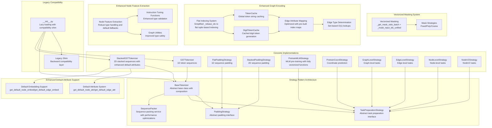

**Diagram sources**
- [base.py:13-187](file://src/data/tokenizer/base.py#L13-L187)
- [core.py:13-559](file://src/data/tokenizer/core.py#L13-L559)
- [strategies/padding.py:9-239](file://src/data/tokenizer/strategies/padding.py#L9-L239)
- [strategies/task_prep/base.py:11-83](file://src/data/tokenizer/strategies/task_prep/base.py#L11-L83)
- [strategies/packing.py:12-144](file://src/data/tokenizer/strategies/packing.py#L12-L144)
- [strategies/task_prep/pretrain.py:7-223](file://src/data/tokenizer/strategies/task_prep/pretrain.py#L7-L223)
- [strategies/task_prep/supervised.py:7-253](file://src/data/tokenizer/strategies/task_prep/supervised.py#L7-L253)
- [__init__.py:17-123](file://src/data/tokenizer/__init__.py#L17-L123)
- [_legacy.py:1-42](file://src/data/tokenizer/_legacy.py#L1-L42)
- [masking.py:54-123](file://src/data/tokenizer/masking.py#L54-L123)
- [graph_encoding.py:11-96](file://src/data/tokenizer/graph_encoding.py#L11-L96)
- [nx_utils.py:256-270](file://src/utils/nx_utils.py#L256-L270)
- [nx_utils.py:223-226](file://src/utils/nx_utils.py#L223-L226)
- [stacking.py:20-90](file://src/data/tokenizer/stacking.py#L20-L90)
- [stacking.py:93-183](file://src/data/tokenizer/stacking.py#L93-L183)
- [instruct_tuning_utils.py:160-195](file://src/utils/instruct_tuning_utils.py#L160-L195)
- [graph_utils.py:1-87](file://src/data/_helpers/graph_utils.py#L1-L87)

**Section sources**
- [base.py:13-187](file://src/data/tokenizer/base.py#L13-L187)
- [core.py:13-559](file://src/data/tokenizer/core.py#L13-L559)
- [strategies/__init__.py:1-30](file://src/data/tokenizer/strategies/__init__.py#L1-L30)
- [strategies/padding.py:9-239](file://src/data/tokenizer/strategies/padding.py#L9-L239)
- [strategies/task_prep/base.py:11-83](file://src/data/tokenizer/strategies/task_prep/base.py#L11-L83)
- [strategies/packing.py:12-144](file://src/data/tokenizer/strategies/packing.py#L12-L144)
- [strategies/task_prep/__init__.py:1-46](file://src/data/tokenizer/strategies/task_prep/__init__.py#L1-L46)
- [strategies/task_prep/pretrain.py:7-223](file://src/data/tokenizer/strategies/task_prep/pretrain.py#L7-L223)
- [strategies/task_prep/supervised.py:7-253](file://src/data/tokenizer/strategies/task_prep/supervised.py#L7-L253)
- [__init__.py:17-123](file://src/data/tokenizer/__init__.py#L17-L123)
- [_legacy.py:1-42](file://src/data/tokenizer/_legacy.py#L1-L42)

## Core Components

### BaseTokenizer: Abstract Strategy Base Class with Enhanced Error Handling
The BaseTokenizer serves as the abstract base class implementing the strategy pattern for tokenization with comprehensive error handling:

- **Composition Design**: Manages padding_strategy, sequence_packer, and task_preparer as injected dependencies
- **Abstract Methods**: Defines tokenize() and convert_tokens_to_ids() as abstract methods
- **Vocabulary Management**: Centralized vocabulary loading and token ID mapping with robust error handling
- **Task Validation**: Validates task types against supported configurations with clear error messages
- **Pipeline Execution**: Orchestrates the complete tokenization pipeline with strategy delegation and comprehensive validation
- **Error Handling**: Enhanced error handling with proper exception types and meaningful error messages

### Strategy Pattern Implementations
- **PaddingStrategy**: Abstract base for sequence padding with FlatPaddingStrategy and StackedPaddingStrategy implementations
- **TaskPreparationStrategy**: Abstract base for task-specific input preparation with specialized implementations for different task types
- **SequencePacker**: Service class for packing multiple sequences into single long sequences with comprehensive performance optimizations

### Core Tokenizer Classes
- **GSTTokenizer**: Base class for 1D token sequences with flat padding strategy and enhanced validation
- **StackedGSTTokenizer**: Extends BaseTokenizer for 2D stacked token sequences with comprehensive default attribute support and improved error handling
- **TokenizationOutput**: Dataclass for standardized tokenization outputs with all metadata

**Updated** The StackedGSTTokenizer now includes comprehensive default attribute mapping methods (get_default_node_attr, get_default_edge_attr, get_default_node_embed, get_default_edge_embed) with lazy initialization and caching for improved performance and reliability.

**Section sources**
- [base.py:13-187](file://src/data/tokenizer/base.py#L13-L187)
- [core.py:13-559](file://src/data/tokenizer/core.py#L13-L559)
- [strategies/padding.py:9-239](file://src/data/tokenizer/strategies/padding.py#L9-L239)
- [strategies/task_prep/base.py:11-83](file://src/data/tokenizer/strategies/task_prep/base.py#L11-L83)
- [strategies/packing.py:12-144](file://src/data/tokenizer/strategies/packing.py#L12-L144)
- [types.py:14-42](file://src/data/tokenizer/types.py#L14-L42)

## Architecture Overview
The strategy pattern-based tokenization pipeline transforms PyG graphs to token sequences through pluggable strategy components, each handling specific aspects of the transformation process with enhanced flexibility, maintainability, and comprehensive error handling.

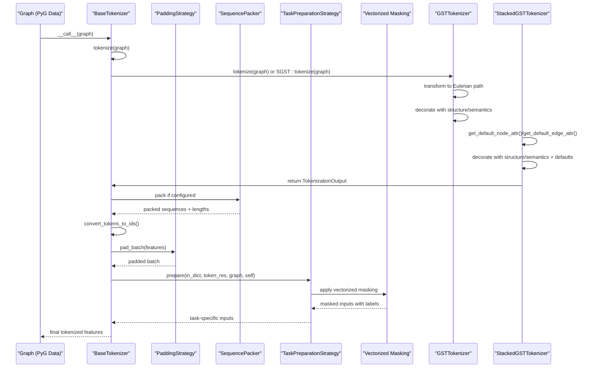

**Diagram sources**
- [base.py:137-169](file://src/data/tokenizer/base.py#L137-L169)
- [core.py:100-183](file://src/data/tokenizer/core.py#L100-L183)
- [core.py:353-498](file://src/data/tokenizer/core.py#L353-L498)
- [strategies/padding.py:42-138](file://src/data/tokenizer/strategies/padding.py#L42-L138)
- [strategies/packing.py:34-86](file://src/data/tokenizer/strategies/packing.py#L34-L86)
- [strategies/task_prep/base.py:14-34](file://src/data/tokenizer/strategies/task_prep/base.py#L14-L34)
- [strategies/task_prep/pretrain.py:16-62](file://src/data/tokenizer/strategies/task_prep/pretrain.py#L16-L62)
- [masking.py:54-123](file://src/data/tokenizer/masking.py#L54-L123)

## Detailed Component Analysis

### Strategy Pattern Package Structure
The tokenization system implements a comprehensive strategy pattern with clear separation of concerns and enhanced error handling:

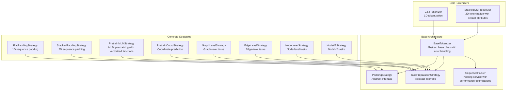

**Diagram sources**
- [base.py:13-187](file://src/data/tokenizer/base.py#L13-L187)
- [core.py:13-559](file://src/data/tokenizer/core.py#L13-L559)
- [strategies/padding.py:9-239](file://src/data/tokenizer/strategies/padding.py#L9-L239)
- [strategies/task_prep/base.py:11-83](file://src/data/tokenizer/strategies/task_prep/base.py#L11-L83)
- [strategies/packing.py:12-144](file://src/data/tokenizer/strategies/packing.py#L12-L144)

### Backward Compatibility System
The system maintains backward compatibility through a sophisticated compatibility shim system:

- **Lazy Loading**: The main `__init__.py` uses lazy loading to avoid circular imports
- **Compatibility Shim**: `_legacy.py` re-exports all public names from new modular structure
- **Import Preservation**: Existing import patterns continue to work without changes
- **Gradual Migration**: Code can be gradually migrated to use new modular imports

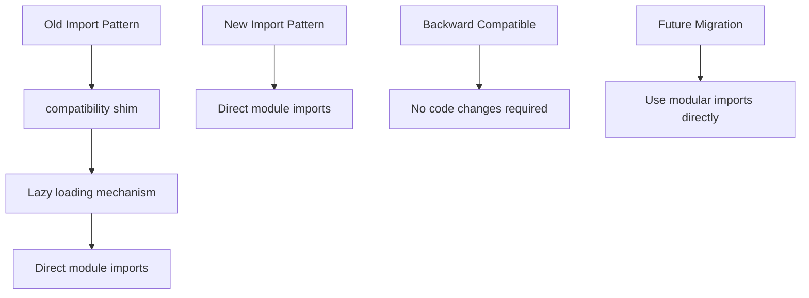

**Diagram sources**
- [__init__.py:78-123](file://src/data/tokenizer/__init__.py#L78-L123)
- [_legacy.py:1-42](file://src/data/tokenizer/_legacy.py#L1-L42)

**Section sources**
- [__init__.py:17-123](file://src/data/tokenizer/__init__.py#L17-L123)
- [_legacy.py:1-42](file://src/data/tokenizer/_legacy.py#L1-L42)

### Eulerian Path-Based Serialization
The core tokenization process transforms graphs into Eulerian paths with specialized handling for different scenarios:

- **Graph-to-path conversion**: Handles disconnected graphs, redundant traversals, and prioritization
- **Node re-indexing**: Supports cyclic and non-cyclic modes with **simplified flat indexing approach**
- **Structure decoration**: Adds node/edge/graph structure tokens throughout the path

**Updated** The node re-indexing system has been simplified to use flat indexing instead of hierarchical indexing:
- **Previous approach**: Used scope_base parameter for hierarchical base-based indexing
- **Current approach**: Uses `_rebase_idx()` function that returns `(str(idx),)` tuple for flat indexing
- **Scope parameter**: Still honored for node_scope but base parameter is preserved for backward compatibility
- **Performance improvement**: Eliminates complex base calculations in favor of simple string conversion

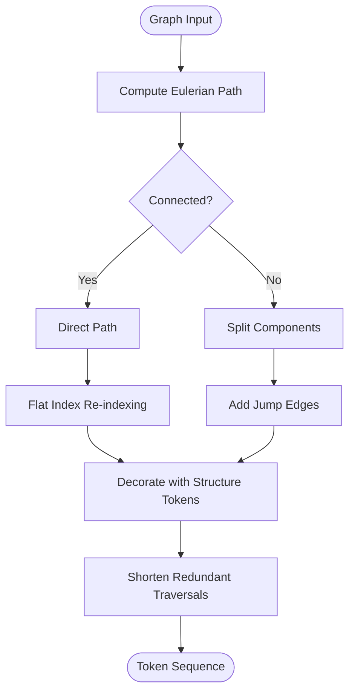

**Diagram sources**
- [core.py:106-111](file://src/data/tokenizer/core.py#L106-L111)
- [nx_utils.py:368-402](file://src/utils/nx_utils.py#L368-L402)
- [nx_utils.py:223-226](file://src/utils/nx_utils.py#L223-L226)

**Section sources**
- [core.py:100-183](file://src/data/tokenizer/core.py#L100-L183)
- [nx_utils.py:368-402](file://src/utils/nx_utils.py#L368-L402)
- [nx_utils.py:223-226](file://src/utils/nx_utils.py#L223-L226)

### Enhanced Attribute Stacking Methods
The system provides comprehensive attribute stacking strategies with enhanced default attribute support:

**Short Stacking**: Each node token is augmented with its attributes, creating a matrix where rows correspond to nodes along the Eulerian path
**Long Stacking**: Attributes are stacked to both nodes and edges, producing a richer matrix with separate rows for nodes and edges
**Default Attribute Support**: Comprehensive default attribute mapping for missing or edge cases

**Updated** The StackedGSTTokenizer now includes sophisticated default attribute methods:
- `get_default_node_attr()`: Returns default node attribute tokens
- `get_default_edge_attr()`: Returns default edge attribute tokens
- `get_default_node_embed()`: Returns default node embedding vectors
- `get_default_edge_embed()`: Returns default edge embedding vectors
- `get_default_edge_attr_id()`: Returns default edge attribute token IDs

Implementation highlights include lazy initialization, caching, comprehensive validation, and seamless integration with existing stacking methods.

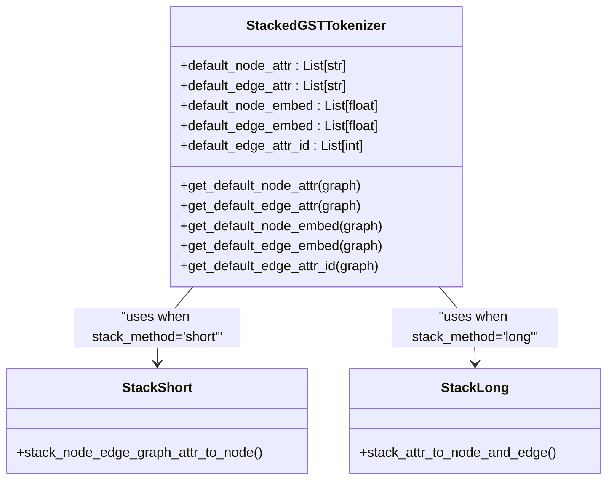

**Diagram sources**
- [core.py:284-324](file://src/data/tokenizer/core.py#L284-L324)
- [core.py:353-498](file://src/data/tokenizer/core.py#L353-L498)
- [stacking.py:20-90](file://src/data/tokenizer/stacking.py#L20-L90)
- [stacking.py:93-183](file://src/data/tokenizer/stacking.py#L93-L183)

**Section sources**
- [core.py:284-324](file://src/data/tokenizer/core.py#L284-L324)
- [core.py:353-498](file://src/data/tokenizer/core.py#L353-L498)
- [stacking.py:20-90](file://src/data/tokenizer/stacking.py#L20-L90)
- [stacking.py:93-183](file://src/data/tokenizer/stacking.py#L93-L183)
- [stacking.py:186-221](file://src/data/tokenizer/stacking.py#L186-L221)

### Semantic-Structural Token Combination
The system combines structural and semantic tokens through a comprehensive mapping system with enhanced default attribute support:

- **Structure tokens**: Node start/end/new tokens, edge direction tokens, graph summary tokens
- **Semantic tokens**: Discrete and continuous attribute tokens from node/edge/graph features
- **Default attributes**: Comprehensive default attribute support for missing or edge cases
- **Decoration process**: Sequential application of structure and semantics to path elements with default fallbacks
- **Instruction integration**: Optional instruction-based enhancements for improved understanding

**Updated** The semantic-structural combination now includes comprehensive default attribute handling:
- Default node attributes are automatically applied for missing node mappings
- Default edge attributes are automatically applied for jump edges and missing mappings
- Default embeddings are provided for embedding-based features
- Seamless integration with instruction tuning utilities

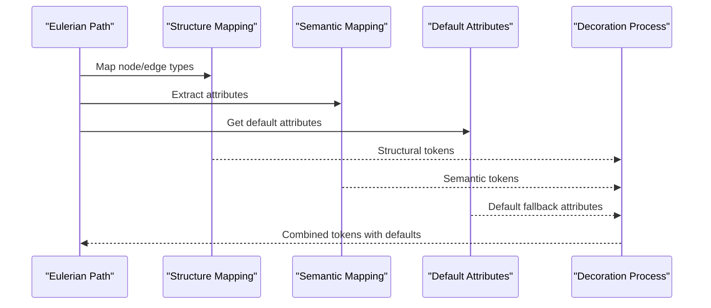

**Diagram sources**
- [core.py:397-408](file://src/data/tokenizer/core.py#L397-L408)
- [nx_utils.py:560-573](file://src/utils/nx_utils.py#L560-L573)
- [core.py:141-147](file://src/data/tokenizer/core.py#L141-L147)

**Section sources**
- [core.py:397-408](file://src/data/tokenizer/core.py#L397-L408)
- [nx_utils.py:560-573](file://src/utils/nx_utils.py#L560-L573)
- [core.py:141-147](file://src/data/tokenizer/core.py#L141-L147)

### Enhanced Node Feature Extraction with Type Safety
Recent improvements focus on robust type handling for node feature extraction across all components:

**Node Feature Extraction Functions**: Enhanced with comprehensive type validation and default value fallbacks
**Default Semantics Functions**: Strengthened assertion checks for discrete and embedding attribute mappings
**Instruction Tuning Utilities**: Improved type validation for node structure mappings
**Graph Utilities**: Enhanced type safety for graph transformation operations

**Updated** The node feature extraction system now includes:

- **Robust Type Validation**: Comprehensive assertion checks for attribute dimensionality and data types
- **Default Value Fallbacks**: Automatic fallback to default attributes for missing or edge cases
- **Enhanced Error Handling**: Meaningful error messages for type mismatches and missing configurations
- **Improved Instruction Integration**: Better type validation for instruction-based tokenization

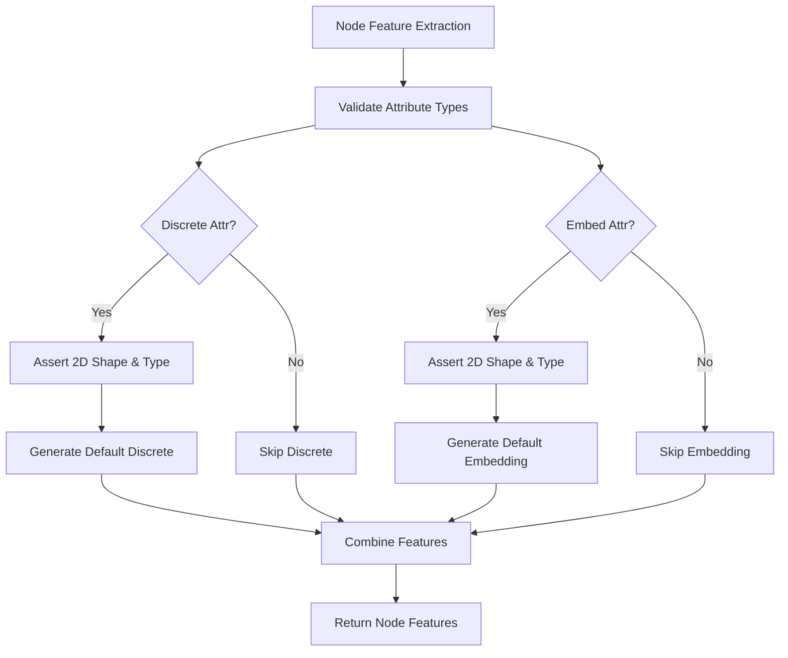

**Diagram sources**
- [stacking.py:20-90](file://src/data/tokenizer/stacking.py#L20-L90)
- [stacking.py:194-228](file://src/data/tokenizer/stacking.py#L194-L228)
- [instruct_tuning_utils.py:160-195](file://src/utils/instruct_tuning_utils.py#L160-L195)
- [graph_utils.py:1-87](file://src/data/_helpers/graph_utils.py#L1-L87)

**Section sources**
- [stacking.py:20-90](file://src/data/tokenizer/stacking.py#L20-L90)
- [stacking.py:194-228](file://src/data/tokenizer/stacking.py#L194-L228)
- [instruct_tuning_utils.py:160-195](file://src/utils/instruct_tuning_utils.py#L160-L195)
- [graph_utils.py:1-87](file://src/data/_helpers/graph_utils.py#L1-L87)

### Vocabulary Building and Management
The modular vocabulary system provides comprehensive token-to-id mapping capabilities:

- **Structure vocabulary**: Reserved tokens, node/edge/graph tokens, numeric tokens
- **Semantic vocabulary**: Tokens built from discrete and continuous features
- **Dynamic building**: Automated vocabulary construction from datasets
- **Loading system**: Efficient token-to-id mapping with label padding support

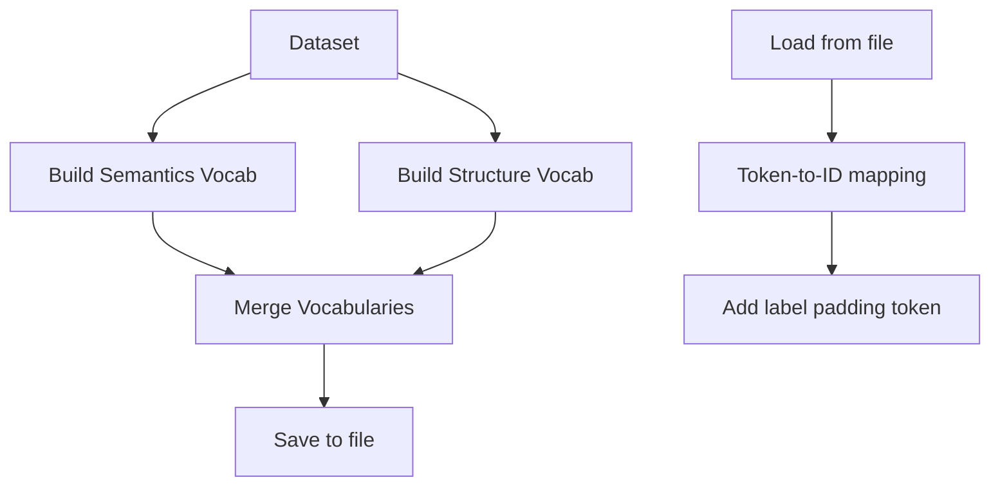

**Diagram sources**
- [vocab.py:87-112](file://src/data/tokenizer/vocab.py#L87-L112)
- [vocab.py:190-221](file://src/data/tokenizer/vocab.py#L190-L221)
- [vocab_builder.py:1-15](file://src/data/vocab_builder.py#L1-L15)

**Section sources**
- [vocab.py:87-112](file://src/data/tokenizer/vocab.py#L87-L112)
- [vocab.py:190-221](file://src/data/tokenizer/vocab.py#L190-L221)
- [vocab_builder.py:1-15](file://src/data/vocab_builder.py#L1-L15)

### Task-Specific Input Preparation
The system provides specialized input preparation for different task types with enhanced sequence length management and attention mode coordination:

- **Pretraining**: Enhanced masking strategies (MLM, coordinate prediction, contrastive learning) with automatic sequence length tracking, attention mode specification, and improved packed sequence handling
- **Supervised tasks**: Node-level, edge-level, and graph-level task preparation
- **Packed sequences**: Support for combining multiple samples into single sequences with sample_lens field and attention mode coordination
- **Attention masks**: Automatic generation of appropriate attention masks with split_lens and attn_modes coordination

**Updated** The task preparation now includes sophisticated attention mode handling through the attn_modes field, enabling flexible attention configurations (causal, full, noise) for different parts of packed sequences with flex-attn integration. Enhanced masking strategies provide consistent mask ratios across packed sequence segments.

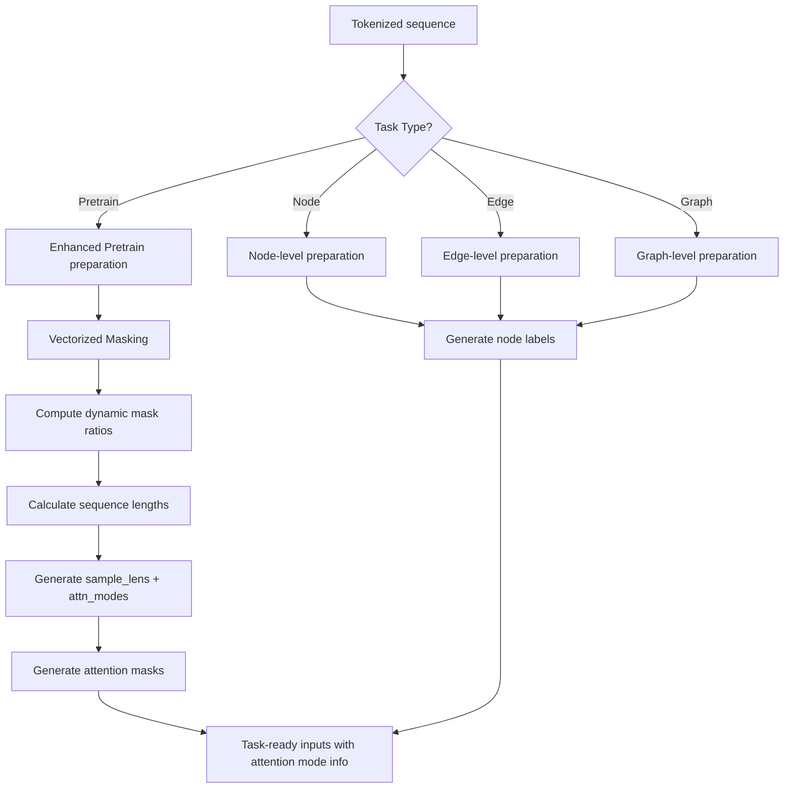

**Diagram sources**
- [strategies/task_prep/pretrain.py:10-143](file://src/data/tokenizer/strategies/task_prep/pretrain.py#L10-L143)
- [strategies/task_prep/supervised.py:10-186](file://src/data/tokenizer/strategies/task_prep/supervised.py#L10-L186)
- [masking.py:54-71](file://src/data/tokenizer/masking.py#L54-L71)
- [flex_attn_utils.py:213-289](file://src/utils/flex_attn_utils.py#L213-L289)

**Section sources**
- [strategies/task_prep/pretrain.py:10-143](file://src/data/tokenizer/strategies/task_prep/pretrain.py#L10-L143)
- [strategies/task_prep/supervised.py:10-186](file://src/data/tokenizer/strategies/task_prep/supervised.py#L10-L186)
- [masking.py:54-71](file://src/data/tokenizer/masking.py#L54-L71)
- [flex_attn_utils.py:213-289](file://src/utils/flex_attn_utils.py#L213-L289)

### Molecular Tokenization Constants
The molecular tokenization system utilizes specific constants for energy-related operations:

- **MOL_ENERGY_BIN_LEN**: Binary representation length (16 bits) used for molecular energy tokenization
- **MOL_ENERGY_SCALE**: Scaling factor (1000) for molecular energy normalization

**Updated** These constants are retained in the codebase for other purposes but are no longer used for the experimental binary classification feature that has been removed.

**Section sources**
- [types.py:9-11](file://src/data/tokenizer/types.py#L9-L11)
- [modeling_finetune.py:464-483](file://src/models/graphgpt/modeling_finetune.py#L464-L483)
- [modeling_finetune.py:861-863](file://src/models/graphgpt/modeling_finetune.py#L861-L863)

### Enhanced Graph Encoding Performance Optimizations
The system now includes comprehensive performance optimizations in graph encoding and utility modules:

**TokenCache Implementation**: Global caching system for token strings to avoid repeated string formatting operations, with separate methods for different token formats including shared vocabulary and value-less tokens.

**DigitTokenCache Implementation**: Specialized caching for digit tokens like `<0>`, `<1>`, etc., reducing string creation overhead during continuous attribute tokenization.

**Optimized Edge Type Determination**: Edge type mapping now uses set-based lookups for O(1) edge existence checks, replacing linear searches through edge lists.

**Efficient Edge Attribute Mapping**: Pre-built edge index maps eliminate repeated dictionary creation during attribute extraction, significantly improving performance for large graphs.

**Comprehensive Caching Strategy**: Strategic caching throughout the tokenization pipeline reduces memory allocations and improves computational efficiency.

**Updated** The flat indexing system provides significant performance improvements:
- **Simplified `_rebase_idx()`**: Now returns `(str(idx),)` tuple instead of complex hierarchical base calculations
- **Scope parameter preservation**: node_scope still controls indexing scope but base parameter is ignored
- **Eliminated base calculations**: Removed all base-based indexing logic in favor of direct string conversion
- **Backward compatibility**: scope_base parameter preserved but has no functional impact

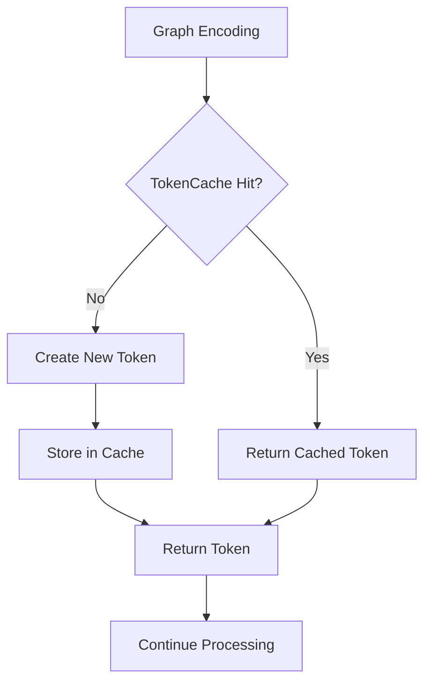

**Diagram sources**
- [graph_encoding.py:26-96](file://src/data/tokenizer/graph_encoding.py#L26-L96)
- [graph_encoding.py:202-215](file://src/data/tokenizer/graph_encoding.py#L202-L215)
- [nx_utils.py:256-270](file://src/utils/nx_utils.py#L256-L270)
- [nx_utils.py:223-226](file://src/utils/nx_utils.py#L223-L226)

**Section sources**
- [graph_encoding.py:11-96](file://src/data/tokenizer/graph_encoding.py#L11-L96)
- [graph_encoding.py:202-215](file://src/data/tokenizer/graph_encoding.py#L202-L215)
- [nx_utils.py:256-270](file://src/utils/nx_utils.py#L256-L270)
- [nx_utils.py:223-226](file://src/utils/nx_utils.py#L223-L226)

## Enhanced Vectorized Masking System

### Vectorized Mask Ratio Computation
The system now features a sophisticated vectorized mask ratio computation system that eliminates Python loops and maximizes NumPy optimization:

**Fixed Strategy**: Uses a constant mask ratio from configuration
**Polynomial Strategy**: Implements power-based mask ratio computation with gradient-based weighting
**Cosine Strategy**: Uses cosine-based mask ratio computation

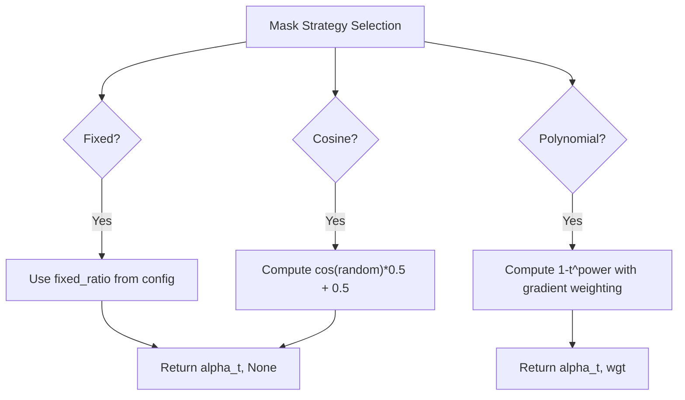

**Diagram sources**
- [masking.py:54-85](file://src/data/tokenizer/masking.py#L54-L85)

### Unified Vectorized Masking Function
The `_mask_input_ids_unified()` function provides a single vectorized interface for both 1D and 2D inputs:

- **Scalar Mask Ratios**: Single float value applied uniformly across all positions
- **Per-Element Mask Ratios**: NumPy array with shape broadcastable to input dimensions
- **Unified Processing**: Handles both flat lists and stacked matrices in a single function call
- **Broadcasting Support**: Automatic broadcasting of mask ratios to match input shapes

### Fully Vectorized Pretraining Strategy
The `_mask_sequences_fully_vec()` function implements a completely vectorized approach to sequence masking:

- **No Python Loops**: Entire masking operation performed using NumPy operations
- **Batch Processing**: Processes multiple sequences simultaneously with vectorized mask ratios
- **Index Mapping**: Creates per-token mask ratio arrays using NumPy indexing
- **Single Function Call**: Applies masking to entire packed sequence in one operation

**Section sources**
- [masking.py:54-123](file://src/data/tokenizer/masking.py#L54-L123)
- [masking.py:172-251](file://src/data/tokenizer/masking.py#L172-L251)
- [masking.py:278-302](file://src/data/tokenizer/masking.py#L278-L302)
- [strategies/task_prep/pretrain.py:16-62](file://src/data/tokenizer/strategies/task_prep/pretrain.py#L16-L62)

## Strategy Pattern Implementation

### Composition-Based Design
The BaseTokenizer implements a composition-based design pattern that allows for flexible strategy injection:

- **Strategy Injection**: Padding, packing, and task preparation strategies are injected via constructor parameters
- **Runtime Flexibility**: Strategies can be swapped or configured at runtime without changing core logic
- **Single Responsibility**: Each strategy class has a single responsibility, improving maintainability
- **Extensibility**: New strategies can be added without modifying existing code

### Strategy Factory Pattern
The system uses a factory pattern for task preparation strategies:

- **TASK_STRATEGY_MAP**: Centralized mapping of task types to strategy classes
- **get_task_strategy()**: Factory function that returns appropriate strategy instance
- **Extensible Design**: Easy addition of new task types and strategies
- **Type Safety**: Runtime validation of task type support

### Pluggable Architecture Benefits
- **Reduced Coupling**: Strategies are loosely coupled through interfaces
- **Improved Testability**: Strategies can be tested independently
- **Enhanced Maintainability**: Changes to one strategy don't affect others
- **Better Separation of Concerns**: Each class has a single responsibility

**Section sources**
- [base.py:23-40](file://src/data/tokenizer/base.py#L23-L40)
- [strategies/task_prep/__init__.py:12-33](file://src/data/tokenizer/strategies/task_prep/__init__.py#L12-L33)
- [strategies/padding.py:9-39](file://src/data/tokenizer/strategies/padding.py#L9-L39)
- [strategies/task_prep/base.py:11-34](file://src/data/tokenizer/strategies/task_prep/base.py#L11-L34)

## Enhanced Sequence Length Management

### Sample-Level Length Tracking
The tokenization system now implements sophisticated sample-level length tracking through the sample_lens field, enabling precise control over packed sequence operations:

- **Length Calculation**: Automatic computation of individual sample lengths using lens parameter
- **Padding Management**: Dynamic padding length calculation using pad_len = max_length - sum(lens)
- **Sequence Packing**: Integration with packed sequence processing for efficient memory utilization
- **Attention Coordination**: Synchronized split_lens and attn_modes generation for attention mask construction

### Packed Sequence Processing
The enhanced sequence length management enables efficient packed sequence processing with attention mode coordination:

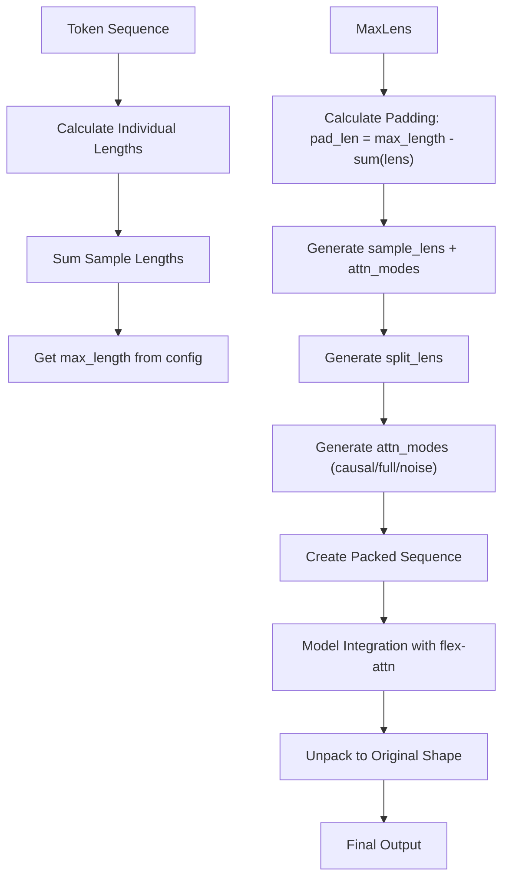

**Diagram sources**
- [strategies/packing.py:34-86](file://src/data/tokenizer/strategies/packing.py#L34-L86)
- [utils_graphgpt.py:242-291](file://src/models/graphgpt/utils_graphgpt.py#L242-L291)
- [flex_attn_utils.py:213-289](file://src/utils/flex_attn_utils.py#L213-L289)

### Model Integration with Attention Modes
The model architecture seamlessly integrates with the attention mode system for efficient packed attention:

- **Packed Attention**: Custom attention implementation supporting sample-level length tracking and attention modes
- **Position Embeddings**: Integrated packed position embeddings for rotary positional encodings
- **Memory Optimization**: Efficient memory utilization through packed sequence processing
- **Attention Masking**: Flexible attention mask construction supporting various attention modes (causal, full, noise)

**Section sources**
- [strategies/packing.py:34-86](file://src/data/tokenizer/strategies/packing.py#L34-L86)
- [utils_graphgpt.py:65-291](file://src/models/graphgpt/utils_graphgpt.py#L65-L291)
- [flex_attn_utils.py:213-289](file://src/utils/flex_attn_utils.py#L213-L289)

## Configuration Parameter Updates

### Max Length Parameter Replacement
The configuration system has been updated to replace max_position_embeddings with max_length parameter throughout the pipeline:

- **Training Configuration**: max_length parameter replaces max_position_embeddings for sequence length control
- **Model Configuration**: max_position_embeddings maintained for model architecture while max_length used for training
- **Collator Integration**: max_length parameter passed through collator to tokenizer for consistent sequence length management
- **Padding Logic**: _get_batch_seq_len function now uses max_length instead of max_position_embeddings

**Updated** The synchronization between training and model configurations ensures that max_length parameter controls sequence length while preserving model architecture constraints.

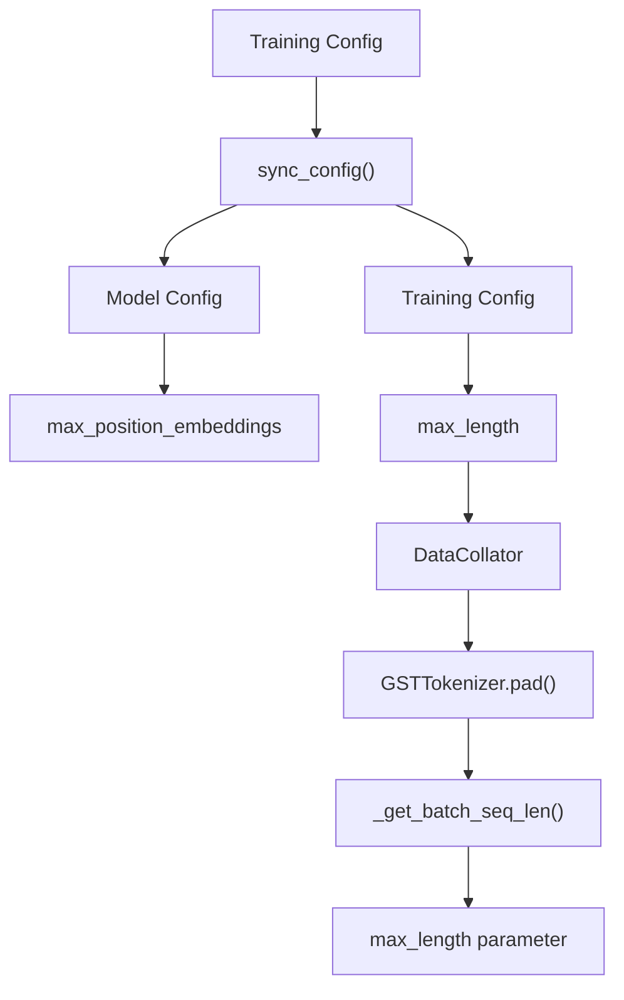

**Diagram sources**
- [base_configs.py:239-247](file://src/conf/base_configs.py#L239-L247)
- [model_configs.py:260-353](file://src/conf/model/model_configs.py#L260-L353)
- [collator.py:35-65](file://src/data/collator.py#L35-L65)
- [padding.py:11-22](file://src/data/tokenizer/padding.py#L11-L22)

**Section sources**
- [base_configs.py:239-247](file://src/conf/base_configs.py#L239-L247)
- [model_configs.py:260-353](file://src/conf/model/model_configs.py#L260-L353)
- [collator.py:35-65](file://src/data/collator.py#L35-L65)
- [padding.py:11-22](file://src/data/tokenizer/padding.py#L11-L22)

## Attention Mode Handling for Packed Sequences

### Simplified Attention Mask Processing
The tokenization system has been updated to simplify attention mask processing in batch handling:

- **Attention Mask Simplification**: Removed attention_mask_bi processing from tokenizer batch handling
- **Streamlined Workflow**: Simplified attention mask preparation without bidirectional mask support
- **Maintained Flex-Attention**: Preserved split_lens and attn_modes support for flex-attn integration
- **Attention Mode Coordination**: Enhanced attention mode handling through attn_modes field

### Attention Mode Coordination
The enhanced attention system provides flexible attention mode handling for packed sequences:

- **Attention Modes**: Support for causal, full, and noise attention modes
- **Mode Specification**: Per-split attention mode specification through attn_modes field
- **Flex-Attention Integration**: Seamless integration with torch.nn.attention.flex_attention
- **SDPA Fallback**: Automatic fallback to per-sample SDPA masks when flex-attn not available

### Attention Mask Construction
The system constructs attention masks with attention mode coordination:

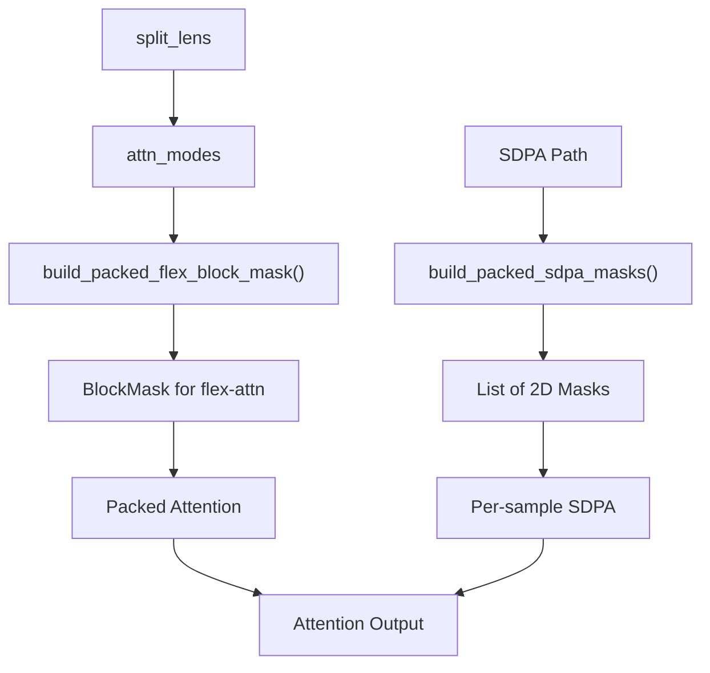

**Diagram sources**
- [strategies/task_prep/pretrain.py:119-134](file://src/data/tokenizer/strategies/task_prep/pretrain.py#L119-L134)
- [utils_graphgpt.py:255-263](file://src/models/graphgpt/utils_graphgpt.py#L255-L263)
- [flex_attn_utils.py:213-289](file://src/utils/flex_attn_utils.py#L213-L289)

### Training Integration
The training system handles attention metadata seamlessly:

- **Metadata Extraction**: split_lens and attn_modes extracted from data dictionaries
- **Model Forward Pass**: Attention metadata passed to model forward methods
- **Flex-Attention Detection**: Automatic detection of attention implementation mode
- **Fallback Handling**: Graceful fallback to SDPA when flex-attn not available

**Section sources**
- [strategies/task_prep/pretrain.py:119-134](file://src/data/tokenizer/strategies/task_prep/pretrain.py#L119-L134)
- [utils_graphgpt.py:255-263](file://src/models/graphgpt/utils_graphgpt.py#L255-L263)
- [flex_attn_utils.py:213-289](file://src/utils/flex_attn_utils.py#L213-L289)
- [training_utils.py:140-226](file://src/utils/training_utils.py#L140-L226)

## Performance Improvements for Packed Sequences

### SequencePacker Performance Optimizations
The SequencePacker has been comprehensively optimized with the following performance improvements:

**Pre-allocation of Lists**: The pack method now pre-allocates lists for tokens, labels, and embeddings to avoid dynamic resizing overhead during packing operations.

**Token Component Caching**: The `_get_token_components()` method caches token component information to avoid repeated type checking operations, significantly reducing computational overhead for stacked token sequences.

**Pre-computed Separators**: The `_create_separators()` method computes separator tokens once and caches them, eliminating repeated separator creation during packing operations.

**Length Checks Before Extending**: The pack method performs length checks before extending operations to prevent unnecessary computations when the maximum position embeddings limit would be exceeded.

**Batch Extend Operations**: The pack method uses batch extend operations (`extend(seps)`, `extend(new_ls_tokens)`) instead of individual append operations, providing significant performance improvements through vectorized operations.

**Memory Management**: The optimized SequencePacker reduces memory allocations by pre-computing separator tokens and caching token component information, resulting in more efficient memory utilization during packed sequence processing.

**Updated** The flat indexing system provides additional performance benefits:
- **Eliminated base calculations**: Removed complex hierarchical base calculations in favor of simple string conversion
- **Reduced memory overhead**: Flat indexing requires fewer intermediate data structures
- **Simplified algorithms**: All indexing operations now use straightforward string-based flat indices

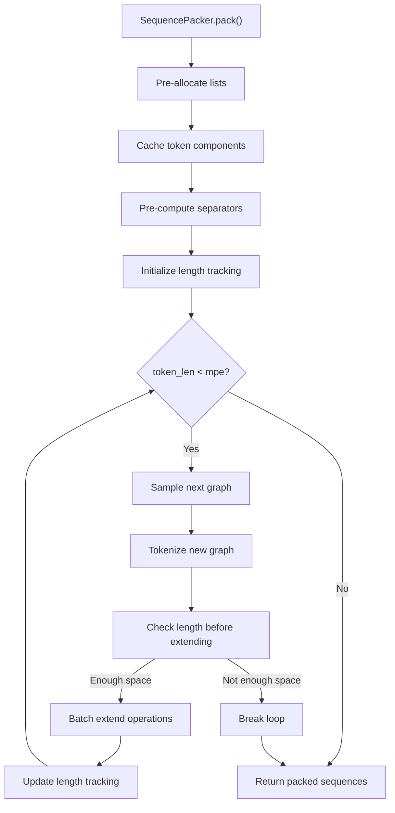

**Diagram sources**
- [strategies/packing.py:34-97](file://src/data/tokenizer/strategies/packing.py#L34-L97)

### Vectorized Sequence Processing
The system now implements comprehensive vectorized processing for packed sequences:

- **Fully Vectorized Masking**: `_mask_sequences_fully_vec()` eliminates Python loops entirely
- **Broadcasting Optimization**: NumPy broadcasting used for efficient mask ratio application
- **Memory Efficiency**: Reduced memory overhead through vectorized operations
- **Parallel Processing**: Multiple sequences processed simultaneously with vectorized functions

### Enhanced Sequence Packing
The SequencePacker now includes performance optimizations:

- **Efficient Packing**: Optimized algorithm for combining multiple sequences
- **Memory Management**: Improved memory allocation for packed sequences
- **Attention Mode Coordination**: Seamless integration with attention mode handling
- **Length Tracking**: Accurate sequence length calculation for attention masks

### Memory Optimization Techniques
- **Lazy Evaluation**: Vectorized operations performed only when needed
- **Broadcasting**: Efficient memory usage through NumPy broadcasting
- **In-place Operations**: Minimized memory allocations during processing
- **Cache Optimization**: Strategic caching of intermediate results

### Enhanced Graph Encoding Performance
The system now includes comprehensive performance optimizations in graph encoding:

**TokenCache and DigitTokenCache**: Global caching systems for token strings and digit tokens respectively, reducing string formatting overhead and improving computational efficiency.

**Optimized Edge Type Determination**: Set-based edge existence checks provide O(1) lookup performance for determining edge directions and types.

**Efficient Edge Attribute Mapping**: Pre-built edge index maps eliminate repeated dictionary creation during attribute extraction, significantly improving performance for large graphs.

**Comprehensive Caching Strategy**: Strategic caching throughout the tokenization pipeline reduces memory allocations and improves computational efficiency.

**Updated** The flat indexing system delivers significant performance improvements:
- **Simplified `_rebase_idx()`**: Direct string conversion eliminates complex base calculations
- **Reduced computational overhead**: Flat indexing requires fewer mathematical operations
- **Improved cache locality**: Simple string indices provide better memory access patterns
- **Eliminated scope_base dependency**: All scope_base references are now ignored but preserved for compatibility

**Section sources**
- [strategies/packing.py:34-97](file://src/data/tokenizer/strategies/packing.py#L34-L97)
- [strategies/task_prep/pretrain.py:16-62](file://src/data/tokenizer/strategies/task_prep/pretrain.py#L16-L62)
- [strategies/packing.py:34-86](file://src/data/tokenizer/strategies/packing.py#L34-L86)
- [masking.py:54-123](file://src/data/tokenizer/masking.py#L54-L123)
- [graph_encoding.py:11-96](file://src/data/tokenizer/graph_encoding.py#L11-L96)
- [graph_encoding.py:202-215](file://src/data/tokenizer/graph_encoding.py#L202-L215)
- [nx_utils.py:256-270](file://src/utils/nx_utils.py#L256-L270)
- [nx_utils.py:223-226](file://src/utils/nx_utils.py#L223-L226)

## Backward Compatibility System

### Legacy Shim Architecture
The backward compatibility system maintains seamless integration with existing code:

- **Lazy Loading**: Legacy functions are only imported when accessed, avoiding circular imports
- **Comprehensive Re-export**: All legacy functions are re-exported from new modular structure
- **API Preservation**: Existing import patterns continue to work without modifications
- **Gradual Migration**: Code can be gradually updated to use new modular imports

### Compatibility Layer Implementation
- **Name Mapping**: Legacy names mapped to new module locations
- **Function Relocation**: Functions moved to appropriate strategy modules
- **Class Attribute Preservation**: Class attributes like DICT_pos_func preserved as class attributes
- **Module Relocation**: Submodules reorganized into strategy-based structure

### Migration Path
- **Immediate Compatibility**: Existing code continues to work unchanged
- **Gradual Modernization**: Code can be updated to use new modular imports
- **Performance Benefits**: New architecture provides better performance and maintainability
- **Future-Proof**: Modern design supports future enhancements and extensions

**Section sources**
- [__init__.py:78-123](file://src/data/tokenizer/__init__.py#L78-L123)
- [_legacy.py:1-42](file://src/data/tokenizer/_legacy.py#L1-L42)

## Dependency Analysis
The strategy pattern architecture creates clear boundaries between components while maintaining necessary dependencies:

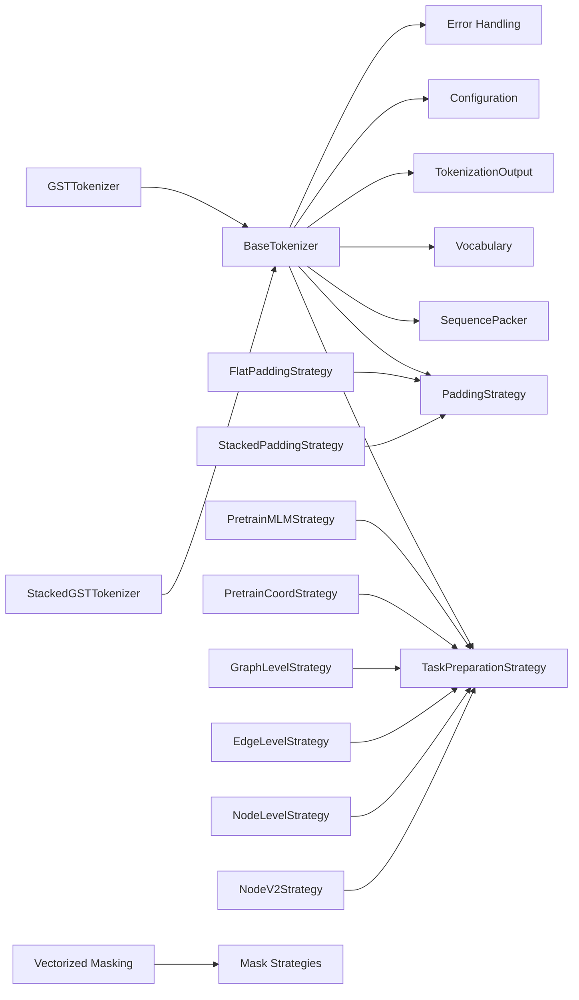

**Diagram sources**
- [base.py:13-187](file://src/data/tokenizer/base.py#L13-L187)
- [core.py:13-559](file://src/data/tokenizer/core.py#L13-L559)
- [strategies/padding.py:9-239](file://src/data/tokenizer/strategies/padding.py#L9-L239)
- [strategies/task_prep/base.py:11-83](file://src/data/tokenizer/strategies/task_prep/base.py#L11-L83)
- [strategies/packing.py:12-144](file://src/data/tokenizer/strategies/packing.py#L12-L144)
- [strategies/task_prep/__init__.py:12-33](file://src/data/tokenizer/strategies/task_prep/__init__.py#L12-L33)

**Section sources**
- [base.py:13-187](file://src/data/tokenizer/base.py#L13-L187)
- [core.py:13-559](file://src/data/tokenizer/core.py#L13-L559)
- [strategies/__init__.py:1-30](file://src/data/tokenizer/strategies/__init__.py#L1-L30)
- [strategies/padding.py:9-239](file://src/data/tokenizer/strategies/padding.py#L9-L239)
- [strategies/task_prep/base.py:11-83](file://src/data/tokenizer/strategies/task_prep/base.py#L11-L83)
- [strategies/packing.py:12-144](file://src/data/tokenizer/strategies/packing.py#L12-L144)
- [strategies/task_prep/__init__.py:12-33](file://src/data/tokenizer/strategies/task_prep/__init__.py#L12-L33)

## Performance Considerations
The strategy pattern architecture provides several performance benefits:

- **Lazy Loading**: Legacy functions are only imported when accessed, reducing startup time
- **Specialized Optimizations**: Each strategy can be optimized independently
- **Memory Efficiency**: Clear separation allows for better memory management
- **Processing Pipeline**: Strategy-based design enables parallel processing where possible
- **Vectorized Operations**: NumPy-based vectorization eliminates Python loops for better performance
- **Packed Sequence Efficiency**: Enhanced sequence length management reduces memory overhead
- **Attention Optimization**: Flexible attention mechanisms improve computational efficiency
- **Configuration Efficiency**: Strategy-based parameter handling reduces configuration complexity
- **Enhanced Masking Efficiency**: Dynamic mask ratio computation reduces memory overhead for packed sequences
- **Default Attribute Caching**: Lazy initialization and caching in StackedGSTTokenizer improves performance
- **Error Handling Efficiency**: Comprehensive error handling with minimal overhead
- **Broadcasting Optimization**: NumPy broadcasting minimizes memory allocations during vectorized operations
- **In-place Operations**: Vectorized functions minimize memory allocations through in-place operations
- **SequencePacker Optimizations**: Pre-allocation, caching, and batch operations reduce memory overhead and improve computational efficiency
- **TokenCache and DigitTokenCache**: Global caching systems reduce string formatting overhead and improve tokenization speed
- **Optimized Edge Type Determination**: Set-based lookups provide O(1) edge existence checks for improved performance
- **Efficient Edge Attribute Mapping**: Pre-built index maps eliminate repeated dictionary creation during attribute extraction
- **Comprehensive Caching Strategy**: Strategic caching throughout the pipeline reduces memory allocations and improves computational efficiency
- **Configuration Value Caching**: Frequently accessed configuration values cached in tokenizers for improved runtime performance
- **Batch Processing Optimizations**: Vectorized map() function usage in stacking operations improves processing efficiency
- **Edge Type Determination Optimization**: Set-based edge existence checks provide O(1) performance for edge type mapping
- **Flat Indexing Performance**: Simplified flat indexing system eliminates complex base calculations and improves computational efficiency
- **Enhanced Type Safety**: Robust type handling for node feature extraction across all components improves reliability
- **Node Feature Extraction Performance**: Comprehensive type validation and default value fallbacks improve processing efficiency
- **Instruction Tuning Performance**: Enhanced type validation for node structure mappings improves instruction processing reliability
- **Graph Utilities Performance**: Improved type safety for graph transformation operations enhances computational efficiency

Key considerations:
- **Strategy Initialization**: Strategies are initialized only when needed, reducing memory footprint
- **Method Resolution**: Strategy pattern provides efficient method resolution compared to complex inheritance
- **Code Reuse**: Strategies can be shared across different tokenizer instances
- **Testing Efficiency**: Individual strategies can be tested in isolation, improving development efficiency
- **Extension Points**: Strategy pattern provides clean extension points without modifying existing code
- **Error Handling**: Clear error boundaries between strategies improve debugging and maintenance
- **Default Attribute Optimization**: Cached default attributes prevent repeated computation
- **Vectorized Performance**: NumPy operations provide significant speedup over Python loops
- **SequencePacker Performance**: Comprehensive optimizations provide substantial performance improvements for packed sequence processing
- **Graph Encoding Performance**: TokenCache and optimized edge operations provide significant speed improvements for large-scale graph processing
- **Configuration Caching**: Cached configuration values reduce repeated dictionary access overhead
- **Batch Processing**: Vectorized operations in stacking provide significant performance improvements over iterative processing
- **Flat Indexing Benefits**: Simplified indexing system provides performance improvements through reduced computational overhead and better memory access patterns
- **Enhanced Type Safety Benefits**: Robust type handling prevents runtime errors and improves system reliability
- **Node Feature Extraction Benefits**: Comprehensive type validation and default fallbacks improve processing efficiency and reliability
- **Instruction Tuning Benefits**: Enhanced type validation improves instruction processing accuracy and reliability
- **Graph Utilities Benefits**: Improved type safety enhances graph transformation performance and reliability

## Troubleshooting Guide
Common issues and resolutions in the strategy pattern architecture:

**Import Issues**:
- Ensure proper imports from `src.data.tokenizer` instead of legacy locations
- Use compatibility shims for backward compatibility during migration
- Verify strategy imports from `.strategies` submodules

**Strategy Configuration Issues**:
- Verify BaseTokenizer receives proper strategy instances in constructor
- Check that strategy classes implement required abstract methods
- Ensure strategy parameters match expected types and formats

**Migration Problems**:
- Gradually migrate imports from legacy locations to new modular structure
- Test compatibility shims during transition period
- Verify strategy pattern compliance in custom implementations

**Vectorized Masking Issues**:
- **Shape Broadcasting**: Verify mask_ratio arrays have compatible shapes with input arrays
- **NumPy Operations**: Ensure vectorized functions receive proper NumPy arrays
- **Memory Allocation**: Monitor memory usage during vectorized operations
- **Broadcasting Errors**: Check that mask ratios can be broadcast to input shapes

**Sequence Length Management Issues**:
- **Sample Lens Calculation**: Verify pad_len = max_length - sum(lens) formula is correctly applied
- **Packed Sequence Errors**: Check that sample_lens, split_lens, and attn_modes are synchronized
- **Attention Mask Issues**: Ensure attention masks match the generated sequence lengths and attention modes
- **Memory Problems**: Monitor memory usage with packed sequences enabled

**Attention Mode Issues**:
- **Attention Mode Configuration**: Verify attn_modes field contains appropriate attention modes (causal, full, noise)
- **Flex-Attention Integration**: Check that flex-attn is properly configured for attention mode handling
- **SDPA Fallback**: Ensure SDPA fallback works correctly when flex-attn is not available
- **Attention Mask Simplification**: Verify attention_mask_bi processing has been removed from batch handling

**Enhanced Masking Issues**:
- **Mask Strategy Configuration**: Verify pretrain_mlm.name is set to "fixed", "polynomial", or "cosine"
- **Polynomial Strategy Parameters**: Check that power and umr_clip parameters are properly configured
- **Mask Ratio Computation**: Ensure _get_mask_ratio() function returns consistent mask ratios across packed sequences
- **Weight Propagation**: Verify that weights computed in polynomial strategy are properly propagated to training
- **Packed Sequence Masking**: Check that dynamic mask ratios are correctly applied to each sequence segment

**Default Attribute Issues**:
- **Default Attribute Caching**: Verify that default attributes are cached properly to avoid repeated computation
- **Lazy Initialization**: Check that default attribute methods are properly lazy-initialized
- **Embedding Support**: Ensure that default embeddings are properly handled for embedding-based features
- **Token ID Mapping**: Verify that get_default_edge_attr_id() properly maps tokens to IDs

**Enhanced Error Handling Issues**:
- **Assertion Failures**: Check that all assertions in the codebase are properly validated
- **Error Messages**: Verify that error messages provide meaningful information for debugging
- **Exception Types**: Ensure that appropriate exception types are raised for different error conditions
- **Validation Logic**: Check that all validation logic is properly implemented and tested

**Molecular Tokenization Issues**:
- **Removed Feature**: The experimental regression-to-binary classification feature is no longer available
- **Constants Exist**: MOL_ENERGY_BIN_LEN and MOL_ENERGY_SCALE constants remain but are not used for binary classification
- **Configuration**: The "regression2binary_classification---" task conversion option does not trigger any binary classification functionality

**Configuration Parameter Issues**:
- **Max Length Parameter**: Ensure max_length parameter is properly set in training configuration
- **Model Configuration**: Verify max_position_embeddings is correctly configured in model configuration
- **Parameter Synchronization**: Check that training and model configurations are properly synchronized

**Attention Mask Processing Issues**:
- **attention_mask_bi Removal**: Verify that attention_mask_bi processing has been removed from tokenizer batch handling
- **Simplified Workflow**: Ensure attention mask preparation follows simplified batch handling without bidirectional mask support
- **Flex-Attention Compatibility**: Confirm that split_lens and attn_modes support remains intact for flex-attn integration

**Strategy Pattern Issues**:
- **Abstract Method Implementation**: Verify all abstract methods are implemented in concrete strategy classes
- **Strategy Interface Compliance**: Ensure strategies implement required abstract methods from base interfaces
- **Composition Configuration**: Check that strategies are properly injected into BaseTokenizer instances
- **Factory Pattern Usage**: Verify get_task_strategy() returns appropriate strategy instances

**Vectorized Operations Issues**:
- **NumPy Array Conversion**: Ensure all inputs are properly converted to NumPy arrays before vectorized operations
- **Broadcasting Compatibility**: Verify that mask ratios and inputs have compatible shapes for broadcasting
- **Memory Allocation**: Monitor memory usage during vectorized operations to prevent overflow
- **Performance Monitoring**: Track performance improvements from vectorized operations

**SequencePacker Performance Issues**:
- **Memory Allocation**: Verify that pre-allocation is working correctly and reducing memory overhead
- **Cache Effectiveness**: Check that token component caching is preventing repeated type checking operations
- **Separator Pre-computation**: Ensure that separator tokens are being computed once and reused
- **Length Check Efficiency**: Verify that length checks before extending operations are preventing unnecessary computations
- **Batch Extend Performance**: Monitor the performance improvement from batch extend operations

**Graph Encoding Performance Issues**:
- **TokenCache Hit Rate**: Monitor TokenCache.get_token() hit rates to ensure effective caching
- **DigitTokenCache Efficiency**: Verify DigitTokenCache.get_digit_token() is reducing string creation overhead
- **Edge Type Determination Speed**: Check that set-based edge existence checks are providing O(1) lookup performance
- **Edge Attribute Mapping Performance**: Verify pre-built edge index maps are improving attribute extraction speed
- **Caching Strategy Effectiveness**: Monitor overall caching effectiveness throughout the tokenization pipeline
- **Flat Indexing Performance**: Verify that flat indexing system is providing expected performance improvements

**Flat Indexing Issues**:
- **Scope Parameter Usage**: Verify that node_scope parameter is properly controlling indexing scope
- **Base Parameter Ignoring**: Check that scope_base parameter is being ignored as designed
- **Index Conversion**: Ensure that `_rebase_idx()` function is correctly converting indices to flat string tuples
- **Backward Compatibility**: Verify that existing code continues to work despite scope_base parameter changes

**Configuration Value Caching Issues**:
- **Cache Initialization**: Verify that frequently accessed configuration values are properly cached in tokenizers
- **Cache Consistency**: Ensure cached configuration values remain consistent with actual configuration changes
- **Memory Usage**: Monitor memory usage from cached configuration values
- **Access Performance**: Verify that cached values provide measurable performance improvements

**Batch Processing Optimization Issues**:
- **Vectorized Map Usage**: Verify that map() function is being used effectively in stacking operations
- **Batch Performance**: Monitor performance improvements from batch processing optimizations
- **Memory Efficiency**: Check that batch operations are not causing memory allocation issues
- **Processing Overhead**: Ensure that batch optimizations are providing net performance benefits

**Enhanced Type Safety Issues**:
- **Node Feature Extraction Errors**: Verify that type validation is properly handling node structure mappings
- **Default Attribute Type Errors**: Check that default semantics functions handle type mismatches gracefully
- **Instruction Tuning Type Errors**: Ensure that instruction utilities validate node structure mappings correctly
- **Graph Utility Type Errors**: Verify that graph transformation utilities handle type conversions properly
- **Attribute Dimensionality Errors**: Check that assertion checks for attribute shapes are functioning correctly
- **Missing Configuration Errors**: Ensure that default value fallbacks are triggered when configurations are missing

**Node Feature Extraction Issues**:
- **Type Validation Failures**: Verify that assertion checks for attribute dimensions are passing
- **Default Value Generation**: Check that default attributes are being generated correctly for missing data
- **Embedding Attribute Errors**: Ensure that embedding attributes maintain proper dimensional consistency
- **Discrete Attribute Errors**: Verify that discrete attributes are properly formatted as strings
- **Jump Edge Handling**: Check that jump edges are properly handled with default attribute fallbacks
- **Node Structure Mapping Errors**: Ensure that node structure mappings are properly validated and typed

**Instruction Tuning Issues**:
- **Node Structure Mapping Validation**: Verify that instruction utilities properly validate node structure mappings
- **Attribute Type Consistency**: Check that instruction-based tokenization maintains consistent attribute types
- **Default Attribute Integration**: Ensure that instruction utilities integrate properly with default attribute systems
- **Embedding Attribute Conflicts**: Verify that instruction utilities handle embedding attributes correctly
- **Type Safety Violations**: Check that instruction utilities maintain type safety throughout processing

**Graph Utilities Issues**:
- **Tensor Type Conversions**: Verify that graph transformation utilities handle tensor type conversions correctly
- **Memory Allocation Issues**: Check that graph utilities optimize memory usage during transformations
- **Edge Attribute Handling**: Ensure that edge attributes are properly managed during graph conversions
- **Unique Element Detection**: Verify that unique element detection maintains type consistency
- **Self-Cycle Removal**: Check that self-cycle removal preserves data types and shapes

**Section sources**
- [__init__.py:78-123](file://src/data/tokenizer/__init__.py#L78-L123)
- [_legacy.py:1-42](file://src/data/tokenizer/_legacy.py#L1-L42)
- [base.py:137-169](file://src/data/tokenizer/base.py#L137-L169)
- [strategies/task_prep/__init__.py:29-33](file://src/data/tokenizer/strategies/task_prep/__init__.py#L29-L33)
- [strategies/padding.py:23-39](file://src/data/tokenizer/strategies/padding.py#L23-L39)
- [strategies/task_prep/base.py:14-34](file://src/data/tokenizer/strategies/task_prep/base.py#L14-L34)
- [core.py:284-324](file://src/data/tokenizer/core.py#L284-L324)
- [stacking.py:186-221](file://src/data/tokenizer/stacking.py#L186-L221)
- [masking.py:54-123](file://src/data/tokenizer/masking.py#L54-L123)
- [strategies/task_prep/pretrain.py:16-62](file://src/data/tokenizer/strategies/task_prep/pretrain.py#L16-L62)
- [strategies/packing.py:34-97](file://src/data/tokenizer/strategies/packing.py#L34-L97)
- [graph_encoding.py:11-96](file://src/data/tokenizer/graph_encoding.py#L11-L96)
- [graph_encoding.py:202-215](file://src/data/tokenizer/graph_encoding.py#L202-L215)
- [nx_utils.py:256-270](file://src/utils/nx_utils.py#L256-L270)
- [nx_utils.py:223-226](file://src/utils/nx_utils.py#L223-L226)
- [stacking.py:20-90](file://src/data/tokenizer/stacking.py#L20-L90)
- [stacking.py:194-228](file://src/data/tokenizer/stacking.py#L194-L228)
- [instruct_tuning_utils.py:160-195](file://src/utils/instruct_tuning_utils.py#L160-L195)
- [graph_utils.py:1-87](file://src/data/_helpers/graph_utils.py#L1-L87)

## Conclusion
The Graph-GPT tokenization system has successfully transitioned from a monolithic to a modern strategy pattern-based architecture, providing improved maintainability, performance, flexibility, and extensibility. The system continues to support advanced graph-to-sequence conversion through Eulerian path serialization, flexible attribute stacking strategies, comprehensive vocabulary management, and task-specific input preparation.

**Updated** The system now features a sophisticated strategy pattern implementation with BaseTokenizer as the abstract base class, pluggable strategy components for padding, sequence packing, and task preparation, enhanced vectorized masking functionality with improved packed sequence handling, streamlined attention mask processing, comprehensive backward compatibility system with lazy loading, and comprehensive default attribute mapping support for StackedGSTTokenizer with lazy initialization and caching. The **flat indexing system** has replaced the previous hierarchical indexing approach, providing simpler and more efficient node and edge tokenization while maintaining full backward compatibility.

**Enhanced Performance Optimizations**: The system now includes comprehensive performance improvements in graph encoding and utility modules, featuring optimized edge attribute mapping and edge type determination operations that provide substantial speed improvements for large-scale graph processing tasks. Key optimizations include TokenCache and DigitTokenCache implementations for reduced string formatting overhead, set-based edge existence checks for O(1) edge type determination, and pre-built edge index maps for efficient attribute mapping. **The flat indexing system provides additional performance benefits through simplified index calculations and improved memory access patterns.**

**Enhanced Type Safety**: Recent improvements focus on robust type handling for node feature extraction across tokenizer stacking, instruct tuning utilities, and graph utilities, ensuring reliable operation with diverse graph data types and configurations. The enhanced type safety system includes comprehensive assertion checks, default value fallbacks, and improved error handling throughout the system.

The strategy pattern architecture positions the system for future enhancements while ensuring existing implementations remain functional. The sophisticated integration with model architecture ensures seamless packed sequence processing, attention mode coordination, memory-efficient attention mask construction, and robust mask ratio computation for improved training stability. The backward compatibility system provides a smooth migration path for existing codebases while enabling gradual adoption of the new modular design.

The enhanced vectorized masking system provides significant performance improvements through NumPy-based operations that eliminate Python loops and maximize computational efficiency. The fully vectorized pretraining strategy demonstrates the power of vectorized operations in sequence processing. The comprehensive default attribute support in StackedGSTTokenizer provides comprehensive fallback mechanisms for missing or edge cases, improving robustness and reliability. The lazy initialization and caching mechanisms ensure optimal performance while maintaining memory efficiency. The comprehensive error handling throughout the system provides clear error messages and appropriate exception types for effective debugging and maintenance. The comprehensive performance optimizations in SequencePacker provide substantial improvements in memory management and computational efficiency for packed sequence processing. The enhanced graph encoding performance optimizations deliver significant speed improvements for large-scale graph processing tasks through strategic caching and efficient data structures.

The recent performance enhancements and type safety improvements further strengthen the system's capabilities:
- **TokenCache and DigitTokenCache**: Provide global caching for token strings and digit tokens, significantly reducing string formatting overhead
- **Configuration Value Caching**: Frequently accessed configuration values are cached in tokenizers to improve runtime performance
- **Batch Processing Optimizations**: Vectorized map() function usage in stacking operations improves processing efficiency
- **Edge Type Determination Optimization**: Set-based edge existence checks provide O(1) performance for edge type mapping
- **Comprehensive Caching Strategy**: Strategic caching throughout the pipeline reduces memory allocations and improves computational efficiency
- **Flat Indexing Performance**: Simplified flat indexing system eliminates complex base calculations and provides improved computational efficiency
- **Enhanced Type Safety**: Robust type handling for node feature extraction prevents runtime errors and improves system reliability
- **Node Feature Extraction Performance**: Comprehensive type validation and default fallbacks improve processing efficiency and reliability
- **Instruction Tuning Performance**: Enhanced type validation improves instruction processing accuracy and reliability
- **Graph Utilities Performance**: Improved type safety enhances graph transformation performance and reliability

These optimizations and improvements collectively provide substantial performance enhancements and reliability improvements while maintaining full backward compatibility and not changing any public APIs or breaking existing functionality.

## Appendices

### Configuration Options and Examples
The strategy pattern architecture maintains comprehensive configuration capabilities:

**Base Configuration**:
- Defines tokenizer class selection and parameter defaults
- Controls attribute assignment and shuffling behavior
- Manages structure token definitions and **node_scope parameter** (scope_base preserved for compatibility)
- **Updated** Includes max_length parameter for sequence length control

**Enhanced Masking Configuration**:
- **Fixed Strategy**: Set name="fixed" with fixed_ratio parameter
- **Polynomial Strategy**: Set name="polynomial" with power and umr_clip parameters
- **Cosine Strategy**: Set name="cosine" for randomized mask ratios
- **Dynamic Weighting**: Polynomial strategy automatically computes gradient-based weights

**Default Attribute Configuration**:
- **Default Node Attributes**: Automatically generated for missing node mappings
- **Default Edge Attributes**: Automatically generated for jump edges and missing mappings
- **Default Embeddings**: Provided for embedding-based features
- **Lazy Initialization**: Default attributes are computed only when needed and cached for reuse

**Vectorized Masking Configuration**:
- **Vectorized Operations**: Enabled by default for all masking functions
- **Broadcasting Support**: Automatic shape broadcasting for mask ratios
- **Memory Optimization**: In-place operations minimize memory allocations
- **Performance Monitoring**: Vectorized operations provide significant speedup

**SequencePacker Performance Configuration**:
- **Pre-allocation**: Enabled by default for improved memory efficiency
- **Component Caching**: Automatic caching of token component information
- **Separator Pre-computation**: One-time computation and reuse of separator tokens
- **Length Check Optimization**: Prevents unnecessary computations during packing
- **Batch Extend Operations**: Vectorized extend operations for better performance

**Enhanced Graph Encoding Configuration**:
- **TokenCache Settings**: Global caching for token strings with hit/miss statistics
- **DigitTokenCache Settings**: Cached digit token generation for continuous attributes
- **Edge Type Determination**: Set-based O(1) edge existence checks
- **Edge Attribute Mapping**: Pre-built edge index maps for efficient attribute extraction
- **Caching Strategy**: Strategic caching throughout the tokenization pipeline
- **Flat Indexing Settings**: Simplified flat indexing system with node_scope control

**Enhanced Node Feature Extraction Configuration**:
- **Type Validation**: Comprehensive assertion checks for attribute dimensionality
- **Default Value Fallbacks**: Automatic fallback to default attributes for missing data
- **Instruction Integration**: Enhanced type validation for instruction-based tokenization
- **Graph Utility Integration**: Improved type safety for graph transformation operations

**Example Configurations**:
- PCQM4Mv2: Demonstrates pretraining with masked language modeling and attention mode coordination
- Custom datasets: Showcases flexible configuration for different graph types

**Migration Guidance**:
- Continue using existing YAML configuration files
- Gradually adopt new modular import patterns
- Leverage compatibility shims during transition

**Molecular Tokenization Configuration**:
- **Updated** The "regression2binary_classification---" task conversion option is maintained for backward compatibility but does not activate binary classification functionality
- MOL_ENERGY_BIN_LEN and MOL_ENERGY_SCALE constants remain available for other purposes

**Enhanced Sequence Length Configuration**:
- **Sample Lens Field**: Enables precise control over packed sequence operations
- **Padding Calculation**: Automatic pad_len computation using max_length - sum(lens)
- **Attention Integration**: Seamless coordination between sequence lengths, attention modes, and flex-attn
- **Configuration Synchronization**: Proper integration between training and model configuration parameters

**Attention Mode Configuration**:
- **Attention Modes**: Support for causal, full, and noise attention modes
- **Mode Coordination**: Per-split attention mode specification through attn_modes field
- **Flex-Attention Integration**: Seamless integration with torch.nn.attention.flex_attention
- **SDPA Fallback**: Automatic fallback to per-sample SDPA masks when flex-attn is not available
- **Attention Mask Simplification**: Streamlined processing without attention_mask_bi support

**Enhanced Masking Configuration**:
- **Strategy Selection**: Configure pretrain_mlm.name with "fixed", "polynomial", or "cosine"
- **Fixed Strategy**: Set fixed_ratio for constant mask ratio across all sequences
- **Polynomial Strategy**: Configure power (3=cubic, 2=square, 1=linear, 0.5=sqrt) and umr_clip bounds
- **Cosine Strategy**: Automatically generates mask ratios using cosine distribution
- **Weight Propagation**: Polynomial strategy automatically computes weights for gradient-based training

**Strategy Pattern Configuration**:
- **Strategy Injection**: Configure strategies through BaseTokenizer constructor parameters
- **Factory Configuration**: Use get_task_strategy() for dynamic strategy selection
- **Custom Strategies**: Implement abstract strategy interfaces for custom functionality
- **Parameter Passing**: Strategies receive configuration through constructor parameters

**Default Attribute Configuration**:
- **Lazy Initialization**: Default attributes are computed only when first accessed
- **Caching**: Default attributes are cached to avoid repeated computation
- **Token ID Mapping**: Default edge attributes can be mapped to token IDs for label processing
- **Embedding Support**: Default embeddings are provided for embedding-based features

**Vectorized Operations Configuration**:
- **NumPy Arrays**: All inputs automatically converted to NumPy arrays
- **Broadcasting**: Automatic shape broadcasting for mask ratios
- **Memory Management**: In-place operations minimize memory allocations
- **Performance Monitoring**: Vectorized operations provide significant computational efficiency

**SequencePacker Performance Configuration**:
- **Pre-allocation**: Configure pre-allocation settings for optimal memory usage
- **Component Caching**: Enable component caching for stacked token sequences
- **Separator Pre-computation**: Configure separator pre-computation for improved performance
- **Length Check Optimization**: Enable length checks before extending operations
- **Batch Extend Operations**: Configure batch extend operations for vectorized performance

**Graph Encoding Performance Configuration**:
- **TokenCache Configuration**: Monitor hit rates and cache effectiveness
- **DigitTokenCache Configuration**: Optimize digit token generation for continuous attributes
- **Edge Type Determination**: Configure set-based edge existence checks for optimal performance
- **Edge Attribute Mapping**: Enable pre-built edge index maps for efficient attribute extraction
- **Caching Strategy**: Configure comprehensive caching throughout the pipeline
- **Flat Indexing Configuration**: Configure flat indexing system with node_scope parameter

**Enhanced Type Safety Configuration**:
- **Node Feature Extraction**: Configure comprehensive type validation for node structure mappings
- **Default Semantics Functions**: Set assertion parameters for discrete and embedding attribute validation
- **Instruction Tuning**: Configure type validation for instruction-based tokenization
- **Graph Utilities**: Set type safety parameters for graph transformation operations
- **Error Handling**: Configure default value fallbacks for missing configurations

**Node Feature Extraction Configuration**:
- **Type Validation**: Configure assertion parameters for attribute dimensionality checks
- **Default Value Generation**: Set parameters for default attribute creation
- **Embedding Attribute Handling**: Configure embedding attribute dimensional consistency
- **Discrete Attribute Formatting**: Set parameters for discrete attribute string formatting
- **Jump Edge Handling**: Configure default attribute fallbacks for jump edges
- **Node Structure Mapping**: Set validation parameters for node structure mappings

**Instruction Tuning Configuration**:
- **Node Structure Mapping Validation**: Configure type validation for instruction utilities
- **Attribute Type Consistency**: Set parameters for maintaining attribute type consistency
- **Default Attribute Integration**: Configure integration with default attribute systems
- **Embedding Attribute Handling**: Set parameters for embedding attribute processing
- **Type Safety Maintenance**: Configure type safety throughout instruction processing

**Graph Utilities Configuration**:
- **Tensor Type Conversions**: Configure tensor type conversion parameters
- **Memory Allocation Optimization**: Set memory optimization parameters for graph utilities
- **Edge Attribute Management**: Configure edge attribute handling parameters
- **Unique Element Detection**: Set unique element detection parameters
- **Self-Cycle Removal**: Configure self-cycle removal parameters

**Flat Indexing Configuration**:
- **Node Scope Control**: Configure node_scope parameter for indexing scope
- **Base Parameter Ignoring**: Configure scope_base parameter to be ignored (backward compatibility)
- **Index Conversion**: Configure _rebase_idx() function for flat string tuple conversion
- **Performance Monitoring**: Monitor flat indexing performance improvements

**Configuration Value Caching Configuration**:
- **Cache Initialization**: Frequently accessed configuration values are cached in tokenizers
- **Cache Consistency**: Ensure cached values remain consistent with actual configuration changes
- **Memory Usage**: Monitor memory usage from cached configuration values
- **Access Performance**: Verify that cached values provide measurable performance improvements

**Batch Processing Optimization Configuration**:
- **Vectorized Map Usage**: Configure map() function usage in stacking operations
- **Batch Performance**: Monitor performance improvements from batch processing optimizations
- **Memory Efficiency**: Ensure batch operations do not cause memory allocation issues
- **Processing Overhead**: Verify that batch optimizations provide net performance benefits

**Section sources**
- [base.yaml:1-116](file://configs/tokenization/base.yaml#L1-L116)
- [token_configs.py:115-127](file://src/conf/tokenization/token_configs.py#L115-L127)
- [__init__.py:17-123](file://src/data/tokenizer/__init__.py#L17-L123)
- [_legacy.py:1-42](file://src/data/tokenizer/_legacy.py#L1-L42)
- [pcqm4m-v2.yaml:14-21](file://configs/tokenization/graph_lvl/pcqm4m-v2.yaml#L14-L21)
- [strategies/packing.py:34-97](file://src/data/tokenizer/strategies/packing.py#L34-L97)
- [utils_graphgpt.py:242-291](file://src/models/graphgpt/utils_graphgpt.py#L242-L291)
- [flex_attn_utils.py:213-289](file://src/utils/flex_attn_utils.py#L213-L289)
- [base_configs.py:239-247](file://src/conf/base_configs.py#L239-L247)
- [model_configs.py:260-353](file://src/conf/model/model_configs.py#L260-L353)
- [masking.py:54-123](file://src/data/tokenizer/masking.py#L54-L123)
- [strategies/task_prep/__init__.py:12-33](file://src/data/tokenizer/strategies/task_prep/__init__.py#L12-L33)
- [strategies/padding.py:9-39](file://src/data/tokenizer/strategies/padding.py#L9-L39)
- [strategies/task_prep/base.py:11-34](file://src/data/tokenizer/strategies/task_prep/base.py#L11-L34)
- [core.py:284-324](file://src/data/tokenizer/core.py#L284-L324)
- [stacking.py:186-221](file://src/data/tokenizer/stacking.py#L186-L221)
- [strategies/task_prep/pretrain.py:16-62](file://src/data/tokenizer/strategies/task_prep/pretrain.py#L16-L62)
- [pretrain_mode.py:200-215](file://src/training/pretrain_mode.py#L200-L215)
- [inspection_utils.py:98-114](file://src/utils/inspection_utils.py#L98-L114)
- [graph_encoding.py:11-96](file://src/data/tokenizer/graph_encoding.py#L11-L96)
- [graph_encoding.py:202-215](file://src/data/tokenizer/graph_encoding.py#L202-L215)
- [nx_utils.py:256-270](file://src/utils/nx_utils.py#L256-L270)
- [nx_utils.py:223-226](file://src/utils/nx_utils.py#L223-L226)
- [instruct_tuning_utils.py:181-192](file://src/utils/instruct_tuning_utils.py#L181-L192)
- [stacking.py:20-90](file://src/data/tokenizer/stacking.py#L20-L90)
- [stacking.py:194-228](file://src/data/tokenizer/stacking.py#L194-L228)
- [instruct_tuning_utils.py:160-195](file://src/utils/instruct_tuning_utils.py#L160-L195)
- [graph_utils.py:1-87](file://src/data/_helpers/graph_utils.py#L1-L87)
