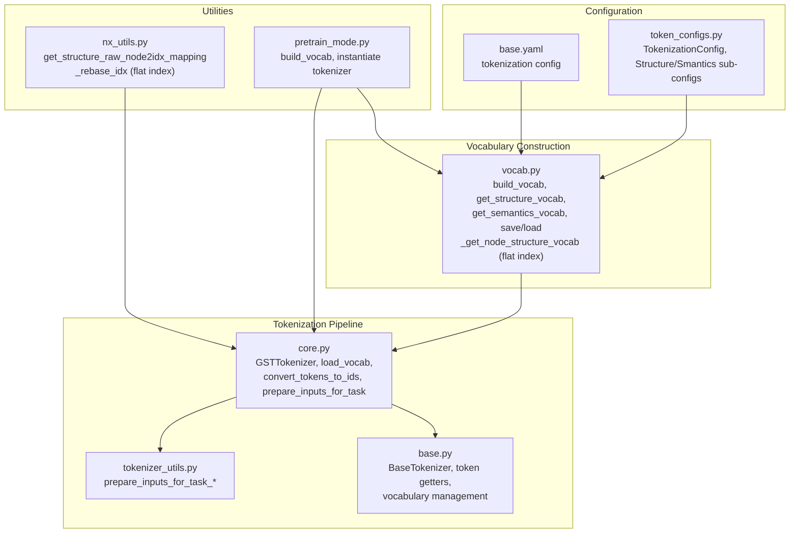
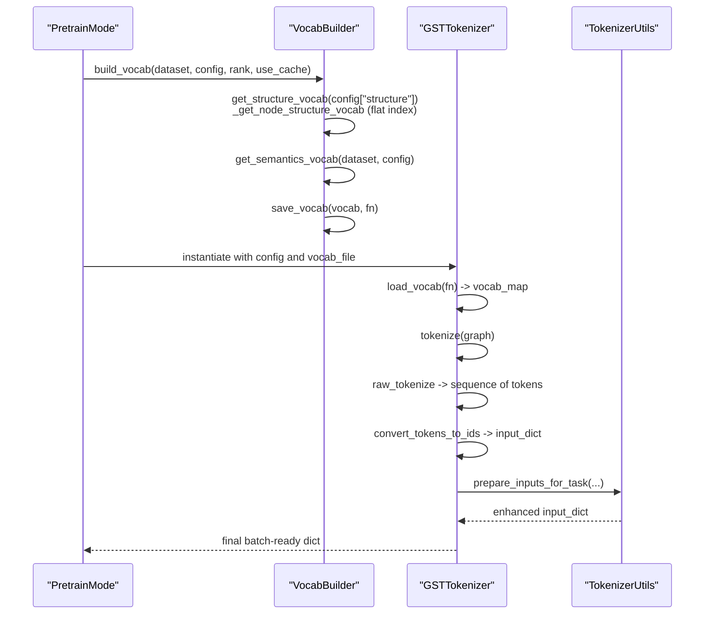
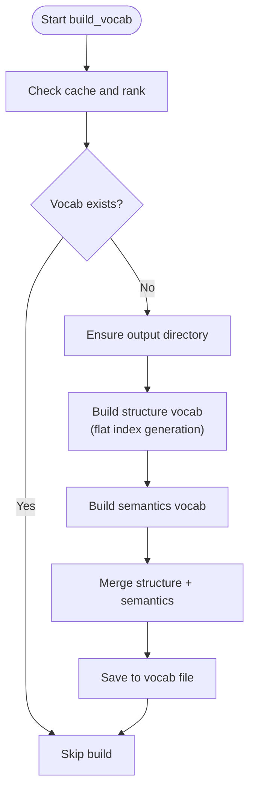
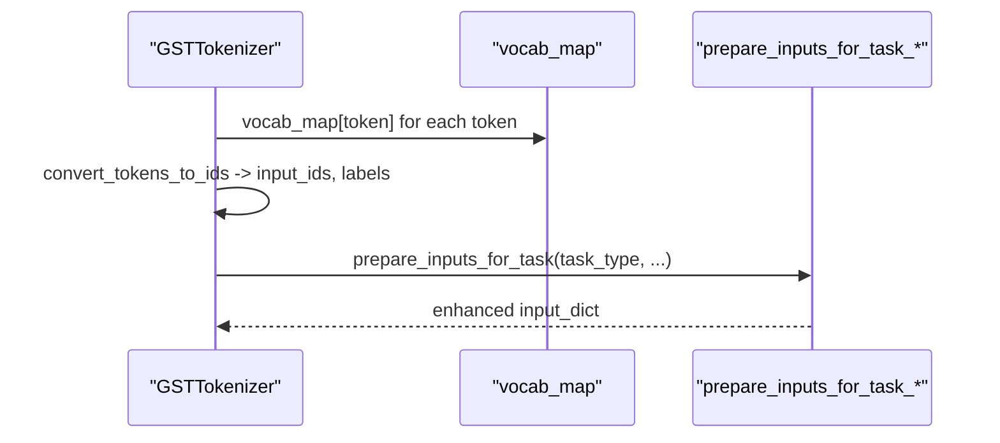
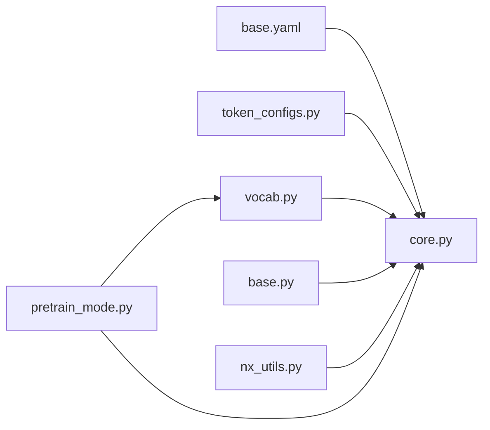

# Vocabulary Building System

<cite>
**Referenced Files in This Document**
- [vocab.py](file://src/data/tokenizer/vocab.py)
- [core.py](file://src/data/tokenizer/core.py)
- [base.py](file://src/data/tokenizer/base.py)
- [base.yaml](file://configs/tokenization/base.yaml)
- [token_configs.py](file://src/conf/tokenization/token_configs.py)
- [pretrain_mode.py](file://src/training/pretrain_mode.py)
- [nx_utils.py](file://src/utils/nx_utils.py)
</cite>

## Update Summary
**Changes Made**
- Updated vocabulary building process to reflect simplified flat index sequence generation
- Removed references to hierarchical index token generation and complex mathematical calculations
- Updated `_get_node_structure_vocab` function documentation to reflect flat index approach
- Removed scope_base dependency from vocabulary generation explanation
- Updated examples to show new simplified implementation

## Table of Contents
1. [Introduction](#introduction)
2. [Project Structure](#project-structure)
3. [Core Components](#core-components)
4. [Architecture Overview](#architecture-overview)
5. [Detailed Component Analysis](#detailed-component-analysis)
6. [Dependency Analysis](#dependency-analysis)
7. [Performance Considerations](#performance-considerations)
8. [Troubleshooting Guide](#troubleshooting-guide)
9. [Conclusion](#conclusion)
10. [Appendices](#appendices)

## Introduction
This document explains the vocabulary building system used to construct and manage token vocabularies for graph tokenization. The system has been simplified to use flat index sequences instead of complex hierarchical calculations, making vocabulary construction more straightforward and maintainable. It covers how vocabularies are assembled from structure tokens, semantic tokens, and special tokens; how token frequency influences vocabulary design; and how vocabulary size impacts memory and model efficiency. It also documents configuration options for file formats, pruning strategies, and dynamic updates, along with practical examples from the codebase.

## Project Structure
The vocabulary system spans three primary areas:
- Vocabulary construction and persistence: building, saving, and loading vocabularies using simplified flat index generation
- Tokenization pipeline: mapping tokens to IDs and preparing inputs for training
- Configuration: specifying structure and semantics vocabularies, reserved tokens, and special tokens

**Diagram sources**
- [vocab.py:114-180](file://src/data/tokenizer/vocab.py#L114-L180)
- [core.py:13-200](file://src/data/tokenizer/core.py#L13-L200)
- [base.py:13-187](file://src/data/tokenizer/base.py#L13-L187)
- [base.yaml:22-116](file://configs/tokenization/base.yaml#L22-L116)
- [token_configs.py:115-126](file://src/conf/tokenization/token_configs.py#L115-L126)
- [nx_utils.py:229-248](file://src/utils/nx_utils.py#L229-L248)
- [pretrain_mode.py:154-166](file://src/training/pretrain_mode.py#L154-L166)

**Section sources**
- [vocab.py:114-180](file://src/data/tokenizer/vocab.py#L114-L180)
- [core.py:13-200](file://src/data/tokenizer/core.py#L13-L200)
- [base.yaml:22-116](file://configs/tokenization/base.yaml#L22-L116)
- [token_configs.py:115-126](file://src/conf/tokenization/token_configs.py#L115-L126)
- [pretrain_mode.py:154-166](file://src/training/pretrain_mode.py#L154-L166)

## Core Components
- Structure vocabularies: tokens representing graph structure (node, edge, graph) and common special tokens, generated using flat index sequences
- Semantic vocabularies: tokens derived from node/edge/graph attributes (discrete and continuous)
- Reserved tokens: dataset/world-specific tokens used for semantics and structure
- Special tokens: mask, separator, and padding tokens
- Vocabulary persistence: saving/loading token-to-ID mappings to/from disk

Key responsibilities:
- Build unified vocabularies from configuration and dataset statistics using simplified flat index generation
- Persist vocabularies to a file for reuse across workers and sessions
- Load vocabularies at runtime and map tokens to IDs during tokenization
- Support dynamic vocab updates via configuration and dataset augmentation

**Section sources**
- [vocab.py:114-180](file://src/data/tokenizer/vocab.py#L114-L180)
- [vocab.py:183-213](file://src/data/tokenizer/vocab.py#L183-L213)
- [base.py:42-61](file://src/data/tokenizer/base.py#L42-L61)
- [base.yaml:52-116](file://configs/tokenization/base.yaml#L52-L116)

## Architecture Overview
The vocabulary system integrates with the tokenization pipeline and training workflow using simplified flat index generation:

**Diagram sources**
- [pretrain_mode.py:154-166](file://src/training/pretrain_mode.py#L154-L166)
- [vocab.py:183-201](file://src/data/tokenizer/vocab.py#L183-L201)
- [core.py:109-200](file://src/data/tokenizer/core.py#L109-L200)
- [base.py:137-187](file://src/data/tokenizer/base.py#L137-L187)

## Detailed Component Analysis

### Vocabulary Construction and Persistence
- Structure vocabularies are generated from configuration-defined tokens for nodes, edges, graphs, and common special tokens using flat index sequences.
- Semantic vocabularies are extracted from dataset attributes (discrete and continuous) and merged with reserved tokens and numbers.
- The builder supports caching and distributed workers by coordinating file existence and creation.

**Updated** The `_get_node_structure_vocab` function now uses a flat index sequence approach instead of complex mathematical calculations, simplifying the vocabulary building process.

Concrete examples from the codebase:
- Building structure vocabularies: [get_structure_vocab:164-170](file://src/data/tokenizer/vocab.py#L164-L170)
- Building semantic vocabularies: [get_semantics_vocab:86-111](file://src/data/tokenizer/vocab.py#L86-L111)
- Saving vocabularies: [save_vocab:173-180](file://src/data/tokenizer/vocab.py#L173-L180)
- Loading vocabularies: [load_vocab:204-213](file://src/data/tokenizer/vocab.py#L204-L213)
- Distributed build coordination: [build_vocab:183-201](file://src/data/tokenizer/vocab.py#L183-L201)
- Flat index generation: [_get_node_structure_vocab:114-126](file://src/data/tokenizer/vocab.py#L114-L126)

**Diagram sources**
- [vocab.py:183-201](file://src/data/tokenizer/vocab.py#L183-L201)

**Section sources**
- [vocab.py:114-180](file://src/data/tokenizer/vocab.py#L114-L180)
- [vocab.py:183-213](file://src/data/tokenizer/vocab.py#L183-L213)
- [vocab.py:183-201](file://src/data/tokenizer/vocab.py#L183-L201)

### Token Frequency Analysis and Vocabulary Expansion
- Discrete attributes are expanded into unique token identifiers per column and value, optionally sharing vocab across columns.
- Continuous attributes are decomposed into digit tokens (e.g., <5>, <0>, <3>) to form compact token sequences.
- The builder supports ignoring specific values and shuffling tokens for robustness.

Examples from the codebase:
- Discrete tokenization: [_get_vocab_of_attr:19-39](file://src/data/tokenizer/vocab.py#L19-L39)
- Continuous tokenization: [_get_vocab:42-55](file://src/data/tokenizer/vocab.py#L42-L55)
- Ignored values and sharing vocab: [get_semantics_vocab:86-111](file://src/data/tokenizer/vocab.py#L86-L111)

Practical guidance:
- Prefer shared vocab for discrete attributes when feasible to reduce vocabulary size.
- Use ignored values to filter rare or sentinel values.
- Shuffle tokens during tokenization to mitigate bias in early samples.

**Section sources**
- [vocab.py:19-55](file://src/data/tokenizer/vocab.py#L19-L55)
- [vocab.py:86-111](file://src/data/tokenizer/vocab.py#L86-L111)

### Reserved Token Categories
Reserved tokens are grouped into:
- Structure tokens: node, edge, graph, and common special tokens (mask, separator, reserved)
- Semantic tokens: dataset/world-specific reserved tokens and numeric tokens for continuous values
- Special tokens: padding, mask, separator, and optional instruction tokens

Configuration locations:
- Structure reserved tokens: [base.yaml:105-115](file://configs/tokenization/base.yaml#L105-L115)
- Semantic reserved tokens and numbers: [base.yaml:52-78](file://configs/tokenization/base.yaml#L52-L78)
- Tokenization config classes: [token_configs.py:105-126](file://src/conf/tokenization/token_configs.py#L105-L126)

Expansion techniques:
- Add new reserved tokens to configuration and rebuild vocabularies.
- Ensure reserved tokens are placed consistently across datasets to maintain alignment.

**Section sources**
- [base.yaml:52-116](file://configs/tokenization/base.yaml#L52-L116)
- [token_configs.py:105-126](file://src/conf/tokenization/token_configs.py#L105-L126)

### Token Mapping and Tokenization Pipeline
- Tokens are mapped to IDs using the loaded vocabulary map.
- The tokenizer prepares inputs for various tasks (pretraining, node, edge, graph) and supports packing multiple sequences.

Examples from the codebase:
- Token-to-ID mapping: [convert_tokens_to_ids:133-135](file://src/data/tokenizer/base.py#L133-L135)
- Task-specific input preparation: [prepare_inputs_for_task_*:222-363](file://src/utils/tokenizer_utils.py#L222-L363)
- EOS handling and padding: [pad/_pad_each_datapoint:227-357](file://src/data/tokenizer/core.py#L227-L357)

**Diagram sources**
- [base.py:177-187](file://src/data/tokenizer/base.py#L177-L187)
- [core.py:160-169](file://src/data/tokenizer/core.py#L160-L169)

**Section sources**
- [base.py:177-187](file://src/data/tokenizer/base.py#L177-L187)
- [core.py:160-169](file://src/data/tokenizer/core.py#L160-L169)

### Configuration Options for Vocabulary File Formats and Pruning
- Vocabulary file format: a simple whitespace-separated token and ID per line
- Pruning strategies:
  - Ignore specific values for attributes
  - Share vocab across discrete attribute columns
  - Remove redundant edge-type tokens
- Dynamic updates:
  - Modify reserved tokens and rebuild vocab
  - Adjust node_scope to control index token coverage

**Updated** The vocabulary generation now uses node_scope directly for flat index generation, removing the need for complex scope_base calculations.

Examples from the codebase:
- File format: [save_vocab:173-180](file://src/data/tokenizer/vocab.py#L173-L180)
- Ignoring values and sharing vocab: [get_semantics_vocab:86-111](file://src/data/tokenizer/vocab.py#L86-L111)
- Removing edge-type tokens: [raw_tokenize:492-496](file://src/data/tokenizer/core.py#L492-L496)
- Flat index generation: [_get_node_structure_vocab:123](file://src/data/tokenizer/vocab.py#L123)

**Section sources**
- [vocab.py:173-180](file://src/data/tokenizer/vocab.py#L173-L180)
- [vocab.py:86-111](file://src/data/tokenizer/vocab.py#L86-L111)
- [core.py:492-496](file://src/data/tokenizer/core.py#L492-L496)
- [vocab.py:123](file://src/data/tokenizer/vocab.py#L123)

### Relationships with Memory Optimization and Model Efficiency
- Vocabulary size directly affects embedding table size and memory footprint.
- Packing multiple sequences reduces overhead and improves throughput.
- Positional encoding and cyclic modes influence memory usage and training dynamics.

Evidence from the codebase:
- Packing sequences and positional IDs: [pack_token_seq:359-415](file://src/data/tokenizer/core.py#L359-L415)
- Positional ID computation and cyclic support: [get_input_dict_from_seq_tokens_id:639-685](file://src/data/tokenizer/core.py#L639-L685)
- Estimating tokens per sample for memory planning: [estimate_tokens_per_sample:181-196](file://src/training/pretrain_mode.py#L181-L196)

**Section sources**
- [core.py:359-415](file://src/data/tokenizer/core.py#L359-L415)
- [core.py:639-685](file://src/data/tokenizer/core.py#L639-L685)
- [pretrain_mode.py:181-196](file://src/training/pretrain_mode.py#L181-L196)

## Dependency Analysis
The vocabulary system interacts with tokenization and training modules:

**Diagram sources**
- [base.yaml:22-116](file://configs/tokenization/base.yaml#L22-L116)
- [token_configs.py:115-126](file://src/conf/tokenization/token_configs.py#L115-L126)
- [vocab.py:183-213](file://src/data/tokenizer/vocab.py#L183-L213)
- [core.py:13-200](file://src/data/tokenizer/core.py#L13-L200)
- [base.py:13-187](file://src/data/tokenizer/base.py#L13-L187)
- [nx_utils.py:229-248](file://src/utils/nx_utils.py#L229-L248)
- [pretrain_mode.py:154-166](file://src/training/pretrain_mode.py#L154-L166)

**Section sources**
- [base.yaml:22-116](file://configs/tokenization/base.yaml#L22-L116)
- [token_configs.py:115-126](file://src/conf/tokenization/token_configs.py#L115-L126)
- [vocab.py:183-213](file://src/data/tokenizer/vocab.py#L183-L213)
- [core.py:13-200](file://src/data/tokenizer/core.py#L13-L200)
- [base.py:13-187](file://src/data/tokenizer/base.py#L13-L187)
- [nx_utils.py:229-248](file://src/utils/nx_utils.py#L229-L248)
- [pretrain_mode.py:154-166](file://src/training/pretrain_mode.py#L154-L166)

## Performance Considerations
- Keep vocabulary size manageable to reduce embedding memory and improve training speed.
- Use packing to amortize fixed costs and increase effective batch utilization.
- Leverage ignored values and shared vocab to minimize redundancy.
- Monitor tokenization overhead and adjust node_scope to balance coverage and size.

**Updated** The simplified flat index generation approach reduces computational complexity and improves vocabulary building performance.

## Troubleshooting Guide
Common issues and resolutions:
- Out-of-vocabulary tokens: Ensure all tokens produced by tokenization exist in the vocabulary. Rebuild vocabularies after adding new reserved tokens or changing configurations.
- Vocabulary consistency across datasets: Align reserved tokens and numeric tokens across datasets to prevent mismatches.
- Version management: Store configuration files alongside vocabularies and version them to track changes in tokenization logic.
- Index token generation: Verify that node_scope is appropriately configured for the maximum expected number of nodes in your graphs.

**Updated** The flat index generation approach eliminates complex mathematical calculations, reducing the likelihood of index generation errors.

Evidence from the codebase:
- OOV handling and padding token: [load_vocab:204-213](file://src/data/tokenizer/vocab.py#L204-L213)
- Reserved token alignment: [get_common_semantics/get_common_structure:103-104](file://src/data/tokenizer/base.py#L103-L104)
- Flat index generation: [_get_node_structure_vocab:123](file://src/data/tokenizer/vocab.py#L123)

**Section sources**
- [vocab.py:204-213](file://src/data/tokenizer/vocab.py#L204-L213)
- [base.py:103-104](file://src/data/tokenizer/base.py#L103-L104)
- [vocab.py:123](file://src/data/tokenizer/vocab.py#L123)

## Conclusion
The vocabulary building system provides a structured, configurable approach to constructing graph token vocabularies using simplified flat index generation. By combining structure, semantics, and special tokens with the streamlined flat index approach, and by supporting caching, pruning, and dynamic updates, it enables efficient and scalable graph tokenization. Proper configuration and maintenance of vocabularies are essential for memory efficiency and model performance.

**Updated** The simplified approach removes complex hierarchical calculations while maintaining functionality, making the system more maintainable and easier to understand.

## Appendices

### Appendix A: Practical Examples from the Codebase
- Building and saving vocabularies: [build_vocab/save_vocab:183-201](file://src/data/tokenizer/vocab.py#L183-L201)
- Loading vocabularies at runtime: [load_vocab:204-213](file://src/data/tokenizer/vocab.py#L204-L213)
- Tokenization and input preparation: [GSTTokenizer methods:109-200](file://src/data/tokenizer/core.py#L109-L200)
- Configuration examples: [base.yaml:22-116](file://configs/tokenization/base.yaml#L22-L116), [token_configs.py:115-126](file://src/conf/tokenization/token_configs.py#L115-L126)
- Flat index generation: [_get_node_structure_vocab:114-126](file://src/data/tokenizer/vocab.py#L114-L126)
- Node index mapping: [get_structure_raw_node2idx_mapping:229-248](file://src/utils/nx_utils.py#L229-L248)
